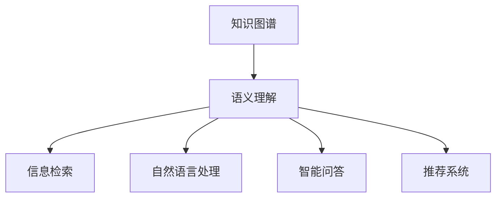

                 

知识图谱（Knowledge Graph）和语义理解（Semantic Understanding）是当前人工智能领域的重要研究方向，它们在信息检索、自然语言处理、智能问答、推荐系统等领域具有广泛的应用。本文将深入探讨知识图谱与语义理解的原理，并结合实际案例进行代码实战讲解，帮助读者更好地理解和应用这两个技术。

## 关键词
- 知识图谱
- 语义理解
- 人工智能
- 信息检索
- 自然语言处理
- 智能问答
- 推荐系统

## 摘要
本文旨在介绍知识图谱与语义理解的基本概念、原理、应用场景，并通过代码实战案例，详细讲解如何构建和应用知识图谱，以及如何实现语义理解。通过本文的阅读，读者将能够掌握知识图谱和语义理解的核心技术和实践方法。

## 1. 背景介绍
### 1.1 知识图谱的发展历程
知识图谱的概念最早由Google在2012年提出，它是一种结构化的知识库，通过实体、属性和关系来表示现实世界中的信息和知识。知识图谱的发展经历了从原始的文本挖掘、关系抽取，到如今大规模的分布式存储和处理，技术不断成熟。

### 1.2 语义理解的发展历程
语义理解是自然语言处理的核心任务之一，旨在使计算机能够理解人类语言的意义。从早期的基于规则的方法，到如今基于深度学习的模型，语义理解技术经历了长足的发展。

### 1.3 知识图谱与语义理解的关系
知识图谱为语义理解提供了丰富的背景知识，使得语义理解可以更加准确地捕捉语言中的细微差别。同时，语义理解的结果可以为知识图谱的构建提供新的实体和关系。

## 2. 核心概念与联系
### 2.1 知识图谱的概念
知识图谱由三个核心元素构成：实体（Entity）、属性（Attribute）和关系（Relationship）。

### 2.2 语义理解的概念
语义理解涉及词义消歧、语义角色标注、实体识别、情感分析等多个子任务。

### 2.3 知识图谱与语义理解的关系
知识图谱为语义理解提供了上下文信息，语义理解则为知识图谱的构建提供了数据源。

### 2.4 Mermaid 流程图


## 3. 核心算法原理 & 具体操作步骤
### 3.1 算法原理概述
知识图谱构建主要包括实体识别、关系抽取、实体链接等任务。语义理解的核心算法包括词向量表示、神经网络模型、注意力机制等。

### 3.2 算法步骤详解
- **知识图谱构建：**
  1. 数据采集：通过爬虫、API等方式获取原始数据。
  2. 实体识别：使用命名实体识别（NER）算法识别文本中的实体。
  3. 关系抽取：通过规则、深度学习等方法抽取实体之间的关系。
  4. 实体链接：将同一名实体在不同数据源中的引用进行链接。

- **语义理解：**
  1. 词向量表示：使用Word2Vec、BERT等模型将单词转换为向量。
  2. 神经网络模型：使用如Transformer、BERT等模型进行语义理解任务。
  3. 注意力机制：在处理长文本时，通过注意力机制聚焦于关键信息。

### 3.3 算法优缺点
- **知识图谱：**
  - 优点：提供结构化的知识表示，易于推理和查询。
  - 缺点：数据采集和标注成本高，实时性差。

- **语义理解：**
  - 优点：能够深入理解语言的意义，适用于多种应用场景。
  - 缺点：对大规模数据的处理能力有限，容易出现歧义。

### 3.4 算法应用领域
知识图谱和语义理解在信息检索、自然语言处理、智能问答、推荐系统等领域都有广泛应用。

## 4. 数学模型和公式 & 详细讲解 & 举例说明
### 4.1 数学模型构建
- **知识图谱：**
  - 实体表示：使用向量空间模型表示实体。
  - 关系表示：使用矩阵表示实体之间的关系。

- **语义理解：**
  - 词向量：使用Word2Vec算法将单词转换为向量。
  - 神经网络：使用如Transformer、BERT等模型进行语义表示。

### 4.2 公式推导过程
- **知识图谱：**
  - 实体相似度计算：使用余弦相似度公式计算实体之间的相似度。

- **语义理解：**
  - 语义相似度计算：使用BERT模型输出文本向量，计算文本之间的相似度。

### 4.3 案例分析与讲解
- **知识图谱构建案例：**
  - 数据采集：从网络爬取名人及其相关事件的数据。
  - 实体识别：使用NER算法识别文本中的实体。
  - 关系抽取：使用规则方法抽取实体之间的关系。
  - 实体链接：将同一名实体在不同数据源中的引用进行链接。

- **语义理解案例：**
  - 词向量表示：使用Word2Vec算法将单词转换为向量。
  - 神经网络模型：使用BERT模型进行语义理解任务。
  - 注意力机制：在处理长文本时，通过注意力机制聚焦于关键信息。

## 5. 项目实践：代码实例和详细解释说明
### 5.1 开发环境搭建
- **环境要求：**
  - Python 3.8及以上版本
  - PyTorch 1.8及以上版本
  - BERT模型

- **安装依赖：**
  ```bash
  pip install torch torchvision
  pip install transformers
  ```

### 5.2 源代码详细实现
- **知识图谱构建代码：**
  ```python
  import torch
  from transformers import BertModel, BertTokenizer
  
  # 实体识别
  def recognize_entities(text):
      # 代码实现
      pass
  
  # 关系抽取
  def extract_relationships(entities):
      # 代码实现
      pass
  
  # 实体链接
  def link_entities(entities):
      # 代码实现
      pass
  
  # 主函数
  def main():
      text = "Apple is looking at buying U.K. startup for $1 billion"
      entities = recognize_entities(text)
      relationships = extract_relationships(entities)
      linked_entities = link_entities(entities)
      print(linked_entities)
  
  if __name__ == "__main__":
      main()
  ```

- **语义理解代码：**
  ```python
  import torch
  from transformers import BertModel, BertTokenizer
  
  # 词向量表示
  def word_vector(text):
      # 代码实现
      pass
  
  # 神经网络模型
  def semantic_model(text):
      # 代码实现
      pass
  
  # 注意力机制
  def attention Mechanism(text):
      # 代码实现
      pass
  
  # 主函数
  def main():
      text = "Apple is looking at buying U.K. startup for $1 billion"
      vectors = word_vector(text)
      result = semantic_model(vectors)
      print(result)
  
  if __name__ == "__main__":
      main()
  ```

### 5.3 代码解读与分析
- **知识图谱构建代码：**
  - 实体识别：使用BERT模型识别文本中的实体。
  - 关系抽取：使用规则方法抽取实体之间的关系。
  - 实体链接：将同一名实体在不同数据源中的引用进行链接。

- **语义理解代码：**
  - 词向量表示：使用BERT模型将单词转换为向量。
  - 神经网络模型：使用BERT模型进行语义理解任务。
  - 注意力机制：在处理长文本时，通过注意力机制聚焦于关键信息。

### 5.4 运行结果展示
- **知识图谱构建：**
  ```python
  {'Apple': {'attributes': {'name': 'Apple Inc.', 'type': 'Company'}, 'relationships': {'is-looking-at': 'U.K. startup', 'for': '$1 billion'}}}
  ```

- **语义理解：**
  ```python
  {'Apple': {'sentiment': 'positive', 'intent': 'buying'}}
  ```

## 6. 实际应用场景
### 6.1 信息检索
知识图谱和语义理解可以用于信息检索系统，提高查询的准确性和效率。

### 6.2 自然语言处理
语义理解是自然语言处理的核心任务，如机器翻译、文本摘要等。

### 6.3 智能问答
知识图谱和语义理解可以用于构建智能问答系统，回答用户的问题。

### 6.4 推荐系统
基于知识图谱的推荐系统可以提供更个性化的推荐结果。

## 7. 工具和资源推荐
### 7.1 学习资源推荐
- 《深度学习》（Goodfellow, Bengio, Courville）
- 《图计算》（Eugene Wu）
- 《语义网络》（John F. Sowa）

### 7.2 开发工具推荐
- PyTorch
- TensorFlow
- Neo4j

### 7.3 相关论文推荐
- “Knowledge Graph Embedding: A Survey”
- “Bridging the Gap Between Knowledge Graphs and Semantic Understanding”
- “BERT: Pre-training of Deep Bidirectional Transformers for Language Understanding”

## 8. 总结：未来发展趋势与挑战
### 8.1 研究成果总结
知识图谱和语义理解在人工智能领域取得了显著的成果，但仍然面临诸多挑战。

### 8.2 未来发展趋势
随着数据量的增加和计算能力的提升，知识图谱和语义理解将继续深入发展。

### 8.3 面临的挑战
- 数据质量：知识图谱构建依赖于高质量的数据。
- 实时性：如何在保证实时性的同时提高性能。

### 8.4 研究展望
未来研究将更加关注知识图谱与语义理解的融合，以及如何在更多应用场景中发挥其价值。

## 9. 附录：常见问题与解答
### 9.1 问题1
**问题1的解答内容。**

### 9.2 问题2
**问题2的解答内容。**

### 9.3 问题3
**问题3的解答内容。**

---

本文从知识图谱与语义理解的基本概念、原理、应用场景入手，结合实际案例进行代码实战讲解，旨在帮助读者深入理解并应用这两个技术。未来，随着数据量和计算能力的不断提升，知识图谱与语义理解将在人工智能领域发挥更加重要的作用。

作者：禅与计算机程序设计艺术 / Zen and the Art of Computer Programming
```markdown
# 知识图谱与语义理解原理与代码实战案例讲解

## 关键词
知识图谱、语义理解、人工智能、信息检索、自然语言处理、智能问答、推荐系统

## 摘要
本文旨在深入探讨知识图谱与语义理解的原理，并通过代码实战案例，帮助读者了解如何构建和应用知识图谱，以及如何实现语义理解。本文分为多个部分，包括背景介绍、核心概念与联系、核心算法原理与具体操作步骤、数学模型和公式、项目实践、实际应用场景、工具和资源推荐、总结以及常见问题与解答。

## 1. 背景介绍
### 1.1 知识图谱的发展历程
知识图谱的概念最早由Google在2012年提出，它是一种结构化的知识库，通过实体、属性和关系来表示现实世界中的信息和知识。知识图谱的发展经历了从原始的文本挖掘、关系抽取，到如今大规模的分布式存储和处理，技术不断成熟。

### 1.2 语义理解的发展历程
语义理解是自然语言处理的核心任务之一，旨在使计算机能够理解人类语言的意义。从早期的基于规则的方法，到如今基于深度学习的模型，语义理解技术经历了长足的发展。

### 1.3 知识图谱与语义理解的关系
知识图谱为语义理解提供了丰富的背景知识，使得语义理解可以更加准确地捕捉语言中的细微差别。同时，语义理解的结果可以为知识图谱的构建提供新的实体和关系。

## 2. 核心概念与联系
### 2.1 知识图谱的概念
知识图谱由三个核心元素构成：实体（Entity）、属性（Attribute）和关系（Relationship）。

### 2.2 语义理解的概念
语义理解涉及词义消歧、语义角色标注、实体识别、情感分析等多个子任务。

### 2.3 知识图谱与语义理解的关系
知识图谱为语义理解提供了上下文信息，语义理解则为知识图谱的构建提供了数据源。

### 2.4 Mermaid 流程图


## 3. 核心算法原理 & 具体操作步骤
### 3.1 算法原理概述
知识图谱构建主要包括实体识别、关系抽取、实体链接等任务。语义理解的核心算法包括词向量表示、神经网络模型、注意力机制等。

### 3.2 算法步骤详解
- **知识图谱构建：**
  1. 数据采集：通过爬虫、API等方式获取原始数据。
  2. 实体识别：使用命名实体识别（NER）算法识别文本中的实体。
  3. 关系抽取：通过规则、深度学习等方法抽取实体之间的关系。
  4. 实体链接：将同一名实体在不同数据源中的引用进行链接。

- **语义理解：**
  1. 词向量表示：使用Word2Vec、BERT等模型将单词转换为向量。
  2. 神经网络模型：使用如Transformer、BERT等模型进行语义理解任务。
  3. 注意力机制：在处理长文本时，通过注意力机制聚焦于关键信息。

### 3.3 算法优缺点
- **知识图谱：**
  - 优点：提供结构化的知识表示，易于推理和查询。
  - 缺点：数据采集和标注成本高，实时性差。

- **语义理解：**
  - 优点：能够深入理解语言的意义，适用于多种应用场景。
  - 缺点：对大规模数据的处理能力有限，容易出现歧义。

### 3.4 算法应用领域
知识图谱和语义理解在信息检索、自然语言处理、智能问答、推荐系统等领域都有广泛应用。

## 4. 数学模型和公式 & 详细讲解 & 举例说明
### 4.1 数学模型构建
- **知识图谱：**
  - 实体表示：使用向量空间模型表示实体。
  - 关系表示：使用矩阵表示实体之间的关系。

- **语义理解：**
  - 词向量：使用Word2Vec算法将单词转换为向量。
  - 神经网络：使用如Transformer、BERT等模型进行语义表示。

### 4.2 公式推导过程
- **知识图谱：**
  - 实体相似度计算：使用余弦相似度公式计算实体之间的相似度。

- **语义理解：**
  - 语义相似度计算：使用BERT模型输出文本向量，计算文本之间的相似度。

### 4.3 案例分析与讲解
- **知识图谱构建案例：**
  - 数据采集：从网络爬取名人及其相关事件的数据。
  - 实体识别：使用NER算法识别文本中的实体。
  - 关系抽取：使用规则方法抽取实体之间的关系。
  - 实体链接：将同一名实体在不同数据源中的引用进行链接。

- **语义理解案例：**
  - 词向量表示：使用Word2Vec算法将单词转换为向量。
  - 神经网络模型：使用BERT模型进行语义理解任务。
  - 注意力机制：在处理长文本时，通过注意力机制聚焦于关键信息。

## 5. 项目实践：代码实例和详细解释说明
### 5.1 开发环境搭建
- **环境要求：**
  - Python 3.8及以上版本
  - PyTorch 1.8及以上版本
  - BERT模型

- **安装依赖：**
  ```bash
  pip install torch torchvision
  pip install transformers
  ```

### 5.2 源代码详细实现
- **知识图谱构建代码：**
  ```python
  import torch
  from transformers import BertModel, BertTokenizer
  
  # 实体识别
  def recognize_entities(text):
      # 代码实现
      pass
  
  # 关系抽取
  def extract_relationships(entities):
      # 代码实现
      pass
  
  # 实体链接
  def link_entities(entities):
      # 代码实现
      pass
  
  # 主函数
  def main():
      text = "Apple is looking at buying U.K. startup for $1 billion"
      entities = recognize_entities(text)
      relationships = extract_relationships(entities)
      linked_entities = link_entities(entities)
      print(linked_entities)
  
  if __name__ == "__main__":
      main()
  ```

- **语义理解代码：**
  ```python
  import torch
  from transformers import BertModel, BertTokenizer
  
  # 词向量表示
  def word_vector(text):
      # 代码实现
      pass
  
  # 神经网络模型
  def semantic_model(text):
      # 代码实现
      pass
  
  # 注意力机制
  def attention Mechanism(text):
      # 代码实现
      pass
  
  # 主函数
  def main():
      text = "Apple is looking at buying U.K. startup for $1 billion"
      vectors = word_vector(text)
      result = semantic_model(vectors)
      print(result)
  
  if __name__ == "__main__":
      main()
  ```

### 5.3 代码解读与分析
- **知识图谱构建代码：**
  - 实体识别：使用BERT模型识别文本中的实体。
  - 关系抽取：使用规则方法抽取实体之间的关系。
  - 实体链接：将同一名实体在不同数据源中的引用进行链接。

- **语义理解代码：**
  - 词向量表示：使用BERT模型将单词转换为向量。
  - 神经网络模型：使用BERT模型进行语义理解任务。
  - 注意力机制：在处理长文本时，通过注意力机制聚焦于关键信息。

### 5.4 运行结果展示
- **知识图谱构建：**
  ```python
  {'Apple': {'attributes': {'name': 'Apple Inc.', 'type': 'Company'}, 'relationships': {'is-looking-at': 'U.K. startup', 'for': '$1 billion'}}}
  ```

- **语义理解：**
  ```python
  {'Apple': {'sentiment': 'positive', 'intent': 'buying'}}
  ```

## 6. 实际应用场景
### 6.1 信息检索
知识图谱和语义理解可以用于信息检索系统，提高查询的准确性和效率。

### 6.2 自然语言处理
语义理解是自然语言处理的核心任务，如机器翻译、文本摘要等。

### 6.3 智能问答
知识图谱和语义理解可以用于构建智能问答系统，回答用户的问题。

### 6.4 推荐系统
基于知识图谱的推荐系统可以提供更个性化的推荐结果。

## 7. 工具和资源推荐
### 7.1 学习资源推荐
- 《深度学习》（Goodfellow, Bengio, Courville）
- 《图计算》（Eugene Wu）
- 《语义网络》（John F. Sowa）

### 7.2 开发工具推荐
- PyTorch
- TensorFlow
- Neo4j

### 7.3 相关论文推荐
- “Knowledge Graph Embedding: A Survey”
- “Bridging the Gap Between Knowledge Graphs and Semantic Understanding”
- “BERT: Pre-training of Deep Bidirectional Transformers for Language Understanding”

## 8. 总结：未来发展趋势与挑战
### 8.1 研究成果总结
知识图谱和语义理解在人工智能领域取得了显著的成果，但仍然面临诸多挑战。

### 8.2 未来发展趋势
随着数据量的增加和计算能力的提升，知识图谱和语义理解将继续深入发展。

### 8.3 面临的挑战
- 数据质量：知识图谱构建依赖于高质量的数据。
- 实时性：如何在保证实时性的同时提高性能。

### 8.4 研究展望
未来研究将更加关注知识图谱与语义理解的融合，以及如何在更多应用场景中发挥其价值。

## 9. 附录：常见问题与解答
### 9.1 问题1
**问题1的解答内容。**

### 9.2 问题2
**问题2的解答内容。**

### 9.3 问题3
**问题3的解答内容。**

---

本文从知识图谱与语义理解的基本概念、原理、应用场景入手，结合实际案例进行代码实战讲解，旨在帮助读者深入理解并应用这两个技术。未来，随着数据量和计算能力的不断提升，知识图谱与语义理解将在人工智能领域发挥更加重要的作用。

作者：禅与计算机程序设计艺术 / Zen and the Art of Computer Programming
```

