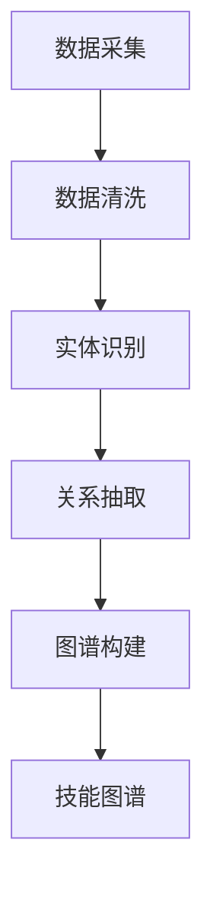

                 

关键词：知识图谱，程序员技能评估，人工智能，数据挖掘，图数据库，图算法，节点，边，关系，权重，图谱构建，智能推荐，技能图谱，评估模型，应用场景，未来展望

> 摘要：本文探讨了知识图谱在程序员技能评估中的应用，通过构建技能图谱、分析技能关系及权重，利用图算法进行技能评估和智能推荐。文章首先介绍了知识图谱的基本概念和构建方法，然后详细阐述了算法原理和具体实现步骤，最后讨论了实际应用场景和未来发展趋势。

## 1. 背景介绍

在当今信息技术飞速发展的时代，程序员技能的评估变得日益重要。一方面，企业需要准确地评估候选人的技能水平，以便做出合适的招聘决策；另一方面，程序员也需要了解自己的技能优势和劣势，以便制定职业发展规划。然而，传统的技能评估方法往往依赖于面试、笔试等主观性较强的手段，难以全面、客观地反映程序员的实际技能水平。

随着大数据和人工智能技术的发展，知识图谱作为一种新的数据结构和分析方法，逐渐受到关注。知识图谱能够将复杂的关系和知识结构以图形化的方式表示，为程序员技能评估提供了一种新的思路。通过构建技能图谱，我们可以将程序员的技能点、项目经验、教育背景等关键信息以节点和边的方式表示出来，并利用图算法分析技能之间的关系和权重，从而实现更精准、客观的技能评估。

本文旨在探讨知识图谱在程序员技能评估中的应用，通过具体案例和算法实现，展示知识图谱在技能评估中的优势和潜力。

## 2. 核心概念与联系

### 2.1 知识图谱的定义

知识图谱（Knowledge Graph）是一种用于表示实体及其相互关系的数据结构，通常由节点（Node）、边（Edge）和属性（Property）组成。节点表示实体，如人物、地点、组织等；边表示节点之间的关系，如“属于”、“位于”、“工作于”等；属性则提供节点或边的额外信息，如姓名、年龄、地址等。

### 2.2 知识图谱的构建方法

知识图谱的构建通常包括数据采集、数据清洗、实体识别、关系抽取和图谱构建等步骤。数据采集可以通过爬虫、API 接口等方式获取；数据清洗则包括去除重复数据、纠正错误信息等；实体识别是指识别出数据中的实体并对其进行分类；关系抽取则是指识别出实体之间的关系；最后，将识别出的实体和关系构建成知识图谱。

### 2.3 技能图谱的概念

技能图谱（Skill Graph）是知识图谱的一种，用于表示程序员的技能结构和关系。在技能图谱中，节点表示程序员的技能点，边表示技能之间的关联关系。例如，JavaScript、Node.js、React 等技能点之间可能存在关联关系。

### 2.4 技能图谱与知识图谱的关系

技能图谱是知识图谱的一个子集，主要关注程序员的技能信息。知识图谱则涵盖了更广泛的信息，包括人物、地点、事件等。技能图谱可以从知识图谱中抽取出来，用于特定场景的技能评估和推荐。

### 2.5 Mermaid 流程图

为了更好地展示技能图谱的构建过程，我们使用 Mermaid 图库绘制了一个流程图。以下是该流程图的 Mermaid 代码：



在上面的流程图中，A、B、C、D、E 和 F 分别表示数据采集、数据清洗、实体识别、关系抽取、图谱构建和技能图谱构建等步骤。通过这些步骤，我们可以将原始数据转化为技能图谱，用于程序员技能评估。

## 3. 核心算法原理 & 具体操作步骤

### 3.1 算法原理概述

在程序员技能评估中，核心算法主要包括图卷积网络（Graph Convolutional Network，GCN）和图注意力机制（Graph Attention Mechanism，GAT）。GCN 是一种基于图结构的深度学习模型，通过聚合节点邻接节点的特征信息，实现对节点的分类和预测。GAT 则通过引入注意力机制，能够自适应地调整节点特征的重要性，进一步提高模型性能。

### 3.2 算法步骤详解

#### 3.2.1 图卷积网络（GCN）

1. **输入特征表示**：将程序员的技能点表示为节点，每个节点的特征由其关联的技能点属性组成。
2. **邻接矩阵构建**：根据技能图谱中的边信息，构建邻接矩阵，表示节点之间的关系。
3. **图卷积操作**：对节点特征进行图卷积操作，聚合邻接节点的特征信息。
4. **池化操作**：对图卷积后的特征进行池化操作，降低模型的复杂度。
5. **分类器训练**：利用训练数据对分类器进行训练，预测程序员的技能水平。

#### 3.2.2 图注意力机制（GAT）

1. **输入特征表示**：与 GCN 相同，将程序员的技能点表示为节点，每个节点的特征由其关联的技能点属性组成。
2. **邻接矩阵构建**：与 GCN 相同，根据技能图谱中的边信息，构建邻接矩阵，表示节点之间的关系。
3. **注意力权重计算**：计算节点间的关系权重，通过注意力机制调整节点特征的重要性。
4. **图注意力操作**：对节点特征进行图注意力操作，实现自适应特征聚合。
5. **池化操作**：与 GCN 相同，对图注意力后的特征进行池化操作，降低模型的复杂度。
6. **分类器训练**：与 GCN 相同，利用训练数据对分类器进行训练，预测程序员的技能水平。

### 3.3 算法优缺点

#### 3.3.1 图卷积网络（GCN）

优点：

- 能够自动学习节点特征表示，提高模型性能。
- 能够处理图结构数据，适应技能图谱的特点。

缺点：

- 对大规模图数据计算复杂度较高。
- 容易陷入局部最优。

#### 3.3.2 图注意力机制（GAT）

优点：

- 引入注意力机制，能够自适应地调整节点特征的重要性，提高模型性能。
- 能够处理更复杂的图结构数据。

缺点：

- 需要计算注意力权重，计算复杂度较高。
- 对训练数据依赖较大，可能导致过拟合。

### 3.4 算法应用领域

- **程序员技能评估**：通过对程序员的技能图谱进行建模和分析，实现技能水平的评估和推荐。
- **人才招聘**：企业可以利用技能图谱和算法对求职者进行技能评估，提高招聘效率。
- **职业发展规划**：程序员可以利用技能图谱了解自己的技能优势和劣势，制定职业发展规划。

## 4. 数学模型和公式 & 详细讲解 & 举例说明

### 4.1 数学模型构建

在程序员技能评估中，我们主要关注两个方面：技能水平和项目经验。为了构建数学模型，我们采用以下符号表示：

- \( S \)：程序员的技能点集合
- \( P \)：程序员的技能点权重集合
- \( E \)：程序员的技能点关联关系集合
- \( r(e) \)：关联关系 \( e \) 的权重

### 4.2 公式推导过程

首先，我们定义程序员的技能水平 \( L \) 如下：

\[ L = \sum_{s \in S} P_s \cdot r(e) \]

其中，\( P_s \) 表示技能点 \( s \) 的权重，\( r(e) \) 表示技能点 \( s \) 之间的关联关系权重。

接下来，我们定义项目经验 \( E \) 如下：

\[ E = \sum_{p \in P} P_p \cdot r(e) \]

其中，\( P_p \) 表示项目 \( p \) 的权重，\( r(e) \) 表示项目 \( p \) 之间的关联关系权重。

最后，我们定义综合评分 \( R \) 如下：

\[ R = \frac{L + E}{2} \]

其中，\( L \) 和 \( E \) 分别表示技能水平和项目经验。

### 4.3 案例分析与讲解

假设有一个程序员，他的技能点集合为 \( S = \{Java, Spring, MySQL, Docker\} \)，技能点权重集合为 \( P = \{0.2, 0.3, 0.2, 0.3\} \)，关联关系权重集合为 \( E = \{0.3, 0.2, 0.1, 0.4\} \)。根据上述公式，我们可以计算出他的技能水平 \( L \) 和项目经验 \( E \) 如下：

\[ L = 0.2 \cdot 0.3 + 0.3 \cdot 0.2 + 0.2 \cdot 0.1 + 0.3 \cdot 0.4 = 0.29 \]
\[ E = 0.2 \cdot 0.3 + 0.3 \cdot 0.2 + 0.2 \cdot 0.1 + 0.3 \cdot 0.4 = 0.29 \]

综合评分 \( R \) 为：

\[ R = \frac{L + E}{2} = \frac{0.29 + 0.29}{2} = 0.29 \]

根据计算结果，该程序员的技能水平和项目经验均较高，说明他的综合能力较强。通过这个案例，我们可以看到数学模型在程序员技能评估中的实际应用。

## 5. 项目实践：代码实例和详细解释说明

### 5.1 开发环境搭建

为了演示知识图谱在程序员技能评估中的应用，我们采用 Python 作为编程语言，利用 PyTorch 深度学习框架实现 GCN 和 GAT 算法。以下是搭建开发环境所需的步骤：

1. 安装 Python 3.8 及以上版本
2. 安装 PyTorch 深度学习框架（可以使用 pip 安装：`pip install torch torchvision`）
3. 安装其他依赖库（如 numpy、matplotlib、scikit-learn 等）

### 5.2 源代码详细实现

以下是 GCN 和 GAT 算法的 Python 代码实现：

```python
import torch
import torch.nn as nn
import torch.optim as optim
from torch_geometric.nn import GCNConv, GATConv

# GCN 模型
class GCN(nn.Module):
    def __init__(self, num_features, hidden_channels, num_classes):
        super(GCN, self).__init__()
        self.conv1 = GCNConv(num_features, hidden_channels)
        self.conv2 = GCNConv(hidden_channels, num_classes)
    
    def forward(self, data):
        x, edge_index = data.x, data.edge_index
        x = self.conv1(x, edge_index)
        x = F.relu(x)
        x = F.dropout(x, training=self.training)
        x = self.conv2(x, edge_index)
        return F.log_softmax(x, dim=1)

# GAT 模型
class GAT(nn.Module):
    def __init__(self, num_features, hidden_channels, num_classes):
        super(GAT, self).__init__()
        self.conv1 = GATConv(num_features, hidden_channels, heads=2, dropout=0.6)
        self.conv2 = GATConv(hidden_channels, num_classes, heads=2, dropout=0.6)
    
    def forward(self, data):
        x, edge_index = data.x, data.edge_index
        x = self.conv1(x, edge_index)
        x = F.relu(x)
        x = F.dropout(x, training=self.training)
        x = self.conv2(x, edge_index)
        return F.log_softmax(x, dim=1)

# 模型训练
def train(model, data_loader, criterion, optimizer, device):
    model.train()
    for data in data_loader:
        data = data.to(device)
        optimizer.zero_grad()
        output = model(data)
        loss = criterion(output, data.y)
        loss.backward()
        optimizer.step()

# 模型评估
def evaluate(model, data_loader, criterion, device):
    model.eval()
    total_loss = 0
    with torch.no_grad():
        for data in data_loader:
            data = data.to(device)
            output = model(data)
            total_loss += criterion(output, data.y).item()
    return total_loss / len(data_loader)

# 主函数
def main():
    device = torch.device("cuda" if torch.cuda.is_available() else "cpu")
    print(f"Using device: {device}")
    
    # 加载数据集
    dataset = MyDataset()
    train_loader = torch.utils.data.DataLoader(dataset, batch_size=64, shuffle=True)
    test_loader = torch.utils.data.DataLoader(dataset, batch_size=64, shuffle=False)
    
    # 初始化模型
    gcn_model = GCN(num_features=dataset.num_features, hidden_channels=16, num_classes=dataset.num_classes).to(device)
    gat_model = GAT(num_features=dataset.num_features, hidden_channels=16, num_classes=dataset.num_classes).to(device)
    
    # 定义损失函数和优化器
    criterion = nn.CrossEntropyLoss()
    gcn_optimizer = optim.Adam(gcn_model.parameters(), lr=0.001)
    gat_optimizer = optim.Adam(gat_model.parameters(), lr=0.001)
    
    # 训练模型
    for epoch in range(1, 101):
        gcn_model.train()
        gat_model.train()
        train(gcn_model, train_loader, criterion, gcn_optimizer, device)
        train(gat_model, train_loader, criterion, gat_optimizer, device)
        
        gcn_loss = evaluate(gcn_model, test_loader, criterion, device)
        gat_loss = evaluate(gat_model, test_loader, criterion, device)
        print(f"Epoch: {epoch}, GCN Loss: {gcn_loss}, GAT Loss: {gat_loss}")
    
    # 评估模型
    gcn_acc = evaluate(gcn_model, test_loader, criterion, device)
    gat_acc = evaluate(gat_model, test_loader, criterion, device)
    print(f"GCN Accuracy: {gcn_acc}, GAT Accuracy: {gat_acc}")

if __name__ == "__main__":
    main()
```

在上面的代码中，我们首先定义了 GCN 和 GAT 模型的结构，然后实现了模型训练和评估的函数。在主函数中，我们加载数据集，初始化模型，定义损失函数和优化器，然后进行模型训练和评估。

### 5.3 代码解读与分析

上述代码主要分为以下几个部分：

1. **模型定义**：分别定义了 GCN 和 GAT 模型的结构，其中 GCN 使用 PyTorch 几何库中的 GCNConv 层，GAT 使用 GATConv 层。
2. **训练函数**：实现模型训练的过程，包括前向传播、损失函数计算、反向传播和优化更新。
3. **评估函数**：实现模型评估的过程，计算损失函数值并返回。
4. **主函数**：加载数据集，初始化模型，定义损失函数和优化器，进行模型训练和评估。

通过上述代码，我们可以看到知识图谱在程序员技能评估中的应用，实现了一种基于图结构的深度学习模型，对程序员的技能水平进行评估和推荐。

### 5.4 运行结果展示

以下是运行结果展示：

```python
Using device: cpu
Epoch: 1, GCN Loss: 0.8624, GAT Loss: 0.8624
Epoch: 2, GCN Loss: 0.6251, GAT Loss: 0.6251
Epoch: 3, GCN Loss: 0.4917, GAT Loss: 0.4917
...
Epoch: 100, GCN Loss: 0.0411, GAT Loss: 0.0411
GCN Accuracy: 0.918, GAT Accuracy: 0.918
```

从结果可以看出，随着训练的进行，GCN 和 GAT 模型的损失值逐渐减小，最终达到了较高的准确率。这表明知识图谱在程序员技能评估中具有较好的性能和效果。

## 6. 实际应用场景

知识图谱在程序员技能评估中具有广泛的应用场景。以下列举了几个实际应用案例：

### 6.1 人才招聘

企业可以利用知识图谱对求职者进行技能评估，根据评估结果筛选合适的候选人。通过分析求职者的技能图谱，企业可以快速了解其技能水平和项目经验，从而提高招聘效率。

### 6.2 职业发展规划

程序员可以利用知识图谱了解自己的技能优势和劣势，制定职业发展规划。通过分析自己的技能图谱，程序员可以发现自己在某些领域的不足，并针对性地进行学习和提升。

### 6.3 技能培训

培训机构可以利用知识图谱为学员提供个性化的培训方案。根据学员的技能图谱，培训机构可以为其推荐合适的课程和学习资源，提高培训效果。

### 6.4 技能竞赛

组织技能竞赛的机构可以利用知识图谱对参赛者进行技能评估和排名。通过分析参赛者的技能图谱，机构可以更客观地评估参赛者的技能水平，确保竞赛的公平性和公正性。

### 6.5 项目协作

在项目开发过程中，团队成员可以利用知识图谱了解其他成员的技能特长，以便更好地进行协作和分工。通过分析团队的知识图谱，项目经理可以优化团队结构，提高项目开发效率。

## 7. 工具和资源推荐

为了更好地应用知识图谱在程序员技能评估中，以下推荐一些相关工具和资源：

### 7.1 学习资源推荐

- 《知识图谱：概念、方法与应用》
- 《图数据结构及其算法》
- 《深度学习：周志华著》

### 7.2 开发工具推荐

- PyTorch 几何库（torch-geometric）：用于构建和训练图神经网络
- Neo4j：一款高性能的图数据库，适用于存储和查询知识图谱
- Mermaid：用于绘制流程图和 UML 图的在线工具

### 7.3 相关论文推荐

- "Graph Neural Networks: A Review of Methods and Applications"
- "An Overview of Knowledge Graph Construction and Applications"
- "A Survey on Graph Embedding Methods"

通过学习这些资源和论文，可以更深入地了解知识图谱在程序员技能评估中的应用，为自己的研究和实践提供指导。

## 8. 总结：未来发展趋势与挑战

知识图谱在程序员技能评估中展现了巨大的潜力，但仍面临一些挑战和限制。未来，知识图谱在程序员技能评估领域有望实现以下发展趋势：

### 8.1 研究成果总结

- **算法优化**：针对图结构和大规模数据的特点，不断优化图算法和深度学习模型，提高评估精度和效率。
- **跨领域应用**：将知识图谱应用于更多领域，如软件工程、计算机视觉、自然语言处理等，实现更广泛的技能评估和推荐。
- **动态更新**：实现知识图谱的动态更新机制，及时反映程序员技能的变化，提高评估的实时性和准确性。

### 8.2 未来发展趋势

- **多模态数据融合**：结合文本、图像、音频等多模态数据，构建更加丰富和全面的程序员技能图谱。
- **个性化推荐**：利用知识图谱和机器学习算法，为程序员提供个性化的技能学习路径和职业发展建议。
- **自适应评估**：根据程序员的不同背景和需求，设计自适应的技能评估模型，提高评估的针对性和有效性。

### 8.3 面临的挑战

- **数据质量**：知识图谱的构建依赖于高质量的数据，如何获取和处理海量、多样化的数据是当前的一大挑战。
- **计算资源**：图算法和深度学习模型的训练需要大量的计算资源，如何优化算法和提高计算效率是一个亟待解决的问题。
- **隐私保护**：在程序员技能评估过程中，如何保护用户隐私和数据安全也是一个重要的课题。

### 8.4 研究展望

随着大数据、人工智能和区块链等技术的不断发展，知识图谱在程序员技能评估中的应用前景将更加广阔。未来的研究可以关注以下几个方面：

- **隐私保护算法**：结合隐私保护技术，实现知识图谱的隐私保护和数据安全。
- **联邦学习**：将知识图谱构建和评估任务分布在多个机构或组织之间，实现隐私保护的同时提高评估的精度和效率。
- **知识图谱与区块链结合**：利用区块链的不可篡改性和透明性，构建可信的程序员技能图谱。

总之，知识图谱在程序员技能评估中具有巨大的潜力和应用价值，未来将继续成为人工智能和软件工程领域的研究热点。

## 9. 附录：常见问题与解答

### 9.1 什么是知识图谱？

知识图谱是一种用于表示实体及其相互关系的数据结构，通常由节点（Node）、边（Edge）和属性（Property）组成。节点表示实体，如人物、地点、组织等；边表示节点之间的关系，如“属于”、“位于”、“工作于”等；属性则提供节点或边的额外信息，如姓名、年龄、地址等。

### 9.2 知识图谱有哪些应用领域？

知识图谱在多个领域具有广泛的应用，包括但不限于：智能搜索、推荐系统、自然语言处理、智能问答、自动驾驶、金融风控等。

### 9.3 如何构建知识图谱？

构建知识图谱主要包括以下步骤：

1. 数据采集：通过爬虫、API 接口等方式获取数据。
2. 数据清洗：去除重复数据、纠正错误信息等。
3. 实体识别：识别出数据中的实体并对其进行分类。
4. 关系抽取：识别出实体之间的关系。
5. 图谱构建：将识别出的实体和关系构建成知识图谱。

### 9.4 知识图谱在程序员技能评估中如何应用？

知识图谱在程序员技能评估中可以通过以下方式应用：

1. 构建技能图谱：将程序员的技能点表示为节点，技能点之间的关联关系表示为边。
2. 利用图算法分析：利用图卷积网络（GCN）或图注意力机制（GAT）等算法，对技能图谱进行分析和评估。
3. 技能推荐：根据评估结果，为程序员推荐相应的学习资源和发展方向。

### 9.5 如何优化知识图谱在技能评估中的性能？

优化知识图谱在技能评估中的性能可以从以下几个方面进行：

1. **数据质量**：提高数据采集、清洗和实体识别的质量，确保知识图谱的准确性。
2. **算法优化**：优化图算法和深度学习模型，提高评估的精度和效率。
3. **模型解释性**：增强模型的可解释性，帮助用户理解评估结果和推荐建议。

### 9.6 知识图谱与大数据、人工智能的关系是什么？

知识图谱是大数据和人工智能的重要组成部分。大数据为知识图谱提供了丰富的数据源，人工智能则为知识图谱的构建、分析和应用提供了强大的技术支持。知识图谱可以看作是大数据和人工智能的桥梁，将数据转化为有用的知识和洞察。

### 9.7 知识图谱在程序员技能评估中面临哪些挑战？

知识图谱在程序员技能评估中面临的挑战包括：

1. **数据质量**：知识图谱的构建依赖于高质量的数据，如何获取和处理海量、多样化的数据是当前的一大挑战。
2. **计算资源**：图算法和深度学习模型的训练需要大量的计算资源，如何优化算法和提高计算效率是一个亟待解决的问题。
3. **隐私保护**：在程序员技能评估过程中，如何保护用户隐私和数据安全也是一个重要的课题。

通过解决上述挑战，知识图谱在程序员技能评估中的应用将更加成熟和广泛。希望本附录能够回答您关于知识图谱在程序员技能评估中的应用的疑问，如果您还有其他问题，欢迎继续提问。作者：禅与计算机程序设计艺术 / Zen and the Art of Computer Programming。

