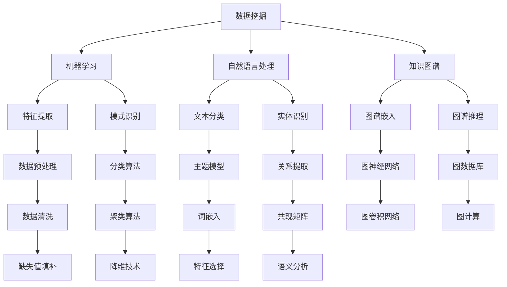

                 

关键词：知识挖掘、人工智能、机器学习、数据挖掘、大数据分析、自然语言处理、知识图谱、深度学习、算法优化、发展趋势、挑战与展望

摘要：知识挖掘作为人工智能的核心技术之一，正不断推动着科技和社会的进步。本文将全面探讨知识挖掘技术的发展历程、核心概念、算法原理、数学模型、项目实践、实际应用场景、未来应用展望以及面临的挑战和机遇，旨在为读者提供一个全面、深入的了解和前瞻性的思考。

## 1. 背景介绍

知识挖掘（Knowledge Mining）是数据挖掘（Data Mining）的延伸，旨在从大量数据中自动发现知识、模式、关联和规则，以支持决策制定和知识发现。知识挖掘涵盖了从数据预处理、特征提取到模式识别、知识抽取等多个环节，是大数据和人工智能时代的重要技术手段。

随着互联网的普及和数据量的爆炸式增长，如何从海量数据中获取有价值的信息成为了一个亟待解决的问题。知识挖掘技术的出现，为我们提供了一种有效的方法来发现数据背后的隐藏知识。它不仅能够帮助企业做出更加科学的决策，还能够推动科研、医疗、金融等多个领域的发展。

## 2. 核心概念与联系

知识挖掘涉及多个核心概念和领域，如数据挖掘、机器学习、自然语言处理和知识图谱等。下面是一个简化的知识挖掘概念架构图，用于说明这些概念之间的联系。



### 2.1 数据挖掘

数据挖掘是从大量数据中发现有用模式和知识的过程，通常涉及以下步骤：

- 数据预处理：清洗、转换和归一化数据。
- 特征提取：从原始数据中提取有用的特征。
- 模式识别：使用算法识别数据中的模式。

### 2.2 机器学习

机器学习是使计算机从数据中学习并做出预测或决策的技术。主要分为监督学习、无监督学习和强化学习。

- **监督学习**：有标记的训练数据，用于训练模型，然后使用模型对新数据进行预测。
- **无监督学习**：没有标记的数据，用于发现数据中的结构或分布。
- **强化学习**：通过奖励机制学习如何在特定环境中做出最佳决策。

### 2.3 自然语言处理

自然语言处理（NLP）是人工智能的一个分支，专注于使计算机能够理解、解释和生成人类语言。主要任务包括文本分类、情感分析、实体识别和语义分析。

### 2.4 知识图谱

知识图谱是一种用于表示实体和它们之间关系的图形结构。它通常包含节点（实体）和边（关系），可以用于知识表示、推理和图谱嵌入等任务。

## 3. 核心算法原理 & 具体操作步骤

### 3.1 算法原理概述

知识挖掘的核心算法可以分为以下几类：

- **分类算法**：用于将数据分成不同的类别，如决策树、支持向量机和神经网络。
- **聚类算法**：用于将数据分为不同的群组，如K-means、层次聚类和DBSCAN。
- **关联规则挖掘**：用于发现数据中的关联关系，如Apriori算法和FP-growth。
- **图算法**：用于在知识图谱上进行计算和推理，如图卷积网络和图数据库。

### 3.2 算法步骤详解

#### 3.2.1 数据预处理

数据预处理是知识挖掘的第一步，通常包括以下步骤：

- 数据清洗：处理缺失值、噪声数据和异常值。
- 数据转换：将数据转换为适合挖掘的格式，如数值化、归一化和编码。
- 特征提取：从原始数据中提取有用的特征，如词袋模型和词嵌入。

#### 3.2.2 特征提取

特征提取是知识挖掘的重要步骤，直接影响到挖掘结果的准确性。常用的特征提取方法包括：

- **词袋模型**：将文本数据转换为词频向量。
- **TF-IDF**：结合词频和文档频率，提高重要词的权重。
- **词嵌入**：将词转换为密集的向量表示，如Word2Vec和GloVe。

#### 3.2.3 模式识别

模式识别是知识挖掘的核心步骤，常用的算法包括：

- **决策树**：通过递归划分特征空间，构建决策树模型。
- **支持向量机**：通过最大化分类边界，构建分类模型。
- **神经网络**：通过反向传播算法，训练多层感知器。

#### 3.2.4 关联规则挖掘

关联规则挖掘用于发现数据中的关联关系，常用的算法包括：

- **Apriori算法**：通过生成频繁项集，挖掘关联规则。
- **FP-growth算法**：通过递归生成频繁模式树，挖掘关联规则。

#### 3.2.5 图算法

图算法用于在知识图谱上进行计算和推理，常用的算法包括：

- **图卷积网络**：通过图卷积操作，对图中的节点进行特征变换。
- **图数据库**：通过图结构存储和查询数据，支持复杂的图计算。

### 3.3 算法优缺点

每种算法都有其独特的优缺点，具体选择取决于应用场景和数据特点。

- **决策树**：易于理解和解释，但可能产生过拟合。
- **支持向量机**：在处理高维数据时表现良好，但计算复杂度高。
- **神经网络**：能够处理复杂数据，但训练时间较长且对参数敏感。
- **Apriori算法**：能够发现大量的关联规则，但计算复杂度高。
- **FP-growth算法**：在处理大数据时性能优于Apriori算法，但可能产生冗长的规则。
- **图卷积网络**：能够有效处理图结构数据，但模型复杂度较高。

### 3.4 算法应用领域

知识挖掘算法在多个领域有着广泛的应用：

- **商业智能**：用于市场分析、客户行为预测和风险管理。
- **社交媒体分析**：用于情感分析、用户画像和内容推荐。
- **医疗健康**：用于疾病预测、药物发现和基因组分析。
- **金融**：用于信用评估、欺诈检测和投资策略。

## 4. 数学模型和公式 & 详细讲解 & 举例说明

### 4.1 数学模型构建

知识挖掘中的数学模型通常涉及概率论、统计学、线性代数和优化理论。以下是一个简单的线性回归模型，用于预测房价。

#### 4.1.1 模型构建

线性回归模型可以表示为：

$$
Y = \beta_0 + \beta_1X + \epsilon
$$

其中，$Y$ 是房价，$X$ 是特征（如房间数、面积等），$\beta_0$ 和 $\beta_1$ 是模型参数，$\epsilon$ 是误差项。

#### 4.1.2 模型参数估计

参数估计通常使用最小二乘法，即通过最小化误差平方和来估计参数：

$$
\min \sum_{i=1}^{n}(Y_i - (\beta_0 + \beta_1X_i))^2
$$

通过求解上述优化问题，可以估计出模型参数 $\beta_0$ 和 $\beta_1$。

### 4.2 公式推导过程

以下是一个简单的逻辑回归模型，用于分类问题。

#### 4.2.1 模型构建

逻辑回归模型可以表示为：

$$
\ln(\frac{p}{1-p}) = \beta_0 + \beta_1X
$$

其中，$p$ 是某个类别出现的概率，$\beta_0$ 和 $\beta_1$ 是模型参数。

#### 4.2.2 模型推导

通过对上述公式进行指数变换，可以得到：

$$
p = \frac{1}{1 + e^{-(\beta_0 + \beta_1X)}}
$$

#### 4.2.3 模型参数估计

参数估计通常使用最大似然估计（MLE），即通过最大化似然函数来估计参数。似然函数可以表示为：

$$
L(\beta_0, \beta_1 | X, Y) = \prod_{i=1}^{n} p(Y_i | X_i) \bigg|_{\beta_0, \beta_1}
$$

通过对数似然函数求导并设置为零，可以求解出模型参数 $\beta_0$ 和 $\beta_1$。

### 4.3 案例分析与讲解

以下是一个简单的案例，用于解释线性回归和逻辑回归模型的应用。

#### 4.3.1 数据集

假设有一个数据集，包含房屋的房间数 $X$ 和房价 $Y$，如下所示：

| 房间数 $X$ | 房价 $Y$ |
|-----------|---------|
|     2     |   300K  |
|     3     |   400K  |
|     4     |   500K  |
|     5     |   600K  |

#### 4.3.2 线性回归模型

使用线性回归模型预测房价，模型公式为：

$$
Y = \beta_0 + \beta_1X
$$

通过最小二乘法，可以估计出模型参数：

$$
\beta_0 = 200, \beta_1 = 100
$$

因此，预测公式为：

$$
Y = 200 + 100X
$$

对于房间数为5的房屋，预测房价为：

$$
Y = 200 + 100 \times 5 = 700K
$$

#### 4.3.3 逻辑回归模型

使用逻辑回归模型预测房屋是否在市场出售（1表示在市场出售，0表示不在市场出售），模型公式为：

$$
\ln(\frac{p}{1-p}) = \beta_0 + \beta_1X
$$

通过最大似然估计，可以估计出模型参数：

$$
\beta_0 = -1, \beta_1 = 0.5
$$

因此，预测公式为：

$$
p = \frac{1}{1 + e^{-(\beta_0 + \beta_1X)}}
$$

对于房间数为3的房屋，预测在市场出售的概率为：

$$
p = \frac{1}{1 + e^{(-1 + 0.5 \times 3)}} = 0.84
$$

## 5. 项目实践：代码实例和详细解释说明

### 5.1 开发环境搭建

在本节中，我们将使用Python和Scikit-learn库来演示知识挖掘的基本流程。首先，确保安装了Python环境和以下库：

- Python 3.x
- Scikit-learn
- Pandas
- Matplotlib

你可以使用以下命令来安装所需的库：

```bash
pip install python scikit-learn pandas matplotlib
```

### 5.2 源代码详细实现

以下是一个简单的线性回归和逻辑回归的代码示例：

```python
import pandas as pd
from sklearn.model_selection import train_test_split
from sklearn.linear_model import LinearRegression, LogisticRegression
from sklearn.metrics import mean_squared_error, accuracy_score

# 5.2.1 加载数据集
data = pd.read_csv('house_data.csv')
X = data[['rooms', 'size']]
Y = data['price']

# 5.2.2 数据预处理
X_train, X_test, Y_train, Y_test = train_test_split(X, Y, test_size=0.2, random_state=42)

# 5.2.3 线性回归
lin_reg = LinearRegression()
lin_reg.fit(X_train, Y_train)
Y_pred = lin_reg.predict(X_test)

# 5.2.4 评估线性回归
mse = mean_squared_error(Y_test, Y_pred)
print(f"Linear Regression MSE: {mse}")

# 5.2.5 逻辑回归
log_reg = LogisticRegression()
log_reg.fit(X_train, Y_train)
Y_pred_class = log_reg.predict(X_test)

# 5.2.6 评估逻辑回归
accuracy = accuracy_score(Y_test, Y_pred_class)
print(f"Logistic Regression Accuracy: {accuracy}")

# 5.2.7 可视化
import matplotlib.pyplot as plt

plt.scatter(X_test['rooms'], Y_test, color='blue', label='Actual')
plt.scatter(X_test['rooms'], Y_pred, color='red', label='Predicted')
plt.xlabel('Rooms')
plt.ylabel('Price')
plt.legend()
plt.show()
```

### 5.3 代码解读与分析

在上面的代码中，我们首先加载了一个名为 `house_data.csv` 的CSV文件，该文件包含了房屋的房间数、面积和价格。接下来，我们使用Scikit-learn库中的 `train_test_split` 函数将数据集分为训练集和测试集。

- **线性回归**：我们使用 `LinearRegression` 类创建一个线性回归模型，并使用训练集数据进行拟合。然后，使用测试集数据进行预测，并计算均方误差（MSE）来评估模型性能。

- **逻辑回归**：同样地，我们使用 `LogisticRegression` 类创建一个逻辑回归模型，并使用训练集数据进行拟合。然后，使用测试集数据进行预测，并计算准确率（Accuracy）来评估模型性能。

最后，我们使用Matplotlib库将实际房价和预测房价进行了可视化，这有助于我们直观地理解模型的性能。

## 6. 实际应用场景

知识挖掘技术在实际应用中有着广泛的应用，以下是一些典型的应用场景：

- **商业智能**：通过分析大量客户数据，企业可以识别出潜在的顾客群体，制定个性化的营销策略，提高销售额。
- **社交媒体分析**：社交媒体平台可以使用知识挖掘技术分析用户行为，识别热点话题，预测用户兴趣，从而提供更精准的内容推荐。
- **医疗健康**：通过分析医疗数据，可以识别疾病的高风险群体，预测疾病的趋势，辅助医生进行诊断和治疗。
- **金融**：金融机构可以使用知识挖掘技术分析客户行为，预测市场趋势，进行信用评估和风险控制。

## 7. 未来应用展望

随着人工智能和大数据技术的不断发展，知识挖掘技术有望在未来实现更多的应用突破。以下是一些可能的发展趋势：

- **自动化知识提取**：通过深度学习和自然语言处理技术，实现自动化知识提取，提高知识挖掘的效率和准确性。
- **跨领域融合**：知识挖掘与其他领域（如物联网、生物信息学等）的融合，将产生新的应用场景和解决方案。
- **隐私保护**：随着数据隐私保护意识的提高，未来知识挖掘技术将更加注重隐私保护和数据安全。
- **实时分析**：随着计算能力的提升，知识挖掘技术将实现实时分析，为企业和个人提供更加即时的决策支持。

## 8. 总结：未来发展趋势与挑战

### 8.1 研究成果总结

知识挖掘技术在过去几十年中取得了显著的进展，从传统的数据挖掘方法到现代的深度学习技术，都为知识挖掘提供了强大的工具。目前，知识挖掘技术已经广泛应用于商业、医疗、金融等多个领域，产生了巨大的社会和经济效益。

### 8.2 未来发展趋势

未来，知识挖掘技术将继续沿着以下几个方向发展：

- **算法创新**：随着人工智能技术的不断发展，新的算法将不断涌现，提高知识挖掘的效率和准确性。
- **跨领域应用**：知识挖掘技术将在更多领域得到应用，如物联网、生物信息学、金融科技等。
- **实时分析**：随着计算能力的提升，知识挖掘技术将实现实时分析，为企业和个人提供更加即时的决策支持。
- **隐私保护**：在数据隐私保护的要求下，知识挖掘技术将更加注重隐私保护和数据安全。

### 8.3 面临的挑战

然而，知识挖掘技术也面临着一些挑战：

- **数据质量**：知识挖掘的准确性很大程度上依赖于数据质量，如何处理噪声、缺失和异常数据是一个重要问题。
- **计算资源**：随着数据规模的扩大，知识挖掘算法的计算资源需求也在增加，如何高效地利用计算资源是一个挑战。
- **算法可解释性**：深度学习等复杂算法的可解释性较差，如何提高算法的可解释性，使其更加透明和可靠，是一个重要课题。
- **隐私保护**：在数据隐私保护的要求下，如何平衡数据挖掘与隐私保护之间的关系，是一个亟待解决的问题。

### 8.4 研究展望

未来，知识挖掘技术的研究将朝着更加智能化、实时化和隐私保护的方向发展。同时，跨领域的融合也将为知识挖掘技术带来新的机遇。通过不断的创新和突破，知识挖掘技术有望在未来的科技和社会发展中发挥更加重要的作用。

## 9. 附录：常见问题与解答

### 9.1 什么是知识挖掘？

知识挖掘是从大量数据中自动发现知识、模式、关联和规则的过程，旨在帮助人们更好地理解和利用数据。

### 9.2 知识挖掘有哪些核心算法？

知识挖掘的核心算法包括分类算法、聚类算法、关联规则挖掘和图算法等。

### 9.3 知识挖掘技术有哪些实际应用？

知识挖掘技术广泛应用于商业智能、社交媒体分析、医疗健康、金融等多个领域。

### 9.4 如何处理数据挖掘中的噪声和异常数据？

可以通过数据清洗、异常值检测和缺失值填补等方法来处理噪声和异常数据。

### 9.5 知识挖掘与数据挖掘有什么区别？

知识挖掘是数据挖掘的一个子集，更侧重于从数据中提取知识和洞见，而数据挖掘则更加广泛，包括数据预处理、特征提取、模式识别等多个环节。

### 9.6 知识挖掘的未来发展趋势是什么？

未来，知识挖掘技术将朝着自动化、实时化和隐私保护的方向发展，同时跨领域的融合也将带来新的机遇。

---

作者：禅与计算机程序设计艺术 / Zen and the Art of Computer Programming

