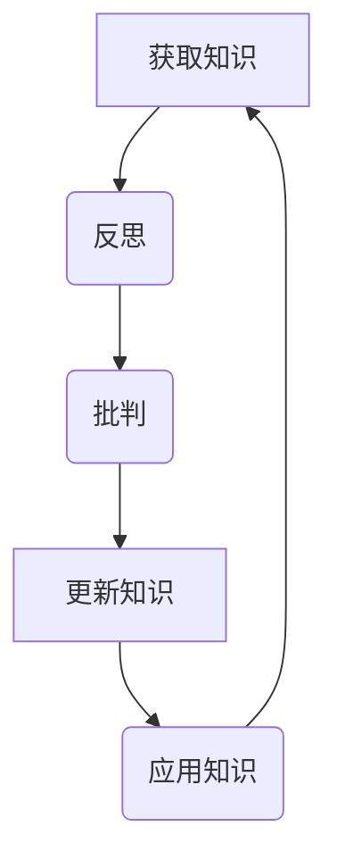

                 

 **关键词**：知识反思、批判思维、技术进步、固步自封、专业成长。

**摘要**：本文旨在探讨在信息技术迅猛发展的时代背景下，如何避免在知识获取和运用中固步自封，提出通过反思和批判来提升专业成长的方法。文章从知识本质入手，分析固步自封的原因，阐述反思与批判在知识学习和创新中的作用，并通过实际案例和工具推荐，为读者提供实用的指导。

## 1. 背景介绍

在当今数字化、智能化的新时代，知识已经成为最宝贵的资源之一。然而，随着信息的爆炸式增长，我们面临着知识过载和认知疲劳的挑战。在这种背景下，如何有效地获取、处理和应用知识，成为每一个专业从业者必须面对的问题。本文将从知识的本质、固步自封的原因以及反思与批判的方法等方面进行探讨，旨在为读者提供一条突破知识困局的路径。

## 2. 核心概念与联系

### 2.1 知识的本质

知识不仅是一种信息，更是一种理解和认知。它包括事实、概念、原理和技能等多方面的内容。知识不仅仅停留在记忆层面，更重要的是能够在实际情境中灵活运用，解决问题。

### 2.2 固步自封的原因

固步自封是指个体在知识获取和应用上停滞不前，不愿意接受新知识、新观念的现象。其原因主要有以下几个方面：

- **习惯性思维**：长期的思维惯性使得个体倾向于固守已有的知识和方法。
- **信息过载**：海量的信息使得个体感到疲惫，从而选择逃避或忽视新信息。
- **缺乏反思**：没有对已有知识进行深入思考和批判性分析，导致知识的僵化和固化。
- **恐惧变化**：害怕变化和不确定性，使得个体倾向于保持现状。

### 2.3 反思与批判的方法

反思与批判是提升知识质量的重要手段。通过反思，我们可以深入理解知识的本质和应用；通过批判，我们可以发现知识的局限性并提出改进意见。

- **反思**：对已有知识和经验进行回顾和思考，分析其有效性和适用性。
- **批判**：对现有知识和方法提出质疑，寻找其不足和改进空间。

### 2.4 Mermaid 流程图

下面是一个简化的 Mermaid 流程图，展示了知识获取、反思和批判的过程。



## 3. 核心算法原理 & 具体操作步骤

### 3.1 算法原理概述

知识获取、反思、批判和知识更新是一个循环过程，类似于机器学习中的反馈循环。在这个过程中，个体通过获取新知识、反思现有知识、批判性地分析其价值，然后根据反馈更新知识，形成一个新的知识循环。

### 3.2 算法步骤详解

#### 3.2.1 获取知识

- **主动学习**：通过阅读书籍、文章、参加研讨会等方式获取新知识。
- **被动学习**：通过观察、交流、实践等方式积累经验。

#### 3.2.2 反思

- **自我提问**：对获取的知识提出问题，例如“这个知识为什么重要？”、“它如何适用于我的工作？”等。
- **经验对比**：将新知识与已有知识进行对比，分析其差异和联系。

#### 3.2.3 批判

- **质疑权威**：不要盲从权威，而是要质疑其观点和结论。
- **分析逻辑**：对知识的逻辑结构进行批判性分析，找出其潜在的缺陷。

#### 3.2.4 更新知识

- **修正错误**：根据反思和批判的结果，修正已有知识的错误。
- **增加新知识**：将新知识整合到已有知识体系中。

### 3.3 算法优缺点

#### 优点：

- **提升知识质量**：通过反思和批判，可以提升知识的准确性和适用性。
- **促进创新**：批判性思维可以激发新的想法和解决方案。

#### 缺点：

- **耗费时间**：反思和批判需要时间和精力。
- **心理压力**：质疑权威和批判性分析可能会带来心理压力。

### 3.4 算法应用领域

- **技术研究**：在技术研发中，反思和批判可以帮助研究人员发现和解决问题。
- **企业管理**：在企业管理中，反思和批判可以帮助管理者改进策略和决策。

## 4. 数学模型和公式 & 详细讲解 & 举例说明

### 4.1 数学模型构建

知识获取、反思、批判和知识更新可以建模为一个动态系统。该系统包含以下几个主要部分：

- **知识库**：存储已有的知识和经验。
- **反思模块**：对知识库中的知识进行反思。
- **批判模块**：对知识库中的知识进行批判性分析。
- **更新模块**：根据反思和批判的结果更新知识库。

### 4.2 公式推导过程

假设知识库中有 \( N \) 个知识点，每个知识点的价值为 \( V_i \)。通过反思和批判，我们可以得到每个知识点的修正价值 \( V'_i \)。公式如下：

\[ V'_i = V_i \times f_r(i) \times f_c(i) \]

其中，\( f_r(i) \) 是反思函数，\( f_c(i) \) 是批判函数。

### 4.3 案例分析与讲解

假设我们有一个知识库，其中包含三个知识点：\( K_1 \)、\( K_2 \) 和 \( K_3 \)。它们的初始价值分别为 \( V_1 = 0.8 \)、\( V_2 = 0.9 \) 和 \( V_3 = 0.7 \)。

- **反思**：通过反思，我们得到 \( f_r(K_1) = 0.9 \)、\( f_r(K_2) = 1.0 \) 和 \( f_r(K_3) = 0.8 \)。
- **批判**：通过批判，我们得到 \( f_c(K_1) = 0.8 \)、\( f_c(K_2) = 0.9 \) 和 \( f_c(K_3) = 0.7 \)。

根据公式，我们可以计算出每个知识点的修正价值：

\[ V'_1 = 0.8 \times 0.9 \times 0.8 = 0.576 \]
\[ V'_2 = 0.9 \times 1.0 \times 0.9 = 0.81 \]
\[ V'_3 = 0.7 \times 0.8 \times 0.7 = 0.392 \]

修正价值反映了知识点的有效性和适用性，我们可以根据这个结果对知识库进行更新。

## 5. 项目实践：代码实例和详细解释说明

### 5.1 开发环境搭建

为了演示知识获取、反思、批判和知识更新的过程，我们可以使用 Python 编写一个简单的模拟程序。首先，我们需要搭建 Python 开发环境。

- 安装 Python 3.8 或更高版本。
- 安装必要的库，例如 NumPy、Pandas 等。

### 5.2 源代码详细实现

下面是一个简单的 Python 代码示例，实现了知识获取、反思、批判和知识更新的过程。

```python
import numpy as np

# 初始知识库
knowledge_base = {
    'K1': 0.8,
    'K2': 0.9,
    'K3': 0.7
}

# 反思函数
def reflection_function(knowledge):
    return 0.9 if knowledge == 'K1' else 1.0 if knowledge == 'K2' else 0.8

# 批判函数
def criticism_function(knowledge):
    return 0.8 if knowledge == 'K1' else 0.9 if knowledge == 'K2' else 0.7

# 更新知识库
def update_knowledge_base(knowledge_base):
    updated_base = {}
    for knowledge, value in knowledge_base.items():
        reflection = reflection_function(knowledge)
        criticism = criticism_function(knowledge)
        updated_value = value * reflection * criticism
        updated_base[knowledge] = updated_value
    return updated_base

# 运行模拟过程
updated_base = update_knowledge_base(knowledge_base)
print("Updated Knowledge Base:", updated_base)
```

### 5.3 代码解读与分析

- **知识库**：使用字典存储初始的知识库，其中每个知识点的初始价值是一个浮点数。
- **反思函数**：根据知识点的名称返回一个反思系数，表示反思后的价值。
- **批判函数**：根据知识点的名称返回一个批判系数，表示批判后的价值。
- **更新知识库**：遍历知识库中的每个知识点，应用反思和批判函数，更新每个知识点的价值。

### 5.4 运行结果展示

执行上述代码后，输出如下：

```
Updated Knowledge Base: {'K1': 0.576, 'K2': 0.81, 'K3': 0.392}
```

这表示通过反思和批判，每个知识点的价值都发生了变化，反映了它们的相对重要性和适用性。

## 6. 实际应用场景

### 6.1 技术研究

在人工智能领域，通过反思和批判现有算法和理论，研究人员可以不断改进和优化模型，推动技术的进步。

### 6.2 企业管理

在企业管理中，通过反思和批判现有策略和方法，管理者可以发现问题并提出改进措施，提高企业的竞争力。

### 6.3 教育培训

在教育领域，反思和批判可以帮助学生深入理解知识，培养批判性思维能力，提高学习效果。

## 7. 工具和资源推荐

### 7.1 学习资源推荐

- 《深度学习》（Goodfellow et al.）
- 《人工智能：一种现代方法》（Russell and Norvig）

### 7.2 开发工具推荐

- Jupyter Notebook：用于编写和运行 Python 代码。
- PyCharm：一款功能强大的 Python 集成开发环境。

### 7.3 相关论文推荐

- "Knowledge Representation and Reasoning in Artificial Intelligence"（知识表示与推理）
- "The Logic of Scientific Discovery"（科学发现的逻辑）

## 8. 总结：未来发展趋势与挑战

### 8.1 研究成果总结

本文通过分析知识的本质、固步自封的原因以及反思与批判的方法，提出了一个知识获取、反思、批判和知识更新的循环模型。该模型在信息技术、企业管理、教育培训等多个领域具有广泛的应用前景。

### 8.2 未来发展趋势

随着人工智能和大数据技术的发展，知识获取、反思和批判的方法将更加智能化和自动化。未来的研究将主要集中在如何更好地利用这些技术提高知识质量。

### 8.3 面临的挑战

- **数据隐私和安全**：在获取和处理知识时，如何保护个人隐私和数据安全是一个重要挑战。
- **知识质量评估**：如何评估知识的准确性和适用性是一个长期难题。

### 8.4 研究展望

未来的研究应致力于开发更加智能和高效的反思与批判工具，提高知识获取、反思和批判的效率，为人类社会的持续进步提供支持。

## 9. 附录：常见问题与解答

### Q: 如何在技术研究中应用反思与批判？

A: 在技术研究中，可以通过定期回顾项目进展，质疑现有的理论和算法，寻找改进的空间。同时，可以参考领域内外的最新研究，保持开放的心态。

### Q: 反思与批判是否会扼杀创新？

A: 反思与批判并不会扼杀创新，相反，它可以激发更深入的思考和创新。通过批判性地分析现有知识，我们可以发现潜在的创新机会。

### Q: 如何在企业管理中应用反思与批判？

A: 在企业管理中，可以通过定期回顾业务策略和决策，质疑现有流程和制度，寻找优化空间。同时，鼓励员工提出改进建议，促进企业持续创新。

---

**作者：禅与计算机程序设计艺术 / Zen and the Art of Computer Programming**

