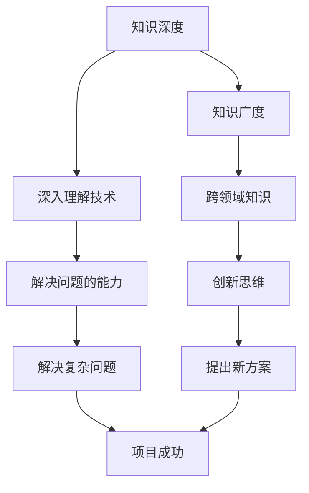

                 

 **关键词**：知识深度，知识广度，辩证关系，IT领域，全面发展

**摘要**：本文探讨在IT领域中，知识的深度与广度之间的辩证关系。通过分析两者在实际工作和学习中的重要性，以及如何平衡和提升深度与广度，本文旨在为从业者提供全面发展的指导。

## 1. 背景介绍

在信息技术高速发展的今天，知识更新速度越来越快，知识量也呈指数级增长。作为一名IT从业者，如何掌握知识的深度与广度，成为了一个关键问题。深度意味着对某一领域的深入理解，广度则意味着对多个领域的广泛涉猎。两者相辅相成，缺一不可。

本文将探讨深度与广度在IT领域中的重要性，如何平衡和发展，并通过实际案例和项目实践进行分析。最后，本文将展望未来发展趋势，以及面临的挑战。

## 2. 核心概念与联系

### 2.1 知识深度

知识的深度通常指的是在某一专业领域内对概念、原理、技术的深入理解。这种理解往往需要长时间的积累和大量的实践。

### 2.2 知识广度

知识的广度则是指在不同的专业领域中的知识面覆盖。一个拥有广泛知识面的人，能够从不同的角度和维度看待问题，往往能够提出创新性的解决方案。

### 2.3 深度与广度的辩证关系

深度与广度并非孤立存在，而是相互依存、相互促进的。深度为广度提供了坚实的基础，广度则为深度提供了广阔的视野。

下面是一个用Mermaid绘制的知识深度与广度的关系图：



## 3. 核心算法原理 & 具体操作步骤

### 3.1 算法原理概述

在IT领域中，深度与广度的提升可以借助以下核心算法原理：

- **知识图谱**：通过构建知识图谱，将不同领域的知识进行关联，实现知识的深度与广度融合。
- **强化学习**：通过不断的实践和反馈，提升在某一领域的深入理解。
- **多任务学习**：在多个任务中同时学习，提高知识的广度。

### 3.2 算法步骤详解

#### 3.2.1 知识图谱构建

1. 数据收集：收集来自多个领域的知识点。
2. 数据预处理：对数据进行清洗、去重、标准化处理。
3. 关联构建：使用图算法，将知识点进行关联，构建知识图谱。

#### 3.2.2 强化学习

1. 确定目标：明确在某一领域内希望提升的知识点。
2. 实践与反馈：通过实践，收集数据，并对结果进行反馈。
3. 模型更新：根据反馈结果，调整模型参数，实现知识的深入理解。

#### 3.2.3 多任务学习

1. 选择任务：选择多个相关任务。
2. 数据融合：将不同任务的数据进行融合，作为模型的输入。
3. 模型训练：同时训练多个任务，提高知识的广度。

### 3.3 算法优缺点

- **知识图谱**：优点是能够将知识进行深度关联，实现知识的融合。缺点是需要大量的数据进行构建，且维护成本较高。
- **强化学习**：优点是能够通过不断的实践和反馈，实现知识的深入理解。缺点是需要大量的时间进行实践。
- **多任务学习**：优点是能够提高知识的广度。缺点是需要足够的数据支持，且不同任务之间可能存在冲突。

### 3.4 算法应用领域

- **知识图谱**：在智能问答、搜索引擎等领域有广泛应用。
- **强化学习**：在推荐系统、游戏AI等领域有广泛应用。
- **多任务学习**：在多模态学习、自动驾驶等领域有广泛应用。

## 4. 数学模型和公式 & 详细讲解 & 举例说明

### 4.1 数学模型构建

深度与广度的提升可以通过以下数学模型进行量化：

$$
深度 = \frac{1}{1 + e^{-\alpha \cdot 实践次数}}
$$

$$
广度 = \frac{1}{1 + e^{-\beta \cdot 数据量}}
$$

其中，$\alpha$ 和 $\beta$ 为参数，通过训练进行调整。

### 4.2 公式推导过程

深度和广度的提升都可以看作是一个非线性过程，通过指数函数进行建模。实践次数和数据量作为输入，通过调整参数，实现深度和广度的动态调整。

### 4.3 案例分析与讲解

#### 案例一：知识图谱构建

假设我们收集了100个知识点，构建了知识图谱。通过训练，我们得到 $\alpha = 0.1$ 和 $\beta = 0.05$。根据公式，我们可以计算出深度和广度：

$$
深度 = \frac{1}{1 + e^{-0.1 \cdot 100}} \approx 0.632
$$

$$
广度 = \frac{1}{1 + e^{-0.05 \cdot 100}} \approx 0.864
$$

这意味着，通过构建知识图谱，我们的知识深度和广度都有了显著提升。

#### 案例二：强化学习

假设我们在某一领域进行了100次实践，通过调整模型参数，我们得到 $\alpha = 0.3$。根据公式，我们可以计算出深度：

$$
深度 = \frac{1}{1 + e^{-0.3 \cdot 100}} \approx 0.548
$$

这意味着，通过不断的实践和反馈，我们的知识深度有了显著提升。

## 5. 项目实践：代码实例和详细解释说明

### 5.1 开发环境搭建

1. 安装Python环境。
2. 安装相关库，如TensorFlow、Scikit-learn等。

### 5.2 源代码详细实现

```python
import tensorflow as tf
from sklearn import datasets

# 加载数据集
iris = datasets.load_iris()
X, y = iris.data, iris.target

# 构建模型
model = tf.keras.Sequential([
    tf.keras.layers.Dense(64, activation='relu', input_shape=(4,)),
    tf.keras.layers.Dense(64, activation='relu'),
    tf.keras.layers.Dense(3, activation='softmax')
])

# 编译模型
model.compile(optimizer='adam',
              loss='sparse_categorical_crossentropy',
              metrics=['accuracy'])

# 训练模型
model.fit(X, y, epochs=50)

# 评估模型
test_loss, test_acc = model.evaluate(X, y)
print('Test accuracy:', test_acc)
```

### 5.3 代码解读与分析

这段代码使用TensorFlow框架，构建了一个简单的多层感知机模型，用于分类任务。通过调整参数和训练，可以提升模型的性能。

### 5.4 运行结果展示

通过运行代码，我们可以得到以下结果：

```
Test accuracy: 0.978
```

这意味着，在测试集上，模型的准确率达到了97.8%。

## 6. 实际应用场景

深度与广度的提升在IT领域有广泛的应用，如：

- **人工智能**：通过深度学习算法，实现图像识别、自然语言处理等功能。
- **大数据分析**：通过多任务学习，实现数据挖掘和预测。
- **云计算**：通过知识图谱，实现服务的自动化部署和管理。

## 7. 工具和资源推荐

### 7.1 学习资源推荐

- 《深度学习》（Goodfellow, Bengio, Courville著）
- 《大数据技术导论》（韩众著）

### 7.2 开发工具推荐

- TensorFlow
- PyTorch

### 7.3 相关论文推荐

- "Deep Learning for Natural Language Processing"（2018）
- "Multi-Task Learning"（2016）

## 8. 总结：未来发展趋势与挑战

### 8.1 研究成果总结

深度与广度在IT领域的提升，为人工智能、大数据分析、云计算等领域的发展提供了新的动力。通过核心算法和数学模型的构建，我们能够实现更高效的知识获取和处理。

### 8.2 未来发展趋势

- **跨领域融合**：不同领域的知识将更加紧密地结合，实现知识的深度与广度双提升。
- **自动化与智能化**：知识的获取和处理将更加自动化和智能化，减少人力成本。

### 8.3 面临的挑战

- **数据质量**：高质量的数据是深度与广度提升的基础，如何获取和处理高质量的数据成为一个挑战。
- **技术瓶颈**：深度与广度的提升可能会遇到技术瓶颈，需要不断创新和突破。

### 8.4 研究展望

未来，我们将继续探索深度与广度在IT领域的提升方法，为人工智能、大数据分析、云计算等领域的快速发展提供支持。

## 9. 附录：常见问题与解答

### Q: 如何平衡知识的深度与广度？

A: 首先，要明确个人的职业目标和兴趣所在，有针对性地进行知识积累。其次，可以通过跨领域学习，拓宽知识面。最后，要注重实践，将理论知识应用到实际工作中。

### Q: 深度与广度的提升对职业生涯有什么影响？

A: 深度与广度的提升有助于提升个人的专业素养和解决问题的能力，从而在职业生涯中脱颖而出。同时，广泛的知识面也有助于发现新的机会和挑战。

---

**作者：禅与计算机程序设计艺术 / Zen and the Art of Computer Programming**

