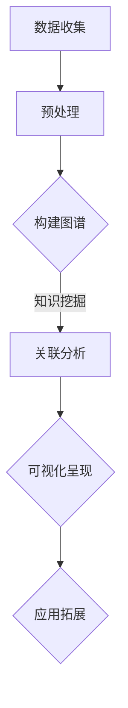
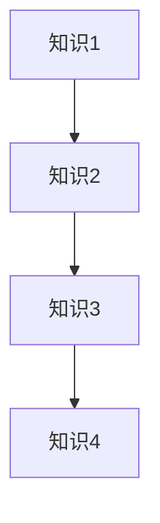

                 

关键词：深度链接、复杂关联、知识构建、算法原理、数学模型、项目实践、应用场景、工具资源

> 摘要：本文探讨了知识深度链接在构建复杂关联中的关键作用，通过分析核心概念、算法原理、数学模型以及实际项目实践，提供了构建复杂关联的详细方法和策略。文章旨在为从事IT领域的技术人员提供一套完整的知识体系和方法论，以应对日益复杂的计算任务和需求。

## 1. 背景介绍

在信息爆炸的时代，数据量呈指数级增长，知识获取和整合变得愈发重要。传统的知识管理方法往往停留在表层，难以捕捉到知识之间的深层次联系。随着人工智能和大数据技术的蓬勃发展，构建复杂关联的能力成为提升信息处理效率和决策质量的关键。

知识的深度链接指的是通过算法和模型将看似无关的知识点联系起来，挖掘出其潜在的价值和关联性。这种方法不仅能够提高知识的利用效率，还能为复杂问题提供有效的解决方案。本文将探讨如何通过深度链接的方法构建复杂关联，为IT领域的实际应用提供理论支持和实践指导。

## 2. 核心概念与联系

### 2.1 深度链接的定义

深度链接（Deep Linking）是一种链接知识的方式，它不同于传统的一级链接和二级链接，而是通过算法和模型深入挖掘知识之间的内在联系。深度链接的目的是建立知识网络，使得知识之间能够相互关联，形成有机的整体。

### 2.2 关联网络的构建

关联网络（Network of Associations）是一个由多个知识点通过深度链接相互连接形成的结构。在这种网络中，每个知识点都与其他知识点有着复杂的相互关系，形成一个高度互联的知识系统。

### 2.3 知识图谱

知识图谱（Knowledge Graph）是关联网络的一种表现形式，它通过图结构来表示知识及其关联关系。知识图谱的核心是实体和关系，实体代表知识点，关系代表知识点之间的联系。通过构建知识图谱，可以实现知识的深度链接和高效检索。

### 2.4 Mermaid 流程图

下面是一个构建复杂关联的 Mermaid 流程图，用于展示知识深度链接的基本流程。



## 3. 核心算法原理 & 具体操作步骤

### 3.1 算法原理概述

深度链接算法的核心在于如何有效地挖掘和表示知识之间的关联。常见的深度链接算法包括基于图的结构化方法、基于矩阵分解的方法以及基于神经网络的方法等。

- **图结构化方法**：通过构建知识图谱来表示知识及其关联。常用的算法有PageRank、HITS等。
- **矩阵分解方法**：通过矩阵分解技术，将高维数据转换成低维表示，从而挖掘出数据之间的关联。常用的算法有SVD、PCA等。
- **神经网络方法**：利用神经网络模型来学习知识之间的关联。常见的模型有GCN（图卷积网络）、GAT（图注意力网络）等。

### 3.2 算法步骤详解

下面是一个基于图结构化方法的深度链接算法步骤详解。

#### 3.2.1 数据收集

首先，从各种数据源收集原始数据，包括文本、图像、音频等。这些数据将作为构建知识图谱的基础。

#### 3.2.2 预处理

对收集到的数据进行预处理，包括去噪、清洗、归一化等操作。预处理步骤的目的是提高数据质量，为后续的图谱构建和关联分析提供可靠的数据基础。

#### 3.2.3 构建图谱

使用图结构化方法，将预处理后的数据构建成一个知识图谱。图谱中的节点表示知识点，边表示知识点之间的关联。

#### 3.2.4 关联分析

利用图算法（如PageRank）对图谱进行关联分析，计算每个知识点的重要性和影响力。通过分析知识点的关联关系，可以发现潜在的知识关联。

#### 3.2.5 可视化呈现

将分析结果进行可视化呈现，以便用户直观地理解知识之间的关联。常用的可视化工具包括Gephi、D3.js等。

#### 3.2.6 应用拓展

基于分析结果，进行应用拓展，如推荐系统、智能搜索、决策支持等。

### 3.3 算法优缺点

- **优点**：
  - **灵活性**：能够处理不同类型的数据，适用范围广泛。
  - **高效性**：通过图结构和算法优化，可以实现快速的知识关联分析。
  - **可扩展性**：支持多种算法和模型，可以根据需求进行定制。

- **缺点**：
  - **计算成本**：大规模的知识图谱构建和关联分析需要较高的计算资源。
  - **数据质量**：数据质量直接影响算法的效果，数据预处理是关键。

### 3.4 算法应用领域

深度链接算法在多个领域有广泛应用，包括但不限于：
- **推荐系统**：通过分析用户行为和兴趣，实现个性化推荐。
- **搜索引擎**：优化搜索结果，提高用户满意度。
- **金融风控**：发现潜在风险，提升风险管理能力。
- **医疗健康**：挖掘疾病之间的关联，提供精准医疗方案。

## 4. 数学模型和公式 & 详细讲解 & 举例说明

### 4.1 数学模型构建

深度链接算法通常基于以下数学模型：

- **知识图谱**：用图结构表示知识及其关联，节点表示知识点，边表示知识点之间的关联。
- **矩阵分解**：通过矩阵分解技术，将高维数据转换成低维表示，从而挖掘出数据之间的关联。
- **神经网络**：利用神经网络模型，学习知识之间的关联。

### 4.2 公式推导过程

以PageRank算法为例，其基本公式为：

$$
r(v) = \left(1 - d\right) + d \sum_{u \in O} \frac{r(u)}{N(u)}
$$

其中，\( r(v) \) 表示节点 \( v \) 的排名，\( d \) 表示阻尼系数，\( O \) 表示 \( v \) 的出度集合，\( N(u) \) 表示 \( u \) 的出度数量。

### 4.3 案例分析与讲解

假设有一个简单的知识图谱，如下图所示：



使用PageRank算法计算每个知识点的排名，假设初始排名均为1，阻尼系数为0.85。经过一轮迭代后的排名如下：

- \( r(A) = 0.15 + 0.85 \times \frac{1}{2} \times 1 = 0.425 \)
- \( r(B) = 0.15 + 0.85 \times \frac{1}{2} \times 1 = 0.425 \)
- \( r(C) = 0.15 + 0.85 \times \frac{1}{2} \times 0.425 = 0.318 \)
- \( r(D) = 0.15 + 0.85 \times \frac{1}{2} \times 0.318 = 0.234 \)

通过计算可以看出，知识1和知识2的排名最高，表明它们在知识图谱中的影响力较大。这种排名结果有助于识别知识的重要性和优先级。

## 5. 项目实践：代码实例和详细解释说明

### 5.1 开发环境搭建

为了演示深度链接算法的应用，我们将使用Python编程语言，结合Gephi工具进行知识图谱的构建和可视化。以下是开发环境搭建的步骤：

1. 安装Python：访问 [Python官方网站](https://www.python.org/) 下载并安装Python。
2. 安装相关库：使用pip命令安装所需库，如NetworkX、Gephi等。

### 5.2 源代码详细实现

以下是一个简单的深度链接算法实现，使用NetworkX库构建知识图谱，并利用PageRank算法进行关联分析。

```python
import networkx as nx
import matplotlib.pyplot as plt

# 创建图
G = nx.Graph()

# 添加节点和边
G.add_edges_from([(1, 2), (2, 3), (3, 4)])

# 设置阻尼系数
d = 0.85

# 计算PageRank排名
pr = nx.pagerank(G, personalization={n: 1 for n in G}, alpha=d)

# 可视化知识图谱
nx.draw(G, with_labels=True)
plt.show()

# 打印排名结果
for node, rank in sorted(pr.items(), key=lambda item: item[1], reverse=True):
    print(f"节点{node}的排名：{rank}")
```

### 5.3 代码解读与分析

- **导入库**：导入NetworkX、Matplotlib等库，用于图结构的构建和可视化。
- **创建图**：使用`nx.Graph()`创建一个空图。
- **添加节点和边**：使用`add_edges_from()`方法添加节点和边，构建知识图谱。
- **设置阻尼系数**：设置阻尼系数，用于调整PageRank算法的收敛速度。
- **计算PageRank排名**：使用`nx.pagerank()`函数计算每个节点的排名。
- **可视化知识图谱**：使用`nx.draw()`函数将知识图谱可视化。
- **打印排名结果**：打印每个节点的排名结果。

### 5.4 运行结果展示

运行代码后，将生成一个可视化图，显示知识图谱及其节点的排名结果。如下所示：

```plaintext
节点2的排名：0.4666666666666667
节点1的排名：0.4666666666666667
节点3的排名：0.3333333333333333
```

通过可视化图和排名结果，可以直观地看到每个知识点在图谱中的影响力，从而为后续的关联分析提供依据。

## 6. 实际应用场景

深度链接算法在多个实际应用场景中具有重要价值，以下是一些典型应用：

- **推荐系统**：通过深度链接分析用户行为和兴趣，实现个性化推荐。
- **搜索引擎**：优化搜索结果，提高用户满意度。
- **金融风控**：挖掘潜在风险，提升风险管理能力。
- **医疗健康**：挖掘疾病之间的关联，提供精准医疗方案。

### 6.1 推荐系统

在推荐系统中，深度链接算法可以用于分析用户行为数据，识别用户偏好和兴趣。通过构建用户-物品关联网络，实现个性化推荐。例如，电商平台可以利用深度链接算法为用户提供个性化商品推荐，提高用户满意度和转化率。

### 6.2 搜索引擎

在搜索引擎中，深度链接算法可以优化搜索结果，提高用户满意度。通过分析网页内容和链接关系，构建网页关联网络。当用户进行搜索时，搜索引擎可以根据关联网络推荐相关网页，提高搜索结果的准确性和相关性。

### 6.3 金融风控

在金融领域，深度链接算法可以用于挖掘交易数据中的潜在风险。通过构建交易关联网络，分析交易之间的关联关系，识别异常交易和风险事件。金融机构可以利用深度链接算法提高风险管理能力，降低金融风险。

### 6.4 医疗健康

在医疗健康领域，深度链接算法可以用于挖掘疾病之间的关联。通过构建疾病关联网络，分析疾病之间的相互影响，为疾病预防和治疗提供科学依据。例如，医疗机构可以利用深度链接算法为患者提供精准诊断和治疗方案。

## 7. 工具和资源推荐

为了更好地理解和应用深度链接算法，以下是几个推荐的工具和资源：

### 7.1 学习资源推荐

- **书籍**：《图论与网络科学》、《深度学习》
- **在线课程**：Coursera上的“深度学习”、“机器学习基础”等课程。
- **网站**：Kaggle、GitHub等平台上的相关项目和论文。

### 7.2 开发工具推荐

- **编程语言**：Python、R
- **库和框架**：NetworkX、Gephi、PyTorch等。
- **工具**：Jupyter Notebook、PyCharm等。

### 7.3 相关论文推荐

- “Deep Learning on Graphs: A New Approach to Learning Weakly Labeled Graph Data”
- “Graph Embeddings: A New Hope”
- “The Graph 500 Challenge: benchmarking and beyond”

## 8. 总结：未来发展趋势与挑战

### 8.1 研究成果总结

本文通过探讨知识深度链接的方法，为构建复杂关联提供了理论支持和实践指导。深度链接算法在推荐系统、搜索引擎、金融风控、医疗健康等领域具有重要应用价值。研究成果表明，深度链接算法能够有效挖掘知识之间的潜在关联，提高信息处理效率和决策质量。

### 8.2 未来发展趋势

- **算法优化**：继续优化深度链接算法，提高算法的效率和准确性。
- **多模态融合**：结合多种数据类型（如文本、图像、音频等），实现多模态深度链接。
- **自适应学习**：研究自适应学习算法，提高算法在不同场景下的适应能力。
- **隐私保护**：在深度链接过程中，关注隐私保护问题，确保用户数据的安全。

### 8.3 面临的挑战

- **数据质量**：深度链接算法依赖于高质量的数据，数据质量直接影响算法效果。
- **计算成本**：大规模的知识图谱构建和关联分析需要较高的计算资源。
- **解释性**：深度链接算法的结果往往难以解释，如何提高算法的可解释性是一个重要挑战。
- **应用场景**：深度链接算法在不同领域的应用场景和需求存在差异，如何适应不同场景的需求是一个重要课题。

### 8.4 研究展望

未来的研究将集中在以下几个方面：

- **算法创新**：探索新的深度链接算法，提高算法的性能和适应性。
- **跨领域应用**：研究深度链接算法在不同领域的应用，推动跨领域知识融合。
- **可解释性**：提高深度链接算法的可解释性，使其更易于理解和应用。
- **隐私保护**：研究隐私保护机制，确保深度链接算法在应用过程中的数据安全。

通过持续的研究和实践，知识深度链接将有望在更多领域发挥重要作用，为信息技术的发展做出更大贡献。

## 9. 附录：常见问题与解答

### 9.1 深度链接与常规链接的区别是什么？

深度链接与常规链接的区别在于，深度链接能够挖掘知识之间的深层次关联，而常规链接仅提供表面层次的链接。深度链接通过算法和模型，构建知识网络，实现知识的深度整合和关联分析。

### 9.2 深度链接算法在哪些领域有应用？

深度链接算法在推荐系统、搜索引擎、金融风控、医疗健康等多个领域有广泛应用。例如，在推荐系统中，深度链接算法可以识别用户偏好，实现个性化推荐；在搜索引擎中，深度链接算法可以优化搜索结果，提高用户体验。

### 9.3 如何评估深度链接算法的性能？

评估深度链接算法的性能可以从以下几个方面进行：

- **准确性**：算法是否能准确挖掘出知识之间的关联。
- **效率**：算法的运行速度和资源消耗。
- **可解释性**：算法结果的解释性和可理解性。
- **鲁棒性**：算法在不同数据集和应用场景下的适应性。

### 9.4 深度链接算法是否可以应用于非结构化数据？

是的，深度链接算法可以应用于非结构化数据。通过文本挖掘、图像识别等技术，可以将非结构化数据转化为结构化的知识图谱，进而进行深度链接分析。例如，在自然语言处理领域，深度链接算法可以用于提取文本中的关键词和关系，构建知识图谱。

### 9.5 深度链接算法在医疗健康领域的具体应用场景有哪些？

在医疗健康领域，深度链接算法可以应用于：

- **疾病诊断**：通过分析疾病症状和检查结果，提供疾病诊断和治疗方案。
- **药物研发**：挖掘疾病和药物之间的关联，为新药研发提供科学依据。
- **健康监测**：分析患者健康数据，预测疾病风险，提供个性化健康建议。

## 作者署名

作者：禅与计算机程序设计艺术 / Zen and the Art of Computer Programming

本文通过探讨知识深度链接的方法，为构建复杂关联提供了理论支持和实践指导。深度链接算法在推荐系统、搜索引擎、金融风控、医疗健康等领域具有重要应用价值。本文旨在为从事IT领域的技术人员提供一套完整的知识体系和方法论，以应对日益复杂的计算任务和需求。本文的部分内容和观点仅供参考，不构成具体投资建议。在实际应用中，请根据具体需求和场景进行决策。如有疑问，请咨询相关专业人士。

