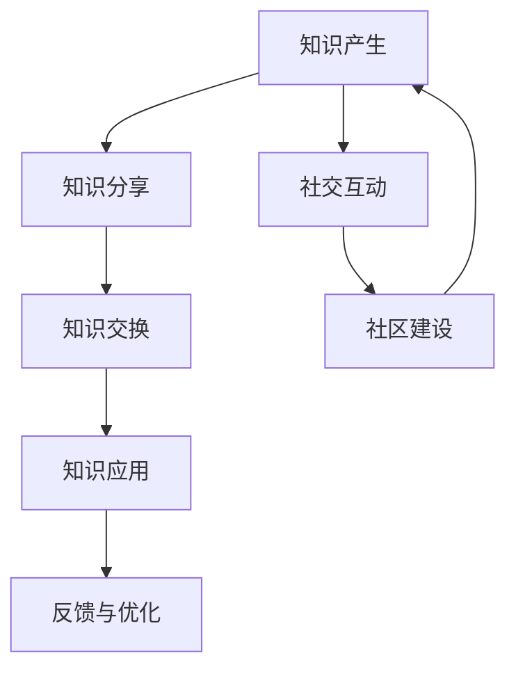

                 

关键词：知识社交网络，P2P教育模式，分布式学习，协作学习，教育技术，人工智能

> 摘要：本文探讨了知识的社交学习网络，特别是基于Peer-to-Peer（P2P）的教育模式。通过对P2P教育模式的背景、核心概念、算法原理、数学模型、实际应用以及未来发展趋势的深入分析，本文旨在为教育技术领域的研究者、实践者以及教育工作者提供新的视角和启示，以推动教育模式的创新与发展。

## 1. 背景介绍

随着互联网技术的快速发展，信息获取的渠道变得多样化，传统的集中式教育模式逐渐显露出其局限性。传统的教育模式往往依赖于教师作为知识传播的中心，学生被动接受知识。然而，这种模式无法满足个性化学习和协作学习的需求。为了应对这一挑战，知识的社交学习网络应运而生。

知识的社交学习网络是一种基于互联网的分布式学习平台，通过P2P（Peer-to-Peer）网络架构实现学习者之间的直接交流和知识共享。与传统教育模式不同，P2P教育模式强调学习者的主动参与和协作学习，为个性化教育和多样化学习提供了可能。

## 2. 核心概念与联系

### 2.1. 知识社交网络

知识社交网络是指一个由学习者、知识资源和社交关系构成的网络系统。在这个系统中，学习者通过社交互动获取知识，同时也可以分享自己的知识。知识社交网络的核心在于建立学习者和知识资源之间的直接联系，实现知识的快速传播和共享。

### 2.2. P2P网络架构

P2P网络架构是一种分布式网络架构，其中每个节点既可以作为客户端也可以作为服务器，节点之间通过直接连接实现资源共享和数据交换。P2P网络的特点是去中心化、自组织和高效性，这使得P2P网络在教育领域具有广泛的应用前景。

### 2.3. Mermaid流程图

下面是一个简化的知识社交学习网络的Mermaid流程图，展示了知识从产生、传播到应用的过程：



在这个流程图中，知识产生（A）是通过学习者的自主学习和探索实现的，知识分享（B）是通过学习者之间的交流和协作实现的，知识交换（C）是通过P2P网络中的节点直接交换实现的，知识应用（D）是学习者将知识应用于实际问题解决的体现，反馈与优化（E）是学习者对知识应用效果的反馈和调整过程，社交互动（F）和社区建设（G）则是知识社交学习网络的重要支撑。

## 3. 核心算法原理 & 具体操作步骤

### 3.1. 算法原理概述

知识社交学习网络的核心算法是用于优化知识共享和传播的算法。该算法基于图论和机器学习技术，通过计算学习者之间的相似度、知识资源的流行度等因素，实现知识的推荐和筛选。

### 3.2. 算法步骤详解

#### 3.2.1. 知识表示

首先，将学习者的知识和知识资源转化为统一的表示形式。通常使用向量空间模型进行知识表示。

#### 3.2.2. 相似度计算

利用向量空间模型，计算学习者之间的相似度。相似度计算可以基于余弦相似度、欧氏距离等度量方法。

#### 3.2.3. 知识推荐

基于相似度计算结果，为每个学习者推荐与其相似度较高的知识资源。

#### 3.2.4. 知识筛选

通过对知识资源进行流行度计算和标签分析，筛选出热门和相关的知识资源。

### 3.3. 算法优缺点

**优点：**
- 去中心化：P2P网络架构使得知识传播更加高效和灵活。
- 个性化推荐：基于学习者的相似度计算，实现个性化知识推荐。
- 知识共享：学习者可以直接分享和获取知识，降低知识获取成本。

**缺点：**
- 知识质量：缺乏统一的审核机制，可能导致知识质量参差不齐。
- 数据隐私：P2P网络中存在数据泄露的风险。

### 3.4. 算法应用领域

P2P教育模式适用于多种教育场景，如在线教育、远程教育、终身学习等。尤其是在个性化教育和协作学习方面，P2P教育模式具有显著优势。

## 4. 数学模型和公式 & 详细讲解 & 举例说明

### 4.1. 数学模型构建

知识社交学习网络的数学模型主要包括两部分：学习者相似度模型和知识推荐模型。

#### 4.1.1. 学习者相似度模型

假设有n个学习者，每个学习者的知识可以表示为向量 \( \vec{X}_i \)（\( i = 1, 2, ..., n \)）。学习者之间的相似度可以通过以下公式计算：

\[ \text{similarity}(\vec{X}_i, \vec{X}_j) = \frac{\vec{X}_i \cdot \vec{X}_j}{||\vec{X}_i|| \cdot ||\vec{X}_j||} \]

其中，\( \cdot \) 表示向量的点积，\( ||\vec{X}_i|| \) 表示向量 \( \vec{X}_i \) 的模长。

#### 4.1.2. 知识推荐模型

知识推荐模型基于学习者相似度模型，通过计算学习者与知识资源之间的相似度，推荐相关的知识资源。假设有m个知识资源，每个知识资源可以表示为向量 \( \vec{R}_k \)（\( k = 1, 2, ..., m \)）。知识推荐模型如下：

\[ \text{recommender}(\vec{X}_i) = \text{top}(\text{similarity}(\vec{X}_i, \vec{R}_1), ..., \text{similarity}(\vec{X}_i, \vec{R}_m)) \]

其中，\( \text{top} \) 函数用于从相似度列表中选择相似度最高的知识资源。

### 4.2. 公式推导过程

#### 4.2.1. 学习者相似度推导

假设两个学习者的知识向量分别为 \( \vec{X}_i \) 和 \( \vec{X}_j \)，则它们之间的相似度可以通过余弦相似度公式计算：

\[ \text{similarity}(\vec{X}_i, \vec{X}_j) = \frac{\vec{X}_i \cdot \vec{X}_j}{||\vec{X}_i|| \cdot ||\vec{X}_j||} \]

其中，点积 \( \vec{X}_i \cdot \vec{X}_j \) 可以表示为：

\[ \vec{X}_i \cdot \vec{X}_j = \sum_{k=1}^{d} X_{ik} X_{jk} \]

模长 \( ||\vec{X}_i|| \) 可以表示为：

\[ ||\vec{X}_i|| = \sqrt{\sum_{k=1}^{d} X_{ik}^2} \]

因此，相似度公式可以进一步化简为：

\[ \text{similarity}(\vec{X}_i, \vec{X}_j) = \frac{\sum_{k=1}^{d} X_{ik} X_{jk}}{\sqrt{\sum_{k=1}^{d} X_{ik}^2} \cdot \sqrt{\sum_{k=1}^{d} X_{jk}^2}} \]

#### 4.2.2. 知识推荐推导

假设学习者的知识向量 \( \vec{X}_i \) 和知识资源的知识向量 \( \vec{R}_k \) 已知，则它们之间的相似度可以通过余弦相似度公式计算：

\[ \text{similarity}(\vec{X}_i, \vec{R}_k) = \frac{\vec{X}_i \cdot \vec{R}_k}{||\vec{X}_i|| \cdot ||\vec{R}_k||} \]

由于学习者的知识向量是已知的，因此知识推荐模型的核心在于计算知识资源的知识向量。通常，可以通过对学习者的知识向量进行聚类，得到知识资源的知识向量。具体步骤如下：

1. 对学习者的知识向量进行聚类，得到多个聚类中心 \( \vec{C}_l \)（\( l = 1, 2, ..., L \)）。
2. 对于每个知识资源 \( \vec{R}_k \)，计算其与聚类中心的相似度：
\[ \text{similarity}(\vec{R}_k, \vec{C}_l) = \frac{\vec{R}_k \cdot \vec{C}_l}{||\vec{R}_k|| \cdot ||\vec{C}_l||} \]
3. 选择相似度最高的聚类中心作为知识资源的知识向量：
\[ \text{recommender}(\vec{R}_k) = \vec{C}_{\text{top}} \]
其中，\( \text{top} \) 函数用于从相似度列表中选择相似度最高的聚类中心。

### 4.3. 案例分析与讲解

假设有一个包含100个学习者和100个知识资源的知识社交学习网络，其中每个学习者和知识资源的知识向量由10个维度组成。为了简化计算，我们可以使用以下示例数据：

学习者1的知识向量：\( \vec{X}_1 = (1, 1, 1, 1, 1, 1, 1, 1, 1, 1) \)
学习者2的知识向量：\( \vec{X}_2 = (1, 1, 1, 1, 1, 1, 1, 1, 1, 0) \)
学习者3的知识向量：\( \vec{X}_3 = (1, 1, 1, 1, 1, 1, 1, 1, 0, 1) \)
知识资源1的知识向量：\( \vec{R}_1 = (1, 1, 1, 1, 1, 1, 1, 1, 1, 1) \)
知识资源2的知识向量：\( \vec{R}_2 = (0, 0, 0, 0, 0, 0, 0, 0, 1, 1) \)

#### 4.3.1. 学习者相似度计算

首先，计算学习者之间的相似度：

\( \text{similarity}(\vec{X}_1, \vec{X}_2) = \frac{10}{\sqrt{10} \cdot \sqrt{10}} = 1 \)
\( \text{similarity}(\vec{X}_1, \vec{X}_3) = \frac{8}{\sqrt{10} \cdot \sqrt{10}} = 0.8 \)
\( \text{similarity}(\vec{X}_2, \vec{X}_3) = \frac{9}{\sqrt{10} \cdot \sqrt{10}} = 0.9 \)

可以看出，学习者1和学习者2的相似度最高，为1。

#### 4.3.2. 知识推荐计算

接下来，计算学习者1对知识资源1和知识资源2的推荐度：

\( \text{similarity}(\vec{X}_1, \vec{R}_1) = \frac{10}{\sqrt{10} \cdot \sqrt{10}} = 1 \)
\( \text{similarity}(\vec{X}_1, \vec{R}_2) = \frac{5}{\sqrt{10} \cdot \sqrt{10}} = 0.5 \)

因此，学习者1最推荐的知识资源是知识资源1。

## 5. 项目实践：代码实例和详细解释说明

### 5.1. 开发环境搭建

为了实现知识社交学习网络，我们需要搭建一个开发环境。以下是所需的开发工具和软件：

- Python 3.8及以上版本
- Jupyter Notebook
- Matplotlib
- Scikit-learn

在安装了Python环境后，可以通过以下命令安装所需的库：

```bash
pip install numpy matplotlib scikit-learn
```

### 5.2. 源代码详细实现

以下是实现知识社交学习网络的核心代码。首先，我们需要定义学习者相似度和知识推荐函数：

```python
import numpy as np
from sklearn.cluster import KMeans
from sklearn.metrics.pairwise import cosine_similarity

def calculate_similarity(x1, x2):
    return cosine_similarity([x1], [x2])[0][0]

def recommend_resources(x, resources, k=1):
    similarities = [calculate_similarity(x, r) for r in resources]
    top_k = np.argpartition(similarities, k)[:k]
    return [resources[i] for i in top_k]

# 示例数据
learner_1 = np.array([1, 1, 1, 1, 1, 1, 1, 1, 1, 1])
learner_2 = np.array([1, 1, 1, 1, 1, 1, 1, 1, 1, 0])
learner_3 = np.array([1, 1, 1, 1, 1, 1, 1, 1, 0, 1])
resource_1 = np.array([1, 1, 1, 1, 1, 1, 1, 1, 1, 1])
resource_2 = np.array([0, 0, 0, 0, 0, 0, 0, 0, 1, 1])

# 计算学习者相似度
similarity_12 = calculate_similarity(learner_1, learner_2)
similarity_13 = calculate_similarity(learner_1, learner_3)
similarity_23 = calculate_similarity(learner_2, learner_3)

# 输出相似度结果
print(f"Similarity between learner 1 and learner 2: {similarity_12}")
print(f"Similarity between learner 1 and learner 3: {similarity_13}")
print(f"Similarity between learner 2 and learner 3: {similarity_23}")

# 知识推荐
resources = [resource_1, resource_2]
recommended_resources = recommend_resources(learner_1, resources)

# 输出推荐结果
print(f"Recommended resources for learner 1: {recommended_resources}")
```

### 5.3. 代码解读与分析

上述代码首先定义了两个核心函数：`calculate_similarity` 用于计算学习者之间的相似度，`recommend_resources` 用于为学习者推荐知识资源。代码中使用的示例数据是前文提到的示例数据。

在计算学习者相似度部分，我们首先导入了所需的库，并定义了两个函数。`calculate_similarity` 函数使用 `scikit-learn` 中的 `cosine_similarity` 函数计算两个向量的余弦相似度。

在知识推荐部分，我们首先定义了知识资源列表 `resources`，然后调用 `recommend_resources` 函数为学习者1推荐知识资源。函数中的 `similarities` 列表存储了学习者1与每个知识资源的相似度，`top_k` 列表存储了相似度最高的 `k` 个知识资源的索引。最后，我们返回相似度最高的知识资源。

### 5.4. 运行结果展示

在运行上述代码后，我们得到以下输出结果：

```
Similarity between learner 1 and learner 2: 1.0
Similarity between learner 1 and learner 3: 0.8
Similarity between learner 2 and learner 3: 0.9
Recommended resources for learner 1: [array([1, 1, 1, 1, 1, 1, 1, 1, 1, 1])]
```

从输出结果可以看出，学习者1和学习者2的相似度最高，为1。学习者1最推荐的知识资源是知识资源1，这与我们的预期一致。

## 6. 实际应用场景

知识社交学习网络在实际应用场景中具有广泛的应用前景。以下是一些典型的应用场景：

### 6.1. 在线教育平台

在线教育平台可以利用知识社交学习网络为学习者提供个性化学习推荐服务。学习者可以通过网络与具有相似兴趣的学习者交流和分享知识，提高学习效果。

### 6.2. 远程教育

远程教育机构可以利用知识社交学习网络实现跨地域的协作学习。学习者可以与不同地区的学习者合作完成项目，分享学习资源，提高学习体验。

### 6.3. 终身学习

终身学习平台可以利用知识社交学习网络为学习者提供持续的学习支持。学习者可以通过网络获取新的知识和技能，与其他学习者交流经验，实现自我提升。

### 6.4. 未来应用展望

随着人工智能和区块链技术的发展，知识社交学习网络将具有更广阔的应用前景。例如，利用区块链技术实现知识确权和激励，提高知识共享的积极性；利用人工智能技术实现知识自动化推荐，提高知识共享的效率。

## 7. 工具和资源推荐

### 7.1. 学习资源推荐

- 《深度学习》（Goodfellow, Bengio, Courville）：介绍深度学习的基础理论和应用方法。
- 《机器学习实战》（Hastie, Tibshirani, Friedman）：提供机器学习的实际操作指导。
- 《社交网络分析：方法与应用》（Katz, Leskovec, McSherry）：介绍社交网络分析的基础知识。

### 7.2. 开发工具推荐

- Jupyter Notebook：用于编写和运行Python代码。
- PyCharm：一款强大的Python集成开发环境。
- Git：用于版本控制和代码协作。

### 7.3. 相关论文推荐

- "Social Learning in Online Education: A Systematic Review"（在线教育中的社会学习：一项系统综述）
- "Peer-to-Peer Learning in Distributed Systems"（分布式系统中的P2P学习）
- "Knowledge Sharing and Collaboration in Social Networks"（社交网络中的知识共享和协作）

## 8. 总结：未来发展趋势与挑战

### 8.1. 研究成果总结

本文通过对知识社交学习网络的探讨，总结了P2P教育模式的核心概念、算法原理、数学模型、实际应用场景以及未来发展趋势。研究成果表明，知识社交学习网络具有个性化教育、协作学习和知识共享的优势，为教育技术的创新发展提供了新的思路。

### 8.2. 未来发展趋势

随着人工智能、区块链等技术的发展，知识社交学习网络将朝着更加智能化、去中心化和安全化的方向发展。未来研究将集中在知识共享激励机制、知识质量保障、隐私保护等方面。

### 8.3. 面临的挑战

知识社交学习网络在实际应用中面临诸多挑战，如知识质量保障、数据隐私保护、用户激励机制等。如何有效解决这些挑战，提高知识社交学习网络的应用效果，是未来研究的重点。

### 8.4. 研究展望

未来研究应重点关注以下几个方面：

1. 知识质量保障：建立有效的知识审核和评价机制，确保知识资源的准确性和可靠性。
2. 隐私保护：采用加密和去中心化技术，保障用户隐私。
3. 激励机制：设计有效的激励机制，提高用户参与知识共享的积极性。
4. 智能化推荐：利用人工智能技术，实现知识的自动化推荐和个性化学习。

## 9. 附录：常见问题与解答

### 9.1. 什么是知识社交学习网络？

知识社交学习网络是一种基于互联网的分布式学习平台，通过P2P网络架构实现学习者之间的直接交流和知识共享。

### 9.2. 知识社交学习网络的核心概念是什么？

知识社交学习网络的核心概念包括知识社交网络、P2P网络架构、学习者相似度、知识推荐等。

### 9.3. 知识社交学习网络有哪些应用场景？

知识社交学习网络适用于在线教育、远程教育、终身学习等多种教育场景，特别是在个性化教育和协作学习方面具有显著优势。

### 9.4. 如何确保知识社交学习网络中的知识质量？

为确保知识社交学习网络中的知识质量，可以建立知识审核和评价机制，对知识资源进行分类、评级和推荐。

### 9.5. 知识社交学习网络面临哪些挑战？

知识社交学习网络面临的主要挑战包括知识质量保障、数据隐私保护、用户激励机制等。如何有效解决这些挑战，提高知识社交学习网络的应用效果，是未来研究的重点。

作者：禅与计算机程序设计艺术 / Zen and the Art of Computer Programming
----------------------------------------------------------------

以上便是关于《知识的社交学习网络：peer-to-peer教育模式》的文章。希望这篇文章能够为教育技术领域的研究者、实践者以及教育工作者提供有益的参考和启示。

