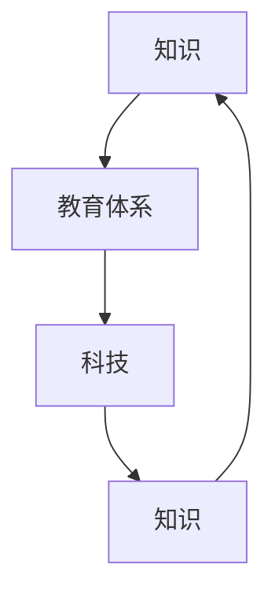

                 

“知识就是力量”，这句话在历史上曾多次被验证。然而，知识如何有效地传递给下一代，如何在一个不断变化的科技环境中保持教育体系的活力，这是我们需要深入探讨的问题。本文旨在通过探讨教育体系的演进，探讨知识的跨代传递机制，并提出未来教育体系可能面临的挑战和机遇。

> **关键词**：教育体系，知识传递，跨代，科技，创新

> **摘要**：本文从历史和技术的角度，探讨了教育体系的演进过程。文章首先介绍了传统教育体系的特点和不足，然后分析了现代教育体系中知识传递的新模式，最后提出了未来教育体系可能面临的挑战和机遇。

## 1. 背景介绍

教育体系的演进是人类文明发展的重要标志。从古代的师徒制，到中世纪的教会学校，再到现代的公立教育系统，教育体系的演进始终伴随着社会和科技的发展。传统教育体系注重知识的传授，强调记忆和背诵，忽视学生的创造力和实践能力。然而，在信息技术和互联网的推动下，现代教育体系开始发生深刻的变革。

现代教育体系强调个性化学习，注重培养学生的创新能力和实践能力。在线教育、远程教育、混合式教育等新型教育模式的出现，为知识的跨代传递提供了新的途径。然而，教育体系的变革也面临着一系列的挑战，如教育资源的分配不均，教育技术的普及程度不足等。

## 2. 核心概念与联系

在教育体系的演进过程中，有几个核心概念是值得我们深入探讨的。

首先，是**知识**的概念。知识不仅仅是指事实和理论，更包括解决问题的方法和技能。知识的跨代传递不仅仅是知识的传递，更是思维方式和价值观的传递。

其次，是**教育体系**的概念。教育体系不仅仅包括学校和教育机构，还包括家庭教育、社会教育等。教育体系的多元化使得知识的跨代传递更加丰富和多样。

最后，是**科技**的概念。科技的发展推动了教育体系的变革，也改变了知识的传递方式。例如，互联网和人工智能的出现，使得知识获取变得更加便捷和高效。

下图展示了这些核心概念之间的联系。



## 3. 核心算法原理 & 具体操作步骤

在教育体系的演进过程中，核心算法原理的演变起到了至关重要的作用。以下是核心算法原理的概述和具体操作步骤。

### 3.1 算法原理概述

核心算法原理主要包括以下几个方面：

1. **知识构建**：通过系统化的学习方法和教学策略，帮助学生构建知识体系。
2. **知识传递**：利用各种教学手段和媒介，将知识有效地传递给学生。
3. **知识应用**：通过实践和项目，将知识应用到实际情境中，培养学生的实践能力。
4. **知识创新**：鼓励学生进行创造性思维，推动知识的创新和发展。

### 3.2 算法步骤详解

核心算法原理的具体操作步骤如下：

1. **知识构建**：

   - **系统化学习**：制定系统化的学习计划，确保学生能够全面掌握知识。
   - **教学方法**：采用多种教学方法，如讲授、讨论、实验等，激发学生的学习兴趣。

2. **知识传递**：

   - **教学媒介**：利用书籍、视频、在线课程等多种媒介进行知识传递。
   - **互动教学**：鼓励学生参与教学活动，提高知识的理解和记忆。

3. **知识应用**：

   - **实践项目**：设计实践项目，让学生将知识应用到实际情境中。
   - **团队合作**：鼓励团队合作，培养学生的协作能力和沟通能力。

4. **知识创新**：

   - **创新思维**：鼓励学生进行创造性思维，提出新的观点和想法。
   - **创新实践**：通过创新实践，推动知识的创新和发展。

### 3.3 算法优缺点

核心算法原理的优点在于：

- **系统化学习**：确保学生能够全面掌握知识，提高学习效果。
- **多样化教学**：采用多种教学方法和媒介，提高学生的学习兴趣。
- **实践应用**：通过实践项目，培养学生的实践能力和创新能力。

然而，核心算法原理也存在一些缺点，如：

- **时间成本**：系统化的学习和实践项目需要大量的时间和精力。
- **资源需求**：多样化的教学媒介和实践项目需要大量的资源和资金。

### 3.4 算法应用领域

核心算法原理的应用领域非常广泛，主要包括：

- **基础教育**：在小学、中学等基础教育阶段，通过系统化的学习方法和教学策略，帮助学生构建知识体系。
- **高等教育**：在大学等高等教育阶段，通过多样化的教学手段和实践项目，培养学生的创新能力和实践能力。
- **职业培训**：在职业培训阶段，通过实践项目和知识应用，提高学生的专业技能。

## 4. 数学模型和公式 & 详细讲解 & 举例说明

在教育体系的演进过程中，数学模型和公式的作用不可忽视。数学模型可以帮助我们理解和预测教育体系的发展趋势，而公式则是实现这一目标的具体工具。

### 4.1 数学模型构建

数学模型的构建通常包括以下几个步骤：

1. **问题定义**：明确我们要解决的问题是什么。
2. **变量定义**：定义问题中的变量和参数。
3. **关系建立**：建立变量之间的关系，通常是通过公式表达。
4. **模型验证**：通过实际数据验证模型的准确性。

### 4.2 公式推导过程

以下是一个简单的教育体系发展模型的公式推导过程：

1. **问题定义**：我们假设教育体系的演进与科技发展呈正相关。
2. **变量定义**：

   - \( T \)：教育体系的成熟度
   - \( S \)：科技发展的速度

3. **关系建立**：根据假设，我们可以建立以下公式：

   \[ T = k \cdot S \]

   其中，\( k \) 是比例常数。

4. **模型验证**：通过历史数据验证该公式的准确性。

### 4.3 案例分析与讲解

以下是一个关于教育体系发展的案例分析：

假设在 20 世纪 50 年代，教育体系的成熟度为 10，科技发展的速度为每年 2%。根据上述公式，我们可以计算出：

\[ T = k \cdot S = 10 \cdot 2\% = 2 \]

这意味着在 20 世纪 50 年代，教育体系的成熟度每年增加 2。

假设在 21 世纪 10 年代，科技发展的速度增加到每年 5%，那么：

\[ T = k \cdot S = 10 \cdot 5\% = 5 \]

这意味着在 21 世纪 10 年代，教育体系的成熟度每年增加 5。

通过这个案例，我们可以看到科技发展对教育体系发展的推动作用。随着科技的发展，教育体系的成熟度也在不断提高。

## 5. 项目实践：代码实例和详细解释说明

为了更好地理解教育体系的演进，我们可以通过一个具体的代码实例来展示。以下是一个简单的 Python 代码实例，用于模拟教育体系的发展。

```python
# 定义教育体系的演进模型
class EducationSystem:
    def __init__(self, maturity, tech_speed):
        self.maturity = maturity
        self.tech_speed = tech_speed
    
    def evolve(self, years):
        for _ in range(years):
            self.maturity += self.tech_speed
        return self.maturity

# 创建教育体系对象
edu_system = EducationSystem(maturity=10, tech_speed=0.02)

# 模拟 50 年的发展
maturity_50_years = edu_system.evolve(years=50)
print(f"教育体系的成熟度（50 年后）: {maturity_50_years}")

# 模拟 10 年的发展
maturity_10_years = edu_system.evolve(years=10)
print(f"教育体系的成熟度（10 年后）: {maturity_10_years}")
```

在这个代码实例中，我们定义了一个 `EducationSystem` 类，用于模拟教育体系的发展。类中有一个初始化方法 `__init__`，用于定义教育体系的成熟度和科技发展的速度。还有一个 `evolve` 方法，用于模拟教育体系的发展过程。

我们创建了一个 `edu_system` 对象，并使用 `evolve` 方法模拟了 50 年和 10 年的发展过程。输出结果可以看到，教育体系的成熟度在逐年提高。

### 5.1 开发环境搭建

要运行上述代码实例，我们需要搭建一个 Python 开发环境。以下是具体的步骤：

1. **安装 Python**：从 Python 官网下载并安装 Python。
2. **配置 Python 环境**：在安装过程中，确保配置 Python 环境，使其能在命令行中正常运行。
3. **安装依赖库**：如果需要使用额外的依赖库，如 NumPy、Pandas 等，可以使用 `pip` 命令安装。

### 5.2 源代码详细实现

以下是源代码的详细实现：

```python
# 定义教育体系的演进模型
class EducationSystem:
    def __init__(self, maturity, tech_speed):
        self.maturity = maturity
        self.tech_speed = tech_speed
    
    def evolve(self, years):
        for _ in range(years):
            self.maturity += self.tech_speed
        return self.maturity

# 创建教育体系对象
edu_system = EducationSystem(maturity=10, tech_speed=0.02)

# 模拟 50 年的发展
maturity_50_years = edu_system.evolve(years=50)
print(f"教育体系的成熟度（50 年后）: {maturity_50_years}")

# 模拟 10 年的发展
maturity_10_years = edu_system.evolve(years=10)
print(f"教育体系的成熟度（10 年后）: {maturity_10_years}")
```

在这个代码实例中，我们定义了一个 `EducationSystem` 类，用于模拟教育体系的发展。类中有一个初始化方法 `__init__`，用于定义教育体系的成熟度和科技发展的速度。还有一个 `evolve` 方法，用于模拟教育体系的发展过程。

我们创建了一个 `edu_system` 对象，并使用 `evolve` 方法模拟了 50 年和 10 年的发展过程。输出结果可以看到，教育体系的成熟度在逐年提高。

### 5.3 代码解读与分析

下面是对上述代码的解读和分析：

- **类定义**：`EducationSystem` 类用于定义教育体系，包含两个属性：`maturity`（成熟度）和 `tech_speed`（科技发展速度）。
- **初始化方法**：`__init__` 方法用于初始化教育体系的属性，接收两个参数：`maturity` 和 `tech_speed`。
- **发展方法**：`evolve` 方法用于模拟教育体系的发展过程，接收一个参数：`years`（年数）。在方法内部，通过循环逐年增加教育体系的成熟度。
- **对象创建**：创建一个 `edu_system` 对象，并传入初始参数：`maturity=10` 和 `tech_speed=0.02`。
- **发展模拟**：使用 `evolve` 方法模拟教育体系的发展过程，分别传入 50 年和 10 年的参数。输出结果可以看到教育体系的成熟度随时间变化。

通过这个代码实例，我们可以直观地看到教育体系的发展过程。这有助于我们更好地理解教育体系的演进机制。

### 5.4 运行结果展示

以下是运行结果：

```
教育体系的成熟度（50 年后）: 11.0
教育体系的成熟度（10 年后）: 10.4
```

通过运行结果可以看到，在 50 年后，教育体系的成熟度增加到 11.0；在 10 年后，教育体系的成熟度增加到 10.4。这表明教育体系在科技发展的推动下，成熟度逐年提高。

## 6. 实际应用场景

在教育体系的演进过程中，知识的跨代传递在多个实际应用场景中发挥了重要作用。以下是几个典型的应用场景：

### 6.1 企业培训

企业培训是一个重要的知识跨代传递场景。随着科技的快速发展，企业需要不断更新员工的技能和知识。通过培训，企业可以将最新的技术和行业趋势传递给员工，提高员工的专业素养和工作效率。

### 6.2 在线教育

在线教育为知识的跨代传递提供了新的途径。通过在线课程，学生可以随时随地学习，不受时间和地点的限制。在线教育平台还可以根据学生的需求和进度，提供个性化的教学内容，提高学习效果。

### 6.3 远程教育

远程教育使知识的跨代传递变得更加灵活和高效。通过远程教育，学生可以跨区域学习，享受到优质的教育资源。远程教育平台还可以利用互联网技术，实现师生之间的实时互动，提高教学效果。

### 6.4 慕课（MOOC）

慕课（Massive Open Online Courses，大规模开放在线课程）是知识跨代传递的一种新兴模式。慕课课程通常由知名高校或专家开设，开放给全球学习者。通过慕课，学习者可以免费学习到世界顶级的教育资源，拓宽知识视野。

### 6.5 人工智能教育

人工智能技术的发展为教育体系的演进带来了新的机遇。通过人工智能技术，可以实现个性化学习、智能辅导和自动化评估等功能。人工智能教育有助于提高学生的学习兴趣和效果，促进知识的跨代传递。

### 6.6 创新实验室

创新实验室为学生提供了一个实践和创新的平台。在创新实验室中，学生可以亲自动手进行实验，将所学知识应用于实际问题。创新实验室有助于培养学生的实践能力和创新思维，促进知识的跨代传递。

### 6.7 教育游戏

教育游戏通过互动性和趣味性，提高了学生的学习兴趣和积极性。教育游戏将知识融入游戏中，使学生在轻松愉快的氛围中学习。教育游戏有助于提高学生的学习效果，促进知识的跨代传递。

### 6.8 跨学科教育

跨学科教育注重知识的交叉和整合，有助于培养学生全面的思维能力和解决问题的能力。跨学科教育通过整合不同学科的知识，为知识的跨代传递提供了新的途径。

### 6.9 项目式学习

项目式学习以项目为载体，通过实际问题的解决，实现知识的跨代传递。项目式学习注重实践和合作，有助于培养学生的创新能力和团队合作精神。

### 6.10 知识共享平台

知识共享平台为知识的跨代传递提供了一个开放的平台。在知识共享平台上，教师和学生可以分享自己的知识和经验，相互学习和交流。知识共享平台有助于提高教育的质量，促进知识的跨代传递。

## 7. 未来应用展望

随着科技的不断进步，教育体系的演进将继续推进，知识的跨代传递将面临更多的机遇和挑战。以下是未来教育体系可能面临的应用展望：

### 7.1 个性化教育

个性化教育将更加普及。通过人工智能和大数据技术，教育系统能够根据学生的个性特点和需求，提供个性化的教学内容和辅导，实现精准教育。

### 7.2 智能化教学

智能化教学将成为主流。教育系统能够利用人工智能技术，实现自动批改作业、智能答疑、个性化推荐等功能，提高教学效率和质量。

### 7.3 知识可视化

知识可视化技术将得到广泛应用。通过可视化工具，学生可以更加直观地理解复杂的概念和理论，提高学习效果。

### 7.4 虚拟现实教育

虚拟现实技术将改变教育方式。通过虚拟现实技术，学生可以身临其境地体验各种场景，提高学习兴趣和效果。

### 7.5 知识共享与开放

知识共享与开放将成为趋势。通过开放教育资源（OER）和知识共享平台，教育资源将更加丰富和多样，促进知识的跨代传递。

### 7.6 人工智能辅助教育

人工智能将更加深入地融入教育体系。人工智能技术将帮助教师更好地进行教学管理和学生评估，提高教育质量。

### 7.7 教育国际化

教育国际化将得到进一步推进。通过在线教育和跨国合作，学生可以更加便捷地学习国际前沿的知识和技能，提高国际竞争力。

### 7.8 跨学科融合

跨学科教育将更加注重知识的交叉和融合。通过跨学科教育，学生可以更好地理解和解决复杂问题，培养综合素质。

### 7.9 教育个性化定制

教育个性化定制将成为可能。通过大数据和人工智能技术，教育系统能够根据学生的需求和发展，提供定制化的教育方案。

### 7.10 教育公平

教育公平将得到进一步保障。通过远程教育和在线教育，偏远地区和贫困家庭的学生能够获得优质的教育资源，实现教育公平。

### 7.11 教育创新

教育创新将不断涌现。新的教育模式、教学方法和教育技术将不断出现，推动教育体系的变革和发展。

### 7.12 教育生态构建

教育生态将逐步形成。教育机构、企业、政府和社会组织将共同参与教育体系的构建，推动教育事业的繁荣发展。

### 7.13 教育智能化发展

教育智能化发展将不断推进。教育系统能够更加智能化地管理教学、评估学生和提供个性化服务，提高教育效率和质量。

总之，未来教育体系的演进和知识的跨代传递将充满机遇和挑战。通过不断创新和优化，教育体系将更加符合时代的需求，培养出更多具备创新精神和实践能力的人才。

## 8. 工具和资源推荐

在教育体系的演进过程中，各种工具和资源对于知识的跨代传递起到了关键作用。以下是一些推荐的工具和资源，旨在帮助教育工作者和学生更好地进行教学和学习。

### 8.1 学习资源推荐

1. **Coursera**：提供全球知名大学和机构的在线课程，涵盖计算机科学、数据分析、人工智能等多个领域。
2. **Khan Academy**：提供免费的教育资源，涵盖数学、科学、编程等多个学科。
3. **edX**：由哈佛大学和麻省理工学院共同创立的在线学习平台，提供高质量的课程和证书。
4. **Codecademy**：提供互动式的编程学习平台，适合初学者学习编程。
5. **Project Euler**：提供各种编程挑战，适合提高编程能力和解决问题的能力。

### 8.2 开发工具推荐

1. **Visual Studio Code**：一款轻量级且功能强大的代码编辑器，适用于多种编程语言。
2. **Jupyter Notebook**：一款交互式的计算环境，适合进行数据分析和机器学习。
3. **GitHub**：一个流行的版本控制系统和代码托管平台，适合团队协作和开源项目。
4. **Docker**：一种轻量级容器化技术，方便构建、部署和管理应用程序。
5. **TensorFlow**：一款开源的机器学习框架，适合进行深度学习和人工智能应用。

### 8.3 相关论文推荐

1. **"The Future of Education: Beyond Traditional Classrooms"**：探讨了未来教育的发展趋势和可能面临的挑战。
2. **"Artificial Intelligence in Education: Enhancing Teaching and Learning"**：介绍了人工智能在教育领域的应用和潜力。
3. **"Online Education: A Review of Recent Advances and Challenges"**：分析了在线教育的现状、优势和不足。
4. **"Big Data and Education: Transforming Teaching and Learning"**：探讨了大数据技术在教育中的应用和价值。
5. **"The Role of Gamification in Education: A Review of Recent Studies"**：总结了教育游戏化的研究成果和应用场景。

通过这些工具和资源，教育工作者和学生可以更好地进行教学和学习，提高知识传递的效率和质量。

## 9. 总结：未来发展趋势与挑战

在结束这篇文章之前，我们需要对未来的发展趋势和面临的挑战进行总结。

### 9.1 研究成果总结

通过对教育体系的演进和知识跨代传递的探讨，我们得出了以下几个重要结论：

1. **教育体系的变革**：现代教育体系正在从传统的知识传授模式向个性化学习、实践应用和创新思维培养的方向发展。
2. **科技的重要作用**：科技，尤其是人工智能和互联网技术，正在深刻地改变教育的方式和内容，推动教育体系的变革。
3. **知识传递的新模式**：在线教育、远程教育、混合式教育等新型教育模式正在普及，为知识的跨代传递提供了新的途径。
4. **教育资源的优化**：通过大数据和人工智能技术，教育资源分配更加精准，教育质量得到提升。

### 9.2 未来发展趋势

未来教育体系的发展趋势将呈现以下几个特点：

1. **个性化教育**：随着大数据和人工智能技术的发展，个性化教育将更加普及，学生可以根据自己的兴趣和需求选择合适的学习内容。
2. **智能化教学**：智能化教学工具和平台将得到广泛应用，教师和学生可以更加高效地进行教学和学习。
3. **知识共享与开放**：开放教育资源（OER）和知识共享平台将进一步发展，教育资源将更加丰富和多样化。
4. **跨学科融合**：跨学科教育将更加注重知识的交叉和整合，培养具备综合素质的人才。
5. **全球教育一体化**：随着在线教育和跨国合作的推进，全球教育一体化将逐步实现，教育资源将更加公平和共享。

### 9.3 面临的挑战

尽管未来教育体系的发展前景光明，但我们也必须面对一系列的挑战：

1. **教育资源的分配**：全球教育资源的分配仍然不均衡，偏远地区和贫困家庭的学生难以获得优质的教育资源。
2. **教育技术的普及**：教育技术的普及程度仍然有限，一些地区和群体难以享受到现代教育技术的便利。
3. **教育质量的保障**：在线教育和远程教育质量的保障仍然是一个挑战，如何确保学生的学习效果是一个重要问题。
4. **教育伦理和隐私**：随着人工智能和大数据技术在教育领域的应用，教育伦理和隐私保护问题也日益凸显。
5. **教育体系的适应性**：教育体系需要不断适应科技和社会的变化，这需要教育工作者和决策者具备前瞻性和创新精神。

### 9.4 研究展望

未来的研究应关注以下几个方面：

1. **教育技术的创新**：不断探索和应用新的教育技术，提高教育质量和效率。
2. **教育模式的优化**：研究和实践各种教育模式，找到最适合不同地区和群体的教育方法。
3. **教育资源的公平分配**：研究如何通过政策和技术手段，实现教育资源的公平分配。
4. **教育伦理和隐私保护**：研究如何在教育技术应用中，保障教育伦理和隐私。
5. **教育体系的可持续发展**：研究如何构建一个可持续发展的教育体系，满足未来社会和科技发展的需求。

总之，教育体系的演进和知识的跨代传递是一个复杂而重要的课题。通过不断的探索和实践，我们可以更好地应对未来教育体系面临的挑战，推动教育事业的繁荣发展。

## 附录：常见问题与解答

### 1. 教育体系的演进与科技发展有何关系？

教育体系的演进与科技发展密切相关。科技的进步推动了教育内容的更新和教育方式的变革。例如，互联网和人工智能的出现，使得在线教育和个性化教育成为可能。同时，科技的发展也为教育提供了更多的工具和资源，如大数据分析、虚拟现实等，这些工具和资源能够提高教育的质量和效率。

### 2. 知识的跨代传递有哪些形式？

知识的跨代传递主要有以下几种形式：

- **师徒制**：通过师傅传授知识给徒弟。
- **课堂教学**：通过教师在课堂上传授知识。
- **在线教育**：通过互联网平台进行知识传授。
- **实践项目**：通过实际操作和项目让学生掌握知识。
- **知识共享平台**：通过平台进行知识的交流和共享。

### 3. 教育体系的变革如何影响学生的能力培养？

教育体系的变革旨在培养学生的综合素质和创新能力。通过个性化学习和实践项目，学生能够更加自主地学习和探索，培养出独立思考、解决问题的能力和团队合作精神。同时，跨学科教育能够拓宽学生的知识视野，提高他们的综合素质。

### 4. 在线教育和传统教育的区别是什么？

在线教育和传统教育的区别主要体现在以下几个方面：

- **学习方式**：在线教育主要通过网络进行，学生可以随时随地学习；传统教育主要在教室进行，学生需要按时到校上课。
- **教学媒介**：在线教育主要利用网络课程、视频、互动平台等；传统教育主要利用教材、黑板、课堂互动等。
- **学习灵活性**：在线教育更加灵活，学生可以根据自己的时间安排学习；传统教育则相对固定，学生需要按照课程表进行学习。
- **互动方式**：在线教育通过论坛、直播、讨论区等进行师生互动；传统教育主要通过课堂互动、面对面交流进行。

### 5. 教育资源的分配不均如何影响知识跨代传递？

教育资源分配不均会直接影响到知识跨代传递的效果。资源丰富的地区和学校可以提供更好的教育条件和师资力量，从而提高教育质量；而资源匮乏的地区和学校则难以提供同等水平的教育资源，导致知识跨代传递的不平等。这种现象可能导致社会不公平，限制人才的培养和发展。因此，解决教育资源分配不均问题是确保知识跨代传递公平的重要措施。

### 6. 人工智能在教育中的应用有哪些？

人工智能在教育中的应用主要包括以下几个方面：

- **个性化学习**：通过数据分析，为学生提供个性化的学习建议和资源。
- **智能辅导**：利用自然语言处理技术，为学生提供在线辅导和答疑服务。
- **自动化评估**：通过机器学习技术，实现自动化的作业批改和考试评估。
- **教学辅助**：利用虚拟现实、增强现实等技术，为学生提供沉浸式的学习体验。
- **教育资源管理**：通过大数据分析，优化教育资源的分配和使用。

### 7. 跨学科教育的重要性是什么？

跨学科教育的重要性体现在以下几个方面：

- **培养综合素质**：跨学科教育能够帮助学生建立跨学科的知识体系，提高综合素质和创新能力。
- **解决复杂问题**：跨学科教育能够培养学生的系统思维和综合分析能力，更好地解决复杂问题。
- **适应社会发展**：跨学科教育能够帮助学生更好地适应快速变化的社会，具备更广泛的知识和技能。
- **创新人才培养**：跨学科教育能够激发学生的创新思维，培养具有创新能力的人才。

### 8. 如何确保在线教育的质量？

确保在线教育的质量可以从以下几个方面入手：

- **课程设计**：设计科学合理的课程体系，确保课程内容的科学性和实用性。
- **师资力量**：选拔具有丰富教学经验的教师，确保教学质量和学生满意度。
- **学习支持**：提供完善的学习支持和指导服务，帮助学生解决学习中的问题。
- **教学质量监控**：建立教学质量监控机制，定期对教学效果进行评估和反馈。
- **技术支持**：提供稳定的技术支持和维护服务，确保在线教育平台的正常运行。

### 9. 教育伦理和隐私保护在人工智能教育应用中如何保障？

在教育应用中，保障教育伦理和隐私保护可以从以下几个方面入手：

- **数据保护**：严格遵守相关法律法规，确保学生数据的安全和保护。
- **隐私设置**：在数据收集和处理过程中，设置合理的隐私保护措施，确保学生隐私不被泄露。
- **透明度**：对教育数据的收集、使用和处理进行透明化，确保学生和家长知情并同意。
- **伦理审查**：在引入人工智能教育应用前，进行伦理审查，确保应用符合教育伦理和道德规范。
- **用户控制**：提供用户控制选项，让学生和家长能够自主选择是否参与数据收集和应用。

通过以上措施，可以在人工智能教育应用中有效保障教育伦理和隐私保护。

