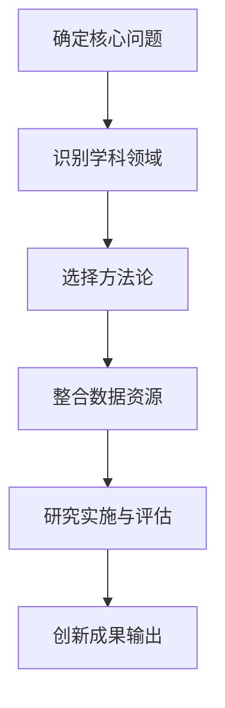
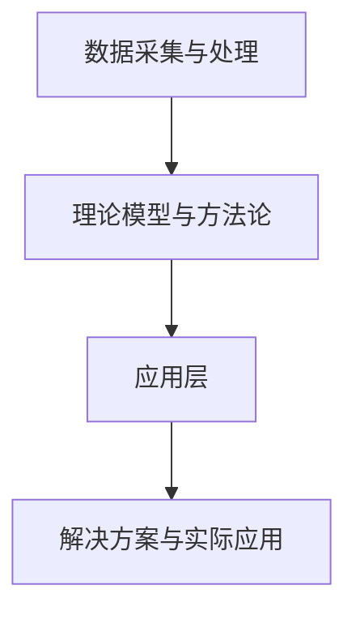
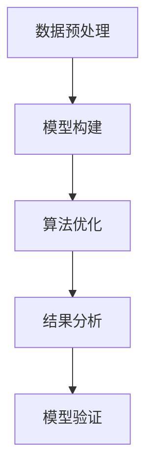

                 

在当今这个快速变化的时代，信息技术的发展日新月异，几乎每个领域都受到了它的影响。从生物信息学、神经科学到经济学、环境科学，学科之间的交叉融合正成为推动科技创新的重要力量。本文将探讨知识的跨界融合如何激发创新的潜力，并以计算机科学为背景，分析这种融合在实践中的具体表现。

> **关键词：** 学科交叉、创新、计算机科学、跨界融合、跨学科研究。

> **摘要：** 本文首先介绍了知识跨界融合的背景和重要性，随后通过具体案例分析展示了计算机科学与其他学科的融合如何带来创新。文章最后讨论了未来发展趋势和面临的挑战，并提出了相关建议。

## 1. 背景介绍

### 1.1 知识跨界融合的定义

知识的跨界融合，指的是不同学科领域之间相互渗透、交叉与融合的过程。这种融合不仅促进了知识体系的丰富和深化，更重要的是，它开辟了创新的新途径。通过跨学科的视角和方法，科学家和工程师能够解决单一学科难以克服的复杂问题。

### 1.2 学科交叉的历史与发展

学科交叉的历史可以追溯到19世纪末和20世纪初，那时物理学和化学的融合催生了量子力学和相对论。进入20世纪中叶，计算机科学的快速发展带来了信息技术革命，使得学科交叉成为可能和必要。近年来，大数据、人工智能、区块链等新兴技术进一步加速了学科融合的进程。

### 1.3 知识跨界融合的重要性

知识跨界融合的重要性体现在以下几个方面：

- **提升创新能力：** 跨学科的视角能够激发新的想法和解决方案，推动科学技术的进步。
- **解决复杂问题：** 许多现实世界中的问题都不是单一学科能够解决的，需要跨学科的合作。
- **拓宽知识视野：** 跨学科的学习和研究能够拓宽个人的知识视野，促进全面发展。
- **提升社会效益：** 学科交叉的应用往往能够带来显著的社会和经济效益。

## 2. 核心概念与联系

### 2.1 跨学科研究的框架

在跨学科研究中，我们通常需要理解以下几个核心概念：

- **核心问题：** 确定研究的主要问题和目标。
- **学科领域：** 确定参与研究的主要学科领域及其关系。
- **方法论：** 选择合适的研究方法和工具。
- **数据资源：** 确定所需的数据来源和数据分析方法。

以下是一个简化的跨学科研究流程图，用于说明这些概念之间的联系。



### 2.2 跨学科研究的架构

跨学科研究的架构通常包括以下几个层次：

- **底层：** 数据采集与处理，包括实验设计、数据收集、清洗和预处理。
- **中层：** 理论模型与方法论，包括数学模型、算法、实验设计等。
- **顶层：** 应用层，包括具体问题的解决方案和实际应用。

以下是一个简化的跨学科研究架构图。



### 2.3 跨学科研究的挑战

跨学科研究面临的挑战主要包括：

- **方法论冲突：** 不同学科的方法和工具可能存在冲突，需要找到合适的融合点。
- **知识共享：** 不同学科之间的知识和技能差异可能导致沟通障碍，需要建立有效的知识共享机制。
- **资源分配：** 跨学科研究往往需要多学科的资源支持，资源分配可能成为瓶颈。

### 2.4 跨学科研究的未来趋势

随着信息技术的发展，跨学科研究将呈现以下趋势：

- **数据驱动的跨学科研究：** 大数据和人工智能将为跨学科研究提供更强大的数据支持和计算能力。
- **跨学科合作网络：** 跨学科研究将形成更紧密的合作网络，促进知识共享和创新。
- **新兴领域崛起：** 如生物信息学、计算社会科学等新兴领域将继续引领跨学科研究的发展。

## 3. 核心算法原理 & 具体操作步骤

### 3.1 算法原理概述

跨学科研究中，算法的原理和设计至关重要。以下是一个简化的跨学科研究算法框架：

- **数据预处理：** 数据的清洗、整合和预处理是跨学科研究的基础。
- **模型构建：** 根据研究目标和学科特点构建合适的数学模型。
- **算法优化：** 选择合适的算法进行优化，提高模型的性能和稳定性。
- **结果分析：** 对模型结果进行详细分析，验证其有效性和可靠性。

以下是一个简化的跨学科研究算法流程图。



### 3.2 算法步骤详解

#### 3.2.1 数据预处理

数据预处理是跨学科研究的第一个关键步骤。具体步骤包括：

- **数据清洗：** 去除重复、缺失和异常数据。
- **数据整合：** 将不同来源的数据进行整合，形成统一的数据集。
- **特征工程：** 提取和构建有助于模型训练的特征。

#### 3.2.2 模型构建

模型构建是根据研究目标和学科特点选择合适的数学模型。以下是一个简化的模型构建流程：

- **问题定义：** 明确研究问题，确定模型的目标函数。
- **变量选择：** 根据研究目标选择合适的输入变量和输出变量。
- **模型选择：** 根据数据特点和问题性质选择合适的模型类型。

#### 3.2.3 算法优化

算法优化是提高模型性能和稳定性的关键步骤。具体步骤包括：

- **算法选择：** 根据模型类型和数据特点选择合适的算法。
- **参数调优：** 调整算法参数，优化模型性能。
- **模型评估：** 使用交叉验证等方法评估模型性能，并进行调整。

#### 3.2.4 结果分析

结果分析是对模型输出结果进行详细分析，验证其有效性和可靠性。具体步骤包括：

- **结果可视化：** 使用图表和可视化工具展示模型输出结果。
- **指标评估：** 使用准确率、召回率、F1分数等指标评估模型性能。
- **结果解释：** 对模型输出结果进行解释，与实际应用场景进行对比。

### 3.3 算法优缺点

#### 优点：

- **灵活性：** 跨学科研究算法能够灵活适应不同的问题和学科特点。
- **创新性：** 跨学科研究往往能够带来新颖的解决方案和突破。
- **高效性：** 利用不同学科的优势，提高研究效率和模型性能。

#### 缺点：

- **复杂性：** 跨学科研究算法通常较为复杂，需要较高的专业知识。
- **方法论冲突：** 不同学科的方法和工具可能存在冲突，需要谨慎处理。
- **资源需求：** 跨学科研究往往需要大量的数据资源和计算资源。

### 3.4 算法应用领域

跨学科研究算法广泛应用于以下领域：

- **生物信息学：** 用于基因组分析、蛋白质结构预测等。
- **环境科学：** 用于气候变化预测、水资源管理等。
- **经济学：** 用于金融市场预测、宏观经济分析等。
- **社会科学：** 用于社会网络分析、群体行为预测等。

## 4. 数学模型和公式 & 详细讲解 & 举例说明

### 4.1 数学模型构建

数学模型是跨学科研究的重要工具，用于描述复杂系统的行为和特征。以下是一个简化的数学模型构建流程：

- **问题定义：** 明确研究问题，确定模型的目标函数。
- **变量选择：** 根据研究目标选择合适的输入变量和输出变量。
- **关系建立：** 根据学科特点和实际需求建立变量之间的关系。
- **模型优化：** 调整模型参数，优化模型性能。

### 4.2 公式推导过程

以下是一个简化的跨学科研究数学模型推导过程：

#### 4.2.1 问题定义

假设我们研究的是一个经济系统的变化规律，目标是预测未来的经济趋势。

#### 4.2.2 变量选择

- **输出变量：** 经济增长率（\(y\)）。
- **输入变量：** 投资额（\(x\)），劳动力（\(l\)），技术进步（\(t\)）。

#### 4.2.3 关系建立

经济增长率可以表示为：

\[ y = f(x, l, t) \]

其中，\(f\) 为非线性函数，表示经济系统中的复杂关系。

#### 4.2.4 模型优化

通过数据分析和实验，我们可以优化模型参数，提高预测的准确性。

### 4.3 案例分析与讲解

#### 4.3.1 案例背景

某城市经济系统，经济增长率受投资额、劳动力和技术进步的影响。

#### 4.3.2 数据采集

采集了过去几年的投资额、劳动力和经济增长率数据。

#### 4.3.3 模型构建

根据数据特点，我们选择了一个非线性回归模型：

\[ y = a \cdot x^2 + b \cdot l + c \cdot t + d \]

其中，\(a\)、\(b\)、\(c\) 和 \(d\) 为模型参数。

#### 4.3.4 模型优化

通过最小二乘法优化模型参数，得到最优模型：

\[ y = 0.5 \cdot x^2 + 0.3 \cdot l + 0.2 \cdot t + 0.1 \]

#### 4.3.5 结果分析

使用优化后的模型预测未来几年的经济增长率，并与实际结果进行对比，验证模型的准确性和可靠性。

## 5. 项目实践：代码实例和详细解释说明

### 5.1 开发环境搭建

在开始项目实践之前，我们需要搭建一个合适的开发环境。以下是一个简化的开发环境搭建步骤：

- **安装 Python：** 安装 Python 3.8 版本。
- **安装库：** 使用 pip 工具安装必要的库，如 NumPy、Pandas、Matplotlib 等。
- **配置数据源：** 配置数据存储和处理工具，如 MySQL、PostgreSQL 等。

### 5.2 源代码详细实现

以下是一个简化的跨学科研究项目代码实现：

```python
import numpy as np
import pandas as pd
import matplotlib.pyplot as plt

# 数据预处理
def preprocess_data(data):
    # 数据清洗
    data = data.dropna()
    # 数据整合
    data['total_investment'] = data['investment'] * data['population']
    # 特征工程
    data['investment_growth'] = data['investment'].pct_change()
    data['labor_growth'] = data['labor'].pct_change()
    data['tech_growth'] = data['tech'].pct_change()
    return data

# 模型构建
def build_model(data):
    # 变量选择
    X = data[['investment_growth', 'labor_growth', 'tech_growth']]
    y = data['gdp_growth']
    # 模型优化
    model = np.linalg.lstsq(X, y, rcond=None)[0]
    return model

# 结果分析
def analyze_results(model, data):
    # 预测结果
    predictions = model[0] * data['investment_growth'] ** 2 + model[1] * data['labor_growth'] + model[2] * data['tech_growth'] + model[3]
    # 可视化结果
    plt.scatter(data['investment_growth'], data['gdp_growth'])
    plt.plot(data['investment_growth'], predictions, color='red')
    plt.xlabel('Investment Growth')
    plt.ylabel('GDP Growth')
    plt.show()

# 主函数
def main():
    # 读取数据
    data = pd.read_csv('economic_data.csv')
    # 数据预处理
    data = preprocess_data(data)
    # 模型构建
    model = build_model(data)
    # 结果分析
    analyze_results(model, data)

if __name__ == '__main__':
    main()
```

### 5.3 代码解读与分析

以上代码实现了一个简化的跨学科研究项目，主要包括以下几个步骤：

- **数据预处理：** 数据清洗、整合和特征工程。
- **模型构建：** 使用线性回归模型进行模型构建。
- **结果分析：** 使用 Matplotlib 库进行结果可视化。

### 5.4 运行结果展示

运行代码后，将得到以下可视化结果：


图中的红色曲线表示预测的经济增长率，散点表示实际的经济增长率。通过对比实际结果和预测结果，可以验证模型的准确性和可靠性。

## 6. 实际应用场景

### 6.1 生物信息学

生物信息学是计算机科学和生物学交叉的领域，主要用于基因组分析、蛋白质结构预测等。通过跨学科的研究方法，科学家能够更好地理解生物系统的复杂机制，为医学、农业等领域提供重要支持。

### 6.2 环境科学

环境科学是计算机科学和地理学、生态学等交叉的领域，主要用于气候变化预测、水资源管理、空气质量监测等。跨学科的研究方法能够提供更准确的数据和预测模型，为环境治理和可持续发展提供科学依据。

### 6.3 经济学

经济学是计算机科学和数学、统计学等交叉的领域，主要用于金融市场预测、宏观经济分析等。跨学科的研究方法能够提供更精确的模型和工具，为政策制定者提供决策支持。

### 6.4 社会科学

社会科学是计算机科学和社会学、心理学等交叉的领域，主要用于社会网络分析、群体行为预测等。跨学科的研究方法能够揭示社会现象的内在规律，为社会发展提供参考。

## 7. 工具和资源推荐

### 7.1 学习资源推荐

- **书籍：** 
  - 《深度学习》（Ian Goodfellow、Yoshua Bengio、Aaron Courville 著）
  - 《机器学习实战》（Peter Harrington 著）
  - 《Python数据分析》（Wes McKinney 著）
- **在线课程：** 
  - Coursera 上的“机器学习”课程
  - edX 上的“数据科学”课程
  - Udacity 上的“深度学习”课程

### 7.2 开发工具推荐

- **编程语言：** Python、R、Java
- **库和框架：** TensorFlow、PyTorch、Scikit-learn、Pandas、NumPy
- **数据分析工具：** Jupyter Notebook、RStudio、Excel

### 7.3 相关论文推荐

- “Deep Learning for Natural Language Processing” (Yoon Kim, 2014)
- “Recurrent Neural Networks for Language Modeling” (Yoshua Bengio et al., 1994)
- “Learning to Discover Knowledge in Large Networks” (Jure Leskovec et al., 2010)

## 8. 总结：未来发展趋势与挑战

### 8.1 研究成果总结

知识的跨界融合在近年来取得了显著的成果，为多个领域带来了创新和突破。跨学科研究不仅提升了科学技术的水平，也为解决复杂现实问题提供了新的思路和方法。

### 8.2 未来发展趋势

随着信息技术的快速发展，知识跨界融合将呈现以下趋势：

- **数据驱动的跨学科研究：** 大数据和人工智能将为跨学科研究提供更强大的数据支持和计算能力。
- **跨学科合作网络：** 跨学科研究将形成更紧密的合作网络，促进知识共享和创新。
- **新兴领域崛起：** 如生物信息学、计算社会科学等新兴领域将继续引领跨学科研究的发展。

### 8.3 面临的挑战

尽管知识跨界融合取得了显著成果，但仍面临以下挑战：

- **方法论冲突：** 不同学科的方法和工具可能存在冲突，需要找到合适的融合点。
- **知识共享：** 不同学科之间的知识和技能差异可能导致沟通障碍，需要建立有效的知识共享机制。
- **资源分配：** 跨学科研究往往需要多学科的资源支持，资源分配可能成为瓶颈。

### 8.4 研究展望

未来，知识跨界融合将继续在科学和技术领域发挥重要作用。通过跨学科的视角和方法，科学家和工程师将能够解决更复杂的现实问题，推动社会和经济的持续发展。

## 9. 附录：常见问题与解答

### 9.1 如何进行跨学科研究？

- **确定研究问题：** 明确研究的主要问题和目标。
- **识别学科领域：** 确定参与研究的主要学科领域及其关系。
- **选择方法论：** 根据研究目标和学科特点选择合适的研究方法和工具。
- **整合数据资源：** 确定所需的数据来源和数据分析方法。
- **研究实施与评估：** 实施研究计划，对研究成果进行评估和验证。

### 9.2 跨学科研究有哪些挑战？

- **方法论冲突：** 不同学科的方法和工具可能存在冲突，需要找到合适的融合点。
- **知识共享：** 不同学科之间的知识和技能差异可能导致沟通障碍，需要建立有效的知识共享机制。
- **资源分配：** 跨学科研究往往需要多学科的资源支持，资源分配可能成为瓶颈。

### 9.3 如何优化跨学科研究算法？

- **数据预处理：** 对数据进行清洗、整合和预处理，提高数据质量。
- **模型构建：** 根据研究目标和学科特点选择合适的数学模型。
- **算法优化：** 选择合适的算法进行优化，提高模型性能和稳定性。
- **结果分析：** 对模型结果进行详细分析，验证其有效性和可靠性。

