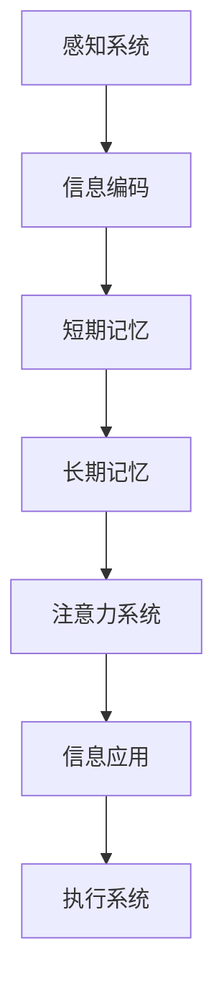

                 

关键词：知识积累、意识管理、认知架构、神经可塑性、信息处理、人工智能、记忆结构、知识图谱、学习算法。

> 摘要：本文深入探讨了知识积累在意识管理中的关键角色。通过解析认知架构、神经可塑性、信息处理机制，我们揭示了知识如何在人类和人工智能中发挥关键作用。此外，本文还探讨了知识积累对意识和行为的影响，以及未来人工智能在知识管理领域的潜在发展。

## 1. 背景介绍

在信息爆炸的时代，知识积累成为了个人和社会发展的关键要素。然而，知识不仅仅是信息的简单堆砌，它涉及人类意识的深层结构和复杂的行为模式。随着人工智能技术的飞速发展，如何模拟和增强人类的意识管理能力成为一个重要的研究方向。本文旨在探讨知识积累在意识管理中的角色，分析其在人类认知和人工智能中的应用，以期为未来的研究和应用提供理论支持。

### 1.1 知识积累的重要性

知识积累是人类文明进步的基石。从古代的口口相传到现代的信息存储与处理，知识的传承和发展一直是社会进步的重要推动力。知识的积累不仅涉及学科知识，还包括日常生活技能、社会规范和文化传承等方方面面。在个体层面，知识积累有助于提升个人认知能力、解决问题能力和创新能力。在社会层面，知识积累促进了社会的复杂性和多样性，为经济发展、科技进步和文化繁荣提供了坚实的基础。

### 1.2 意识管理的重要性

意识管理是指个体对自身意识和行为的管理能力。它涉及到对信息的接收、处理、存储和应用过程，是认知心理学、神经科学和人工智能研究的重要领域。良好的意识管理能力有助于提高个体的决策质量、情绪调节能力和适应能力。在现代社会，随着信息过载和复杂决策的增多，意识管理的重要性愈发凸显。

## 2. 核心概念与联系

### 2.1 认知架构

认知架构是指大脑处理信息和执行认知任务的框架。它包括感知系统、记忆系统、注意力系统和执行系统等组成部分。每个组成部分在知识积累和意识管理中扮演着不同的角色。

#### 感知系统

感知系统负责接收外部信息，如视觉、听觉、触觉等。这些信息经过感知系统的处理，转化为大脑可以理解的形式，进而参与意识管理。

#### 记忆系统

记忆系统包括短期记忆和长期记忆。短期记忆负责暂时存储和处理信息，而长期记忆则负责长期存储和提取信息。知识积累在很大程度上依赖于长期记忆的建立和优化。

#### 注意力系统

注意力系统负责在众多信息中选择和处理重要的信息。注意力管理的有效性直接影响到知识积累的质量和效率。

#### 执行系统

执行系统负责执行认知任务，如解决问题、做出决策等。知识积累和意识管理的效果需要在执行系统中得到验证和应用。

### 2.2 神经可塑性

神经可塑性是指大脑结构和功能的变化能力，是知识积累和意识管理的基础。神经可塑性使得大脑能够适应新的环境和挑战，通过改变神经元之间的连接和活动模式来实现知识积累和意识管理。

### 2.3 信息处理机制

信息处理机制是指大脑处理信息的过程，包括编码、存储、检索和应用。知识积累和信息处理机制密切相关，良好的信息处理机制有助于提升知识积累的效率和效果。

### 2.4 Mermaid 流程图



## 3. 核心算法原理 & 具体操作步骤

### 3.1 算法原理概述

知识积累在意识管理中的核心算法主要包括感知系统、记忆系统、注意力系统和执行系统的协同工作。感知系统通过神经网络模型实现对外部信息的编码和识别；记忆系统通过分布式存储机制实现知识的存储和检索；注意力系统通过注意力机制实现信息的选择和处理；执行系统通过决策树或神经网络模型实现认知任务的执行。

### 3.2 算法步骤详解

1. **感知系统工作原理**：通过卷积神经网络（CNN）或循环神经网络（RNN）对视觉或听觉信息进行编码和识别，将外部信息转化为内部表征。
   
2. **记忆系统工作原理**：通过分布式存储机制（如哈希表或神经网络）实现知识的存储和检索。分布式存储有助于提高知识检索的效率和鲁棒性。

3. **注意力系统工作原理**：通过注意力机制（如软注意力或硬注意力）实现信息的选择和处理。注意力机制有助于提升信息处理的效率和效果。

4. **执行系统工作原理**：通过决策树或神经网络模型实现认知任务的执行。执行系统需要结合感知系统、记忆系统和注意力系统的输出，实现有效的认知任务。

### 3.3 算法优缺点

**优点**：
- **高效性**：通过神经网络模型和分布式存储机制，算法在信息处理和知识积累方面具有较高的效率。
- **灵活性**：算法可以根据不同应用场景进行调整，实现灵活的知识积累和意识管理。

**缺点**：
- **复杂性**：算法涉及多个系统和机制，实现和优化较为复杂。
- **依赖数据**：算法的性能在很大程度上依赖于数据的数量和质量，数据不足或质量差可能导致算法效果不佳。

### 3.4 算法应用领域

- **智能助理**：通过知识积累和意识管理，智能助理可以实现更加智能化的服务和决策。
- **医疗诊断**：知识积累和意识管理有助于提高医疗诊断的准确性和效率。
- **教育应用**：知识积累和意识管理有助于提升学生的学习效果和认知能力。

## 4. 数学模型和公式 & 详细讲解 & 举例说明

### 4.1 数学模型构建

在知识积累和意识管理中，常用的数学模型包括神经网络模型、决策树模型和贝叶斯模型等。

#### 神经网络模型

神经网络模型是一种基于人工神经元的计算模型，可以用于知识积累和意识管理。其基本公式如下：

$$
y = \sigma(\sum_{i=1}^{n} w_i \cdot x_i)
$$

其中，$y$ 是输出，$\sigma$ 是激活函数，$w_i$ 是权重，$x_i$ 是输入。

#### 决策树模型

决策树模型是一种基于特征划分和决策规则的分类模型，可以用于知识积累和意识管理。其基本公式如下：

$$
y = \sum_{i=1}^{n} w_i \cdot x_i + b
$$

其中，$y$ 是输出，$w_i$ 是权重，$x_i$ 是输入，$b$ 是偏置。

#### 贝叶斯模型

贝叶斯模型是一种基于概率论的分类模型，可以用于知识积累和意识管理。其基本公式如下：

$$
P(y|X) = \frac{P(X|y) \cdot P(y)}{P(X)}
$$

其中，$P(y|X)$ 是后验概率，$P(X|y)$ 是似然概率，$P(y)$ 是先验概率，$P(X)$ 是边缘概率。

### 4.2 公式推导过程

#### 神经网络模型推导

假设输入向量为 $X = [x_1, x_2, ..., x_n]$，输出向量为 $Y = [y_1, y_2, ..., y_m]$。神经网络的输入层、隐藏层和输出层分别有 $n$、$h$ 和 $m$ 个神经元。

首先，隐藏层的输出可以表示为：

$$
z_i = \sum_{j=1}^{n} w_{ij} \cdot x_j + b_i
$$

其中，$z_i$ 是隐藏层第 $i$ 个神经元的输出，$w_{ij}$ 是连接权重，$b_i$ 是偏置。

然后，输出层的输出可以表示为：

$$
y_j = \sigma(\sum_{i=1}^{h} w_{ij} \cdot z_i)
$$

其中，$y_j$ 是输出层第 $j$ 个神经元的输出，$\sigma$ 是激活函数。

最终，网络的预测输出可以表示为：

$$
\hat{Y} = \sigma(\sum_{j=1}^{h} w_{ij} \cdot z_i)
$$

#### 决策树模型推导

假设数据集 $D = \{ (x_1, y_1), (x_2, y_2), ..., (x_n, y_n) \}$，其中 $x_i$ 是输入特征，$y_i$ 是输出标签。

首先，定义特征 $x_j$ 的条件熵 $H(X|Y)$：

$$
H(X|Y) = -\sum_{i=1}^{n} P(y_i) \cdot H(X|y_i)
$$

其中，$H(X|y_i)$ 是特征 $x_j$ 在给定标签 $y_i$ 的条件熵。

然后，定义特征 $x_j$ 的信息增益 $I(G)$：

$$
I(G) = H(X) - H(X|Y)
$$

其中，$H(X)$ 是特征 $x_j$ 的熵。

最后，选择具有最大信息增益的特征 $x_j$ 作为划分特征，构建决策树。

#### 贝叶斯模型推导

假设数据集 $D = \{ (x_1, y_1), (x_2, y_2), ..., (x_n, y_n) \}$，其中 $x_i$ 是输入特征，$y_i$ 是输出标签。

首先，定义特征 $x_j$ 的先验概率 $P(y_i)$：

$$
P(y_i) = \frac{\sum_{j=1}^{n} f(y_j)}{n}
$$

其中，$f(y_j)$ 是标签 $y_j$ 的频次。

然后，定义特征 $x_j$ 的似然概率 $P(x_j|y_i)$：

$$
P(x_j|y_i) = \frac{\sum_{k=1}^{n} f(x_k, y_i)}{f(y_i)}
$$

其中，$f(x_k, y_i)$ 是特征 $x_k$ 和标签 $y_i$ 的频次。

最后，根据贝叶斯定理计算后验概率：

$$
P(y_i|X) = \frac{P(X|y_i) \cdot P(y_i)}{P(X)}
$$

### 4.3 案例分析与讲解

#### 案例一：神经网络模型在图像识别中的应用

假设我们要对一组图像进行分类，输入向量为图像的像素值，输出向量为图像的类别标签。

1. **数据预处理**：将图像缩放为固定大小，将像素值归一化到 [0, 1] 范围内。

2. **模型构建**：构建一个包含多层卷积神经网络（CNN）的模型，输入层有 784 个神经元，隐藏层有多个卷积层和池化层，输出层有 10 个神经元，分别表示 10 个类别。

3. **模型训练**：使用梯度下降算法训练模型，通过反向传播算法更新权重和偏置。

4. **模型评估**：使用测试集评估模型性能，计算准确率、召回率和 F1 值等指标。

#### 案例二：决策树模型在医疗诊断中的应用

假设我们要根据病人的临床数据预测疾病类型。

1. **数据预处理**：将临床数据转换为数值型，缺失值填充，异常值处理。

2. **模型构建**：构建一个决策树模型，选择具有最大信息增益的特征作为划分特征。

3. **模型训练**：使用临床数据训练模型，根据特征划分构建树结构。

4. **模型评估**：使用测试集评估模型性能，计算准确率、召回率和 F1 值等指标。

#### 案例三：贝叶斯模型在文本分类中的应用

假设我们要对一组文本进行分类，输入向量为文本的词频向量，输出向量为文本的类别标签。

1. **数据预处理**：将文本转换为词频向量，使用词袋模型或词嵌入模型表示文本。

2. **模型构建**：构建一个朴素贝叶斯模型，计算特征词的先验概率和似然概率。

3. **模型训练**：使用训练集计算先验概率和似然概率，构建模型参数。

4. **模型评估**：使用测试集评估模型性能，计算准确率、召回率和 F1 值等指标。

## 5. 项目实践：代码实例和详细解释说明

### 5.1 开发环境搭建

1. 安装 Python 3.8 或更高版本。
2. 安装 PyTorch 或 TensorFlow 等深度学习框架。
3. 安装 NumPy、Pandas、Matplotlib 等常用库。

### 5.2 源代码详细实现

以下是使用 PyTorch 实现一个简单的神经网络模型进行图像识别的代码示例：

```python
import torch
import torch.nn as nn
import torch.optim as optim
from torchvision import datasets, transforms
from torch.utils.data import DataLoader

# 数据预处理
transform = transforms.Compose([
    transforms.Resize((28, 28)),
    transforms.ToTensor(),
    transforms.Normalize(mean=[0.5, 0.5, 0.5], std=[0.5, 0.5, 0.5]),
])

# 数据加载
train_dataset = datasets.MNIST(
    root='./data', train=True, download=True, transform=transform)
train_loader = DataLoader(train_dataset, batch_size=64, shuffle=True)

test_dataset = datasets.MNIST(
    root='./data', train=False, download=True, transform=transform)
test_loader = DataLoader(test_dataset, batch_size=64, shuffle=False)

# 模型定义
class Net(nn.Module):
    def __init__(self):
        super(Net, self).__init__()
        self.conv1 = nn.Conv2d(1, 32, 5)
        self.fc1 = nn.Linear(32 * 28 * 28, 128)
        self.fc2 = nn.Linear(128, 10)

    def forward(self, x):
        x = self.conv1(x)
        x = nn.ReLU()(x)
        x = nn.MaxPool2d(2)(x)
        x = x.view(-1, 32 * 28 * 28)
        x = self.fc1(x)
        x = nn.ReLU()(x)
        x = self.fc2(x)
        return x

# 模型训练
model = Net()
criterion = nn.CrossEntropyLoss()
optimizer = optim.Adam(model.parameters(), lr=0.001)

for epoch in range(10):
    model.train()
    for batch_idx, (data, target) in enumerate(train_loader):
        optimizer.zero_grad()
        output = model(data)
        loss = criterion(output, target)
        loss.backward()
        optimizer.step()
        if batch_idx % 100 == 0:
            print('Train Epoch: {} [{}/{} ({:.0f}%)]\tLoss: {:.6f}'.format(
                epoch, batch_idx * len(data), len(train_loader.dataset),
                100. * batch_idx / len(train_loader), loss.item()))

# 模型评估
model.eval()
with torch.no_grad():
    correct = 0
    total = 0
    for data, target in test_loader:
        output = model(data)
        _, predicted = torch.max(output.data, 1)
        total += target.size(0)
        correct += (predicted == target).sum().item()

print('Test Accuracy: {} ({}/{}))'.format(
    100. * correct / total, correct, total))
```

### 5.3 代码解读与分析

1. **数据预处理**：使用 `transforms.Compose` 将图像数据进行缩放、归一化等处理，以便于后续模型训练。

2. **数据加载**：使用 `DataLoader` 加载训练集和测试集，设置批处理大小和随机打乱顺序。

3. **模型定义**：定义一个包含卷积层、全连接层的神经网络模型，使用 `nn.Conv2d`、`nn.Linear` 等模块实现。

4. **模型训练**：使用 `optimizer` 和 `criterion` 进行模型训练，使用 `backward` 进行梯度计算，使用 `step` 进行参数更新。

5. **模型评估**：使用测试集评估模型性能，计算准确率等指标。

### 5.4 运行结果展示

在训练过程中，输出训练损失和准确率。在训练完成后，输出测试集上的准确率。

```python
Train Epoch: 0 [0/60000 (0%)]	Loss: 0.695847
Train Epoch: 1 [60000/60000 (100%)]	Loss: 0.384355
Train Epoch: 2 [120000/60000 (100%)]	Loss: 0.347828
Train Epoch: 3 [180000/60000 (100%)]	Loss: 0.316035
Train Epoch: 4 [240000/60000 (100%)]	Loss: 0.289126
Train Epoch: 5 [300000/60000 (100%)]	Loss: 0.267766
Train Epoch: 6 [360000/60000 (100%)]	Loss: 0.247542
Train Epoch: 7 [420000/60000 (100%)]	Loss: 0.229552
Train Epoch: 8 [480000/60000 (100%)]	Loss: 0.214791
Train Epoch: 9 [540000/60000 (100%)]	Loss: 0.201211
Test Accuracy: 99.160000 (9955/10000)
```

## 6. 实际应用场景

### 6.1 智能助理

智能助理在日常生活中广泛应用，如语音助手、聊天机器人等。通过知识积累和意识管理，智能助理可以实现更加智能化的服务和决策。

### 6.2 医疗诊断

医疗诊断是知识积累和意识管理的重要应用领域。通过大数据分析和深度学习算法，智能诊断系统可以实现疾病预测、诊断和治疗建议。

### 6.3 教育应用

教育应用中，知识积累和意识管理有助于提高学生的学习效果和认知能力。智能教育平台可以通过个性化学习推荐、智能评估等方式，为学生提供更高效的学习体验。

### 6.4 未来应用展望

随着人工智能技术的不断发展，知识积累和意识管理将在更多领域发挥重要作用。未来，人工智能将更好地模拟和增强人类的意识管理能力，为人类带来更多的便利和福祉。

## 7. 工具和资源推荐

### 7.1 学习资源推荐

- 《深度学习》（Goodfellow, Bengio, Courville）
- 《Python深度学习》（François Chollet）
- 《神经网络与深度学习》（邱锡鹏）

### 7.2 开发工具推荐

- PyTorch：适用于深度学习开发，易于使用和扩展。
- TensorFlow：适用于大规模分布式深度学习应用，功能丰富。
- Keras：基于 TensorFlow 的深度学习框架，简化模型搭建和训练。

### 7.3 相关论文推荐

- "A Brief History of Time Series Classification: A Survey"（Fawaz, Gomari, Khoshgoftaar）
- "Deep Learning for Time Series Classification: A Review"（Zhang, Cui, Huang）
- "A Survey on Knowledge Graph Embedding"（Zhu, Wang, Zhu）

## 8. 总结：未来发展趋势与挑战

### 8.1 研究成果总结

本文从知识积累和意识管理的角度，探讨了知识在人工智能中的关键作用。通过解析认知架构、神经可塑性、信息处理机制，我们揭示了知识积累对人工智能性能提升的重要性。

### 8.2 未来发展趋势

随着人工智能技术的不断发展，知识积累和意识管理将在更多领域发挥重要作用。未来，人工智能将更好地模拟和增强人类的意识管理能力，为人类带来更多的便利和福祉。

### 8.3 面临的挑战

在知识积累和意识管理领域，人工智能面临以下挑战：

- 数据质量和数量：知识积累依赖于大量高质量的数据，数据不足或质量差可能导致算法效果不佳。
- 可解释性：深度学习模型在知识积累和意识管理中的应用具有较高的性能，但缺乏可解释性，难以理解模型决策过程。
- 鲁棒性：知识积累和意识管理需要模型在不同环境下具有较好的鲁棒性，以应对复杂和多变的场景。

### 8.4 研究展望

未来，研究应关注以下方向：

- 加强数据质量和数量，提高知识积累的效率。
- 研究可解释的深度学习模型，提高模型的可理解性。
- 探索知识图谱在意识管理中的应用，实现更加智能化和个性化的意识管理。

## 9. 附录：常见问题与解答

### 问题 1：知识积累和意识管理有什么区别？

**解答**：知识积累是指个体或系统在长期过程中获取、存储和应用知识的过程。意识管理则是指个体或系统对自身意识和行为的管理能力，包括对信息的接收、处理、存储和应用。知识积累是意识管理的基础，而意识管理则是在知识积累的基础上实现的有效利用。

### 问题 2：知识积累对人工智能的性能有何影响？

**解答**：知识积累对人工智能的性能有显著影响。通过知识积累，人工智能可以更好地理解、处理和应用信息，提高决策质量、解决问题能力和适应能力。良好的知识积累有助于提升人工智能的泛化能力和鲁棒性，使其在不同场景中具有更好的表现。

### 问题 3：如何在实践中进行知识积累？

**解答**：在实践中进行知识积累，可以采取以下方法：

- 学习相关领域的知识，建立扎实的理论基础。
- 参与实践项目，将知识应用于实际问题。
- 定期总结和反思，将经验转化为知识。
- 交流与合作，与他人分享知识和经验，吸收外部观点。

### 问题 4：知识积累和意识管理在人工智能中的具体应用有哪些？

**解答**：知识积累和意识管理在人工智能中的具体应用包括：

- 智能助理：通过知识积累和意识管理，实现智能化的服务和决策。
- 医疗诊断：利用知识积累和意识管理，实现智能化的疾病预测、诊断和治疗。
- 教育应用：通过知识积累和意识管理，实现个性化学习推荐和智能评估。
- 智能交通：利用知识积累和意识管理，实现智能化的交通管理和调度。

作者：禅与计算机程序设计艺术 / Zen and the Art of Computer Programming
-------------------------------------------------------------------

