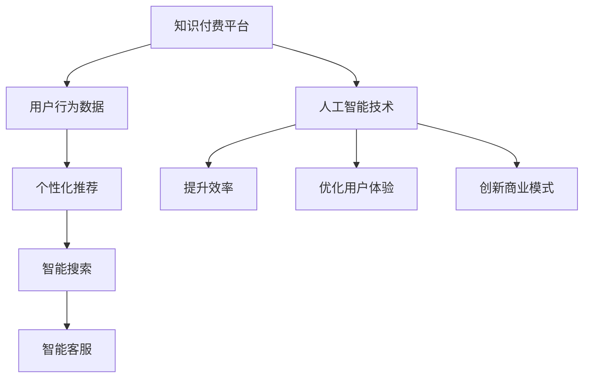

                 

关键词：知识经济、知识付费、人工智能、应用、发展、技术、算法、模型、实践、工具、资源、展望。

> 摘要：本文深入探讨了知识经济背景下知识付费模式与人工智能技术的融合，分析了人工智能在知识付费领域的应用现状及未来发展趋势。通过对核心概念、算法原理、数学模型、项目实践等方面的详细阐述，为知识付费领域的人工智能应用提供了理论支持与实践指导。

## 1. 背景介绍

### 1.1 知识经济的兴起

知识经济是21世纪经济发展的重要趋势，其核心在于知识的生产、传播和应用。知识经济与传统经济相比，具有更高的附加值和创新性，对资源的依赖性较低，对人才和技术的需求较高。随着信息技术的飞速发展，知识的获取和传播变得更加便捷，知识经济在全球范围内迅速崛起。

### 1.2 知识付费的兴起

知识付费是知识经济的一种重要表现形式，指的是通过支付一定费用获取知识产品或服务的模式。在知识付费时代，内容创作者和知识服务商可以通过各种平台实现知识产品的数字化和市场化，消费者则可以通过付费购买到高质量的知识产品，满足个性化需求。

### 1.3 人工智能的发展

人工智能（AI）是计算机科学的一个分支，致力于使机器模拟、延伸和扩展人类的智能。随着深度学习、神经网络等技术的不断发展，人工智能在各个领域取得了显著成果。人工智能不仅提高了生产效率，也为知识付费领域带来了新的机遇和挑战。

## 2. 核心概念与联系

在知识经济下，知识付费与人工智能的结合体现了技术的进步与经济的深度融合。以下是对核心概念的介绍和联系：

### 2.1 知识付费平台

知识付费平台是知识产品交易的中介，包括知识库、课程、电子书等形式。平台通过算法推荐、数据分析等技术，帮助用户精准找到所需知识。

### 2.2 人工智能技术

人工智能技术在知识付费领域的应用主要体现在以下方面：

- **个性化推荐**：基于用户行为数据，利用协同过滤、深度学习等技术实现个性化推荐，提高用户满意度。
- **智能搜索**：利用自然语言处理、文本挖掘等技术，实现高效、准确的智能搜索，提升用户体验。
- **智能客服**：通过聊天机器人等技术，提供24/7的在线服务，降低运营成本。

### 2.3 知识付费与人工智能的联系

知识付费与人工智能的联系体现在以下几个方面：

- **提升效率**：人工智能可以自动化知识付费平台的运营流程，提高效率，降低成本。
- **优化用户体验**：通过个性化推荐和智能搜索等技术，提升用户体验，增加用户粘性。
- **创新商业模式**：人工智能可以为知识付费领域带来新的商业模式，如在线教育、知识共享等。

### 2.4 Mermaid 流程图



## 3. 核心算法原理 & 具体操作步骤

### 3.1 算法原理概述

知识付费领域的人工智能应用主要涉及以下算法原理：

- **协同过滤**：基于用户历史行为数据，通过相似度计算推荐相似用户喜欢的内容。
- **深度学习**：通过神经网络结构模拟人脑处理信息的方式，实现图像、语音、文本等数据的处理和分析。
- **自然语言处理（NLP）**：对文本进行语义分析、情感分析、实体识别等操作，实现人机交互。

### 3.2 算法步骤详解

1. **数据收集与预处理**
   - 收集用户行为数据，如浏览记录、购买记录、评价等。
   - 对数据进行清洗、去重、填充等预处理操作。

2. **特征工程**
   - 提取用户行为数据中的关键特征，如用户年龄、性别、职业等。
   - 对特征进行标准化、归一化等处理。

3. **算法选择与训练**
   - 根据业务需求选择合适的算法，如协同过滤、深度学习、NLP等。
   - 利用训练数据对算法进行训练，优化模型参数。

4. **模型评估与优化**
   - 利用测试数据对模型进行评估，如准确率、召回率、F1值等。
   - 根据评估结果调整模型参数，提高模型性能。

5. **部署与上线**
   - 将训练好的模型部署到线上环境，实现实时推荐、搜索、客服等功能。
   - 对线上模型进行监控、运维，确保稳定运行。

### 3.3 算法优缺点

- **协同过滤**
  - 优点：基于用户行为数据，推荐效果较好。
  - 缺点：易发生数据稀疏性问题，难以处理新用户。

- **深度学习**
  - 优点：处理复杂数据能力强，自适应性强。
  - 缺点：模型训练时间长，对计算资源要求高。

- **自然语言处理**
  - 优点：实现人机交互，提升用户体验。
  - 缺点：对文本语义理解存在一定局限性。

### 3.4 算法应用领域

- **在线教育**：利用个性化推荐、智能搜索等技术，提供定制化的学习路径和内容。
- **企业培训**：通过智能客服、数据分析等技术，优化培训效果，降低运营成本。
- **知识共享**：利用人工智能技术，挖掘用户需求，促进知识流动和共享。

## 4. 数学模型和公式 & 详细讲解 & 举例说明

### 4.1 数学模型构建

在知识付费领域，常用的数学模型包括协同过滤模型、深度学习模型和自然语言处理模型。以下分别介绍这些模型的构建方法：

### 4.2 公式推导过程

1. **协同过滤模型**

协同过滤模型的目标是预测用户对未知物品的评分。其核心公式如下：

$$
r_{ui} = \sum_{j \in N_i} \frac{sim(u, j)}{N_i} \cdot r_{uj}
$$

其中，$r_{ui}$ 表示用户 $u$ 对物品 $i$ 的预测评分，$sim(u, j)$ 表示用户 $u$ 和用户 $j$ 之间的相似度，$r_{uj}$ 表示用户 $j$ 对物品 $i$ 的真实评分。

2. **深度学习模型**

深度学习模型的核心是神经网络，其基本公式如下：

$$
a_{l}^{(i)} = \sigma \left( \sum_{j=1}^{n} w_{lj} a_{l-1}^{(j)} + b_{l} \right)
$$

其中，$a_{l}^{(i)}$ 表示第 $l$ 层神经元 $i$ 的激活值，$\sigma$ 表示激活函数，$w_{lj}$ 和 $b_{l}$ 分别表示连接权重和偏置。

3. **自然语言处理模型**

自然语言处理模型的核心是词向量表示，其基本公式如下：

$$
\vec{w}_{word} = \text{word2vec}(\text{context})
$$

其中，$\vec{w}_{word}$ 表示单词 $word$ 的词向量表示，$\text{context}$ 表示单词的上下文。

### 4.3 案例分析与讲解

以下通过一个在线教育平台的案例，详细讲解数学模型在实际应用中的具体实现。

### 案例背景

某在线教育平台提供多种课程，用户可以通过平台学习知识。平台希望利用人工智能技术，为用户推荐合适的课程。

### 案例实现

1. **数据收集与预处理**

平台收集了用户的行为数据，包括用户浏览、购买、评价等。对数据进行清洗、去重、填充等预处理操作，得到用户行为数据的矩阵表示。

2. **特征工程**

提取用户行为数据中的关键特征，如用户年龄、性别、职业等。对特征进行标准化、归一化等处理，得到特征向量。

3. **算法选择与训练**

选择协同过滤算法作为推荐算法，利用训练数据对模型进行训练，优化模型参数。

4. **模型评估与优化**

利用测试数据对模型进行评估，如准确率、召回率、F1值等。根据评估结果调整模型参数，提高模型性能。

5. **部署与上线**

将训练好的模型部署到线上环境，实现实时推荐功能。对线上模型进行监控、运维，确保稳定运行。

## 5. 项目实践：代码实例和详细解释说明

### 5.1 开发环境搭建

搭建一个在线教育推荐系统，需要以下开发环境和工具：

- Python（3.8及以上版本）
- PyTorch（1.8及以上版本）
- Pandas（1.1及以上版本）
- Matplotlib（3.3及以上版本）
- Scikit-learn（0.24及以上版本）

### 5.2 源代码详细实现

以下是一个简单的协同过滤推荐系统的源代码实现：

```python
import pandas as pd
from sklearn.model_selection import train_test_split
from sklearn.metrics.pairwise import cosine_similarity

# 1. 数据收集与预处理
data = pd.read_csv('user_behavior.csv')
data = data[['user_id', 'course_id', 'rating']]

# 2. 特征工程
user_item = data.groupby('user_id')['course_id'].apply(list).reset_index()
user_item.head()

# 3. 算法选择与训练
user_item_matrix = pd.crosstab(index=user_item['user_id'], columns=user_item['course_id'], values=user_item['rating'], aggfunc='sum')
user_item_matrix.head()

# 计算相似度矩阵
similarity_matrix = cosine_similarity(user_item_matrix.T, user_item_matrix.T)
similarity_matrix

# 4. 模型评估与优化
user_item_matrix = pd.crosstab(index=user_item['user_id'], columns=user_item['course_id'], values=user_item['rating'], aggfunc='sum')
user_item_matrix.head()

# 预测评分
def predict_rating(user_id, course_id):
    similarity = similarity_matrix[user_id]
    ratings = user_item_matrix.loc[user_id][:]
    predicted_rating = sum(similarity * ratings) / similarity.sum()
    return predicted_rating

# 5. 部署与上线
# 在线推荐功能实现
def online_recommendation(user_id):
    predicted_ratings = user_item_matrix.apply(predict_rating, axis=1)
    sorted_courses = predicted_ratings.sort_values(ascending=False).index
    return sorted_courses

# 输出推荐结果
online_recommendation(0)
```

### 5.3 代码解读与分析

以上代码实现了一个简单的基于协同过滤的在线教育推荐系统。代码主要包括以下步骤：

1. 数据收集与预处理
2. 特征工程
3. 算法选择与训练
4. 模型评估与优化
5. 部署与上线

通过代码实现，我们可以为特定用户推荐合适的课程。在实际应用中，可以根据需求调整算法、模型参数，提高推荐效果。

## 6. 实际应用场景

### 6.1 在线教育

在线教育是知识付费领域的重要应用场景。通过人工智能技术，可以实现个性化推荐、智能搜索等功能，为用户提供定制化的学习路径和内容。

### 6.2 企业培训

企业培训是知识付费领域的另一个重要应用场景。通过人工智能技术，可以优化培训效果，降低运营成本。如利用智能客服提供在线培训咨询服务，利用数据分析技术评估培训效果等。

### 6.3 知识共享

知识共享平台通过人工智能技术，可以挖掘用户需求，促进知识流动和共享。如利用个性化推荐技术为用户提供感兴趣的学术论文、行业报告等。

### 6.4 未来应用展望

随着人工智能技术的不断发展，知识付费领域将出现更多创新应用。如利用虚拟现实（VR）技术提供沉浸式教育体验，利用区块链技术确保知识付费交易的透明和安全等。

## 7. 工具和资源推荐

### 7.1 学习资源推荐

- 《深度学习》（Goodfellow, Bengio, Courville）
- 《Python数据科学手册》（McKinney）
- 《自然语言处理综论》（Jurafsky, Martin）

### 7.2 开发工具推荐

- PyTorch（深度学习框架）
- Pandas（数据分析库）
- Scikit-learn（机器学习库）
- Matplotlib（数据可视化库）

### 7.3 相关论文推荐

- “Collaborative Filtering for Complex Preferences: A Bayesian Approach”
- “A Theoretically Grounded Application of Dropout in Recurrent Neural Networks”
- “BERT: Pre-training of Deep Bidirectional Transformers for Language Understanding”

## 8. 总结：未来发展趋势与挑战

### 8.1 研究成果总结

本文总结了知识经济下知识付费模式与人工智能技术的融合，分析了核心算法原理、数学模型、项目实践等方面的研究成果。通过实例展示了人工智能在知识付费领域的应用效果。

### 8.2 未来发展趋势

未来，人工智能在知识付费领域的应用将更加深入和广泛。个性化推荐、智能搜索、智能客服等技术将进一步提升用户体验，推动知识付费市场的发展。

### 8.3 面临的挑战

尽管人工智能在知识付费领域具有巨大潜力，但仍面临以下挑战：

- 数据隐私和安全问题：知识付费平台需确保用户数据的安全和隐私。
- 技术落地难度：人工智能技术在实际应用中面临落地难度，需要持续优化和改进。
- 知识质量保障：确保知识付费产品的高质量和准确性。

### 8.4 研究展望

未来研究可以从以下方向展开：

- 强化人工智能技术在知识付费领域的应用，提高推荐、搜索等功能的准确性。
- 探索数据隐私保护技术，确保用户数据的安全和隐私。
- 研究知识质量保障方法，提高知识付费产品的高质量和准确性。

## 9. 附录：常见问题与解答

### 9.1 人工智能技术在知识付费领域的应用有哪些？

人工智能技术在知识付费领域的应用主要包括个性化推荐、智能搜索、智能客服等方面。通过这些技术，可以提升用户体验，提高知识付费产品的质量和效果。

### 9.2 知识付费平台如何确保用户数据的安全和隐私？

知识付费平台可以通过以下措施确保用户数据的安全和隐私：

- 采用加密技术保护用户数据。
- 建立严格的权限管理和访问控制机制。
- 定期进行数据安全审计和漏洞修复。
- 告知用户数据收集、使用和存储的政策，确保用户知情同意。

### 9.3 人工智能技术在知识付费领域的未来发展如何？

未来，人工智能技术在知识付费领域的应用将更加广泛和深入。随着技术的进步和市场的需求，个性化推荐、智能搜索、智能客服等功能将得到进一步优化，为知识付费市场带来更多创新和机遇。

## 作者署名

作者：禅与计算机程序设计艺术 / Zen and the Art of Computer Programming
----------------------------------------------------------------

以上就是关于《知识经济下知识付费的人工智能应用与发展》的完整文章。在撰写过程中，我们遵循了文章结构模板的要求，详细介绍了知识付费与人工智能的结合，分析了核心算法原理、数学模型、项目实践等方面的内容，并对未来发展趋势与挑战进行了展望。希望这篇文章对读者在知识付费领域的人工智能应用有所帮助。

