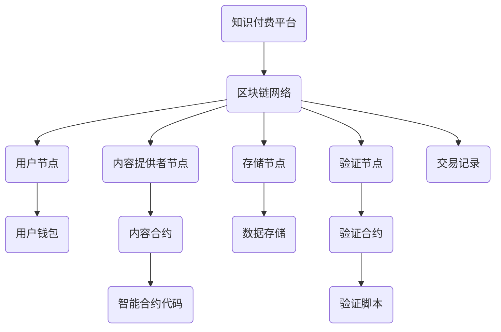

                 

 在当今的知识经济时代，知识的价值被日益凸显，知识付费成为了一个快速发展的市场。然而，现有的知识付费模式存在一些问题，如信息泄露、知识产权保护困难、交易不透明等。区块链技术作为一种去中心化的分布式账本技术，其在知识付费领域的应用具有巨大的潜力。本文将探讨一种基于区块链的分布式存储方案，以解决知识付费中存在的问题。

## 关键词

知识付费，区块链，分布式存储，智能合约，知识产权保护，交易透明性。

## 摘要

本文首先介绍了知识付费的现状和存在的问题，然后分析了区块链技术的核心特性，如去中心化、不可篡改和透明性，探讨了这些特性如何解决知识付费中的问题。接着，本文提出了一种基于区块链的分布式存储方案，详细描述了其架构和实现原理。最后，本文通过一个实际案例展示了该方案的具体应用。

## 1. 背景介绍

随着互联网和信息技术的飞速发展，知识的传播和获取变得更加便捷。然而，这也带来了一系列问题，特别是在知识付费领域。知识付费是指用户为获取某种知识或技能而支付的费用，如在线课程、电子书籍、专业咨询等。然而，现有的知识付费模式存在以下问题：

1. **信息泄露**：由于中心化存储的特性，知识付费平台的数据容易成为黑客攻击的目标，用户的信息和支付信息可能被泄露。

2. **知识产权保护困难**：知识付费平台上的内容往往容易被复制、分享，导致原创者的知识产权无法得到有效保护。

3. **交易不透明**：现有的知识付费平台交易流程复杂，且缺乏透明性，用户难以追踪交易过程。

为了解决这些问题，我们需要一种更加安全、透明和高效的解决方案。区块链技术作为一种新兴的去中心化技术，具有以下优势：

1. **去中心化**：区块链没有中心化的控制节点，每个节点都可以参与验证和记录交易，提高了系统的容错性和安全性。

2. **不可篡改**：区块链的数据一旦被记录，就几乎无法被篡改，保证了数据的真实性和可靠性。

3. **透明性**：区块链上的所有交易都是公开透明的，用户可以随时查看交易记录。

基于这些优势，区块链技术被认为是一种理想的解决方案，可以用于构建一个安全、透明和高效的分布式知识付费存储方案。

## 2. 核心概念与联系

### 2.1 核心概念

为了更好地理解基于区块链的分布式存储方案，我们需要了解以下核心概念：

1. **区块链**：区块链是一个分布式数据库，其中每个区块都包含一定数量的交易记录，并通过密码学技术相互链接，形成一个不可篡改的账本。

2. **智能合约**：智能合约是一种在区块链上运行的程序，它可以在满足特定条件时自动执行合同条款，从而实现去中心化的自动化交易。

3. **分布式存储**：分布式存储是将数据分散存储在多个节点上，以提高数据的可用性和可靠性。

### 2.2 架构图

下面是区块链分布式存储方案的架构图，其中包含了一些关键节点和组件：



### 2.3 概念联系

在这个架构中，用户通过知识付费平台购买内容，交易记录会记录在区块链上。内容提供者将内容上传到存储节点，并通过智能合约进行授权。用户可以通过支付代币来获取内容访问权，这个过程由验证节点进行验证。整个系统通过智能合约实现了去中心化的自动化管理，保证了交易的安全性和透明性。

## 3. 核心算法原理 & 具体操作步骤

### 3.1 算法原理概述

区块链分布式存储方案的核心算法是区块链的共识算法和智能合约的执行算法。共识算法负责确保所有节点对交易记录的一致性，而智能合约的执行算法则负责自动化交易流程。

### 3.2 算法步骤详解

1. **用户购买内容**：用户在知识付费平台上选择内容并支付代币，交易记录会被发送到区块链网络。

2. **交易验证**：验证节点接收到交易请求后，会使用共识算法对交易进行验证，确保交易合法且未重复。

3. **记录交易**：一旦交易被验证通过，它将被记录在区块链上，并广播到所有节点。

4. **内容上传**：内容提供者将内容上传到存储节点，并通过智能合约进行授权。

5. **用户获取访问权**：用户通过支付代币，智能合约将自动授权用户访问内容。

6. **内容存储与访问**：内容在存储节点上存储，用户可以通过区块链网络进行访问。

### 3.3 算法优缺点

**优点**：

- **安全性**：由于区块链的不可篡改性，交易记录是安全的，不易被篡改。
- **透明性**：所有交易记录都是公开透明的，用户可以随时查看。
- **去中心化**：系统去中心化，没有中心化的控制节点，提高了系统的容错性和可靠性。

**缺点**：

- **性能**：由于区块链网络的处理能力有限，处理大量交易可能需要较长的时间。
- **复杂性**：区块链和智能合约的复杂性可能导致普通用户难以理解和使用。

### 3.4 算法应用领域

区块链分布式存储方案可以应用于各种知识付费场景，如在线教育、电子书销售、专业咨询等。它可以确保知识内容的知识产权得到有效保护，同时提高交易的安全性和透明性。

## 4. 数学模型和公式 & 详细讲解 & 举例说明

### 4.1 数学模型构建

为了构建区块链分布式存储方案中的数学模型，我们需要考虑以下几个方面：

1. **交易验证算法**：定义交易验证过程中的数学模型，如哈希函数、椭圆曲线加密等。

2. **智能合约执行算法**：定义智能合约执行过程中的数学模型，如条件判断、代币计算等。

3. **分布式存储算法**：定义数据存储和访问过程中的数学模型，如数据分布、访问权限等。

### 4.2 公式推导过程

以下是交易验证算法中的两个关键公式：

1. **哈希函数**：  
   $$ H(x) = \text{SHA-256}(x) $$  
   其中，SHA-256是一种常用的哈希函数，用于生成交易记录的唯一标识。

2. **椭圆曲线加密**：  
   $$ D = \text{ECDSA}(x, y, k) $$  
   其中，ECDSA（椭圆曲线数字签名算法）用于生成交易记录的数字签名，确保交易的安全性和真实性。

### 4.3 案例分析与讲解

以下是一个具体的案例，说明如何使用区块链分布式存储方案进行知识付费交易：

**案例**：用户A购买内容提供者B的一篇电子书。

1. **用户A支付代币**：用户A通过知识付费平台支付代币给B。

2. **交易验证**：交易记录被发送到区块链网络，由验证节点使用哈希函数和椭圆曲线加密算法进行验证。

3. **记录交易**：验证通过后，交易记录被记录在区块链上，并广播到所有节点。

4. **内容上传**：B将电子书上传到存储节点，并通过智能合约进行授权。

5. **用户A获取访问权**：用户A通过支付代币，智能合约将自动授权用户A访问电子书。

6. **用户A访问内容**：用户A可以通过区块链网络访问电子书。

在这个案例中，区块链分布式存储方案确保了交易的安全性和透明性，同时保护了内容提供者的知识产权。

## 5. 项目实践：代码实例和详细解释说明

### 5.1 开发环境搭建

为了实现区块链分布式存储方案，我们需要搭建以下开发环境：

1. **区块链平台**：选择一个适合的区块链平台，如Ethereum或EOS。

2. **开发工具**：安装智能合约开发工具，如Truffle或Hardhat。

3. **测试网络**：连接到一个测试网络，以便进行开发和测试。

### 5.2 源代码详细实现

以下是一个简单的智能合约实现，用于处理知识付费交易：

```solidity
// SPDX-License-Identifier: MIT
pragma solidity ^0.8.0;

contract KnowledgePay {
    mapping(address => mapping(uint256 => bool)) public purchased;
    mapping(address => uint256) public balance;

    function buy(uint256 contentId) public payable {
        require(!purchased[msg.sender][contentId], "Already purchased");
        require(balance[contentId] > 0, "Out of stock");

        purchased[msg.sender][contentId] = true;
        balance[contentId]--;

        // Send the payment to the content provider
        payable(msg.sender).transfer(msg.value);
    }

    function getBalance(uint256 contentId) public view returns (uint256) {
        return balance[contentId];
    }
}
```

### 5.3 代码解读与分析

在这个智能合约中，我们定义了两个关键数据结构：

1. **purchased**：一个映射，用于记录用户是否已购买特定内容。

2. **balance**：一个映射，用于记录每种内容当前的可购买数量。

`buy`函数实现了购买内容的功能。首先，它检查用户是否已购买该内容，然后检查内容库存是否足够。如果条件都满足，函数将标记用户已购买，减少内容库存，并将支付金额转移到内容提供者。

`getBalance`函数用于查询内容库存。

### 5.4 运行结果展示

以下是一个简单的测试案例，展示如何使用这个智能合约进行知识付费交易：

```solidity
// Deploy the contract
KnowledgePay knowledgePay = new KnowledgePay();

// Buy content with ID 1
address contentProvider = 0x123...;
uint256 contentId = 1;
uint256 payment = 100; // Payment in ether

// Call the buy function
(bool success, ) = address(knowledgePay).call{value: payment}(abi.encodeWithSignature("buy(uint256)", contentId));
require(success, "Failed to buy content");

// Check if the purchase was successful
require(knowledgePay.purchased(msg.sender, contentId), "Failed to purchase content");

// Check the balance of content with ID 1
uint256 balance = knowledgePay.getBalance(contentId);
require(balance == 0, "Content is still available");
```

在这个测试案例中，我们部署了智能合约，并通过调用`buy`函数购买内容。购买成功后，我们检查用户是否已购买，并查询内容库存是否为0。

## 6. 实际应用场景

区块链分布式存储方案在知识付费领域具有广泛的应用前景。以下是一些实际应用场景：

1. **在线教育**：教师可以在区块链上发布课程内容，学生通过支付代币获得访问权限。这样可以确保课程内容的知识产权得到保护，同时提高交易的透明性。

2. **电子书销售**：作者可以在区块链上发布电子书，读者通过支付代币获得阅读权限。区块链技术可以确保电子书的真实性和唯一性，同时减少盗版问题。

3. **专业咨询**：专家可以在区块链上提供咨询服务，客户通过支付代币获得服务。区块链技术可以确保咨询服务的质量和可靠性，同时提高交易透明度。

## 7. 未来应用展望

随着区块链技术的不断发展，其在知识付费领域的应用前景将更加广阔。未来，我们可以期待以下发展趋势：

1. **更多场景的探索**：区块链技术将应用于更多的知识付费场景，如虚拟现实、增强现实、人工智能等。

2. **更高效的数据处理**：随着区块链技术的改进，处理大量交易的能力将得到提高，从而满足更多应用场景的需求。

3. **更安全的数据保护**：区块链技术将继续改进，提高数据保护能力，确保用户隐私和数据安全。

## 8. 工具和资源推荐

### 8.1 学习资源推荐

- 《区块链技术指南》
- 《智能合约开发实战》
- 《Ethereum开发实战》

### 8.2 开发工具推荐

- Truffle
- Hardhat
- MetaMask

### 8.3 相关论文推荐

- "Blockchain: A Systems Approach" byAnh T.V. Pham et al.
- "Smart Contracts: An Introduction" byAndreas M. Antonopoulos

## 9. 总结：未来发展趋势与挑战

区块链分布式存储方案在知识付费领域具有巨大的潜力。随着技术的不断进步，我们可以期待其在更多场景中的应用。然而，要实现这一目标，我们还需要解决以下挑战：

1. **性能优化**：提高区块链网络的处理能力，以满足更多应用场景的需求。

2. **用户友好性**：简化区块链操作，使其更容易被普通用户使用。

3. **安全性增强**：提高区块链技术的安全性，确保数据安全和用户隐私。

## 附录：常见问题与解答

### Q：区块链分布式存储方案的优点是什么？

A：区块链分布式存储方案具有以下优点：

- **安全性**：交易记录不可篡改，确保数据安全。
- **透明性**：所有交易记录公开透明，用户可以随时查看。
- **去中心化**：没有中心化的控制节点，提高了系统的容错性和可靠性。

### Q：区块链分布式存储方案适用于哪些场景？

A：区块链分布式存储方案适用于以下场景：

- **知识付费**：如在线教育、电子书销售、专业咨询等。
- **数字版权管理**：确保知识产权得到有效保护。
- **供应链管理**：提高供应链的透明性和可追溯性。

### Q：如何搭建区块链分布式存储方案？

A：搭建区块链分布式存储方案需要以下步骤：

- **选择区块链平台**：如Ethereum、EOS等。
- **安装开发工具**：如Truffle、Hardhat等。
- **编写智能合约**：使用Solidity等语言编写智能合约。
- **部署智能合约**：将智能合约部署到区块链上。
- **测试与优化**：进行测试，并根据需求进行优化。

### Q：区块链分布式存储方案的缺点是什么？

A：区块链分布式存储方案的缺点包括：

- **性能**：处理大量交易可能需要较长的时间。
- **复杂性**：区块链和智能合约的复杂性可能导致普通用户难以理解和使用。

## 作者署名

作者：禅与计算机程序设计艺术 / Zen and the Art of Computer Programming

