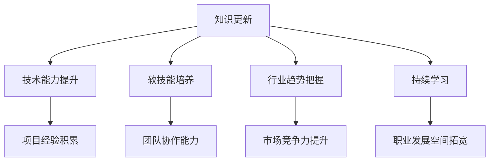

                 

关键词：知识经济、程序员、职业发展、策略、技术能力、持续学习、软技能、行业趋势

## 摘要

本文旨在探讨在知识经济背景下，程序员的职业发展策略。随着科技的发展，编程语言和技术工具的更新换代速度加快，程序员需要不断更新知识和技能，以保持市场竞争力。文章首先介绍了知识经济的概念和特点，然后分析了程序员在知识经济时代面临的挑战和机遇，最后提出了具体的职业发展策略，包括技术能力的提升、软技能的培养、行业趋势的把握以及持续学习的方法。

## 1. 背景介绍

### 知识经济的崛起

知识经济是一种以知识为核心资源的经济形态，它不同于传统的以自然资源和劳动力为主的经济模式。知识经济的特点在于，知识和信息成为经济增长的关键驱动因素，创新和创意成为推动经济发展的主要动力。在知识经济时代，技术、知识和信息成为了稀缺资源，而传统的生产要素如土地、劳动力和资本的重要性相对下降。

### 程序员在知识经济中的角色

程序员作为知识经济中的重要职业，其作用越来越凸显。他们不仅是软件开发的主力军，也是技术创新的推动者。随着互联网、大数据、人工智能等技术的发展，程序员的工作范围不断扩展，从单一的编程任务发展到涉及系统设计、算法研究、数据分析等多个领域。

## 2. 核心概念与联系

### 知识经济下的程序员

知识经济下的程序员，需要具备深厚的专业知识和快速的学习能力。他们不仅要熟练掌握编程语言和开发工具，还要了解最新的技术趋势和行业动态。同时，程序员还需要具备解决问题的能力，能够在复杂的项目中发挥关键作用。

### Mermaid 流程图



## 3. 核心算法原理 & 具体操作步骤

### 3.1 算法原理概述

在知识经济下，程序员的职业发展需要遵循一系列的核心算法原理。这些原理包括：

- **持续学习**：程序员需要不断学习新的技术和知识，以保持竞争力。
- **技术能力提升**：通过深入学习和实践，不断提升编程技能和算法能力。
- **软技能培养**：提高沟通、团队协作和解决问题的能力。
- **行业趋势把握**：关注行业动态，把握技术发展方向。

### 3.2 算法步骤详解

1. **评估当前技术水平**：程序员需要定期评估自己的技术能力，找出不足之处。
2. **制定学习计划**：根据评估结果，制定详细的学习计划，包括学习目标、学习内容和时间安排。
3. **实践应用**：将学到的知识和技能应用到实际项目中，通过实践来提高技术水平。
4. **反馈与调整**：根据项目反馈，调整学习计划，持续优化自己的技能。
5. **拓展知识面**：除了专业技能，程序员还需要不断拓展知识面，了解其他领域的知识。

### 3.3 算法优缺点

**优点**：

- 提高程序员的职业竞争力。
- 增强项目开发效率和质量。
- 促进个人职业发展。

**缺点**：

- 需要投入大量的时间和精力。
- 学习过程中可能会遇到困难和挫折。

### 3.4 算法应用领域

- **软件开发**：程序员需要不断学习新的编程语言和开发工具，以适应不断变化的项目需求。
- **人工智能**：随着人工智能技术的发展，程序员需要掌握相关的算法和编程技能，参与人工智能项目。
- **大数据分析**：大数据技术对程序员的要求越来越高，程序员需要具备数据分析的能力。

## 4. 数学模型和公式 & 详细讲解 & 举例说明

### 4.1 数学模型构建

在程序员职业发展中，可以构建一个简单的数学模型来表示职业发展速度：

\[ \text{职业发展速度} = \frac{\text{知识积累}}{\text{时间}} \]

### 4.2 公式推导过程

1. **知识积累**：程序员通过学习新知识和技能，不断积累知识。
2. **时间**：表示程序员用于学习和实践的时间。
3. **职业发展速度**：表示程序员在单位时间内职业发展的速度。

### 4.3 案例分析与讲解

假设一位程序员每天投入2小时学习，每周工作5天，一年累计学习时间约为500小时。如果这位程序员每年能够掌握100个新技能点，那么他的职业发展速度为：

\[ \text{职业发展速度} = \frac{100}{500} = 0.2 \text{技能点/小时} \]

这意味着，这位程序员每小时能够积累0.2个技能点。通过持续努力，他的职业发展速度可以逐步提高。

## 5. 项目实践：代码实例和详细解释说明

### 5.1 开发环境搭建

为了演示一个简单的项目实践，我们将使用Python语言编写一个简单的计算器程序。首先，需要安装Python环境和相关库。

```bash
# 安装Python
brew install python

# 安装相关库
pip install tkinter
```

### 5.2 源代码详细实现

```python
import tkinter as tk

def on_button_click():
    result = int(entry1.get()) + int(entry2.get())
    label.config(text=str(result))

root = tk.Tk()
root.title("简单计算器")

entry1 = tk.Entry(root)
entry1.pack()

entry2 = tk.Entry(root)
entry2.pack()

button = tk.Button(root, text="计算", command=on_button_click)
button.pack()

label = tk.Label(root, text="")
label.pack()

root.mainloop()
```

### 5.3 代码解读与分析

- **引入库**：使用`tkinter`库来创建图形用户界面。
- **定义函数**：`on_button_click`函数用于处理按钮点击事件，计算两个输入框的值并显示结果。
- **创建窗口**：创建一个窗口，设置标题，并添加输入框、按钮和标签。
- **运行主循环**：使用`root.mainloop()`启动图形界面。

### 5.4 运行结果展示

运行上述代码，将看到一个简单的计算器界面，用户可以输入两个数字，点击“计算”按钮后显示结果。

## 6. 实际应用场景

### 6.1 在线教育平台

随着在线教育的兴起，程序员可以利用自己的编程技能开发在线学习平台，提供课程、作业和互动功能，帮助学生更好地学习。

### 6.2 跨平台应用开发

随着移动设备和云计算的普及，程序员需要掌握多平台应用开发的技能，如iOS、Android和Web应用开发。

### 6.3 人工智能应用

人工智能技术的快速发展为程序员提供了新的机会，他们可以参与开发智能助手、自动驾驶等前沿项目。

## 7. 未来应用展望

### 7.1 自动化与智能化

随着自动化和智能化技术的发展，程序员将更多地参与开发自动化工具和智能系统，提高生产效率。

### 7.2 区块链应用

区块链技术的应用领域不断扩大，程序员需要掌握相关的编程技能，参与区块链项目的开发。

### 7.3 量子计算

量子计算作为一种新兴的计算模式，将对程序员提出新的挑战，他们需要学习量子编程语言和算法。

## 8. 工具和资源推荐

### 8.1 学习资源推荐

- **GitHub**：全球最大的代码托管平台，程序员可以在这里找到丰富的开源项目和学习资源。
- **Stack Overflow**：一个针对程序员的问答社区，解决编程中的各种问题。

### 8.2 开发工具推荐

- **Visual Studio Code**：一款强大的代码编辑器，支持多种编程语言和开发工具。
- **Jenkins**：一款持续集成工具，用于自动化构建和部署应用程序。

### 8.3 相关论文推荐

- **"Deep Learning for Programmers"**：适合程序员入门深度学习的论文。
- **"The Art of Software Architecture"**：关于软件架构的论文，对程序员有很高的参考价值。

## 9. 总结：未来发展趋势与挑战

### 9.1 研究成果总结

知识经济下，程序员的职业发展策略主要包括技术能力的提升、软技能的培养、行业趋势的把握和持续学习。这些策略有助于程序员在快速变化的科技领域中保持竞争力。

### 9.2 未来发展趋势

随着人工智能、区块链、量子计算等技术的发展，程序员的职业领域将不断扩展，新的机会和挑战也将随之而来。

### 9.3 面临的挑战

程序员需要不断更新知识和技能，以应对快速变化的技术趋势。同时，他们还需要提高沟通、团队协作和解决问题的能力。

### 9.4 研究展望

未来，程序员的研究将更加深入到新兴技术的应用领域，如人工智能、区块链和量子计算。同时，如何通过教育和技术手段提高程序员的职业素养也将是一个重要的研究方向。

## 附录：常见问题与解答

### 9.1 问题1：如何高效学习编程？

**解答**：制定详细的学习计划，设定明确的学习目标，分阶段完成学习任务。同时，实践是最好的学习方式，通过实际项目来检验和巩固所学知识。

### 9.2 问题2：程序员需要掌握哪些软技能？

**解答**：程序员需要掌握的软技能包括沟通能力、团队协作能力、解决问题的能力以及项目管理能力。这些技能有助于程序员在团队中发挥更好的作用。

### 9.3 问题3：如何保持对新技术的好奇心和学习热情？

**解答**：关注行业动态，参与技术社区，定期参加技术会议和培训，与同行交流和学习。同时，设定个人成长目标，激发学习动力。

---

作者：禅与计算机程序设计艺术 / Zen and the Art of Computer Programming

