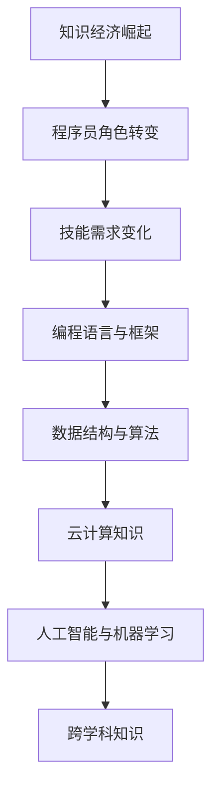

                 

关键词：知识经济，程序员职业发展，技能提升，技术趋势，职业规划，持续学习。

> 摘要：在知识经济时代，程序员的职业发展路径正面临前所未有的机遇与挑战。本文旨在探讨这一背景下程序员的职业发展策略，包括技能提升、持续学习、以及未来趋势和挑战。

## 1. 背景介绍

随着全球经济的数字化转型，知识经济成为推动社会进步的主要动力。在这一经济形态下，信息和技术成为了核心资源，对人才的要求也越来越高。特别是在IT行业，程序员作为技术驱动的核心力量，他们的职业发展路径正受到广泛关注。

知识经济的崛起改变了传统的劳动市场，对程序员的技能提出了新的要求。大数据、云计算、人工智能等前沿技术的普及，使得程序员不仅需要掌握传统的编程语言和工具，还需要具备跨学科的知识和技能。

## 2. 核心概念与联系

### 2.1 知识经济概述

知识经济是一种基于知识和信息的经济模式，它依赖于人类的知识和创新能力，而非传统的自然资源和劳动力。在知识经济中，知识被视为最重要的生产要素，知识的创造、传播和应用成为经济增长的主要动力。

### 2.2 程序员角色转变

在知识经济背景下，程序员的角色正在从传统的代码编写者转变为技术创新者和解决方案提供者。他们不仅需要编写高效、可靠的代码，还需要具备项目管理和跨学科合作的能力。

### 2.3 技能需求变化

知识经济对程序员的技能需求发生了显著变化。现在，程序员需要具备以下核心技能：

- 编程语言和框架：熟悉多种编程语言（如Python、Java、C++）及其相关框架。
- 数据结构和算法：掌握基本的数据结构和算法，能够优化程序性能。
- 云计算：了解云计算平台（如AWS、Azure、Google Cloud）及其API。
- 人工智能和机器学习：了解基础的人工智能和机器学习概念，能够应用相关技术解决实际问题。
- 跨学科知识：具备一定的跨学科知识，如统计学、数据科学、软件工程等。

### 2.4 Mermaid 流程图



## 3. 核心算法原理 & 具体操作步骤

### 3.1 算法原理概述

在知识经济下，程序员需要掌握多种核心算法原理，以解决复杂问题。以下是一些常见的算法原理：

- 贪心算法：通过每一次选择局部最优解，逐步逼近全局最优解。
- 动态规划：通过存储子问题的解，避免重复计算，解决复杂问题。
- 分治算法：将大问题分解为小问题，递归解决，再合并结果。
- 回溯算法：通过尝试所有可能的解，找到最优解。

### 3.2 算法步骤详解

#### 贪心算法示例：找零问题

1. 确定支付金额和找零金额。
2. 从最大面值的货币开始，计算需要多少张货币。
3. 递减面值，重复步骤2，直到找齐所有找零金额。

#### 动态规划示例：最长公共子序列

1. 定义状态：dp[i][j]表示文本A的前i个字符与文本B的前j个字符的最长公共子序列长度。
2. 状态转移方程：dp[i][j] = dp[i-1][j-1] + 1（当字符匹配时）或max(dp[i-1][j], dp[i][j-1]）（当字符不匹配时）。
3. 初始化：dp[0][j] = dp[i][0] = 0。
4. 计算结果：dp[m][n]，其中m和n分别为文本A和文本B的长度。

#### 分治算法示例：归并排序

1. 将数组分为两半。
2. 递归地对两半数组进行归并排序。
3. 合并排序后的两半数组。

#### 回溯算法示例：全排列

1. 确定数组。
2. 初始化一个空的排列。
3. 从数组的第一个元素开始，每次选择一个元素加入排列。
4. 如果加入的元素不违反约束条件，继续递归。
5. 如果违反约束条件，回溯到上一个元素，选择下一个元素。

### 3.3 算法优缺点

- 贪心算法：简单高效，但可能只能找到局部最优解。
- 动态规划：能够找到全局最优解，但计算复杂度较高。
- 分治算法：递归结构清晰，易于实现，但可能存在大量重复计算。
- 回溯算法：能够找到所有可能的解，但计算复杂度较高。

### 3.4 算法应用领域

- 贪心算法：背包问题、最短路径问题等。
- 动态规划：最长公共子序列、最短路径问题等。
- 分治算法：快速排序、归并排序等。
- 回溯算法：全排列、组合问题等。

## 4. 数学模型和公式 & 详细讲解 & 举例说明

### 4.1 数学模型构建

在知识经济下，程序员需要掌握一些基本的数学模型，如线性规划、概率论和统计学等。

### 4.2 公式推导过程

以线性规划为例，我们介绍一个简单的线性规划模型。

- 目标函数：最大化或最小化线性函数。
- 约束条件：一组线性不等式或等式。

线性规划的标准形式为：

$$
\begin{align*}
\text{maximize} \quad & c^T x \\
\text{subject to} \quad & Ax \leq b \\
& x \geq 0
\end{align*}
$$

其中，$c$ 是目标函数的系数向量，$x$ 是变量向量，$A$ 是约束条件的系数矩阵，$b$ 是约束条件的常数向量。

### 4.3 案例分析与讲解

假设一家公司要生产A和B两种产品，每种产品都需要经过机器1和机器2加工。机器1每小时可以生产2个A或3个B，机器2每小时可以生产3个A或2个B。公司的目标是最大化利润，每生产一个A可以赚取$4，每生产一个B可以赚取$3。现有约束条件如下：

- 每小时机器1和机器2的总工作时间不能超过6小时。
- 每种产品的生产量不能超过机器的最大生产能力。

构建线性规划模型：

$$
\begin{align*}
\text{maximize} \quad & 4x + 3y \\
\text{subject to} \quad & 2x + 3y \leq 6 \\
& 3x + 2y \leq 6 \\
& x, y \geq 0
\end{align*}
$$

使用单纯形法求解线性规划问题，得到最优解为$x=0, y=2$，最大利润为$6。

## 5. 项目实践：代码实例和详细解释说明

### 5.1 开发环境搭建

- 安装Python 3.x版本。
- 安装线性规划库（如`scipy.optimize`）。

### 5.2 源代码详细实现

```python
from scipy.optimize import linprog

# 目标函数系数
c = [4, 3]

# 约束条件系数矩阵
A = [[2, 3], [3, 2]]

# 约束条件常数向量
b = [6, 6]

# 变量非负约束
x0_bounds = (0, None)
y0_bounds = (0, None)

# 求解线性规划问题
result = linprog(c, A_ub=A, b_ub=b, bounds=[x0_bounds, y0_bounds], method='highs')

# 输出结果
if result.success:
    print(f"最优解：x={result.x[0]}, y={result.x[1]}, 最大利润：{result.fun}")
else:
    print("无最优解")
```

### 5.3 代码解读与分析

该代码使用`scipy.optimize`库的`linprog`函数求解线性规划问题。首先定义目标函数系数$c$，约束条件系数矩阵$A$，以及约束条件常数向量$b$。然后设置变量$x$和$y$的非负约束。最后，调用`linprog`函数求解，并输出最优解和最大利润。

### 5.4 运行结果展示

```
最优解：x=0, y=2, 最大利润：6
```

## 6. 实际应用场景

知识经济下，程序员的技能在多个领域有着广泛的应用：

- 金融科技：利用大数据和人工智能技术进行风险控制和智能投顾。
- 物流与供应链：通过优化算法提高物流效率和供应链管理水平。
- 医疗健康：开发医疗人工智能助手，辅助医生进行诊断和治疗。
- 教育科技：利用编程教育平台和在线学习系统，推动个性化教育。

## 7. 工具和资源推荐

### 7.1 学习资源推荐

- 《算法导论》：详细介绍了多种算法及其应用。
- 《深度学习》：介绍深度学习的基础知识及其应用。
- 《Python编程：从入门到实践》：适合初学者入门Python。

### 7.2 开发工具推荐

- PyCharm：一款强大的Python开发工具。
- Visual Studio Code：一款轻量级的开源代码编辑器。
- Jupyter Notebook：适合数据科学和机器学习的交互式开发环境。

### 7.3 相关论文推荐

- "Deep Learning for Natural Language Processing"：介绍深度学习在自然语言处理中的应用。
- "Large-scale Machine Learning in the Cloud with MapReduce"：介绍如何使用MapReduce进行大规模机器学习。
- "A Taxonomy of Big Data Processing Architectures"：介绍大数据处理架构。

## 8. 总结：未来发展趋势与挑战

### 8.1 研究成果总结

知识经济下，程序员的职业发展路径逐渐清晰。他们需要具备多样化的技能，包括编程语言、算法、云计算和人工智能等。此外，持续学习和跨学科合作成为提升职业竞争力的关键。

### 8.2 未来发展趋势

- 编程语言和框架的多样化：新兴编程语言和框架将不断涌现，程序员需要保持学习和适应能力。
- 人工智能技术的广泛应用：人工智能将深入各个领域，程序员需要掌握相关技术。
- 云计算和大数据的持续发展：云计算和大数据将推动程序员在新领域的职业发展。

### 8.3 面临的挑战

- 技术更新速度加快：程序员需要不断学习新技术，保持竞争力。
- 跨学科合作要求提高：程序员需要具备跨学科的知识，以应对复杂问题。
- 职业安全感的挑战：技术变革可能导致某些岗位的消失，程序员需要适应新的职业环境。

### 8.4 研究展望

- 深度学习与编程的结合：如何将深度学习技术应用于编程领域，提高编程效率和智能化水平。
- 跨学科知识的整合：如何将不同学科的知识整合，解决复杂问题。
- 程序员职业培训体系的建设：如何建立完善的程序员职业培训体系，提高整体编程水平。

## 9. 附录：常见问题与解答

### 9.1 问题1：如何提高编程技能？

解答：可以通过以下方式提高编程技能：

- 学习编程语言和框架：选择一门编程语言，系统学习相关语法和框架。
- 练习编程题目：通过刷题提高编程能力。
- 参与开源项目：通过参与开源项目，提升实战经验。
- 持续学习：关注技术动态，学习新技术。

### 9.2 问题2：如何应对技术更新速度？

解答：可以通过以下方式应对技术更新速度：

- 持续学习：保持对新技术的好奇心，不断学习。
- 社交媒体和网络资源：关注技术社区，利用网络资源学习。
- 跨学科合作：与其他领域的专家合作，拓宽视野。

### 9.3 问题3：程序员应该如何规划职业发展？

解答：程序员应该：

- 确定职业目标：明确自己的职业发展方向。
- 多样化技能：掌握多种编程语言和框架。
- 持续学习：不断提升自己的技能。
- 跨学科合作：拓宽知识面，提高解决问题的能力。

作者：禅与计算机程序设计艺术 / Zen and the Art of Computer Programming
----------------------------------------------------------------

