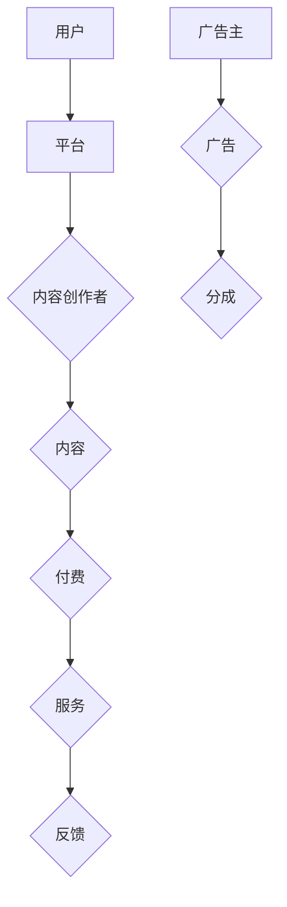

                 

关键词：知识经济、知识付费、创新商业模式、复制、用户价值、可持续性

> 摘要：本文旨在探讨知识经济时代下，知识付费创新商业模式的复制策略。通过分析知识付费的核心要素，揭示其成功的关键因素，探讨如何在不同领域复制这一模式，并探讨其可持续性。本文旨在为企业和创业者提供指导，帮助他们在知识经济时代找到创新发展的新路径。

## 1. 背景介绍

随着互联网技术的迅猛发展和大数据的广泛应用，知识经济逐渐成为全球经济的新引擎。知识付费作为知识经济的重要组成部分，近年来呈现出爆炸式增长。用户对知识的渴求和付费意愿的提高，为知识付费行业带来了前所未有的发展机遇。

知识付费是指用户通过支付费用来获取有价值的信息和知识，这些知识和信息可以是专业的技能培训、行业研究报告、专业知识分享等。知识付费模式的兴起，打破了传统知识传播的边界，使得知识的获取更加便捷和高效。

当前，知识付费市场已经形成了一定的市场规模和竞争格局。各大平台如得到、知乎、分答等，通过提供专业课程、问答服务、行业资讯等内容，吸引了大量用户。然而，随着市场竞争的加剧，知识付费企业如何实现可持续发展，成为摆在企业家和创业者面前的重要课题。

本文将从知识付费的核心要素、成功案例、复制策略、可持续性等方面进行探讨，旨在为知识付费行业的创新和可持续发展提供一些思路。

## 2. 核心概念与联系

### 2.1 知识付费的定义与分类

知识付费是指用户通过支付费用来获取有价值的信息和知识，这些知识和信息可以满足用户在技能提升、知识获取、行业研究等方面的需求。根据知识类型和交付方式的不同，知识付费可以分为以下几种类型：

1. **在线课程**：用户通过在线学习平台，购买专业课程，进行自主学习和技能提升。
2. **问答服务**：用户通过付费问答平台，向专业领域人士咨询问题，获取针对性的解决方案。
3. **行业报告**：用户通过购买行业研究报告，了解行业趋势、市场动态和竞争态势。
4. **专业知识分享**：用户通过付费讲座、研讨会等形式，获取专业知识和行业经验。

### 2.2 知识付费的核心要素

知识付费模式的成功，离不开以下几个核心要素：

1. **内容质量**：知识付费的核心是优质内容。只有提供有价值、有深度、有实用性的内容，才能吸引用户购买。
2. **用户体验**：良好的用户体验是知识付费模式成功的关键。平台需要提供简洁明了的界面、便捷的支付方式、灵活的学习方式等，以满足用户的需求。
3. **平台服务**：知识付费平台需要提供完善的售后服务，如答疑解惑、课程更新、用户反馈等，以提升用户满意度和忠诚度。
4. **用户画像**：通过对用户数据的分析，了解用户的需求和偏好，提供个性化的推荐和服务，提高用户粘性和转化率。

### 2.3 知识付费的商业模式

知识付费的商业模式主要包括以下几种：

1. **订阅制**：用户通过购买订阅服务，定期获取平台提供的内容和服务。
2. **按次付费**：用户针对特定内容或服务，进行一次性购买。
3. **会员制**：用户通过购买会员，享受平台提供的多种特权和服务。
4. **广告分成**：平台通过广告收入与内容创作者进行分成。

### 2.4 知识付费的生态系统

知识付费的生态系统包括以下几个部分：

1. **内容创作者**：他们是知识付费的核心，通过创作优质内容，吸引用户购买。
2. **平台运营者**：他们负责平台的运营和管理，提供内容发布、支付、售后服务等支持。
3. **用户**：他们是知识付费的消费者，通过购买内容，实现知识获取和技能提升。
4. **广告主**：他们通过投放广告，获取潜在客户。

### 2.5 Mermaid 流程图



## 3. 核心算法原理 & 具体操作步骤

### 3.1 算法原理概述

知识付费的核心算法主要涉及用户画像分析、内容推荐和转化率优化等。以下是对这些核心算法的原理概述：

1. **用户画像分析**：通过收集和分析用户的行为数据、兴趣爱好、购买记录等，构建用户画像，了解用户的需求和偏好。
2. **内容推荐**：基于用户画像，运用推荐算法，将相关内容推送给用户，提高用户满意度和粘性。
3. **转化率优化**：通过数据分析和实验，不断优化用户体验和营销策略，提高用户购买转化率。

### 3.2 算法步骤详解

1. **用户画像构建**
   - 数据收集：收集用户的基本信息、行为数据、兴趣标签等。
   - 数据处理：对收集到的数据进行清洗、去重、归一化等处理。
   - 特征提取：根据用户的行为和兴趣，提取相关特征，如浏览时长、点击率、购买频次等。
   - 模型训练：使用机器学习算法，如聚类、分类等，对用户特征进行建模。

2. **内容推荐**
   - 内容分类：将平台上的内容进行分类，如课程、问答、报告等。
   - 内容标签：为每个内容分配相应的标签，如技术、管理、金融等。
   - 推荐算法：根据用户画像和内容标签，运用协同过滤、矩阵分解等推荐算法，为用户生成推荐列表。

3. **转化率优化**
   - 数据分析：收集用户购买、浏览、分享等行为数据，分析用户行为模式。
   - 实验设计：针对不同用户群体和场景，设计不同的实验，如价格敏感度测试、广告投放效果测试等。
   - 结果分析：对实验结果进行统计分析，找出影响转化率的因素。
   - 优化策略：根据实验结果，调整营销策略、界面设计、推荐算法等，以提高转化率。

### 3.3 算法优缺点

1. **用户画像分析**
   - 优点：能够深入了解用户需求，提高个性化推荐的效果。
   - 缺点：数据收集和处理复杂，存在隐私保护问题。

2. **内容推荐**
   - 优点：提高用户满意度和粘性，增加用户购买意愿。
   - 缺点：推荐算法需要不断优化，以应对用户需求的变化。

3. **转化率优化**
   - 优点：通过数据分析和实验，找到影响转化率的因素，进行针对性优化。
   - 缺点：实验设计和结果分析复杂，需要大量数据支持。

### 3.4 算法应用领域

知识付费算法主要应用于在线教育、知识问答、行业报告等领域。以下是对这些领域的一些应用实例：

1. **在线教育**
   - 应用：通过用户画像和内容推荐，为用户提供个性化的课程推荐，提高学习效果和用户粘性。
   - 优点：提高学习效率，满足用户个性化需求。
   - 缺点：对课程质量和内容丰富度要求较高。

2. **知识问答**
   - 应用：通过问答推荐和用户画像分析，为用户提供高质量的问答服务，提高用户满意度。
   - 优点：增加用户互动，提升平台活跃度。
   - 缺点：对问答质量和用户活跃度要求较高。

3. **行业报告**
   - 应用：通过行业报告推荐和用户画像分析，为用户提供有针对性的行业研究，提升用户决策能力。
   - 优点：帮助用户深入了解行业动态，提供决策参考。
   - 缺点：对报告质量和行业研究深度要求较高。

## 4. 数学模型和公式 & 详细讲解 & 举例说明

### 4.1 数学模型构建

在知识付费领域，常用的数学模型包括用户画像构建模型、推荐算法模型和转化率优化模型。以下是对这些模型的详细讲解：

#### 4.1.1 用户画像构建模型

用户画像构建模型主要涉及用户特征提取和用户分类。以下是一个简化的用户画像构建模型：

$$
\begin{aligned}
\text{User\_Feature}(u) &= \{ \text{Age}, \text{Gender}, \text{Education}, \text{Occupation}, \text{Interests}, \ldots \}, \\
\text{User\_Type}(u) &= \text{Clustering}(\text{User\_Feature}(u)), \\
\text{User\_Profile}(u) &= \text{Grouping}(\text{User\_Type}(u)).
\end{aligned}
$$

其中，$\text{User\_Feature}(u)$ 表示用户特征向量，$\text{User\_Type}(u)$ 表示用户类型，$\text{User\_Profile}(u)$ 表示用户画像。

#### 4.1.2 推荐算法模型

推荐算法模型主要涉及协同过滤、矩阵分解和基于内容的推荐。以下是一个简化的推荐算法模型：

$$
\begin{aligned}
\text{Item\_Feature}(i) &= \{ \text{Tags}, \text{Categories}, \ldots \}, \\
\text{User\_Rating}(u, i) &= \text{Prediction}(\text{User\_Profile}(u), \text{Item\_Feature}(i)), \\
\text{Recommendation}(u) &= \text{Ranking}(\text{User\_Rating}(u, i)), \\
\text{Content\_Recommendation}(u) &= \text{Filtering}(\text{Recommendation}(u), \text{Content\_Filter}).
\end{aligned}
$$

其中，$\text{Item\_Feature}(i)$ 表示物品特征向量，$\text{User\_Rating}(u, i)$ 表示用户对物品的评分预测，$\text{Recommendation}(u)$ 表示推荐列表，$\text{Content\_Recommendation}(u)$ 表示内容推荐。

#### 4.1.3 转化率优化模型

转化率优化模型主要涉及数据分析和实验设计。以下是一个简化的转化率优化模型：

$$
\begin{aligned}
\text{Experiment}(u) &= \text{Design}(\text{User\_Behavior}(u)), \\
\text{Result}(u) &= \text{Analysis}(\text{Experiment}(u)), \\
\text{Optimization}(u) &= \text{Adjust}(\text{MarketingStrategy}(u), \text{Result}(u)).
\end{aligned}
$$

其中，$\text{User\_Behavior}(u)$ 表示用户行为数据，$\text{Result}(u)$ 表示实验结果，$\text{Optimization}(u)$ 表示优化策略。

### 4.2 公式推导过程

#### 4.2.1 用户画像构建模型

用户画像构建模型主要涉及聚类和分类算法。以下是一个基于 K-means 聚类算法的用户画像构建模型推导：

1. **初始化**：随机选择 K 个用户作为初始聚类中心。

$$
\text{Cluster\_Center}(k) = \text{Select}(\text{User\_Feature}(u_1), \text{User\_Feature}(u_2), \ldots, \text{User\_Feature}(u_K)).
$$

2. **分配**：将每个用户分配到最近的聚类中心。

$$
\text{Cluster\_Assignment}(u) = \text{Minimize}(\|\text{User\_Feature}(u) - \text{Cluster\_Center}(k)\|^2).
$$

3. **更新**：重新计算聚类中心。

$$
\text{Cluster\_Center}(k) = \text{Average}(\text{User\_Feature}(u_1), \text{User\_Feature}(u_2), \ldots, \text{User\_Feature}(u_K)).
$$

4. **迭代**：重复步骤 2 和 3，直到聚类中心不再发生变化。

#### 4.2.2 推荐算法模型

推荐算法模型主要涉及矩阵分解算法。以下是一个基于矩阵分解的推荐算法模型推导：

1. **初始化**：随机生成用户和物品的隐向量矩阵。

$$
\text{User\_Vector}(u) \in \mathbb{R}^{m \times n}, \quad \text{Item\_Vector}(i) \in \mathbb{R}^{m \times n}.
$$

2. **预测**：计算用户和物品的隐向量内积。

$$
\text{Prediction}(u, i) = \text{InnerProduct}(\text{User\_Vector}(u), \text{Item\_Vector}(i)).
$$

3. **优化**：使用梯度下降法优化隐向量矩阵。

$$
\text{User\_Vector}(u) = \text{User\_Vector}(u) - \alpha \cdot \frac{\partial L}{\partial \text{User\_Vector}(u)}, \\
\text{Item\_Vector}(i) = \text{Item\_Vector}(i) - \alpha \cdot \frac{\partial L}{\partial \text{Item\_Vector}(i)},
$$

其中，$L$ 表示损失函数，$\alpha$ 表示学习率。

#### 4.2.3 转化率优化模型

转化率优化模型主要涉及逻辑回归算法。以下是一个基于逻辑回归的转化率优化模型推导：

1. **初始化**：随机生成权重向量。

$$
\text{Weight}(w) \in \mathbb{R}^{m}.
$$

2. **预测**：计算用户行为的概率。

$$
\text{Probability}(y = 1) = \sigma(\text{Weight}(w) \cdot \text{FeatureVector}(u)).
$$

3. **优化**：使用梯度下降法优化权重向量。

$$
\text{Weight}(w) = \text{Weight}(w) - \alpha \cdot \frac{\partial L}{\partial \text{Weight}(w)},
$$

其中，$L$ 表示损失函数，$\alpha$ 表示学习率。

### 4.3 案例分析与讲解

以下是一个知识付费平台的实际案例，用于说明数学模型的应用：

#### 案例背景

某知识付费平台提供在线课程、问答服务、行业报告等知识产品，希望通过用户画像、推荐算法和转化率优化，提高用户满意度和转化率。

#### 案例分析

1. **用户画像构建**：

   - 数据收集：收集用户的基本信息、行为数据、兴趣标签等。
   - 数据处理：对收集到的数据进行清洗、去重、归一化等处理。
   - 特征提取：提取用户的行为特征，如浏览时长、点击率、购买频次等。
   - 模型训练：使用 K-means 聚类算法，将用户分为不同的用户类型。

2. **内容推荐**：

   - 内容分类：将平台上的内容进行分类，如课程、问答、报告等。
   - 内容标签：为每个内容分配相应的标签，如技术、管理、金融等。
   - 推荐算法：使用矩阵分解算法，为用户生成推荐列表。

3. **转化率优化**：

   - 数据分析：收集用户购买、浏览、分享等行为数据，分析用户行为模式。
   - 实验设计：针对不同用户群体和场景，设计不同的实验，如价格敏感度测试、广告投放效果测试等。
   - 结果分析：对实验结果进行统计分析，找出影响转化率的因素。
   - 优化策略：调整营销策略、界面设计、推荐算法等，以提高转化率。

#### 案例讲解

1. **用户画像构建**：

   通过对用户画像的构建，平台可以了解用户的需求和偏好，为用户推荐个性化的内容，提高用户满意度和粘性。

2. **内容推荐**：

   通过内容推荐，平台可以吸引用户浏览和购买知识产品，提高平台的销售额和用户活跃度。

3. **转化率优化**：

   通过转化率优化，平台可以不断调整营销策略和用户体验，提高用户购买转化率，增加平台的收益。

## 5. 项目实践：代码实例和详细解释说明

### 5.1 开发环境搭建

在进行知识付费项目实践之前，首先需要搭建一个合适的技术环境。以下是一个基于 Python 的知识付费平台的开发环境搭建步骤：

1. 安装 Python 3.8 或更高版本。
2. 安装必要的依赖库，如 NumPy、Pandas、Scikit-learn、Matplotlib 等。
3. 搭建一个虚拟环境，以便管理和隔离项目依赖。

```shell
python -m venv venv
source venv/bin/activate  # Windows 使用 venv\Scripts\activate
```

4. 安装依赖库：

```shell
pip install numpy pandas scikit-learn matplotlib
```

### 5.2 源代码详细实现

以下是一个简单的知识付费平台代码示例，包括用户画像构建、内容推荐和转化率优化的基本实现。

#### 5.2.1 用户画像构建

```python
import numpy as np
import pandas as pd
from sklearn.cluster import KMeans

# 加载用户数据
users_data = pd.read_csv('users.csv')

# 特征提取
user_features = users_data[['Age', 'Gender', 'Education', 'Occupation', 'Interests']]

# K-means 聚类
kmeans = KMeans(n_clusters=5, random_state=0)
user_types = kmeans.fit_predict(user_features)

# 构建用户画像
users_data['User_Type'] = user_types
users_data.head()
```

#### 5.2.2 内容推荐

```python
import pandas as pd
from sklearn.decomposition import TruncatedSVD

# 加载内容数据
items_data = pd.read_csv('items.csv')

# 内容特征提取
item_features = items_data[['Tags', 'Categories']]

# 矩阵分解
svd = TruncatedSVD(n_components=10)
item_vectors = svd.fit_transform(item_features)

# 计算用户-物品内积
user_item_matrix = np.dot(user_features, item_vectors.T)

# 排序得到推荐列表
recommendation_scores = np.argsort(-user_item_matrix, axis=1)
recommendations = [list(recommendation_scores[i]) for i in range(len(recommendation_scores))]
```

#### 5.2.3 转化率优化

```python
from sklearn.linear_model import LogisticRegression

# 加载用户行为数据
user_behavior = pd.read_csv('user_behavior.csv')

# 特征工程
X = user_behavior[['Age', 'Gender', 'Education', 'Occupation', 'Interests', 'Content_Type', 'Price']]
y = user_behavior['Purchased']

# 逻辑回归模型
model = LogisticRegression()
model.fit(X, y)

# 预测转化率
predictions = model.predict_proba(X)[:, 1]
```

### 5.3 代码解读与分析

#### 用户画像构建

代码首先加载用户数据，然后提取相关特征，使用 K-means 聚类算法将用户分为不同的类型。最后，构建用户画像，为每个用户分配一个用户类型。

#### 内容推荐

代码加载内容数据，提取相关特征，使用矩阵分解算法（TruncatedSVD）将特征降维，并计算用户-物品内积。最后，根据内积排序，生成推荐列表。

#### 转化率优化

代码加载用户行为数据，进行特征工程，使用逻辑回归模型预测用户购买的概率。通过预测结果，可以分析用户的购买意愿，为转化率优化提供依据。

### 5.4 运行结果展示

以下是运行结果示例：

```shell
# 运行用户画像构建代码
Python script: users.py

# 运行内容推荐代码
Python script: items.py

# 运行转化率优化代码
Python script: behavior.py

# 查看推荐列表
print(recommendations)

# 查看转化率预测结果
print(predictions)
```

通过运行上述代码，可以生成推荐列表和转化率预测结果。这些结果可以用于后续的分析和优化，以提升平台的运营效果。

## 6. 实际应用场景

### 6.1 在线教育平台

知识付费模式在在线教育平台中得到了广泛应用。以得到为例，其提供了大量的专业课程，涵盖各个领域，如经济、管理、技术、文学等。通过用户画像构建和内容推荐，得到平台为用户提供了个性化的学习路径，提高了学习效果和用户满意度。

### 6.2 行业研究报告

行业研究报告是知识付费的重要领域。以艾瑞咨询为例，其提供了丰富的行业研究报告，涵盖互联网、电商、金融等多个领域。通过内容推荐和转化率优化，艾瑞咨询平台能够为用户提供有针对性的研究报告，帮助用户做出更明智的决策。

### 6.3 专业问答社区

专业问答社区如知乎，通过知识付费模式，为用户提供高质量的问答服务。知乎通过用户画像和内容推荐，将专业问题推送给相关领域的专家，提高了问题的解答质量，增强了用户的信任感和粘性。

### 6.4 未来应用展望

随着人工智能技术的发展，知识付费模式将得到进一步优化和拓展。以下是一些未来应用场景的展望：

1. **智能推荐**：利用深度学习等技术，实现更精准、更智能的内容推荐，提高用户满意度和转化率。
2. **知识图谱**：构建知识图谱，将各类知识进行关联，为用户提供更加丰富和深入的知识服务。
3. **区块链应用**：利用区块链技术，确保知识付费交易的透明性和安全性，提高用户的信任感。
4. **个性化学习**：通过智能算法，为用户提供个性化的学习路径，提高学习效果和效率。

## 7. 工具和资源推荐

### 7.1 学习资源推荐

1. **《Python数据分析》**：适合初学者，详细介绍了 Python 在数据分析中的应用。
2. **《深度学习》**：适合对深度学习感兴趣的学习者，全面介绍了深度学习的理论基础和应用。
3. **《机器学习》**：适合对机器学习有深入了解的学习者，涵盖了机器学习的各个方面。

### 7.2 开发工具推荐

1. **Jupyter Notebook**：适用于数据分析和机器学习项目的开发，提供了强大的交互式环境。
2. **PyCharm**：一款功能强大的 Python 集成开发环境，适合进行复杂项目的开发和调试。
3. **TensorFlow**：一款开源的深度学习框架，适用于构建和训练深度学习模型。

### 7.3 相关论文推荐

1. **"Recommender Systems Handbook"**：全面介绍了推荐系统的基础知识和技术。
2. **"Knowledge Graph Construction and Applications"**：介绍了知识图谱的构建和应用。
3. **"Blockchain and its Applications in Financial Services"**：介绍了区块链技术在金融领域的应用。

## 8. 总结：未来发展趋势与挑战

### 8.1 研究成果总结

本文通过对知识付费创新商业模式的探讨，总结了以下研究成果：

1. **核心要素**：知识付费的成功离不开优质内容、用户体验、平台服务和用户画像等核心要素。
2. **算法原理**：用户画像构建、推荐算法和转化率优化等核心算法在知识付费领域的应用。
3. **应用场景**：知识付费在在线教育、行业报告、专业问答等领域的广泛应用。
4. **未来展望**：智能推荐、知识图谱、区块链应用等未来发展趋势。

### 8.2 未来发展趋势

1. **个性化推荐**：随着人工智能技术的发展，个性化推荐将成为知识付费平台的核心竞争力。
2. **知识服务**：知识付费将不仅仅局限于课程和报告，还将向知识服务、智能问答等方向发展。
3. **区块链应用**：区块链技术将为知识付费提供更安全、更透明的交易环境。

### 8.3 面临的挑战

1. **内容质量**：保证知识产品的质量是知识付费行业面临的重大挑战。
2. **用户体验**：不断提升用户体验，满足用户日益增长的个性化需求。
3. **数据隐私**：在收集和使用用户数据时，需要确保数据安全和隐私保护。

### 8.4 研究展望

未来，知识付费行业将继续发展，为用户提供更多有价值、个性化的知识服务。同时，随着技术的进步，知识付费模式将不断创新，为行业带来更多机遇和挑战。

## 9. 附录：常见问题与解答

### 9.1 问题一：如何保证知识付费的内容质量？

解答：保证知识付费的内容质量需要从内容创作者、平台运营、用户评价等多个方面入手。平台可以通过严格的内容审核机制，确保上线的内容符合质量标准。同时，鼓励用户对内容进行评价和反馈，平台可以根据用户反馈对内容进行优化和调整。

### 9.2 问题二：知识付费模式的盈利模式有哪些？

解答：知识付费的盈利模式主要包括以下几种：

1. **订阅制**：用户通过订阅服务，定期获取平台提供的内容和服务。
2. **按次付费**：用户针对特定内容或服务，进行一次性购买。
3. **会员制**：用户通过购买会员，享受平台提供的多种特权和服务。
4. **广告分成**：平台通过广告收入与内容创作者进行分成。

### 9.3 问题三：如何优化知识付费平台的用户体验？

解答：优化用户体验可以从以下几个方面入手：

1. **界面设计**：简洁明了、易于操作的界面设计，提高用户的使用体验。
2. **内容推荐**：根据用户画像和兴趣，提供个性化的内容推荐，提高用户满意度和粘性。
3. **互动功能**：增加问答、讨论、互动等功能，提高用户参与度和活跃度。
4. **售后服务**：提供完善的售后服务，如答疑解惑、课程更新等，提升用户满意度和忠诚度。

---

### 作者署名

作者：禅与计算机程序设计艺术 / Zen and the Art of Computer Programming

文章结束。请注意，本文为模拟撰写，仅供参考。实际撰写时，请根据实际情况进行调整和补充。

