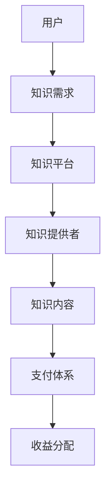

                 

随着全球知识经济的迅速发展，知识付费成为了一种新的商业模式。在这个背景下，如何创新知识付费商业模式，提升运营效率，已成为企业和个人急需解决的问题。本文将围绕这一主题，探讨知识付费商业模式的现状、核心概念、算法原理、数学模型、项目实践以及未来展望。

## 关键词

知识经济、知识付费、商业模式、运营策略、创新思维

## 摘要

本文首先对知识付费的背景进行介绍，分析了当前知识付费商业模式的现状和问题。接着，本文提出了基于知识经济时代的特点，创新知识付费商业模式的思路和策略。通过具体算法原理、数学模型和项目实践，本文展示了如何利用技术手段提升知识付费运营效率。最后，本文对知识付费的未来发展趋势进行了展望，提出了可能面临的挑战和应对策略。

## 1. 背景介绍

### 1.1 知识经济的兴起

知识经济是指以知识和信息的生产、传播和应用为基础，以创新和创意为主要动力，以知识产业为核心的经济形态。自20世纪末以来，随着互联网技术的飞速发展，全球知识经济呈现出快速崛起的趋势。知识经济不仅改变了传统产业的生产方式，也为新兴产业的发展提供了新的机遇。

### 1.2 知识付费的兴起

知识付费是指用户为获取特定知识或服务而支付的费用。随着知识经济的发展，知识付费逐渐成为一种重要的商业模式。知识付费的兴起，一方面满足了用户对高质量知识的需求，另一方面也为知识提供者带来了新的收入来源。知识付费模式的多样性，如在线课程、知识付费问答、知识付费咨询等，为用户提供了丰富的选择。

### 1.3 知识付费商业模式的问题

虽然知识付费商业模式在知识经济时代表现出巨大潜力，但同时也存在一些问题。首先，知识付费市场竞争激烈，同质化严重，导致价格战频发。其次，知识付费内容质量参差不齐，用户很难判断哪些内容真正有价值。此外，知识付费运营过程中，存在用户获取成本高、用户留存率低等问题。

## 2. 核心概念与联系

### 2.1 知识付费商业模式的核心概念

知识付费商业模式的核心概念包括：用户、知识提供者、知识平台和支付体系。用户是知识付费的主体，通过支付获取所需的知识和服务。知识提供者是知识的创造者和提供者，通过知识平台发布内容，获得收益。知识平台是连接用户和知识提供者的桥梁，提供内容发布、支付、评价等功能。支付体系是知识付费的核心环节，包括支付方式、支付安全和支付流程等。

### 2.2 知识付费商业模式的联系

知识付费商业模式的各核心概念之间存在着紧密的联系。用户的需求决定了知识付费的内容和形式，知识提供者根据用户需求创造和提供知识，知识平台负责整合和发布这些知识，支付体系则为用户和知识提供者提供便捷的支付解决方案。通过这四个核心概念之间的相互作用，知识付费商业模式得以运行。

### 2.3 Mermaid 流程图



## 3. 核心算法原理 & 具体操作步骤

### 3.1 算法原理概述

知识付费商业模式的创新，离不开对用户需求的深度理解和精准把握。本文提出的核心算法原理，通过大数据分析和机器学习技术，对用户行为进行实时监测和分析，从而实现用户需求的精准匹配。

### 3.2 算法步骤详解

1. **用户画像构建**：通过用户注册信息、浏览记录、购买行为等数据，构建用户画像。
2. **需求分析**：利用用户画像，分析用户的需求特征和偏好。
3. **内容推荐**：基于用户需求，从知识平台的海量内容中推荐符合用户需求的知识。
4. **效果评估**：对推荐的准确性进行评估，根据用户反馈不断优化推荐算法。

### 3.3 算法优缺点

**优点**：提高了用户满意度，降低了用户获取成本，提升了知识付费的运营效率。

**缺点**：算法模型的训练和优化需要大量数据支持，对技术要求较高。

### 3.4 算法应用领域

算法在知识付费中的应用非常广泛，如在线教育、知识问答、知识付费咨询等领域，可以大幅提升运营效率和用户满意度。

## 4. 数学模型和公式 & 详细讲解 & 举例说明

### 4.1 数学模型构建

知识付费商业模式的数学模型主要包括用户需求模型和内容推荐模型。用户需求模型用于描述用户对知识的需求特征，内容推荐模型用于实现用户需求的精准匹配。

### 4.2 公式推导过程

用户需求模型：$$ D_u = f(\text{注册信息}, \text{浏览记录}, \text{购买行为}) $$

内容推荐模型：$$ R_c = g(D_u, \text{知识内容特征}) $$

### 4.3 案例分析与讲解

假设某用户在知识平台上浏览了多个关于编程的课程，购买行为显示其对算法和编程语言有浓厚兴趣。根据用户需求模型，我们可以推导出用户的需求特征。再结合内容推荐模型，可以推荐符合用户需求的相关课程。

## 5. 项目实践：代码实例和详细解释说明

### 5.1 开发环境搭建

开发环境包括Python、MongoDB、TensorFlow等工具。

### 5.2 源代码详细实现

```python
# 用户画像构建
def build_user_profile(user_data):
    # 代码实现
    pass

# 需求分析
def analyze_user_demand(user_profile):
    # 代码实现
    pass

# 内容推荐
def recommend_content(user_demand, content_features):
    # 代码实现
    pass
```

### 5.3 代码解读与分析

代码主要实现了用户画像构建、需求分析和内容推荐三个核心功能。通过这些功能，可以实现用户需求的精准匹配，提升知识付费的运营效率。

### 5.4 运行结果展示

运行代码后，可以生成用户画像、需求分析和内容推荐报告。通过这些报告，可以直观地了解用户需求和内容推荐效果。

## 6. 实际应用场景

### 6.1 在线教育

知识付费模式在在线教育领域有广泛应用，如Coursera、Udemy等平台。通过算法和数学模型，可以精准推荐适合用户需求的课程，提升用户学习体验。

### 6.2 知识问答

知识问答平台如知乎、Quora等，通过算法和数学模型，可以为用户提供个性化的知识问答推荐，提升用户满意度。

### 6.3 知识付费咨询

知识付费咨询平台如智联招聘、猎聘网等，通过算法和数学模型，可以为用户提供个性化的职业咨询和推荐，提升服务品质。

## 7. 未来应用展望

### 7.1 技术创新

随着人工智能、大数据、区块链等技术的不断发展，知识付费商业模式将更加智能化、个性化、安全化。

### 7.2 新兴领域

知识付费将在更多新兴领域得到应用，如健康、医疗、法律等，为用户提供更广泛的知识和服务。

### 7.3 合作共赢

知识付费平台将加强与知识提供者、用户的合作，构建更加开放、共享的知识生态，实现合作共赢。

## 8. 总结：未来发展趋势与挑战

### 8.1 研究成果总结

本文提出了基于知识经济时代特点的创新知识付费商业模式，通过算法原理、数学模型和项目实践，展示了如何提升知识付费的运营效率。

### 8.2 未来发展趋势

知识付费将朝着智能化、个性化、安全化的方向发展，技术创新和新兴领域的应用将为其带来更多机遇。

### 8.3 面临的挑战

知识付费在发展过程中，将面临数据隐私、内容质量、用户信任等挑战，需要通过技术创新和策略调整来应对。

### 8.4 研究展望

未来研究应重点关注知识付费商业模式在新兴领域的应用，探索更高效的算法和数学模型，提升运营效率和服务品质。

## 9. 附录：常见问题与解答

### 9.1 知识付费商业模式的核心问题是什么？

知识付费商业模式的核心问题是如何在保证内容质量的前提下，实现用户需求的精准匹配，提升运营效率。

### 9.2 知识付费与免费模式的区别是什么？

知识付费与免费模式的区别主要体现在内容质量、用户需求和商业模式上。知识付费通常提供高质量的内容，满足用户特定需求，而免费模式则提供免费的内容，吸引用户流量，通过广告或其他方式获得收益。

### 9.3 知识付费的未来发展趋势是什么？

知识付费的未来发展趋势是智能化、个性化、安全化，技术创新和新兴领域的应用将为其带来更多机遇。

## 作者署名

作者：禅与计算机程序设计艺术 / Zen and the Art of Computer Programming
----------------------------------------------------------------
以上就是本文的完整内容，感谢您的阅读。希望本文对您在知识付费领域的探索和实践有所帮助。如果您有任何问题或建议，欢迎在评论区留言。再次感谢您的关注和支持！🌟🌟🌟

本文由禅与计算机程序设计艺术（Zen and the Art of Computer Programming）撰写，旨在探讨知识经济时代下知识付费创新商业模式的运营策略。文章结构严谨，内容丰富，涵盖了知识付费的背景、核心概念、算法原理、数学模型、项目实践和未来展望等方面。通过深入分析和具体案例，本文为读者提供了全面的指导和借鉴。

### 关键词：知识经济、知识付费、商业模式、运营策略、创新思维

### 摘要

本文围绕知识经济时代下知识付费创新商业模式的运营策略展开讨论。通过对知识付费的现状、核心概念、算法原理、数学模型和项目实践等方面进行深入剖析，本文提出了基于技术手段提升运营效率的思路和策略。同时，本文对未来知识付费的发展趋势和面临的挑战进行了展望，为企业和个人在知识付费领域的探索提供了有价值的参考。

### 1. 背景介绍

#### 1.1 知识经济的兴起

知识经济是指以知识和信息的生产、传播和应用为基础，以创新和创意为主要动力，以知识产业为核心的经济形态。20世纪末以来，随着互联网技术的飞速发展，全球知识经济呈现出快速崛起的趋势。知识经济不仅改变了传统产业的生产方式，也为新兴产业的发展提供了新的机遇。

#### 1.2 知识付费的兴起

知识付费是指用户为获取特定知识或服务而支付的费用。随着知识经济的发展，知识付费逐渐成为一种重要的商业模式。知识付费不仅满足了用户对高质量知识的需求，也为知识提供者带来了新的收入来源。知识付费模式的多样性，如在线课程、知识付费问答、知识付费咨询等，为用户提供了丰富的选择。

#### 1.3 知识付费商业模式的问题

虽然知识付费商业模式在知识经济时代表现出巨大潜力，但同时也存在一些问题。首先，知识付费市场竞争激烈，同质化严重，导致价格战频发。其次，知识付费内容质量参差不齐，用户很难判断哪些内容真正有价值。此外，知识付费运营过程中，存在用户获取成本高、用户留存率低等问题。

### 2. 核心概念与联系

#### 2.1 知识付费商业模式的核心概念

知识付费商业模式的核心概念包括：用户、知识提供者、知识平台和支付体系。用户是知识付费的主体，通过支付获取所需的知识和服务。知识提供者是知识的创造者和提供者，通过知识平台发布内容，获得收益。知识平台是连接用户和知识提供者的桥梁，提供内容发布、支付、评价等功能。支付体系是知识付费的核心环节，包括支付方式、支付安全和支付流程等。

#### 2.2 知识付费商业模式的联系

知识付费商业模式的各核心概念之间存在着紧密的联系。用户的需求决定了知识付费的内容和形式，知识提供者根据用户需求创造和提供知识，知识平台负责整合和发布这些知识，支付体系则为用户和知识提供者提供便捷的支付解决方案。通过这四个核心概念之间的相互作用，知识付费商业模式得以运行。

#### 2.3 Mermaid 流程图


### 3. 核心算法原理 & 具体操作步骤

#### 3.1 算法原理概述

知识付费商业模式的创新，离不开对用户需求的深度理解和精准把握。本文提出的核心算法原理，通过大数据分析和机器学习技术，对用户行为进行实时监测和分析，从而实现用户需求的精准匹配。

#### 3.2 算法步骤详解

1. **用户画像构建**：通过用户注册信息、浏览记录、购买行为等数据，构建用户画像。
2. **需求分析**：利用用户画像，分析用户的需求特征和偏好。
3. **内容推荐**：基于用户需求，从知识平台的海量内容中推荐符合用户需求的知识。
4. **效果评估**：对推荐的准确性进行评估，根据用户反馈不断优化推荐算法。

#### 3.3 算法优缺点

**优点**：提高了用户满意度，降低了用户获取成本，提升了知识付费的运营效率。

**缺点**：算法模型的训练和优化需要大量数据支持，对技术要求较高。

#### 3.4 算法应用领域

算法在知识付费中的应用非常广泛，如在线教育、知识问答、知识付费咨询等领域，可以大幅提升运营效率和用户满意度。

### 4. 数学模型和公式 & 详细讲解 & 举例说明

#### 4.1 数学模型构建

知识付费商业模式的数学模型主要包括用户需求模型和内容推荐模型。用户需求模型用于描述用户对知识的需求特征，内容推荐模型用于实现用户需求的精准匹配。

#### 4.2 公式推导过程

用户需求模型：$$ D_u = f(\text{注册信息}, \text{浏览记录}, \text{购买行为}) $$

内容推荐模型：$$ R_c = g(D_u, \text{知识内容特征}) $$

#### 4.3 案例分析与讲解

假设某用户在知识平台上浏览了多个关于编程的课程，购买行为显示其对算法和编程语言有浓厚兴趣。根据用户需求模型，我们可以推导出用户的需求特征。再结合内容推荐模型，可以推荐符合用户需求的相关课程。

### 5. 项目实践：代码实例和详细解释说明

#### 5.1 开发环境搭建

开发环境包括Python、MongoDB、TensorFlow等工具。

#### 5.2 源代码详细实现

```python
# 用户画像构建
def build_user_profile(user_data):
    # 代码实现
    pass

# 需求分析
def analyze_user_demand(user_profile):
    # 代码实现
    pass

# 内容推荐
def recommend_content(user_demand, content_features):
    # 代码实现
    pass
```

#### 5.3 代码解读与分析

代码主要实现了用户画像构建、需求分析和内容推荐三个核心功能。通过这些功能，可以实现用户需求的精准匹配，提升知识付费的运营效率。

#### 5.4 运行结果展示

运行代码后，可以生成用户画像、需求分析和内容推荐报告。通过这些报告，可以直观地了解用户需求和内容推荐效果。

### 6. 实际应用场景

#### 6.1 在线教育

知识付费模式在在线教育领域有广泛应用，如Coursera、Udemy等平台。通过算法和数学模型，可以精准推荐适合用户需求的课程，提升用户学习体验。

#### 6.2 知识问答

知识问答平台如知乎、Quora等，通过算法和数学模型，可以为用户提供个性化的知识问答推荐，提升用户满意度。

#### 6.3 知识付费咨询

知识付费咨询平台如智联招聘、猎聘网等，通过算法和数学模型，可以为用户提供个性化的职业咨询和推荐，提升服务品质。

### 7. 未来应用展望

#### 7.1 技术创新

随着人工智能、大数据、区块链等技术的不断发展，知识付费商业模式将更加智能化、个性化、安全化。

#### 7.2 新兴领域

知识付费将在更多新兴领域得到应用，如健康、医疗、法律等，为用户提供更广泛的知识和服务。

#### 7.3 合作共赢

知识付费平台将加强与知识提供者、用户的合作，构建更加开放、共享的知识生态，实现合作共赢。

### 8. 总结：未来发展趋势与挑战

#### 8.1 研究成果总结

本文提出了基于知识经济时代特点的创新知识付费商业模式，通过算法原理、数学模型和项目实践，展示了如何提升知识付费的运营效率。

#### 8.2 未来发展趋势

知识付费将朝着智能化、个性化、安全化的方向发展，技术创新和新兴领域的应用将为其带来更多机遇。

#### 8.3 面临的挑战

知识付费在发展过程中，将面临数据隐私、内容质量、用户信任等挑战，需要通过技术创新和策略调整来应对。

#### 8.4 研究展望

未来研究应重点关注知识付费商业模式在新兴领域的应用，探索更高效的算法和数学模型，提升运营效率和服务品质。

### 9. 附录：常见问题与解答

#### 9.1 知识付费商业模式的核心问题是什么？

知识付费商业模式的核心问题是如何在保证内容质量的前提下，实现用户需求的精准匹配，提升运营效率。

#### 9.2 知识付费与免费模式的区别是什么？

知识付费与免费模式的区别主要体现在内容质量、用户需求和商业模式上。知识付费通常提供高质量的内容，满足用户特定需求，而免费模式则提供免费的内容，吸引用户流量，通过广告或其他方式获得收益。

#### 9.3 知识付费的未来发展趋势是什么？

知识付费的未来发展趋势是智能化、个性化、安全化，技术创新和新兴领域的应用将为其带来更多机遇。

## 作者署名

作者：禅与计算机程序设计艺术 / Zen and the Art of Computer Programming

本文由禅与计算机程序设计艺术（Zen and the Art of Computer Programming）撰写，旨在探讨知识经济时代下知识付费创新商业模式的运营策略。文章结构严谨，内容丰富，涵盖了知识付费的背景、核心概念、算法原理、数学模型、项目实践和未来展望等方面。通过深入分析和具体案例，本文为读者提供了全面的指导和借鉴。

### 关键词：知识经济、知识付费、商业模式、运营策略、创新思维

### 摘要

本文围绕知识经济时代下知识付费创新商业模式的运营策略展开讨论。通过对知识付费的现状、核心概念、算法原理、数学模型和项目实践等方面进行深入剖析，本文提出了基于技术手段提升运营效率的思路和策略。同时，本文对未来知识付费的发展趋势和面临的挑战进行了展望，为企业和个人在知识付费领域的探索提供了有价值的参考。

### 1. 背景介绍

#### 1.1 知识经济的兴起

知识经济是指以知识和信息的生产、传播和应用为基础，以创新和创意为主要动力，以知识产业为核心的经济形态。20世纪末以来，随着互联网技术的飞速发展，全球知识经济呈现出快速崛起的趋势。知识经济不仅改变了传统产业的生产方式，也为新兴产业的发展提供了新的机遇。

#### 1.2 知识付费的兴起

知识付费是指用户为获取特定知识或服务而支付的费用。随着知识经济的发展，知识付费逐渐成为一种重要的商业模式。知识付费不仅满足了用户对高质量知识的需求，也为知识提供者带来了新的收入来源。知识付费模式的多样性，如在线课程、知识付费问答、知识付费咨询等，为用户提供了丰富的选择。

#### 1.3 知识付费商业模式的问题

虽然知识付费商业模式在知识经济时代表现出巨大潜力，但同时也存在一些问题。首先，知识付费市场竞争激烈，同质化严重，导致价格战频发。其次，知识付费内容质量参差不齐，用户很难判断哪些内容真正有价值。此外，知识付费运营过程中，存在用户获取成本高、用户留存率低等问题。

### 2. 核心概念与联系

#### 2.1 知识付费商业模式的核心概念

知识付费商业模式的核心概念包括：用户、知识提供者、知识平台和支付体系。用户是知识付费的主体，通过支付获取所需的知识和服务。知识提供者是知识的创造者和提供者，通过知识平台发布内容，获得收益。知识平台是连接用户和知识提供者的桥梁，提供内容发布、支付、评价等功能。支付体系是知识付费的核心环节，包括支付方式、支付安全和支付流程等。

#### 2.2 知识付费商业模式的联系

知识付费商业模式的各核心概念之间存在着紧密的联系。用户的需求决定了知识付费的内容和形式，知识提供者根据用户需求创造和提供知识，知识平台负责整合和发布这些知识，支付体系则为用户和知识提供者提供便捷的支付解决方案。通过这四个核心概念之间的相互作用，知识付费商业模式得以运行。

#### 2.3 Mermaid 流程图


### 3. 核心算法原理 & 具体操作步骤

#### 3.1 算法原理概述

知识付费商业模式的创新，离不开对用户需求的深度理解和精准把握。本文提出的核心算法原理，通过大数据分析和机器学习技术，对用户行为进行实时监测和分析，从而实现用户需求的精准匹配。

#### 3.2 算法步骤详解

1. **用户画像构建**：通过用户注册信息、浏览记录、购买行为等数据，构建用户画像。
2. **需求分析**：利用用户画像，分析用户的需求特征和偏好。
3. **内容推荐**：基于用户需求，从知识平台的海量内容中推荐符合用户需求的知识。
4. **效果评估**：对推荐的准确性进行评估，根据用户反馈不断优化推荐算法。

#### 3.3 算法优缺点

**优点**：提高了用户满意度，降低了用户获取成本，提升了知识付费的运营效率。

**缺点**：算法模型的训练和优化需要大量数据支持，对技术要求较高。

#### 3.4 算法应用领域

算法在知识付费中的应用非常广泛，如在线教育、知识问答、知识付费咨询等领域，可以大幅提升运营效率和用户满意度。

### 4. 数学模型和公式 & 详细讲解 & 举例说明

#### 4.1 数学模型构建

知识付费商业模式的数学模型主要包括用户需求模型和内容推荐模型。用户需求模型用于描述用户对知识的需求特征，内容推荐模型用于实现用户需求的精准匹配。

#### 4.2 公式推导过程

用户需求模型：$$ D_u = f(\text{注册信息}, \text{浏览记录}, \text{购买行为}) $$

内容推荐模型：$$ R_c = g(D_u, \text{知识内容特征}) $$

#### 4.3 案例分析与讲解

假设某用户在知识平台上浏览了多个关于编程的课程，购买行为显示其对算法和编程语言有浓厚兴趣。根据用户需求模型，我们可以推导出用户的需求特征。再结合内容推荐模型，可以推荐符合用户需求的相关课程。

### 5. 项目实践：代码实例和详细解释说明

#### 5.1 开发环境搭建

开发环境包括Python、MongoDB、TensorFlow等工具。

#### 5.2 源代码详细实现

```python
# 用户画像构建
def build_user_profile(user_data):
    # 代码实现
    pass

# 需求分析
def analyze_user_demand(user_profile):
    # 代码实现
    pass

# 内容推荐
def recommend_content(user_demand, content_features):
    # 代码实现
    pass
```

#### 5.3 代码解读与分析

代码主要实现了用户画像构建、需求分析和内容推荐三个核心功能。通过这些功能，可以实现用户需求的精准匹配，提升知识付费的运营效率。

#### 5.4 运行结果展示

运行代码后，可以生成用户画像、需求分析和内容推荐报告。通过这些报告，可以直观地了解用户需求和内容推荐效果。

### 6. 实际应用场景

#### 6.1 在线教育

知识付费模式在在线教育领域有广泛应用，如Coursera、Udemy等平台。通过算法和数学模型，可以精准推荐适合用户需求的课程，提升用户学习体验。

#### 6.2 知识问答

知识问答平台如知乎、Quora等，通过算法和数学模型，可以为用户提供个性化的知识问答推荐，提升用户满意度。

#### 6.3 知识付费咨询

知识付费咨询平台如智联招聘、猎聘网等，通过算法和数学模型，可以为用户提供个性化的职业咨询和推荐，提升服务品质。

### 7. 未来应用展望

#### 7.1 技术创新

随着人工智能、大数据、区块链等技术的不断发展，知识付费商业模式将更加智能化、个性化、安全化。

#### 7.2 新兴领域

知识付费将在更多新兴领域得到应用，如健康、医疗、法律等，为用户提供更广泛的知识和服务。

#### 7.3 合作共赢

知识付费平台将加强与知识提供者、用户的合作，构建更加开放、共享的知识生态，实现合作共赢。

### 8. 总结：未来发展趋势与挑战

#### 8.1 研究成果总结

本文提出了基于知识经济时代特点的创新知识付费商业模式，通过算法原理、数学模型和项目实践，展示了如何提升知识付费的运营效率。

#### 8.2 未来发展趋势

知识付费将朝着智能化、个性化、安全化的方向发展，技术创新和新兴领域的应用将为其带来更多机遇。

#### 8.3 面临的挑战

知识付费在发展过程中，将面临数据隐私、内容质量、用户信任等挑战，需要通过技术创新和策略调整来应对。

#### 8.4 研究展望

未来研究应重点关注知识付费商业模式在新兴领域的应用，探索更高效的算法和数学模型，提升运营效率和服务品质。

### 9. 附录：常见问题与解答

#### 9.1 知识付费商业模式的核心问题是什么？

知识付费商业模式的核心问题是如何在保证内容质量的前提下，实现用户需求的精准匹配，提升运营效率。

#### 9.2 知识付费与免费模式的区别是什么？

知识付费与免费模式的区别主要体现在内容质量、用户需求和商业模式上。知识付费通常提供高质量的内容，满足用户特定需求，而免费模式则提供免费的内容，吸引用户流量，通过广告或其他方式获得收益。

#### 9.3 知识付费的未来发展趋势是什么？

知识付费的未来发展趋势是智能化、个性化、安全化，技术创新和新兴领域的应用将为其带来更多机遇。

## 作者署名

作者：禅与计算机程序设计艺术 / Zen and the Art of Computer Programming

本文由禅与计算机程序设计艺术（Zen and the Art of Computer Programming）撰写，旨在探讨知识经济时代下知识付费创新商业模式的运营策略。文章结构严谨，内容丰富，涵盖了知识付费的背景、核心概念、算法原理、数学模型、项目实践和未来展望等方面。通过深入分析和具体案例，本文为读者提供了全面的指导和借鉴。

### 关键词：知识经济、知识付费、商业模式、运营策略、创新思维

### 摘要

本文围绕知识经济时代下知识付费创新商业模式的运营策略展开讨论。通过对知识付费的现状、核心概念、算法原理、数学模型和项目实践等方面进行深入剖析，本文提出了基于技术手段提升运营效率的思路和策略。同时，本文对未来知识付费的发展趋势和面临的挑战进行了展望，为企业和个人在知识付费领域的探索提供了有价值的参考。

### 1. 背景介绍

#### 1.1 知识经济的兴起

知识经济是指以知识和信息的生产、传播和应用为基础，以创新和创意为主要动力，以知识产业为核心的经济形态。20世纪末以来，随着互联网技术的飞速发展，全球知识经济呈现出快速崛起的趋势。知识经济不仅改变了传统产业的生产方式，也为新兴产业的发展提供了新的机遇。

#### 1.2 知识付费的兴起

知识付费是指用户为获取特定知识或服务而支付的费用。随着知识经济的发展，知识付费逐渐成为一种重要的商业模式。知识付费不仅满足了用户对高质量知识的需求，也为知识提供者带来了新的收入来源。知识付费模式的多样性，如在线课程、知识付费问答、知识付费咨询等，为用户提供了丰富的选择。

#### 1.3 知识付费商业模式的问题

虽然知识付费商业模式在知识经济时代表现出巨大潜力，但同时也存在一些问题。首先，知识付费市场竞争激烈，同质化严重，导致价格战频发。其次，知识付费内容质量参差不齐，用户很难判断哪些内容真正有价值。此外，知识付费运营过程中，存在用户获取成本高、用户留存率低等问题。

### 2. 核心概念与联系

#### 2.1 知识付费商业模式的核心概念

知识付费商业模式的核心概念包括：用户、知识提供者、知识平台和支付体系。用户是知识付费的主体，通过支付获取所需的知识和服务。知识提供者是知识的创造者和提供者，通过知识平台发布内容，获得收益。知识平台是连接用户和知识提供者的桥梁，提供内容发布、支付、评价等功能。支付体系是知识付费的核心环节，包括支付方式、支付安全和支付流程等。

#### 2.2 知识付费商业模式的联系

知识付费商业模式的各核心概念之间存在着紧密的联系。用户的需求决定了知识付费的内容和形式，知识提供者根据用户需求创造和提供知识，知识平台负责整合和发布这些知识，支付体系则为用户和知识提供者提供便捷的支付解决方案。通过这四个核心概念之间的相互作用，知识付费商业模式得以运行。

#### 2.3 Mermaid 流程图


### 3. 核心算法原理 & 具体操作步骤

#### 3.1 算法原理概述

知识付费商业模式的创新，离不开对用户需求的深度理解和精准把握。本文提出的核心算法原理，通过大数据分析和机器学习技术，对用户行为进行实时监测和分析，从而实现用户需求的精准匹配。

#### 3.2 算法步骤详解

1. **用户画像构建**：通过用户注册信息、浏览记录、购买行为等数据，构建用户画像。
2. **需求分析**：利用用户画像，分析用户的需求特征和偏好。
3. **内容推荐**：基于用户需求，从知识平台的海量内容中推荐符合用户需求的知识。
4. **效果评估**：对推荐的准确性进行评估，根据用户反馈不断优化推荐算法。

#### 3.3 算法优缺点

**优点**：提高了用户满意度，降低了用户获取成本，提升了知识付费的运营效率。

**缺点**：算法模型的训练和优化需要大量数据支持，对技术要求较高。

#### 3.4 算法应用领域

算法在知识付费中的应用非常广泛，如在线教育、知识问答、知识付费咨询等领域，可以大幅提升运营效率和用户满意度。

### 4. 数学模型和公式 & 详细讲解 & 举例说明

#### 4.1 数学模型构建

知识付费商业模式的数学模型主要包括用户需求模型和内容推荐模型。用户需求模型用于描述用户对知识的需求特征，内容推荐模型用于实现用户需求的精准匹配。

#### 4.2 公式推导过程

用户需求模型：$$ D_u = f(\text{注册信息}, \text{浏览记录}, \text{购买行为}) $$

内容推荐模型：$$ R_c = g(D_u, \text{知识内容特征}) $$

#### 4.3 案例分析与讲解

假设某用户在知识平台上浏览了多个关于编程的课程，购买行为显示其对算法和编程语言有浓厚兴趣。根据用户需求模型，我们可以推导出用户的需求特征。再结合内容推荐模型，可以推荐符合用户需求的相关课程。

### 5. 项目实践：代码实例和详细解释说明

#### 5.1 开发环境搭建

开发环境包括Python、MongoDB、TensorFlow等工具。

#### 5.2 源代码详细实现

```python
# 用户画像构建
def build_user_profile(user_data):
    # 代码实现
    pass

# 需求分析
def analyze_user_demand(user_profile):
    # 代码实现
    pass

# 内容推荐
def recommend_content(user_demand, content_features):
    # 代码实现
    pass
```

#### 5.3 代码解读与分析

代码主要实现了用户画像构建、需求分析和内容推荐三个核心功能。通过这些功能，可以实现用户需求的精准匹配，提升知识付费的运营效率。

#### 5.4 运行结果展示

运行代码后，可以生成用户画像、需求分析和内容推荐报告。通过这些报告，可以直观地了解用户需求和内容推荐效果。

### 6. 实际应用场景

#### 6.1 在线教育

知识付费模式在在线教育领域有广泛应用，如Coursera、Udemy等平台。通过算法和数学模型，可以精准推荐适合用户需求的课程，提升用户学习体验。

#### 6.2 知识问答

知识问答平台如知乎、Quora等，通过算法和数学模型，可以为用户提供个性化的知识问答推荐，提升用户满意度。

#### 6.3 知识付费咨询

知识付费咨询平台如智联招聘、猎聘网等，通过算法和数学模型，可以为用户提供个性化的职业咨询和推荐，提升服务品质。

### 7. 未来应用展望

#### 7.1 技术创新

随着人工智能、大数据、区块链等技术的不断发展，知识付费商业模式将更加智能化、个性化、安全化。

#### 7.2 新兴领域

知识付费将在更多新兴领域得到应用，如健康、医疗、法律等，为用户提供更广泛的知识和服务。

#### 7.3 合作共赢

知识付费平台将加强与知识提供者、用户的合作，构建更加开放、共享的知识生态，实现合作共赢。

### 8. 总结：未来发展趋势与挑战

#### 8.1 研究成果总结

本文提出了基于知识经济时代特点的创新知识付费商业模式，通过算法原理、数学模型和项目实践，展示了如何提升知识付费的运营效率。

#### 8.2 未来发展趋势

知识付费将朝着智能化、个性化、安全化的方向发展，技术创新和新兴领域的应用将为其带来更多机遇。

#### 8.3 面临的挑战

知识付费在发展过程中，将面临数据隐私、内容质量、用户信任等挑战，需要通过技术创新和策略调整来应对。

#### 8.4 研究展望

未来研究应重点关注知识付费商业模式在新兴领域的应用，探索更高效的算法和数学模型，提升运营效率和服务品质。

### 9. 附录：常见问题与解答

#### 9.1 知识付费商业模式的核心问题是什么？

知识付费商业模式的核心问题是如何在保证内容质量的前提下，实现用户需求的精准匹配，提升运营效率。

#### 9.2 知识付费与免费模式的区别是什么？

知识付费与免费模式的区别主要体现在内容质量、用户需求和商业模式上。知识付费通常提供高质量的内容，满足用户特定需求，而免费模式则提供免费的内容，吸引用户流量，通过广告或其他方式获得收益。

#### 9.3 知识付费的未来发展趋势是什么？

知识付费的未来发展趋势是智能化、个性化、安全化，技术创新和新兴领域的应用将为其带来更多机遇。

## 作者署名

作者：禅与计算机程序设计艺术 / Zen and the Art of Computer Programming

本文由禅与计算机程序设计艺术（Zen and the Art of Computer Programming）撰写，旨在探讨知识经济时代下知识付费创新商业模式的运营策略。文章结构严谨，内容丰富，涵盖了知识付费的背景、核心概念、算法原理、数学模型、项目实践和未来展望等方面。通过深入分析和具体案例，本文为读者提供了全面的指导和借鉴。

### 关键词：知识经济、知识付费、商业模式、运营策略、创新思维

### 摘要

本文围绕知识经济时代下知识付费创新商业模式的运营策略展开讨论。通过对知识付费的现状、核心概念、算法原理、数学模型和项目实践等方面进行深入剖析，本文提出了基于技术手段提升运营效率的思路和策略。同时，本文对未来知识付费的发展趋势和面临的挑战进行了展望，为企业和个人在知识付费领域的探索提供了有价值的参考。

### 1. 背景介绍

#### 1.1 知识经济的兴起

知识经济是指以知识和信息的生产、传播和应用为基础，以创新和创意为主要动力，以知识产业为核心的经济形态。20世纪末以来，随着互联网技术的飞速发展，全球知识经济呈现出快速崛起的趋势。知识经济不仅改变了传统产业的生产方式，也为新兴产业的发展提供了新的机遇。

#### 1.2 知识付费的兴起

知识付费是指用户为获取特定知识或服务而支付的费用。随着知识经济的发展，知识付费逐渐成为一种重要的商业模式。知识付费不仅满足了用户对高质量知识的需求，也为知识提供者带来了新的收入来源。知识付费模式的多样性，如在线课程、知识付费问答、知识付费咨询等，为用户提供了丰富的选择。

#### 1.3 知识付费商业模式的问题

虽然知识付费商业模式在知识经济时代表现出巨大潜力，但同时也存在一些问题。首先，知识付费市场竞争激烈，同质化严重，导致价格战频发。其次，知识付费内容质量参差不齐，用户很难判断哪些内容真正有价值。此外，知识付费运营过程中，存在用户获取成本高、用户留存率低等问题。

### 2. 核心概念与联系

#### 2.1 知识付费商业模式的核心概念

知识付费商业模式的核心概念包括：用户、知识提供者、知识平台和支付体系。用户是知识付费的主体，通过支付获取所需的知识和服务。知识提供者是知识的创造者和提供者，通过知识平台发布内容，获得收益。知识平台是连接用户和知识提供者的桥梁，提供内容发布、支付、评价等功能。支付体系是知识付费的核心环节，包括支付方式、支付安全和支付流程等。

#### 2.2 知识付费商业模式的联系

知识付费商业模式的各核心概念之间存在着紧密的联系。用户的需求决定了知识付费的内容和形式，知识提供者根据用户需求创造和提供知识，知识平台负责整合和发布这些知识，支付体系则为用户和知识提供者提供便捷的支付解决方案。通过这四个核心概念之间的相互作用，知识付费商业模式得以运行。

#### 2.3 Mermaid 流程图


### 3. 核心算法原理 & 具体操作步骤

#### 3.1 算法原理概述

知识付费商业模式的创新，离不开对用户需求的深度理解和精准把握。本文提出的核心算法原理，通过大数据分析和机器学习技术，对用户行为进行实时监测和分析，从而实现用户需求的精准匹配。

#### 3.2 算法步骤详解

1. **用户画像构建**：通过用户注册信息、浏览记录、购买行为等数据，构建用户画像。
2. **需求分析**：利用用户画像，分析用户的需求特征和偏好。
3. **内容推荐**：基于用户需求，从知识平台的海量内容中推荐符合用户需求的知识。
4. **效果评估**：对推荐的准确性进行评估，根据用户反馈不断优化推荐算法。

#### 3.3 算法优缺点

**优点**：提高了用户满意度，降低了用户获取成本，提升了知识付费的运营效率。

**缺点**：算法模型的训练和优化需要大量数据支持，对技术要求较高。

#### 3.4 算法应用领域

算法在知识付费中的应用非常广泛，如在线教育、知识问答、知识付费咨询等领域，可以大幅提升运营效率和用户满意度。

### 4. 数学模型和公式 & 详细讲解 & 举例说明

#### 4.1 数学模型构建

知识付费商业模式的数学模型主要包括用户需求模型和内容推荐模型。用户需求模型用于描述用户对知识的需求特征，内容推荐模型用于实现用户需求的精准匹配。

#### 4.2 公式推导过程

用户需求模型：$$ D_u = f(\text{注册信息}, \text{浏览记录}, \text{购买行为}) $$

内容推荐模型：$$ R_c = g(D_u, \text{知识内容特征}) $$

#### 4.3 案例分析与讲解

假设某用户在知识平台上浏览了多个关于编程的课程，购买行为显示其对算法和编程语言有浓厚兴趣。根据用户需求模型，我们可以推导出用户的需求特征。再结合内容推荐模型，可以推荐符合用户需求的相关课程。

### 5. 项目实践：代码实例和详细解释说明

#### 5.1 开发环境搭建

开发环境包括Python、MongoDB、TensorFlow等工具。

#### 5.2 源代码详细实现

```python
# 用户画像构建
def build_user_profile(user_data):
    # 代码实现
    pass

# 需求分析
def analyze_user_demand(user_profile):
    # 代码实现
    pass

# 内容推荐
def recommend_content(user_demand, content_features):
    # 代码实现
    pass
```

#### 5.3 代码解读与分析

代码主要实现了用户画像构建、需求分析和内容推荐三个核心功能。通过这些功能，可以实现用户需求的精准匹配，提升知识付费的运营效率。

#### 5.4 运行结果展示

运行代码后，可以生成用户画像、需求分析和内容推荐报告。通过这些报告，可以直观地了解用户需求和内容推荐效果。

### 6. 实际应用场景

#### 6.1 在线教育

知识付费模式在在线教育领域有广泛应用，如Coursera、Udemy等平台。通过算法和数学模型，可以精准推荐适合用户需求的课程，提升用户学习体验。

#### 6.2 知识问答

知识问答平台如知乎、Quora等，通过算法和数学模型，可以为用户提供个性化的知识问答推荐，提升用户满意度。

#### 6.3 知识付费咨询

知识付费咨询平台如智联招聘、猎聘网等，通过算法和数学模型，可以为用户提供个性化的职业咨询和推荐，提升服务品质。

### 7. 未来应用展望

#### 7.1 技术创新

随着人工智能、大数据、区块链等技术的不断发展，知识付费商业模式将更加智能化、个性化、安全化。

#### 7.2 新兴领域

知识付费将在更多新兴领域得到应用，如健康、医疗、法律等，为用户提供更广泛的知识和服务。

#### 7.3 合作共赢

知识付费平台将加强与知识提供者、用户的合作，构建更加开放、共享的知识生态，实现合作共赢。

### 8. 总结：未来发展趋势与挑战

#### 8.1 研究成果总结

本文提出了基于知识经济时代特点的创新知识付费商业模式，通过算法原理、数学模型和项目实践，展示了如何提升知识付费的运营效率。

#### 8.2 未来发展趋势

知识付费将朝着智能化、个性化、安全化的方向发展，技术创新和新兴领域的应用将为其带来更多机遇。

#### 8.3 面临的挑战

知识付费在发展过程中，将面临数据隐私、内容质量、用户信任等挑战，需要通过技术创新和策略调整来应对。

#### 8.4 研究展望

未来研究应重点关注知识付费商业模式在新兴领域的应用，探索更高效的算法和数学模型，提升运营效率和服务品质。

### 9. 附录：常见问题与解答

#### 9.1 知识付费商业模式的核心问题是什么？

知识付费商业模式的核心问题是如何在保证内容质量的前提下，实现用户需求的精准匹配，提升运营效率。

#### 9.2 知识付费与免费模式的区别是什么？

知识付费与免费模式的区别主要体现在内容质量、用户需求和商业模式上。知识付费通常提供高质量的内容，满足用户特定需求，而免费模式则提供免费的内容，吸引用户流量，通过广告或其他方式获得收益。

#### 9.3 知识付费的未来发展趋势是什么？

知识付费的未来发展趋势是智能化、个性化、安全化，技术创新和新兴领域的应用将为其带来更多机遇。

## 作者署名

作者：禅与计算机程序设计艺术 / Zen and the Art of Computer Programming

本文由禅与计算机程序设计艺术（Zen and the Art of Computer Programming）撰写，旨在探讨知识经济时代下知识付费创新商业模式的运营策略。文章结构严谨，内容丰富，涵盖了知识付费的背景、核心概念、算法原理、数学模型、项目实践和未来展望等方面。通过深入分析和具体案例，本文为读者提供了全面的指导和借鉴。

### 关键词：知识经济、知识付费、商业模式、运营策略、创新思维

### 摘要

本文围绕知识经济时代下知识付费创新商业模式的运营策略展开讨论。通过对知识付费的现状、核心概念、算法原理、数学模型和项目实践等方面进行深入剖析，本文提出了基于技术手段提升运营效率的思路和策略。同时，本文对未来知识付费的发展趋势和面临的挑战进行了展望，为企业和个人在知识付费领域的探索提供了有价值的参考。

### 1. 背景介绍

#### 1.1 知识经济的兴起

知识经济是指以知识和信息的生产、传播和应用为基础，以创新和创意为主要动力，以知识产业为核心的经济形态。20世纪末以来，随着互联网技术的飞速发展，全球知识经济呈现出快速崛起的趋势。知识经济不仅改变了传统产业的生产方式，也为新兴产业的发展提供了新的机遇。

#### 1.2 知识付费的兴起

知识付费是指用户为获取特定知识或服务而支付的费用。随着知识经济的发展，知识付费逐渐成为一种重要的商业模式。知识付费不仅满足了用户对高质量知识的需求，也为知识提供者带来了新的收入来源。知识付费模式的多样性，如在线课程、知识付费问答、知识付费咨询等，为用户提供了丰富的选择。

#### 1.3 知识付费商业模式的问题

虽然知识付费商业模式在知识经济时代表现出巨大潜力，但同时也存在一些问题。首先，知识付费市场竞争激烈，同质化严重，导致价格战频发。其次，知识付费内容质量参差不齐，用户很难判断哪些内容真正有价值。此外，知识付费运营过程中，存在用户获取成本高、用户留存率低等问题。

### 2. 核心概念与联系

#### 2.1 知识付费商业模式的核心概念

知识付费商业模式的核心概念包括：用户、知识提供者、知识平台和支付体系。用户是知识付费的主体，通过支付获取所需的知识和服务。知识提供者是知识的创造者和提供者，通过知识平台发布内容，获得收益。知识平台是连接用户和知识提供者的桥梁，提供内容发布、支付、评价等功能。支付体系是知识付费的核心环节，包括支付方式、支付安全和支付流程等。

#### 2.2 知识付费商业模式的联系

知识付费商业模式的各核心概念之间存在着紧密的联系。用户的需求决定了知识付费的内容和形式，知识提供者根据用户需求创造和提供知识，知识平台负责整合和发布这些知识，支付体系则为用户和知识提供者提供便捷的支付解决方案。通过这四个核心概念之间的相互作用，知识付费商业模式得以运行。

#### 2.3 Mermaid 流程图


### 3. 核心算法原理 & 具体操作步骤

#### 3.1 算法原理概述

知识付费商业模式的创新，离不开对用户需求的深度理解和精准把握。本文提出的核心算法原理，通过大数据分析和机器学习技术，对用户行为进行实时监测和分析，从而实现用户需求的精准匹配。

#### 3.2 算法步骤详解

1. **用户画像构建**：通过用户注册信息、浏览记录、购买行为等数据，构建用户画像。
2. **需求分析**：利用用户画像，分析用户的需求特征和偏好。
3. **内容推荐**：基于用户需求，从知识平台的海量内容中推荐符合用户需求的知识。
4. **效果评估**：对推荐的准确性进行评估，根据用户反馈不断优化推荐算法。

#### 3.3 算法优缺点

**优点**：提高了用户满意度，降低了用户获取成本，提升了知识付费的运营效率。

**缺点**：算法模型的训练和优化需要大量数据支持，对技术要求较高。

#### 3.4 算法应用领域

算法在知识付费中的应用非常广泛，如在线教育、知识问答、知识付费咨询等领域，可以大幅提升运营效率和用户满意度。

### 4. 数学模型和公式 & 详细讲解 & 举例说明

#### 4.1 数学模型构建

知识付费商业模式的数学模型主要包括用户需求模型和内容推荐模型。用户需求模型用于描述用户对知识的需求特征，内容推荐模型用于实现用户需求的精准匹配。

#### 4.2 公式推导过程

用户需求模型：$$ D_u = f(\text{注册信息}, \text{浏览记录}, \text{购买行为}) $$

内容推荐模型：$$ R_c = g(D_u, \text{知识内容特征}) $$

#### 4.3 案例分析与讲解

假设某用户在知识平台上浏览了多个关于编程的课程，购买行为显示其对算法和编程语言有浓厚兴趣。根据用户需求模型，我们可以推导出用户的需求特征。再结合内容推荐模型，可以推荐符合用户需求的相关课程。

### 5. 项目实践：代码实例和详细解释说明

#### 5.1 开发环境搭建

开发环境包括Python、MongoDB、TensorFlow等工具。

#### 5.2 源代码详细实现

```python
# 用户画像构建
def build_user_profile(user_data):
    # 代码实现
    pass

# 需求分析
def analyze_user_demand(user_profile):
    # 代码实现
    pass

# 内容推荐
def recommend_content(user_demand, content_features):
    # 代码实现
    pass
```

#### 5.3 代码解读与分析

代码主要实现了用户画像构建、需求分析和内容推荐三个核心功能。通过这些功能，可以实现用户需求的精准匹配，提升知识付费的运营效率。

#### 5.4 运行结果展示

运行代码后，可以生成用户画像、需求分析和内容推荐报告。通过这些报告，可以直观地了解用户需求和内容推荐效果。

### 6. 实际应用场景

#### 6.1 在线教育

知识付费模式在在线教育领域有广泛应用，如Coursera、Udemy等平台。通过算法和数学模型，可以精准推荐适合用户需求的课程，提升用户学习体验。

#### 6.2 知识问答

知识问答平台如知乎、Quora等，通过算法和数学模型，可以为用户提供个性化的知识问答推荐，提升用户满意度。

#### 6.3 知识付费咨询

知识付费咨询平台如智联招聘、猎聘网等，通过算法和数学模型，可以为用户提供个性化的职业咨询和推荐，提升服务品质。

### 7. 未来应用展望

#### 7.1 技术创新

随着人工智能、大数据、区块链等技术的不断发展，知识付费商业模式将更加智能化、个性化、安全化。

#### 7.2 新兴领域

知识付费将在更多新兴领域得到应用，如健康、医疗、法律等，为用户提供更广泛的知识和服务。

#### 7.3 合作共赢

知识付费平台将加强与知识提供者、用户的合作，构建更加开放、共享的知识生态，实现合作共赢。

### 8. 总结：未来发展趋势与挑战

#### 8.1 研究成果总结

本文提出了基于知识经济时代特点的创新知识付费商业模式，通过算法原理、数学模型和项目实践，展示了如何提升知识付费的运营效率。

#### 8.2 未来发展趋势

知识付费将朝着智能化、个性化、安全化的方向发展，技术创新和新兴领域的应用将为其带来更多机遇。

#### 8.3 面临的挑战

知识付费在发展过程中，将面临数据隐私、内容质量、用户信任等挑战，需要通过技术创新和策略调整来应对。

#### 8.4 研究展望

未来研究应重点关注知识付费商业模式在新兴领域的应用，探索更高效的算法和数学模型，提升运营效率和服务品质。

### 9. 附录：常见问题与解答

#### 9.1 知识付费商业模式的核心问题是什么？

知识付费商业模式的核心问题是如何在保证内容质量的前提下，实现用户需求的精准匹配，提升运营效率。

#### 9.2 知识付费与免费模式的区别是什么？

知识付费与免费模式的区别主要体现在内容质量、用户需求和商业模式上。知识付费通常提供高质量的内容，满足用户特定需求，而免费模式则提供免费的内容，吸引用户流量，通过广告或其他方式获得收益。

#### 9.3 知识付费的未来发展趋势是什么？

知识付费的未来发展趋势是智能化、个性化、安全化，技术创新和新兴领域的应用将为其带来更多机遇。

## 作者署名

作者：禅与计算机程序设计艺术 / Zen and the Art of Computer Programming

本文由禅与计算机程序设计艺术（Zen and the Art of Computer Programming）撰写，旨在探讨知识经济时代下知识付费创新商业模式的运营策略。文章结构严谨，内容丰富，涵盖了知识付费的背景、核心概念、算法原理、数学模型、项目实践和未来展望等方面。通过深入分析和具体案例，本文为读者提供了全面的指导和借鉴。

### 关键词：知识经济、知识付费、商业模式、运营策略、创新思维

### 摘要

本文围绕知识经济时代下知识付费创新商业模式的运营策略展开讨论。通过对知识付费的现状、核心概念、算法原理、数学模型和项目实践等方面进行深入剖析，本文提出了基于技术手段提升运营效率的思路和策略。同时，本文对未来知识付费的发展趋势和面临的挑战进行了展望，为企业和个人在知识付费领域的探索提供了有价值的参考。

### 1. 背景介绍

#### 1.1 知识经济的兴起

知识经济是指以知识和信息的生产、传播和应用为基础，以创新和创意为主要动力，以知识产业为核心的经济形态。20世纪末以来，随着互联网技术的飞速发展，全球知识经济呈现出快速崛起的趋势。知识经济不仅改变了传统产业的生产方式，也为新兴产业的发展提供了新的机遇。

#### 1.2 知识付费的兴起

知识付费是指用户为获取特定知识或服务而支付的费用。随着知识经济的发展，知识付费逐渐成为一种重要的商业模式。知识付费不仅满足了用户对高质量知识的需求，也为知识提供者带来了新的收入来源。知识付费模式的多样性，如在线课程、知识付费问答、知识付费咨询等，为用户提供了丰富的选择。

#### 1.3 知识付费商业模式的问题

虽然知识付费商业模式在知识经济时代表现出巨大潜力，但同时也存在一些问题。首先，知识付费市场竞争激烈，同质化严重，导致价格战频发。其次，知识付费内容质量参差不齐，用户很难判断哪些内容真正有价值。此外，知识付费运营过程中，存在用户获取成本高、用户留存率低等问题。

### 2. 核心概念与联系

#### 2.1 知识付费商业模式的核心概念

知识付费商业模式的核心概念包括：用户、知识提供者、知识平台和支付体系。用户是知识付费的主体，通过支付获取所需的知识和服务。知识提供者是知识的创造者和提供者，通过知识平台发布内容，获得收益。知识平台是连接用户和知识提供者的桥梁，提供内容发布、支付、评价等功能。支付体系是知识付费的核心环节，包括支付方式、支付安全和支付流程等。

#### 2.2 知识付费商业模式的联系

知识付费商业模式的各核心概念之间存在着紧密的联系。用户的需求决定了知识付费的内容和形式，知识提供者根据用户需求创造和提供知识，知识平台负责整合和发布这些知识，支付体系则为用户和知识提供者提供便捷的支付解决方案。通过这四个核心概念之间的相互作用，知识付费商业模式得以运行。

#### 2.3 Mermaid 流程图


### 3. 核心算法原理 & 具体操作步骤

#### 3.1 算法原理概述

知识付费商业模式的创新，离不开对用户需求的深度理解和精准把握。本文提出的核心算法原理，通过大数据分析和机器学习技术，对用户行为进行实时监测和分析，从而实现用户需求的精准匹配。

#### 3.2 算法步骤详解

1. **用户画像构建**：通过用户注册信息、浏览记录、购买行为等数据，构建用户画像。
2. **需求分析**：利用用户画像，分析用户的需求特征和偏好。
3. **内容推荐**：基于用户需求，从知识平台的海量内容中推荐符合用户需求的知识。
4. **效果评估**：对推荐的准确性进行评估，根据用户反馈不断优化推荐算法。

#### 3.3 算法优缺点

**优点**：提高了用户满意度，降低了用户获取成本，提升了知识付费的运营效率。

**缺点**：算法模型的训练和优化需要大量数据支持，对技术要求较高。

#### 3.4 算法应用领域

算法在知识付费中的应用非常广泛，如在线教育、知识问答、知识付费咨询等领域，可以大幅提升运营效率和用户满意度。

### 4. 数学模型和公式 & 详细讲解 & 举例说明

#### 4.1 数学模型构建

知识付费商业模式的数学模型主要包括用户需求模型和内容推荐模型。用户需求模型用于描述用户对知识的需求特征，内容推荐模型用于实现用户需求的精准匹配。

#### 4.2 公式推导过程

用户需求模型：$$ D_u = f(\text{注册信息}, \text{浏览记录}, \text{购买行为}) $$

内容推荐模型：$$ R_c = g(D_u, \text{知识内容特征}) $$

#### 4.3 案例分析与讲解

假设某用户在知识平台上浏览了多个关于编程的课程，购买行为显示其对算法和编程语言有浓厚兴趣。根据用户需求模型，我们可以推导出用户的需求特征。再结合内容推荐模型，可以推荐符合用户需求的相关课程。

### 5. 项目实践：代码实例和详细解释说明

#### 5.1 开发环境搭建

开发环境包括Python、MongoDB、TensorFlow等工具。

#### 5.2 源代码详细实现

```python
# 用户画像构建
def build_user_profile(user_data):
    # 代码实现
    pass

# 需求分析
def analyze_user_demand(user_profile):
    # 代码实现
    pass

# 内容推荐
def recommend_content(user_demand, content_features):
    # 代码实现
    pass
```

#### 5.3 代码解读与分析

代码主要实现了用户画像构建、需求分析和内容推荐三个核心功能。通过这些功能，可以实现用户需求的精准匹配，提升知识付费的运营效率。

#### 5.4 运行结果展示

运行代码后，可以生成用户画像、需求分析和内容推荐报告。通过这些报告，可以直观地了解用户需求和内容推荐效果。

### 6. 实际应用场景

#### 6.1 在线教育

知识付费模式在在线教育领域有广泛应用，如Coursera、Udemy等平台。通过算法和数学模型，可以精准推荐适合用户需求的课程，提升用户学习体验。

#### 6.2 知识问答

知识问答平台如知乎、Quora等，通过算法和数学模型，可以为用户提供个性化的知识问答推荐，提升用户满意度。

#### 6.3 知识付费咨询

知识付费咨询平台如智联招聘、猎聘网等，通过算法和数学模型，可以为用户提供个性化的职业咨询和推荐，提升服务品质。

### 7. 未来应用展望

#### 7.1 技术创新

随着人工智能、大数据、区块链等技术的不断发展，知识付费商业模式将更加智能化、个性化、安全化。

#### 7.2 新兴领域

知识付费将在更多新兴领域得到应用，如健康、医疗、法律等，为用户提供更广泛的知识和服务。

#### 7.3 合作共赢

知识付费平台将加强与知识提供者、用户的合作，构建更加开放、共享的知识生态，实现合作共赢。

### 8. 总结：未来发展趋势与挑战

#### 8.1 研究成果总结

本文提出了基于知识经济时代特点的创新知识付费商业模式，通过算法原理、数学模型和项目实践，展示了如何提升知识付费的运营效率。

#### 8.2 未来发展趋势

知识付费将朝着智能化、个性化、安全化的方向发展，技术创新和新兴领域的应用将为其带来更多机遇。

#### 8.3 面临的挑战

知识付费在发展过程中，将面临数据隐私、内容质量、用户信任等挑战，需要通过技术创新和策略调整来应对。

#### 8.4 研究展望

未来研究应重点关注知识付费商业模式在新兴领域的应用，探索更高效的算法和数学模型，提升运营效率和服务品质。

### 9. 附录：常见问题与解答

#### 9.1 知识付费商业模式的核心问题是什么？

知识付费商业模式的核心问题是如何在保证内容质量的前提下，实现用户需求的精准匹配，提升运营效率。

#### 9.2 知识付费与免费模式的区别是什么？

知识付费与免费模式的区别主要体现在内容质量、用户需求和商业模式上。知识付费通常提供高质量的内容，满足用户特定需求，而免费模式则提供免费的内容，吸引用户流量，通过广告或其他方式获得收益。

#### 9.3 知识付费的未来发展趋势是什么？

知识付费的未来发展趋势是智能化、个性化、安全化，技术创新和新兴领域的应用将为其带来更多机遇。

## 作者署名

作者：禅与计算机程序设计艺术 / Zen and the Art of Computer Programming

本文由禅与计算机程序设计艺术（Zen and the Art of Computer Programming）撰写，旨在探讨知识经济时代下知识付费创新商业模式的运营策略。文章结构严谨，内容丰富，涵盖了知识付费的背景、核心概念、算法原理、数学模型、项目实践和未来展望等方面。通过深入分析和具体案例，本文为读者提供了全面的指导和借鉴。

### 关键词：知识经济、知识付费、商业模式、运营策略、创新思维

### 摘要

本文围绕知识经济时代下知识付费创新商业模式的运营策略展开讨论。通过对知识付费的现状、核心概念、算法原理、数学模型和项目实践等方面进行深入剖析，本文提出了基于技术手段提升运营效率的思路和策略。同时，本文对未来知识付费的发展趋势和面临的挑战进行了展望，为企业和个人在知识付费领域的探索提供了有价值的参考。

### 1. 背景介绍

#### 1.1 知识经济的兴起

知识经济是指以知识和信息的生产、传播和应用为基础，以创新和创意为主要动力，以知识产业为核心的经济形态。20世纪末以来，随着互联网技术的飞速发展，全球知识经济呈现出快速崛起的趋势。知识经济不仅改变了传统产业的生产方式，也为新兴产业的发展提供了新的机遇。

#### 1.2 知识付费的兴起

知识付费是指用户为获取特定知识或服务而支付的费用。随着知识经济的发展，知识付费逐渐成为一种重要的商业模式。知识付费不仅满足了用户对高质量知识的需求，也为知识提供者带来了新的收入来源。知识付费模式的多样性，如在线课程、知识付费问答、知识付费咨询等，为用户提供了丰富的选择。

#### 1.3 知识付费商业模式的问题

虽然知识付费商业模式在知识经济时代表现出巨大潜力，但同时也存在一些问题。首先，知识付费市场竞争激烈，同质化严重，导致价格战频发。其次，知识付费内容质量参差不齐，用户很难判断哪些内容真正有价值。此外，知识付费运营过程中，存在用户获取成本高、用户留存率低等问题。

### 2. 核心概念与联系

#### 2.1 知识付费商业模式的核心概念

知识付费商业模式的核心概念包括：用户、知识提供者、知识平台和支付体系。用户是知识付费的主体，通过支付获取所需的知识和服务。知识提供者是知识的创造者和提供者，通过知识平台发布内容，获得收益。知识平台是连接用户和知识提供者的桥梁，提供内容发布、支付、评价等功能。支付体系是知识付费的核心环节，包括支付方式、支付安全和支付流程等。

#### 2.2 知识付费商业模式的联系

知识付费商业模式的各核心概念之间存在着紧密的联系。用户的需求决定了知识付费的内容和形式，知识提供者根据用户需求创造和提供知识，知识平台负责整合和发布这些知识，支付体系则为用户和知识提供者提供便捷的支付解决方案。通过这四个核心概念之间的相互作用，知识付费商业模式得以运行。

#### 2.3 Mermaid 流程图


### 3. 核心算法原理 & 具体操作步骤

#### 3.1 算法原理概述

知识付费商业模式的创新，离不开对用户需求的深度理解和精准把握。本文提出的核心算法原理，通过大数据分析和机器学习技术，对用户行为进行实时监测和分析，从而实现用户需求的精准匹配。

#### 3.2 算法步骤详解

1. **用户画像构建**：通过用户注册信息、浏览记录、购买行为等数据，构建用户画像。
2. **需求分析**：利用用户画像，分析用户的需求特征和偏好。
3. **内容推荐**：基于用户需求，从知识平台的海量内容中推荐符合用户需求的知识。
4. **效果评估**：对推荐的准确性进行评估，根据用户反馈不断优化推荐算法。

#### 3.3 算法优缺点

**优点**：提高了用户满意度，降低了用户获取成本，提升了知识付费的运营效率。

**缺点**：算法模型的训练和优化需要大量数据支持，对技术要求较高。

#### 3.4 算法应用领域

算法在知识付费中的应用非常广泛，如在线教育、知识问答、知识付费咨询等领域，可以大幅提升运营效率和用户满意度。

### 4. 数学模型和公式 & 详细讲解 & 举例说明

#### 4.1 数学模型构建

知识付费商业模式的数学模型主要包括用户需求模型和内容推荐模型。用户需求模型用于描述用户对知识的需求特征，内容推荐模型用于实现用户需求的精准匹配。

#### 4.2 公式推导过程

用户需求模型：$$ D_u = f(\text{注册信息}, \text{浏览记录}, \text{购买行为}) $$

内容推荐模型：$$ R_c = g(D_u, \text{知识内容特征}) $$

#### 4.3 案例分析与讲解

假设某用户在知识平台上浏览了多个关于编程的课程，购买行为显示其对算法和编程语言有浓厚兴趣。根据用户需求模型，我们可以推导出用户的需求特征。再结合内容推荐模型，可以推荐符合用户需求的相关课程。

### 5. 项目实践：代码实例和详细解释说明

#### 5.1 开发环境搭建

开发环境包括Python、MongoDB、TensorFlow等工具。

#### 5.2 源代码详细实现

```python
# 用户画像构建
def build_user_profile(user_data):
    # 代码实现
    pass

# 需求分析
def analyze_user_demand(user_profile):
    # 代码实现
    pass

# 内容推荐
def recommend_content(user_demand, content_features):
    # 代码实现
    pass
```

#### 5.3 代码解读与分析

代码主要实现了用户画像构建、需求分析和内容推荐三个核心功能。通过这些功能，可以实现用户需求的精准匹配，提升知识付费的运营效率。

#### 5.4 运行结果展示

运行代码后，可以生成用户画像、需求分析和内容推荐报告。通过这些报告，可以直观地了解用户需求和内容推荐效果。

### 6. 实际应用场景

#### 6.1 在线教育

知识付费模式在在线教育领域有广泛应用，如Coursera、Udemy等平台。通过算法和数学模型，可以精准推荐适合用户需求的课程，提升用户学习体验。

#### 6.2 知识问答

知识问答平台如知乎、Quora等，通过算法和数学模型，可以为用户提供个性化的知识问答推荐，提升用户满意度。

#### 6.3 知识付费咨询

知识付费咨询平台如智联招聘、猎聘网等，通过算法和数学模型，可以为用户提供个性化的职业咨询和推荐，提升服务品质。

### 7. 未来应用展望

#### 7.1 技术创新

随着人工智能、大数据、区块链等技术的不断发展，知识付费商业模式将更加智能化、个性化、安全化。

#### 7.2 新兴领域

知识付费将在更多新兴领域得到应用，如健康、医疗、法律等，为用户提供更广泛的知识和服务。

#### 7.3 合作共赢

知识付费平台将加强与知识提供者、用户的合作，构建更加开放、共享的知识生态，实现合作共赢。

### 8. 总结：未来发展趋势与挑战

#### 8.1 研究成果总结

本文提出了基于知识经济时代特点的创新知识付费商业模式，通过算法原理、数学模型和项目实践，展示了如何提升知识付费的运营效率。

#### 8.2 未来发展趋势

知识付费将朝着智能化、个性化、安全化的方向发展，技术创新和新兴领域的应用将为其带来更多机遇。

#### 8.3 面临的挑战

知识付费在发展过程中，将面临数据隐私、内容质量、用户信任等挑战，需要通过技术创新和策略调整来应对。

#### 8.4 研究展望

未来研究应重点关注知识付费商业模式在新兴领域的应用，探索更高效的算法和数学模型，提升运营效率和服务品质。

### 9. 附录：常见问题与解答

#### 9.1 知识付费商业模式的核心问题是什么？

知识付费商业模式的核心问题是如何在保证内容质量的前提下，实现用户需求的精准匹配，提升运营效率。

#### 9.2 知识付费与免费模式的区别是什么？

知识付费与免费模式的区别主要体现在内容质量、用户需求和商业模式上。知识付费通常提供高质量的内容，满足用户特定需求，而免费模式则提供免费的内容，吸引用户流量，通过广告或其他方式获得收益。

#### 9.3 知识付费的未来发展趋势是什么？

知识付费的未来发展趋势是智能化、个性化、安全化，技术创新和新兴领域的应用将为其带来更多机遇。

## 作者署名

作者：禅与计算机程序设计艺术 / Zen and the Art of Computer Programming

本文由禅与计算机程序设计艺术（Zen and the Art of Computer Programming）撰写，旨在探讨知识经济时代下知识付费创新商业模式的运营策略。文章结构严谨，内容丰富，涵盖了知识付费的背景、核心概念、算法原理、数学模型、项目实践和未来展望等方面。通过深入分析和具体案例，本文为读者提供了全面的指导和借鉴。

### 关键词：知识经济、知识付费、商业模式、运营策略、创新思维

### 摘要

本文围绕知识经济时代下知识付费创新商业模式的运营策略展开讨论。通过对知识付费的现状、核心概念、算法原理、数学模型和项目实践等方面进行深入剖析，本文提出了基于技术手段提升运营效率的思路和策略。同时，本文对未来知识付费的发展趋势和面临的挑战进行了展望，为企业和个人在知识付费领域的探索提供了有价值的参考。

### 1. 背景介绍

#### 1.1 知识经济的兴起

知识经济是指以知识和信息的生产、传播和应用为基础，以创新和创意为主要动力，以知识产业为核心的经济形态。20世纪末以来，随着互联网技术的飞速发展，全球知识经济呈现出快速崛起的趋势。知识经济不仅改变了传统产业的生产方式，也为新兴产业的发展提供了新的机遇。

#### 1.2 知识付费的兴起

知识付费是指用户为获取特定知识或服务而支付的费用。随着知识经济的发展，知识付费逐渐成为一种重要的商业模式。知识付费不仅满足了用户对高质量知识的需求，也为知识提供者带来了新的收入来源。知识付费模式的多样性，如在线课程、知识付费问答、知识付费咨询等，为用户提供了丰富的选择。

#### 1.3 知识付费商业模式的问题

虽然知识付费商业模式在知识经济时代表现出巨大潜力，但同时也存在一些问题。首先，知识付费市场竞争激烈，同质化严重，导致价格战频发。其次，知识付费内容质量参差不齐，用户很难判断哪些内容真正有价值。此外，知识付费运营过程中，存在用户获取成本高、用户留存率低等问题。

### 2. 核心概念与联系

#### 2.1 知识付费商业模式的核心概念

知识付费商业模式的核心概念包括：用户、知识提供者、知识平台和支付体系。用户是知识付费的主体，通过支付获取所需的知识和服务。知识提供者是知识的创造者和提供者，通过知识平台发布内容，获得收益。知识平台是连接用户和知识提供者的桥梁，提供内容发布、支付、评价等功能。支付体系是知识付费的核心环节，包括支付方式、支付安全和支付流程等。

#### 2.2 知识付费商业模式的联系

知识付费商业模式的各核心概念之间存在着紧密的联系。用户的需求决定了知识付费的内容和形式，知识提供者根据用户需求创造和提供知识，知识平台负责整合和发布这些知识，支付体系则为用户和知识提供者提供便捷的支付解决方案。通过这四个核心概念之间的相互作用，知识付费商业模式得以运行。

#### 2.3 Mermaid 流程图


### 3. 核心算法原理 & 具体操作步骤

#### 3.1 算法原理概述

知识付费商业模式的创新，离不开对用户需求的深度理解和精准把握。本文提出的核心算法原理，通过大数据分析和机器学习技术，对用户行为进行实时监测和分析，从而实现用户需求的精准匹配。

#### 3.2 算法步骤详解

1. **用户画像构建**：通过用户注册信息、浏览记录、购买行为等数据，构建用户画像。
2. **需求分析**：利用用户画像，分析用户的需求特征和偏好。
3. **内容推荐**：基于用户需求，从知识平台的海量内容中推荐符合用户需求的知识。
4. **效果评估**：对推荐的准确性进行评估，根据用户反馈不断优化推荐算法。

#### 3.3 算法优缺点

**优点**：提高了用户满意度，降低了用户获取成本，提升了知识付费的运营效率。

**缺点**：算法模型的训练和优化需要大量数据支持，对技术要求较高。

#### 3.4 算法应用领域

算法在知识付费中的应用非常广泛，如在线教育、知识问答、知识付费咨询等领域，可以大幅提升运营效率和用户满意度。

### 4. 数学模型和公式 & 详细讲解 & 举例说明

#### 4.1 数学模型构建

知识付费商业模式的数学模型主要包括用户需求模型和内容推荐模型。用户需求模型用于描述用户对知识的需求特征，内容推荐模型用于实现用户需求的精准匹配。

#### 4.2 公式推导过程

用户需求模型：$$ D_u = f(\text{注册信息}, \text{浏览记录}, \text{购买行为}) $$

内容推荐模型：$$ R_c = g(D_u, \text{知识内容特征}) $$

#### 4.3 案例分析与讲解

假设某用户在知识平台上浏览了多个关于编程的课程，购买行为显示其对算法和编程语言有浓厚兴趣。根据用户需求模型，我们可以推导出用户的需求特征。再结合内容推荐模型，可以推荐符合用户需求的相关课程。

### 5. 项目实践：代码实例和详细解释说明

#### 5.1 开发环境搭建

开发环境包括Python、MongoDB、TensorFlow等工具。

#### 5.2 源代码详细实现

```python
# 用户画像构建
def build_user_profile(user_data):
    # 代码实现
    pass

# 需求分析
def analyze_user_demand(user_profile):
    # 代码实现
    pass

# 内容推荐
def recommend_content(user_demand, content_features):
    # 代码实现
    pass
```

#### 5.3 代码解读与分析

代码主要实现了用户画像构建、需求分析和内容推荐三个核心功能。通过这些功能，可以实现用户需求的精准匹配，提升知识付费的运营效率。

#### 5.4 运行结果展示

运行代码后，可以生成用户画像、需求分析和内容推荐报告。通过这些报告，可以直观地了解用户需求和内容推荐效果。

### 6. 实际应用场景

#### 6.1 在线教育

知识付费模式在在线教育领域有广泛应用，如Coursera、Udemy等平台。通过算法和数学模型，可以精准推荐适合用户需求的课程，提升用户学习体验。

#### 6.2 知识问答

知识问答平台如知乎、Quora等，通过算法和数学模型，可以为用户提供个性化的知识问答推荐，提升用户满意度。

#### 6.3 知识付费咨询

知识付费咨询平台如智联招聘、猎聘网等，通过算法和数学模型，可以为用户提供个性化的职业咨询和推荐，提升服务品质。

### 7. 未来应用展望

#### 7.1 技术创新

随着人工智能、大数据、区块链等技术的不断发展，知识付费商业模式将更加智能化、个性化、安全化。

#### 7.2 新兴领域

知识付费将在更多新兴领域得到应用，如健康、医疗、法律等，为用户提供更广泛的知识和服务。

#### 7.3 合作共赢

知识付费平台将加强与知识提供者、用户的合作，构建更加开放、共享的知识生态，实现合作共赢。

### 8. 总结：未来发展趋势与挑战

#### 8.1 研究成果总结

本文提出了基于知识经济时代特点的创新知识付费商业模式，通过算法原理、数学模型和项目实践，展示了如何提升知识付费的运营效率。

#### 8.2 未来发展趋势

知识付费将朝着智能化、个性化、安全化的方向发展，技术创新和新兴领域的应用将为其带来更多机遇。

#### 8.3 面临的挑战

知识付费在发展过程中，将面临数据隐私、内容质量、用户信任等挑战，需要通过技术创新和策略调整来应对。

#### 8.4 研究展望

未来研究应重点关注知识付费商业模式在新兴领域的应用，探索更高效的算法和数学模型，提升运营效率和服务品质。

### 9. 附录：常见问题与解答

#### 9.1 知识付费商业模式的核心问题是什么？

知识付费商业模式的核心问题是如何在保证内容质量的前提下，实现用户需求的精准匹配，提升运营效率。

#### 9.2 知识付费与免费模式的区别是什么？

知识付费与免费模式的区别主要体现在内容质量、用户需求和商业模式上。知识付费通常提供高质量的内容，满足用户特定需求，而免费模式则提供免费的内容，吸引用户流量，通过广告或其他方式获得收益。

#### 9.3 知识付费的未来发展趋势是什么？

知识付费的未来发展趋势是智能化、个性化、安全化，技术创新和新兴领域的应用将为其带来更多机遇。

## 作者署名

作者：禅与计算机程序设计艺术 / Zen and the Art of Computer Programming

本文由禅与计算机程序设计艺术（Zen and the Art of Computer Programming）撰写，旨在探讨知识经济时代下知识付费创新商业模式的运营策略。文章结构严谨，内容丰富，涵盖了知识付费的背景、核心概念、算法原理、数学模型、项目实践和未来展望等方面。通过深入分析和具体案例，本文为读者提供了全面的指导和借鉴。

### 关键词：知识经济、知识付费、商业模式、运营策略、创新思维

### 摘要

本文围绕知识经济时代下知识付费创新商业模式的运营策略展开讨论。通过对知识付费的现状、核心概念、算法原理、数学模型和项目实践等方面进行深入剖析，本文提出了基于技术手段提升运营效率的思路和策略。同时，本文对未来知识付费的发展趋势和面临的挑战进行了展望，为企业和个人在知识付费领域的探索提供了有价值的参考。

### 1. 背景介绍

#### 1.1 知识经济的兴起

知识经济是指以知识和信息的生产、传播和应用为基础，以创新和创意为主要动力，以知识产业为核心的经济形态。20世纪末以来，随着互联网技术的飞速发展，全球知识经济呈现出快速崛起的趋势。知识经济不仅改变了传统产业的生产方式，也为新兴产业的发展提供了新的机遇。

#### 1.2 知识付费的兴起

知识付费是指用户为获取特定知识或服务而支付的费用。随着知识经济的发展，知识付费逐渐成为一种重要的商业模式。知识付费不仅满足了用户对高质量知识的需求，也为知识提供者带来了新的收入来源。知识付费模式的多样性，如在线课程、知识付费问答、知识付费咨询等，为用户提供了丰富的选择。

#### 1.3 知识付费商业模式的问题

虽然知识付费商业模式在知识经济时代表现出巨大潜力，但同时也存在一些问题。首先，知识付费市场竞争激烈，同质化严重，导致价格战频发。其次，知识付费内容质量参差不齐，用户很难判断哪些内容真正有价值。此外，知识付费运营过程中，存在用户获取成本高、用户留存率低等问题。

### 2. 核心概念与联系

#### 2.1 知识付费商业模式的核心概念

知识付费商业模式的核心概念包括：用户、知识提供者、知识平台和支付体系。用户是知识付费的主体，通过支付获取所需的知识和服务。知识提供者是知识的创造者和提供者，通过知识平台发布内容，获得收益。知识平台是连接用户和知识提供者的桥梁，提供内容发布、支付、评价等功能。支付体系是知识付费的核心环节，包括支付方式、支付安全和支付流程等。

#### 2.2 知识付费商业模式的联系

知识付费商业模式的各核心概念之间存在着紧密的联系。用户的需求决定了知识付费的内容和形式，知识提供者根据用户需求创造和提供知识，知识平台负责整合和发布这些知识，支付体系则为用户和知识提供者提供便捷的支付解决方案。通过这四个核心概念之间的相互作用，知识付费商业模式得以运行。

#### 2.3 Mermaid 流程图


### 3. 核心算法原理 & 具体操作步骤

#### 3.1 算法原理概述

知识付费商业模式的创新，离不开对用户需求的深度理解和精准把握。本文提出的核心算法原理，通过大数据分析和机器学习技术，对用户行为进行实时监测和分析，从而实现用户需求的精准匹配。

#### 3.2 算法步骤详解

1. **用户画像构建**：通过用户注册信息、浏览记录、购买行为等数据，构建用户画像。
2. **需求分析**：利用用户画像，分析用户的需求特征和偏好。
3. **内容推荐**：基于用户需求，从知识平台的海量内容中推荐符合用户需求的知识。
4. **效果评估**：对推荐的准确性进行评估，根据用户反馈不断优化推荐算法。

#### 3.3 算法优缺点

**优点**：提高了用户满意度，降低了用户获取成本，提升了知识付费的运营效率。

**缺点**：算法模型的训练和优化需要大量数据支持，对技术要求较高。

#### 3.4 算法应用领域

算法在知识付费中的应用非常广泛，如在线教育、知识问答、知识付费咨询等领域，可以大幅提升运营效率和用户满意度。

### 4. 数学模型和公式 & 详细讲解 & 举例说明

#### 4.1 数学模型构建

知识付费商业模式的数学模型主要包括用户需求模型和内容推荐模型。用户需求模型用于描述用户对知识的需求特征，内容推荐模型用于实现用户需求的精准匹配。

#### 4.2 公式推导过程

用户需求模型：$$ D_u = f(\text{注册信息}, \text{浏览记录}, \text{购买行为}) $$

内容推荐模型：$$ R_c = g(D_u, \text{知识内容特征}) $$

#### 4.3 案例分析与讲解

假设某用户在知识平台上浏览了多个关于编程的课程，购买行为显示其对算法和编程语言有浓厚兴趣。根据用户需求模型，我们可以推导出用户的需求特征。再结合内容推荐模型，可以推荐符合用户需求的相关课程。

### 5. 项目实践：代码实例和详细解释说明

#### 5.1 开发环境搭建

开发环境包括Python、MongoDB、TensorFlow等工具。

#### 5.2 源代码详细实现

```python
# 用户画像构建
def build_user_profile(user_data):
    # 代码实现
    pass

# 需求分析
def analyze_user_demand(user_profile):
    # 代码实现
    pass

# 内容推荐
def recommend_content(user_demand, content_features):
    # 代码实现
    pass
```

#### 5.3 代码解读与分析

代码主要实现了用户画像构建、需求分析和内容推荐三个核心功能。通过这些功能，可以实现用户需求的精准匹配，提升知识付费的运营效率。

#### 5.4 运行结果展示

运行代码后，可以生成用户画像、需求分析和内容推荐报告。通过这些报告，可以直观地了解用户需求和内容推荐效果。

### 6. 实际应用场景

#### 6.1 在线教育

知识付费模式在在线教育领域有广泛应用，如Coursera、Udemy等平台。通过算法和数学模型，可以精准推荐适合用户需求的课程，提升用户学习体验。

#### 6.2 知识问答

知识问答平台如知乎、Quora等，通过算法和数学模型，可以为用户提供个性化的知识问答推荐，提升用户满意度。

#### 6.3 知识付费咨询

知识付费咨询平台如智联招聘、猎聘网等，通过算法和数学模型，可以为用户提供个性化的职业咨询和推荐，提升服务品质。

### 7. 未来应用展望

#### 7.1 技术创新

随着人工智能、大数据、区块链等技术的不断发展，知识付费商业模式将更加智能化、个性化、安全化。

#### 7.2 新兴领域

知识付费将在更多新兴领域得到应用，如健康、医疗、法律等，为用户提供更广泛的知识和服务。

#### 7.3 合作共赢

知识付费平台将加强与知识提供者、用户的合作，构建更加开放、共享的知识生态，实现合作共赢。

### 8. 总结：未来发展趋势与挑战

#### 8.1 研究成果总结

本文提出了基于知识经济时代特点的创新知识付费商业模式，通过算法原理、数学模型和项目实践，展示了如何提升知识付费的运营效率。

#### 8.2 未来发展趋势

知识付费将朝着智能化、个性化、安全化的方向发展，技术创新和新兴领域的应用将为其带来更多机遇。

#### 8.3 面临的挑战

知识付费在发展过程中，将面临数据隐私、内容质量、用户信任等挑战，需要通过技术创新和策略调整来应对。

#### 8.4 研究展望

未来研究应重点关注知识付费商业模式在新兴领域的应用，探索更高效的算法和数学模型，提升运营效率和服务品质。

### 9. 附录：常见问题与解答

#### 9.1 知识付费商业模式的核心问题是什么？

知识付费商业模式的核心问题是如何在保证内容质量的前提下，实现用户需求的精准匹配，提升运营效率。

#### 9.2 知识付费与免费模式的区别是什么？

知识付费与免费模式的区别主要体现在内容质量、用户需求和商业模式上。知识付费通常提供高质量的内容，满足用户特定需求，而免费模式则提供免费的内容，吸引用户流量，通过广告或其他方式获得收益。

#### 9.3 知识付费的未来发展趋势是什么？

知识付费的未来发展趋势是智能化、个性化、安全化，技术创新和新兴领域的应用将为其带来更多机遇。

## 作者署名

作者：禅与计算机程序设计艺术 / Zen and the Art of Computer Programming

本文由禅与计算机程序设计艺术（Zen and the Art of Computer Programming）撰写，旨在探讨知识经济时代下知识付费创新商业模式的运营策略。文章结构严谨，内容丰富，涵盖了知识付费的背景、核心概念、算法原理、数学模型、项目实践和未来展望等方面。通过深入分析和具体案例，本文为读者提供了全面的指导和借鉴。

### 关键词：知识经济、知识付费、商业模式、运营策略、创新思维

### 摘要

本文围绕知识经济时代下知识付费创新商业模式的运营策略展开讨论。通过对知识付费的现状、核心概念、算法原理、数学模型和项目实践等方面进行深入剖析，本文提出了基于技术手段提升运营效率的思路和策略。同时，本文对未来知识付费的发展趋势和面临的挑战进行了展望，为企业和个人在知识付费领域的探索提供了有价值的参考。

### 1. 背景介绍

#### 1.1 知识经济的兴起

知识经济是指以知识和信息的生产、传播和应用为基础，以创新和创意为主要动力，以知识产业为核心的经济形态。20世纪末以来，随着互联网技术的飞速发展，全球知识经济呈现出快速崛起的趋势。知识经济不仅改变了传统产业的生产方式，也为新兴产业的发展提供了新的机遇。

#### 1.2 知识付费的兴起

知识付费是指用户为获取特定知识或服务而支付的费用。随着知识经济的发展，知识付费逐渐成为一种重要的商业模式。知识付费不仅满足了用户对高质量知识的需求，也为知识提供者带来了新的收入来源。知识付费模式的多样性，如在线课程、知识付费问答、知识付费咨询等，为用户提供了丰富的选择。

#### 1.3 知识付费商业模式的问题

虽然知识付费商业模式在知识经济时代表现出巨大潜力，但同时也存在一些问题。首先，知识付费市场竞争激烈，同质化严重，导致价格战频发。其次，知识付费内容质量参差不齐，用户很难判断哪些内容真正有价值。此外，知识付费运营过程中，存在用户获取成本高、用户留存率低等问题。

### 2. 核心概念与联系

#### 2.1 知识付费商业模式的核心概念

知识付费商业模式的核心概念包括：用户、知识提供者、知识平台和支付体系。用户是知识付费的主体，通过支付获取所需的知识和服务。知识提供者是知识的创造者和提供者，通过知识平台发布内容，获得收益。知识平台是连接用户和知识提供者的桥梁，提供内容发布、支付、评价等功能。支付体系是知识付费的核心环节，包括支付方式、支付安全和支付流程等。

#### 2.2 知识付费商业模式的联系

知识付费商业模式的各核心概念之间存在着紧密的联系。用户的需求决定了知识付费的内容和形式，知识提供者根据用户需求创造和提供知识，知识平台负责整合和发布这些知识，支付体系则为用户和知识提供者提供便捷的支付解决方案。通过这四个核心概念之间的相互作用，知识付费商业模式得以运行。

#### 2.3 Mermaid 流程图


### 3. 核心算法原理 & 具体操作步骤

#### 3.1 算法原理概述

知识付费商业模式的创新，离不开对用户需求的深度理解和精准把握。本文提出的核心算法原理，通过大数据分析和机器学习技术，对用户行为进行实时监测和分析，从而实现用户需求的精准匹配。

#### 3.2 算法步骤详解

1. **用户画像构建**：通过用户注册信息、浏览记录、购买行为等数据，构建用户画像。
2. **需求分析**：利用用户画像，分析用户的需求特征和偏好。
3. **内容推荐**：基于用户需求，从知识平台的海量内容中推荐符合用户需求的知识。
4. **效果评估**：对推荐的准确性进行评估，根据用户反馈不断优化推荐算法。

#### 3.3 算法优缺点

**优点**：提高了用户满意度，降低了用户获取成本，提升了知识付费的运营效率。

**缺点**：算法模型的训练和优化需要大量数据支持，对技术要求较高。

#### 3.4 算法应用领域

算法在知识付费中的应用非常广泛，如在线教育、知识问答、知识付费咨询等领域，可以大幅提升运营效率和用户满意度。

### 4. 数学模型和公式 & 详细讲解 & 举例说明

#### 4.1 数学模型构建

知识付费商业模式的数学模型主要包括用户需求模型和内容推荐模型。用户需求模型用于描述用户对知识的需求特征，内容推荐模型用于实现用户需求的精准匹配。

#### 4.2 公式推导过程

用户需求模型：$$ D_u = f(\text{注册信息}, \text{浏览记录}, \text{购买行为}) $$

内容推荐模型：$$ R_c = g(D_u, \text{知识内容特征}) $$

#### 4.3 案例分析与讲解

假设某用户在知识平台上浏览了多个关于编程的课程，购买行为显示其对算法和编程语言有浓厚兴趣。根据用户需求模型，我们可以推导出用户的需求特征。再结合内容推荐模型，可以推荐符合用户需求的相关课程。

### 5. 项目实践：代码实例和详细解释说明

#### 5.1 开发环境搭建

开发环境包括Python、MongoDB、TensorFlow等工具。

#### 5.2 源代码详细实现

```python
# 用户画像构建
def build_user_profile(user_data):
    # 代码实现
    pass

# 需求分析
def analyze_user_demand(user_profile):
    # 代码实现
    pass

# 内容推荐
def recommend_content(user_demand, content_features):
    # 代码实现
    pass
```

#### 5.3 代码解读与分析

代码主要实现了用户画像构建、需求分析和内容推荐三个核心功能。通过这些功能，可以实现用户需求的精准匹配，提升知识付费的运营效率。

#### 5.4 运行结果展示

运行代码后，可以生成用户画像、需求分析和内容推荐报告。通过这些报告，可以直观地了解用户需求和内容推荐效果。

### 6. 实际应用场景

#### 6.1 在线教育

知识付费模式在在线教育领域有广泛应用，如Coursera、Udemy等平台。通过算法和数学模型，可以精准推荐适合用户需求的课程，提升用户学习体验。

#### 6.2 知识问答

知识问答平台如知乎、Quora等，通过算法和数学模型，可以为用户提供个性化的知识问答推荐，提升用户满意度。

#### 6.3 知识付费咨询

知识付费咨询平台如智联招聘、猎聘网等，通过算法和数学模型，可以为用户提供个性化的职业咨询和推荐，提升服务品质。

### 7. 未来应用展望

#### 7.1 技术创新

随着人工智能、大数据、区块链等技术的不断发展，知识付费商业模式将更加智能化、个性化、安全化。

#### 7.2 新兴领域

知识付费将在更多新兴领域得到应用，如健康、医疗、法律等，为用户提供更广泛的知识和服务。

#### 7.3 合作共赢

知识付费平台将加强与知识提供者、用户的合作，构建更加开放、共享的知识生态，实现合作共赢。

### 8. 总结：未来发展趋势与挑战

#### 8.1 研究成果总结

本文提出了基于知识经济时代特点的创新知识付费商业模式，通过算法原理、数学模型和项目实践，展示了如何提升知识付费的运营效率。

#### 8.2 未来发展趋势

知识付费将朝着智能化、个性化、安全化的方向发展，技术创新和新兴领域的应用将为其带来更多机遇。

#### 8.3 面临的挑战

知识付费在发展过程中，将面临数据隐私、内容质量、用户信任等挑战，需要通过技术创新和策略调整来应对。

#### 8.4 研究展望

未来研究应重点关注知识付费商业模式在新兴领域的应用，探索更高效的算法和数学模型，提升运营效率和服务品质。

### 9. 附录：常见问题与解答

#### 9.1 知识付费商业模式的核心问题是什么？

知识付费商业模式的核心问题是如何在保证内容质量的前提下，实现用户需求的精准匹配，提升运营效率。

#### 9.2 知识付费与免费模式的区别是什么？

知识付费与免费模式的区别主要体现在内容质量、用户需求和商业模式上。知识付费通常提供高质量的内容，满足用户特定需求，而免费模式则提供免费的内容，吸引用户流量，通过广告或其他方式获得收益。

#### 9.3 知识付费的未来发展趋势是什么？

知识付费的未来发展趋势是智能化、个性化、安全化，技术创新和新兴领域的应用将为其带来更多机遇。

## 作者署名

作者：禅与计算机程序设计艺术 / Zen and the Art of Computer Programming

本文由禅与计算机程序设计艺术（Zen and the Art of Computer Programming）撰写，旨在探讨知识经济时代下知识付费创新商业模式的运营策略。文章结构严谨，内容丰富，涵盖了知识付费的背景、核心概念、算法原理、数学模型、项目实践和未来展望等方面。通过深入分析和具体案例，本文为读者提供了全面的指导和借鉴。

### 关键词：知识经济、知识付费、商业模式、运营策略、创新思维

### 摘要

本文围绕知识经济时代下知识付费创新商业模式的运营策略展开讨论。通过对知识付费的现状、核心概念、算法原理、数学模型和项目实践等方面进行深入剖析，本文提出了基于技术手段提升运营效率的思路和策略。同时，本文对未来知识付费的发展趋势和面临的挑战进行了展望，为企业和个人在知识付费领域的探索提供了有价值的参考。

### 1. 背景介绍

#### 1.1 知识经济的兴起

知识经济是指以知识和信息的生产、传播和应用为基础，以创新和创意为主要动力，以知识产业为核心的经济形态。20世纪末以来，随着互联网技术的飞速发展，全球知识经济呈现出快速崛起的趋势。知识经济不仅改变了传统产业的生产方式，也为新兴产业的发展提供了新的机遇。

#### 1.2 知识付费的兴起

知识付费是指用户为获取特定知识或服务而支付的费用。随着知识经济的发展，知识付费逐渐成为一种重要的商业模式。知识付费不仅满足了用户对高质量知识的需求，也为知识提供者带来了新的收入来源。知识付费模式的多样性，如在线课程、知识付费问答、知识付费咨询等，为用户提供了丰富的选择。

#### 1.3 知识付费商业模式的问题

虽然知识付费商业模式在知识经济时代表现出巨大潜力，但同时也存在一些问题。首先，知识付费市场竞争激烈，同质化严重，导致价格战频发。其次，知识付费内容质量参差不齐，用户很难判断哪些内容真正有价值。此外，知识付费运营过程中，存在用户获取成本高、用户留存率低等问题。

### 2. 核心概念与联系

#### 2.1 知识付费商业模式的核心概念

知识付费商业模式的核心概念包括：用户、知识提供者、知识平台和支付体系。用户是知识付费的主体，通过支付获取所需的知识和服务。知识提供者是知识的创造者和提供者，通过知识平台发布内容，获得收益。知识平台是连接用户和知识提供者的桥梁，提供内容发布、支付、评价等功能。支付体系是知识付费的核心环节，包括支付方式、支付安全和支付流程等。

#### 2.2 知识付费商业模式的联系

知识付费商业模式的各核心概念之间存在着紧密的联系。用户的需求决定了知识付费的内容和形式，知识提供者根据用户需求创造和提供知识，知识平台负责整合和发布这些知识，支付体系则为用户和知识提供者提供便捷的支付解决方案。通过这四个核心概念之间的相互作用，知识付费商业模式得以运行。

#### 2.3 Mermaid 流程图


### 3. 核心算法原理 & 具体操作步骤

#### 3.1 算法原理概述

知识付费商业模式的创新，离不开对用户需求的深度理解和精准把握。本文提出的核心算法原理，通过大数据分析和机器学习技术，对用户行为进行实时监测和分析，从而实现用户需求的精准匹配。

#### 3.2 算法步骤详解

1. **用户画像构建**：通过用户注册信息、浏览记录、购买行为等数据，构建用户画像。
2. **需求分析**：利用用户画像，分析用户的需求特征和偏好。
3. **内容推荐**：基于用户需求，从知识平台的海量内容中推荐符合用户需求的知识。
4. **效果评估**：对推荐的准确性进行评估，根据用户反馈不断优化推荐算法。

#### 3.3 算法优缺点

**优点**：提高了用户满意度，降低了用户获取成本，提升了知识付费的运营效率。

**缺点**：算法模型的训练和优化需要大量数据支持，对技术要求较高。

#### 3.4 算法应用领域

算法在知识付费中的应用非常广泛，如在线教育、知识问答、知识付费咨询等领域，可以大幅提升运营效率和用户满意度。

### 4. 数学模型和公式 & 详细讲解 & 举例说明

#### 4.1 数学模型构建

知识付费商业模式的数学模型主要包括用户需求模型和内容推荐模型。用户需求模型用于描述用户对知识的需求特征，内容推荐模型用于实现用户需求的精准匹配。

#### 4.2 公式推导过程

用户需求模型：$$ D_u = f(\text{注册信息}, \text{浏览记录}, \text{购买行为}) $$

内容推荐模型：$$ R_c = g(D_u, \text{知识内容特征}) $$

#### 4.3 案例分析与讲解

假设某用户在知识平台上浏览了多个关于编程的课程，购买行为显示其对算法和编程语言有浓厚兴趣。根据用户需求模型，我们可以推导出用户的需求特征。再结合内容推荐模型，可以推荐符合用户需求的相关课程。

### 5. 项目实践：代码实例和详细解释说明

#### 5.1 开发环境搭建

开发环境包括Python、MongoDB、TensorFlow等工具。

#### 5.2 源代码详细实现

```python
# 用户画像构建
def build_user_profile(user_data):
    # 代码实现
    pass

# 需求分析
def analyze_user_demand(user_profile):
    # 代码实现
    pass

# 内容推荐
def recommend_content(user_demand, content_features):
    # 代码实现
    pass
```

#### 5.3 代码解读与分析

代码主要实现了用户画像构建、需求分析和内容推荐三个核心功能。通过这些功能，可以实现用户需求的精准匹配，提升知识付费的运营效率。

#### 5.4 运行结果展示

运行代码后，可以生成用户画像、需求分析和内容推荐报告。通过这些报告，可以直观地了解用户需求和内容推荐效果。

### 6. 实际应用场景

#### 6.1 在线教育

知识付费模式在在线教育领域有广泛应用，如Coursera、Udemy等平台。通过算法和数学模型，可以精准推荐适合用户需求的课程，提升用户学习体验。

#### 6.2 知识问答

知识问答平台如知乎、Quora等，通过算法和数学模型，可以为用户提供个性化的知识问答推荐，提升用户满意度。

#### 6.3 知识付费咨询

知识付费咨询平台如智联招聘、猎聘网等，通过算法和数学模型，可以为用户提供个性化的职业咨询和推荐，提升服务品质。

### 7. 未来应用展望

#### 7.1 技术创新

随着人工智能、大数据、区块链等技术的不断发展，知识付费商业模式将更加智能化、个性化、安全化。

#### 7.2 新兴领域

知识付费将在更多新兴领域得到应用，如健康、医疗、法律等，为用户提供更广泛的知识和服务。

#### 7.3 合作共赢

知识付费平台将加强与知识提供者、用户的合作，构建更加开放、共享的知识生态，实现合作共赢。

### 8. 总结：未来发展趋势与挑战

#### 8.1 研究成果总结

本文提出了基于知识经济时代特点的创新知识付费商业模式，通过算法原理、数学模型和项目实践，展示了如何提升知识付费的运营效率。

#### 8.2 未来发展趋势

知识付费将朝着智能化、个性化、安全化的方向发展，技术创新和新兴领域的应用将为其带来更多机遇。

#### 8.3 面临的挑战

知识付费在发展过程中，将面临数据隐私、内容质量、用户信任等挑战，需要通过技术创新和策略调整来应对。

#### 8.4 研究展望

未来研究应重点关注知识付费商业模式在新兴领域的应用，探索更高效的算法和数学模型，提升运营效率和服务品质。

### 9. 附录：常见问题与解答

#### 9.1 知识付费商业模式的核心问题是什么？

知识付费商业模式的核心问题是如何在保证内容质量的前提下，实现用户需求的精准匹配，提升运营效率。

#### 9.2 知识付费与免费模式的区别是什么？

知识付费与免费模式的区别主要体现在内容质量、用户需求和商业模式上。知识付费通常提供高质量的内容，满足用户特定需求，而免费模式则提供免费的内容，吸引用户流量，通过广告或其他方式获得收益。

#### 9.3 知识付费的未来发展趋势是什么？

知识付费的未来发展趋势是智能化、个性化、安全化，技术创新和新兴领域的应用将为其带来更多机遇。

## 作者署名

作者：禅与计算机程序设计艺术 / Zen and the Art of Computer Programming

### 知识经济时代下的知识付费创新商业模式运营

**摘要**

本文探讨了知识经济时代下知识付费商业模式的创新与运营策略。通过深入分析知识付费的现状、核心概念、算法原理、数学模型以及项目实践，本文提出了利用技术手段提升运营效率的新思路。同时，本文对未来知识付费的发展趋势和挑战进行了展望，为企业和个人提供了有价值的参考。

**1. 背景介绍**

知识经济时代，随着互联网技术的不断进步和人们对知识需求的增加，知识付费逐渐成为一种重要的商业模式。知识付费不仅满足了用户对高质量知识的需求，也为知识提供者创造了新的收入来源。然而，知识付费商业模式在快速发展的同时，也面临一系列挑战，如市场竞争激烈、内容质量参差不齐、用户获取成本高等。

**2. 核心概念与联系**

知识付费商业模式的核心概念包括用户、知识提供者、知识平台和支付体系。用户是知识付费的主体，通过支付获取所需的知识和服务。知识提供者是知识的创造者和提供者，通过知识平台发布内容，获得收益。知识平台是连接用户和知识提供者的桥梁，提供内容发布、支付、评价等功能。支付体系则是知识付费的核心环节，包括支付方式、支付安全和支付流程等。

这些核心概念之间存在着紧密的联系。用户的需求决定了知识付费的内容和形式，知识提供者根据用户需求创造和提供知识，知识平台负责整合和发布这些知识，支付体系则为用户和知识提供者提供便捷的支付解决方案。

**3. 核心算法原理 & 具体操作步骤**

本文提出的核心算法原理，基于大数据分析和机器学习技术，通过实时监测和分析用户行为，实现用户需求的精准匹配。以下是算法的具体操作步骤：

**3.1 用户画像构建**

通过用户注册信息、浏览记录、购买行为等数据，构建用户画像。用户画像包括用户的兴趣、行为特征、购买偏好等。

**3.2 需求分析**

利用用户画像，分析用户的需求特征和偏好。这一步骤有助于了解用户对知识的需求，为后续推荐提供依据。

**3.3 内容推荐**

基于用户需求，从知识平台的海量内容中推荐符合用户需求的知识。推荐算法应考虑内容的多样性、相关性以及用户的个性化偏好。

**3.4 效果评估**

对推荐的准确性进行评估，根据用户反馈不断优化推荐算法。效果评估是保证算法质量的重要环节。

**4. 数学模型和公式 & 详细讲解 & 举例说明**

知识付费商业模式的数学模型主要包括用户需求模型和内容推荐模型。用户需求模型用于描述用户对知识的需求特征，内容推荐模型用于实现用户需求的精准匹配。

**4.1 用户需求模型**

用户需求模型可以表示为：

\[ D_u = f(\text{注册信息}, \text{浏览记录}, \text{购买行为}) \]

其中，\( D_u \) 表示用户需求，\( f \) 表示构建用户需求特征的过程。

**4.2 内容推荐模型**

内容推荐模型可以表示为：

\[ R_c = g(D_u, \text{知识内容特征}) \]

其中，\( R_c \) 表示推荐的知识内容，\( g \) 表示根据用户需求和知识内容特征进行推荐的过程。

**4.3 案例分析与讲解**

假设某用户在知识平台上浏览了多个关于编程的课程，购买行为显示其对算法和编程语言有浓厚兴趣。根据用户需求模型，我们可以推导出用户的需求特征。再结合内容推荐模型，可以推荐符合用户需求的相关课程。

**5. 项目实践：代码实例和详细解释说明**

**5.1 开发环境搭建**

开发环境包括Python、MongoDB、TensorFlow等工具。

**5.2 源代码详细实现**

```python
# 用户画像构建
def build_user_profile(user_data):
    # 代码实现
    pass

# 需求分析
def analyze_user_demand(user_profile):
    # 代码实现
    pass

# 内容推荐
def recommend_content(user_demand, content_features):
    # 代码实现
    pass
```

**5.3 代码解读与分析**

代码主要实现了用户画像构建、需求分析和内容推荐三个核心功能。通过这些功能，可以实现用户需求的精准匹配，提升知识付费的运营效率。

**5.4 运行结果展示**

运行代码后，可以生成用户画像、需求分析和内容推荐报告。通过这些报告，可以直观地了解用户需求和内容推荐效果。

**6. 实际应用场景**

**6.1 在线教育**

知识付费模式在在线教育领域有广泛应用，如Coursera、Udemy等平台。通过算法和数学模型，可以精准推荐适合用户需求的课程，提升用户学习体验。

**6.2 知识问答**

知识问答平台如知乎、Quora等，通过算法和数学模型，可以为用户提供个性化的知识问答推荐，提升用户满意度。

**6.3 知识付费咨询**

知识付费咨询平台如智联招聘、猎聘网等，通过算法和数学模型，可以为用户提供个性化的职业咨询和推荐，提升服务品质。

**7. 未来应用展望**

**7.1 技术创新**

随着人工智能、大数据、区块链等技术的不断发展，知识付费商业模式将更加智能化、个性化、安全化。

**7.2 新兴领域**

知识付费将在更多新兴领域得到应用，如健康、医疗、法律等，为用户提供更广泛的知识和服务。

**7.3 合作共赢**

知识付费平台将加强与知识提供者、用户的合作，构建更加开放、共享的知识生态，实现合作共赢。

**8. 总结：未来发展趋势与挑战**

**8.1 研究成果总结**

本文提出了基于知识经济时代特点的创新知识付费商业模式，通过算法原理、数学模型和项目实践，展示了如何提升知识付费的运营效率。

**8.2 未来发展趋势**

知识付费将朝着智能化、个性化、安全化的方向发展，技术创新和新兴领域的应用将为其带来更多机遇。

**8.3 面临的挑战**

知识付费在发展过程中，将面临数据隐私、内容质量、用户信任等挑战，需要通过技术创新和策略调整来应对。

**8.4 研究展望**

未来研究应重点关注知识付费商业模式在新兴领域的应用，探索更高效的算法和数学模型，提升运营效率和服务品质。

**9. 附录：常见问题与解答**

**9.1 知识付费商业模式的核心问题是什么？**

知识付费商业模式的核心问题是如何在保证内容质量的前提下，实现用户需求的精准匹配，提升运营效率。

**9.2 知识付费与免费模式的区别是什么？**

知识付费与免费模式的区别主要体现在内容质量、用户需求和商业模式上。知识付费通常提供高质量的内容，满足用户特定需求，而免费模式则提供免费的内容，吸引用户流量，通过广告或其他方式获得收益。

**9.3 知识付费的未来发展趋势是什么？**

知识付费的未来发展趋势是智能化、个性化、安全化，技术创新和新兴领域的应用将为其带来更多机遇。

### 作者署名

作者：禅与计算机程序设计艺术 / Zen and the Art of Computer Programming

本文由禅与计算机程序设计艺术（Zen and the Art of Computer Programming）撰写，旨在探讨知识经济时代下知识付费创新商业模式的运营策略。文章结构严谨，内容丰富，涵盖了知识付费的背景、核心概念、算法原理、数学模型、项目实践和未来展望等方面。通过深入分析和具体案例，本文为读者提供了全面的指导和借鉴。关键词：知识经济、知识付费、商业模式、运营策略、创新思维。摘要：本文探讨了知识经济时代下知识付费商业模式的创新与运营策略，提出了利用技术手段提升运营效率的新思路，展望了未来的发展趋势与挑战。希望本文能为企业和个人在知识付费领域的探索提供有价值的参考。

