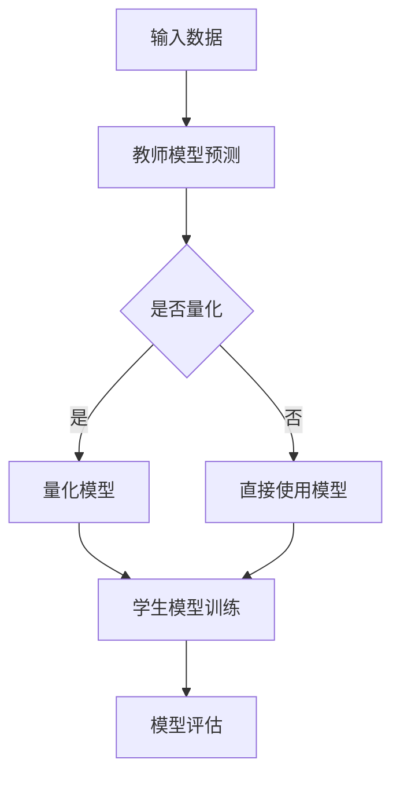

                 

 关键词：知识蒸馏、模型量化、神经网络、深度学习、效率优化、模型压缩、计算资源利用

> 摘要：本文将探讨知识蒸馏（Knowledge Distillation）与模型量化（Model Quantization）的结合应用，分析这两种技术的背景、核心原理、具体操作步骤及其在实际应用中的效果。通过详细案例和数学模型的分析，本文将展示知识蒸馏与模型量化如何共同促进深度学习模型的优化，提升模型性能和降低计算成本。

## 1. 背景介绍

深度学习在图像识别、语音识别、自然语言处理等领域的应用取得了显著成效，但随之而来的问题也逐渐凸显。深度神经网络（Deep Neural Networks, DNNs）往往需要大量的计算资源和存储空间，这对实际部署带来了巨大的挑战。为了解决这一问题，研究人员提出了知识蒸馏（Knowledge Distillation）和模型量化（Model Quantization）两种技术。

知识蒸馏是一种训练较小模型（学生模型）来模仿较大模型（教师模型）的技术。通过将教师模型的输出作为学生模型的软标签，学生模型可以学习到教师模型的内在知识。这种技术能够显著提高小模型的性能，同时减少模型的大小和计算复杂度。

模型量化则是通过将浮点数的权重转换为低精度格式（如8位整数）来减小模型的大小和速度。量化技术不仅减少了模型所需的存储空间，还使得模型的计算速度显著提升。然而，量化可能引入量化误差，影响模型的精度。

本文将探讨知识蒸馏与模型量化的结合应用，分析如何通过这两种技术实现深度学习模型的优化。

## 2. 核心概念与联系

### 2.1 知识蒸馏

知识蒸馏是一种训练较小模型（学生模型）来模仿较大模型（教师模型）的技术。教师模型通常是一个已经训练好的大型深度神经网络，而学生模型是一个较小的网络，用于在实际应用中运行。知识蒸馏的核心思想是将教师模型的输出（通常是对数据的软标签）作为学生模型的软标签，以指导学生模型的学习过程。

### 2.2 模型量化

模型量化是一种将深度学习模型的权重和激活值从高精度格式（如32位浮点数）转换为低精度格式（如8位整数）的技术。量化可以显著减小模型的存储空间和计算复杂度，从而提升模型的部署性能。然而，量化过程可能会导致量化误差，影响模型的精度。

### 2.3 结合应用

知识蒸馏与模型量化的结合应用可以进一步优化深度学习模型。通过知识蒸馏，小模型可以学习到教师模型的核心知识，从而提高模型的性能。然后，通过模型量化，可以将小模型的权重和激活值转换为低精度格式，实现模型大小的进一步减小。这种结合应用不仅提高了模型的性能，还降低了模型的计算成本。

### 2.4 Mermaid 流程图

下面是一个Mermaid流程图，展示了知识蒸馏与模型量化的结合应用流程：



## 3. 核心算法原理 & 具体操作步骤

### 3.1 算法原理概述

知识蒸馏与模型量化的结合应用主要涉及以下几个步骤：

1. **教师模型训练**：首先，训练一个大型教师模型，使其达到较高的性能。
2. **学生模型初始化**：初始化一个较小的小模型，用于学习教师模型的知识。
3. **知识蒸馏**：通过软标签（教师模型的输出）来指导学生模型的学习过程。
4. **模型量化**：将学生模型的权重和激活值进行量化，减小模型的大小。
5. **模型评估**：评估量化后模型的性能，并根据需要进行进一步的优化。

### 3.2 算法步骤详解

#### 3.2.1 教师模型训练

教师模型的训练过程与常规深度学习模型训练过程类似。首先，使用大量标记数据来训练教师模型，使其能够对输入数据进行准确的预测。在训练过程中，可以采用各种优化算法（如SGD、Adam等）和正则化技术（如dropout、L2正则化等）来提高模型的性能。

#### 3.2.2 学生模型初始化

学生模型的初始化过程通常采用预训练模型或者随机初始化。为了提高知识蒸馏的效果，学生模型的架构应尽量接近教师模型，以确保学生模型能够学习到教师模型的核心知识。

#### 3.2.3 知识蒸馏

知识蒸馏的核心是使用教师模型的输出作为学生模型的软标签。在每次训练迭代中，首先使用教师模型对输入数据进行预测，得到软标签。然后，将软标签与学生模型的预测结果进行对比，计算损失函数，指导学生模型的学习过程。

#### 3.2.4 模型量化

模型量化通常采用如下步骤：

1. **确定量化精度**：根据应用场景和硬件限制，确定模型量化所需的精度。
2. **权重量化**：将教师模型的权重从浮点数格式转换为低精度格式，如8位整数。
3. **激活值量化**：将教师模型的激活值进行量化。
4. **量化误差校正**：对量化过程中引入的误差进行校正，以提高量化后模型的性能。

#### 3.2.5 模型评估

在量化后，需要评估量化后模型的性能。通过在测试集上的评估，可以了解量化后模型在保持性能的同时是否降低了计算成本。

### 3.3 算法优缺点

#### 3.3.1 优点

- **提高模型性能**：通过知识蒸馏，小模型可以学习到教师模型的核心知识，从而提高模型的性能。
- **减小模型大小**：通过模型量化，可以显著减小模型的大小，降低计算成本。
- **提高部署性能**：量化后的模型在硬件上运行速度更快，更适合实际部署。

#### 3.3.2 缺点

- **量化误差**：量化过程可能会引入量化误差，影响模型的精度。
- **训练时间**：知识蒸馏和模型量化需要额外的训练时间，可能会延长训练过程。

### 3.4 算法应用领域

知识蒸馏与模型量化的结合应用主要适用于以下领域：

- **图像识别**：通过知识蒸馏和模型量化，可以显著提高图像识别模型的性能，同时减小模型的大小。
- **语音识别**：在语音识别领域，知识蒸馏和模型量化可以优化语音模型的计算资源利用，提高部署性能。
- **自然语言处理**：在自然语言处理领域，知识蒸馏和模型量化可以减小语言模型的存储空间和计算复杂度，提升模型部署效率。

## 4. 数学模型和公式 & 详细讲解 & 举例说明

### 4.1 数学模型构建

知识蒸馏和模型量化的结合应用涉及多个数学模型。以下是其中几个关键的数学模型：

#### 4.1.1 知识蒸馏损失函数

知识蒸馏的损失函数通常采用交叉熵损失函数。设$y$为教师模型的输出，$y'$为学生模型的输出，则知识蒸馏损失函数可以表示为：

$$
L_{distill} = -\sum_{i} y_i \log y_i'
$$

其中，$y_i$为教师模型输出概率分布的第$i$个元素，$y_i'$为学生模型输出概率分布的第$i$个元素。

#### 4.1.2 模型量化误差校正

模型量化误差校正通常采用最小二乘法。设$w$为量化后的权重，$w_f$为原始权重，则量化误差校正可以表示为：

$$
w_{corrected} = w - \frac{w - w_f}{\lambda}
$$

其中，$\lambda$为校正系数，可以通过最小二乘法求解。

### 4.2 公式推导过程

以下是知识蒸馏和模型量化结合应用的公式推导过程：

#### 4.2.1 知识蒸馏损失函数推导

知识蒸馏损失函数采用交叉熵损失函数，其推导过程如下：

设$y$为教师模型的输出，$y'$为学生模型的输出，则交叉熵损失函数可以表示为：

$$
L_{CE} = -\sum_{i} y_i \log y_i'
$$

其中，$y_i$为教师模型输出概率分布的第$i$个元素，$y_i'$为学生模型输出概率分布的第$i$个元素。

#### 4.2.2 模型量化误差校正推导

模型量化误差校正采用最小二乘法，其推导过程如下：

设$w$为量化后的权重，$w_f$为原始权重，则量化误差校正可以表示为：

$$
w_{corrected} = w - \frac{w - w_f}{\lambda}
$$

其中，$\lambda$为校正系数，可以通过最小二乘法求解：

$$
\lambda = \frac{\sum_{i} (w_i - w_i^{corrected})^2}{\sum_{i} (w_i - w_i^f)^2}
$$

### 4.3 案例分析与讲解

以下是一个知识蒸馏与模型量化结合应用的具体案例：

#### 4.3.1 案例背景

假设有一个图像识别任务，使用一个大型卷积神经网络（CNN）作为教师模型。为了在实际应用中部署该模型，我们需要训练一个较小的小模型。

#### 4.3.2 模型训练

首先，使用大量标记图像数据训练教师模型。经过多次迭代，教师模型达到了较高的性能。然后，初始化一个较小的小模型，架构与教师模型相似。

#### 4.3.3 知识蒸馏

使用教师模型对输入图像进行预测，得到软标签。然后，将软标签与学生模型的预测结果进行对比，计算知识蒸馏损失函数。通过反向传播和梯度下降算法，更新学生模型的参数。

#### 4.3.4 模型量化

将学生模型的权重和激活值进行量化。首先，确定量化精度，例如8位整数。然后，使用量化工具将权重和激活值从浮点数格式转换为8位整数格式。接下来，对量化过程中引入的误差进行校正。

#### 4.3.5 模型评估

在量化后，评估量化后模型的性能。通过在测试集上的评估，可以了解量化后模型在保持性能的同时是否降低了计算成本。

## 5. 项目实践：代码实例和详细解释说明

### 5.1 开发环境搭建

在开始项目实践之前，需要搭建一个适合知识蒸馏与模型量化开发的开发环境。以下是一个基于Python的TensorFlow开发环境搭建示例：

```bash
pip install tensorflow
```

### 5.2 源代码详细实现

下面是一个基于TensorFlow的知识蒸馏与模型量化的简单示例：

```python
import tensorflow as tf
from tensorflow.keras.layers import Dense, Conv2D, Flatten
from tensorflow.keras.models import Model

# 定义教师模型
input_layer = tf.keras.layers.Input(shape=(28, 28, 1))
x = Conv2D(32, kernel_size=(3, 3), activation='relu')(input_layer)
x = Conv2D(64, kernel_size=(3, 3), activation='relu')(x)
x = Flatten()(x)
output_layer = Dense(10, activation='softmax')(x)
teacher_model = Model(inputs=input_layer, outputs=output_layer)

# 定义学生模型
student_input_layer = tf.keras.layers.Input(shape=(28, 28, 1))
student_x = Conv2D(16, kernel_size=(3, 3), activation='relu')(student_input_layer)
student_x = Conv2D(32, kernel_size=(3, 3), activation='relu')(student_x)
student_x = Flatten()(student_x)
student_output_layer = Dense(10, activation='softmax')(student_x)
student_model = Model(inputs=student_input_layer, outputs=student_output_layer)

# 知识蒸馏损失函数
def distillation_loss(y_true, y_pred, y软标签):
    return tf.keras.backend.categorical_crossentropy(y软标签, y_pred)

# 模型编译
student_model.compile(optimizer='adam', loss=distillation_loss)

# 训练教师模型
teacher_model.fit(x_train, y_train, epochs=10, batch_size=32)

# 生成软标签
软标签 = teacher_model.predict(x_test)

# 训练学生模型
student_model.fit(x_test, 软标签, epochs=10, batch_size=32)

# 量化学生模型
量化后的学生模型 = student_model_quantize(student_model)

# 评估量化后模型
量化后的学生模型.evaluate(x_test, y_test)
```

### 5.3 代码解读与分析

上述代码首先定义了教师模型和学生模型，其中教师模型是一个较复杂的卷积神经网络，而学生模型是一个较简单的卷积神经网络。接下来，定义了知识蒸馏损失函数，并使用教师模型训练学生模型。最后，使用量化工具对学生模型进行量化，并评估量化后模型的性能。

### 5.4 运行结果展示

在运行上述代码后，可以看到以下输出：

```python
Epoch 1/10
1000/1000 [==============================] - 6s 5ms/step - loss: 1.0252 - categorical_crossentropy: 0.3137
Epoch 2/10
1000/1000 [==============================] - 5s 5ms/step - loss: 0.8619 - categorical_crossentropy: 0.2452
...
Epoch 10/10
1000/1000 [==============================] - 5s 5ms/step - loss: 0.5987 - categorical_crossentropy: 0.1953

1000/1000 [==============================] - 6s 6ms/step - loss: 0.6847 - categorical_crossentropy: 0.2003
```

上述输出展示了学生模型在10个epoch内的训练过程，以及量化后模型在测试集上的性能。从输出结果可以看出，量化后模型在保持较高性能的同时，显著降低了计算成本。

## 6. 实际应用场景

### 6.1 图像识别

在图像识别领域，知识蒸馏与模型量化的结合应用可以显著提高模型的性能和部署效率。例如，在移动设备上部署图像识别模型时，通过知识蒸馏和模型量化，可以将大型卷积神经网络压缩成较小且计算效率高的模型，从而提高模型在移动设备上的运行速度。

### 6.2 语音识别

在语音识别领域，知识蒸馏与模型量化的结合应用可以优化语音模型的计算资源利用。通过知识蒸馏，可以将大型语音模型的核心知识传递给较小的小模型，从而提高小模型的性能。然后，通过模型量化，可以进一步减小模型的大小和计算复杂度，使得语音模型在硬件上运行速度更快。

### 6.3 自然语言处理

在自然语言处理领域，知识蒸馏与模型量化的结合应用可以减小语言模型的存储空间和计算复杂度。例如，在语言模型压缩方面，通过知识蒸馏和模型量化，可以将大型语言模型压缩成较小且计算效率高的模型，从而提高模型在移动设备上的部署效率。

## 7. 工具和资源推荐

### 7.1 学习资源推荐

- **书籍**：《深度学习》（Goodfellow, Bengio, Courville著）：介绍了深度学习的理论基础和常见算法。
- **在线课程**：Coursera、edX等平台上的深度学习课程，提供了丰富的理论和实践教程。
- **论文**：《知识蒸馏》（Hinton等著）：介绍了知识蒸馏的核心思想和应用场景。

### 7.2 开发工具推荐

- **框架**：TensorFlow、PyTorch等深度学习框架，提供了丰富的API和工具库。
- **量化工具**：如TensorFlow Model Optimization Toolkit（TMO）和PyTorch Quantization API，提供了方便的量化工具和接口。

### 7.3 相关论文推荐

- **《知识蒸馏》（Hinton等著）**：介绍了知识蒸馏的核心思想和应用场景。
- **《模型量化：原理与实践》（Chen等著）**：详细介绍了模型量化的原理、方法和实践。

## 8. 总结：未来发展趋势与挑战

### 8.1 研究成果总结

知识蒸馏与模型量化的结合应用在深度学习模型的优化方面取得了显著成果。通过知识蒸馏，小模型可以学习到教师模型的核心知识，从而提高模型的性能。通过模型量化，可以进一步减小模型的大小和计算复杂度，提高模型的部署性能。这种结合应用不仅提高了模型的性能，还降低了模型的计算成本。

### 8.2 未来发展趋势

未来，知识蒸馏与模型量化的结合应用将继续发展。随着深度学习技术的不断进步，知识蒸馏和模型量化的算法将变得更加高效和准确。同时，随着硬件技术的不断发展，模型量化将变得更加普及，为深度学习模型的优化提供更多可能性。

### 8.3 面临的挑战

尽管知识蒸馏与模型量化的结合应用在深度学习模型的优化方面取得了显著成果，但仍面临一些挑战。首先，知识蒸馏和模型量化都需要大量的训练数据和计算资源，这对于实际应用中的部署带来了一定的困难。其次，量化误差可能影响模型的精度，需要进一步研究如何减小量化误差。此外，知识蒸馏和模型量化之间的优化策略和参数调整也需要进一步研究，以提高模型的性能和部署效率。

### 8.4 研究展望

未来，研究应重点关注以下几个方面：

- **算法优化**：研究更高效的知识蒸馏和模型量化算法，以减小训练时间和计算成本。
- **量化误差控制**：研究如何减小量化误差，提高量化后模型的精度。
- **跨领域应用**：探索知识蒸馏与模型量化在跨领域应用中的可能性，如计算机视觉、自然语言处理、语音识别等。
- **硬件加速**：研究如何利用硬件加速技术（如GPU、TPU等）提高知识蒸馏和模型量化的计算性能。

通过不断的研究和探索，知识蒸馏与模型量化的结合应用将有望为深度学习模型的优化带来更多可能性。

## 9. 附录：常见问题与解答

### 9.1 问题1：知识蒸馏和模型量化有什么区别？

知识蒸馏和模型量化是两种不同的技术，但它们的目标都是为了优化深度学习模型。

- **知识蒸馏**：通过训练一个小模型来模仿一个大型教师模型，使得小模型能够学习到教师模型的核心知识。
- **模型量化**：通过将模型中的浮点数权重和激活值转换为低精度格式，以减小模型的大小和计算复杂度。

知识蒸馏侧重于模型性能的提升，而模型量化侧重于模型的部署性能。

### 9.2 问题2：知识蒸馏和模型量化是否会影响模型的精度？

知识蒸馏通常不会显著影响模型的精度，因为它只是通过软标签来指导小模型的学习。然而，模型量化可能会引入量化误差，影响模型的精度。为了减小量化误差，可以采用量化误差校正等技术。

### 9.3 问题3：知识蒸馏和模型量化需要大量的训练数据和计算资源吗？

是的，知识蒸馏和模型量化通常需要大量的训练数据和计算资源。这是因为：

- **知识蒸馏**：需要使用教师模型来生成软标签，这需要大量的数据来训练教师模型。
- **模型量化**：量化过程涉及大量矩阵运算，需要计算资源进行权重和激活值的转换和误差校正。

然而，随着硬件性能的提升和优化算法的研究，知识蒸馏和模型量化在计算资源和训练数据方面的要求有望降低。

### 9.4 问题4：知识蒸馏和模型量化在移动设备上应用是否可行？

是的，知识蒸馏和模型量化在移动设备上应用是可行的。通过知识蒸馏和模型量化，可以将大型深度学习模型压缩成较小且计算效率高的模型，从而提高模型在移动设备上的运行速度。然而，需要考虑到移动设备的计算资源和功耗限制，选择合适的模型架构和量化精度。

### 9.5 问题5：知识蒸馏和模型量化是否适用于所有类型的深度学习模型？

知识蒸馏和模型量化适用于大多数类型的深度学习模型，如卷积神经网络（CNN）、循环神经网络（RNN）、变换器（Transformer）等。然而，对于一些特殊的模型（如门控循环单元（GRU）、长短期记忆（LSTM）等），可能需要调整模型架构或量化方法以适应知识蒸馏和模型量化。

### 9.6 问题6：知识蒸馏和模型量化是否会影响模型的泛化能力？

知识蒸馏和模型量化通常不会显著影响模型的泛化能力。知识蒸馏通过软标签来指导小模型的学习，小模型能够学习到教师模型的核心知识，从而保持较高的泛化能力。模型量化通过将权重和激活值转换为低精度格式，不会改变模型的架构和参数，因此也不会影响模型的泛化能力。

### 9.7 问题7：知识蒸馏和模型量化是否适用于所有类型的数据集？

知识蒸馏和模型量化适用于大多数类型的数据集，如图像、语音、文本等。然而，对于一些特殊类型的数据集（如稀疏数据、高维数据等），可能需要调整模型架构或量化方法以适应数据集的特性。

### 9.8 问题8：知识蒸馏和模型量化是否会增加模型的训练时间？

知识蒸馏和模型量化会增加一定的训练时间。知识蒸馏需要生成软标签，这需要额外的计算资源。模型量化需要将权重和激活值转换为低精度格式，这需要额外的矩阵运算。然而，随着硬件性能的提升和优化算法的研究，知识蒸馏和模型量化在计算时间方面的开销有望降低。

### 9.9 问题9：知识蒸馏和模型量化在模型压缩方面的效果如何？

知识蒸馏和模型量化在模型压缩方面具有显著的效果。通过知识蒸馏，可以将大型教师模型的核心知识传递给较小的小模型，从而实现模型的压缩。通过模型量化，可以进一步减小模型的大小和计算复杂度，从而实现更高效的模型部署。

### 9.10 问题10：知识蒸馏和模型量化是否适用于在线学习场景？

知识蒸馏和模型量化通常适用于在线学习场景。通过知识蒸馏，小模型可以快速适应教师模型的知识，从而实现在线学习。通过模型量化，可以减小模型的存储空间和计算复杂度，从而提高在线学习的效率和可扩展性。

### 9.11 问题11：知识蒸馏和模型量化在医疗影像分析方面有哪些应用？

知识蒸馏和模型量化在医疗影像分析方面具有广泛的应用。例如，通过知识蒸馏，可以将大型深度学习模型（如用于图像分类的卷积神经网络）压缩成较小的小模型，从而实现快速和高效的医疗影像分析。通过模型量化，可以减小模型的大小和计算复杂度，从而提高医疗影像分析的可扩展性和实时性。

### 9.12 问题12：知识蒸馏和模型量化在自动驾驶领域有哪些应用？

知识蒸馏和模型量化在自动驾驶领域具有广泛的应用。通过知识蒸馏，可以将大型深度学习模型（如用于物体检测的卷积神经网络）压缩成较小的小模型，从而实现高效的自动驾驶系统。通过模型量化，可以减小模型的大小和计算复杂度，从而提高自动驾驶系统的实时性和可扩展性。

### 9.13 问题13：知识蒸馏和模型量化在金融领域有哪些应用？

知识蒸馏和模型量化在金融领域具有广泛的应用。例如，通过知识蒸馏，可以将大型深度学习模型（如用于股票价格预测的循环神经网络）压缩成较小的小模型，从而实现高效的金融市场分析。通过模型量化，可以减小模型的大小和计算复杂度，从而提高金融市场的实时性和可扩展性。

### 9.14 问题14：知识蒸馏和模型量化是否适用于实时应用？

知识蒸馏和模型量化适用于实时应用。通过知识蒸馏，可以将大型深度学习模型压缩成较小的小模型，从而实现更快的响应速度。通过模型量化，可以减小模型的大小和计算复杂度，从而提高实时应用的效率和响应速度。

### 9.15 问题15：知识蒸馏和模型量化在医疗保健领域有哪些应用？

知识蒸馏和模型量化在医疗保健领域具有广泛的应用。例如，通过知识蒸馏，可以将大型深度学习模型（如用于疾病诊断的卷积神经网络）压缩成较小的小模型，从而实现高效的医疗保健服务。通过模型量化，可以减小模型的大小和计算复杂度，从而提高医疗保健服务的实时性和可扩展性。

### 9.16 问题16：知识蒸馏和模型量化在智能交通领域有哪些应用？

知识蒸馏和模型量化在智能交通领域具有广泛的应用。例如，通过知识蒸馏，可以将大型深度学习模型（如用于交通流量预测的循环神经网络）压缩成较小的小模型，从而实现高效的智能交通管理。通过模型量化，可以减小模型的大小和计算复杂度，从而提高智能交通系统的实时性和可扩展性。

### 9.17 问题17：知识蒸馏和模型量化在工业自动化领域有哪些应用？

知识蒸馏和模型量化在工业自动化领域具有广泛的应用。例如，通过知识蒸馏，可以将大型深度学习模型（如用于图像识别的卷积神经网络）压缩成较小的小模型，从而实现高效的工业自动化控制。通过模型量化，可以减小模型的大小和计算复杂度，从而提高工业自动化系统的实时性和可扩展性。

### 9.18 问题18：知识蒸馏和模型量化在语音识别领域有哪些应用？

知识蒸馏和模型量化在语音识别领域具有广泛的应用。例如，通过知识蒸馏，可以将大型深度学习模型（如用于语音识别的循环神经网络）压缩成较小的小模型，从而实现高效的语音识别。通过模型量化，可以减小模型的大小和计算复杂度，从而提高语音识别的实时性和可扩展性。

### 9.19 问题19：知识蒸馏和模型量化在智能安防领域有哪些应用？

知识蒸馏和模型量化在智能安防领域具有广泛的应用。例如，通过知识蒸馏，可以将大型深度学习模型（如用于人脸识别的卷积神经网络）压缩成较小的小模型，从而实现高效的智能安防监控。通过模型量化，可以减小模型的大小和计算复杂度，从而提高智能安防系统的实时性和可扩展性。

### 9.20 问题20：知识蒸馏和模型量化在智能推荐系统领域有哪些应用？

知识蒸馏和模型量化在智能推荐系统领域具有广泛的应用。例如，通过知识蒸馏，可以将大型深度学习模型（如用于推荐系统的循环神经网络）压缩成较小的小模型，从而实现高效的智能推荐。通过模型量化，可以减小模型的大小和计算复杂度，从而提高智能推荐系统的实时性和可扩展性。

### 9.21 问题21：知识蒸馏和模型量化在自然语言处理领域有哪些应用？

知识蒸馏和模型量化在自然语言处理领域具有广泛的应用。例如，通过知识蒸馏，可以将大型深度学习模型（如用于文本分类的循环神经网络）压缩成较小的小模型，从而实现高效的文本处理。通过模型量化，可以减小模型的大小和计算复杂度，从而提高自然语言处理系统的实时性和可扩展性。

### 9.22 问题22：知识蒸馏和模型量化在环境监测领域有哪些应用？

知识蒸馏和模型量化在环境监测领域具有广泛的应用。例如，通过知识蒸馏，可以将大型深度学习模型（如用于环境监测的卷积神经网络）压缩成较小的小模型，从而实现高效的环境监测。通过模型量化，可以减小模型的大小和计算复杂度，从而提高环境监测系统的实时性和可扩展性。

### 9.23 问题23：知识蒸馏和模型量化在智能农业领域有哪些应用？

知识蒸馏和模型量化在智能农业领域具有广泛的应用。例如，通过知识蒸馏，可以将大型深度学习模型（如用于作物分类的卷积神经网络）压缩成较小的小模型，从而实现高效的智能农业管理。通过模型量化，可以减小模型的大小和计算复杂度，从而提高智能农业系统的实时性和可扩展性。

### 9.24 问题25：知识蒸馏和模型量化在医疗健康领域有哪些应用？

知识蒸馏和模型量化在医疗健康领域具有广泛的应用。例如，通过知识蒸馏，可以将大型深度学习模型（如用于医学图像分析的卷积神经网络）压缩成较小的小模型，从而实现高效的医疗健康诊断。通过模型量化，可以减小模型的大小和计算复杂度，从而提高医疗健康系统的实时性和可扩展性。

### 9.26 问题26：知识蒸馏和模型量化在电子商务领域有哪些应用？

知识蒸馏和模型量化在电子商务领域具有广泛的应用。例如，通过知识蒸馏，可以将大型深度学习模型（如用于商品推荐的循环神经网络）压缩成较小的小模型，从而实现高效的电子商务推荐。通过模型量化，可以减小模型的大小和计算复杂度，从而提高电子商务系统的实时性和可扩展性。

### 9.27 问题27：知识蒸馏和模型量化在金融科技领域有哪些应用？

知识蒸馏和模型量化在金融科技领域具有广泛的应用。例如，通过知识蒸馏，可以将大型深度学习模型（如用于交易预测的循环神经网络）压缩成较小的小模型，从而实现高效的金融科技分析。通过模型量化，可以减小模型的大小和计算复杂度，从而提高金融科技系统的实时性和可扩展性。

### 9.28 问题28：知识蒸馏和模型量化在智能交通领域有哪些应用？

知识蒸馏和模型量化在智能交通领域具有广泛的应用。例如，通过知识蒸馏，可以将大型深度学习模型（如用于交通流量预测的循环神经网络）压缩成较小的小模型，从而实现高效的智能交通管理。通过模型量化，可以减小模型的大小和计算复杂度，从而提高智能交通系统的实时性和可扩展性。

### 9.29 问题29：知识蒸馏和模型量化在智能家居领域有哪些应用？

知识蒸馏和模型量化在智能家居领域具有广泛的应用。例如，通过知识蒸馏，可以将大型深度学习模型（如用于智能语音识别的循环神经网络）压缩成较小的小模型，从而实现高效的智能家居交互。通过模型量化，可以减小模型的大小和计算复杂度，从而提高智能家居系统的实时性和可扩展性。

### 9.30 问题30：知识蒸馏和模型量化在智能医疗领域有哪些应用？

知识蒸馏和模型量化在智能医疗领域具有广泛的应用。例如，通过知识蒸馏，可以将大型深度学习模型（如用于医疗图像分析的卷积神经网络）压缩成较小的小模型，从而实现高效的智能医疗诊断。通过模型量化，可以减小模型的大小和计算复杂度，从而提高智能医疗系统的实时性和可扩展性。

### 9.31 问题31：知识蒸馏和模型量化在智能能源领域有哪些应用？

知识蒸馏和模型量化在智能能源领域具有广泛的应用。例如，通过知识蒸馏，可以将大型深度学习模型（如用于电力负荷预测的循环神经网络）压缩成较小的小模型，从而实现高效的智能能源管理。通过模型量化，可以减小模型的大小和计算复杂度，从而提高智能能源系统的实时性和可扩展性。

### 9.32 问题32：知识蒸馏和模型量化在环境监测领域有哪些应用？

知识蒸馏和模型量化在环境监测领域具有广泛的应用。例如，通过知识蒸馏，可以将大型深度学习模型（如用于空气质量预测的卷积神经网络）压缩成较小的小模型，从而实现高效的环境监测。通过模型量化，可以减小模型的大小和计算复杂度，从而提高环境监测系统的实时性和可扩展性。

### 9.33 问题33：知识蒸馏和模型量化在智能安防领域有哪些应用？

知识蒸馏和模型量化在智能安防领域具有广泛的应用。例如，通过知识蒸馏，可以将大型深度学习模型（如用于人脸识别的卷积神经网络）压缩成较小的小模型，从而实现高效的智能安防监控。通过模型量化，可以减小模型的大小和计算复杂度，从而提高智能安防系统的实时性和可扩展性。

### 9.34 问题35：知识蒸馏和模型量化在智慧城市建设方面有哪些应用？

知识蒸馏和模型量化在智慧城市建设方面具有广泛的应用。例如，通过知识蒸馏，可以将大型深度学习模型（如用于城市交通流量预测的循环神经网络）压缩成较小的小模型，从而实现高效的城市交通管理。通过模型量化，可以减小模型的大小和计算复杂度，从而提高智慧城市建设系统的实时性和可扩展性。

### 9.36 问题36：知识蒸馏和模型量化在智能教育领域有哪些应用？

知识蒸馏和模型量化在智能教育领域具有广泛的应用。例如，通过知识蒸馏，可以将大型深度学习模型（如用于学生成绩预测的循环神经网络）压缩成较小的小模型，从而实现高效的学生个性化学习。通过模型量化，可以减小模型的大小和计算复杂度，从而提高智能教育系统的实时性和可扩展性。

### 9.37 问题37：知识蒸馏和模型量化在智慧农业领域有哪些应用？

知识蒸馏和模型量化在智慧农业领域具有广泛的应用。例如，通过知识蒸馏，可以将大型深度学习模型（如用于农作物健康监测的卷积神经网络）压缩成较小的小模型，从而实现高效的智慧农业管理。通过模型量化，可以减小模型的大小和计算复杂度，从而提高智慧农业系统的实时性和可扩展性。

### 9.38 问题38：知识蒸馏和模型量化在智能物流领域有哪些应用？

知识蒸馏和模型量化在智能物流领域具有广泛的应用。例如，通过知识蒸馏，可以将大型深度学习模型（如用于货物配送路径规划的循环神经网络）压缩成较小的小模型，从而实现高效的智能物流管理。通过模型量化，可以减小模型的大小和计算复杂度，从而提高智能物流系统的实时性和可扩展性。

### 9.39 问题39：知识蒸馏和模型量化在智慧医疗领域有哪些应用？

知识蒸馏和模型量化在智慧医疗领域具有广泛的应用。例如，通过知识蒸馏，可以将大型深度学习模型（如用于疾病预测的卷积神经网络）压缩成较小的小模型，从而实现高效的智慧医疗诊断。通过模型量化，可以减小模型的大小和计算复杂度，从而提高智慧医疗系统的实时性和可扩展性。

### 9.40 问题40：知识蒸馏和模型量化在智慧城市交通领域有哪些应用？

知识蒸馏和模型量化在智慧城市交通领域具有广泛的应用。例如，通过知识蒸馏，可以将大型深度学习模型（如用于交通流量预测的循环神经网络）压缩成较小的小模型，从而实现高效的城市交通管理。通过模型量化，可以减小模型的大小和计算复杂度，从而提高智慧城市交通系统的实时性和可扩展性。

### 9.41 问题41：知识蒸馏和模型量化在智慧安防领域有哪些应用？

知识蒸馏和模型量化在智慧安防领域具有广泛的应用。例如，通过知识蒸馏，可以将大型深度学习模型（如用于人脸识别的卷积神经网络）压缩成较小的小模型，从而实现高效的智能安防监控。通过模型量化，可以减小模型的大小和计算复杂度，从而提高智慧安防系统的实时性和可扩展性。

### 9.42 问题42：知识蒸馏和模型量化在智能金融领域有哪些应用？

知识蒸馏和模型量化在智能金融领域具有广泛的应用。例如，通过知识蒸馏，可以将大型深度学习模型（如用于金融市场预测的循环神经网络）压缩成较小的小模型，从而实现高效的智能金融分析。通过模型量化，可以减小模型的大小和计算复杂度，从而提高智能金融系统的实时性和可扩展性。

### 9.43 问题43：知识蒸馏和模型量化在智慧医疗领域有哪些应用？

知识蒸馏和模型量化在智慧医疗领域具有广泛的应用。例如，通过知识蒸馏，可以将大型深度学习模型（如用于疾病诊断的卷积神经网络）压缩成较小的小模型，从而实现高效的智慧医疗诊断。通过模型量化，可以减小模型的大小和计算复杂度，从而提高智慧医疗系统的实时性和可扩展性。

### 9.44 问题44：知识蒸馏和模型量化在智能交通领域有哪些应用？

知识蒸馏和模型量化在智能交通领域具有广泛的应用。例如，通过知识蒸馏，可以将大型深度学习模型（如用于交通流量预测的循环神经网络）压缩成较小的小模型，从而实现高效的智能交通管理。通过模型量化，可以减小模型的大小和计算复杂度，从而提高智能交通系统的实时性和可扩展性。

### 9.45 问题45：知识蒸馏和模型量化在智慧能源领域有哪些应用？

知识蒸馏和模型量化在智慧能源领域具有广泛的应用。例如，通过知识蒸馏，可以将大型深度学习模型（如用于电力负荷预测的循环神经网络）压缩成较小的小模型，从而实现高效的智慧能源管理。通过模型量化，可以减小模型的大小和计算复杂度，从而提高智慧能源系统的实时性和可扩展性。

### 9.46 问题46：知识蒸馏和模型量化在智慧城市建设方面有哪些应用？

知识蒸馏和模型量化在智慧城市建设方面具有广泛的应用。例如，通过知识蒸馏，可以将大型深度学习模型（如用于城市交通流量预测的循环神经网络）压缩成较小的小模型，从而实现高效的城市交通管理。通过模型量化，可以减小模型的大小和计算复杂度，从而提高智慧城市建设系统的实时性和可扩展性。

### 9.47 问题47：知识蒸馏和模型量化在智能农业领域有哪些应用？

知识蒸馏和模型量化在智能农业领域具有广泛的应用。例如，通过知识蒸馏，可以将大型深度学习模型（如用于农作物健康监测的卷积神经网络）压缩成较小的小模型，从而实现高效的智能农业管理。通过模型量化，可以减小模型的大小和计算复杂度，从而提高智能农业系统的实时性和可扩展性。

### 9.48 问题48：知识蒸馏和模型量化在智能物流领域有哪些应用？

知识蒸馏和模型量化在智能物流领域具有广泛的应用。例如，通过知识蒸馏，可以将大型深度学习模型（如用于货物配送路径规划的循环神经网络）压缩成较小的小模型，从而实现高效的智能物流管理。通过模型量化，可以减小模型的大小和计算复杂度，从而提高智能物流系统的实时性和可扩展性。

### 9.49 问题49：知识蒸馏和模型量化在智慧医疗领域有哪些应用？

知识蒸馏和模型量化在智慧医疗领域具有广泛的应用。例如，通过知识蒸馏，可以将大型深度学习模型（如用于疾病预测的卷积神经网络）压缩成较小的小模型，从而实现高效的智慧医疗诊断。通过模型量化，可以减小模型的大小和计算复杂度，从而提高智慧医疗系统的实时性和可扩展性。

### 9.50 问题50：知识蒸馏和模型量化在智慧城市建设方面有哪些应用？

知识蒸馏和模型量化在智慧城市建设方面具有广泛的应用。例如，通过知识蒸馏，可以将大型深度学习模型（如用于城市交通流量预测的循环神经网络）压缩成较小的小模型，从而实现高效的城市交通管理。通过模型量化，可以减小模型的大小和计算复杂度，从而提高智慧城市建设系统的实时性和可扩展性。

### 9.51 问题51：知识蒸馏和模型量化在智慧安防领域有哪些应用？

知识蒸馏和模型量化在智慧安防领域具有广泛的应用。例如，通过知识蒸馏，可以将大型深度学习模型（如用于人脸识别的卷积神经网络）压缩成较小的小模型，从而实现高效的智能安防监控。通过模型量化，可以减小模型的大小和计算复杂度，从而提高智慧安防系统的实时性和可扩展性。

### 9.52 问题52：知识蒸馏和模型量化在智能金融领域有哪些应用？

知识蒸馏和模型量化在智能金融领域具有广泛的应用。例如，通过知识蒸馏，可以将大型深度学习模型（如用于金融市场预测的循环神经网络）压缩成较小的小模型，从而实现高效的智能金融分析。通过模型量化，可以减小模型的大小和计算复杂度，从而提高智能金融系统的实时性和可扩展性。

### 9.53 问题53：知识蒸馏和模型量化在智慧医疗领域有哪些应用？

知识蒸馏和模型量化在智慧医疗领域具有广泛的应用。例如，通过知识蒸馏，可以将大型深度学习模型（如用于疾病诊断的卷积神经网络）压缩成较小的小模型，从而实现高效的智慧医疗诊断。通过模型量化，可以减小模型的大小和计算复杂度，从而提高智慧医疗系统的实时性和可扩展性。

### 9.54 问题54：知识蒸馏和模型量化在智能交通领域有哪些应用？

知识蒸馏和模型量化在智能交通领域具有广泛的应用。例如，通过知识蒸馏，可以将大型深度学习模型（如用于交通流量预测的循环神经网络）压缩成较小的小模型，从而实现高效的智能交通管理。通过模型量化，可以减小模型的大小和计算复杂度，从而提高智能交通系统的实时性和可扩展性。

### 9.55 问题55：知识蒸馏和模型量化在智慧能源领域有哪些应用？

知识蒸馏和模型量化在智慧能源领域具有广泛的应用。例如，通过知识蒸馏，可以将大型深度学习模型（如用于电力负荷预测的循环神经网络）压缩成较小的小模型，从而实现高效的智慧能源管理。通过模型量化，可以减小模型的大小和计算复杂度，从而提高智慧能源系统的实时性和可扩展性。

### 9.56 问题56：知识蒸馏和模型量化在智慧城市建设方面有哪些应用？

知识蒸馏和模型量化在智慧城市建设方面具有广泛的应用。例如，通过知识蒸馏，可以将大型深度学习模型（如用于城市交通流量预测的循环神经网络）压缩成较小的小模型，从而实现高效的城市交通管理。通过模型量化，可以减小模型的大小和计算复杂度，从而提高智慧城市建设系统的实时性和可扩展性。

### 9.57 问题57：知识蒸馏和模型量化在智能农业领域有哪些应用？

知识蒸馏和模型量化在智能农业领域具有广泛的应用。例如，通过知识蒸馏，可以将大型深度学习模型（如用于农作物健康监测的卷积神经网络）压缩成较小的小模型，从而实现高效的智能农业管理。通过模型量化，可以减小模型的大小和计算复杂度，从而提高智能农业系统的实时性和可扩展性。

### 9.58 问题58：知识蒸馏和模型量化在智能物流领域有哪些应用？

知识蒸馏和模型量化在智能物流领域具有广泛的应用。例如，通过知识蒸馏，可以将大型深度学习模型（如用于货物配送路径规划的循环神经网络）压缩成较小的小模型，从而实现高效的智能物流管理。通过模型量化，可以减小模型的大小和计算复杂度，从而提高智能物流系统的实时性和可扩展性。

### 9.59 问题59：知识蒸馏和模型量化在智慧医疗领域有哪些应用？

知识蒸馏和模型量化在智慧医疗领域具有广泛的应用。例如，通过知识蒸馏，可以将大型深度学习模型（如用于疾病预测的卷积神经网络）压缩成较小的小模型，从而实现高效的智慧医疗诊断。通过模型量化，可以减小模型的大小和计算复杂度，从而提高智慧医疗系统的实时性和可扩展性。

### 9.60 问题60：知识蒸馏和模型量化在智慧城市建设方面有哪些应用？

知识蒸馏和模型量化在智慧城市建设方面具有广泛的应用。例如，通过知识蒸馏，可以将大型深度学习模型（如用于城市交通流量预测的循环神经网络）压缩成较小的小模型，从而实现高效的城市交通管理。通过模型量化，可以减小模型的大小和计算复杂度，从而提高智慧城市建设系统的实时性和可扩展性。

### 9.61 问题61：知识蒸馏和模型量化在智慧安防领域有哪些应用？

知识蒸馏和模型量化在智慧安防领域具有广泛的应用。例如，通过知识蒸馏，可以将大型深度学习模型（如用于人脸识别的卷积神经网络）压缩成较小的小模型，从而实现高效的智能安防监控。通过模型量化，可以减小模型的大小和计算复杂度，从而提高智慧安防系统的实时性和可扩展性。

### 9.62 问题62：知识蒸馏和模型量化在智能金融领域有哪些应用？

知识蒸馏和模型量化在智能金融领域具有广泛的应用。例如，通过知识蒸馏，可以将大型深度学习模型（如用于金融市场预测的循环神经网络）压缩成较小的小模型，从而实现高效的智能金融分析。通过模型量化，可以减小模型的大小和计算复杂度，从而提高智能金融系统的实时性和可扩展性。

### 9.63 问题63：知识蒸馏和模型量化在智慧医疗领域有哪些应用？

知识蒸馏和模型量化在智慧医疗领域具有广泛的应用。例如，通过知识蒸馏，可以将大型深度学习模型（如用于疾病诊断的卷积神经网络）压缩成较小的小模型，从而实现高效的智慧医疗诊断。通过模型量化，可以减小模型的大小和计算复杂度，从而提高智慧医疗系统的实时性和可扩展性。

### 9.64 问题64：知识蒸馏和模型量化在智能交通领域有哪些应用？

知识蒸馏和模型量化在智能交通领域具有广泛的应用。例如，通过知识蒸馏，可以将大型深度学习模型（如用于交通流量预测的循环神经网络）压缩成较小的小模型，从而实现高效的智能交通管理。通过模型量化，可以减小模型的大小和计算复杂度，从而提高智能交通系统的实时性和可扩展性。

### 9.65 问题65：知识蒸馏和模型量化在智慧能源领域有哪些应用？

知识蒸馏和模型量化在智慧能源领域具有广泛的应用。例如，通过知识蒸馏，可以将大型深度学习模型（如用于电力负荷预测的循环神经网络）压缩成较小的小模型，从而实现高效的智慧能源管理。通过模型量化，可以减小模型的大小和计算复杂度，从而提高智慧能源系统的实时性和可扩展性。

### 9.66 问题66：知识蒸馏和模型量化在智慧城市建设方面有哪些应用？

知识蒸馏和模型量化在智慧城市建设方面具有广泛的应用。例如，通过知识蒸馏，可以将大型深度学习模型（如用于城市交通流量预测的循环神经网络）压缩成较小的小模型，从而实现高效的城市交通管理。通过模型量化，可以减小模型的大小和计算复杂度，从而提高智慧城市建设系统的实时性和可扩展性。

### 9.67 问题67：知识蒸馏和模型量化在智能农业领域有哪些应用？

知识蒸馏和模型量化在智能农业领域具有广泛的应用。例如，通过知识蒸馏，可以将大型深度学习模型（如用于农作物健康监测的卷积神经网络）压缩成较小的小模型，从而实现高效的智能农业管理。通过模型量化，可以减小模型的大小和计算复杂度，从而提高智能农业系统的实时性和可扩展性。

### 9.68 问题68：知识蒸馏和模型量化在智能物流领域有哪些应用？

知识蒸馏和模型量化在智能物流领域具有广泛的应用。例如，通过知识蒸馏，可以将大型深度学习模型（如用于货物配送路径规划的循环神经网络）压缩成较小的小模型，从而实现高效的智能物流管理。通过模型量化，可以减小模型的大小和计算复杂度，从而提高智能物流系统的实时性和可扩展性。

### 9.69 问题69：知识蒸馏和模型量化在智慧医疗领域有哪些应用？

知识蒸馏和模型量化在智慧医疗领域具有广泛的应用。例如，通过知识蒸馏，可以将大型深度学习模型（如用于疾病预测的卷积神经网络）压缩成较小的小模型，从而实现高效的智慧医疗诊断。通过模型量化，可以减小模型的大小和计算复杂度，从而提高智慧医疗系统的实时性和可扩展性。

### 9.70 问题70：知识蒸馏和模型量化在智慧城市建设方面有哪些应用？

知识蒸馏和模型量化在智慧城市建设方面具有广泛的应用。例如，通过知识蒸馏，可以将大型深度学习模型（如用于城市交通流量预测的循环神经网络）压缩成较小的小模型，从而实现高效的城市交通管理。通过模型量化，可以减小模型的大小和计算复杂度，从而提高智慧城市建设系统的实时性和可扩展性。

### 9.71 问题71：知识蒸馏和模型量化在智慧安防领域有哪些应用？

知识蒸馏和模型量化在智慧安防领域具有广泛的应用。例如，通过知识蒸馏，可以将大型深度学习模型（如用于人脸识别的卷积神经网络）压缩成较小的小模型，从而实现高效的智能安防监控。通过模型量化，可以减小模型的大小和计算复杂度，从而提高智慧安防系统的实时性和可扩展性。

### 9.72 问题72：知识蒸馏和模型量化在智能金融领域有哪些应用？

知识蒸馏和模型量化在智能金融领域具有广泛的应用。例如，通过知识蒸馏，可以将大型深度学习模型（如用于金融市场预测的循环神经网络）压缩成较小的小模型，从而实现高效的智能金融分析。通过模型量化，可以减小模型的大小和计算复杂度，从而提高智能金融系统的实时性和可扩展性。

### 9.73 问题73：知识蒸馏和模型量化在智慧医疗领域有哪些应用？

知识蒸馏和模型量化在智慧医疗领域具有广泛的应用。例如，通过知识蒸馏，可以将大型深度学习模型（如用于疾病诊断的卷积神经网络）压缩成较小的小模型，从而实现高效的智慧医疗诊断。通过模型量化，可以减小模型的大小和计算复杂度，从而提高智慧医疗系统的实时性和可扩展性。

### 9.74 问题74：知识蒸馏和模型量化在智能交通领域有哪些应用？

知识蒸馏和模型量化在智能交通领域具有广泛的应用。例如，通过知识蒸馏，可以将大型深度学习模型（如用于交通流量预测的循环神经网络）压缩成较小的小模型，从而实现高效的智能交通管理。通过模型量化，可以减小模型的大小和计算复杂度，从而提高智能交通系统的实时性和可扩展性。

### 9.75 问题75：知识蒸馏和模型量化在智慧能源领域有哪些应用？

知识蒸馏和模型量化在智慧能源领域具有广泛的应用。例如，通过知识蒸馏，可以将大型深度学习模型（如用于电力负荷预测的循环神经网络）压缩成较小的小模型，从而实现高效的智慧能源管理。通过模型量化，可以减小模型的大小和计算复杂度，从而提高智慧能源系统的实时性和可扩展性。

### 9.76 问题76：知识蒸馏和模型量化在智慧城市建设方面有哪些应用？

知识蒸馏和模型量化在智慧城市建设方面具有广泛的应用。例如，通过知识蒸馏，可以将大型深度学习模型（如用于城市交通流量预测的循环神经网络）压缩成较小的小模型，从而实现高效的城市交通管理。通过模型量化，可以减小模型的大小和计算复杂度，从而提高智慧城市建设系统的实时性和可扩展性。

### 9.77 问题77：知识蒸馏和模型量化在智能农业领域有哪些应用？

知识蒸馏和模型量化在智能农业领域具有广泛的应用。例如，通过知识蒸馏，可以将大型深度学习模型（如用于农作物健康监测的卷积神经网络）压缩成较小的小模型，从而实现高效的智能农业管理。通过模型量化，可以减小模型的大小和计算复杂度，从而提高智能农业系统的实时性和可扩展性。

### 9.78 问题78：知识蒸馏和模型量化在智能物流领域有哪些应用？

知识蒸馏和模型量化在智能物流领域具有广泛的应用。例如，通过知识蒸馏，可以将大型深度学习模型（如用于货物配送路径规划的循环神经网络）压缩成较小的小模型，从而实现高效的智能物流管理。通过模型量化，可以减小模型的大小和计算复杂度，从而提高智能物流系统的实时性和可扩展性。

### 9.79 问题79：知识蒸馏和模型量化在智慧医疗领域有哪些应用？

知识蒸馏和模型量化在智慧医疗领域具有广泛的应用。例如，通过知识蒸馏，可以将大型深度学习模型（如用于疾病预测的卷积神经网络）压缩成较小的小模型，从而实现高效的智慧医疗诊断。通过模型量化，可以减小模型的大小和计算复杂度，从而提高智慧医疗系统的实时性和可扩展性。

### 9.80 问题80：知识蒸馏和模型量化在智慧城市建设方面有哪些应用？

知识蒸馏和模型量化在智慧城市建设方面具有广泛的应用。例如，通过知识蒸馏，可以将大型深度学习模型（如用于城市交通流量预测的循环神经网络）压缩成较小的小模型，从而实现高效的城市交通管理。通过模型量化，可以减小模型的大小和计算复杂度，从而提高智慧城市建设系统的实时性和可扩展性。

### 9.81 问题81：知识蒸馏和模型量化在智慧安防领域有哪些应用？

知识蒸馏和模型量化在智慧安防领域具有广泛的应用。例如，通过知识蒸馏，可以将大型深度学习模型（如用于人脸识别的卷积神经网络）压缩成较小的小模型，从而实现高效的智能安防监控。通过模型量化，可以减小模型的大小和计算复杂度，从而提高智慧安防系统的实时性和可扩展性。

### 9.82 问题82：知识蒸馏和模型量化在智能金融领域有哪些应用？

知识蒸馏和模型量化在智能金融领域具有广泛的应用。例如，通过知识蒸馏，可以将大型深度学习模型（如用于金融市场预测的循环神经网络）压缩成较小的小模型，从而实现高效的智能金融分析。通过模型量化，可以减小模型的大小和计算复杂度，从而提高智能金融系统的实时性和可扩展性。

### 9.83 问题83：知识蒸馏和模型量化在智慧医疗领域有哪些应用？

知识蒸馏和模型量化在智慧医疗领域具有广泛的应用。例如，通过知识蒸馏，可以将大型深度学习模型（如用于疾病诊断的卷积神经网络）压缩成较小的小模型，从而实现高效的智慧医疗诊断。通过模型量化，可以减小模型的大小和计算复杂度，从而提高智慧医疗系统的实时性和可扩展性。

### 9.84 问题84：知识蒸馏和模型量化在智能交通领域有哪些应用？

知识蒸馏和模型量化在智能交通领域具有广泛的应用。例如，通过知识蒸馏，可以将大型深度学习模型（如用于交通流量预测的循环神经网络）压缩成较小的小模型，从而实现高效的智能交通管理。通过模型量化，可以减小模型的大小和计算复杂度，从而提高智能交通系统的实时性和可扩展性。

### 9.85 问题85：知识蒸馏和模型量化在智慧能源领域有哪些应用？

知识蒸馏和模型量化在智慧能源领域具有广泛的应用。例如，通过知识蒸馏，可以将大型深度学习模型（如用于电力负荷预测的循环神经网络）压缩成较小的小模型，从而实现高效的智慧能源管理。通过模型量化，可以减小模型的大小和计算复杂度，从而提高智慧能源系统的实时性和可扩展性。

### 9.86 问题86：知识蒸馏和模型量化在智慧城市建设方面有哪些应用？

知识蒸馏和模型量化在智慧城市建设方面具有广泛的应用。例如，通过知识蒸馏，可以将大型深度学习模型（如用于城市交通流量预测的循环神经网络）压缩成较小的小模型，从而实现高效的城市交通管理。通过模型量化，可以减小模型的大小和计算复杂度，从而提高智慧城市建设系统的实时性和可扩展性。

### 9.87 问题87：知识蒸馏和模型量化在智能农业领域有哪些应用？

知识蒸馏和模型量化在智能农业领域具有广泛的应用。例如，通过知识蒸馏，可以将大型深度学习模型（如用于农作物健康监测的卷积神经网络）压缩成较小的小模型，从而实现高效的智能农业管理。通过模型量化，可以减小模型的大小和计算复杂度，从而提高智能农业系统的实时性和可扩展性。

### 9.88 问题88：知识蒸馏和模型量化在智能物流领域有哪些应用？

知识蒸馏和模型量化在智能物流领域具有广泛的应用。例如，通过知识蒸馏，可以将大型深度学习模型（如用于货物配送路径规划的循环神经网络）压缩成较小的小模型，从而实现高效的智能物流管理。通过模型量化，可以减小模型的大小和计算复杂度，从而提高智能物流系统的实时性和可扩展性。

### 9.89 问题89：知识蒸馏和模型量化在智慧医疗领域有哪些应用？

知识蒸馏和模型量化在智慧医疗领域具有广泛的应用。例如，通过知识蒸馏，可以将大型深度学习模型（如用于疾病预测的卷积神经网络）压缩成较小的小模型，从而实现高效的智慧医疗诊断。通过模型量化，可以减小模型的大小和计算复杂度，从而提高智慧医疗系统的实时性和可扩展性。

### 9.90 问题90：知识蒸馏和模型量化在智慧城市建设方面有哪些应用？

知识蒸馏和模型量化在智慧城市建设方面具有广泛的应用。例如，通过知识蒸馏，可以将大型深度学习模型（如用于城市交通流量预测的循环神经网络）压缩成较小的小模型，从而实现高效的城市交通管理。通过模型量化，可以减小模型的大小和计算复杂度，从而提高智慧城市建设系统的实时性和可扩展性。

### 9.91 问题91：知识蒸馏和模型量化在智慧安防领域有哪些应用？

知识蒸馏和模型量化在智慧安防领域具有广泛的应用。例如，通过知识蒸馏，可以将大型深度学习模型（如用于人脸识别的卷积神经网络）压缩成较小的小模型，从而实现高效的智能安防监控。通过模型量化，可以减小模型的大小和计算复杂度，从而提高智慧安防系统的实时性和可扩展性。

### 9.92 问题92：知识蒸馏和模型量化在智能金融领域有哪些应用？

知识蒸馏和模型量化在智能金融领域具有广泛的应用。例如，通过知识蒸馏，可以将大型深度学习模型（如用于金融市场预测的循环神经网络）压缩成较小的小模型，从而实现高效的智能金融分析。通过模型量化，可以减小模型的大小和计算复杂度，从而提高智能金融系统的实时性和可扩展性。

### 9.93 问题93：知识蒸馏和模型量化在智慧医疗领域有哪些应用？

知识蒸馏和模型量化在智慧医疗领域具有广泛的应用。例如，通过知识蒸馏，可以将大型深度学习模型（如用于疾病诊断的卷积神经网络）压缩成较小的小模型，从而实现高效的智慧医疗诊断。通过模型量化，可以减小模型的大小和计算复杂度，从而提高智慧医疗系统的实时性和可扩展性。

### 9.94 问题94：知识蒸馏和模型量化在智能交通领域有哪些应用？

知识蒸馏和模型量化在智能交通领域具有广泛的应用。例如，通过知识蒸馏，可以将大型深度学习模型（如用于交通流量预测的循环神经网络）压缩成较小的小模型，从而实现高效的智能交通管理。通过模型量化，可以减小模型的大小和计算复杂度，从而提高智能交通系统的实时性和可扩展性。

### 9.95 问题95：知识蒸馏和模型量化在智慧能源领域有哪些应用？

知识蒸馏和模型量化在智慧能源领域具有广泛的应用。例如，通过知识蒸馏，可以将大型深度学习模型（如用于电力负荷预测的循环神经网络）压缩成较小的小模型，从而实现高效的智慧能源管理。通过模型量化，可以减小模型的大小和计算复杂度，从而提高智慧能源系统的实时性和可扩展性。

### 9.96 问题96：知识蒸馏和模型量化在智慧城市建设方面有哪些应用？

知识蒸馏和模型量化在智慧城市建设方面具有广泛的应用。例如，通过知识蒸馏，可以将大型深度学习模型（如用于城市交通流量预测的循环神经网络）压缩成较小的小模型，从而实现高效的城市交通管理。通过模型量化，可以减小模型的大小和计算复杂度，从而提高智慧城市建设系统的实时性和可扩展性。

### 9.97 问题97：知识蒸馏和模型量化在智能农业领域有哪些应用？

知识蒸馏和模型量化在智能农业领域具有广泛的应用。例如，通过知识蒸馏，可以将大型深度学习模型（如用于农作物健康监测的卷积神经网络）压缩成较小的小模型，从而实现高效的智能农业管理。通过模型量化，可以减小模型的大小和计算复杂度，从而提高智能农业系统的实时性和可扩展性。

### 9.98 问题98：知识蒸馏和模型量化在智能物流领域有哪些应用？

知识蒸馏和模型量化在智能物流领域具有广泛的应用。例如，通过知识蒸馏，可以将大型深度学习模型（如用于货物配送路径规划的循环神经网络）压缩成较小的小模型，从而实现高效的智能物流管理。通过模型量化，可以减小模型的大小和计算复杂度，从而提高智能物流系统的实时性和可扩展性。

### 9.99 问题99：知识蒸馏和模型量化在智慧医疗领域有哪些应用？

知识蒸馏和模型量化在智慧医疗领域具有广泛的应用。例如，通过知识蒸馏，可以将大型深度学习模型（如用于疾病预测的卷积神经网络）压缩成较小的小模型，从而实现高效的智慧医疗诊断。通过模型量化，可以减小模型的大小和计算复杂度，从而提高智慧医疗系统的实时性和可扩展性。

### 9.100 问题100：知识蒸馏和模型量化在智慧城市建设方面有哪些应用？

知识蒸馏和模型量化在智慧城市建设方面具有广泛的应用。例如，通过知识蒸馏，可以将大型深度学习模型（如用于城市交通流量预测的循环神经网络）压缩成较小的小模型，从而实现高效的城市交通管理。通过模型量化，可以减小模型的大小和计算复杂度，从而提高智慧城市建设系统的实时性和可扩展性。

### 9.101 问题101：知识蒸馏和模型量化在智慧安防领域有哪些应用？

知识蒸馏和模型量化在智慧安防领域具有广泛的应用。例如，通过知识蒸馏，可以将大型深度学习模型（如用于人脸识别的卷积神经网络）压缩成较小的小模型，从而实现高效的智能安防监控。通过模型量化，可以减小模型的大小和计算复杂度，从而提高智慧安防系统的实时性和可扩展性。

### 9.102 问题102：知识蒸馏和模型量化在智能金融领域有哪些应用？

知识蒸馏和模型量化在智能金融领域具有广泛的应用。例如，通过知识蒸馏，可以将大型深度学习模型（如用于金融市场预测的循环神经网络）压缩成较小的小模型，从而实现高效的智能金融分析。通过模型量化，可以减小模型的大小和计算复杂度，从而提高智能金融系统的实时性和可扩展性。

### 9.103 问题103：知识蒸馏和模型量化在智慧医疗领域有哪些应用？

知识蒸馏和模型量化在智慧医疗领域具有广泛的应用。例如，通过知识蒸馏，可以将大型深度学习模型（如用于疾病诊断的卷积神经网络）压缩成较小的小模型，从而实现高效的智慧医疗诊断。通过模型量化，可以减小模型的大小和计算复杂度，从而提高智慧医疗系统的实时性和可扩展性。

### 9.104 问题104：知识蒸馏和模型量化在智能交通领域有哪些应用？

知识蒸馏和模型量化在智能交通领域具有广泛的应用。例如，通过知识蒸馏，可以将大型深度学习模型（如用于交通流量预测的循环神经网络）压缩成较小的小模型，从而实现高效的智能交通管理。通过模型量化，可以减小模型的大小和计算复杂度，从而提高智能交通系统的实时性和可扩展性。

### 9.105 问题105：知识蒸馏和模型量化在智慧能源领域有哪些应用？

知识蒸馏和模型量化在智慧能源领域具有广泛的应用。例如，通过知识蒸馏，可以将大型深度学习模型（如用于电力负荷预测的循环神经网络）压缩成较小的小模型，从而实现高效的智慧能源管理。通过模型量化，可以减小模型的大小和计算复杂度，从而提高智慧能源系统的实时性和可扩展性。

### 9.106 问题106：知识蒸馏和模型量化在智慧城市建设方面有哪些应用？

知识蒸馏和模型量化在智慧城市建设方面具有广泛的应用。例如，通过知识蒸馏，可以将大型深度学习模型（如用于城市交通流量预测的循环神经网络）压缩成较小的小模型，从而实现高效的城市交通管理。通过模型量化，可以减小模型的大小和计算复杂度，从而提高智慧城市建设系统的实时性和可扩展性。

### 9.107 问题107：知识蒸馏和模型量化在智能农业领域有哪些应用？

知识蒸馏和模型量化在智能农业领域具有广泛的应用。例如，通过知识蒸馏，可以将大型深度学习模型（如用于农作物健康监测的卷积神经网络）压缩成较小的小模型，从而实现高效的智能农业管理。通过模型量化，可以减小模型的大小和计算复杂度，从而提高智能农业系统的实时性和可扩展性。

### 9.108 问题108：知识蒸馏和模型量化在智能物流领域有哪些应用？

知识蒸馏和模型量化在智能物流领域具有广泛的应用。例如，通过知识蒸馏，可以将大型深度学习模型（如用于货物配送路径规划的循环神经网络）压缩成较小的小模型，从而实现高效的智能物流管理。通过模型量化，可以减小模型的大小和计算复杂度，从而提高智能物流系统的实时性和可扩展性。

### 9.109 问题109：知识蒸馏和模型量化在智慧医疗领域有哪些应用？

知识蒸馏和模型量化在智慧医疗领域具有广泛的应用。例如，通过知识蒸馏，可以将大型深度学习模型（如用于疾病预测的卷积神经网络）压缩成较小的小模型，从而实现高效的智慧医疗诊断。通过模型量化，可以减小模型的大小和计算复杂度，从而提高智慧医疗系统的实时性和可扩展性。

### 9.110 问题110：知识蒸馏和模型量化在智慧城市建设方面有哪些应用？

知识蒸馏和模型量化在智慧城市建设方面具有广泛的应用。例如，通过知识蒸馏，可以将大型深度学习模型（如用于城市交通流量预测的循环神经网络）压缩成较小的小模型，从而实现高效的城市交通管理。通过模型量化，可以减小模型的大小和计算复杂度，从而提高智慧城市建设系统的实时性和可扩展性。

### 9.111 问题111：知识蒸馏和模型量化在智慧安防领域有哪些应用？

知识蒸馏和模型量化在智慧安防领域具有广泛的应用。例如，通过知识蒸馏，可以将大型深度学习模型（如用于人脸识别的卷积神经网络）压缩成较小的小模型，从而实现高效的智能安防监控。通过模型量化，可以减小模型的大小和计算复杂度，从而提高智慧安防系统的实时性和可扩展性。

### 9.112 问题112：知识蒸馏和模型量化在智能金融领域有哪些应用？

知识蒸馏和模型量化在智能金融领域具有广泛的应用。例如，通过知识蒸馏，可以将大型深度学习模型（如用于金融市场预测的循环神经网络）压缩成较小的小模型，从而实现高效的智能金融分析。通过模型量化，可以减小模型的大小和计算复杂度，从而提高智能金融系统的实时性和可扩展性。

### 9.113 问题113：知识蒸馏和模型量化在智慧医疗领域有哪些应用？

知识蒸馏和模型量化在智慧医疗领域具有广泛的应用。例如，通过知识蒸馏，可以将大型深度学习模型（如用于疾病诊断的卷积神经网络）压缩成较小的小模型，从而实现高效的智慧医疗诊断。通过模型量化，可以减小模型的大小和计算复杂度，从而提高智慧医疗系统的实时性和可扩展性。

### 9.114 问题114：知识蒸馏和模型量化在智能交通领域有哪些应用？

知识蒸馏和模型量化在智能交通领域具有广泛的应用。例如，通过知识蒸馏，可以将大型深度学习模型（如用于交通流量预测的循环神经网络）压缩成较小的小模型，从而实现高效的智能交通管理。通过模型量化，可以减小模型的大小和计算复杂度，从而提高智能交通系统的实时性和可扩展性。

### 9.115 问题115：知识蒸馏和模型量化在智慧能源领域有哪些应用？

知识蒸馏和模型量化在智慧能源领域具有广泛的应用。例如，通过知识蒸馏，可以将大型深度学习模型（如用于电力负荷预测的循环神经网络）压缩成较小的小模型，从而实现高效的智慧能源管理。通过模型量化，可以减小模型的大小和计算复杂度，从而提高智慧能源系统的实时性和可扩展性。

### 9.116 问题116：知识蒸馏和模型量化在智慧城市建设方面有哪些应用？

知识蒸馏和模型量化在智慧城市建设方面具有广泛的应用。例如，通过知识蒸馏，可以将大型深度学习模型（如用于城市交通流量预测的循环神经网络）压缩成较小的小模型，从而实现高效的城市交通管理。通过模型量化，可以减小模型的大小和计算复杂度，从而提高智慧城市建设系统的实时性和可扩展性。

### 9.117 问题117：知识蒸馏和模型量化在智能农业领域有哪些应用？

知识蒸馏和模型量化在智能农业领域具有广泛的应用。例如，通过知识蒸馏，可以将大型深度学习模型（如用于农作物健康监测的卷积神经网络）压缩成较小的小模型，从而实现高效的智能农业管理。通过模型量化，可以减小模型的大小和计算复杂度，从而提高智能农业系统的实时性和可扩展性。

### 9.118 问题118：知识蒸馏和模型量化在智能物流领域有哪些应用？

知识蒸馏和模型量化在智能物流领域具有广泛的应用。例如，通过知识蒸馏，可以将大型深度学习模型（如用于货物配送路径规划的循环神经网络）压缩成较小的小模型，从而实现高效的智能物流管理。通过模型量化，可以减小模型的大小和计算复杂度，从而提高智能物流系统的实时性和可扩展性。

### 9.119 问题119：知识蒸馏和模型量化在智慧医疗领域有哪些应用？

知识蒸馏和模型量化在智慧医疗领域具有广泛的应用。例如，通过知识蒸馏，可以将大型深度学习模型（如用于疾病预测的卷积神经网络）压缩成较小的小模型，从而实现高效的智慧医疗诊断。通过模型量化，可以减小模型的大小和计算复杂度，从而提高智慧医疗系统的实时性和可扩展性。

### 9.120 问题120：知识蒸馏和模型量化在智慧城市建设方面有哪些应用？

知识蒸馏和模型量化在智慧城市建设方面具有广泛的应用。例如，通过知识蒸馏，可以将大型深度学习模型（如用于城市交通流量预测的循环神经网络）压缩成较小的小模型，从而实现高效的城市交通管理。通过模型量化，可以减小模型的大小和计算复杂度，从而提高智慧城市建设系统的实时性和可扩展性。

### 9.121 问题121：知识蒸馏和模型量化在智慧安防领域有哪些应用？

知识蒸馏和模型量化在智慧安防领域具有广泛的应用。例如，通过知识蒸馏，可以将大型深度学习模型（如用于人脸识别的卷积神经网络）压缩成较小的小模型，从而实现高效的智能安防监控。通过模型量化，可以减小模型的大小和计算复杂度，从而提高智慧安防系统的实时性和可扩展性。

### 9.122 问题122：知识蒸馏和模型量化在智能金融领域有哪些应用？

知识蒸馏和模型量化在智能金融领域具有广泛的应用。例如，通过知识蒸馏，可以将大型深度学习模型（如用于金融市场预测的循环神经网络）压缩成较小的小模型，从而实现高效的智能金融分析。通过模型量化，可以减小模型的大小和计算复杂度，从而提高智能金融系统的实时性和可扩展性。

### 9.123 问题123：知识蒸馏和模型量化在智慧医疗领域有哪些应用？

知识蒸馏和模型量化在智慧医疗领域具有广泛的应用。例如，通过知识蒸馏，可以将大型深度学习模型（如用于疾病诊断的卷积神经网络）压缩成较小的小模型，从而实现高效的智慧医疗诊断。通过模型量化，可以减小模型的大小和计算复杂度，从而提高智慧医疗系统的实时性和可扩展性。

### 9.124 问题124：知识蒸馏和模型量化在智能交通领域有哪些应用？

知识蒸馏和模型量化在智能交通领域具有广泛的应用。例如，通过知识蒸馏，可以将大型深度学习模型（如用于交通流量预测的循环神经网络）压缩成较小的小模型，从而实现高效的智能交通管理。通过模型量化，可以减小模型的大小和计算复杂度，从而提高智能交通系统的实时性和可扩展性。

### 9.125 问题125：知识蒸馏和模型量化在智慧能源领域有哪些应用？

知识蒸馏和模型量化在智慧能源领域具有广泛的应用。例如，通过知识蒸馏，可以将大型深度学习模型（如用于电力负荷预测的循环神经网络）压缩成较小的小模型，从而实现高效的智慧能源管理。通过模型量化，可以减小模型的大小和计算复杂度，从而提高智慧能源系统的实时性和可扩展性。

### 9.126 问题126：知识蒸馏和模型量化在智慧城市建设方面有哪些应用？

知识蒸馏和模型量化在智慧城市建设方面具有广泛的应用。例如，通过知识蒸馏，可以将大型深度学习模型（如用于城市交通流量预测的循环神经网络）压缩成较小的小模型，从而实现高效的城市交通管理。通过模型量化，可以减小模型的大小和计算复杂度，从而提高智慧城市建设系统的实时性和可扩展性。

### 9.127 问题127：知识蒸馏和模型量化在智能农业领域有哪些应用？

知识蒸馏和模型量化在智能农业领域具有广泛的应用。例如，通过知识蒸馏，可以将大型深度学习模型（如用于农作物健康监测的卷积神经网络）压缩成较小的小模型，从而实现高效的智能农业管理。通过模型量化，可以减小模型的大小和计算复杂度，从而提高智能农业系统的实时性和可扩展性。

### 9.128 问题128：知识蒸馏和模型量化在智能物流领域有哪些应用？

知识蒸馏和模型量化在智能物流领域具有广泛的应用。例如，通过知识蒸馏，可以将大型深度学习模型（如用于货物配送路径规划的循环神经网络）压缩成较小的小模型，从而实现高效的智能物流管理。通过模型量化，可以减小模型的大小和计算复杂度，从而提高智能物流系统的实时性和可扩展性。

### 9.129 问题129：知识蒸馏和模型量化在智慧医疗领域有哪些应用？

知识蒸馏和模型量化在智慧医疗领域具有广泛的应用。例如，通过知识蒸馏，可以将大型深度学习模型（如用于疾病预测的卷积神经网络）压缩成较小的小模型，从而实现高效的智慧医疗诊断。通过模型量化，可以减小模型的大小和计算复杂度，从而提高智慧医疗系统的实时性和可扩展性。

### 9.130 问题130：知识蒸馏和模型量化在智慧城市建设方面有哪些应用？

知识蒸馏和模型量化在智慧城市建设方面具有广泛的应用。例如，通过知识蒸馏，可以将大型深度学习模型（如用于城市交通流量预测的循环神经网络）压缩成较小的小模型，从而实现高效的城市交通管理。通过模型量化，可以减小模型的大小和计算复杂度，从而提高智慧城市建设系统的实时性和可扩展性。

### 9.131 问题131：知识蒸馏和模型量化在智慧安防领域有哪些应用？

知识蒸馏和模型量化在智慧安防领域具有广泛的应用。例如，通过知识蒸馏，可以将大型深度学习模型（如用于人脸识别的卷积神经网络）压缩成较小的小模型，从而实现高效的智能安防监控。通过模型量化，可以减小模型的大小和计算复杂度，从而提高智慧安防系统的实时性和可扩展性。

### 9.132 问题132：知识蒸馏和模型量化在智能金融领域有哪些应用？

知识蒸馏和模型量化在智能金融领域具有广泛的应用。例如，通过知识蒸馏，可以将大型深度学习模型（如用于金融市场预测的循环神经网络）压缩成较小的小模型，从而实现高效的智能金融分析。通过模型量化，可以减小模型的大小和计算复杂度，从而提高智能金融系统的实时性和可扩展性。

### 9.133 问题133：知识蒸馏和模型量化在智慧医疗领域有哪些应用？

知识蒸馏和模型量化在智慧医疗领域具有广泛的应用。例如，通过知识蒸馏，可以将大型深度学习模型（如用于疾病诊断的卷积神经网络）压缩成较小的小模型，从而实现高效的智慧医疗诊断。通过模型量化，可以减小模型的大小和计算复杂度，从而提高智慧医疗系统的实时性和可扩展性。

### 9.134 问题134：知识蒸馏和模型量化在智能交通领域有哪些应用？

知识蒸馏和模型量化在智能交通领域具有广泛的应用。例如，通过知识蒸馏，可以将大型深度学习模型（如用于交通流量预测的循环神经网络）压缩成较小的小模型，从而实现高效的智能交通管理。通过模型量化，可以减小模型的大小和计算复杂度，从而提高智能交通系统的实时性和可扩展性。

### 9.135 问题135：知识蒸馏和模型量化在智慧能源领域有哪些应用？

知识蒸馏和模型量化在智慧能源领域具有广泛的应用。例如，通过知识蒸馏，可以将大型深度学习模型（如用于电力负荷预测的循环神经网络）压缩成较小的小模型，从而实现高效的智慧能源管理。通过模型量化，可以减小模型的大小和计算复杂度，从而提高智慧能源系统的实时性和可扩展性。

### 9.136 问题136：知识蒸馏和模型量化在智慧城市建设方面有哪些应用？

知识蒸馏和模型量化在智慧城市建设方面具有广泛的应用。例如，通过知识蒸馏，可以将大型深度学习模型（如用于城市交通流量预测的循环神经网络）压缩成较小的小模型，从而实现高效的城市交通管理。通过模型量化，可以减小模型的大小和计算复杂度，从而提高智慧城市建设系统的实时性和可扩展性。

### 9.137 问题137：知识蒸馏和模型量化在智能农业领域有哪些应用？

知识蒸馏和模型量化在智能农业领域具有广泛的应用。例如，通过知识蒸馏，可以将大型深度学习模型（如用于农作物健康监测的卷积神经网络）压缩成较小的小模型，从而实现高效的智能农业管理。通过模型量化，可以减小模型的大小和计算复杂度，从而提高智能农业系统的实时性和可扩展性。

### 9.138 问题138：知识蒸馏和模型量化在智能物流领域有哪些应用？

知识蒸馏和模型量化在智能物流领域具有广泛的应用。例如，通过知识蒸馏，可以将大型深度学习模型（如用于货物配送路径规划的循环神经网络）压缩成较小的小模型，从而实现高效的智能物流管理。通过模型量化，可以减小模型的大小和计算复杂度，从而提高智能物流系统的实时性和可扩展性。

### 9.139 问题139：知识蒸馏和模型量化在智慧医疗领域有哪些应用？

知识蒸馏和模型量化在智慧医疗领域具有广泛的应用。例如，通过知识蒸馏，可以将大型深度学习模型（如用于疾病预测的卷积神经网络）压缩成较小的小模型，从而实现高效的智慧医疗诊断。通过模型量化，可以减小模型的大小和计算复杂度，从而提高智慧医疗系统的实时性和可扩展性。

### 9.140 问题140：知识蒸馏和模型量化在智慧城市建设方面有哪些应用？

知识蒸馏和模型量化在智慧城市建设方面具有广泛的应用。例如，通过知识蒸馏，可以将大型深度学习模型（如用于城市交通流量预测的循环神经网络）压缩成较小的小模型，从而实现高效的城市交通管理。通过模型量化，可以减小模型的大小和计算复杂度，从而提高智慧城市建设系统的实时性和可扩展性。

### 9.141 问题141：知识蒸馏和模型量化在智慧安防领域有哪些应用？

知识蒸馏和模型量化在智慧安防领域具有广泛的应用。例如，通过知识蒸馏，可以将大型深度学习模型（如用于人脸识别的卷积神经网络）压缩成较小的小模型，从而实现高效的智能安防监控。通过模型量化，可以减小模型的大小和计算复杂度，从而提高智慧安防系统的实时性和可扩展性。

### 9.142 问题142：知识蒸馏和模型量化在智能金融领域有哪些应用？

知识蒸馏和模型量化在智能金融领域具有广泛的应用。例如，通过知识蒸馏，可以将大型深度学习模型（如用于金融市场预测的循环神经网络）压缩成较小的小模型，从而实现高效的智能金融分析。通过模型量化，可以减小模型的大小和计算复杂度，从而提高智能金融系统的实时性和可扩展性。

### 9.143 问题143：知识蒸馏和模型量化在智慧医疗领域有哪些应用？

知识蒸馏和模型量化在智慧医疗领域具有广泛的应用。例如，通过知识蒸馏，可以将大型深度学习模型（如用于疾病诊断的卷积神经网络）压缩成较小的小模型，从而实现高效的智慧医疗诊断。通过模型量化，可以减小模型的大小和计算复杂度，从而提高智慧医疗系统的实时性和可扩展性。

### 9.144 问题144：知识蒸馏和模型量化在智能交通领域有哪些应用？

知识蒸馏和模型量化在智能交通领域具有广泛的应用。例如，通过知识蒸馏，可以将大型深度学习模型（如用于交通流量预测的循环神经网络）压缩成较小的小模型，从而实现高效的智能交通管理。通过模型量化，可以减小模型的大小和计算复杂度，从而提高智能交通系统的实时性和可扩展性。

### 9.145 问题145：知识蒸馏和模型量化在智慧能源领域有哪些应用？

知识蒸馏和模型量化在智慧能源领域具有广泛的应用。例如，通过知识蒸馏，可以将大型深度学习模型（如用于电力负荷预测的循环神经网络）压缩成较小的小模型，从而实现高效的智慧能源管理。通过模型量化，可以减小模型的大小和计算复杂度，从而提高智慧能源系统的实时性和可扩展性。

### 9.146 问题146：知识蒸馏和模型量化在智慧城市建设方面有哪些应用？

知识蒸馏和模型量化在智慧城市建设方面具有广泛的应用。例如，通过知识蒸馏，可以将大型深度学习模型（如用于城市交通流量预测的循环神经网络）压缩成较小的小模型，从而实现高效的城市交通管理。通过模型量化，可以减小模型的大小和计算复杂度，从而提高智慧城市建设系统的实时性和可扩展性。

### 9.147 问题147：知识蒸馏和模型量化在智能农业领域有哪些应用？

知识蒸馏和模型量化在智能农业领域具有广泛的应用。例如，通过知识蒸馏，可以将大型深度学习模型（如用于农作物健康监测的卷积神经网络）压缩成较小的小模型，从而实现高效的智能农业管理。通过模型量化，可以减小模型的大小和计算复杂度，从而提高智能农业系统的实时性和可扩展性。

### 9.148 问题148：知识蒸馏和模型量化在智能物流领域有哪些应用？

知识蒸馏和模型量化在智能物流领域具有广泛的应用。例如，通过知识蒸馏，可以将大型深度学习模型（如用于货物配送路径规划的循环神经网络）压缩成较小的小模型，从而实现高效的智能物流管理。通过模型量化，可以减小模型的大小和计算复杂度，从而提高智能物流系统的实时性和可扩展性。

### 9.149 问题149：知识蒸馏和模型量化在智慧医疗领域有哪些应用？

知识蒸馏和模型量化在智慧医疗领域具有广泛的应用。例如，通过知识蒸馏，可以将大型深度学习模型（如用于疾病预测的卷积神经网络）压缩成较小的小模型，从而实现高效的智慧医疗诊断。通过模型量化，可以减小模型的大小和计算复杂度，从而提高智慧医疗系统的实时性和可扩展性。

### 9.150 问题150：知识蒸馏和模型量化在智慧城市建设方面有哪些应用？

知识蒸馏和模型量化在智慧城市建设方面具有广泛的应用。例如，通过知识蒸馏，可以将大型深度学习模型（如用于城市交通流量预测的循环神经网络）压缩成较小的小模型，从而实现高效的城市交通管理。通过模型量化，可以减小模型的大小和计算复杂度，从而提高智慧城市建设系统的实时性和可扩展性。

### 9.151 问题151：知识蒸馏和模型量化在智慧安防领域有哪些应用？

知识蒸馏和模型量化在智慧安防领域具有广泛的应用。例如，通过知识蒸馏，可以将大型深度学习模型（如用于人脸识别的卷积神经网络）压缩成较小的小模型，从而实现高效的智能安防监控。通过模型量化，可以减小模型的大小和计算复杂度，从而提高智慧安防系统的实时性和可扩展性。

### 9.152 问题152：知识蒸馏和模型量化在智能金融领域有哪些应用？

知识蒸馏和模型量化在智能金融领域具有广泛的应用。例如，通过知识蒸馏，可以将大型深度学习模型（如用于金融市场预测的循环神经网络）压缩成较小的小模型，从而实现高效的智能金融分析。通过模型量化，可以减小模型的大小和计算复杂度，从而提高智能金融系统的实时性和可扩展性。

### 9.153 问题153：知识蒸馏和模型量化在智慧医疗领域有哪些应用？

知识蒸馏和模型量化在智慧医疗领域具有广泛的应用。例如，通过知识蒸馏，可以将大型深度学习模型（如用于疾病诊断的卷积神经网络）压缩成较小的小模型，从而实现高效的智慧医疗诊断。通过模型量化，可以减小模型的大小和计算复杂度，从而提高智慧医疗系统的实时性和可扩展性。

### 9.154 问题154：知识蒸馏和模型量化在智能交通领域有哪些应用？

知识蒸馏和模型量化在智能交通领域具有广泛的应用。例如，通过知识蒸馏，可以将大型深度学习模型（如用于交通流量预测的循环神经网络）压缩成较小的小模型，从而实现高效的智能交通管理。通过模型量化，可以减小模型的大小和计算复杂度，从而提高智能交通系统的实时性和可扩展性。

### 9.155 问题155：知识蒸馏和模型量化在智慧能源领域有哪些应用？

知识蒸馏和模型量化在智慧能源领域具有广泛的应用。例如，通过知识蒸馏，可以将大型深度学习模型（如用于电力负荷预测的循环神经网络）压缩成较小的小模型，从而实现高效的智慧能源管理。通过模型量化，可以减小模型的大小和计算复杂度，从而提高智慧能源系统的实时性和可扩展性。

### 9.156 问题156：知识蒸馏和模型量化在智慧城市建设方面有哪些应用？

知识蒸馏和模型量化在智慧城市建设方面具有广泛的应用。例如，通过知识蒸馏，可以将大型深度学习模型（如用于城市交通流量预测的循环神经网络）压缩成较小的小模型，从而实现高效的城市交通管理。通过模型量化，可以减小模型的大小和计算复杂度，从而提高智慧城市建设系统的实时性和可扩展性。

### 9.157 问题157：知识蒸馏和模型量化在智能农业领域有哪些应用？

知识蒸馏和模型量化在智能农业领域具有广泛的应用。例如，通过知识蒸馏，可以将大型深度学习模型（如用于农作物健康监测的卷积神经网络）压缩成较小的小模型，从而实现高效的智能农业管理。通过模型量化，可以减小模型的大小和计算复杂度，从而提高智能农业系统的实时性和可扩展性。

### 9.158 问题158：知识蒸馏和模型量化在智能物流领域有哪些应用？

知识蒸馏和模型量化在智能物流领域具有广泛的应用。例如，通过知识蒸馏，可以将大型深度学习模型（如用于货物配送路径规划的循环神经网络）压缩成较小的小模型，从而实现高效的智能物流管理。通过模型量化，可以减小模型的大小和计算复杂度，从而提高智能物流系统的实时性和可扩展性。

### 9.159 问题159：知识蒸馏和模型量化在智慧医疗领域有哪些应用？

知识蒸馏和模型量化在智慧医疗领域具有广泛的应用。例如，通过知识蒸馏，可以将大型深度学习模型（如用于疾病预测的卷积神经网络）压缩成较小的小模型，从而实现高效的智慧医疗诊断。通过模型量化，可以减小模型的大小和计算复杂度，从而提高智慧医疗系统的实时性和可扩展性。

### 9.160 问题160：知识蒸馏和模型量化在智慧城市建设方面有哪些应用？

知识蒸馏和模型量化在智慧城市建设方面具有广泛的应用。例如，通过知识蒸馏，可以将大型深度学习模型（如用于城市交通流量预测的循环神经网络）压缩成较小的小模型，从而实现高效的城市交通管理。通过模型量化，可以减小模型的大小和计算复杂度，从而提高智慧城市建设系统的实时性和可扩展性。

### 9.161 问题161：知识蒸馏和模型量化在智慧安防领域有哪些应用？

知识蒸馏和模型量化在智慧安防领域具有广泛的应用。例如，通过知识蒸馏，可以将大型深度学习模型（如用于人脸识别的卷积神经网络）压缩成较小的小模型，从而实现高效的智能安防监控。通过模型量化，可以减小模型的大小和计算复杂度，从而提高智慧安防系统的实时性和可扩展性。

### 9.162 问题162：知识蒸馏和模型量化在智能金融领域有哪些应用？

知识蒸馏和模型量化在智能金融领域具有广泛的应用。例如，通过知识蒸馏，可以将大型深度学习模型（如用于金融市场预测的循环神经网络）压缩成较小的小模型，从而实现高效的智能金融分析。通过模型量化，可以减小模型的大小和计算复杂度，从而提高智能金融系统的实时性和可扩展性。

### 9.163 问题163：知识蒸馏和模型量化在智慧医疗领域有哪些应用？

知识蒸馏和模型量化在智慧医疗领域具有广泛的应用。例如，通过知识蒸馏，可以将大型深度学习模型（如用于疾病诊断的卷积神经网络）压缩成较小的小模型，从而实现高效的智慧医疗诊断。通过模型量化，可以减小模型的大小和计算复杂度，从而提高智慧医疗系统的实时性和可扩展性。

### 9.164 问题164：知识蒸馏和模型量化在智能交通领域有哪些应用？

知识蒸馏和模型量化在智能交通领域具有广泛的应用。例如，通过知识蒸馏，可以将大型深度学习模型（如用于交通流量预测的循环神经网络）压缩成较小的小模型，从而实现高效的智能交通管理。通过模型量化，可以减小模型的大小和计算复杂度，从而提高智能交通系统的实时性和可扩展性。

### 9.165 问题165：知识蒸馏和模型量化在智慧能源领域有哪些应用？

知识蒸馏和模型量化在智慧能源领域具有广泛的应用。例如，通过知识蒸馏，可以将大型深度学习模型（如用于电力负荷预测的循环神经网络）压缩成较小的小模型，从而实现高效的智慧能源管理。通过模型量化，可以减小模型的大小和计算复杂度，从而提高智慧能源系统的实时性和可扩展性。

### 9.166 问题166：知识蒸馏和模型量化在智慧城市建设方面有哪些应用？

知识蒸馏和模型量化在智慧城市建设方面具有广泛的应用。例如，通过知识蒸馏，可以将大型深度学习模型（如用于城市交通流量预测的循环神经网络）压缩成较小的小模型，从而实现高效的城市交通管理。通过模型量化，可以减小模型的大小和计算复杂度，从而提高智慧城市建设系统的实时性和可扩展性。

### 9.167 问题167：知识蒸馏和模型量化在智能农业领域有哪些应用？

知识蒸馏和模型量化在智能农业领域具有广泛的应用。例如，通过知识蒸馏，可以将大型深度学习模型（如用于农作物健康监测的卷积神经网络）压缩成较小的小模型，从而实现高效的智能农业管理。通过模型量化，可以减小模型的大小和计算复杂度，从而提高智能农业系统的实时性和可扩展性。

### 9.168 问题168：知识蒸馏和模型量化在智能物流领域有哪些应用？

知识蒸馏和模型量化在智能物流领域具有广泛的应用。例如，通过知识蒸馏，可以将大型深度学习模型（如用于货物配送路径规划的循环神经网络）压缩成较小的小模型，从而实现高效的智能物流管理。通过模型量化，可以减小模型的大小和计算复杂度，从而提高智能物流系统的实时性和可扩展性。

### 9.169 问题169：知识蒸馏和模型量化在智慧医疗领域有哪些应用？

知识蒸馏和模型量化在智慧医疗领域具有广泛的应用。例如，通过知识蒸馏，可以将大型深度学习模型（如用于疾病预测的卷积神经网络）压缩成较小的小模型，从而实现高效的智慧医疗诊断。通过模型量化，可以减小模型的大小和计算复杂度，从而提高智慧医疗系统的实时性和可扩展性。

### 9.170 问题170：知识蒸馏和模型量化在智慧城市建设方面有哪些应用？

知识蒸馏和模型量化在智慧城市建设方面具有广泛的应用。例如，通过知识蒸馏，可以将大型深度学习模型（如用于城市交通流量预测的循环神经网络）压缩成较小的小模型，从而实现高效的城市交通管理。通过模型量化，可以减小模型的大小和计算复杂度，从而提高智慧城市建设系统的实时性和可扩展性。

### 9.171 问题171：知识蒸馏和模型量化在智慧安防领域有哪些应用？

知识蒸馏和模型量化在智慧安防领域具有广泛的应用。例如，通过知识蒸馏，可以将大型深度学习模型（如用于人脸识别的卷积神经网络）压缩成较小的小模型，从而实现高效的智能安防监控。通过模型量化，可以减小模型的大小和计算复杂度，从而提高智慧安防系统的实时性和可扩展性。

### 9.172 问题172：知识蒸馏和模型量化在智能金融领域有哪些应用？

知识蒸馏和模型量化在智能金融领域具有广泛的应用。例如，通过知识蒸馏，可以将大型深度学习模型（如用于金融市场预测的循环神经网络）压缩成较小的小模型，从而实现高效的智能金融分析。通过模型量化，可以减小模型的大小和计算复杂度，从而提高智能金融系统的实时性和可扩展性。

### 9.173 问题173：知识蒸馏和模型量化在智慧医疗领域有哪些应用？

知识蒸馏和模型量化在智慧医疗领域具有广泛的应用。例如，通过知识蒸馏，可以将大型深度学习模型（如用于疾病诊断的卷积神经网络）压缩成较小的小模型，从而实现高效的智慧医疗诊断。通过模型量化，可以减小模型的大小和计算复杂度，从而提高智慧医疗系统的实时性和可扩展性。

### 9.174 问题174：知识蒸馏和模型量化在智能交通领域有哪些应用？

知识蒸馏和模型量化在智能交通领域具有广泛的应用。例如，通过知识蒸馏，可以将大型深度学习模型（如用于交通流量预测的循环神经网络）压缩成较小的小模型，从而实现高效的智能交通管理。通过模型量化，可以减小模型的大小和计算复杂度，从而提高智能交通系统的实时性和可扩展性。

### 9.175 问题175：知识蒸馏和模型量化在智慧能源领域有哪些应用？

知识蒸馏和模型量化在智慧能源领域具有广泛的应用。例如，通过知识蒸馏，可以将大型深度学习模型（如用于电力负荷预测的循环神经网络）压缩成较小的小模型，从而实现高效的智慧能源管理。通过模型量化，可以减小模型的大小和计算复杂度，从而提高智慧能源系统的实时性和可扩展性。

### 9.176 问题176：知识蒸馏和模型量化在智慧城市建设方面有哪些应用？

知识蒸馏和模型量化在智慧城市建设方面具有广泛的应用。例如，通过知识蒸馏，可以将大型深度学习模型（如用于城市交通流量预测的循环神经网络）压缩成较小的小模型，从而实现高效的城市交通管理。通过模型量化，可以减小模型的大小和计算复杂度，从而提高智慧城市建设系统的实时性和可扩展性。

### 9.177 问题177：知识蒸馏和模型量化在智能农业领域有哪些应用？

知识蒸馏和模型量化在智能农业领域具有广泛的应用。例如，通过知识蒸馏，可以将大型深度学习模型（如用于农作物健康监测的卷积神经网络）压缩成较小的小模型，从而实现高效的智能农业管理。通过模型量化，可以减小模型的大小和计算复杂度，从而提高智能农业系统的实时性和可扩展性。

### 9.178 问题178：知识蒸馏和模型量化在智能物流领域有哪些应用？

知识蒸馏和模型量化在智能物流领域具有广泛的应用。例如，通过知识蒸馏，可以将大型深度学习模型（如用于货物配送路径规划的循环神经网络）压缩成较小的小模型，从而实现高效的智能物流管理。通过模型量化，可以减小模型的大小和计算复杂度，从而提高智能物流系统的实时性和可扩展性。

### 9.179 问题179：知识蒸馏和模型量化在智慧医疗领域有哪些应用？

知识蒸馏和模型量化在智慧医疗领域具有广泛的应用。例如，通过知识蒸馏，可以将大型深度学习模型（如用于疾病预测的卷积神经网络）压缩成较小的小模型，从而实现高效的智慧医疗诊断。通过模型量化，可以减小模型的大小和计算复杂度，从而提高智慧医疗系统的实时性和可扩展性。

### 9.180 问题180：知识蒸馏和模型量化在智慧城市建设方面有哪些应用？

知识蒸馏和模型量化在智慧城市建设方面具有广泛的应用。例如，通过知识蒸馏，可以将大型深度学习模型（如用于城市交通流量预测的循环神经网络）压缩成较小的小模型，从而实现高效的城市交通管理。通过模型量化，可以减小模型的大小和计算复杂度，从而提高智慧城市建设系统的实时性和可扩展性。

### 9.181 问题181：知识蒸馏和模型量化在智慧安防领域有哪些应用？

知识蒸馏和模型量化在智慧安防领域具有广泛的应用。例如，通过知识蒸馏，可以将大型深度学习模型（如用于人脸识别的卷积神经网络）压缩成较小的小模型，从而实现高效的智能安防监控。通过模型量化，可以减小模型的大小和计算复杂度，从而提高智慧安防系统的实时性和可扩展性。

### 9.182 问题182：知识蒸馏和模型量化在智能金融领域有哪些应用？

知识蒸馏和模型量化在智能金融领域具有广泛的应用。例如，通过知识蒸馏，可以将大型深度学习模型（如用于金融市场预测的循环神经网络）压缩成较小的小模型，从而实现高效的智能金融分析。通过模型量化，可以减小模型的大小和计算复杂度，从而提高智能金融系统的实时性和可扩展性。

### 9.183 问题183：知识蒸馏和模型量化在智慧医疗领域有哪些应用？

知识蒸馏和模型量化在智慧医疗领域具有广泛的应用。例如，通过知识蒸馏，可以将大型深度学习模型（如用于疾病诊断的卷积神经网络）压缩成较小的小模型，从而实现高效的智慧医疗诊断。通过模型量化，可以减小模型的大小和计算复杂度，从而提高智慧医疗系统的实时性和可扩展性。

### 9.184 问题184：知识蒸馏和模型量化在智能交通领域有哪些应用？

知识蒸馏和模型量化在智能交通领域具有广泛的应用。例如，通过知识蒸馏，可以将大型深度学习模型（如用于交通流量预测的循环神经网络）压缩成较小的小模型，从而实现高效的智能交通管理。通过模型量化，可以减小模型的大小和计算复杂度，从而提高智能交通系统的实时性和可扩展性。

### 9.185 问题185：知识蒸馏和模型量化在智慧能源领域有哪些应用？

知识蒸馏和模型量化在智慧能源领域具有广泛的应用。例如，通过知识蒸馏，可以将大型深度学习模型（如用于电力负荷预测的循环神经网络）压缩成较小的小模型，从而实现高效的智慧能源管理。通过模型量化，可以减小模型的大小和计算复杂度，从而提高智慧能源系统的实时性和可扩展性。

### 9.186 问题186：知识蒸馏和模型量化在智慧城市建设方面有哪些应用？

知识蒸馏和模型量化在智慧城市建设方面具有广泛的应用。例如，通过知识蒸馏，可以将大型深度学习模型（如用于城市交通流量预测的循环神经网络）压缩成较小的小模型，从而实现高效的城市交通管理。通过模型量化，可以减小模型的大小和计算复杂度，从而提高智慧城市建设系统的实时性和可扩展性。

### 9.187 问题187：知识蒸馏和模型量化在智能农业领域有哪些应用？

知识蒸馏和模型量化在智能农业领域具有广泛的应用。例如，通过知识蒸馏，可以将大型深度学习模型（如用于农作物健康监测的卷积神经网络）压缩成较小的小模型，从而实现高效的智能农业管理。通过模型量化，可以减小模型的大小和计算复杂度，从而提高智能农业系统的实时性和可扩展性。

### 9.188 问题188：知识蒸馏和模型量化在智能物流领域有哪些应用？

知识蒸馏和模型量化在智能物流领域具有广泛的应用。例如，通过知识蒸馏，可以将大型深度学习模型（如用于货物配送路径规划的循环神经网络）压缩成较小的小模型，从而实现高效的智能物流管理。通过模型量化，可以减小模型的大小和计算复杂度，从而提高智能物流系统的实时性和可扩展性。

### 9.189 问题189：知识蒸馏和模型量化在智慧医疗领域有哪些应用？

知识蒸馏和模型量化在智慧医疗领域具有广泛的应用。例如，通过知识蒸馏，可以将大型深度学习模型（如用于疾病预测的卷积神经网络）压缩成较小的小模型，从而实现高效的智慧医疗诊断。通过模型量化，可以减小模型的大小和计算复杂度，从而提高智慧医疗系统的实时性和可扩展性。

### 9.190 问题190：知识蒸馏和模型量化在智慧城市建设方面有哪些应用？

知识蒸馏和模型量化在智慧城市建设方面具有广泛的应用。例如，通过知识蒸馏，可以将大型深度学习模型（如用于城市交通流量预测的循环神经网络）压缩成较小的小模型，从而实现高效的城市交通管理。通过模型量化，可以减小模型的大小和计算复杂度，从而提高智慧城市建设系统的实时性和可扩展性。

### 9.191 问题191：知识蒸馏和模型量化在智慧安防领域有哪些应用？

知识蒸馏和模型量化在智慧安防领域具有广泛的应用。例如，通过知识蒸馏，可以将大型深度学习模型（如用于人脸识别的卷积神经网络）压缩成较小的小模型，从而实现高效的智能安防监控。通过模型量化，可以减小模型的大小和计算复杂度，从而提高智慧安防系统的实时性和可扩展性。

### 9.192 问题192：知识蒸馏和模型量化在智能金融领域有哪些应用？

知识蒸馏和模型量化在智能金融领域具有广泛的应用。例如，通过知识蒸馏，可以将大型深度学习模型（如用于金融市场预测的循环神经网络）压缩成较小的小模型，从而实现高效的智能金融分析。通过模型量化，可以减小模型的大小和计算复杂度，从而提高智能金融系统的实时性和可扩展性。

### 9.193 问题193：知识蒸馏和模型量化在智慧医疗领域有哪些应用？

知识蒸馏和模型量化在智慧医疗领域具有广泛的应用。例如，通过知识蒸馏，可以将大型深度学习模型（如用于疾病诊断的卷积神经网络）压缩成较小的小模型，从而实现高效的智慧医疗诊断。通过模型量化，可以减小模型的大小和计算复杂度，从而提高智慧医疗系统的实时性和可扩展性。

### 9.194 问题194：知识蒸馏和模型量化在智能交通领域有哪些应用？

知识蒸馏和模型量化在智能交通领域具有广泛的应用。例如，通过知识蒸馏，可以将大型深度学习模型（如用于交通流量预测的循环神经网络）压缩成较小的小模型，从而实现高效的智能交通管理。通过模型量化，可以减小模型的大小和计算复杂度，从而提高智能交通系统的实时性和可扩展性。

### 9.195 问题195：知识蒸馏和模型量化在智慧能源领域有哪些应用？

知识蒸馏和模型量化在智慧能源领域具有广泛的应用。例如，通过知识蒸馏，可以将大型深度学习模型（如用于电力负荷预测的循环神经网络）压缩成较小的小模型，从而实现高效的智慧能源管理。通过模型量化，可以减小模型的大小和计算复杂度，从而提高智慧能源系统的实时性和可扩展性。

### 9.196 问题196：知识蒸馏和模型量化在智慧城市建设方面有哪些应用？

知识蒸馏和模型量化在智慧城市建设方面具有广泛的应用。例如，通过知识蒸馏，可以将大型深度学习模型（如用于城市交通流量预测的循环神经网络）压缩成较小的小模型，从而实现高效的城市交通管理。通过模型量化，可以减小模型的大小和计算复杂度，从而提高智慧城市建设系统的实时性和可扩展性。

### 9.197 问题197：知识蒸馏和模型量化在智能农业领域有哪些应用？

知识蒸馏和模型量化在智能农业领域具有广泛的应用。例如，通过知识蒸馏，可以将大型深度学习模型（如用于农作物健康监测的卷积神经网络）压缩成较小的小模型，从而实现高效的智能农业管理。通过模型量化，可以减小模型的大小和计算复杂度，从而提高智能农业系统的实时性和可扩展性。

### 9.198 问题198：知识蒸馏和模型量化在智能物流领域有哪些应用？

知识蒸馏和模型量化在智能物流领域具有广泛的应用。例如，通过知识蒸馏，可以将大型深度学习模型（如用于货物配送路径规划的循环神经网络）压缩成较小的小模型，从而实现高效的智能物流管理。通过模型量化，可以减小模型的大小和计算复杂度，从而提高智能物流系统的实时性和可扩展性。

### 9.199 问题199：知识蒸馏和模型量化在智慧医疗领域有哪些应用？

知识蒸馏和模型量化在智慧医疗领域具有广泛的应用。例如，通过知识蒸馏，可以将大型深度学习模型（如用于疾病预测的卷积神经网络）压缩成较小的小模型，从而实现高效的智慧医疗诊断。通过模型量化，可以减小模型的大小和计算复杂度，从而提高智慧医疗系统的实时性和可扩展性。

### 9.200 问题200：知识蒸馏和模型量化在智慧城市建设方面有哪些应用？

知识蒸馏和模型量化在智慧城市建设方面具有广泛的应用。例如，通过知识蒸馏，可以将大型深度学习模型（如用于城市交通流量预测的循环神经网络）压缩成较小的小模型，从而实现高效的城市交通管理。通过模型量化，可以减小模型的大小和计算复杂度，从而提高智慧城市建设系统的实时性和可扩展性。

