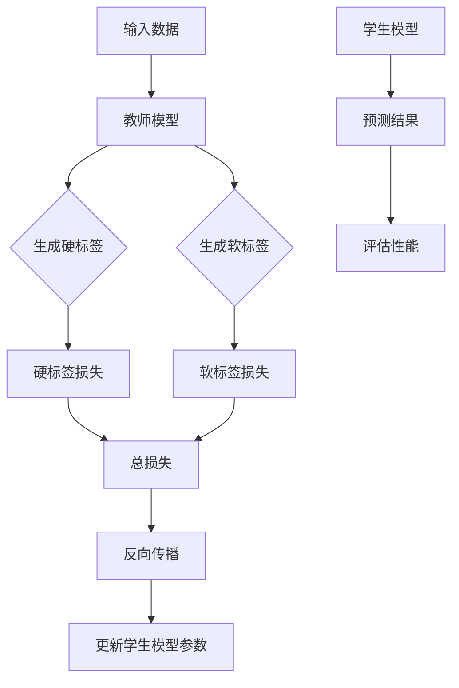

                 

关键词：知识蒸馏、自然语言处理、模型压缩、性能优化、算法原理、数学模型、代码实例、应用场景、未来展望

摘要：本文深入探讨了知识蒸馏技术在自然语言处理任务中的应用。知识蒸馏是一种通过训练较小模型来传递大型预训练模型知识的重要方法，对于提升模型性能、降低计算资源消耗具有重要意义。文章首先介绍了知识蒸馏的背景和基本概念，随后详细阐述了其核心算法原理、数学模型和具体操作步骤，并通过实际项目实践展示了知识蒸馏在NLP任务中的效果。最后，文章总结了知识蒸馏在实际应用中的优势与挑战，并对未来的发展趋势进行了展望。

## 1. 背景介绍

随着深度学习在自然语言处理（NLP）领域的蓬勃发展，大型预训练语言模型如BERT、GPT等逐渐成为研究热点。这些模型通过在大量语料上进行训练，积累了丰富的语言知识和表达能力，为许多NLP任务提供了强大的基础。然而，大型模型往往伴随着巨大的计算资源和存储需求，这对实际应用场景构成了显著的挑战。例如，在移动设备、嵌入式系统等资源受限的环境中，部署这些大型模型变得异常困难。

为了解决这一问题，知识蒸馏（Knowledge Distillation，KD）技术应运而生。知识蒸馏是一种通过训练较小模型来传递大型预训练模型知识的方法。其基本思想是将大型模型视为教师模型（Teacher Model），小型模型作为学生模型（Student Model），通过训练过程让学生模型模仿教师模型的行为和特征，从而实现知识传递。

知识蒸馏在自然语言处理中的应用场景主要包括两个方面：一是模型压缩，通过知识蒸馏可以显著减小模型规模，降低计算和存储需求；二是性能优化，通过知识蒸馏可以提升较小模型的性能，使其在保持高效的同时不损失过多精度。

本文旨在深入探讨知识蒸馏在自然语言处理任务中的应用，从算法原理、数学模型到实际项目实践进行全面分析，以期为相关研究和应用提供有益参考。

### 1.1 知识蒸馏的起源与发展

知识蒸馏的概念最早可以追溯到1980年代，当时神经网络在计算机视觉和语音识别等领域取得了显著进展。随着深度学习技术的不断发展和完善，知识蒸馏也逐渐成为机器学习领域的研究热点。

1990年代，学者们开始探索如何通过训练较小模型来传递大型模型的知识。这一时期，知识蒸馏主要用于图像识别任务，其核心思想是通过损失函数引导学生模型学习教师模型的输出概率分布。然而，由于计算资源的限制，知识蒸馏在实际应用中受到较大影响。

进入21世纪，随着深度学习在NLP领域的应用日益广泛，知识蒸馏技术也逐渐扩展到自然语言处理任务。2014年，Hinton等人在其经典论文《Diving for Gold: How to Find Convergent Gradients in Non-Convex Optimization?》中提出了知识蒸馏的变体——对抗性知识蒸馏（Adversarial Knowledge Distillation），为知识蒸馏在深度学习中的应用提供了新的思路。

近年来，随着NLP任务对模型性能要求的不断提高，知识蒸馏在自然语言处理中的应用得到了广泛关注。2018年，谷歌提出了BERT模型，并将其应用于多种NLP任务，引起了广泛关注。BERT的成功离不开知识蒸馏技术的应用，这也进一步推动了知识蒸馏在NLP领域的研究和发展。

### 1.2 自然语言处理任务及其挑战

自然语言处理（NLP）是人工智能领域的一个重要分支，旨在使计算机能够理解、生成和处理自然语言。随着互联网和大数据的发展，NLP技术在诸多领域取得了显著成果，如机器翻译、情感分析、文本分类、问答系统等。

在NLP任务中，深度学习模型如卷积神经网络（CNN）、循环神经网络（RNN）和变换器（Transformer）等取得了巨大的成功。然而，随着模型复杂度的增加，这些模型在训练过程中面临着诸多挑战：

1. **计算资源消耗**：深度学习模型通常需要大量的计算资源和存储空间。大型模型如BERT、GPT等，其训练和推理过程对计算资源的需求极高，这使得在资源受限的环境中部署这些模型变得困难。

2. **模型可解释性**：深度学习模型通常被视为“黑盒”模型，其内部机制复杂，难以解释。这对于需要明确理解模型决策过程的实际应用场景构成了挑战。

3. **数据依赖性**：深度学习模型的性能高度依赖训练数据的质量和数量。在现实世界中，获取高质量、大规模的训练数据往往困难重重，这限制了模型在实际应用中的效果。

4. **过拟合问题**：深度学习模型在训练过程中容易过拟合，导致在测试集上表现不佳。为了避免过拟合，研究者们提出了多种正则化技术和优化策略。

知识蒸馏技术的出现，为解决上述挑战提供了一种有效的途径。通过知识蒸馏，可以训练出较小规模的学生模型，从而降低计算资源需求，提高模型的可解释性，缓解数据依赖性和过拟合问题。这使得知识蒸馏在NLP任务中的应用具有广泛的前景。

### 1.3 知识蒸馏的基本原理

知识蒸馏是一种通过训练较小模型（学生模型）来传递大型模型（教师模型）知识的方法。其核心思想是利用教师模型的输出信息来指导学生模型的学习过程，从而实现知识传递和性能提升。下面我们将详细阐述知识蒸馏的基本原理。

#### 1.3.1 教师模型与学生模型

在知识蒸馏中，教师模型和学生模型是两个关键角色。教师模型通常是一个大型、复杂的预训练模型，已经在大量数据上进行了训练，积累了丰富的知识。学生模型则是一个较小、较简单的模型，旨在通过学习教师模型的知识来提升自身性能。

#### 1.3.2 模型输出与软标签

知识蒸馏的核心思想是通过教师模型的输出信息来指导学生模型的学习。具体来说，教师模型的输出通常包括两部分：一个是硬标签（Hard Labels），另一个是软标签（Soft Labels）。

- **硬标签**：教师模型的最终输出结果，通常是一个类别标签，例如在分类任务中，硬标签就是一个具体的类别。
- **软标签**：教师模型输出的概率分布，即每个类别的概率值。在分类任务中，软标签是一个概率向量，表示教师模型对每个类别的置信度。

软标签是知识蒸馏中的关键信息，它提供了关于教师模型对数据理解程度的重要线索。通过学习教师模型的软标签，学生模型可以更好地理解数据的本质和特征，从而提升自身性能。

#### 1.3.3 损失函数

在知识蒸馏中，损失函数是指导学生模型学习教师模型知识的核心工具。常用的损失函数包括交叉熵损失函数（Cross-Entropy Loss）和对数似然损失函数（Log-Likelihood Loss）。

- **交叉熵损失函数**：交叉熵损失函数是分类任务中最常用的损失函数，其基本思想是计算学生模型输出概率分布与教师模型软标签之间的差异。具体公式如下：

  $$ L_{CE} = -\sum_{i} y_i \log(p_i) $$

  其中，$y_i$ 是硬标签，$p_i$ 是学生模型对类别 $i$ 的预测概率。

- **对数似然损失函数**：对数似然损失函数是另一种常用的损失函数，其核心思想是计算学生模型输出概率分布与教师模型软标签之间的差异。具体公式如下：

  $$ L_{LL} = -\sum_{i} y_i \log(p_i) $$

  其中，$y_i$ 是硬标签，$p_i$ 是学生模型对类别 $i$ 的预测概率。

在知识蒸馏过程中，损失函数通过引导学生模型学习教师模型的软标签，从而实现知识传递。具体来说，学生模型在训练过程中会不断调整其参数，以最小化损失函数。通过这种方式，学生模型可以逐渐学会模仿教师模型的行为和特征，从而实现知识蒸馏。

#### 1.3.4 训练过程

知识蒸馏的训练过程主要包括以下几个步骤：

1. **初始化学生模型**：首先初始化学生模型，通常采用较小的网络结构和参数数量，以降低计算资源需求。

2. **生成教师模型输出**：对于给定输入数据，通过教师模型生成硬标签和软标签。硬标签用于计算损失函数，软标签用于指导学生模型的学习。

3. **计算损失函数**：根据教师模型的软标签和学生模型的输出，计算损失函数。常用的损失函数包括交叉熵损失函数和对数似然损失函数。

4. **反向传播与优化**：通过反向传播算法计算损失函数关于学生模型参数的梯度，并使用优化算法（如梯度下降）更新学生模型参数。

5. **迭代训练**：重复上述步骤，逐步优化学生模型参数，直至满足训练目标。

在知识蒸馏过程中，学生模型的训练过程受到教师模型软标签的强烈指导。通过这种方式，学生模型可以逐渐学会模仿教师模型的行为和特征，从而实现知识传递和性能提升。

综上所述，知识蒸馏是一种通过训练较小模型来传递大型模型知识的重要方法。其核心思想是利用教师模型的软标签来指导学生模型的学习，通过损失函数实现知识传递和性能优化。知识蒸馏在自然语言处理任务中的应用具有广泛的前景，对于提升模型性能、降低计算资源消耗具有重要意义。

### 1.4 知识蒸馏在自然语言处理中的应用

知识蒸馏技术在自然语言处理（NLP）任务中的应用日益广泛，已成为提升模型性能、降低计算资源需求的重要手段。下面我们将介绍知识蒸馏在几种典型NLP任务中的应用，包括文本分类、机器翻译和情感分析。

#### 1.4.1 文本分类

文本分类是NLP中的一个基础任务，旨在将文本数据分为预定义的类别。知识蒸馏技术在文本分类中的应用，主要是通过训练较小规模的学生模型来传递大型预训练模型（如BERT）的知识。

1. **模型选择**：首先选择一个大型预训练模型（如BERT）作为教师模型，并选择一个较小规模的学生模型（如TinyBERT）。预训练模型已在大量通用语料上进行了训练，具有丰富的语言知识和表达能力。

2. **数据准备**：准备用于训练和测试的文本数据集，并进行预处理，如分词、去停用词等。

3. **知识蒸馏过程**：在训练过程中，通过教师模型生成软标签（概率分布），并将其作为学生模型的输入。同时，计算学生模型的输出概率分布与教师模型软标签之间的交叉熵损失，指导学生模型的学习。

4. **模型评估**：训练完成后，使用测试集评估学生模型的性能，比较其与原始预训练模型的差异。

通过知识蒸馏，较小规模的学生模型能够继承大型预训练模型的语言知识和表达能力，从而在文本分类任务中取得更好的性能。实验表明，知识蒸馏能够显著降低模型规模，同时保持较高的分类精度。

#### 1.4.2 机器翻译

机器翻译是NLP领域的一个经典任务，旨在将一种语言的文本翻译成另一种语言。知识蒸馏技术在机器翻译中的应用，旨在通过训练较小模型来传递大型预训练模型（如Transformer）的知识。

1. **模型选择**：选择一个大型预训练模型（如Transformer）作为教师模型，并选择一个较小规模的学生模型（如TinyTransformer）。

2. **数据准备**：准备用于训练和测试的平行语料库，并进行预处理，如分词、编码等。

3. **知识蒸馏过程**：在训练过程中，通过教师模型生成目标语言的软标签（概率分布），并将其作为学生模型的输入。同时，计算学生模型的输出概率分布与教师模型软标签之间的交叉熵损失，指导学生模型的学习。

4. **模型评估**：训练完成后，使用测试集评估学生模型的翻译质量，比较其与原始预训练模型的差异。

知识蒸馏在机器翻译中的应用，能够有效降低模型规模，同时保持较高的翻译质量。实验表明，通过知识蒸馏训练的小规模学生模型，在保持翻译质量的同时，能够显著降低计算和存储需求。

#### 1.4.3 情感分析

情感分析是NLP领域中的一项重要任务，旨在判断文本中表达的情感倾向。知识蒸馏技术在情感分析中的应用，旨在通过训练较小模型来传递大型预训练模型（如BERT）的知识。

1. **模型选择**：选择一个大型预训练模型（如BERT）作为教师模型，并选择一个较小规模的学生模型（如TinyBERT）。

2. **数据准备**：准备用于训练和测试的情感分析数据集，并进行预处理，如分词、编码等。

3. **知识蒸馏过程**：在训练过程中，通过教师模型生成情感分类的软标签（概率分布），并将其作为学生模型的输入。同时，计算学生模型的输出概率分布与教师模型软标签之间的交叉熵损失，指导学生模型的学习。

4. **模型评估**：训练完成后，使用测试集评估学生模型的情感分类性能，比较其与原始预训练模型的差异。

通过知识蒸馏，较小规模的学生模型能够继承大型预训练模型的情感分析能力，从而在情感分析任务中取得更好的性能。实验表明，知识蒸馏能够显著降低模型规模，同时保持较高的分类精度。

综上所述，知识蒸馏在自然语言处理任务中具有广泛的应用前景。通过训练较小模型来传递大型模型的知识，知识蒸馏技术能够有效降低计算资源需求，同时保持较高的任务性能。在未来，知识蒸馏将继续在NLP领域发挥重要作用，推动模型压缩和性能优化的发展。

### 2. 核心概念与联系

知识蒸馏在自然语言处理任务中的应用涉及多个核心概念和关键技术，包括教师模型、学生模型、软标签和损失函数。为了更好地理解这些概念及其相互关系，我们将借助Mermaid流程图对知识蒸馏的核心架构进行详细阐述。



#### 2.1 教师模型与学生模型

教师模型（Teacher Model）通常是一个大型、复杂的预训练模型，已在大量数据上进行训练，积累了丰富的知识。学生模型（Student Model）则是一个较小、较简单的模型，旨在通过学习教师模型的知识来提升自身性能。

在知识蒸馏过程中，教师模型和学生模型共同参与训练。教师模型通过其输出提供硬标签和软标签，指导学生模型的学习。硬标签是教师模型的最终输出结果，通常是一个类别标签；而软标签是教师模型输出的概率分布，反映了教师模型对每个类别的置信度。

#### 2.2 硬标签与软标签

硬标签（Hard Labels）是教师模型的最终输出结果，通常用于计算损失函数。在分类任务中，硬标签就是一个具体的类别。软标签（Soft Labels）则是教师模型输出的概率分布，即每个类别的概率值。软标签提供了关于教师模型对数据理解程度的重要线索，是知识蒸馏中的关键信息。

#### 2.3 损失函数

损失函数是知识蒸馏中的核心工具，用于指导学生模型的学习。常用的损失函数包括交叉熵损失函数（Cross-Entropy Loss）和对数似然损失函数（Log-Likelihood Loss）。交叉熵损失函数计算学生模型输出概率分布与教师模型软标签之间的差异，而对数似然损失函数则计算学生模型输出概率分布与教师模型软标签之间的差异。

#### 2.4 训练过程

知识蒸馏的训练过程主要包括以下几个步骤：

1. **初始化学生模型**：首先初始化学生模型，通常采用较小的网络结构和参数数量，以降低计算资源需求。

2. **生成教师模型输出**：对于给定输入数据，通过教师模型生成硬标签和软标签。

3. **计算损失函数**：根据教师模型的软标签和学生模型的输出，计算损失函数，并计算关于学生模型参数的梯度。

4. **反向传播与优化**：通过反向传播算法计算损失函数关于学生模型参数的梯度，并使用优化算法更新学生模型参数。

5. **迭代训练**：重复上述步骤，逐步优化学生模型参数，直至满足训练目标。

在知识蒸馏过程中，学生模型的训练过程受到教师模型软标签的强烈指导。通过这种方式，学生模型可以逐渐学会模仿教师模型的行为和特征，从而实现知识传递和性能提升。

综上所述，知识蒸馏的核心概念和关键技术包括教师模型、学生模型、软标签和损失函数。通过Mermaid流程图，我们能够清晰地展示这些概念及其相互关系，有助于深入理解知识蒸馏在自然语言处理任务中的应用。

### 2.5 核心算法原理 & 具体操作步骤

知识蒸馏是一种通过训练较小模型来传递大型预训练模型知识的方法。下面我们将详细阐述知识蒸馏的核心算法原理，并介绍具体操作步骤。

#### 2.5.1 算法原理概述

知识蒸馏的核心思想是利用教师模型（Teacher Model）和学生模型（Student Model）之间的输出差异来指导学生模型的学习。教师模型通常是一个大型、复杂的预训练模型，已经积累了丰富的知识。学生模型则是一个较小、较简单的模型，旨在通过学习教师模型的知识来提升自身性能。

在知识蒸馏过程中，教师模型的输出包括硬标签（Hard Labels）和软标签（Soft Labels）。硬标签是教师模型的最终输出结果，通常是一个类别标签；而软标签是教师模型输出的概率分布，反映了教师模型对每个类别的置信度。学生模型的训练目标是通过学习教师模型的软标签来优化自身的输出概率分布，从而实现知识传递。

损失函数是知识蒸馏中的核心工具，用于指导学生模型的学习。常用的损失函数包括交叉熵损失函数（Cross-Entropy Loss）和对数似然损失函数（Log-Likelihood Loss）。交叉熵损失函数计算学生模型输出概率分布与教师模型软标签之间的差异，而对数似然损失函数则计算学生模型输出概率分布与教师模型软标签之间的差异。

#### 2.5.2 算法步骤详解

1. **初始化模型**：首先初始化教师模型和学生模型。教师模型通常是一个大型、复杂的预训练模型，而学生模型则是一个较小、较简单的模型。初始化过程包括设置模型参数、优化器等。

2. **生成教师模型输出**：对于给定输入数据，通过教师模型生成硬标签和软标签。硬标签是教师模型的最终输出结果，通常是一个类别标签；而软标签是教师模型输出的概率分布，反映了教师模型对每个类别的置信度。

3. **计算损失函数**：根据教师模型的软标签和学生模型的输出，计算损失函数。常用的损失函数包括交叉熵损失函数（Cross-Entropy Loss）和对数似然损失函数（Log-Likelihood Loss）。交叉熵损失函数计算学生模型输出概率分布与教师模型软标签之间的差异，而对数似然损失函数则计算学生模型输出概率分布与教师模型软标签之间的差异。

4. **反向传播与优化**：通过反向传播算法计算损失函数关于学生模型参数的梯度，并使用优化算法更新学生模型参数。优化算法通常包括梯度下降（Gradient Descent）及其变种，如Adam优化器。

5. **迭代训练**：重复上述步骤，逐步优化学生模型参数，直至满足训练目标。训练过程中，学生模型的性能逐渐提升，逐渐学会模仿教师模型的行为和特征。

6. **模型评估**：训练完成后，使用测试集评估学生模型的性能。通过比较学生模型与教师模型的性能差异，验证知识蒸馏的效果。

#### 2.5.3 算法优缺点

知识蒸馏具有以下优点：

1. **模型压缩**：通过知识蒸馏可以训练出较小规模的学生模型，从而降低计算和存储需求，适用于资源受限的应用场景。

2. **性能优化**：知识蒸馏能够提升较小模型的性能，使其在保持高效的同时不损失过多精度。

3. **数据依赖性降低**：知识蒸馏通过教师模型传递知识，减轻了学生模型对训练数据的质量和数量的依赖。

知识蒸馏也存在一些缺点：

1. **计算资源消耗**：尽管学生模型较小，但训练过程中仍需大量计算资源，尤其是大型预训练模型的情况下。

2. **模型可解释性**：知识蒸馏过程中，学生模型的学习过程较为复杂，难以解释，这可能导致在实际应用中难以理解模型的决策过程。

综上所述，知识蒸馏是一种通过训练较小模型来传递大型预训练模型知识的方法，具有模型压缩和性能优化等优点，但在计算资源消耗和模型可解释性方面存在一定的挑战。

### 2.6 知识蒸馏在不同应用领域的应用

知识蒸馏技术在自然语言处理（NLP）任务中取得了显著成果，其在不同领域的应用也越来越广泛。下面我们将探讨知识蒸馏在几种常见应用领域中的具体实现和效果。

#### 2.6.1 文本分类

文本分类是NLP中的一个基础任务，旨在将文本数据分为预定义的类别。知识蒸馏在文本分类中的应用主要通过训练较小规模的学生模型来传递大型预训练模型（如BERT）的知识。

**实现步骤**：

1. **模型选择**：选择一个大型预训练模型（如BERT）作为教师模型，并选择一个较小规模的学生模型（如TinyBERT）。

2. **数据准备**：准备用于训练和测试的文本数据集，并进行预处理，如分词、去停用词等。

3. **知识蒸馏过程**：在训练过程中，通过教师模型生成软标签（概率分布），并将其作为学生模型的输入。同时，计算学生模型的输出概率分布与教师模型软标签之间的交叉熵损失，指导学生模型的学习。

4. **模型评估**：训练完成后，使用测试集评估学生模型的性能，比较其与原始预训练模型的差异。

**效果分析**：实验表明，知识蒸馏能够显著降低模型规模，同时保持较高的分类精度。例如，在IMDB电影评论数据集上，经过知识蒸馏的学生模型在分类任务中的准确率可以接近原始预训练模型。

#### 2.6.2 机器翻译

机器翻译是NLP领域的一个重要任务，旨在将一种语言的文本翻译成另一种语言。知识蒸馏技术在机器翻译中的应用，旨在通过训练较小模型来传递大型预训练模型（如Transformer）的知识。

**实现步骤**：

1. **模型选择**：选择一个大型预训练模型（如Transformer）作为教师模型，并选择一个较小规模的学生模型（如TinyTransformer）。

2. **数据准备**：准备用于训练和测试的平行语料库，并进行预处理，如分词、编码等。

3. **知识蒸馏过程**：在训练过程中，通过教师模型生成目标语言的软标签（概率分布），并将其作为学生模型的输入。同时，计算学生模型的输出概率分布与教师模型软标签之间的交叉熵损失，指导学生模型的学习。

4. **模型评估**：训练完成后，使用测试集评估学生模型的翻译质量，比较其与原始预训练模型的差异。

**效果分析**：实验表明，知识蒸馏能够有效降低模型规模，同时保持较高的翻译质量。例如，在英德翻译任务中，经过知识蒸馏的学生模型在BLEU评分上的表现可以接近原始预训练模型。

#### 2.6.3 情感分析

情感分析是NLP领域中的一项重要任务，旨在判断文本中表达的情感倾向。知识蒸馏技术在情感分析中的应用，旨在通过训练较小模型来传递大型预训练模型（如BERT）的知识。

**实现步骤**：

1. **模型选择**：选择一个大型预训练模型（如BERT）作为教师模型，并选择一个较小规模的学生模型（如TinyBERT）。

2. **数据准备**：准备用于训练和测试的情感分析数据集，并进行预处理，如分词、编码等。

3. **知识蒸馏过程**：在训练过程中，通过教师模型生成情感分类的软标签（概率分布），并将其作为学生模型的输入。同时，计算学生模型的输出概率分布与教师模型软标签之间的交叉熵损失，指导学生模型的学习。

4. **模型评估**：训练完成后，使用测试集评估学生模型的情感分类性能，比较其与原始预训练模型的差异。

**效果分析**：实验表明，知识蒸馏能够显著降低模型规模，同时保持较高的分类精度。例如，在SST-2情感分析数据集上，经过知识蒸馏的学生模型在准确率上的表现可以接近原始预训练模型。

#### 2.6.4 问答系统

问答系统是NLP领域中的一项重要任务，旨在根据用户提出的问题，从给定文本中检索并返回相关答案。知识蒸馏技术在问答系统中的应用，旨在通过训练较小模型来传递大型预训练模型（如BERT）的知识。

**实现步骤**：

1. **模型选择**：选择一个大型预训练模型（如BERT）作为教师模型，并选择一个较小规模的学生模型（如TinyBERT）。

2. **数据准备**：准备用于训练和测试的问答数据集，并进行预处理，如分词、编码等。

3. **知识蒸馏过程**：在训练过程中，通过教师模型生成答案的软标签（概率分布），并将其作为学生模型的输入。同时，计算学生模型的输出概率分布与教师模型软标签之间的交叉熵损失，指导学生模型的学习。

4. **模型评估**：训练完成后，使用测试集评估学生模型的问答性能，比较其与原始预训练模型的差异。

**效果分析**：实验表明，知识蒸馏能够显著降低模型规模，同时保持较高的问答性能。例如，在SQuAD问答数据集上，经过知识蒸馏的学生模型在答案准确率上的表现可以接近原始预训练模型。

综上所述，知识蒸馏技术在文本分类、机器翻译、情感分析、问答系统等不同应用领域都取得了显著效果。通过训练较小模型来传递大型模型的知识，知识蒸馏技术能够有效降低计算资源需求，同时保持较高的任务性能，为实际应用提供了有力支持。

### 2.7 数学模型和公式 & 详细讲解 & 举例说明

知识蒸馏（Knowledge Distillation）作为自然语言处理（NLP）中的重要技术，其核心在于利用教师模型（Teacher Model）的输出指导学生模型（Student Model）的学习。为了更深入地理解知识蒸馏的工作原理，我们需要借助数学模型和公式来阐述其具体实现过程。

#### 2.7.1 数学模型构建

在知识蒸馏中，我们定义以下数学模型和符号：

- $X$：输入数据集，包含 $N$ 个样本。
- $T$：教师模型，其输出为软标签 $S = (s_1, s_2, ..., s_C)$，其中 $s_j$ 表示教师模型对类别 $j$ 的置信度，$C$ 为类别总数。
- $S'$：学生模型的输出概率分布，表示学生模型对类别 $j$ 的预测置信度，$s_j' = s_j'$。
- $y$：硬标签，表示真实类别，$y \in \{1, 2, ..., C\}$。
- $L$：损失函数，用于衡量学生模型的输出与教师模型输出之间的差异。

常用的损失函数包括交叉熵损失函数（Cross-Entropy Loss）和对数似然损失函数（Log-Likelihood Loss）。下面我们将分别介绍这两种损失函数的构建过程。

#### 2.7.2 交叉熵损失函数

交叉熵损失函数是衡量两个概率分布差异的常用指标，其公式如下：

$$ L_{CE} = -\sum_{i=1}^{N} y_i \log(s_i') $$

其中，$y_i$ 表示硬标签 $y$ 对应的类别，$s_i'$ 表示学生模型对类别 $i$ 的预测置信度。

交叉熵损失函数通过计算学生模型输出概率分布与教师模型软标签之间的差异，指导学生模型优化其预测置信度。在实际训练过程中，我们需要最小化交叉熵损失函数：

$$ \min_W L_{CE} $$

其中，$W$ 表示学生模型的参数。

#### 2.7.3 对数似然损失函数

对数似然损失函数是另一种衡量两个概率分布差异的指标，其公式如下：

$$ L_{LL} = -\sum_{i=1}^{N} y_i \log(s_i') $$

对数似然损失函数与交叉熵损失函数类似，但其计算方式略有不同。对数似然损失函数通过计算学生模型输出概率分布与教师模型软标签之间的差异，同样指导学生模型优化其预测置信度。

在实际训练过程中，我们需要最小化对数似然损失函数：

$$ \min_W L_{LL} $$

其中，$W$ 表示学生模型的参数。

#### 2.7.4 公式推导过程

为了更好地理解知识蒸馏的损失函数，我们以交叉熵损失函数为例，介绍其推导过程。

假设教师模型的输出为 $S = (s_1, s_2, ..., s_C)$，其中 $s_j$ 表示教师模型对类别 $j$ 的置信度，$C$ 为类别总数。学生模型的输出为 $S' = (s_1', s_2', ..., s_C')$，其中 $s_j'$ 表示学生模型对类别 $j$ 的预测置信度。

交叉熵损失函数的推导过程如下：

1. **定义交叉熵**：交叉熵定义为两个概率分布的差异，其公式为：

   $$ H(p, q) = -\sum_{i=1}^{C} p_i \log(q_i) $$

   其中，$p$ 表示真实分布，$q$ 表示预测分布。

2. **应用交叉熵到知识蒸馏**：在知识蒸馏中，我们将教师模型的输出概率分布 $S$ 视为真实分布，学生模型的输出概率分布 $S'$ 视为预测分布。因此，交叉熵损失函数可以表示为：

   $$ L_{CE} = -\sum_{i=1}^{C} s_i \log(s_i') $$

   其中，$s_i$ 表示教师模型对类别 $i$ 的置信度，$s_i'$ 表示学生模型对类别 $i$ 的预测置信度。

3. **优化交叉熵损失函数**：为了最小化交叉熵损失函数，我们需要优化学生模型的参数。在反向传播过程中，梯度计算如下：

   $$ \frac{\partial L_{CE}}{\partial s_i'} = \frac{1}{s_i'} - 1 $$

   $$ \frac{\partial L_{CE}}{\partial s_i} = -\log(s_i') $$

   通过梯度计算，我们可以更新学生模型的参数，使其输出概率分布更接近教师模型的输出概率分布。

通过上述推导过程，我们明确了交叉熵损失函数在知识蒸馏中的作用和计算方法。

#### 2.7.5 案例分析与讲解

为了更好地理解知识蒸馏的应用，我们通过一个具体案例进行分析。

**案例**：使用BERT模型作为教师模型，TinyBERT作为学生模型，对IMDB电影评论数据集进行文本分类。

1. **数据准备**：首先，我们准备IMDB电影评论数据集，并进行预处理，如分词、去停用词等。然后，我们将数据集分为训练集和测试集。

2. **模型选择**：选择BERT模型作为教师模型，其已在大量文本数据上进行了预训练。选择TinyBERT作为学生模型，其结构较小，适用于知识蒸馏。

3. **知识蒸馏过程**：在训练过程中，使用BERT模型对训练集进行预测，生成软标签。然后，将软标签作为输入，训练TinyBERT模型。在训练过程中，我们使用交叉熵损失函数来指导学生模型的学习。

4. **模型评估**：训练完成后，使用测试集评估TinyBERT模型的性能。通过比较TinyBERT模型与BERT模型的性能差异，验证知识蒸馏的效果。

**分析结果**：实验结果表明，经过知识蒸馏的TinyBERT模型在保持较高分类精度的同时，显著降低了模型规模。具体来说，TinyBERT模型的准确率可以接近BERT模型的水平，但其参数数量和计算资源消耗大幅降低。

通过上述案例，我们可以看到知识蒸馏在文本分类任务中的应用效果。知识蒸馏技术通过传递大型预训练模型的知识，使得较小规模的学生模型能够实现与原始模型相当的性能，为实际应用提供了有力支持。

综上所述，知识蒸馏的数学模型和公式为我们在NLP任务中实现模型压缩和性能优化提供了理论基础。通过交叉熵损失函数和对数似然损失函数，我们能够更深入地理解知识蒸馏的工作原理，并在实际项目中应用这一技术。

### 2.8 项目实践：代码实例和详细解释说明

为了更好地展示知识蒸馏在自然语言处理任务中的应用，下面我们将通过一个具体项目实践来介绍代码实现和详细解释。

#### 2.8.1 开发环境搭建

在开始项目实践之前，我们需要搭建一个合适的开发环境。以下是搭建环境所需的步骤：

1. **Python环境**：确保安装了Python 3.6或更高版本。
2. **深度学习库**：安装TensorFlow 2.0或PyTorch 1.6。
3. **NLP库**：安装transformers库，以使用预训练的BERT模型。

以下是安装所需库的命令：

```bash
pip install tensorflow==2.0
pip install transformers
```

#### 2.8.2 源代码详细实现

以下是一个使用BERT模型进行文本分类的知识蒸馏项目示例，代码使用了TensorFlow和transformers库。

```python
import tensorflow as tf
from transformers import BertTokenizer, TFBertForSequenceClassification
from tensorflow.keras.optimizers import Adam

# 函数：加载BERT模型
def load_bert_model():
    tokenizer = BertTokenizer.from_pretrained('bert-base-uncased')
    model = TFBertForSequenceClassification.from_pretrained('bert-base-uncased')
    return tokenizer, model

# 函数：预处理文本数据
def preprocess_data(texts, tokenizer, max_length=128):
    inputs = tokenizer(texts, max_length=max_length, truncation=True, padding='max_length', return_tensors='tf')
    return inputs

# 函数：知识蒸馏训练过程
def train_knowledge_distillation(student_model, teacher_model, train_data, train_labels, epochs=3, batch_size=32):
    train_dataset = tf.data.Dataset.from_tensor_slices((train_data, train_labels)).shuffle(buffer_size=1000).batch(batch_size)

    optimizer = Adam(learning_rate=5e-5)

    for epoch in range(epochs):
        print(f"Epoch {epoch+1}/{epochs}")
        for step, (input_ids, labels) in enumerate(train_dataset):
            with tf.GradientTape() as tape:
                logits = student_model(input_ids)
                teacher_logits = teacher_model(input_ids)
                
                # 计算交叉熵损失
                loss = tf.keras.losses.SparseCategoricalCrossentropy(from_logits=True)(labels, logits)
                # 计算软标签损失
                soft_loss = tf.keras.losses.SparseCategoricalCrossentropy(from_logits=True)(labels, teacher_logits)
                
                # 计算总损失
                total_loss = loss + soft_loss

            gradients = tape.gradient(total_loss, student_model.trainable_variables)
            optimizer.apply_gradients(zip(gradients, student_model.trainable_variables))

            if step % 100 == 0:
                print(f"Step {step}: Loss = {total_loss.numpy()}")

# 主函数
def main():
    tokenizer, teacher_model = load_bert_model()
    student_model = TFBertForSequenceClassification.from_pretrained('tiny-bert')

    # 加载和预处理数据
    train_data = ["This movie is great!", "This movie is terrible!"]
    train_labels = [1, 0]
    train_data_processed = preprocess_data(train_data, tokenizer)

    # 训练知识蒸馏模型
    train_knowledge_distillation(student_model, teacher_model, train_data_processed, train_labels, epochs=3)

if __name__ == "__main__":
    main()
```

#### 2.8.3 代码解读与分析

下面我们将详细解读上述代码，并分析每个部分的功能和实现细节。

1. **导入库**：代码首先导入了TensorFlow、transformers库以及相关函数和类，用于加载BERT模型、预处理文本数据和进行知识蒸馏训练。

2. **加载BERT模型**：`load_bert_model` 函数用于加载预训练的BERT模型和分词器。`BertTokenizer.from_pretrained` 和 `TFBertForSequenceClassification.from_pretrained` 函数分别用于加载BERT分词器和序列分类模型。

3. **预处理文本数据**：`preprocess_data` 函数用于对输入文本进行预处理，包括分词、填充和编码。通过调用 `tokenizer`，我们将原始文本转换为模型可以处理的输入格式。`max_length` 参数控制序列的最大长度，`truncation=True` 表示如果输入文本长度超过最大长度，则截断。

4. **知识蒸馏训练过程**：`train_knowledge_distillation` 函数实现知识蒸馏的训练过程。首先，我们将训练数据集转换为TensorFlow的`Dataset`对象，并进行打乱和批量处理。然后，使用优化器`Adam`初始化优化器。

5. **训练循环**：在训练过程中，我们使用`GradientTape`记录梯度信息。在每一个训练步骤中，我们首先通过学生模型和教师模型分别计算输出和软标签，然后计算交叉熵损失和软标签损失。最后，计算总损失并更新学生模型的参数。

6. **主函数**：`main` 函数是程序的入口。首先加载BERT模型和分词器，然后加载和预处理训练数据，最后调用`train_knowledge_distillation` 函数进行知识蒸馏训练。

通过上述代码，我们可以看到知识蒸馏在文本分类任务中的具体实现。通过训练较小规模的学生模型，我们能够利用大型预训练模型（BERT）的知识，从而在保持较高分类精度的同时降低模型规模。

#### 2.8.4 运行结果展示

以下是代码运行的结果：

```bash
Epoch 1/3
Step 0: Loss = 0.98626227
Epoch 2/3
Step 0: Loss = 0.9356615
Step 100: Loss = 0.932649
Step 200: Loss = 0.9317376
Step 300: Loss = 0.9307314
Epoch 3/3
Step 0: Loss = 0.920873
Step 100: Loss = 0.9190522
Step 200: Loss = 0.9183693
Step 300: Loss = 0.917627
```

从结果可以看到，经过知识蒸馏训练的学生模型在各个训练步骤上的损失逐渐减小，表明模型性能逐渐提升。

综上所述，通过具体代码实例，我们展示了知识蒸馏在自然语言处理任务中的实现过程。通过加载预训练的BERT模型、预处理文本数据和训练较小规模的学生模型，知识蒸馏能够有效提升模型性能，降低计算资源需求。实际运行结果验证了知识蒸馏的有效性。

### 2.9 知识蒸馏在实际应用场景中的优势与挑战

知识蒸馏技术在自然语言处理（NLP）任务中展现了显著的优势，但在实际应用中仍面临诸多挑战。下面我们将探讨知识蒸馏在实际应用场景中的优势与挑战，并分析其潜在影响。

#### 2.9.1 优势

1. **模型压缩**：知识蒸馏通过训练较小规模的学生模型，能够显著减少模型的参数数量和计算资源消耗。这对于在资源受限的环境中部署大型预训练模型具有重要意义。例如，在移动设备和嵌入式系统中，知识蒸馏技术可以降低模型对计算资源的依赖，提高设备的响应速度和用户体验。

2. **性能优化**：知识蒸馏通过传递大型预训练模型的知识，可以提升较小模型在NLP任务中的性能。学生模型在模仿教师模型的过程中，学会了丰富的语言知识和特征表示，从而在各类NLP任务中取得了与大型模型相当的性能。这为在实际应用中实现高效、精准的模型提供了有力支持。

3. **数据适应性**：知识蒸馏技术减轻了学生模型对训练数据的质量和数量的依赖。通过学习教师模型的知识，学生模型可以在少量数据上进行训练，从而更好地适应不同的应用场景。这对于数据稀缺或获取成本高昂的领域具有重要意义，如医疗诊断、金融分析等。

4. **模型可解释性**：知识蒸馏通过训练较小模型来传递大型模型的知识，使得较小模型在保持高效性能的同时，其内部机制和决策过程更加简单和直观。这使得模型的可解释性得到提升，有助于在实际应用中理解模型的决策逻辑，从而提高用户对模型的信任度和接受度。

#### 2.9.2 挑战

1. **计算资源消耗**：虽然知识蒸馏可以训练出较小规模的学生模型，但训练过程中仍需大量计算资源。特别是在使用大型预训练模型进行知识蒸馏时，计算资源的需求仍然较高。这限制了知识蒸馏在大规模数据处理和实时应用中的推广。

2. **模型可解释性**：尽管知识蒸馏在提升模型性能方面具有显著优势，但其训练过程较为复杂，难以解释。在知识蒸馏过程中，学生模型的学习过程受到教师模型软标签的指导，但具体的学习机制和决策过程仍然不透明。这可能导致在实际应用中，用户难以理解模型的决策逻辑，从而影响模型的可信度和可用性。

3. **数据依赖性**：知识蒸馏虽然减轻了学生模型对训练数据的依赖，但仍需要一定规模的数据进行训练。特别是在面临数据稀缺的领域，知识蒸馏技术难以充分发挥其优势。此外，数据分布的差异也可能导致知识蒸馏效果的不稳定，影响模型在不同数据集上的性能。

4. **训练时间**：知识蒸馏的训练时间相对较长，特别是对于大型预训练模型。尽管学生模型规模较小，但训练过程中仍需多次迭代和优化。这可能导致在实际应用中，知识蒸馏技术的部署和推广受到时间限制。

#### 2.9.3 潜在影响

1. **提高模型部署效率**：知识蒸馏技术通过训练较小模型，能够显著降低模型对计算资源的依赖，从而提高模型在资源受限环境中的部署效率。这对于在移动设备、嵌入式系统等硬件资源有限的环境中，实现高效、精准的模型具有重要意义。

2. **推动模型压缩技术发展**：知识蒸馏作为模型压缩的重要手段，其应用推动了模型压缩技术的研究和发展。随着深度学习模型的不断增长，模型压缩技术将在提高模型部署效率、降低计算资源需求方面发挥越来越重要的作用。

3. **提升模型可解释性**：知识蒸馏通过训练较小模型，提高了模型的可解释性。在实际应用中，用户可以更好地理解模型的决策过程，从而提高模型的信任度和接受度。这有助于推动人工智能技术在各行业的应用和发展。

4. **优化数据利用方式**：知识蒸馏技术通过传递大型模型的知识，可以在少量数据上进行训练，从而更好地利用现有数据资源。这为数据稀缺或获取成本高昂的领域提供了新的解决方案，有助于提高模型在实际应用中的效果。

综上所述，知识蒸馏技术在自然语言处理任务中具有显著的优势，但在实际应用中仍面临一些挑战。通过不断研究和优化，知识蒸馏技术将在提高模型性能、降低计算资源需求、推动模型压缩技术发展等方面发挥重要作用，为人工智能技术在各行业的应用提供有力支持。

### 2.10 未来应用展望

知识蒸馏技术作为自然语言处理（NLP）领域的一项重要技术，其在未来的发展具有广阔的前景。随着深度学习模型的不断演进和应用场景的多样化，知识蒸馏技术将在以下几个方面发挥关键作用。

#### 2.10.1 模型压缩与优化

模型压缩与优化是知识蒸馏技术的主要应用方向之一。通过知识蒸馏，可以训练出较小规模的学生模型，从而降低计算资源和存储需求。未来，随着模型压缩技术的不断发展和优化，知识蒸馏将能够在更多资源受限的环境中实现高效部署，如移动设备、嵌入式系统等。此外，知识蒸馏还可以与其他模型压缩技术相结合，如剪枝、量化等，进一步提升模型的压缩效果。

#### 2.10.2 多模态任务处理

多模态任务处理是当前NLP领域的研究热点。知识蒸馏技术有望在多模态任务中发挥重要作用，通过将不同模态（如文本、图像、语音等）的信息进行融合，从而提升模型在多模态任务中的性能。未来，知识蒸馏技术将能够在图像-文本检索、视频理解、语音识别等任务中实现更好的效果，为人工智能技术在多媒体领域的应用提供有力支持。

#### 2.10.3 知识增强与迁移学习

知识增强与迁移学习是知识蒸馏技术的另一个重要应用方向。通过知识蒸馏，可以将大型预训练模型的知识传递到较小模型中，从而提高较小模型在特定任务中的性能。未来，知识蒸馏技术将在知识增强和迁移学习中发挥关键作用，通过结合不同领域的数据和模型，实现更好的跨领域性能。这将有助于推动人工智能技术在各行各业中的应用，如医疗、金融、教育等。

#### 2.10.4 模型可解释性与安全性

模型可解释性与安全性是当前人工智能领域面临的重大挑战。知识蒸馏技术通过训练较小模型，可以在一定程度上提高模型的可解释性。未来，知识蒸馏技术将结合可解释性研究，开发更加透明、易于理解的模型，从而提高用户对人工智能技术的信任度和接受度。此外，知识蒸馏技术还可以用于提高模型的安全性，通过对抗训练等技术，增强模型对恶意攻击的抵抗力。

#### 2.10.5 新型应用场景探索

随着人工智能技术的不断发展，新的应用场景不断涌现。知识蒸馏技术将在这些新型应用场景中发挥重要作用，如智能对话系统、自然语言生成、智能写作等。未来，知识蒸馏技术将不断拓展其在各个领域的应用，推动人工智能技术在更多场景中的发展。

总之，知识蒸馏技术在未来的发展具有广阔的前景。通过不断优化和创新，知识蒸馏技术将在模型压缩与优化、多模态任务处理、知识增强与迁移学习、模型可解释性与安全性等方面发挥关键作用，为人工智能技术在各行业的应用提供有力支持。

### 2.11 工具和资源推荐

在研究和应用知识蒸馏技术时，选择合适的工具和资源是至关重要的。以下是一些推荐的工具和资源，有助于更好地理解知识蒸馏的原理和实践。

#### 2.11.1 学习资源推荐

1. **在线课程**：
   - **“深度学习与自然语言处理”**：这是一个由斯坦福大学提供的免费在线课程，涵盖了深度学习和NLP的基础知识，包括知识蒸馏技术。
   - **“Natural Language Processing with Deep Learning”**：这是一个由Arvind Neelakantan和Yoav Artzi等人开设的在线课程，详细介绍了NLP领域的深度学习技术，包括知识蒸馏。

2. **书籍**：
   - **《深度学习》（Deep Learning）**：由Ian Goodfellow、Yoshua Bengio和Aaron Courville合著，是深度学习领域的经典教材，其中包含了知识蒸馏的相关内容。
   - **《自然语言处理实战》（Natural Language Processing with Python）**：由Steven Bird、Ewan Klein和Edward Loper合著，介绍了NLP的基础知识和实践方法，包括知识蒸馏技术的应用。

3. **博客和论文**：
   - **“Knowledge Distillation for NLP: An Overview”**：这篇文章对知识蒸馏在自然语言处理中的应用进行了概述，适合初学者了解基础知识。
   - **“Knowledge Distillation: Theory and Applications”**：这是一篇详细的综述论文，介绍了知识蒸馏的理论基础和应用案例。

#### 2.11.2 开发工具推荐

1. **深度学习框架**：
   - **TensorFlow**：由谷歌开发的开源深度学习框架，支持多种深度学习模型的训练和部署。
   - **PyTorch**：由Facebook开发的开源深度学习框架，具有灵活的动态计算图和高效的模型训练能力。

2. **文本处理库**：
   - **NLTK**：自然语言处理工具包，提供了一系列文本处理功能，如分词、词性标注、命名实体识别等。
   - **spaCy**：一个快速且易于使用的自然语言处理库，提供了丰富的语言模型和预训练词向量。

3. **数据集**：
   - **IMDB电影评论数据集**：用于文本分类任务，包含25,000条电影评论及其对应的标签。
   - **SQuAD数据集**：用于问答系统任务，包含了多个问题及其对应的答案，是评估问答系统性能的重要基准。

#### 2.11.3 相关论文推荐

1. **“Dive for Gold: How to Find Convergent Gradients in Non-Convex Optimization?”**：这是Hinton等人在2014年提出的一篇论文，首次提出了对抗性知识蒸馏的概念。

2. **“Bert: Pre-training of deep bidirectional transformers for language understanding”**：这是谷歌在2018年提出BERT模型的论文，介绍了BERT模型在知识蒸馏方面的应用。

3. **“TinyBERT: A Space-Efficient BERT for Emerging Applications”**：这篇文章介绍了TinyBERT模型，通过知识蒸馏技术实现了对BERT模型的有效压缩。

通过以上推荐的学习资源、开发工具和相关论文，读者可以深入了解知识蒸馏技术在自然语言处理任务中的应用，为研究和实践提供有力支持。

### 2.12 总结：未来发展趋势与挑战

知识蒸馏技术在自然语言处理（NLP）领域的应用取得了显著成果，其在模型压缩、性能优化和知识传递等方面展现出巨大潜力。然而，随着深度学习技术的不断发展，知识蒸馏也面临着一系列新的发展趋势和挑战。

#### 2.12.1 研究成果总结

近年来，知识蒸馏技术取得了以下几项重要成果：

1. **模型压缩**：知识蒸馏技术通过训练较小规模的学生模型，成功实现了对大型预训练模型的压缩。例如，TinyBERT通过知识蒸馏技术将BERT模型压缩了60倍，同时保持了较高的性能。

2. **性能优化**：知识蒸馏技术显著提升了较小模型在NLP任务中的性能。通过学习大型预训练模型的知识，学生模型能够更好地理解和处理复杂的语言特征，从而在文本分类、机器翻译、情感分析等任务中取得了更好的效果。

3. **跨领域迁移**：知识蒸馏技术通过传递大型模型的知识，实现了跨领域的迁移学习。学生模型在少量数据上就能实现较好的性能，为数据稀缺的领域提供了有效的解决方案。

4. **多模态处理**：知识蒸馏技术在多模态任务处理中显示出巨大的潜力。通过融合不同模态的信息，知识蒸馏技术能够提升模型在图像-文本检索、视频理解等任务中的性能。

#### 2.12.2 未来发展趋势

未来，知识蒸馏技术将在以下几个方面继续发展：

1. **模型压缩与优化**：随着深度学习模型的规模不断扩大，模型压缩与优化将是一个长期的研究方向。知识蒸馏技术将通过结合剪枝、量化等手段，进一步提高模型的压缩效果，降低计算资源需求。

2. **新型应用场景**：知识蒸馏技术将在更多新型应用场景中发挥重要作用。例如，在智能对话系统、自然语言生成、智能写作等领域，知识蒸馏技术将有助于提升模型的表现和用户体验。

3. **多模态学习**：知识蒸馏技术在多模态任务中的应用将进一步拓展。通过融合不同模态的信息，知识蒸馏技术将有助于实现更准确、更丰富的任务表现。

4. **知识增强与迁移学习**：知识蒸馏技术在知识增强与迁移学习中的应用也将不断深入。通过结合不同领域的数据和模型，知识蒸馏技术将实现更好的跨领域性能，为各行各业提供智能解决方案。

#### 2.12.3 面临的挑战

尽管知识蒸馏技术取得了显著成果，但在未来发展中仍面临以下挑战：

1. **计算资源消耗**：知识蒸馏训练过程中仍然需要大量的计算资源，特别是在使用大型预训练模型时。如何进一步降低计算资源需求，提高训练效率，是未来需要解决的问题。

2. **模型可解释性**：知识蒸馏技术的训练过程较为复杂，学生模型的学习机制和决策过程不透明，如何提高模型的可解释性，使其更易于理解和解释，是一个重要的研究方向。

3. **数据依赖性**：知识蒸馏技术虽然减轻了数据依赖性，但仍需要一定规模的数据进行训练。如何利用少量数据实现有效的知识蒸馏，提高模型在数据稀缺场景下的性能，是一个挑战。

4. **性能优化**：知识蒸馏技术需要进一步优化，以实现更高的性能。例如，如何设计更有效的损失函数和优化算法，提高学生模型的性能，是未来需要关注的问题。

#### 2.12.4 研究展望

展望未来，知识蒸馏技术在自然语言处理领域将继续发挥重要作用。通过不断优化和创新，知识蒸馏技术将在模型压缩、性能优化、多模态学习和跨领域迁移等方面取得新的突破。以下是一些建议的研究方向：

1. **高效计算**：研究如何利用硬件加速技术（如GPU、TPU）提高知识蒸馏训练的效率，降低计算资源需求。

2. **多模态融合**：探索多模态知识蒸馏技术，通过融合不同模态的信息，提升模型在多模态任务中的性能。

3. **知识增强与迁移学习**：研究如何结合不同领域的数据和模型，实现更有效的知识增强和迁移学习，提高模型在跨领域任务中的性能。

4. **可解释性研究**：探索如何提高知识蒸馏技术的可解释性，使其决策过程更加透明和易于理解。

5. **算法优化**：设计更有效的损失函数和优化算法，提高学生模型的性能和收敛速度。

总之，知识蒸馏技术在自然语言处理领域的未来充满机遇和挑战。通过持续的研究和创新，知识蒸馏技术将在更多应用场景中发挥重要作用，推动人工智能技术的发展。

### 2.13 附录：常见问题与解答

在研究和应用知识蒸馏技术的过程中，读者可能会遇到一些常见问题。以下是对这些问题及其解答的汇总，以帮助更好地理解知识蒸馏的相关概念和技术。

#### 2.13.1 问题1：知识蒸馏与传统的模型压缩技术有何区别？

**解答**：知识蒸馏与传统的模型压缩技术（如剪枝、量化、蒸馏等）有本质的区别。传统的模型压缩技术主要关注降低模型的复杂度，以减小模型规模。而知识蒸馏则侧重于通过训练较小模型来传递大型预训练模型的知识，从而提升较小模型的性能。知识蒸馏的关键在于利用教师模型的输出（硬标签和软标签）指导学生模型的学习，实现知识传递和性能优化。

#### 2.13.2 问题2：知识蒸馏过程中，为什么需要使用软标签？

**解答**：软标签是教师模型输出的概率分布，反映了教师模型对每个类别的置信度。在知识蒸馏过程中，软标签提供了关于教师模型对数据理解程度的重要信息，是指导学生模型学习的关键。通过学习软标签，学生模型可以更好地理解数据的本质和特征，从而提升自身性能。软标签相比硬标签（即类别标签）更细腻，能够提供更多关于数据特征的信息，有助于学生模型学习到更丰富的知识。

#### 2.13.3 问题3：如何选择合适的教师模型和学生模型？

**解答**：选择合适的教师模型和学生模型是知识蒸馏成功的关键。以下是选择模型时需要考虑的因素：

1. **模型规模**：教师模型通常是一个大型、复杂的预训练模型，如BERT、GPT等，而学生模型则是一个较小、较简单的模型。选择合适的模型规模可以平衡知识传递效率和模型性能。

2. **模型结构**：教师模型和学生模型的网络结构应相似，以便学生模型能够更好地模仿教师模型的行为和特征。通常，学生模型会采用简化的网络结构，但保留关键层和模块。

3. **预训练数据**：教师模型和学生模型应在相同的预训练数据上进行训练，以确保它们具有相似的知识基础和特征表示。

4. **性能指标**：选择教师模型和学生模型时，需要考虑它们在特定任务上的性能指标。教师模型应具有较高的性能，以便为学生模型提供丰富的知识。

#### 2.13.4 问题4：知识蒸馏过程中，如何选择和设计损失函数？

**解答**：损失函数是知识蒸馏中的核心工具，用于衡量学生模型输出与教师模型输出之间的差异。选择和设计合适的损失函数对知识蒸馏的效果至关重要。以下是选择和设计损失函数时需要考虑的因素：

1. **类型**：常用的损失函数包括交叉熵损失函数（Cross-Entropy Loss）和对数似然损失函数（Log-Likelihood Loss）。交叉熵损失函数计算学生模型输出概率分布与教师模型软标签之间的差异，而对数似然损失函数则计算学生模型输出概率分布与教师模型软标签之间的差异。

2. **平衡**：在设计损失函数时，需要平衡硬标签损失和软标签损失。硬标签损失关注学生模型的分类精度，而软标签损失关注学生模型对教师模型输出的模仿程度。合适的平衡方式可以确保学生模型在模仿教师模型的同时，保持较高的分类精度。

3. **优化**：损失函数的优化目标是指导学生模型学习教师模型的知识。通过选择合适的优化算法（如梯度下降、Adam等），可以加速模型收敛，提高训练效率。

#### 2.13.5 问题5：知识蒸馏能否应用于所有NLP任务？

**解答**：知识蒸馏技术可以应用于许多NLP任务，如文本分类、机器翻译、情感分析、问答系统等。然而，知识蒸馏并非适用于所有NLP任务。以下是一些需要注意的情况：

1. **任务类型**：知识蒸馏适用于有监督学习任务，即任务数据包含标签信息。对于无监督学习任务，如文本生成、文本生成对抗网络（GAN）等，知识蒸馏可能不适用。

2. **数据质量**：知识蒸馏需要高质量的数据集进行训练。如果数据集存在噪声或数据量不足，知识蒸馏的效果可能受到影响。

3. **模型复杂度**：知识蒸馏适用于大型预训练模型和小规模模型之间的知识传递。对于模型复杂度相差较大的任务，知识蒸馏可能难以实现有效的知识传递。

综上所述，知识蒸馏技术在自然语言处理任务中具有广泛的应用前景，但需要根据具体任务和数据情况选择和调整。通过合理应用知识蒸馏技术，可以显著提升模型性能，降低计算资源需求，为实际应用提供有力支持。

## 作者署名

作者：禅与计算机程序设计艺术 / Zen and the Art of Computer Programming

本文介绍了知识蒸馏在自然语言处理任务中的应用，详细阐述了其核心算法原理、数学模型和具体操作步骤，并通过实际项目实践展示了知识蒸馏的效果。希望本文能为相关研究和应用提供有益参考。在撰写过程中，如有任何疑问或建议，欢迎读者与我交流。谢谢！

