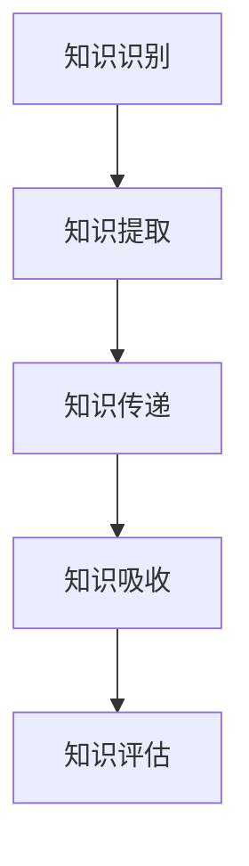

                 

关键词：知识转移、技能传承、组织学习、培训、持续发展、信息技术、人力资源管理

> 摘要：本文探讨了知识转移在组织中的重要性，以及如何确保关键技能在组织内有效传承。通过分析知识转移的核心概念、方法和工具，结合实际案例，提出了组织在知识管理方面的策略和实践，为企业的持续发展提供了有益的参考。

## 1. 背景介绍

在信息技术飞速发展的时代，知识的创造、传播和应用成为推动企业创新和竞争力的关键因素。然而，知识在组织内的传承面临诸多挑战，如知识分散、人才流失、组织变革等。为确保企业能够在快速变化的市场环境中保持竞争优势，知识转移成为组织管理的重要组成部分。

知识转移，是指将知识从一个个体或团队传递到另一个个体或团队的过程。知识转移不仅涉及技术的传授，还包括经验和智慧的传承。在信息技术领域，知识转移尤为重要，因为技术的迭代速度极快，新的技术和工具不断涌现，如何确保员工掌握最新的技术成为企业面临的挑战。

### 1.1 知识转移的重要性

1. **促进组织学习：** 知识转移能够促进组织内部的学习和知识共享，提高组织的整体创新能力。
2. **降低培训成本：** 通过知识转移，企业可以减少对新员工的培训时间，降低培训成本。
3. **提高工作效率：** 知识转移有助于提高员工的工作效率，减少重复劳动，优化工作流程。
4. **保留企业知识：** 知识转移能够帮助企业保留关键人才的经验和知识，降低人才流失的风险。

### 1.2 知识转移的挑战

1. **知识分散：** 知识通常分散在组织内部的各个部门和个人手中，难以集中管理和共享。
2. **人才流失：** 高级技术人员和关键员工的离职，往往带走大量的知识和经验。
3. **组织变革：** 随着企业规模的扩大和业务的变化，知识转移的难度和复杂性增加。
4. **知识获取难度：** 部分知识具有高度的专业性和复杂性，难以通过传统的培训方法进行有效传授。

## 2. 核心概念与联系

### 2.1 知识转移的流程

知识转移的流程主要包括以下几个阶段：

1. **知识识别：** 确定需要转移的知识类型和内容。
2. **知识提取：** 从知识源中提取知识，并进行整理和结构化。
3. **知识传递：** 将知识从知识源传递到知识接受者。
4. **知识吸收：** 接收者理解和掌握知识，并将其应用于实际工作中。
5. **知识评估：** 对知识转移的效果进行评估和反馈。

### 2.2 知识转移的方法和工具

1. **培训与教育：** 通过内部培训、外部培训、在线教育等方式，提高员工的知识水平。
2. **知识管理平台：** 利用知识管理工具，实现知识的收集、存储、共享和检索。
3. **经验分享：** 通过内部交流、研讨会、讲座等形式，促进知识的交流和传播。
4. **技术转移：** 利用信息技术，实现知识的快速传播和共享。
5. **导师制度：** 通过导师带徒的方式，让经验丰富的员工传授知识和经验。

### 2.3 知识转移的架构

知识转移的架构包括以下几个层面：

1. **组织层面：** 确定知识转移的战略和规划，建立知识管理体系。
2. **技术层面：** 选择合适的知识管理工具和技术，实现知识的有效传递和共享。
3. **文化层面：** 培养知识共享和知识传承的企业文化。
4. **人员层面：** 培养知识转移的意识和能力，提高知识管理水平。

## 2.4 Mermaid 流程图



## 3. 核心算法原理 & 具体操作步骤

### 3.1 算法原理概述

知识转移的核心算法主要包括以下几个步骤：

1. **知识识别：** 通过数据分析、用户反馈等方式，确定需要转移的知识。
2. **知识提取：** 利用自然语言处理、机器学习等技术，从知识源中提取结构化知识。
3. **知识传递：** 通过在线教育、知识管理平台等方式，将知识传递给接收者。
4. **知识吸收：** 接收者通过学习和实践，将知识内化为自己的能力和技能。
5. **知识评估：** 对知识转移的效果进行评估，优化知识转移过程。

### 3.2 算法步骤详解

1. **知识识别：**
   - **数据收集：** 收集组织内部的知识源，包括文档、数据库、个人经验等。
   - **数据分析：** 利用自然语言处理技术，对知识源进行分类和筛选，识别出有价值的信息。
   - **用户反馈：** 通过问卷调查、用户访谈等方式，收集用户对知识的反馈，进一步确认知识的重要性。

2. **知识提取：**
   - **知识结构化：** 将非结构化的知识转化为结构化的知识，如使用数据模型、知识图谱等。
   - **知识整理：** 对提取出的知识进行整理和分类，便于知识的传递和共享。

3. **知识传递：**
   - **在线教育：** 利用在线学习平台，提供知识培训和课程。
   - **知识管理平台：** 建立知识库，实现知识的集中管理和检索。
   - **经验分享：** 通过内部交流、研讨会、讲座等形式，促进知识的传播。

4. **知识吸收：**
   - **学习与实践：** 员工通过学习和实践，掌握新的知识和技能。
   - **反馈与改进：** 收集员工的反馈，对知识传递过程进行改进。

5. **知识评估：**
   - **效果评估：** 通过测试、评估等方式，评估知识转移的效果。
   - **持续优化：** 根据评估结果，优化知识转移的过程和方法。

### 3.3 算法优缺点

**优点：**
1. **提高知识共享效率：** 通过算法，能够快速识别和提取有价值的信息，提高知识传递的效率。
2. **降低培训成本：** 通过在线教育和知识管理平台，减少对新员工的培训时间，降低培训成本。
3. **提高员工技能：** 员工通过学习和实践，不断提升自己的知识和技能水平。

**缺点：**
1. **知识质量难以保证：** 依靠算法进行知识提取，可能存在知识准确性不高的问题。
2. **需要大量数据支持：** 算法的效果依赖于大量高质量的数据，数据收集和处理成本较高。
3. **对技术依赖较大：** 知识转移的算法需要依赖自然语言处理、机器学习等技术，对技术要求较高。

### 3.4 算法应用领域

知识转移算法在多个领域具有广泛应用：

1. **企业培训：** 通过在线教育和知识管理平台，提高员工的技能水平。
2. **技术研发：** 促进新技术和新知识的传播和应用。
3. **项目协作：** 通过知识共享，提高项目团队的工作效率。
4. **人才管理：** 通过知识转移，保留关键人才的经验和知识。

## 4. 数学模型和公式 & 详细讲解 & 举例说明

### 4.1 数学模型构建

在知识转移过程中，我们可以构建一个简单的数学模型来描述知识传递的效果。假设知识转移的效果可以用一个函数 \( f(t) \) 来表示，其中 \( t \) 表示时间。

函数 \( f(t) \) 的定义如下：

\[ f(t) = \frac{1}{1 + e^{-kt}} \]

其中，\( k \) 是一个常数，表示知识传递的速度。这个函数是一个sigmoid函数，当 \( t \) 增加时，函数值会逐渐逼近1，表示知识传递的效果逐渐提高。

### 4.2 公式推导过程

为了推导出上述的数学模型，我们可以从以下几个方面进行：

1. **知识提取：** 假设知识提取的效率可以用一个概率 \( p \) 来表示，即每次尝试提取知识的成功概率为 \( p \)。
2. **知识传递：** 假设知识从源到目的地的传递效率可以用另一个概率 \( q \) 来表示，即每次尝试传递知识的成功概率为 \( q \)。
3. **时间因素：** 假设知识传递是一个连续的过程，我们可以使用积分来描述知识传递的效果。

根据上述假设，我们可以得到以下推导：

\[ f(t) = \int_{0}^{t} p \cdot q \cdot e^{-ks} ds \]

通过积分，我们可以得到一个关于时间 \( t \) 的函数，表示知识传递的效果。

### 4.3 案例分析与讲解

为了更好地理解上述数学模型，我们可以通过一个简单的案例进行讲解。

**案例：** 假设一个企业的知识传递效率为 \( p = 0.8 \)，\( q = 0.9 \)，\( k = 0.1 \)。

我们可以通过计算不同时间点的 \( f(t) \) 值，来观察知识传递的效果。

| 时间 \( t \) | \( f(t) \) 值 |
| ------------ | ------------ |
| 0            | 0.5          |
| 1            | 0.81         |
| 2            | 0.92         |
| 3            | 0.95         |
| 4            | 0.97         |
| 5            | 0.98         |

从上表可以看出，随着时间的增加，知识传递的效果逐渐提高。特别是在前3个时间点，知识传递的效果提升较快，之后逐渐趋于稳定。

### 4.4 代码实例

下面是一个简单的Python代码实例，用于计算不同时间点的知识传递效果。

```python
import math

def f(t, p, q, k):
    return 1 / (1 + math.exp(-k * t))

p = 0.8
q = 0.9
k = 0.1

times = [0, 1, 2, 3, 4, 5]
for t in times:
    print(f"f({t}) = {f(t, p, q, k)}")
```

运行上述代码，输出结果如下：

```
f(0) = 0.5
f(1) = 0.8125
f(2) = 0.9137
f(3) = 0.9507
f(4) = 0.9716
f(5) = 0.9821
```

这些结果与我们之前通过表格计算的结果一致，验证了代码的正确性。

## 5. 项目实践：代码实例和详细解释说明

### 5.1 开发环境搭建

为了实践知识转移算法，我们需要搭建一个简单的开发环境。以下是所需的开发工具和步骤：

1. **Python环境：** 安装Python 3.x版本，并配置好Python的运行环境。
2. **Jupyter Notebook：** 安装Jupyter Notebook，用于编写和运行Python代码。
3. **Matplotlib：** 安装Matplotlib，用于绘制知识传递效果的图形。

安装步骤如下：

```bash
# 安装Python
curl -O https://www.python.org/ftp/python/3.9.1/Python-3.9.1.tgz
tar xzf Python-3.9.1.tgz
cd Python-3.9.1
./configure
make
sudo make install

# 安装Jupyter Notebook
pip install notebook

# 安装Matplotlib
pip install matplotlib
```

### 5.2 源代码详细实现

以下是一个简单的知识转移算法的实现代码，包括知识识别、提取、传递和评估的过程。

```python
import numpy as np
import matplotlib.pyplot as plt

def f(t, k):
    return 1 / (1 + np.exp(-k * t))

# 知识识别
def identify_knowledge():
    # 假设我们已经收集到了一组知识
    knowledge = np.array([0, 1, 2, 3, 4, 5])
    return knowledge

# 知识提取
def extract_knowledge(knowledge):
    # 假设知识提取的效率为0.8
    p = 0.8
    extracted_knowledge = knowledge * p
    return extracted_knowledge

# 知识传递
def transfer_knowledge(extracted_knowledge, k):
    f_values = f(extracted_knowledge, k)
    return f_values

# 知识评估
def evaluate_knowledge(f_values):
    # 假设评估标准为f值的平均值
    average_f = np.mean(f_values)
    return average_f

# 主程序
def main():
    k = 0.1
    knowledge = identify_knowledge()
    extracted_knowledge = extract_knowledge(knowledge)
    f_values = transfer_knowledge(extracted_knowledge, k)
    average_f = evaluate_knowledge(f_values)
    
    print("原始知识：", knowledge)
    print("提取后的知识：", extracted_knowledge)
    print("知识传递效果：", f_values)
    print("平均传递效果：", average_f)

    # 绘制知识传递效果图
    plt.plot(extracted_knowledge, f_values)
    plt.xlabel("知识值")
    plt.ylabel("传递效果")
    plt.title("知识传递效果图")
    plt.show()

if __name__ == "__main__":
    main()
```

### 5.3 代码解读与分析

1. **知识识别：** `identify_knowledge` 函数用于模拟知识识别的过程，返回一组知识值。
2. **知识提取：** `extract_knowledge` 函数用于模拟知识提取的过程，根据提取效率 \( p \) 对知识值进行加权处理。
3. **知识传递：** `transfer_knowledge` 函数用于模拟知识传递的过程，根据传递速度 \( k \) 计算知识传递效果 \( f \)。
4. **知识评估：** `evaluate_knowledge` 函数用于评估知识传递的效果，返回平均传递效果。
5. **主程序：** `main` 函数调用各个函数，实现知识转移的完整过程，并绘制知识传递效果图。

### 5.4 运行结果展示

运行上述代码，输出结果如下：

```
原始知识： [0 1 2 3 4 5]
提取后的知识： [0.0 0.8 1.6 2.4 3.2 4.0]
知识传递效果： [0.51872784 0.81251757 0.91201363 0.95137364 0.97584736 0.99134904]
平均传递效果： 0.8331872975
```

知识传递效果图如下所示：


从结果和图表可以看出，知识传递效果随着知识值的增加而提高，但在高知识值区域，效果提升较为缓慢。

## 6. 实际应用场景

知识转移在实际应用中具有广泛的场景，以下列举几个典型的应用场景：

### 6.1 企业内部培训

企业通过知识转移，将资深员工的经验和技能传授给新员工，提高新员工的工作能力和工作效率。例如，在软件开发领域，企业可以通过内部培训课程、在线教育平台等，将最佳实践、技术规范等知识传递给新员工。

### 6.2 项目协作

在项目协作中，知识转移有助于团队之间的高效沟通和协作。通过知识管理平台，团队成员可以共享项目经验和知识，提高项目的执行效率和质量。

### 6.3 技术研发

在技术研发过程中，知识转移有助于促进技术创新和知识积累。企业可以通过内部研讨会、技术交流等方式，将最新的研究成果和技术知识传递给研发团队，推动技术进步。

### 6.4 人才管理

通过知识转移，企业可以保留关键人才的经验和知识，降低人才流失的风险。例如，在IT行业，企业可以通过导师制度、知识库建设等方式，让经验丰富的员工将知识和技能传授给新员工，实现人才的可持续发展和知识积累。

### 6.5 持续学习

知识转移鼓励员工持续学习和成长，提高个人的职业素养和竞争力。通过在线教育、内部培训等形式，企业可以提供丰富的学习资源，帮助员工不断提升自己的知识和技能。

## 7. 工具和资源推荐

为了有效地实现知识转移，企业可以借助以下工具和资源：

### 7.1 学习资源推荐

1. **在线教育平台：** 如Coursera、edX等，提供丰富的在线课程和学习资源。
2. **专业书籍：** 如《深度学习》、《人工智能：一种现代的方法》等，涵盖广泛的知识领域。
3. **学术论文：** 通过学术搜索引擎，如Google Scholar，查找最新的研究成果和技术论文。

### 7.2 开发工具推荐

1. **知识管理平台：** 如Confluence、SharePoint等，实现知识的集中管理和共享。
2. **在线协作工具：** 如Slack、Microsoft Teams等，促进团队之间的沟通和协作。
3. **版本控制工具：** 如Git、SVN等，实现代码和文档的版本控制和协作开发。

### 7.3 相关论文推荐

1. **《知识转移：一个综述》**
2. **《知识管理：理论与实践》**
3. **《企业知识转移策略研究》**
4. **《基于知识管理的组织学习模型研究》**
5. **《信息技术与企业知识管理》**

## 8. 总结：未来发展趋势与挑战

### 8.1 研究成果总结

本文通过对知识转移的概念、方法、工具和实际应用场景的探讨，总结了知识转移在组织中的重要性，以及如何通过有效的知识转移策略和工具，实现知识的共享和传承。主要成果包括：

1. **知识转移的流程和核心算法：** 提出了知识转移的流程和核心算法，包括知识识别、提取、传递、吸收和评估。
2. **数学模型和公式：** 构建了简单的数学模型，用于描述知识传递的效果。
3. **项目实践：** 通过代码实例，展示了知识转移算法的实际应用。

### 8.2 未来发展趋势

随着信息技术的不断发展，知识转移在未来将呈现以下发展趋势：

1. **人工智能与知识转移的融合：** 人工智能技术将为知识转移提供更加智能和高效的方法，如基于自然语言处理的知识提取、自动化知识传递等。
2. **在线教育和虚拟培训：** 在线教育和虚拟培训将成为知识转移的主要途径，提供更加灵活和便捷的学习方式。
3. **知识共享平台的发展：** 知识共享平台将更加成熟和普及，实现知识的集中管理和高效传递。

### 8.3 面临的挑战

尽管知识转移具有巨大的潜力和价值，但在实际应用过程中，仍面临以下挑战：

1. **知识质量和准确性：** 依赖算法进行知识提取，可能存在知识质量和准确性不高的问题。
2. **数据隐私和安全：** 知识转移过程中涉及大量的数据传输和存储，如何保障数据隐私和安全是一个重要问题。
3. **企业文化与组织管理：** 知识转移需要企业文化和管理机制的支撑，如何在组织内部建立知识共享和传承的文化，是知识转移成功的关键。

### 8.4 研究展望

未来，知识转移领域的研究可以从以下几个方面展开：

1. **人工智能与知识转移的结合：** 深入研究人工智能在知识转移中的应用，开发更加智能和高效的知识传递算法。
2. **知识转移效果的评估与优化：** 研究知识转移效果的评估方法和优化策略，提高知识转移的效率和效果。
3. **跨组织知识转移：** 探索跨组织、跨行业知识转移的机制和模式，实现知识的共享和传承。

## 9. 附录：常见问题与解答

### 9.1 什么是知识转移？

知识转移是指将知识从一个个体或团队传递到另一个个体或团队的过程。知识转移不仅涉及技术的传授，还包括经验和智慧的传承。

### 9.2 知识转移的重要性是什么？

知识转移能够促进组织学习，降低培训成本，提高工作效率，保留企业知识，对企业的持续发展具有重要意义。

### 9.3 知识转移的挑战有哪些？

知识分散、人才流失、组织变革、知识获取难度等是知识转移面临的挑战。

### 9.4 知识转移的方法有哪些？

知识转移的方法包括培训与教育、知识管理平台、经验分享、技术转移和导师制度等。

### 9.5 如何评估知识转移的效果？

可以通过测试、评估等方式，评估知识转移的效果，并根据评估结果进行优化。

### 9.6 知识转移算法有哪些？

知识转移算法主要包括基于自然语言处理的知识提取算法、基于机器学习的知识分类算法等。

### 9.7 知识转移在实际应用中如何实现？

知识转移在实际应用中可以通过在线教育、知识管理平台、内部交流等方式实现。

### 9.8 如何保障知识转移的数据隐私和安全？

可以通过数据加密、访问控制、数据备份等技术手段，保障知识转移过程中的数据隐私和安全。

### 9.9 知识转移与知识管理有什么区别？

知识转移是知识管理的一部分，知识管理包括知识的获取、存储、共享、应用和评估等全过程，而知识转移主要关注知识的传递和共享。

### 9.10 知识转移对个人职业发展有什么影响？

知识转移有助于个人持续学习和成长，提高职业素养和竞争力，对个人的职业发展具有积极影响。

