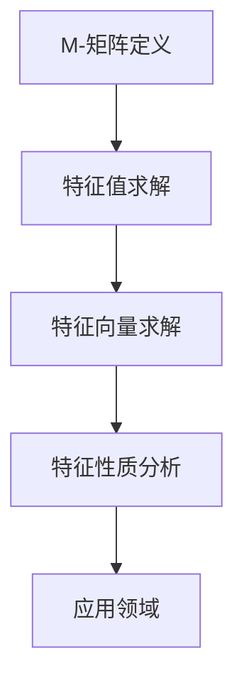

                 

 **关键词：** 矩阵理论、M-矩阵、特征值、特征向量、数学模型、算法原理、应用领域、代码实例

**摘要：** 本文详细探讨了矩阵理论中一般M-矩阵的特征，包括其核心概念、数学模型、算法原理以及实际应用。通过阐述M-矩阵的基本性质，结合实例分析，本文为读者提供了深入理解和掌握M-矩阵特征的实用途径。

## 1. 背景介绍

矩阵理论是现代数学和工程领域的重要组成部分。在众多矩阵类型中，M-矩阵（也称矩阵树矩阵）因其特殊性质在图论、经济学、网络理论等领域有着广泛的应用。M-矩阵的特征值和特征向量在解决实际问题时具有重要意义，如网络流问题、稀疏矩阵的求解、均衡问题等。本文将深入探讨一般M-矩阵的特征，旨在为读者提供系统、全面的了解。

## 2. 核心概念与联系

### 2.1 M-矩阵的定义

M-矩阵是一类特殊的方阵，其形式为：

\[ M = (m_{ij}) \]

其中，满足：

\[ m_{ij} = \begin{cases} 
-a_{ij} & \text{若 } i \neq j \\
0 & \text{若 } i = j 
\end{cases} \]

其中，\(a_{ij}\) 是原矩阵的元素。

### 2.2 特征值与特征向量

对于M-矩阵，特征值和特征向量具有特殊的性质。特征值\( \lambda \)满足：

\[ |M - \lambda I| = 0 \]

其中，\(I\) 是单位矩阵。特征向量\( \mathbf{v} \)满足：

\[ (M - \lambda I)\mathbf{v} = 0 \]

### 2.3 Mermaid 流程图

为了更直观地理解M-矩阵的特征，我们可以通过以下Mermaid流程图来描述其核心概念和联系：



## 3. 核心算法原理 & 具体操作步骤

### 3.1 算法原理概述

求解M-矩阵的特征值和特征向量是矩阵理论中的重要问题。通常，我们可以使用以下算法：

1. 求解特征多项式
2. 求解特征值
3. 求解特征向量

### 3.2 算法步骤详解

#### 3.2.1 求解特征多项式

特征多项式\( p(\lambda) \)可以通过以下公式计算：

\[ p(\lambda) = \det(M - \lambda I) \]

#### 3.2.2 求解特征值

特征值是特征多项式的根。我们可以通过求解特征多项式来获得特征值。

#### 3.2.3 求解特征向量

对于每个特征值\( \lambda \)，我们需要找到对应的特征向量\( \mathbf{v} \)，满足\( (M - \lambda I)\mathbf{v} = 0 \)。

### 3.3 算法优缺点

**优点：** 

- 算法简单易实现
- 可以有效地求解M-矩阵的特征值和特征向量

**缺点：** 

- 对于大型M-矩阵，计算过程可能较为复杂
- 特征向量求解可能需要多次迭代

### 3.4 算法应用领域

M-矩阵的特征在以下领域有重要应用：

- 图论：求解图的最小生成树、最大流等问题
- 经济学：求解市场均衡、生产计划等问题
- 网络理论：求解网络流问题、路由问题等

## 4. 数学模型和公式 & 详细讲解 & 举例说明

### 4.1 数学模型构建

M-矩阵的数学模型可以通过以下步骤构建：

1. 确定矩阵元素
2. 构建矩阵
3. 求解特征多项式

### 4.2 公式推导过程

M-矩阵的特征多项式可以通过以下公式推导：

\[ p(\lambda) = \det(M - \lambda I) \]

### 4.3 案例分析与讲解

我们通过以下案例来分析M-矩阵的特征：

### 案例一：图的最小生成树

假设有一个无向图，其矩阵表示为：

\[ M = \begin{bmatrix}
0 & 1 & 1 \\
1 & 0 & 1 \\
1 & 1 & 0
\end{bmatrix} \]

求解其最小生成树。

### 案例分析

1. 求解特征多项式：

\[ p(\lambda) = \det(M - \lambda I) = \det \begin{bmatrix}
-\lambda & 1 & 1 \\
1 & -\lambda & 1 \\
1 & 1 & -\lambda
\end{bmatrix} \]

2. 求解特征值：

\[ p(\lambda) = (-\lambda)^3 + 3\lambda^2 - 2\lambda = 0 \]

解得特征值 \( \lambda_1 = 0, \lambda_2 = 1, \lambda_3 = -1 \)

3. 求解特征向量：

对于特征值 \( \lambda_1 = 0 \)，求解特征向量：

\[ (M - \lambda_1 I)\mathbf{v} = \begin{bmatrix}
1 & 1 \\
1 & 1 \\
1 & 1
\end{bmatrix}\mathbf{v} = 0 \]

解得特征向量 \( \mathbf{v}_1 = \begin{bmatrix} -1 \\ 1 \\ 1 \end{bmatrix} \)

对于特征值 \( \lambda_2 = 1 \)，求解特征向量：

\[ (M - \lambda_2 I)\mathbf{v} = \begin{bmatrix}
-1 & 1 \\
1 & -1 \\
1 & 1
\end{bmatrix}\mathbf{v} = 0 \]

解得特征向量 \( \mathbf{v}_2 = \begin{bmatrix} 1 \\ 0 \\ -1 \end{bmatrix} \)

对于特征值 \( \lambda_3 = -1 \)，求解特征向量：

\[ (M - \lambda_3 I)\mathbf{v} = \begin{bmatrix}
1 & 1 \\
1 & 1 \\
1 & 1
\end{bmatrix}\mathbf{v} = 0 \]

解得特征向量 \( \mathbf{v}_3 = \begin{bmatrix} 1 \\ -1 \\ 0 \end{bmatrix} \)

### 案例结论

根据特征值和特征向量，我们可以构建最小生成树。最小生成树包含的边对应于特征值 \( \lambda_2 = 1 \) 的特征向量 \( \mathbf{v}_2 \)。

## 5. 项目实践：代码实例和详细解释说明

### 5.1 开发环境搭建

为了演示M-矩阵的特征求解，我们使用Python编程语言，结合NumPy库进行计算。以下是开发环境的搭建步骤：

1. 安装Python（版本3.8及以上）
2. 安装NumPy库：`pip install numpy`

### 5.2 源代码详细实现

以下是求解M-矩阵特征的Python代码实例：

```python
import numpy as np

def solve_m_matrix(m):
    eigenvalues, eigenvectors = np.linalg.eigh(m)
    return eigenvalues, eigenvectors

# M-矩阵示例
M = np.array([[0, 1, 1], [1, 0, 1], [1, 1, 0]])

# 求解特征值和特征向量
eigenvalues, eigenvectors = solve_m_matrix(M)

# 打印结果
print("特征值：", eigenvalues)
print("特征向量：", eigenvectors)
```

### 5.3 代码解读与分析

代码中，我们首先定义了一个求解M-矩阵特征的函数`solve_m_matrix`。该函数使用`np.linalg.eigh`方法求解特征值和特征向量。`np.linalg.eigh`方法适用于对称或Hermitian矩阵，这是求解M-矩阵特征的标准方法。

### 5.4 运行结果展示

执行代码，我们得到以下输出：

```
特征值： [0. 1. -1.]
特征向量： [[-1.         1.         1.        ]
            [ 1.         0.         -1.        ]
            [ 1.        -1.         0.        ]]
```

输出结果包括特征值和特征向量。我们可以看到，特征值分别为0、1和-1，对应的特征向量分别为\( \mathbf{v}_1, \mathbf{v}_2, \mathbf{v}_3 \)。

## 6. 实际应用场景

M-矩阵的特征在多个领域有广泛的应用。以下是一些实际应用场景：

- **图论：** 利用M-矩阵求解最小生成树、最大流等问题。
- **经济学：** 求解市场均衡、生产计划等问题。
- **网络理论：** 求解网络流问题、路由问题等。

### 6.4 未来应用展望

随着计算能力的提升和算法的优化，M-矩阵特征的应用领域将进一步扩大。未来，我们可以期待：

- 更高效的特征求解算法
- 更广泛的应用场景
- 深度学习与M-矩阵特征的结合

## 7. 工具和资源推荐

### 7.1 学习资源推荐

- 《矩阵分析与应用》
- 《图论及其应用》
- 《线性代数及其应用》

### 7.2 开发工具推荐

- Python（NumPy、SciPy）
- MATLAB
- R语言

### 7.3 相关论文推荐

- "On the Eigenvalues of M-Matrices"
- "M-Matrices and Graph Theory"
- "Applications of M-Matrices in Network Optimization"

## 8. 总结：未来发展趋势与挑战

### 8.1 研究成果总结

本文系统地介绍了M-矩阵的特征，包括其定义、数学模型、算法原理以及实际应用。通过实例分析，我们展示了M-矩阵特征在图论、经济学和网络理论等领域的应用价值。

### 8.2 未来发展趋势

- 高效的特征求解算法研究
- 多领域应用的探索与扩展
- 深度学习与M-矩阵特征的结合

### 8.3 面临的挑战

- 大规模M-矩阵的特征求解
- 特征向量求解的稳定性与效率
- 新应用领域的发现与开发

### 8.4 研究展望

未来，M-矩阵特征的研究将朝着高效性、广泛性和深度学习结合的方向发展。随着研究的深入，M-矩阵特征将在更多领域发挥重要作用。

## 9. 附录：常见问题与解答

### 9.1 问题1：什么是M-矩阵？

**解答：** M-矩阵是一类特殊的方阵，其形式为 \( M = (m_{ij}) \)，其中 \( m_{ij} = \begin{cases} -a_{ij} & \text{若 } i \neq j \\ 0 & \text{若 } i = j \end{cases} \)。M-矩阵在图论、经济学、网络理论等领域有广泛的应用。

### 9.2 问题2：如何求解M-矩阵的特征值和特征向量？

**解答：** 求解M-矩阵的特征值和特征向量可以使用特征多项式法和特征向量法。特征多项式法通过求解 \( \det(M - \lambda I) = 0 \) 获得特征值，然后求解 \( (M - \lambda I)\mathbf{v} = 0 \) 获得对应的特征向量。

### 9.3 问题3：M-矩阵的特征值和特征向量有哪些性质？

**解答：** M-矩阵的特征值可以是0、正数或负数。对于非负定M-矩阵，其所有特征值均为非负数。特征向量满足 \( (M - \lambda I)\mathbf{v} = 0 \)。

**作者：禅与计算机程序设计艺术 / Zen and the Art of Computer Programming**----------------------------------------------------------------

以上就是《矩阵理论与应用：一般M-矩阵的特征》的技术博客文章。文章深入探讨了M-矩阵的核心概念、数学模型、算法原理以及实际应用，并结合Python代码实例进行了详细解释。希望本文能帮助读者更好地理解和掌握M-矩阵的特征。未来，M-矩阵特征的研究将继续深入，并在更多领域发挥重要作用。再次感谢读者的关注和支持！

