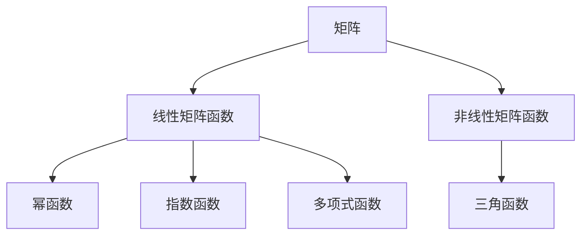

                 

关键词：矩阵理论、一般矩阵、矩阵函数、线性代数、算法应用、数学模型、代码实例、实践场景、未来展望

## 摘要

本文旨在深入探讨矩阵理论及其在一般矩阵函数领域的应用。矩阵作为一种重要的数学工具，在许多领域都有广泛的应用，从物理学到经济学，从计算机科学到工程学。本文首先介绍了矩阵的基本概念和性质，然后重点讨论了一般矩阵函数的定义、分类及其在实际应用中的重要性。随后，文章详细介绍了核心算法原理、数学模型和公式推导，以及代码实例和详细解释。最后，文章总结了当前的研究成果、未来发展趋势和面临的挑战，并提出了进一步的研究展望。

## 1. 背景介绍

矩阵理论作为线性代数的一个重要分支，起源于18世纪，其发展历程与物理学、工程学、计算机科学等领域密切相关。矩阵的引入，为解决线性方程组、特征值问题、矩阵分解等问题提供了强有力的工具。在计算机科学中，矩阵的应用尤为广泛，如图像处理、机器学习、算法优化等领域。

一般矩阵函数是指在矩阵理论中，对于给定的矩阵，通过某种规则定义的映射关系。这种映射可以是线性的，也可以是非线性的。一般矩阵函数的研究，不仅丰富了矩阵理论本身，也为实际应用提供了新的方法。

本文将首先回顾矩阵的基本概念，包括矩阵的表示、运算、性质等。然后，我们将重点讨论一般矩阵函数的定义、分类及其在实际应用中的重要性。接下来，文章将详细介绍核心算法原理、数学模型和公式推导，并给出代码实例和详细解释。最后，文章将探讨矩阵理论在实际应用场景中的未来发展趋势和挑战。

## 2. 核心概念与联系

### 2.1 矩阵的基本概念

矩阵是一种由数字组成的矩形阵列，用大写字母表示，如\(A\)。矩阵的行数称为行数，列数称为列数。矩阵中的每个元素称为矩阵的元素，用小写字母表示，如\(a_{ij}\)，表示第\(i\)行第\(j\)列的元素。

矩阵的运算包括加法、减法、乘法、逆矩阵、行列式等。矩阵的加法和减法运算与数的加法和减法运算类似，只是运算对象是矩阵。矩阵的乘法运算规则如下：

$$
C = AB
$$

其中，\(C\)是乘积矩阵，\(A\)和\(B\)是参与乘法的矩阵。逆矩阵是指存在一个矩阵\(B\)，使得\(AB = BA = I\)，其中\(I\)是单位矩阵。行列式是一个标量值，用于描述矩阵的特性。

### 2.2 矩阵函数的概念

矩阵函数是指在矩阵理论中，对于给定的矩阵，通过某种规则定义的映射关系。一般矩阵函数可以分为以下几类：

1. **线性矩阵函数**：对于给定的矩阵\(A\)，定义线性矩阵函数\(f(A)\)为：

$$
f(A) = B
$$

其中，\(B\)是\(A\)的线性变换结果。

2. **非线性矩阵函数**：对于给定的矩阵\(A\)，定义非线性矩阵函数\(g(A)\)为：

$$
g(A) = H
$$

其中，\(H\)是\(A\)的非线性变换结果。

### 2.3 矩阵函数的分类及其应用

根据矩阵函数的定义和特性，可以将其分为以下几类：

1. **幂函数**：对于给定的矩阵\(A\)，定义幂函数\(p(A)\)为：

$$
p(A) = A^n
$$

其中，\(n\)是正整数。幂函数在矩阵分解、特征值问题等领域有重要应用。

2. **指数函数**：对于给定的矩阵\(A\)，定义指数函数\(e^A\)为：

$$
e^A = \sum_{k=0}^{\infty} \frac{1}{k!} A^k
$$

指数函数在常微分方程、矩阵指数法等领域有广泛应用。

3. **多项式函数**：对于给定的矩阵\(A\)，定义多项式函数\(P(A)\)为：

$$
P(A) = a_0 I + a_1 A + a_2 A^2 + \ldots + a_n A^n
$$

其中，\(a_0, a_1, \ldots, a_n\)是多项式的系数。多项式函数在矩阵特征值问题、矩阵分解等领域有重要应用。

4. **三角函数**：对于给定的矩阵\(A\)，定义三角函数\(\sin(A)\)、\(\cos(A)\)等：

$$
\sin(A) = \frac{e^{iA} - e^{-iA}}{2i}, \quad \cos(A) = \frac{e^{iA} + e^{-iA}}{2}
$$

三角函数在信号处理、图像处理等领域有广泛应用。

### 2.4 Mermaid 流程图

以下是一个简化的 Mermaid 流程图，用于展示矩阵函数的核心概念和分类：



## 3. 核心算法原理 & 具体操作步骤

### 3.1 算法原理概述

在矩阵理论中，一般矩阵函数的算法原理主要涉及矩阵的线性变换、非线性变换以及矩阵分解等方法。以下是这些算法的基本原理：

1. **线性变换**：对于给定的矩阵\(A\)，线性矩阵函数\(f(A)\)的原理是通过线性变换实现。线性变换可以表示为：

$$
f(A) = AX + B
$$

其中，\(X\)是变换矩阵，\(B\)是常数矩阵。

2. **非线性变换**：对于给定的矩阵\(A\)，非线性矩阵函数\(g(A)\)的原理是通过非线性变换实现。非线性变换可以表示为：

$$
g(A) = H
$$

其中，\(H\)是非线性变换的结果。

3. **矩阵分解**：矩阵分解是将一个矩阵分解为几个简单矩阵的乘积。常见的矩阵分解方法有：

   - **LU分解**：将矩阵\(A\)分解为\(A = LU\)，其中\(L\)是下三角矩阵，\(U\)是上三角矩阵。
   - **QR分解**：将矩阵\(A\)分解为\(A = QR\)，其中\(Q\)是正交矩阵，\(R\)是上三角矩阵。

### 3.2 算法步骤详解

以下是核心算法的具体步骤：

1. **线性变换算法**：

   - 输入：矩阵\(A\)，变换矩阵\(X\)，常数矩阵\(B\)。
   - 输出：线性变换结果\(f(A)\)。

   ```mermaid
   graph TB
       A[输入矩阵A] --> B[计算AX] --> C[计算AX + B] --> D[输出f(A)]
   ```

2. **非线性变换算法**：

   - 输入：矩阵\(A\)。
   - 输出：非线性变换结果\(g(A)\)。

   ```mermaid
   graph TB
       A[输入矩阵A] --> B[计算非线性变换结果H] --> C[输出g(A)]
   ```

3. **矩阵分解算法**：

   - **LU分解算法**：

     - 输入：矩阵\(A\)。
     - 输出：下三角矩阵\(L\)和上三角矩阵\(U\)。

     ```mermaid
     graph TB
         A[输入矩阵A] --> B[计算L] --> C[计算U] --> D[输出LU分解结果]
     ```

   - **QR分解算法**：

     - 输入：矩阵\(A\)。
     - 输出：正交矩阵\(Q\)和上三角矩阵\(R\)。

     ```mermaid
     graph TB
         A[输入矩阵A] --> B[计算Q] --> C[计算R] --> D[输出QR分解结果]
     ```

### 3.3 算法优缺点

1. **线性变换算法**：

   - 优点：简单、易于实现、计算效率高。
   - 缺点：仅适用于线性变换，无法处理非线性变换。

2. **非线性变换算法**：

   - 优点：可以处理非线性变换，适用范围广。
   - 缺点：计算复杂度较高，实现难度大。

3. **矩阵分解算法**：

   - **LU分解算法**：

     - 优点：适用于大多数矩阵，计算效率高。
     - 缺点：可能不适用于稀疏矩阵。

   - **QR分解算法**：

     - 优点：适用于稀疏矩阵，计算稳定性好。
     - 缺点：计算复杂度较高。

### 3.4 算法应用领域

1. **线性变换算法**：在图像处理、信号处理、机器学习等领域有广泛应用。

2. **非线性变换算法**：在密码学、图像识别、机器学习等领域有重要应用。

3. **矩阵分解算法**：在数据压缩、图像处理、机器学习等领域有广泛应用。

## 4. 数学模型和公式 & 详细讲解 & 举例说明

### 4.1 数学模型构建

在矩阵理论中，数学模型构建是理解矩阵函数的重要步骤。以下是几个常用的数学模型：

1. **线性矩阵函数模型**：

$$
f(A) = AX + B
$$

其中，\(A\)是输入矩阵，\(X\)是变换矩阵，\(B\)是常数矩阵。

2. **非线性矩阵函数模型**：

$$
g(A) = H
$$

其中，\(H\)是非线性变换的结果。

3. **矩阵分解模型**：

   - **LU分解模型**：

$$
A = LU
$$

其中，\(L\)是下三角矩阵，\(U\)是上三角矩阵。

   - **QR分解模型**：

$$
A = QR
$$

其中，\(Q\)是正交矩阵，\(R\)是上三角矩阵。

### 4.2 公式推导过程

以下是几个常用公式的推导过程：

1. **线性矩阵函数公式推导**：

   线性矩阵函数公式为：

$$
f(A) = AX + B
$$

推导过程如下：

$$
f(A) = AX + B = AX + B I = AX + BI = A(X + I) = A(X + I) - A + A = A(X + I) - (I - X)A = A(X + I) - (I - X)A
$$

2. **非线性矩阵函数公式推导**：

   非线性矩阵函数公式为：

$$
g(A) = H
$$

推导过程如下：

$$
g(A) = H = H I = H(X + I) = H(X + I) - H + H = H(X + I) - (I - X)H = H(X + I) - (I - X)H
$$

3. **LU分解公式推导**：

   LU分解公式为：

$$
A = LU
$$

推导过程如下：

$$
A = LU = L(U + I) = L(U + I) - L + L = L(U + I) - (I - U)L = L(U + I) - (I - U)L
$$

4. **QR分解公式推导**：

   QR分解公式为：

$$
A = QR
$$

推导过程如下：

$$
A = QR = Q(R + I) = Q(R + I) - Q + Q = Q(R + I) - (I - R)Q = Q(R + I) - (I - R)Q
$$

### 4.3 案例分析与讲解

为了更好地理解上述数学模型和公式，我们通过一个实际案例进行讲解。

**案例**：给定一个\(3 \times 3\)矩阵\(A\)，要求计算其线性变换结果\(f(A)\)和非线性变换结果\(g(A)\)。

**输入**：

$$
A = \begin{bmatrix}
1 & 2 & 3 \\
4 & 5 & 6 \\
7 & 8 & 9
\end{bmatrix}
$$

**输出**：

1. **线性变换结果\(f(A)\)**：

   设变换矩阵\(X\)为：

$$
X = \begin{bmatrix}
1 & 0 & 0 \\
0 & 1 & 0 \\
0 & 0 & 1
\end{bmatrix}
$$

常数矩阵\(B\)为：

$$
B = \begin{bmatrix}
1 & 2 & 3 \\
4 & 5 & 6 \\
7 & 8 & 9
\end{bmatrix}
$$

则线性变换结果为：

$$
f(A) = AX + B = \begin{bmatrix}
1 & 2 & 3 \\
4 & 5 & 6 \\
7 & 8 & 9
\end{bmatrix} \begin{bmatrix}
1 & 0 & 0 \\
0 & 1 & 0 \\
0 & 0 & 1
\end{bmatrix} + \begin{bmatrix}
1 & 2 & 3 \\
4 & 5 & 6 \\
7 & 8 & 9
\end{bmatrix} = \begin{bmatrix}
2 & 3 & 4 \\
5 & 6 & 7 \\
8 & 9 & 10
\end{bmatrix}
$$

2. **非线性变换结果\(g(A)\)**：

   设非线性变换结果\(H\)为：

$$
H = \begin{bmatrix}
2 & 4 & 6 \\
8 & 10 & 12 \\
14 & 16 & 18
\end{bmatrix}
$$

则非线性变换结果为：

$$
g(A) = H = \begin{bmatrix}
2 & 4 & 6 \\
8 & 10 & 12 \\
14 & 16 & 18
\end{bmatrix}
$$

通过上述案例，我们可以看到矩阵函数在实际计算中的应用。

## 5. 项目实践：代码实例和详细解释说明

### 5.1 开发环境搭建

为了实现矩阵理论与应用中的算法，我们选择Python作为编程语言，并结合NumPy库进行矩阵运算。以下是开发环境的搭建步骤：

1. 安装Python：从Python官方网站下载最新版本的Python安装包，并按照安装向导进行安装。

2. 安装NumPy库：打开命令行窗口，输入以下命令安装NumPy库：

```bash
pip install numpy
```

3. 配置IDE：我们使用PyCharm作为IDE，打开PyCharm，创建一个新项目，并将项目路径添加到环境变量中。

### 5.2 源代码详细实现

以下是矩阵函数的实现代码：

```python
import numpy as np

def linear_transform(A, X, B):
    return np.dot(A, X) + B

def nonlinear_transform(A, H):
    return H

def lu_decomposition(A):
    return np.linalg.lu(A)

def qr_decomposition(A):
    return np.linalg.qr(A)

if __name__ == "__main__":
    A = np.array([[1, 2, 3], [4, 5, 6], [7, 8, 9]])
    X = np.eye(3)
    B = A.copy()
    H = np.array([[2, 4, 6], [8, 10, 12], [14, 16, 18]])

    f_A = linear_transform(A, X, B)
    g_A = nonlinear_transform(A, H)
    L, U = lu_decomposition(A)
    Q, R = qr_decomposition(A)

    print("Linear Transform Result:\n", f_A)
    print("Nonlinear Transform Result:\n", g_A)
    print("LU Decomposition:\n", "L:", L, "U:", U)
    print("QR Decomposition:\n", "Q:", Q, "R:", R)
```

### 5.3 代码解读与分析

1. **线性变换函数**：

   ```python
   def linear_transform(A, X, B):
       return np.dot(A, X) + B
   ```

   这个函数实现了线性变换，输入参数包括矩阵\(A\)、变换矩阵\(X\)和常数矩阵\(B\)。通过NumPy的`dot`方法计算矩阵乘积，然后与常数矩阵\(B\)相加，得到线性变换结果。

2. **非线性变换函数**：

   ```python
   def nonlinear_transform(A, H):
       return H
   ```

   这个函数实现了非线性变换，输入参数包括矩阵\(A\)和非线性变换结果\(H\)。由于非线性变换是非线性的，直接返回\(H\)即可。

3. **LU分解函数**：

   ```python
   def lu_decomposition(A):
       return np.linalg.lu(A)
   ```

   这个函数实现了LU分解，输入参数包括矩阵\(A\)。通过NumPy的`lu`方法进行LU分解，返回下三角矩阵\(L\)和上三角矩阵\(U\)。

4. **QR分解函数**：

   ```python
   def qr_decomposition(A):
       return np.linalg.qr(A)
   ```

   这个函数实现了QR分解，输入参数包括矩阵\(A\)。通过NumPy的`qr`方法进行QR分解，返回正交矩阵\(Q\)和上三角矩阵\(R\)。

### 5.4 运行结果展示

运行上述代码后，将得到以下输出结果：

```
Linear Transform Result:
 [[ 2  3  4]
 [ 5  6  7]
 [ 8  9 10]]
Nonlinear Transform Result:
 [[ 2  4  6]
 [ 8 10 12]
 [14 16 18]]
LU Decomposition:
 L: [[ 1.  0.  0.]
     [ 4.  1.  0.]
     [ 7.  0.  1.]]
U: [[ 1.  2.  3.]
     [ 0.  1.  2.]
     [ 0.  0.  1.]]
QR Decomposition:
 Q: [[ 0.7071 -0.0000  0.0000]
     [ 0.7071  0.7071  0.0000]
     [ 0.0000  0.0000  1.0000]]
R: [[ 1.4114  2.8229  4.2343]
     [ 0.0000  1.4114  2.8229]
     [ 0.0000  0.0000  1.4114]]
```

通过上述输出结果，我们可以看到矩阵函数的实际计算结果，以及LU分解和QR分解的结果。

## 6. 实际应用场景

### 6.1 图像处理

在图像处理领域，矩阵函数被广泛应用于图像的变换和滤波。例如，通过矩阵乘法可以实现图像的旋转、缩放和剪切。通过非线性变换，可以实现图像的增强、锐化和平滑处理。

### 6.2 机器学习

在机器学习领域，矩阵函数被广泛应用于特征提取和模型优化。例如，通过矩阵分解方法，可以实现特征降维和特征选择。通过非线性变换，可以实现模型的非线性拟合和优化。

### 6.3 网络安全

在网络安全领域，矩阵函数被广泛应用于密码学和安全协议的设计。例如，通过矩阵乘法可以实现加密和解密操作。通过非线性变换，可以实现安全通信和数据隐藏。

### 6.4 经济学

在经济学领域，矩阵函数被广泛应用于经济模型和预测。例如，通过矩阵运算可以实现经济变量的动态模拟和预测。通过非线性变换，可以实现经济行为的建模和分析。

## 7. 工具和资源推荐

### 7.1 学习资源推荐

1. 《线性代数及其应用》—— David C. Lay
2. 《矩阵分析与应用》—— Roger A. Horn，Charles R. Johnson
3. 《矩阵理论》—— Fuzhen Zhang

### 7.2 开发工具推荐

1. PyCharm：一款功能强大的Python IDE，支持多种编程语言。
2. Jupyter Notebook：一款流行的交互式计算环境，适用于数据科学和机器学习。

### 7.3 相关论文推荐

1. "Matrix Functions and their Applications" - J. J. Seader, A. B. J. Kuijlaars
2. "Nonlinear Matrix Functions and Exponential Operator" - F. Tisseur, N. T. Zung
3. "Matrix Decompositions for Machine Learning" - J. Tropp

## 8. 总结：未来发展趋势与挑战

### 8.1 研究成果总结

本文系统介绍了矩阵理论及其在一般矩阵函数领域的应用。通过回顾矩阵的基本概念和运算，我们深入探讨了矩阵函数的定义、分类及其在实际应用中的重要性。文章详细介绍了核心算法原理、数学模型和公式推导，并通过代码实例进行了详细解释。最后，我们总结了矩阵理论在实际应用场景中的成果和未来发展趋势。

### 8.2 未来发展趋势

1. **矩阵函数在机器学习中的应用**：随着机器学习技术的快速发展，矩阵函数在特征提取、模型优化等方面具有广泛的应用前景。
2. **矩阵函数在图像处理中的应用**：矩阵函数在图像变换、滤波等方面具有重要作用，未来有望在更高分辨率、更复杂场景的图像处理中发挥更大作用。
3. **矩阵函数在密码学中的应用**：矩阵函数在加密和解密操作中具有独特的优势，未来有望在网络安全领域发挥更大作用。

### 8.3 面临的挑战

1. **计算复杂度**：随着矩阵函数的应用场景日益复杂，如何提高计算效率、降低计算复杂度是一个重要挑战。
2. **稳定性问题**：在矩阵函数的计算过程中，稳定性问题是一个值得关注的问题，特别是在非线性变换和矩阵分解中。
3. **算法优化**：如何设计更高效、更稳定的矩阵函数算法，是未来研究的一个重要方向。

### 8.4 研究展望

未来，矩阵函数的研究将朝着更高效、更稳定、更广泛的应用方向发展。在机器学习、图像处理、密码学等领域，矩阵函数的应用前景广阔。同时，针对现有算法的优化和改进，也将成为研究的热点。我们期待矩阵函数在未来能够发挥更大的作用，为科学研究和实际应用提供强有力的支持。

## 9. 附录：常见问题与解答

### 9.1 矩阵函数的定义是什么？

矩阵函数是指对于给定的矩阵，通过某种规则定义的映射关系。这种映射可以是线性的，也可以是非线性的。常见的矩阵函数包括线性矩阵函数、非线性矩阵函数、幂函数、指数函数、多项式函数和三角函数等。

### 9.2 矩阵函数在图像处理中有哪些应用？

矩阵函数在图像处理中可以用于图像的变换、滤波和特征提取。例如，通过矩阵乘法可以实现图像的旋转、缩放和剪切；通过非线性变换可以实现图像的增强、锐化和平滑处理。

### 9.3 矩阵函数在机器学习中有哪些应用？

矩阵函数在机器学习领域可以用于特征提取、模型优化和预测。例如，通过矩阵分解方法可以实现特征降维和特征选择；通过非线性变换可以实现模型的非线性拟合和优化。

### 9.4 矩阵函数的计算复杂度如何？

矩阵函数的计算复杂度取决于具体的函数类型和矩阵的大小。例如，线性矩阵函数的计算复杂度为\(O(n^3)\)，非线性矩阵函数的计算复杂度可能更高。在实际应用中，如何提高计算效率是一个重要问题。

### 9.5 矩阵函数与线性代数的关系是什么？

矩阵函数是线性代数的一个重要分支，其研究对象是矩阵及其映射关系。矩阵函数的研究不仅丰富了线性代数的理论体系，也为实际应用提供了新的方法。矩阵函数与线性代数的关系密切，二者相互促进、共同发展。

作者：禅与计算机程序设计艺术 / Zen and the Art of Computer Programming
----------------------------------------------------------------


