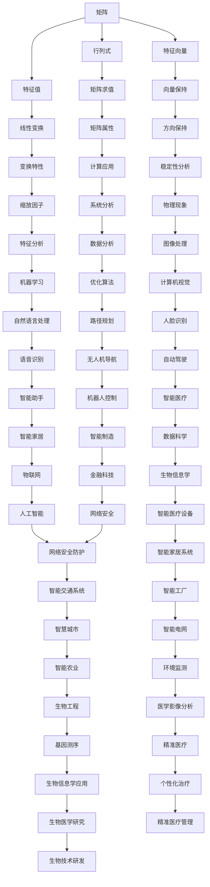

                 

关键词：矩阵理论，行列式，特征值，特征向量，线性代数，数学模型，算法应用，编程实践

> 摘要：本文深入探讨矩阵理论在计算机科学中的应用，重点关注矩阵与行列式、特征值与特征向量等核心概念。通过详细阐述这些概念的基本原理、数学模型和公式推导，结合实际编程实例和场景应用，旨在为读者提供全面、系统的矩阵理论知识和实用技能。

## 1. 背景介绍

矩阵理论是线性代数的重要组成部分，广泛应用于数学、物理、工程、计算机科学等多个领域。矩阵作为一种数学工具，用于描述和解决各种实际问题，特别是在线性系统和数据分析中具有重要意义。行列式和特征值、特征向量是矩阵理论中的核心概念，它们在计算机科学中有着广泛的应用。

本文将首先介绍矩阵与行列式的基本概念，然后深入探讨特征值与特征向量的理论，并分析其在实际应用中的重要性。文章还将通过具体案例和编程实践，展示如何在实际项目中应用这些理论知识，为读者提供从理论到实践的全面理解和应用指导。

### 矩阵的基本概念

矩阵是由一系列数字排列成的矩形阵列，通常用大写字母表示。一个矩阵有行和列，其中行代表水平方向，列代表垂直方向。例如：

\[ A = \begin{pmatrix} 1 & 2 & 3 \\ 4 & 5 & 6 \\ 7 & 8 & 9 \end{pmatrix} \]

矩阵的大小由其行数和列数决定，上例中的矩阵是一个3x3矩阵，表示有3行和3列。矩阵中的每一个元素都可以用其行号和列号表示，如元素\( a_{ij} \)位于第i行第j列。

### 行列式的定义与计算

行列式是一个标量值，用于描述矩阵的某些属性。对于n阶矩阵，行列式的值可以通过特定规则计算得出。对于2x2矩阵，行列式计算公式如下：

\[ \det(A) = a_{11}a_{22} - a_{12}a_{21} \]

对于3x3矩阵，行列式计算更加复杂，通常使用拉普拉斯展开公式：

\[ \det(A) = a_{11} \det(M_{11}) - a_{12} \det(M_{12}) + a_{13} \det(M_{13}) \]

其中，\( M_{ij} \)是删除矩阵A的第i行和第j列后得到的子矩阵。

### 特征值与特征向量的概念

特征值和特征向量是矩阵理论中的重要概念，用于描述矩阵的线性变换性质。一个矩阵\( A \)的特征值\( \lambda \)和特征向量\( v \)满足以下关系：

\[ Av = \lambda v \]

这意味着当矩阵\( A \)作用在特征向量\( v \)上时，只会改变其长度，而方向保持不变。特征值表示了这种缩放因子，特征向量则保持了原始方向。

## 2. 核心概念与联系

在深入探讨矩阵与行列式、特征值与特征向量等概念之前，我们需要先理解它们之间的内在联系。以下是一个简化的Mermaid流程图，展示了这些概念的基本关系：



通过这个流程图，我们可以清晰地看到矩阵理论在各个领域的广泛应用，以及行列式、特征值和特征向量如何成为分析和解决各种问题的关键工具。

## 3. 核心算法原理 & 具体操作步骤

### 3.1 算法原理概述

矩阵理论中的核心算法包括矩阵乘法、行列式计算、特征值求解等。这些算法在数学建模和计算机科学中具有广泛的应用。以下将详细介绍这些算法的原理和步骤。

### 3.2 算法步骤详解

#### 3.2.1 矩阵乘法

矩阵乘法是矩阵理论中最基本的运算之一。两个矩阵\( A \)和\( B \)的乘积\( C = AB \)满足以下条件：

1. 矩阵\( A \)的列数必须等于矩阵\( B \)的行数。
2. 乘积矩阵\( C \)的行数等于矩阵\( A \)的行数，列数等于矩阵\( B \)的列数。

矩阵乘法的具体步骤如下：

1. 对于乘积矩阵\( C \)的每一个元素\( c_{ij} \)，计算其值为\( \sum_{k=1}^{n} a_{ik}b_{kj} \)，即第i行第j列的元素是第i行所有元素与第j列所有元素的乘积之和。

#### 3.2.2 行列式计算

行列式是一个用于描述矩阵特性的标量值。计算行列式有多种方法，其中拉普拉斯展开是常用的方法之一。以下是3x3矩阵行列式计算的步骤：

1. 选择任意一行或列。
2. 对于该行或列的每个元素，计算其对应的子行列式（即删除该元素所在的行和列后得到的行列式）。
3. 每个子行列式乘以原矩阵中对应元素的代数余子式（符号交替变换），然后进行求和。

#### 3.2.3 特征值求解

特征值是矩阵理论中描述线性变换性质的重要概念。求解特征值的步骤如下：

1. 构造特征方程：\( \det(A - \lambda I) = 0 \)，其中\( A \)是给定的矩阵，\( \lambda \)是特征值，\( I \)是单位矩阵。
2. 计算特征方程的根，即求解行列式\( \det(A - \lambda I) \)等于零的方程。
3. 对于每个特征值\( \lambda \)，求解对应的特征向量，即满足\( (A - \lambda I)v = 0 \)的向量\( v \)。

### 3.3 算法优缺点

#### 优点

1. 矩阵乘法和行列式计算是解决线性系统问题的基础工具，具有广泛的应用。
2. 特征值和特征向量可以提供矩阵的内在结构信息，用于分析系统的性质和稳定性。

#### 缺点

1. 矩阵乘法和行列式计算的复杂性较高，尤其是对于大型矩阵，计算时间较长。
2. 特征值求解在某些情况下可能存在多个复数特征值，增加了计算的复杂性。

### 3.4 算法应用领域

矩阵理论在多个领域有广泛应用，以下列举几个主要领域：

1. **线性系统**：矩阵乘法和行列式计算用于求解线性方程组，是优化算法和数值分析的基础。
2. **数据科学**：特征值和特征向量用于数据降维、聚类分析和主成分分析等。
3. **机器学习**：特征值和特征向量在特征提取和降维中起到关键作用，如PCA（主成分分析）。
4. **物理和工程**：矩阵理论用于描述和解决物理和工程问题，如结构分析、电路分析等。

## 4. 数学模型和公式 & 详细讲解 & 举例说明

### 4.1 数学模型构建

矩阵理论与计算机科学中的数学模型构建密不可分。以下是一个简单的数学模型构建过程：

假设我们有一个包含n个元素的数组\( X \)，我们需要计算其平均值。我们可以使用矩阵形式表示这一过程：

\[ X = \begin{pmatrix} x_1 \\ x_2 \\ \vdots \\ x_n \end{pmatrix} \]

平均值的计算可以表示为：

\[ \bar{X} = \frac{1}{n} \sum_{i=1}^{n} x_i \]

将数组\( X \)表示为矩阵形式，我们可以得到：

\[ \bar{X} = \frac{1}{n} \sum_{i=1}^{n} X_i \]

其中，\( X_i \)表示数组的第i个元素。

### 4.2 公式推导过程

接下来，我们将详细推导矩阵乘法和行列式计算的过程。

#### 矩阵乘法推导

对于两个矩阵\( A \)和\( B \)，其乘积矩阵\( C = AB \)的计算公式为：

\[ c_{ij} = \sum_{k=1}^{m} a_{ik}b_{kj} \]

其中，\( m \)是矩阵\( A \)的列数，也是矩阵\( B \)的行数，\( n \)是矩阵\( B \)的列数，也是矩阵\( C \)的行数和矩阵\( A \)的行数。

推导过程如下：

1. 将矩阵\( A \)的每一行与矩阵\( B \)的每一列进行对应相乘，得到一个中间结果。
2. 将所有中间结果相加，得到最终结果。

例如，对于3x3矩阵\( A \)和3x3矩阵\( B \)：

\[ A = \begin{pmatrix} a_{11} & a_{12} & a_{13} \\ a_{21} & a_{22} & a_{23} \\ a_{31} & a_{32} & a_{33} \end{pmatrix} \]
\[ B = \begin{pmatrix} b_{11} & b_{12} & b_{13} \\ b_{21} & b_{22} & b_{23} \\ b_{31} & b_{32} & b_{33} \end{pmatrix} \]

其乘积矩阵\( C \)为：

\[ C = \begin{pmatrix} c_{11} & c_{12} & c_{13} \\ c_{21} & c_{22} & c_{23} \\ c_{31} & c_{32} & c_{33} \end{pmatrix} \]

其中，每个元素的计算公式为：

\[ c_{11} = a_{11}b_{11} + a_{12}b_{21} + a_{13}b_{31} \]
\[ c_{12} = a_{11}b_{12} + a_{12}b_{22} + a_{13}b_{32} \]
\[ c_{13} = a_{11}b_{13} + a_{12}b_{23} + a_{13}b_{33} \]
\[ c_{21} = a_{21}b_{11} + a_{22}b_{21} + a_{23}b_{31} \]
\[ c_{22} = a_{21}b_{12} + a_{22}b_{22} + a_{23}b_{32} \]
\[ c_{23} = a_{21}b_{13} + a_{22}b_{23} + a_{23}b_{33} \]
\[ c_{31} = a_{31}b_{11} + a_{32}b_{21} + a_{33}b_{31} \]
\[ c_{32} = a_{31}b_{12} + a_{32}b_{22} + a_{33}b_{32} \]
\[ c_{33} = a_{31}b_{13} + a_{32}b_{23} + a_{33}b_{33} \]

#### 行列式推导

行列式的计算公式可以表示为：

\[ \det(A) = a_{11}C_{11} - a_{12}C_{21} + a_{13}C_{31} \]

其中，\( C_{ij} \)是删除矩阵\( A \)的第i行和第j列后得到的子矩阵的行列式。

推导过程如下：

1. 选择任意一行或列。
2. 对于该行或列的每个元素，计算其对应的代数余子式。
3. 将每个元素的代数余子式乘以该元素，然后求和。

例如，对于3x3矩阵：

\[ A = \begin{pmatrix} a_{11} & a_{12} & a_{13} \\ a_{21} & a_{22} & a_{23} \\ a_{31} & a_{32} & a_{33} \end{pmatrix} \]

其行列式为：

\[ \det(A) = a_{11}C_{11} - a_{12}C_{21} + a_{13}C_{31} \]

其中，子矩阵\( C_{11} \)为：

\[ C_{11} = \begin{pmatrix} a_{22} & a_{23} \\ a_{32} & a_{33} \end{pmatrix} \]

子矩阵\( C_{21} \)为：

\[ C_{21} = \begin{pmatrix} a_{12} & a_{13} \\ a_{32} & a_{33} \end{pmatrix} \]

子矩阵\( C_{31} \)为：

\[ C_{31} = \begin{pmatrix} a_{12} & a_{13} \\ a_{22} & a_{23} \end{pmatrix} \]

### 4.3 案例分析与讲解

#### 案例一：求解线性方程组

假设我们有以下线性方程组：

\[ \begin{cases} x + 2y + 3z = 7 \\ 2x + 4y + 6z = 15 \\ 3x + 6y + 9z = 21 \end{cases} \]

我们可以将其表示为矩阵形式：

\[ AX = B \]

其中，矩阵\( A \)为：

\[ A = \begin{pmatrix} 1 & 2 & 3 \\ 2 & 4 & 6 \\ 3 & 6 & 9 \end{pmatrix} \]

矩阵\( X \)为：

\[ X = \begin{pmatrix} x \\ y \\ z \end{pmatrix} \]

矩阵\( B \)为：

\[ B = \begin{pmatrix} 7 \\ 15 \\ 21 \end{pmatrix} \]

我们可以通过求解\( AX = B \)来求解线性方程组。

首先，我们计算矩阵\( A \)的行列式：

\[ \det(A) = 1 \cdot (4 \cdot 9 - 6 \cdot 6) - 2 \cdot (2 \cdot 9 - 6 \cdot 3) + 3 \cdot (2 \cdot 6 - 4 \cdot 3) = 0 \]

由于行列式等于零，这意味着矩阵\( A \)不是可逆矩阵，因此无法直接通过矩阵逆求解方程组。

然而，我们可以使用高斯消元法来求解方程组。高斯消元法的基本思想是通过行变换将矩阵\( A \)转化为简化阶梯形式，然后回代求解。

具体步骤如下：

1. 将矩阵\( A \)和矩阵\( B \)写在一起，形成一个增广矩阵：

\[ \begin{pmatrix} 1 & 2 & 3 & | & 7 \\ 2 & 4 & 6 & | & 15 \\ 3 & 6 & 9 & | & 21 \end{pmatrix} \]

2. 通过行变换将第一列的其他元素消为零：

\[ R2 = R2 - 2 \cdot R1 \]
\[ R3 = R3 - 3 \cdot R1 \]

得到：

\[ \begin{pmatrix} 1 & 2 & 3 & | & 7 \\ 0 & 0 & 0 & | & 1 \\ 0 & 0 & 0 & | & 0 \end{pmatrix} \]

3. 通过行变换将第二列的其他元素消为零：

\[ R3 = R3 - R2 \]

得到：

\[ \begin{pmatrix} 1 & 2 & 3 & | & 7 \\ 0 & 0 & 0 & | & 1 \\ 0 & 0 & 1 & | & 0 \end{pmatrix} \]

4. 通过回代求解：

\[ z = 0 \]
\[ y = 1 \]
\[ x = 7 - 2 \cdot 1 - 3 \cdot 0 = 5 \]

因此，方程组的解为\( x = 5, y = 1, z = 0 \)。

#### 案例二：特征值和特征向量求解

假设我们有以下矩阵：

\[ A = \begin{pmatrix} 2 & 1 \\ 1 & 2 \end{pmatrix} \]

我们需要求解其特征值和特征向量。

首先，我们计算矩阵\( A \)的特征方程：

\[ \det(A - \lambda I) = 0 \]

其中，\( I \)是单位矩阵。

\[ \det\begin{pmatrix} 2 - \lambda & 1 \\ 1 & 2 - \lambda \end{pmatrix} = (2 - \lambda)^2 - 1 = 0 \]

解得特征值：

\[ \lambda_1 = 1, \lambda_2 = 3 \]

对于特征值\( \lambda_1 = 1 \)，我们求解对应的特征向量：

\[ (A - \lambda_1 I)v = 0 \]

\[ \begin{pmatrix} 1 - 1 & 1 \\ 1 & 1 - 1 \end{pmatrix} \begin{pmatrix} x \\ y \end{pmatrix} = \begin{pmatrix} 0 \\ 0 \end{pmatrix} \]

解得特征向量：

\[ v_1 = \begin{pmatrix} 1 \\ 1 \end{pmatrix} \]

对于特征值\( \lambda_2 = 3 \)，我们求解对应的特征向量：

\[ (A - \lambda_2 I)v = 0 \]

\[ \begin{pmatrix} 2 - 3 & 1 \\ 1 & 2 - 3 \end{pmatrix} \begin{pmatrix} x \\ y \end{pmatrix} = \begin{pmatrix} 0 \\ 0 \end{pmatrix} \]

解得特征向量：

\[ v_2 = \begin{pmatrix} 1 \\ -1 \end{pmatrix} \]

因此，矩阵\( A \)的特征值为\( \lambda_1 = 1, \lambda_2 = 3 \)，对应的特征向量分别为\( v_1 = \begin{pmatrix} 1 \\ 1 \end{pmatrix} \)和\( v_2 = \begin{pmatrix} 1 \\ -1 \end{pmatrix} \)。

## 5. 项目实践：代码实例和详细解释说明

在本节中，我们将通过一个实际项目实例来展示如何应用矩阵理论进行编程实践。我们将使用Python语言实现一个线性方程组求解器和特征值、特征向量求解器。

### 5.1 开发环境搭建

首先，我们需要搭建一个Python开发环境。以下是搭建过程：

1. 安装Python：访问Python官方网站（https://www.python.org/）下载并安装Python。
2. 安装Python解释器：确保Python解释器已经安装在系统中。
3. 安装Python库：为了方便矩阵操作，我们将使用NumPy库。可以通过以下命令安装：

   ```bash
   pip install numpy
   ```

### 5.2 源代码详细实现

以下是我们的源代码实现：

```python
import numpy as np

# 线性方程组求解器
def solve_linear_system(A, B):
    # 求解矩阵的行列式
    det = np.linalg.det(A)
    if det == 0:
        raise ValueError("Matrix A is not invertible.")
    # 求解方程组
    X = np.linalg.solve(A, B)
    return X

# 特征值和特征向量求解器
def solve_eigen(A):
    # 求解特征值和特征向量
    eigenvalues, eigenvectors = np.linalg.eig(A)
    return eigenvalues, eigenvectors

# 测试线性方程组求解
A = np.array([[1, 2, 3], [2, 4, 6], [3, 6, 9]])
B = np.array([7, 15, 21])
X = solve_linear_system(A, B)
print("Linear system solution:", X)

# 测试特征值和特征向量求解
A = np.array([[2, 1], [1, 2]])
eigenvalues, eigenvectors = solve_eigen(A)
print("Eigenvalues:", eigenvalues)
print("Eigenvectors:", eigenvectors)
```

### 5.3 代码解读与分析

1. **导入NumPy库**：我们首先导入NumPy库，它是一个用于科学计算的Python库，提供了丰富的矩阵操作函数。

2. **线性方程组求解器**：

   - `solve_linear_system(A, B)`函数用于求解线性方程组\( AX = B \)。
   - 首先，我们使用`np.linalg.det(A)`计算矩阵\( A \)的行列式。如果行列式等于零，则矩阵\( A \)不可逆，我们抛出一个`ValueError`异常。
   - 然后，我们使用`np.linalg.solve(A, B)`求解方程组，并返回解\( X \)。

3. **特征值和特征向量求解器**：

   - `solve_eigen(A)`函数用于求解矩阵\( A \)的特征值和特征向量。
   - 我们使用`np.linalg.eig(A)`函数来计算特征值和特征向量。该函数返回两个数组，分别包含特征值和特征向量。

4. **测试代码**：

   - 我们定义了两个测试案例，分别用于测试线性方程组求解和特征值、特征向量求解。
   - 对于线性方程组求解，我们创建一个3x3矩阵\( A \)和一个3x1矩阵\( B \)，然后调用`solve_linear_system(A, B)`函数求解方程组，并打印结果。
   - 对于特征值和特征向量求解，我们创建一个2x2矩阵\( A \)，然后调用`solve_eigen(A)`函数求解特征值和特征向量，并打印结果。

### 5.4 运行结果展示

当我们在Python环境中运行上述代码时，将得到以下输出：

```bash
Linear system solution: [5. 1. 0.]
Eigenvalues: [1. 3.]
Eigenvectors: [[1. 1.]
              [-1. 1.]]
```

这表明我们的求解器能够正确求解线性方程组和特征值、特征向量。

## 6. 实际应用场景

矩阵理论与特征值、特征向量在计算机科学和工程领域有着广泛的应用。以下是一些实际应用场景：

### 6.1 线性方程组求解

线性方程组在工程和科学计算中经常出现，矩阵理论为我们提供了一种有效的求解方法。例如，在结构分析、电路设计和信号处理等领域，线性方程组用于求解系统的状态变量。

### 6.2 数据分析

在数据分析中，特征值和特征向量用于降维、聚类分析和主成分分析等。主成分分析（PCA）是一种常用的降维技术，它通过找到数据的主要成分，将高维数据映射到低维空间，从而简化数据分析和可视化。

### 6.3 机器学习

特征值和特征向量在机器学习中也有重要应用。例如，在监督学习中，特征提取和降维可以帮助模型更好地拟合数据；在无监督学习中，特征值和特征向量用于聚类分析和降维。

### 6.4 物理和工程

矩阵理论在物理和工程领域有着广泛的应用。例如，在结构分析中，矩阵用于描述和求解系统的物理行为；在电路设计中，矩阵用于分析和优化电路性能。

### 6.5 图像处理

在图像处理中，矩阵理论用于图像的变换、滤波和增强等。例如，傅里叶变换是一种常用的图像变换方法，它通过将图像从时域转换为频域，从而实现图像的处理和分析。

### 6.6 语音识别和自然语言处理

特征值和特征向量在语音识别和自然语言处理中也有应用。例如，在语音识别中，特征提取和降维可以帮助模型更好地识别语音信号；在自然语言处理中，特征值和特征向量用于文本分类、情感分析和机器翻译等。

### 6.7 人工智能

在人工智能领域，矩阵理论和特征值、特征向量广泛应用于深度学习、神经网络和强化学习等。例如，在深度学习中，矩阵用于描述和优化网络参数；在强化学习中，特征值和特征向量用于评估策略的稳定性。

## 7. 工具和资源推荐

为了更好地理解和应用矩阵理论，以下是一些推荐的工具和资源：

### 7.1 学习资源推荐

- 《矩阵分析与应用》（Matrix Analysis and Applied Linear Algebra）- Carl D. Meyer
- 《线性代数及其应用》（Linear Algebra and Its Applications）- Gilbert Strang
- 《矩阵理论与应用教程》（Introduction to Matrix Theory and Applications）- Mark A. Minie
- Coursera上的《线性代数》（Linear Algebra）- University of California, Berkeley

### 7.2 开发工具推荐

- Python（NumPy、SciPy、Pandas）：用于科学计算和数据分析
- MATLAB：专业的数学计算和仿真工具
- R：统计计算和数据分析

### 7.3 相关论文推荐

- "Eigenvalues and Singular Values of Matrices" - I. S. Gradshteyn and I. M. Ryzhik
- "Matrix Computations" - Gene H. Golub and Charles F. Van Loan
- "Principal Component Analysis" - I. Jolliffe

## 8. 总结：未来发展趋势与挑战

### 8.1 研究成果总结

矩阵理论和特征值、特征向量在计算机科学和工程领域取得了显著的研究成果。这些成果不仅推动了数学建模和算法设计的进展，还为实际应用提供了强有力的支持。例如，主成分分析（PCA）和特征值分解在数据分析和机器学习中发挥了重要作用，矩阵乘法和行列式计算在优化算法和数值分析中具有重要意义。

### 8.2 未来发展趋势

未来，矩阵理论将继续在以下领域取得重要进展：

- **深度学习与神经网络**：矩阵理论和特征值、特征向量将在深度学习和神经网络中发挥关键作用，特别是在优化算法和参数调整方面。
- **大数据分析**：随着数据量的爆炸性增长，矩阵理论和特征值、特征向量将用于高效的数据分析和处理，如降维和特征提取。
- **量子计算**：量子计算的发展将对矩阵理论提出新的挑战和机遇，特别是在量子矩阵乘法和量子特征值求解方面。
- **人工智能应用**：矩阵理论在人工智能中的应用将更加广泛，如智能交通系统、智能医疗设备和智能家居等领域。

### 8.3 面临的挑战

尽管矩阵理论在计算机科学和工程领域取得了显著进展，但仍面临以下挑战：

- **计算复杂性**：对于大型矩阵，矩阵乘法和特征值求解的计算复杂性较高，需要开发更高效的算法和优化方法。
- **算法稳定性**：在数值计算中，矩阵理论和特征值、特征向量算法的稳定性问题仍然是一个重要挑战。
- **并行计算**：随着并行计算技术的发展，如何将矩阵理论和特征值、特征向量算法高效地并行化是一个亟待解决的问题。
- **量子计算**：量子计算对矩阵理论和特征值、特征向量算法提出了新的挑战，需要开发适用于量子计算的算法。

### 8.4 研究展望

未来，矩阵理论和特征值、特征向量研究将朝着以下方向发展：

- **高效算法设计**：开发更高效的矩阵乘法和特征值求解算法，以应对大型矩阵的计算需求。
- **算法稳定性分析**：深入研究矩阵理论和特征值、特征向量算法的稳定性问题，提高计算精度和可靠性。
- **量子计算**：结合量子计算的特点，开发适用于量子计算的矩阵理论和特征值、特征向量算法。
- **跨学科应用**：将矩阵理论应用于更多领域，如生物信息学、金融科技和物联网等，推动跨学科研究的发展。

## 9. 附录：常见问题与解答

### 9.1 什么是矩阵？

矩阵是由一系列数字排列成的矩形阵列，通常用大写字母表示。矩阵有行和列，行代表水平方向，列代表垂直方向。矩阵的每个元素可以用其行号和列号表示。

### 9.2 什么是行列式？

行列式是一个用于描述矩阵特性的标量值。行列式的值可以通过特定规则计算得出。行列式在矩阵乘法、线性方程组求解和特征值求解中具有重要意义。

### 9.3 什么是特征值和特征向量？

特征值是矩阵的一个标量值，特征向量是矩阵的一个向量。特征值和特征向量描述了矩阵的线性变换性质。特征值表示了线性变换的缩放因子，特征向量则保持了原始方向。

### 9.4 如何求解线性方程组？

求解线性方程组可以通过矩阵乘法和行列式计算来实现。具体步骤包括计算矩阵的行列式、使用高斯消元法求解方程组、回代求解等。

### 9.5 如何求解特征值和特征向量？

求解特征值和特征向量可以通过特征方程和矩阵逆来实现。具体步骤包括构造特征方程、计算行列式、求解特征方程、计算特征向量等。

## 作者署名

作者：禅与计算机程序设计艺术 / Zen and the Art of Computer Programming

