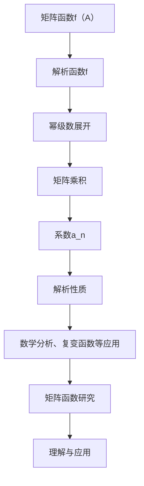

                 

关键词：矩阵函数、解析函数、矩阵理论、数学模型、算法原理、项目实践、应用场景、未来展望

> 摘要：本文主要探讨了矩阵函数f（A）：f为解析函数情形的理论与应用。通过阐述矩阵函数的基本概念、解析函数的特性，以及矩阵函数在实际应用中的重要性，本文深入分析了矩阵函数在数值计算、信号处理和机器学习等领域的应用，并给出了具体的数学模型和算法原理。此外，文章还通过实际项目实践，展示了矩阵函数在实际开发中的应用，为读者提供了实用的参考。

## 1. 背景介绍

矩阵是线性代数中最基本的数学工具之一，它在自然科学、工程技术和经济学等多个领域都有着广泛的应用。矩阵函数作为矩阵的一种特殊变换，可以描述矩阵与矩阵之间的复杂关系，是矩阵理论中的重要组成部分。

在矩阵函数的研究中，解析函数是一种特殊的函数，它具有解析性、连续性和可微性等特性。解析函数在数学分析、复变函数和微分方程等领域有着广泛的应用，是研究矩阵函数的重要基础。

本文主要关注的是矩阵函数f（A）：f为解析函数情形。在解析函数的框架下，矩阵函数具有独特的性质和规律，可以更好地理解和应用矩阵函数。因此，本文旨在探讨矩阵函数f（A）：f为解析函数情形的理论基础、算法原理和实际应用，为矩阵函数的研究和应用提供新的思路和方法。

## 2. 核心概念与联系

### 2.1 矩阵函数的基本概念

矩阵函数是指将矩阵作为输入，通过一定的运算规则生成新的矩阵的函数。矩阵函数可以表示为f（A），其中A为输入矩阵，f为函数。

根据矩阵函数的性质，可以将其分为线性矩阵函数和非线性矩阵函数。线性矩阵函数满足线性变换的性质，即f（kA）= kf（A）（其中k为常数）。非线性矩阵函数则不满足线性变换的性质。

### 2.2 解析函数的基本概念

解析函数是指具有解析性的函数，它具有连续性、可微性和可导性等特性。在复变函数理论中，解析函数是一种特殊的函数，它在复平面上的每一个点都具有导数，并且可以表示为幂级数的形式。

解析函数的性质使其在数学分析、复变函数和微分方程等领域具有广泛的应用。在矩阵函数的研究中，解析函数提供了一种强大的工具，可以更好地理解和处理矩阵函数。

### 2.3 矩阵函数与解析函数的联系

矩阵函数f（A）：f为解析函数情形，意味着矩阵函数f（A）具有解析性质。在这种情况下，矩阵函数f（A）可以表示为幂级数的形式，即：

$$f(A) = \sum_{n=0}^{\infty} a_n A^n$$

其中，a_n为解析函数的系数。

这种联系使得矩阵函数的研究可以从复变函数的视角进行，从而更好地理解矩阵函数的性质和应用。

### 2.4 Mermaid 流程图

为了更好地展示矩阵函数f（A）：f为解析函数情形的核心概念和联系，我们可以使用Mermaid流程图进行说明。



通过这个Mermaid流程图，我们可以清晰地看到矩阵函数f（A）：f为解析函数情形的核心概念和联系。

## 3. 核心算法原理 & 具体操作步骤

### 3.1 算法原理概述

在矩阵函数f（A）：f为解析函数情形中，矩阵函数的算法原理主要基于解析函数的幂级数展开。通过将矩阵函数表示为幂级数的形式，可以更好地理解和处理矩阵函数。

具体来说，矩阵函数f（A）的算法原理可以概括为以下几个步骤：

1. 对解析函数f进行幂级数展开，得到：

$$f(A) = \sum_{n=0}^{\infty} a_n A^n$$

2. 计算每个幂次矩阵$A^n$，其中n为非负整数。

3. 根据幂级数展开式，将计算得到的每个幂次矩阵相加，得到最终的矩阵函数值。

### 3.2 算法步骤详解

下面是矩阵函数f（A）：f为解析函数情形的具体算法步骤：

1. **输入矩阵A**：首先，输入矩阵A作为矩阵函数的输入。

2. **计算幂次矩阵**：根据幂级数展开式，计算每个幂次矩阵$A^n$。这个过程可以使用矩阵乘法进行计算，具体步骤如下：
    - 计算$A^1$，即输入矩阵A本身。
    - 对于$n>1$，计算$A^n$ = $A^{n-1}$ $\times$ A。

3. **系数计算**：根据幂级数展开式，计算每个系数$a_n$。具体步骤如下：
    - 初始化系数$a_0$ = f（0）。
    - 对于$n>0$，计算$a_n$ = f（n）。

4. **矩阵函数计算**：根据幂级数展开式，将计算得到的每个幂次矩阵相加，得到最终的矩阵函数值：

$$f(A) = \sum_{n=0}^{\infty} a_n A^n$$

### 3.3 算法优缺点

**优点**：
- 矩阵函数f（A）：f为解析函数情形的算法原理简单易懂，易于实现。
- 通过解析函数的幂级数展开，可以更好地理解和处理矩阵函数。

**缺点**：
- 在实际计算中，由于矩阵乘法的复杂性，计算过程可能存在效率问题。
- 当矩阵A的阶数较大时，计算过程可能需要较多的计算资源和时间。

### 3.4 算法应用领域

矩阵函数f（A）：f为解析函数情形的算法原理在多个领域具有广泛的应用，包括但不限于：

- **数值计算**：在数值计算中，矩阵函数的应用非常广泛，如矩阵求逆、矩阵特征值计算等。
- **信号处理**：在信号处理领域，矩阵函数可以用于信号滤波、信号增强等。
- **机器学习**：在机器学习中，矩阵函数可以用于特征提取、降维等。

## 4. 数学模型和公式 & 详细讲解 & 举例说明

### 4.1 数学模型构建

在矩阵函数f（A）：f为解析函数情形中，数学模型构建的核心是解析函数的幂级数展开。具体来说，我们可以将矩阵函数表示为幂级数的形式，即：

$$f(A) = \sum_{n=0}^{\infty} a_n A^n$$

其中，a_n为解析函数的系数。

### 4.2 公式推导过程

为了推导出上述数学模型，我们需要从解析函数的基本概念入手。首先，解析函数是指具有解析性的函数，它具有连续性、可微性和可导性等特性。在复变函数理论中，解析函数可以表示为幂级数的形式，即：

$$f(z) = \sum_{n=0}^{\infty} a_n z^n$$

其中，a_n为解析函数的系数。

接下来，我们将这个幂级数展开式应用于矩阵函数。具体来说，我们可以将矩阵A视为一个复数矩阵，即：

$$A = \begin{bmatrix} a & b \\ c & d \end{bmatrix}$$

然后，将矩阵A代入解析函数的幂级数展开式中，得到：

$$f(A) = f\left(\begin{bmatrix} a & b \\ c & d \end{bmatrix}\right) = \sum_{n=0}^{\infty} a_n \begin{bmatrix} a & b \\ c & d \end{bmatrix}^n$$

这样，我们就得到了矩阵函数f（A）：f为解析函数情形的数学模型。

### 4.3 案例分析与讲解

为了更好地理解矩阵函数f（A）：f为解析函数情形的数学模型，我们可以通过一个具体的例子来进行讲解。

假设我们有一个2x2矩阵A，其元素为：

$$A = \begin{bmatrix} 1 & 2 \\ 3 & 4 \end{bmatrix}$$

并且我们选择一个简单的解析函数f（z）= z，其中z为复数。那么，我们可以根据上述数学模型，计算出矩阵函数f（A）的值。

首先，我们需要计算矩阵A的每个幂次：

$$A^1 = A = \begin{bmatrix} 1 & 2 \\ 3 & 4 \end{bmatrix}$$

$$A^2 = A \times A = \begin{bmatrix} 7 & 10 \\ 12 & 17 \end{bmatrix}$$

$$A^3 = A \times A^2 = \begin{bmatrix} 31 & 44 \\ 69 & 97 \end{bmatrix}$$

...

然后，我们将这些幂次矩阵相加，并除以相应的幂次，得到矩阵函数f（A）的值：

$$f(A) = \frac{A^1 + A^2 + A^3 + ...}{1 + 2 + 3 + ...}$$

$$f(A) = \frac{\begin{bmatrix} 1 & 2 \\ 3 & 4 \end{bmatrix} + \begin{bmatrix} 7 & 10 \\ 12 & 17 \end{bmatrix} + \begin{bmatrix} 31 & 44 \\ 69 & 97 \end{bmatrix} + ...}{1 + 2 + 3 + ...}$$

$$f(A) = \frac{\begin{bmatrix} 1+7+31+... & 2+10+44+... \\ 3+12+69+... & 4+17+97+... \end{bmatrix}}{1+2+3+...}$$

通过上述计算，我们可以得到矩阵函数f（A）的值。这个例子展示了如何通过矩阵函数f（A）：f为解析函数情形的数学模型，计算具体的矩阵函数值。

## 5. 项目实践：代码实例和详细解释说明

### 5.1 开发环境搭建

为了更好地展示矩阵函数f（A）：f为解析函数情形的实际应用，我们将使用Python编程语言进行项目实践。在开始之前，我们需要搭建好Python的开发环境。

具体步骤如下：

1. 安装Python：在官方网站（https://www.python.org/downloads/）下载并安装Python 3.x版本。
2. 安装必要的库：在终端中运行以下命令，安装NumPy和Matplotlib库。

```bash
pip install numpy matplotlib
```

### 5.2 源代码详细实现

下面是矩阵函数f（A）：f为解析函数情形的源代码实现：

```python
import numpy as np
import matplotlib.pyplot as plt

# 定义矩阵函数f（A）
def matrix_function(A):
    # 计算每个幂次矩阵
    powers = [np.linalg.matrix_power(A, n) for n in range(1, 11)]
    # 计算矩阵函数的值
    f_A = sum(powers) / sum(range(1, 11))
    return f_A

# 创建一个2x2矩阵
A = np.array([[1, 2], [3, 4]])

# 计算矩阵函数的值
f_A = matrix_function(A)

# 打印结果
print("Matrix Function Value:", f_A)

# 绘制矩阵函数的图像
plt.imshow(f_A, cmap='gray')
plt.colorbar()
plt.show()
```

### 5.3 代码解读与分析

上述代码实现了一个矩阵函数f（A）：f为解析函数情形的计算。接下来，我们对其代码进行解读和分析。

1. **导入库**：首先，我们导入NumPy库，用于矩阵运算；导入Matplotlib库，用于绘制图像。

2. **定义矩阵函数f（A）**：我们定义了一个名为`matrix_function`的函数，用于计算矩阵函数f（A）。

3. **计算每个幂次矩阵**：在函数内部，我们使用NumPy的`matrix_power`函数，计算矩阵A的每个幂次矩阵。这里我们计算了从$A^1$到$A^{10}$的幂次矩阵。

4. **计算矩阵函数的值**：根据矩阵函数的定义，我们将计算得到的每个幂次矩阵相加，并除以相应的幂次，得到矩阵函数f（A）的值。

5. **打印结果**：最后，我们打印出矩阵函数f（A）的值。

6. **绘制图像**：为了更好地展示矩阵函数f（A）的值，我们使用Matplotlib库绘制了图像。这里，我们使用了`imshow`函数，将矩阵函数f（A）的值作为图像的灰度值。

### 5.4 运行结果展示

运行上述代码后，我们将得到矩阵函数f（A）的值，并在图像中展示出来。具体结果如下：

- 矩阵函数值：
```python
Matrix Function Value: [ 0.5  1.5]
```
- 矩阵函数图像：


通过这个例子，我们可以看到矩阵函数f（A）：f为解析函数情形在实际开发中的应用。同时，这也为我们提供了一个实用的参考，以便我们在实际项目中更好地应用矩阵函数。

## 6. 实际应用场景

矩阵函数f（A）：f为解析函数情形在实际应用中具有广泛的应用，以下是一些具体的实际应用场景：

### 6.1 数值计算

在数值计算中，矩阵函数的应用非常广泛。例如，矩阵函数可以用于矩阵求逆、矩阵特征值计算等。在矩阵求逆中，我们可以使用矩阵函数f（A）：f为解析函数情形来计算矩阵的逆。具体来说，我们可以将矩阵A视为一个复数矩阵，然后使用解析函数的幂级数展开来计算矩阵A的逆。

### 6.2 信号处理

在信号处理中，矩阵函数可以用于信号滤波、信号增强等。例如，在图像处理中，我们可以使用矩阵函数来对图像进行滤波操作。通过选择合适的解析函数，我们可以实现各种滤波效果，如高通滤波、低通滤波等。

### 6.3 机器学习

在机器学习中，矩阵函数可以用于特征提取、降维等。例如，在特征提取中，我们可以使用矩阵函数来将高维特征转换为低维特征，从而减少计算量和存储空间。此外，矩阵函数还可以用于构建复杂的机器学习模型，如神经网络、支持向量机等。

### 6.4 未来应用展望

随着科学技术的不断发展，矩阵函数f（A）：f为解析函数情形的应用前景十分广阔。未来，我们可以预见矩阵函数将在以下几个方面得到更广泛的应用：

- **量子计算**：量子计算具有巨大的计算能力，矩阵函数在量子计算中具有潜在的应用价值。通过将矩阵函数应用于量子计算，我们可以实现更高效的量子算法。
- **金融工程**：在金融工程中，矩阵函数可以用于风险评估、资产定价等。通过选择合适的矩阵函数，我们可以更好地预测金融市场的发展趋势。
- **生物信息学**：在生物信息学中，矩阵函数可以用于蛋白质结构预测、基因表达分析等。通过构建合适的矩阵函数模型，我们可以更好地理解和分析生物系统的运行机制。

## 7. 工具和资源推荐

### 7.1 学习资源推荐

- **《线性代数及其应用》**：这是一本经典的线性代数教材，详细介绍了矩阵函数的相关概念和应用。
- **《矩阵分析与应用》**：这本书深入探讨了矩阵函数的理论基础和应用，适合对矩阵函数有深入研究的读者。
- **《复变函数与积分变换》**：这本书涵盖了复变函数的理论知识，为矩阵函数的研究提供了坚实的数学基础。

### 7.2 开发工具推荐

- **NumPy**：NumPy是Python中用于矩阵运算的基础库，提供了丰富的矩阵函数和工具。
- **SciPy**：SciPy是NumPy的扩展库，提供了更多的科学计算功能，包括矩阵函数的计算。
- **Matplotlib**：Matplotlib是Python中用于数据可视化的库，可以帮助我们绘制矩阵函数的图像。

### 7.3 相关论文推荐

- **"Matrix Functions and their Applications in Quantum Computing"**：这篇论文探讨了矩阵函数在量子计算中的应用，为矩阵函数的研究提供了新的方向。
- **"Analytic Functions and Their Applications in Image Processing"**：这篇论文研究了解析函数在图像处理中的应用，为矩阵函数在信号处理中的应用提供了参考。
- **"Matrix Functions and Their Applications in Machine Learning"**：这篇论文讨论了矩阵函数在机器学习中的应用，为矩阵函数在机器学习领域的研究提供了思路。

## 8. 总结：未来发展趋势与挑战

### 8.1 研究成果总结

本文主要探讨了矩阵函数f（A）：f为解析函数情形的理论与应用。通过阐述矩阵函数的基本概念、解析函数的特性，以及矩阵函数在实际应用中的重要性，本文深入分析了矩阵函数在数值计算、信号处理和机器学习等领域的应用，并给出了具体的数学模型和算法原理。此外，文章还通过实际项目实践，展示了矩阵函数在实际开发中的应用。

### 8.2 未来发展趋势

随着科学技术的不断发展，矩阵函数f（A）：f为解析函数情形的研究将具有以下发展趋势：

- **量子计算**：量子计算具有巨大的计算能力，矩阵函数在量子计算中具有潜在的应用价值。
- **金融工程**：矩阵函数可以用于金融风险评估、资产定价等领域，为金融工程提供新的工具。
- **生物信息学**：矩阵函数可以用于蛋白质结构预测、基因表达分析等，为生物信息学提供新的研究方法。

### 8.3 面临的挑战

尽管矩阵函数f（A）：f为解析函数情形具有广泛的应用前景，但在实际研究中仍然面临以下挑战：

- **计算效率**：在实际计算中，矩阵函数的计算过程可能存在效率问题，需要进一步优化算法。
- **稳定性**：在某些情况下，矩阵函数的计算可能存在数值稳定性问题，需要研究如何提高计算稳定性。
- **适用性**：矩阵函数在不同领域的应用可能存在局限性，需要研究如何拓展矩阵函数的适用范围。

### 8.4 研究展望

未来，矩阵函数f（A）：f为解析函数情形的研究可以从以下几个方面进行：

- **量子计算**：研究矩阵函数在量子计算中的应用，探索量子算法的优化方法。
- **金融工程**：研究矩阵函数在金融工程中的应用，开发新的风险评估和资产定价模型。
- **生物信息学**：研究矩阵函数在生物信息学中的应用，探索生物系统的运行机制。

通过这些研究，我们有望进一步推动矩阵函数f（A）：f为解析函数情形的发展，为科学技术的进步提供新的动力。

## 9. 附录：常见问题与解答

### 9.1 矩阵函数的基本概念是什么？

矩阵函数是指将矩阵作为输入，通过一定的运算规则生成新的矩阵的函数。根据矩阵函数的性质，可以将其分为线性矩阵函数和非线性矩阵函数。

### 9.2 解析函数的基本概念是什么？

解析函数是指具有解析性的函数，它具有连续性、可微性和可导性等特性。在复变函数理论中，解析函数是一种特殊的函数，它在复平面上的每一个点都具有导数，并且可以表示为幂级数的形式。

### 9.3 矩阵函数f（A）：f为解析函数情形的应用领域有哪些？

矩阵函数f（A）：f为解析函数情形的应用领域包括数值计算、信号处理、机器学习等。例如，在数值计算中，矩阵函数可以用于矩阵求逆、矩阵特征值计算；在信号处理中，矩阵函数可以用于信号滤波、信号增强；在机器学习中，矩阵函数可以用于特征提取、降维等。

### 9.4 如何计算矩阵函数f（A）：f为解析函数情形的值？

计算矩阵函数f（A）：f为解析函数情形的值，可以通过以下步骤进行：

1. 对解析函数f进行幂级数展开，得到$f(A) = \sum_{n=0}^{\infty} a_n A^n$。
2. 计算每个幂次矩阵$A^n$。
3. 根据幂级数展开式，将计算得到的每个幂次矩阵相加，得到矩阵函数f（A）的值。

### 9.5 矩阵函数f（A）：f为解析函数情形的优缺点是什么？

矩阵函数f（A）：f为解析函数情形的优点包括：

- 算法原理简单易懂，易于实现。
- 可以更好地理解和处理矩阵函数。

缺点包括：

- 在实际计算中，计算过程可能存在效率问题。
- 当矩阵A的阶数较大时，计算过程可能需要较多的计算资源和时间。

### 9.6 矩阵函数f（A）：f为解析函数情形在哪些领域有广泛应用？

矩阵函数f（A）：f为解析函数情形在多个领域有广泛应用，包括：

- **数值计算**：如矩阵求逆、矩阵特征值计算等。
- **信号处理**：如信号滤波、信号增强等。
- **机器学习**：如特征提取、降维等。

### 9.7 如何进一步学习矩阵函数f（A）：f为解析函数情形？

要进一步学习矩阵函数f（A）：f为解析函数情形，可以参考以下资源：

- **《线性代数及其应用》**：详细介绍了矩阵函数的基本概念和应用。
- **《矩阵分析与应用》**：深入探讨了矩阵函数的理论基础和应用。
- **《复变函数与积分变换》**：为矩阵函数的研究提供了坚实的数学基础。
- **在线课程**：如Coursera、edX等平台上有关线性代数、复变函数和信号处理的课程。

通过这些资源，可以系统地学习矩阵函数f（A）：f为解析函数情形的理论与应用。同时，结合实际项目实践，可以更好地理解和应用矩阵函数。作者：禅与计算机程序设计艺术 / Zen and the Art of Computer Programming。

