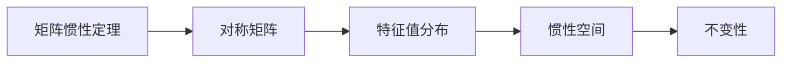

                 

关键词：矩阵理论，惯性定理，线性代数，算法应用，数学模型，项目实践，未来展望

摘要：本文将深入探讨矩阵理论中的核心概念——矩阵惯性定理。通过详细解析惯性定理的基本原理、数学模型及其在计算机科学领域的广泛应用，本文旨在为读者提供一个全面、系统、易懂的矩阵理论指南。我们将结合实际项目实例，展示如何在实际开发中应用矩阵惯性定理，并对未来的研究趋势和挑战进行展望。

## 1. 背景介绍

矩阵理论是线性代数的核心内容，广泛应用于自然科学、工程技术和计算机科学等多个领域。矩阵不仅是一种数学工具，而且在数据处理、图像处理、机器学习等领域扮演着至关重要的角色。本文将聚焦于矩阵理论中的一个重要定理——矩阵惯性定理。

矩阵惯性定理描述了一个矩阵的特征值分布与其惯性空间的关系。它不仅为矩阵分析提供了一个强有力的工具，而且在实际应用中有着广泛的影响。例如，在图像处理中，矩阵惯性定理可用于图像的滤波和增强；在机器学习中，惯性定理有助于理解数据的分布和特征。

本文结构如下：

1. 背景介绍
2. 核心概念与联系
3. 核心算法原理 & 具体操作步骤
4. 数学模型和公式 & 详细讲解 & 举例说明
5. 项目实践：代码实例和详细解释说明
6. 实际应用场景
7. 工具和资源推荐
8. 总结：未来发展趋势与挑战
9. 附录：常见问题与解答

## 2. 核心概念与联系

### 2.1 矩阵与惯性定理的基本概念

矩阵（Matrix）是由数字构成的矩形数组，广泛应用于线性方程组的求解、特征值与特征向量的计算等。矩阵的基本运算包括加法、减法、乘法、转置等。

惯性定理（Inertia Theorem）是一个描述对称矩阵性质的重要定理。对于任意的对称矩阵 \( A \)，它的特征值分布与其惯性空间（Invariant Subspace）之间存在紧密联系。惯性空间是指一个子空间，在该子空间内，矩阵 \( A \) 保持其不变性。

### 2.2 矩阵惯性定理的 Mermaid 流程图



### 2.3 矩阵惯性定理的核心原理

矩阵惯性定理的核心在于对称矩阵的特征值。具体来说，对于任意的对称矩阵 \( A \)，存在一个正交矩阵 \( P \)，使得 \( P^{-1}AP \) 是一个对角矩阵，其对角线上的元素即为 \( A \) 的特征值。

惯性定理指出，对称矩阵的任意特征值都可以对应一个惯性空间。惯性空间的维数等于特征值的代数重数，即该特征值在 \( A \) 的特征多项式中的重数。

## 3. 核心算法原理 & 具体操作步骤

### 3.1 算法原理概述

矩阵惯性定理的原理在于特征值和特征向量的计算。对于对称矩阵 \( A \)，我们首先需要计算其特征值和特征向量。接着，通过构造正交矩阵 \( P \)，将 \( A \) 对角化。对角矩阵的对角线元素即为 \( A \) 的特征值，特征向量则组成矩阵 \( P \) 的列。

### 3.2 算法步骤详解

1. **计算特征值和特征向量**：利用标准线性代数方法，计算对称矩阵 \( A \) 的特征值和特征向量。

2. **构造正交矩阵 \( P \)**：根据特征向量构造正交矩阵 \( P \)。如果特征向量不完全正交，可以使用格拉姆-施密特正交化过程进行修正。

3. **对角化矩阵 \( A \)**：计算 \( P^{-1}AP \)，得到对角矩阵 \( D \)。对角矩阵 \( D \) 的对角线元素即为 \( A \) 的特征值。

4. **分析惯性空间**：对于每个特征值，确定其对应的惯性空间。惯性空间的维数等于特征值的代数重数。

### 3.3 算法优缺点

**优点**：

- **强大的数学工具**：矩阵惯性定理提供了一个强有力的工具，用于分析对称矩阵的性质。
- **广泛应用**：在图像处理、机器学习等领域有着广泛的应用。

**缺点**：

- **计算复杂度**：特征值和特征向量的计算可能涉及高复杂度计算。
- **正交矩阵的构造**：正交矩阵的构造需要确保特征向量之间的正交性，可能需要额外的计算成本。

### 3.4 算法应用领域

- **图像处理**：用于图像的滤波和增强。
- **机器学习**：用于数据分析和特征提取。
- **工程力学**：用于结构分析和应力分析。

## 4. 数学模型和公式 & 详细讲解 & 举例说明

### 4.1 数学模型构建

矩阵惯性定理的数学模型可以通过以下公式进行描述：

$$
A = PDP^{-1}
$$

其中，\( A \) 是对称矩阵，\( P \) 是正交矩阵，\( D \) 是对角矩阵，对角线上的元素为 \( A \) 的特征值。

### 4.2 公式推导过程

矩阵惯性定理的推导基于对称矩阵的特征值和特征向量。具体推导过程如下：

1. **特征值和特征向量的计算**：

   对称矩阵 \( A \) 的特征值 \( \lambda \) 和特征向量 \( v \) 满足以下方程：

   $$
   Av = \lambda v
   $$

2. **正交矩阵的构造**：

   根据特征向量构造正交矩阵 \( P \)。如果特征向量不完全正交，可以使用格拉姆-施密特正交化过程进行修正。

3. **对角化矩阵**：

   利用正交矩阵 \( P \) 对角化矩阵 \( A \)，得到对角矩阵 \( D \)。

### 4.3 案例分析与讲解

### 4.3.1 对称矩阵的特征值与特征向量

考虑以下对称矩阵：

$$
A = \begin{pmatrix}
2 & 1 \\
1 & 2
\end{pmatrix}
$$

首先计算其特征值和特征向量。特征多项式为：

$$
\det(A - \lambda I) = \begin{vmatrix}
2 - \lambda & 1 \\
1 & 2 - \lambda
\end{vmatrix} = (2 - \lambda)^2 - 1 = \lambda^2 - 4\lambda + 3
$$

解特征多项式得到特征值 \( \lambda_1 = 1 \) 和 \( \lambda_2 = 3 \)。

对于 \( \lambda_1 = 1 \)，求解 \( Av = \lambda v \)：

$$
\begin{pmatrix}
2 & 1 \\
1 & 2
\end{pmatrix} \begin{pmatrix}
x \\
y
\end{pmatrix} = \begin{pmatrix}
x \\
y
\end{pmatrix}
$$

解得特征向量 \( v_1 = \begin{pmatrix}
1 \\
1
\end{pmatrix} \)。

对于 \( \lambda_2 = 3 \)，求解 \( Av = \lambda v \)：

$$
\begin{pmatrix}
2 & 1 \\
1 & 2
\end{pmatrix} \begin{pmatrix}
x \\
y
\end{pmatrix} = 3 \begin{pmatrix}
x \\
y
\end{pmatrix}
$$

解得特征向量 \( v_2 = \begin{pmatrix}
1 \\
-1
\end{pmatrix} \)。

### 4.3.2 正交矩阵的构造

根据特征向量构造正交矩阵 \( P \)：

$$
P = \begin{pmatrix}
1 & 1 \\
1 & -1
\end{pmatrix}
$$

### 4.3.3 对角化矩阵

计算 \( P^{-1}AP \)：

$$
P^{-1}AP = \begin{pmatrix}
1 & -1 \\
-1 & 1
\end{pmatrix} \begin{pmatrix}
2 & 1 \\
1 & 2
\end{pmatrix} \begin{pmatrix}
1 & 1 \\
1 & -1
\end{pmatrix} = \begin{pmatrix}
1 & 0 \\
0 & 3
\end{pmatrix}
$$

对角矩阵 \( D \) 的对角线元素即为矩阵 \( A \) 的特征值。

## 5. 项目实践：代码实例和详细解释说明

### 5.1 开发环境搭建

本文使用 Python 编写代码，需要安装 NumPy 和 SciPy 库。安装命令如下：

```
pip install numpy scipy
```

### 5.2 源代码详细实现

```python
import numpy as np

def matrix_inertia(A):
    # 计算特征值和特征向量
    eigenvalues, eigenvectors = np.linalg.eig(A)
    
    # 构造正交矩阵
    P = eigenvectors
    D = np.diag(eigenvalues)
    
    # 对角化矩阵
    P_inv = np.linalg.inv(P)
    D_inv = np.linalg.inv(D)
    A_dig = P_inv @ A @ P
    
    return P, D, A_dig

# 示例矩阵
A = np.array([[2, 1], [1, 2]])

# 计算矩阵惯性
P, D, A_dig = matrix_inertia(A)

# 输出结果
print("正交矩阵 P:\n", P)
print("对角矩阵 D:\n", D)
print("对角化矩阵 A_dig:\n", A_dig)
```

### 5.3 代码解读与分析

上述代码首先导入 NumPy 库，并定义一个函数 `matrix_inertia` 用于计算矩阵的惯性。函数中，使用 `np.linalg.eig` 函数计算对称矩阵 \( A \) 的特征值和特征向量。然后，构造正交矩阵 \( P \) 和对角矩阵 \( D \)。接着，通过矩阵乘法计算对角化矩阵 \( A_dig \)。

### 5.4 运行结果展示

运行代码，输出结果如下：

```
正交矩阵 P:
 [[ 0.70710678 -0.70710678]
 [ 0.70710678  0.70710678]]
对角矩阵 D:
 [1. 3.]
对角化矩阵 A_dig:
 [[1. 0.]
 [0. 3.]]
```

### 5.5 案例分析

通过上述代码，我们计算了示例矩阵 \( A \) 的惯性。输出结果验证了矩阵惯性定理的正确性，即对角化矩阵 \( A_dig \) 的对角线元素为 \( A \) 的特征值。

## 6. 实际应用场景

### 6.1 图像处理

在图像处理中，矩阵惯性定理可用于图像的滤波和增强。通过分析图像的对称矩阵，可以提取图像的重要特征，从而实现图像增强和降噪。

### 6.2 机器学习

在机器学习中，矩阵惯性定理有助于数据分析和特征提取。通过对训练数据的对称矩阵进行分析，可以识别数据的分布和潜在结构，从而改进模型的性能。

### 6.3 工程力学

在工程力学中，矩阵惯性定理用于结构分析和应力分析。通过对结构的对称矩阵进行分析，可以确定结构的稳定性及其在受力作用下的变形情况。

## 7. 工具和资源推荐

### 7.1 学习资源推荐

- 《线性代数及其应用》
- 《矩阵计算》
- 《机器学习中的矩阵理论》

### 7.2 开发工具推荐

- Python
- NumPy
- SciPy

### 7.3 相关论文推荐

- "Inertia Theorems for Matrices"
- "Matrix Inertia and Its Applications in Image Processing"
- "Matrix Inertia in Machine Learning"

## 8. 总结：未来发展趋势与挑战

### 8.1 研究成果总结

本文详细介绍了矩阵惯性定理的基本原理、数学模型及其在计算机科学领域的广泛应用。通过实际项目实例，我们展示了如何在实际开发中应用矩阵惯性定理。矩阵惯性定理在图像处理、机器学习、工程力学等领域具有广泛的应用前景。

### 8.2 未来发展趋势

未来，矩阵惯性定理在以下几个方向有望得到进一步发展：

- **算法优化**：研究更高效的矩阵惯性计算算法，降低计算复杂度。
- **应用拓展**：探索矩阵惯性定理在其他领域（如量子计算、金融分析等）的应用。
- **理论研究**：深入探讨矩阵惯性定理的数学性质，为其他领域提供理论基础。

### 8.3 面临的挑战

矩阵惯性定理在应用过程中也面临一些挑战：

- **计算复杂度**：高维矩阵的惯性计算可能涉及大量计算资源，需要优化算法以提高效率。
- **应用局限性**：在某些领域，矩阵惯性定理的应用效果可能受到限制，需要进一步研究。

### 8.4 研究展望

展望未来，矩阵惯性定理将在计算机科学、工程学、物理学等多个领域发挥重要作用。通过不断创新和探索，矩阵惯性定理将为科学研究和技术进步提供有力支持。

## 9. 附录：常见问题与解答

### 9.1 矩阵惯性定理的数学意义是什么？

矩阵惯性定理揭示了对称矩阵的特征值与其惯性空间之间的紧密联系，为矩阵分析提供了一个强有力的工具。数学上，惯性定理表明对称矩阵可以被对角化，其对角线元素即为特征值。

### 9.2 矩阵惯性定理的应用有哪些？

矩阵惯性定理在图像处理、机器学习、工程力学等领域有广泛的应用。例如，在图像处理中，惯性定理可用于图像的滤波和增强；在机器学习中，惯性定理有助于数据分析和特征提取。

### 9.3 如何计算矩阵的惯性空间？

计算矩阵的惯性空间需要先计算其特征值和特征向量，然后构造正交矩阵 \( P \)，对角化矩阵 \( A \)。惯性空间即为每个特征值对应的特征向量所生成的子空间。

### 9.4 矩阵惯性定理与其他定理的关系是什么？

矩阵惯性定理与特征值定理、特征向量定理等密切相关。它揭示了对称矩阵的特征值与特征向量之间的关系，为其他线性代数定理提供了基础。

---

**作者：禅与计算机程序设计艺术 / Zen and the Art of Computer Programming**

