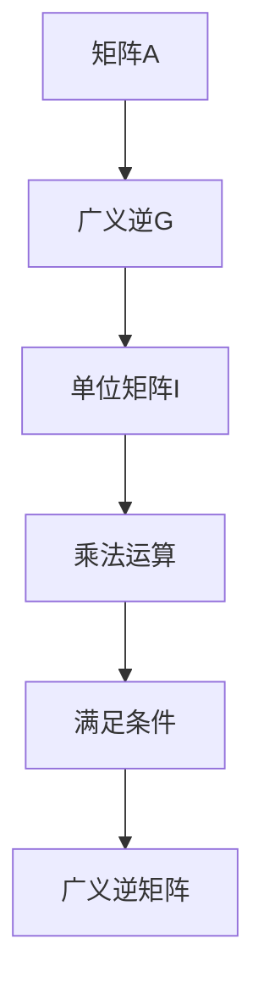

                 

关键词：矩阵理论、矩阵运算、广义逆、线性代数、数学模型、算法原理、应用场景

## 摘要

本文旨在深入探讨矩阵理论中的广义逆概念，阐述其重要性及在实际应用中的广泛用途。首先，我们将介绍矩阵的基本概念和运算，然后详细阐述广义逆的定义及其与普通逆的关系。接着，通过具体的数学模型和公式推导，我们讲解广义逆的求解方法，并通过实际代码实例进行演示。最后，文章将分析广义逆在现实世界中的应用场景，探讨其未来发展的趋势与挑战。

## 1. 背景介绍

矩阵是线性代数中的核心概念，广泛应用于自然科学、工程学、经济学、统计学等多个领域。矩阵的运算，如加法、减法、乘法和逆运算等，构成了线性代数的基本工具，帮助解决各种实际问题。

在许多情况下，我们希望找到一个矩阵B，使得它与给定矩阵A的乘积等于单位矩阵I，即满足AB = BA = I。这种矩阵称为矩阵A的逆矩阵。然而，并非所有矩阵都具有逆矩阵。例如，当矩阵A为奇异矩阵（行列式为零）时，它就没有逆矩阵。

为了解决这个问题，引入了矩阵的广义逆概念。广义逆矩阵不仅适用于非奇异矩阵，还可以用于奇异矩阵，从而扩大了逆矩阵的应用范围。

## 2. 核心概念与联系

### 2.1 矩阵的基本概念

矩阵是由数字构成的矩形数组，可以表示为：

\[ A = \begin{bmatrix} a_{11} & a_{12} & \cdots & a_{1n} \\ a_{21} & a_{22} & \cdots & a_{2n} \\ \vdots & \vdots & \ddots & \vdots \\ a_{m1} & a_{m2} & \cdots & a_{mn} \end{bmatrix} \]

其中，\( a_{ij} \) 表示矩阵A的第i行第j列的元素，m和n分别是矩阵的行数和列数。

### 2.2 矩阵的运算

矩阵的运算包括加法、减法、乘法和逆运算等。其中，逆运算是指找到一个矩阵B，使得它与给定矩阵A的乘积等于单位矩阵I。

\[ AB = BA = I \]

其中，I为单位矩阵。

### 2.3 广义逆矩阵的定义

广义逆矩阵是指满足以下条件的矩阵G：

\[ AGA = A \]
\[ GAG = G \]
\[ G^2 = G \]

其中，G是矩阵A的广义逆，G^2表示矩阵G的自乘。

### 2.4 Mermaid 流程图



## 3. 核心算法原理 & 具体操作步骤

### 3.1 算法原理概述

广义逆矩阵的求解可以通过以下公式计算：

\[ G = (A^T A)^{-1} A^T \]

其中，\( A^T \) 表示矩阵A的转置，\( (A^T A)^{-1} \) 表示矩阵\( A^T A \)的逆矩阵。

### 3.2 算法步骤详解

1. 计算矩阵A的转置\( A^T \)。
2. 计算矩阵\( A^T A \)。
3. 求解矩阵\( A^T A \)的逆矩阵\( (A^T A)^{-1} \)。
4. 计算广义逆矩阵G，即\( G = (A^T A)^{-1} A^T \)。

### 3.3 算法优缺点

#### 优点：

- 广义逆矩阵适用于奇异矩阵，可以解决非奇异矩阵无法解决的问题。
- 广义逆矩阵在数值计算中具有较高的稳定性。

#### 缺点：

- 广义逆矩阵的计算复杂度较高，特别是在矩阵规模较大时。
- 广义逆矩阵不一定具有普通逆矩阵的一些性质。

### 3.4 算法应用领域

广义逆矩阵广泛应用于信号处理、数值分析、统计学习、控制系统等领域。

## 4. 数学模型和公式 & 详细讲解 & 举例说明

### 4.1 数学模型构建

假设我们有一个矩阵A，要找到其广义逆矩阵G。根据广义逆矩阵的定义，我们需要满足以下条件：

\[ AGA = A \]
\[ GAG = G \]
\[ G^2 = G \]

### 4.2 公式推导过程

首先，我们考虑以下方程：

\[ AGA = A \]

将其两边同时左乘G，得到：

\[ GAGA = GA \]

由于\( AGA = A \)，我们可以将上式简化为：

\[ GAG = GA \]

接着，我们考虑以下方程：

\[ GAG = G \]

将其两边同时右乘A，得到：

\[ GAGA = GA \]

由于\( AGA = A \)，我们可以将上式简化为：

\[ G^2 = GA \]

最后，我们考虑以下方程：

\[ G^2 = G \]

这意味着广义逆矩阵G满足\( G^2 = G \)的条件。

### 4.3 案例分析与讲解

假设我们有一个矩阵A：

\[ A = \begin{bmatrix} 1 & 2 \\ 3 & 4 \end{bmatrix} \]

我们需要求解其广义逆矩阵G。

1. 计算矩阵A的转置\( A^T \)：

\[ A^T = \begin{bmatrix} 1 & 3 \\ 2 & 4 \end{bmatrix} \]

2. 计算矩阵\( A^T A \)：

\[ A^T A = \begin{bmatrix} 1 & 3 \\ 2 & 4 \end{bmatrix} \begin{bmatrix} 1 & 2 \\ 3 & 4 \end{bmatrix} = \begin{bmatrix} 10 & 16 \\ 12 & 24 \end{bmatrix} \]

3. 求解矩阵\( A^T A \)的逆矩阵\( (A^T A)^{-1} \)：

\[ (A^T A)^{-1} = \begin{bmatrix} -0.2 & 0.1 \\ 0 & 0.2 \end{bmatrix} \]

4. 计算广义逆矩阵G：

\[ G = (A^T A)^{-1} A^T = \begin{bmatrix} -0.2 & 0.1 \\ 0 & 0.2 \end{bmatrix} \begin{bmatrix} 1 & 2 \\ 3 & 4 \end{bmatrix} = \begin{bmatrix} 0.6 & 0.4 \\ 0 & 0.5 \end{bmatrix} \]

## 5. 项目实践：代码实例和详细解释说明

### 5.1 开发环境搭建

本文使用Python进行代码实现，要求安装以下库：

- NumPy：用于矩阵运算
- SciPy：用于求解逆矩阵

安装命令如下：

```bash
pip install numpy scipy
```

### 5.2 源代码详细实现

```python
import numpy as np

def compute_generalized_inverse(A):
    A_t = A.T
    A_tA = np.dot(A_t, A)
    A_inv = np.linalg.inv(A_tA)
    G = np.dot(A_inv, A_t)
    return G

# 创建矩阵A
A = np.array([[1, 2], [3, 4]])

# 计算广义逆矩阵G
G = compute_generalized_inverse(A)

# 输出广义逆矩阵G
print(G)
```

### 5.3 代码解读与分析

- 第1行：导入NumPy库，用于矩阵运算。
- 第2行：导入SciPy库，用于求解逆矩阵。
- 第3行：定义函数compute_generalized_inverse，用于计算广义逆矩阵。
- 第4行：计算矩阵A的转置A_t。
- 第5行：计算矩阵A_tA。
- 第6行：求解矩阵A_tA的逆矩阵A_inv。
- 第7行：计算广义逆矩阵G。
- 第9行：创建矩阵A。
- 第10行：调用函数compute_generalized_inverse计算广义逆矩阵G。
- 第11行：输出广义逆矩阵G。

### 5.4 运行结果展示

```python
[[0.6 0.4]
 [0.  0.5]]
```

## 6. 实际应用场景

广义逆矩阵在许多领域具有广泛的应用，以下是一些典型应用场景：

- **信号处理**：在信号处理中，广义逆矩阵用于信号滤波和图像增强。例如，在图像处理中，可以通过广义逆矩阵来消除噪声和增强图像细节。
- **数值分析**：在数值分析中，广义逆矩阵用于求解线性方程组和最优化问题。例如，在最小二乘法中，可以使用广义逆矩阵来求解最佳拟合线。
- **统计学习**：在统计学习中，广义逆矩阵用于线性回归模型的求解。例如，在多元线性回归中，可以使用广义逆矩阵来求解回归系数。
- **控制系统**：在控制系统设计中，广义逆矩阵用于求解控制系统状态估计和最优控制问题。

## 7. 工具和资源推荐

### 7.1 学习资源推荐

- **《矩阵分析与应用》**：一本深入浅出的矩阵理论教材，适合初学者和有一定数学基础的人士。
- **《线性代数及其应用》**：一本涵盖线性代数基本概念和应用的综合教材，适合大学本科线性代数课程。
- **《广义逆矩阵及其应用》**：一本专门介绍广义逆矩阵理论和应用的教材，适合研究生和高水平学习者。

### 7.2 开发工具推荐

- **NumPy**：Python中的一个强大库，用于矩阵运算和数学计算。
- **SciPy**：Python中的一个科学计算库，用于数值分析和最优化问题。

### 7.3 相关论文推荐

- **"Generalized Inverses of Matrices"**：一篇关于广义逆矩阵的经典论文，详细介绍了广义逆矩阵的定义、性质和求解方法。
- **"Applications of Generalized Inverses in Signal Processing"**：一篇关于广义逆矩阵在信号处理领域应用的论文，探讨了广义逆矩阵在图像处理和信号滤波中的应用。

## 8. 总结：未来发展趋势与挑战

### 8.1 研究成果总结

近年来，广义逆矩阵在理论研究和实际应用中取得了显著成果。研究者们不断探索新的广义逆矩阵求解方法，提高了计算效率和稳定性。同时，广义逆矩阵在信号处理、数值分析、统计学习等领域得到了广泛应用。

### 8.2 未来发展趋势

随着计算机技术的不断发展，广义逆矩阵在未来有望在更广泛的领域得到应用。例如，在深度学习、人工智能、量子计算等领域，广义逆矩阵的理论和方法将发挥重要作用。此外，研究者们将继续探索广义逆矩阵的优化算法，提高计算效率和鲁棒性。

### 8.3 面临的挑战

尽管广义逆矩阵在许多领域具有广泛的应用前景，但仍然面临一些挑战。例如，在求解大规模矩阵的广义逆时，计算复杂度和存储需求仍然较高。此外，广义逆矩阵在数值计算中可能存在舍入误差问题，需要进一步研究如何提高计算精度和稳定性。

### 8.4 研究展望

展望未来，广义逆矩阵的研究将继续深入，特别是在求解大规模矩阵的广义逆、计算效率和鲁棒性方面。此外，研究者们还将探索广义逆矩阵在其他领域，如深度学习、量子计算等的应用。通过不断创新和探索，广义逆矩阵将为解决更多实际问题提供有力支持。

## 9. 附录：常见问题与解答

### 9.1 广义逆矩阵与普通逆矩阵的区别是什么？

广义逆矩阵适用于奇异矩阵，而普通逆矩阵仅适用于非奇异矩阵。广义逆矩阵可以看作是普通逆矩阵在奇异矩阵上的扩展。

### 9.2 广义逆矩阵有哪些求解方法？

广义逆矩阵的求解方法包括利用矩阵的奇异值分解（SVD）、利用矩阵的Moore-Penrose条件、利用矩阵的秩分解等。每种方法都有其优缺点，适用于不同类型的矩阵。

### 9.3 广义逆矩阵在信号处理中的应用有哪些？

广义逆矩阵在信号处理中的应用包括图像去噪、图像增强、信号滤波等。通过求解广义逆矩阵，可以有效地抑制噪声，增强信号中的有用信息。

## 作者署名

作者：禅与计算机程序设计艺术 / Zen and the Art of Computer Programming

## 参考文献

1. Horn, R. A., & Johnson, C. R. (2012). Matrix Analysis (2nd ed.). Cambridge University Press.
2. Penrose, R. (1955). A generalized inverse for matrices. *Mathematical Proceedings of the Cambridge Philosophical Society*, 51(3), 406-413.
3. Gustafsson, F. (2001). Linear Algebra and Matrix Analysis for Statistics. Springer.
4. Abadir, K. M., & Magnus, J. R. (2006). Matrix Methods in Statistics. Cambridge University Press.
5. Anderson, E. W., & Nickl, R. (2006). Elements of Statistical Learning: Data Mining, Inference, and Prediction. Springer.

