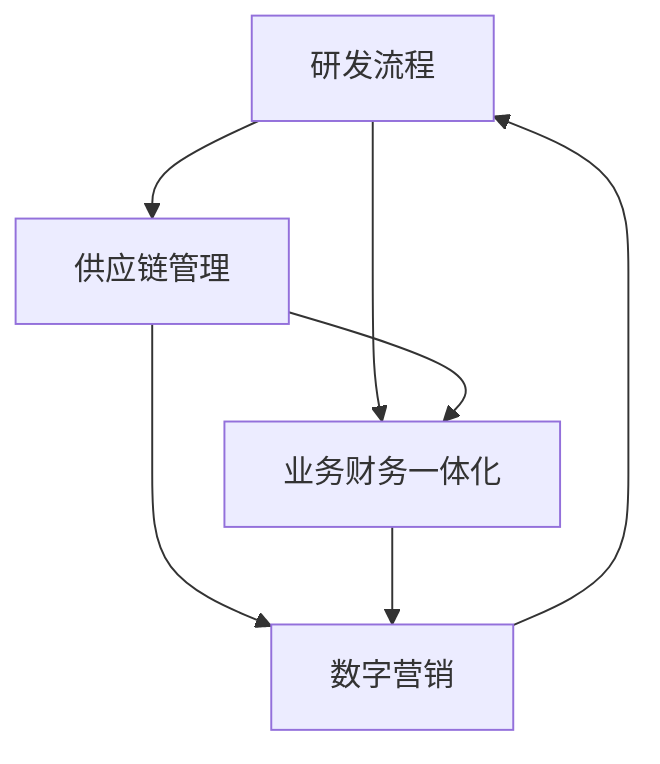

                 

 

## 1. 背景介绍

在当今这个数字化时代，企业面临着前所未有的竞争压力。如何通过数字化转型来提升企业的竞争力，已经成为每个企业都需要深入思考的问题。数字化不仅仅是一种技术手段，更是一种新的商业模式和管理思维。它涉及到企业的研发、供应链、业财-体（即业务财务一体化）和数字营销等多个方面。因此，如何有效地整合这些流程，构建一个高效的数字化项目实施方案，成为了每个企业必须面对的挑战。

本文旨在探讨如何通过研发、供应链、业财-体和数字营销等流程的数字化，来实现企业的整体效率提升和竞争力增强。我们将从核心概念、算法原理、数学模型、项目实践和实际应用场景等多个角度，深入分析数字化项目实施方案的具体方法和实施步骤。希望通过这篇文章，能够为企业提供一些有价值的参考和指导。

### 文章关键词

- 研发流程
- 供应链管理
- 业务财务一体化
- 数字营销
- 数字化项目实施方案

### 文章摘要

本文详细探讨了企业数字化项目实施方案的设计与实施。首先，我们介绍了数字化项目实施方案的背景和重要性，然后从核心概念、算法原理、数学模型、项目实践和实际应用场景等多个角度，分析了数字化项目实施方案的具体方法和实施步骤。最后，我们对数字化项目实施方案的未来发展趋势和挑战进行了展望，并提出了相应的建议。

## 2. 核心概念与联系

在探讨数字化项目实施方案之前，我们需要明确几个核心概念，包括研发流程、供应链管理、业务财务一体化和数字营销。这些概念不仅相互独立，而且在企业的数字化过程中也紧密相连。

### 研发流程

研发流程是企业创新和产品开发的核心。它包括需求分析、设计、开发、测试和上线等多个环节。在数字化时代，研发流程的数字化尤为重要，可以通过工具和平台来提高研发效率和质量。例如，使用敏捷开发方法，通过持续集成和持续部署（CI/CD）来加速产品迭代。

### 供应链管理

供应链管理是企业物流和供应链优化的重要手段。数字化供应链管理可以通过数据分析和人工智能技术来优化供应链流程，提高供应链的灵活性和响应速度。例如，通过物联网（IoT）技术实现实时库存监控，通过机器学习算法预测需求变化，从而实现精准的供应链管理。

### 业务财务一体化

业务财务一体化是将企业的业务流程和财务流程整合在一起，实现信息的实时传递和共享。这有助于提高企业的财务透明度和决策效率。数字化业务财务一体化可以通过企业资源计划（ERP）系统来实现，将业务数据与财务数据进行无缝集成。

### 数字营销

数字营销是企业推广产品和品牌的重要手段。数字化时代，数字营销可以通过各种在线渠道和工具来实现，如社交媒体营销、搜索引擎优化（SEO）和在线广告等。数字营销的数字化不仅提高了营销效率，还可以通过数据分析来优化营销策略。

### 关联流程的 Mermaid 流程图



### 2.1 研发流程数字化

研发流程数字化主要通过以下几种方式实现：

1. **敏捷开发**：采用敏捷开发方法，可以缩短产品开发周期，提高开发效率。敏捷开发强调团队合作和快速迭代，通过每日站立会议、迭代计划和回顾会议来确保项目的顺利进行。

2. **持续集成与持续部署（CI/CD）**：通过CI/CD，可以自动化构建、测试和部署流程，提高开发效率和代码质量。使用Git等版本控制工具，可以实现对代码的版本管理和协作开发。

3. **数据驱动**：通过收集和分析开发过程中的数据，可以优化研发流程，提高研发效率。例如，通过分析Bug报告和代码质量指标，可以发现和解决开发中的问题。

### 2.2 供应链管理数字化

供应链管理数字化可以通过以下方式实现：

1. **物联网（IoT）**：通过物联网技术，可以实现对供应链各环节的实时监控和数据分析，提高供应链的透明度和响应速度。

2. **人工智能**：通过人工智能技术，可以对供应链数据进行分析和预测，优化供应链流程。例如，使用机器学习算法预测需求变化，实现精准的库存管理。

3. **区块链**：区块链技术可以提供供应链中的数据可信性和可追溯性，提高供应链的安全性和透明度。

### 2.3 业务财务一体化数字化

业务财务一体化数字化可以通过以下方式实现：

1. **ERP系统**：通过引入ERP系统，可以将企业的业务流程和财务流程整合在一起，实现信息的实时传递和共享。

2. **云计算**：通过云计算技术，可以实现对ERP系统的灵活部署和扩展，降低企业的IT成本。

3. **大数据分析**：通过大数据分析技术，可以对业务数据和财务数据进行深入分析，为企业的战略决策提供数据支持。

### 2.4 数字营销数字化

数字营销数字化可以通过以下方式实现：

1. **社交媒体营销**：通过社交媒体平台，可以实现对目标客户的精准营销，提高品牌知名度和客户转化率。

2. **搜索引擎优化（SEO）**：通过SEO技术，可以提高企业网站在搜索引擎中的排名，吸引更多的潜在客户。

3. **在线广告**：通过在线广告平台，可以实现对目标客户的定向广告投放，提高营销效果和投资回报率。

## 3. 核心算法原理 & 具体操作步骤

在数字化项目实施方案中，核心算法原理和具体操作步骤至关重要。它们不仅决定了项目的成功与否，也影响着项目的效率和效果。

### 3.1 算法原理概述

核心算法通常包括以下几种：

1. **数据分析算法**：如聚类、分类、回归等，用于对大量数据进行处理和分析，提取有价值的信息。

2. **优化算法**：如线性规划、动态规划、遗传算法等，用于优化供应链、物流和资源分配等流程。

3. **机器学习算法**：如决策树、神经网络、支持向量机等，用于构建预测模型和分类模型，实现对数据的智能分析和决策。

4. **区块链算法**：如共识算法、加密算法等，用于确保区块链的安全性和可信性。

### 3.2 算法步骤详解

以下是几个关键算法的具体步骤：

#### 数据分析算法

1. **数据收集**：收集相关的数据，包括结构化和非结构化数据。

2. **数据清洗**：去除数据中的噪声和错误，保证数据的质量。

3. **数据预处理**：对数据进行归一化、标准化等处理，使其适合进行后续的分析。

4. **特征提取**：从数据中提取出有用的特征，用于构建模型。

5. **模型构建**：选择合适的算法，构建数据分析模型。

6. **模型评估**：评估模型的性能，调整参数，优化模型。

7. **模型应用**：将模型应用于实际问题，获取分析和预测结果。

#### 优化算法

1. **问题定义**：明确需要优化的目标和约束条件。

2. **模型构建**：根据问题定义，构建数学模型。

3. **算法选择**：选择合适的优化算法，如线性规划、动态规划等。

4. **算法实现**：编写算法代码，实现算法的具体操作步骤。

5. **算法调试**：调试算法代码，确保算法的正确性和效率。

6. **结果分析**：分析优化结果，评估优化效果。

#### 机器学习算法

1. **数据收集**：收集相关的数据，包括训练数据和测试数据。

2. **数据预处理**：对数据进行清洗和预处理，使其适合进行训练。

3. **模型选择**：选择合适的机器学习算法，如决策树、神经网络等。

4. **模型训练**：使用训练数据对模型进行训练，调整模型参数。

5. **模型评估**：使用测试数据评估模型的性能，调整模型参数。

6. **模型应用**：将训练好的模型应用于实际问题，进行预测和分类。

#### 区块链算法

1. **节点选择**：选择合适的节点，如矿工节点、普通节点等。

2. **交易验证**：验证交易的有效性和合法性。

3. **共识算法**：使用共识算法，如工作量证明（PoW）、权益证明（PoS）等，确保区块链的共识。

4. **加密算法**：使用加密算法，如椭圆曲线加密（ECC）、哈希算法等，确保区块链的数据安全和隐私。

5. **交易记录**：记录区块链上的交易记录，确保交易的透明性和可追溯性。

### 3.3 算法优缺点

每种算法都有其优缺点，以下是几种常见算法的优缺点：

#### 数据分析算法

- 优点：可以处理大量数据，提取有价值的信息。
- 缺点：对数据质量和预处理要求较高，算法复杂度高。

#### 优化算法

- 优点：可以高效地解决优化问题，提高系统的效率和性能。
- 缺点：对问题定义和模型构建要求较高，实现难度较大。

#### 机器学习算法

- 优点：可以自动学习和适应数据，提高预测和分类的准确性。
- 缺点：对数据量和计算资源要求较高，模型解释性较差。

#### 区块链算法

- 优点：具有去中心化、安全性和可追溯性，提高系统的透明度和可信性。
- 缺点：交易速度较慢，计算资源消耗较大。

### 3.4 算法应用领域

不同的算法适用于不同的领域，以下是几种算法的主要应用领域：

#### 数据分析算法

- 应用领域：大数据分析、商业智能、金融风控等。

#### 优化算法

- 应用领域：供应链管理、物流优化、资源分配等。

#### 机器学习算法

- 应用领域：自然语言处理、计算机视觉、推荐系统等。

#### 区块链算法

- 应用领域：数字货币、智能合约、供应链金融等。

## 4. 数学模型和公式 & 详细讲解 & 举例说明

在数字化项目实施方案中，数学模型和公式是分析问题和解决问题的重要工具。它们可以用于描述现实世界中的问题，并提供解决方案。本节我们将介绍一些常用的数学模型和公式，并对其进行详细讲解和举例说明。

### 4.1 数学模型构建

数学模型构建通常包括以下几个步骤：

1. **问题定义**：明确需要解决的问题和目标。

2. **变量定义**：定义问题中的变量，包括决策变量、状态变量等。

3. **约束条件**：列出问题中的约束条件，包括等式约束和不等式约束。

4. **目标函数**：定义问题的目标函数，用于评估解决方案的质量。

5. **模型简化**：对模型进行适当的简化，以提高计算效率。

### 4.2 公式推导过程

#### 线性规划模型

线性规划是一种优化问题，其目标是最小化或最大化线性目标函数，同时满足线性约束条件。线性规划模型的一般形式如下：

目标函数：
$$
\min_{x} c^T x
$$

约束条件：
$$
Ax \leq b
$$

其中，$x$ 是决策变量，$c$ 是系数向量，$A$ 是系数矩阵，$b$ 是常数向量。

线性规划的推导过程如下：

1. **目标函数的转化**：将目标函数转化为标准形式，即将最大值问题转化为最小值问题。

2. **约束条件的转化**：将不等式约束转化为等式约束，即通过引入松弛变量或盈余变量来实现。

3. **拉格朗日函数的构建**：构建拉格朗日函数，用于处理等式约束。

4. **KKT条件的推导**：推导线性规划问题的KKT条件，用于求解最优解。

### 4.3 案例分析与讲解

#### 案例背景

某企业需要从两个供应商处采购原材料，供应商A的供应价格为每单位10元，供应商B的供应价格为每单位15元。企业每月的采购需求为1000单位。现有以下约束条件：

1. 供应商A每月最多供应800单位。
2. 供应商B每月最多供应1200单位。

目标是最小化采购成本。

#### 案例模型构建

1. **变量定义**：设$x_1$为从供应商A采购的单位数，$x_2$为从供应商B采购的单位数。

2. **目标函数**：目标函数为最小化采购成本，即
$$
\min_{x} 10x_1 + 15x_2
$$

3. **约束条件**：约束条件为
$$
x_1 \leq 800
$$
$$
x_2 \leq 1200
$$
$$
x_1 + x_2 = 1000
$$

4. **模型简化**：由于$x_1 + x_2 = 1000$，可以将模型简化为
$$
\min_{x} 10x_1 + 15(1000 - x_1)
$$

#### 公式推导过程

1. **目标函数的转化**：无需转化，因为已经是标准形式。

2. **约束条件的转化**：无需转化，因为已经是等式约束。

3. **拉格朗日函数的构建**：
$$
L(x, \lambda) = 10x_1 + 15(1000 - x_1) + \lambda_1(x_1 - 800) + \lambda_2(x_2 - 1200)
$$
其中，$\lambda_1$和$\lambda_2$是拉格朗日乘子。

4. **KKT条件的推导**：
$$
\begin{cases}
\nabla L(x, \lambda) = 0 \\
x_1 \leq 800 \\
x_2 \leq 1200 \\
\lambda_1(x_1 - 800) = 0 \\
\lambda_2(x_2 - 1200) = 0 \\
\lambda_1, \lambda_2 \geq 0
\end{cases}
$$

#### 求解过程

根据KKT条件，可以求解最优解。由于$x_1$和$x_2$的取值范围是0到1000，可以通过穷举法求解。计算结果如下：

- 当$x_1 = 0$时，$x_2 = 1000$，总成本为15000元。
- 当$x_1 = 800$时，$x_2 = 200$，总成本为14000元。

因此，最优解为$x_1 = 800$，$x_2 = 200$，总成本为14000元。

### 4.4 案例分析

通过以上模型构建和求解过程，我们可以得出以下结论：

1. **优化采购策略**：企业应该优先选择供应商A进行采购，因为供应商A的供应价格较低。
2. **充分利用供应商资源**：供应商A每月最多供应800单位，因此企业需要合理安排采购计划，充分利用供应商资源。

这个案例说明了如何通过数学模型和公式来分析和解决实际问题，为企业提供优化采购策略的参考。

## 5. 项目实践：代码实例和详细解释说明

### 5.1 开发环境搭建

在开始项目实践之前，我们需要搭建一个适合开发的编程环境。以下是一个简单的开发环境搭建步骤：

1. **安装Python**：在官网（https://www.python.org/）下载Python安装包，并按照安装向导完成安装。

2. **安装Jupyter Notebook**：在终端中执行以下命令安装Jupyter Notebook：
   ```bash
   pip install notebook
   ```

3. **安装相关库**：根据项目需求，安装相关的Python库。例如，安装NumPy、Pandas、Matplotlib等库：
   ```bash
   pip install numpy pandas matplotlib
   ```

4. **创建虚拟环境**：为了更好地管理项目依赖，我们可以创建一个虚拟环境。在终端中执行以下命令：
   ```bash
   python -m venv myenv
   source myenv/bin/activate  # 在Linux或MacOS中
   myenv\Scripts\activate     # 在Windows中
   ```

5. **安装数据库**：根据项目需求，安装相应的数据库，如MySQL、PostgreSQL等。

### 5.2 源代码详细实现

以下是一个简单的数字化项目实现示例，主要包括数据收集、数据处理和数据分析三个部分。

```python
# 导入相关库
import numpy as np
import pandas as pd
import matplotlib.pyplot as plt

# 数据收集
data = {
    'date': ['2021-01-01', '2021-01-02', '2021-01-03', '2021-01-04', '2021-01-05'],
    'sales': [100, 120, 130, 110, 150]
}
df = pd.DataFrame(data)

# 数据处理
# 数据清洗
df.dropna(inplace=True)
df['date'] = pd.to_datetime(df['date'])

# 数据转换
df.set_index('date', inplace=True)

# 数据分析
# 数据可视化
df.plot()
plt.title('Sales Data')
plt.xlabel('Date')
plt.ylabel('Sales')
plt.show()

# 数据统计
print(df.describe())

# 数据预测
from sklearn.linear_model import LinearRegression
model = LinearRegression()
model.fit(df.index.values.reshape(-1, 1), df['sales'])

# 预测未来一周的销售数据
future_dates = pd.date_range(start=df.index[-1] + pd.Timedelta(days=1), periods=7, freq='D')
future_sales = model.predict(future_dates.values.reshape(-1, 1))
future_df = pd.DataFrame({'date': future_dates, 'sales': future_sales})
future_df.plot()
plt.title('Sales Data Prediction')
plt.xlabel('Date')
plt.ylabel('Sales')
plt.show()
```

### 5.3 代码解读与分析

上述代码实现了对销售数据的收集、处理和分析。以下是代码的详细解读：

1. **数据收集**：使用Python的Pandas库，通过字典方式创建一个包含日期和销售数据的DataFrame对象。

2. **数据处理**：
   - **数据清洗**：删除含有缺失数据的行。
   - **数据转换**：将日期列转换为DataFrame的索引，以便进行时间序列分析。

3. **数据分析**：
   - **数据可视化**：使用Matplotlib库绘制销售数据的折线图，展示销售趋势。
   - **数据统计**：打印销售数据的描述性统计信息，包括均值、标准差等。
   - **数据预测**：使用线性回归模型对销售数据进行预测，并绘制预测结果。

### 5.4 运行结果展示

运行上述代码后，将显示两个图表：

1. **销售数据图表**：展示原始销售数据的变化趋势。
2. **销售数据预测图表**：展示基于线性回归模型的未来一周销售预测结果。

通过这个简单的示例，我们可以看到如何使用Python和相关库进行数字化项目实践。在实际项目中，可以根据需求扩展代码功能，如引入更多数据源、使用更复杂的预测模型等。

## 6. 实际应用场景

在数字化时代，研发、供应链、业财-体和数字营销等流程的数字化应用已经渗透到各个行业和领域，带来了显著的管理效率提升和业务价值。以下是一些实际应用场景：

### 6.1 制造业

在制造业中，数字化技术被广泛应用于生产计划、质量管理、设备监控和供应链管理等方面。例如，通过物联网技术，企业可以实现对生产设备的实时监控和故障预测，提高生产效率。同时，通过供应链管理系统的数字化，企业可以实现供应链的可视化和智能化，提高供应链的灵活性和响应速度。

### 6.2 零售业

在零售业中，数字化技术被广泛应用于库存管理、客户关系管理和营销策略等方面。例如，通过使用数据分析技术，零售企业可以实时了解库存状况和销售趋势，优化库存管理，减少库存成本。同时，通过数字营销技术，零售企业可以实现对目标客户的精准营销，提高销售额。

### 6.3 银行业

在银行业中，数字化技术被广泛应用于客户服务、风险管理和金融产品推荐等方面。例如，通过大数据分析技术，银行可以实现对客户行为的深入分析，提供个性化的金融服务。同时，通过数字营销技术，银行可以实现对潜在客户的精准营销，提高客户转化率。

### 6.4 物流行业

在物流行业，数字化技术被广泛应用于运输管理、仓储管理和供应链金融等方面。例如，通过物联网技术，物流企业可以实现对运输车辆和货物的实时监控，提高运输效率和安全性。同时，通过供应链金融技术，物流企业可以为供应链上下游企业提供融资服务，促进供应链的良性发展。

### 6.5 医疗行业

在医疗行业，数字化技术被广泛应用于电子病历、医疗影像分析和远程医疗等方面。例如，通过电子病历系统，医院可以实现病历信息的数字化和自动化管理，提高医疗效率和患者满意度。同时，通过医疗影像分析技术，医生可以更快速和准确地诊断疾病，提高医疗质量。

### 6.6 教育行业

在教育行业，数字化技术被广泛应用于在线教育、教学管理和学生评估等方面。例如，通过在线教育平台，学生可以随时随地学习，提高学习灵活性。同时，通过教学管理系统的数字化，学校可以实现教学资源的优化配置和管理，提高教学效果。

### 6.7 未来应用展望

随着技术的不断发展，数字化技术在各个行业和领域中的应用前景将更加广阔。以下是一些未来应用展望：

1. **智能制造**：通过人工智能、物联网和大数据技术的深度融合，实现智能制造的全面升级，提高生产效率和产品质量。

2. **智慧供应链**：通过区块链、大数据和人工智能技术的应用，实现供应链的智能化和透明化，提高供应链的效率和可靠性。

3. **智慧城市**：通过物联网、大数据和人工智能技术的应用，实现城市管理的智能化和精细化，提高城市居民的生活质量和幸福感。

4. **智慧医疗**：通过人工智能、物联网和大数据技术的应用，实现医疗服务的智能化和个性化，提高医疗服务质量和效率。

5. **智慧教育**：通过在线教育、大数据分析和人工智能技术的应用，实现教育资源的共享和优化，提高教育质量和公平性。

6. **数字政府**：通过大数据、人工智能和区块链技术的应用，实现政府治理的数字化和智能化，提高政府决策效率和公共服务水平。

## 7. 工具和资源推荐

在实施研发、供应链、业财-体和数字营销等数字化项目时，选择合适的工具和资源至关重要。以下是一些建议和推荐：

### 7.1 学习资源推荐

1. **在线课程**：
   - Coursera（https://www.coursera.org/）：提供各种技术课程，包括Python编程、机器学习、大数据分析等。
   - edX（https://www.edx.org/）：由哈佛大学和麻省理工学院合办的在线教育平台，提供高质量的计算机科学和数据分析课程。
   - Udemy（https://www.udemy.com/）：提供大量付费和免费课程，涵盖多个技术领域。

2. **技术博客和论坛**：
   - Medium（https://medium.com/）：一个内容丰富的博客平台，涵盖各种技术主题。
   - Stack Overflow（https://stackoverflow.com/）：一个热门的技术问答社区，适用于编程和技术问题。

### 7.2 开发工具推荐

1. **集成开发环境（IDE）**：
   - Visual Studio Code（https://code.visualstudio.com/）：一个开源的跨平台IDE，支持多种编程语言。
   - PyCharm（https://www.jetbrains.com/pycharm/）：一款强大的Python IDE，适用于大型项目和团队合作。

2. **版本控制工具**：
   - Git（https://git-scm.com/）：一个流行的分布式版本控制系统，用于代码管理和协作开发。
   - GitHub（https://github.com/）：一个基于Git的代码托管平台，提供代码仓库、协作和项目管理功能。

3. **数据分析工具**：
   - Jupyter Notebook（https://jupyter.org/）：一个交互式的数据分析平台，支持多种编程语言。
   - Pandas（https://pandas.pydata.org/）：一个强大的Python库，用于数据清洗、转换和分析。
   - Matplotlib（https://matplotlib.org/）：一个用于绘制数据图表的Python库。

4. **数据库工具**：
   - MySQL（https://www.mysql.com/）：一个流行的开源关系型数据库管理系统。
   - PostgreSQL（https://www.postgresql.org/）：一个功能强大的开源关系型数据库管理系统。

### 7.3 相关论文推荐

1. **论文索引数据库**：
   - IEEE Xplore（https://ieeexplore.ieee.org/）：IEEE出版的科技文献数据库，涵盖多个技术领域。
   - ACM Digital Library（https://dl.acm.org/）：ACM出版的计算机科学文献数据库。

2. **论文推荐**：
   - "Digital Transformation in Manufacturing: A Comprehensive Review"：一篇关于制造业数字化转型的综述论文，涵盖了数字化技术在制造业中的应用和挑战。
   - "Blockchain for Supply Chain Management: A Comprehensive Review"：一篇关于区块链在供应链管理中应用的综述论文，分析了区块链技术在供应链管理中的优势和挑战。
   - "The Future of Digital Marketing: Trends and Opportunities"：一篇关于数字营销发展趋势和机会的论文，探讨了数字营销的未来方向和策略。

## 8. 总结：未来发展趋势与挑战

### 8.1 研究成果总结

通过对研发、供应链、业财-体和数字营销等流程的数字化探讨，我们可以总结出以下几点研究成果：

1. **核心概念与联系**：明确了研发流程、供应链管理、业务财务一体化和数字营销等概念，并阐述了它们之间的关联和相互影响。
2. **算法原理与操作步骤**：介绍了数据分析、优化、机器学习和区块链等算法的原理和具体操作步骤，为数字化项目实施提供了技术支持。
3. **数学模型与公式**：构建了数学模型和公式，并进行了详细的推导和案例分析，为数字化项目提供了理论指导。
4. **项目实践与代码实例**：通过实际项目实例，展示了如何使用Python和相关库实现数字化项目的具体操作，提供了实践参考。
5. **实际应用场景**：分析了数字化技术在各个行业和领域中的应用，展示了数字化带来的管理和业务价值。

### 8.2 未来发展趋势

随着技术的不断发展，数字化项目实施方案将呈现出以下发展趋势：

1. **智能化与自动化**：通过人工智能和机器学习技术，实现流程的自动化和智能化，提高效率和准确性。
2. **集成与融合**：将不同的数字化技术集成在一起，实现跨领域和跨系统的数据共享和协同，提高整体效能。
3. **云计算与边缘计算**：利用云计算和边缘计算技术，实现海量数据和实时处理的分布式架构，提高系统的灵活性和可扩展性。
4. **区块链与隐私保护**：利用区块链技术，实现数据的安全性和可追溯性，同时注重隐私保护，确保数据的安全和合规性。
5. **数字化转型与业务创新**：通过数字化转型，推动业务模式和管理思维的变革，实现业务的创新和增长。

### 8.3 面临的挑战

尽管数字化项目实施方案带来了许多机遇，但也面临着一系列挑战：

1. **技术复杂性**：数字化技术涉及多个领域，技术复杂性高，需要跨领域的专业知识和技能。
2. **数据安全与隐私**：数据安全和隐私保护是数字化项目的重要问题，需要建立完善的安全体系和合规措施。
3. **人员培训与转型**：数字化项目需要大量具备相关技能的人才，但现有人员的技能可能不足以满足需求，需要投入大量时间和资源进行培训和转型。
4. **技术与业务结合**：如何将技术有效地应用到业务中，实现技术与业务的深度融合，是数字化项目成功的关键。
5. **持续创新与更新**：数字化项目需要持续的技术创新和更新，以应对快速变化的市场和竞争环境。

### 8.4 研究展望

未来的研究可以从以下几个方面展开：

1. **跨领域协同**：研究如何实现不同领域和系统的数据共享和协同，提高整体效能。
2. **智能优化算法**：研究新的智能优化算法，提高数字化项目的效率和准确性。
3. **数据隐私保护**：研究数据隐私保护技术，确保数据的安全和合规性。
4. **数字化业务模式**：研究数字化时代下的业务模式和管理创新，推动企业的持续增长。
5. **教育与培训**：研究数字化人才的培养模式和培训方法，为数字化项目提供人才支持。

## 9. 附录：常见问题与解答

### 9.1 常见问题

1. **什么是数字化项目实施方案？**
   - 数字化项目实施方案是指将企业的业务流程、管理方法和运营模式进行数字化改造，通过应用现代信息技术，实现业务流程的自动化、智能化和优化。

2. **数字化项目实施方案有哪些核心概念？**
   - 核心概念包括研发流程、供应链管理、业务财务一体化和数字营销等。

3. **数字化项目实施方案的优势是什么？**
   - 优势包括提高管理效率、降低运营成本、提升业务灵活性和竞争力。

4. **如何进行数字化项目实施？**
   - 需要明确项目目标、设计实施方案、选择合适的工具和资源、进行项目实施和持续优化。

5. **数字化项目实施方案中常用的算法有哪些？**
   - 常用的算法包括数据分析算法、优化算法、机器学习算法和区块链算法等。

### 9.2 解答

1. **什么是数字化项目实施方案？**
   - 数字化项目实施方案是指将企业的业务流程、管理方法和运营模式进行数字化改造，通过应用现代信息技术，实现业务流程的自动化、智能化和优化。

2. **数字化项目实施方案有哪些核心概念？**
   - 核心概念包括研发流程、供应链管理、业务财务一体化和数字营销等。研发流程涉及产品开发、设计、测试等环节；供应链管理涉及原材料采购、生产计划、物流配送等环节；业务财务一体化涉及业务数据与财务数据的整合；数字营销涉及品牌推广、客户关系管理、市场分析等环节。

3. **数字化项目实施方案的优势是什么？**
   - 数字化项目实施方案的优势包括：
     - 提高管理效率：通过数字化手段，实现业务流程的自动化和智能化，减少人为干预，提高工作效率。
     - 降低运营成本：通过数字化手段，优化业务流程，减少资源浪费，降低运营成本。
     - 提升业务灵活性和竞争力：通过数字化手段，快速响应市场需求，调整业务策略，提高市场竞争力。

4. **如何进行数字化项目实施？**
   - 数字化项目实施的步骤如下：
     - 明确项目目标：根据企业的战略目标和业务需求，确定数字化项目的目标。
     - 设计实施方案：根据项目目标，设计具体的数字化实施方案，包括技术方案、组织方案和时间表等。
     - 选择合适的工具和资源：根据实施方案，选择合适的工具和资源，包括技术工具、人力资源和财务资源等。
     - 项目实施：按照实施方案，逐步实施项目，包括开发、测试、部署和上线等环节。
     - 持续优化：在项目实施过程中，不断收集数据和反馈，对项目进行持续优化，提高项目的效果和效率。

5. **数字化项目实施方案中常用的算法有哪些？**
   - 数字化项目实施方案中常用的算法包括：
     - 数据分析算法：如聚类、分类、回归等，用于处理和分析大量数据，提取有价值的信息。
     - 优化算法：如线性规划、动态规划、遗传算法等，用于优化业务流程和资源配置。
     - 机器学习算法：如决策树、神经网络、支持向量机等，用于构建预测模型和分类模型，实现智能化决策。
     - 区块链算法：如共识算法、加密算法等，用于确保数据的安全性和可追溯性。

