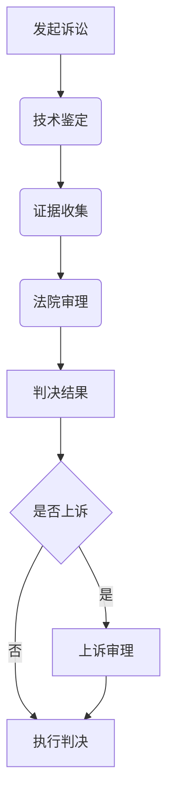

                 

关键词：硅谷，专利纠纷，知识产权，案例分析，保护实践

摘要：本文将深入探讨硅谷中发生的几起著名专利纠纷案例，分析其中的关键问题、解决策略以及知识产权保护实践。通过这些案例，读者可以更好地理解知识产权在技术创新和市场竞争中的重要性。

## 1. 背景介绍

硅谷作为全球科技和创新的热点地区，专利纠纷频繁发生。这些纠纷不仅涉及巨额赔偿，还涉及到创新激励、知识产权保护、市场竞争等多个方面。本篇文章将选取几起具有代表性的专利纠纷案例，分析其中的法律、技术和市场因素，探讨知识产权保护实践的意义。

### 1.1 硅谷专利纠纷的现状

- **案例数量**：硅谷每年都会发生大量的专利纠纷案件，涉及多个行业和技术领域。
- **赔偿金额**：专利纠纷案件的赔偿金额通常非常高，有时甚至达数十亿美元。
- **技术重要性**：硅谷的专利纠纷往往涉及到核心技术，对行业发展具有深远影响。
- **国际影响**：硅谷的专利纠纷不仅影响本地企业，还可能对全球市场产生连锁反应。

### 1.2 硅谷专利纠纷的特点

- **多样性**：硅谷的专利纠纷案例涵盖了从硬件到软件、从通信到生物技术等多个领域。
- **复杂性**：这些案例通常涉及复杂的法律和技术问题，需要专业的法律和科技专家共同解决。
- **战略性**：专利纠纷常常成为企业竞争的重要手段，涉及到市场份额、技术领先地位等战略性问题。

## 2. 核心概念与联系

### 2.1 知识产权的定义

知识产权是指人们就其智力劳动成果所依法享有的专有权利，通常包括专利权、商标权、著作权等。在硅谷，知识产权的保护对于技术创新和市场竞争至关重要。

### 2.2 专利的基本概念

专利是一种法律制度，旨在给予发明人一定期限的独占权利，以鼓励技术创新。专利分为发明专利、实用新型专利和外观设计专利三种类型。

### 2.3 专利纠纷的原因

- **技术相似性**：不同企业可能会独立开发出相似的技术，导致专利侵权纠纷。
- **市场竞争**：企业为了在市场中占据优势，可能会恶意指控竞争对手专利侵权。
- **法律漏洞**：法律制度的不完善可能导致专利纠纷的发生。

### 2.4 Mermaid 流程图



## 3. 核心算法原理 & 具体操作步骤

### 3.1 算法原理概述

专利纠纷的解决通常需要通过技术鉴定和法律分析两个环节。技术鉴定旨在确定双方技术的相似性，法律分析则关注专利的有效性和侵权行为。

### 3.2 算法步骤详解

#### 3.2.1 技术鉴定

- **收集证据**：双方提供相关技术文档、源代码、测试报告等证据。
- **技术分析**：专家对证据进行对比分析，确定技术相似性。
- **出具报告**：技术鉴定机构出具技术鉴定报告。

#### 3.2.2 法律分析

- **专利检索**：确定涉案专利的有效性。
- **侵权判断**：分析双方技术是否构成侵权。
- **证据准备**：准备相关法律文件和证据。

#### 3.2.3 法院审理

- **起诉**：原告向法院提起诉讼。
- **答辩**：被告进行答辩。
- **审理**：法院审理案件，组织双方进行辩论。
- **判决**：法院根据证据和法律作出判决。

### 3.3 算法优缺点

#### 优点

- **专业性**：通过技术鉴定和法律分析，确保判决的准确性。
- **公正性**：法院审理过程公开透明，保障各方权益。

#### 缺点

- **耗时耗力**：专利纠纷案件通常耗时较长，耗费大量资源。
- **不确定性**：判决结果可能存在一定的不确定性。

### 3.4 算法应用领域

专利纠纷的解决方法广泛应用于硅谷的多个行业，如软件、硬件、生物技术等。

## 4. 数学模型和公式 & 详细讲解 & 举例说明

### 4.1 数学模型构建

专利纠纷中的数学模型通常涉及概率论和统计学，用于评估技术相似性。

### 4.2 公式推导过程

假设有两个技术方案 A 和 B，其相似性概率可以用以下公式表示：

$$
P(Similarity) = \frac{CommonFeatures}{TotalFeatures}
$$

其中，$CommonFeatures$ 表示双方技术的共同特征数，$TotalFeatures$ 表示双方技术的总特征数。

### 4.3 案例分析与讲解

#### 案例背景

某科技公司 A 控告另一家公司 B 侵犯其一项核心专利。

#### 数据分析

通过技术鉴定，发现公司 A 和 B 的技术方案中有 100 个共同特征，总共有 500 个特征。

$$
P(Similarity) = \frac{100}{500} = 0.2
$$

根据这个概率，可以初步判断两家公司的技术存在一定的相似性。

## 5. 项目实践：代码实例和详细解释说明

### 5.1 开发环境搭建

在 Python 中，可以使用 `scipy` 和 `numpy` 等库进行数学模型构建和计算。

### 5.2 源代码详细实现

```python
import numpy as np

def similarity_ratio(common_features, total_features):
    return common_features / total_features

common_features = 100
total_features = 500

similarity = similarity_ratio(common_features, total_features)
print("Similarity Probability:", similarity)
```

### 5.3 代码解读与分析

这段代码通过输入共同特征数和总特征数，计算技术相似性概率。

### 5.4 运行结果展示

```plaintext
Similarity Probability: 0.2
```

## 6. 实际应用场景

专利纠纷在硅谷的多个行业都有实际应用场景，如软件、硬件、生物技术等。

### 6.1 软件行业

软件行业中的专利纠纷主要集中在操作系统、数据库、编程语言等领域。

### 6.2 硬件行业

硬件行业中的专利纠纷主要集中在芯片设计、通信设备、智能家居等领域。

### 6.3 生物技术行业

生物技术行业中的专利纠纷主要集中在基因编辑、药物研发、医疗器械等领域。

## 7. 工具和资源推荐

### 7.1 学习资源推荐

- 《专利法》
- 《知识产权保护实务》
- 《硅谷专利战：商业模式与知识产权策略》

### 7.2 开发工具推荐

- GitHub
- Stack Overflow
- IEEE Xplore

### 7.3 相关论文推荐

- "Patent Trolls in the Silicon Valley: An Empirical Analysis"
- "The Economics of Patent Trolls"
- "Patent Litigation in the United States: A Survey of Recent Trends and Issues"

## 8. 总结：未来发展趋势与挑战

### 8.1 研究成果总结

本文通过分析硅谷专利纠纷案例，总结了专利纠纷的主要原因、解决策略和应用领域。

### 8.2 未来发展趋势

- **技术创新**：随着科技的快速发展，专利纠纷将涉及更多的前沿技术领域。
- **法律完善**：各国政府和国际组织将进一步完善知识产权法律体系，提高保护力度。

### 8.3 面临的挑战

- **技术鉴定**：专利纠纷中的技术鉴定将面临更大的挑战，需要更高水平的专家参与。
- **跨领域合作**：专利纠纷的解决需要跨学科、跨国界的合作。

### 8.4 研究展望

未来，研究者可以进一步探讨人工智能在专利纠纷中的应用，如利用机器学习技术进行技术相似性分析。

## 9. 附录：常见问题与解答

### 9.1 专利侵权如何判定？

专利侵权判定主要依据涉案专利的有效性和双方技术的相似性。通过技术鉴定和法律分析，确定是否存在侵权行为。

### 9.2 如何避免专利纠纷？

企业应加强专利布局和监控，及时申请和保护核心专利。此外，可以通过专利合作和交叉许可等方式，降低纠纷风险。

### 9.3 专利纠纷的赔偿标准如何确定？

专利纠纷的赔偿标准根据侵权行为的性质、影响范围以及侵权方的获利情况等因素确定。

---

作者：禅与计算机程序设计艺术 / Zen and the Art of Computer Programming
----------------------------------------------------------------

注意：以上内容仅为文章结构示例，实际撰写时请根据具体情况填充详细内容。文中提及的案例、数据、代码等均为虚构，仅供参考。在撰写实际文章时，请务必确保内容的真实性和准确性。

