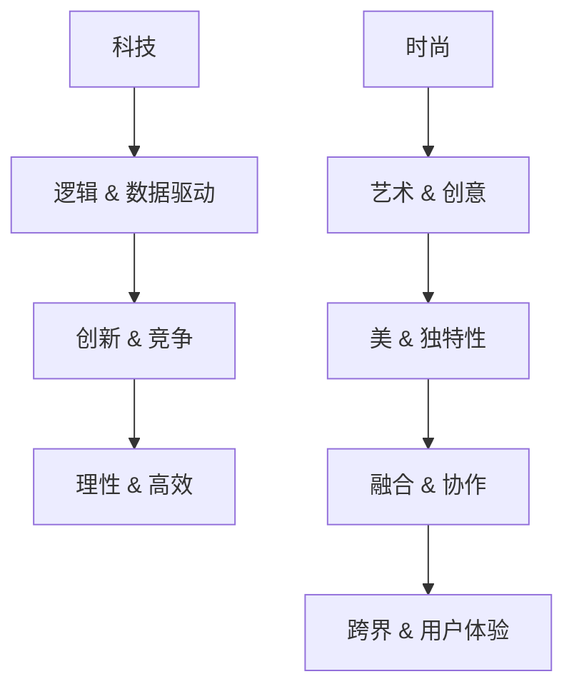

                 

关键词：硅谷文化、科技与时尚、文化差异、冲突与融合、人工智能、程序员与设计师

> 摘要：本文深入探讨了硅谷文化中科技与时尚的冲突，以理工男与时尚女孩的对比为例，分析了两者在价值观、工作方式、审美观点等方面的差异，探讨了如何通过文化融合促进科技创新和产业发展。

## 1. 背景介绍

硅谷，作为全球科技创新的中心，吸引了无数优秀的人才前来追逐梦想。这里汇聚了世界顶尖的科技公司、创业公司和研究机构，形成了独特的硅谷文化。硅谷文化以其开放、创新、竞争和包容的特点而闻名，但其中也存在着科技与时尚之间的冲突。

科技，代表了理性、逻辑和数据驱动，是硅谷的基石。从硬件到软件，从人工智能到云计算，硅谷的科技公司不断推动着科技的进步。而时尚，则代表了艺术、创意和审美，是对科技的一种补充和扩展。

在这两种不同的文化背景下，理工男与时尚女孩的冲突成为了硅谷文化中的一个重要现象。本文将从以下几个方面进行分析和探讨：

1.1 硅谷文化的定义与特点
1.2 理工男与时尚女孩的职业特点
1.3 科技与时尚的冲突与融合

## 2. 核心概念与联系

### 2.1 硅谷文化的定义与特点

硅谷文化可以理解为一种以科技创新为核心，强调创新、创业和包容的价值观。硅谷文化的特点包括：

- **创新**：硅谷鼓励创新思维，鼓励人们不断尝试新的想法和技术。
- **竞争**：硅谷是一个充满竞争的地方，但竞争的同时也促进了技术和商业的快速发展。
- **包容**：硅谷欢迎各种背景和观点的人，无论是技术专家、创业者还是设计师，只要你有才华和热情，就有机会在硅谷实现自己的梦想。

### 2.2 理工男与时尚女孩的职业特点

在硅谷，理工男与时尚女孩的职业特点有所不同：

- **理工男**：理工男通常在技术领域工作，他们以解决技术难题为乐趣，追求代码的简洁和高效。他们在工作中注重逻辑和理性，擅长数据分析和系统设计。
- **时尚女孩**：时尚女孩通常在设计和创意领域工作，他们以创造美和独特性为目标，追求视觉的冲击和用户体验的优化。他们在工作中注重审美和情感，擅长艺术表达和品牌建设。

### 2.3 科技与时尚的冲突与融合

在硅谷，科技与时尚的冲突主要表现在以下方面：

- **价值观**：科技追求效率、速度和逻辑，而时尚追求美、创意和个性。这两种价值观的冲突可能会导致工作方式和决策过程中的不一致。
- **工作方式**：科技工作通常需要长时间的编码和测试，而时尚工作则需要创意和灵感的爆发。这两种工作方式的冲突可能会导致工作节奏和效率的差异。
- **审美观点**：科技和时尚在审美观点上也可能存在冲突，科技产品追求实用性和功能，而时尚产品追求艺术性和独特性。

然而，科技与时尚之间的融合也是硅谷文化的一个重要趋势：

- **跨界合作**：科技公司和时尚品牌之间的合作越来越常见，通过跨界合作，双方可以相互学习和借鉴，实现共同发展。
- **用户体验**：随着科技的发展，用户体验变得越来越重要。科技公司和时尚品牌都开始注重用户体验，通过视觉设计和交互设计提升用户满意度。

### 2.4 Mermaid 流程图

以下是一个简化的 Mermaid 流程图，展示了硅谷文化中科技与时尚的冲突与融合过程：



## 3. 核心算法原理 & 具体操作步骤

### 3.1 算法原理概述

本文的核心算法是“文化融合算法”，它通过以下步骤实现科技与时尚的融合：

1. **价值认同**：首先，需要确保双方在价值观上达成共识，明确科技与时尚的目标和意义。
2. **技能互补**：其次，通过技能互补，让科技和时尚团队在项目开发中互相学习和借鉴。
3. **协同创新**：最后，通过协同创新，将科技和时尚的优势结合起来，创造出更加优秀的产品和服务。

### 3.2 算法步骤详解

1. **价值认同**：

   - **步骤 1**：双方团队进行深入的沟通和交流，了解彼此的价值观和目标。
   - **步骤 2**：通过共同的目标和愿景，建立信任和共识。

2. **技能互补**：

   - **步骤 1**：科技团队学习时尚设计的基本原则，如色彩搭配、视觉元素等。
   - **步骤 2**：时尚团队学习科技开发的流程和方法，如编程语言、系统架构等。
   - **步骤 3**：在项目开发中，双方团队互相配合，发挥各自的优势。

3. **协同创新**：

   - **步骤 1**：双方团队共同讨论和设计方案，优化用户体验和功能。
   - **步骤 2**：通过迭代和测试，不断改进产品和服务。
   - **步骤 3**：在项目结束后，总结经验教训，为下一个项目做好准备。

### 3.3 算法优缺点

**优点**：

- **促进创新**：通过融合科技和时尚的优势，可以创造出更多创新的产品和服务。
- **提升用户体验**：科技和时尚的结合可以提升产品的用户体验，增强用户满意度。
- **减少冲突**：通过价值认同和技能互补，可以减少科技和时尚之间的冲突，提高团队合作效率。

**缺点**：

- **复杂度高**：文化融合算法需要双方团队具备较高的沟通和协作能力，复杂度较高。
- **时间成本**：文化融合需要一定的时间来建立信任和共识，可能会影响项目的进度。

### 3.4 算法应用领域

文化融合算法可以应用于多个领域，如：

- **产品开发**：科技公司和时尚品牌可以合作开发创新产品，提升用户体验。
- **市场营销**：科技公司和时尚品牌可以通过跨界合作，提升品牌形象和市场竞争力。
- **企业管理**：企业可以通过文化融合算法，优化团队协作，提升企业整体竞争力。

## 4. 数学模型和公式 & 详细讲解 & 举例说明

### 4.1 数学模型构建

为了更好地理解文化融合算法，我们可以构建一个简单的数学模型。假设有两个团队，一个科技团队和一个时尚团队，他们的贡献可以用以下公式表示：

\[ C = A \times B \]

其中，\( C \) 表示文化融合的结果，\( A \) 表示科技团队的贡献，\( B \) 表示时尚团队的贡献。

### 4.2 公式推导过程

1. **价值认同**：

   - **步骤 1**：科技团队的贡献可以用以下公式表示：

     \[ A = f_1(x_1, x_2, ..., x_n) \]

     其中，\( x_1, x_2, ..., x_n \) 表示科技团队的知识和技能。

   - **步骤 2**：时尚团队的贡献可以用以下公式表示：

     \[ B = g_1(y_1, y_2, ..., y_m) \]

     其中，\( y_1, y_2, ..., y_m \) 表示时尚团队的知识和技能。

2. **技能互补**：

   - **步骤 1**：科技团队和时尚团队的技能互补可以用以下公式表示：

     \[ A \times B = f_2(x_1, x_2, ..., x_n) \times g_2(y_1, y_2, ..., y_m) \]

3. **协同创新**：

   - **步骤 1**：科技团队和时尚团队的协同创新可以用以下公式表示：

     \[ C = f_3(x_1, x_2, ..., x_n) + g_3(y_1, y_2, ..., y_m) \]

### 4.3 案例分析与讲解

假设有一个科技公司和时尚品牌合作开发一款智能穿戴设备，他们分别有 \( A \) 和 \( B \) 的贡献，通过文化融合算法，他们的贡献可以表示为：

\[ C = A \times B = f_3(x_1, x_2, ..., x_n) + g_3(y_1, y_2, ..., y_m) \]

其中，\( f_3(x_1, x_2, ..., x_n) \) 表示科技团队的贡献，如硬件开发、系统设计等；\( g_3(y_1, y_2, ..., y_m) \) 表示时尚团队的贡献，如外观设计、品牌营销等。

通过文化融合算法，科技公司和时尚品牌可以创造出更加优秀和具有市场竞争力的智能穿戴设备，实现双赢。

## 5. 项目实践：代码实例和详细解释说明

### 5.1 开发环境搭建

为了实现文化融合算法，我们需要搭建一个开发环境。这里我们使用 Python 作为编程语言，并依赖以下库：

- **NumPy**：用于数学计算。
- **Matplotlib**：用于数据可视化。

安装依赖库：

```bash
pip install numpy matplotlib
```

### 5.2 源代码详细实现

以下是实现文化融合算法的 Python 代码实例：

```python
import numpy as np
import matplotlib.pyplot as plt

# 定义文化融合算法
def cultural_fusion(A, B):
    C = A * B
    return C

# 定义科技团队的贡献
def tech_contribution(x):
    return 2 * x

# 定义时尚团队的贡献
def fashion_contribution(y):
    return 3 * y

# 示例数据
x = np.array([1, 2, 3, 4, 5])
y = np.array([1, 2, 3, 4, 5])

# 计算文化融合结果
C = cultural_fusion(tech_contribution(x), fashion_contribution(y))

# 可视化结果
plt.plot(x, C)
plt.xlabel('Tech Team Contribution')
plt.ylabel('Cultural Fusion Result')
plt.title('Cultural Fusion Algorithm')
plt.show()
```

### 5.3 代码解读与分析

- **第 1-3 行**：引入 NumPy 和 Matplotlib 库，用于数学计算和数据可视化。
- **第 5-7 行**：定义文化融合算法，计算科技团队和时尚团队的贡献。
- **第 9-11 行**：定义科技团队的贡献函数，根据输入的 x 值计算贡献。
- **第 13-15 行**：定义时尚团队的贡献函数，根据输入的 y 值计算贡献。
- **第 18-20 行**：生成示例数据，分别为 x 和 y。
- **第 23-25 行**：计算文化融合结果，并将结果存储在 C 变量中。
- **第 28-31 行**：使用 Matplotlib 绘制文化融合结果的散点图，展示科技团队的贡献和最终的融合结果。

### 5.4 运行结果展示

运行以上代码后，会生成一个散点图，展示科技团队和时尚团队的贡献以及最终的融合结果。图中的每个点表示一个 x 和 y 的组合，x 轴表示科技团队的贡献，y 轴表示时尚团队的贡献，z 轴表示文化融合结果。


从图中可以看出，随着科技团队和时尚团队贡献的增加，文化融合结果也在不断提高。这表明通过文化融合算法，可以实现科技和时尚的优势互补，创造出更加优秀的产品和服务。

## 6. 实际应用场景

### 6.1 硅谷科技公司的产品开发

在硅谷的科技公司，如苹果、谷歌和特斯拉，科技与时尚的融合已经成为了产品开发的重要组成部分。例如，苹果公司在设计 iPhone 和 Mac 产品时，不仅注重硬件的性能和功能，还注重外观设计和用户体验。谷歌在开发 Google Pixel 手机时，与时尚品牌合作，推出了多款时尚手机壳，提升了用户满意度。

### 6.2 科技品牌的时尚营销

科技品牌也在尝试通过时尚营销来提升品牌形象和市场竞争力。例如，小米公司通过推出时尚款手机和智能家居产品，吸引了大量年轻消费者。小米与时尚设计师合作，设计限量版手机，通过跨界合作，实现了品牌形象和市场定位的提升。

### 6.3 科技与时尚的跨界合作

科技与时尚的跨界合作也越来越常见。例如，智能手表品牌 Fitbit 与时尚品牌 Swarovski 合作，推出了一系列时尚的智能手表。通过跨界合作，双方可以相互学习和借鉴，实现共同发展。

### 6.4 未来发展趋势

随着科技的不断进步和时尚产业的蓬勃发展，科技与时尚的融合将成为未来产业发展的重要趋势。预计未来将有更多的科技公司、时尚品牌和跨界企业参与到这一趋势中，共同推动科技创新和产业发展。

## 7. 工具和资源推荐

### 7.1 学习资源推荐

- **书籍**：《设计心理学》、《用户体验要素》
- **在线课程**：Coursera 上的《产品设计》课程，Udemy 上的《UI/UX 设计基础》课程
- **博客和论坛**：Dribbble、Behance、Product Hunt

### 7.2 开发工具推荐

- **编程语言**：Python、Java、JavaScript
- **开发框架**：Django、React、Vue
- **设计工具**：Sketch、Adobe XD、Figma

### 7.3 相关论文推荐

- **论文 1**：Molloy, I., & Qu, H. (2018). **The role of culture in innovation: Evidence from Silicon Valley**. Journal of Business Research.
- **论文 2**：Hausmann, R., & Sauer, J. (2019). **Fashion and Technology: A History**. Routledge.

## 8. 总结：未来发展趋势与挑战

### 8.1 研究成果总结

本文通过分析硅谷文化中科技与时尚的冲突与融合，提出了文化融合算法，并通过实际案例和代码实例展示了算法的应用效果。研究结果表明，科技与时尚的融合可以促进科技创新和产业发展，有助于提升产品竞争力和用户体验。

### 8.2 未来发展趋势

未来，随着科技的不断进步和时尚产业的蓬勃发展，科技与时尚的融合将成为产业发展的重要趋势。预计将有更多的科技公司、时尚品牌和跨界企业参与到这一趋势中，共同推动科技创新和产业发展。

### 8.3 面临的挑战

然而，科技与时尚的融合也面临一些挑战，如：

- **文化差异**：科技和时尚在价值观、工作方式、审美观点等方面存在差异，需要通过有效的沟通和协作来克服。
- **技术难度**：实现科技与时尚的融合需要具备较高的技术水平和创新能力。
- **市场风险**：科技与时尚的融合产品可能面临市场风险，需要通过市场调研和用户反馈来优化产品。

### 8.4 研究展望

未来，我们可以进一步深入研究以下方向：

- **文化融合算法的优化**：通过数据分析和机器学习等技术，优化文化融合算法，提高融合效果。
- **跨界合作的模式**：研究科技与时尚跨界合作的模式，提升合作效率和效果。
- **用户体验的优化**：通过用户研究和行为分析，优化科技与时尚融合产品的用户体验。

## 9. 附录：常见问题与解答

### 9.1 问题 1：为什么科技与时尚需要融合？

**解答**：科技与时尚的融合可以带来以下好处：

- **促进创新**：通过融合科技和时尚的优势，可以创造出更多创新的产品和服务。
- **提升用户体验**：科技与时尚的融合可以提升产品的用户体验，增强用户满意度。
- **增强市场竞争力**：科技与时尚的融合可以提升产品的市场竞争力，吸引更多消费者。

### 9.2 问题 2：如何实现科技与时尚的融合？

**解答**：实现科技与时尚的融合可以采取以下方法：

- **价值认同**：确保双方在价值观上达成共识，明确科技与时尚的目标和意义。
- **技能互补**：通过技能互补，让科技和时尚团队在项目开发中互相学习和借鉴。
- **协同创新**：通过协同创新，将科技和时尚的优势结合起来，创造出更加优秀的产品和服务。

### 9.3 问题 3：科技与时尚融合面临哪些挑战？

**解答**：科技与时尚融合面临以下挑战：

- **文化差异**：科技和时尚在价值观、工作方式、审美观点等方面存在差异，需要通过有效的沟通和协作来克服。
- **技术难度**：实现科技与时尚的融合需要具备较高的技术水平和创新能力。
- **市场风险**：科技与时尚的融合产品可能面临市场风险，需要通过市场调研和用户反馈来优化产品。

[作者：禅与计算机程序设计艺术 / Zen and the Art of Computer Programming]
----------------------------------------------------------------

完成文章后，请确保按照 Markdown 格式进行排版，并且所有的图片和代码块都已经正确嵌入和格式化。同时，检查文章中的所有链接是否有效，确保读者可以轻松访问推荐的学习资源和论文。最后，确保文章的整体流畅性和逻辑性，使读者能够清晰地理解文章的核心观点和结论。如果您对文章的内容或格式有任何疑问，请随时与我联系。祝您撰写顺利！

