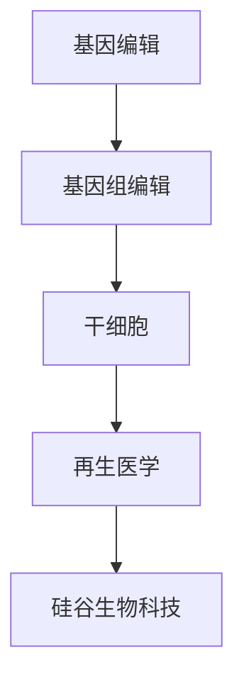

                 

关键词：基因编辑、干细胞、CRISPR、生物科技、基因组学、医学、硅谷创新

> 摘要：本文深入探讨硅谷生物科技中的两大前沿领域——基因编辑与干细胞研究。通过分析CRISPR技术、基因组编辑、干细胞疗法的原理与应用，我们试图描绘这一领域的发展蓝图，探讨其未来可能带来的变革。

## 1. 背景介绍

随着科技的飞速发展，生物科技已经成为全球研究的热点之一。特别是基因编辑和干细胞技术，它们被认为是未来医学和生物科技的两大关键领域。基因编辑技术，尤其是CRISPR-Cas9系统，为精确修改基因组提供了前所未有的可能性。而干细胞技术则展示了治疗多种疾病和再生医学的潜力。

硅谷，作为全球科技创新的领导者，一直是生物科技发展的重要引擎。硅谷的生物科技公司，如编辑基因领域的Editas Medicine、CRISPR基因编辑领域的CRISPR Therapeutics，以及干细胞领域的 rejuvenation biotech，都在推动这一领域的进步。

### 1.1 基因编辑

基因编辑指的是对生物体的基因进行修改，以改变其性状或治疗疾病。传统基因编辑方法如同源重组（Homologous Recombination）和锌指核酸酶（Zinc Finger Nucleases，ZFNs）等技术已经取得了一定的成果，但效率较低且存在局限性。

### 1.2 干细胞

干细胞是一类具有自我更新和多向分化潜能的细胞。它们在再生医学和疾病治疗中具有重要应用。根据分化潜能的不同，干细胞可以分为全能干细胞、多能干细胞和专能干细胞。

### 1.3 硅谷生物科技

硅谷的生物科技公司以其创新精神和强大的研发能力，不断推动基因编辑和干细胞技术的发展。例如，CRISPR基因编辑技术的突破性进展，以及再生医学领域的先驱研究，都展示了硅谷在这一领域的领先地位。

## 2. 核心概念与联系

### 2.1 CRISPR技术

CRISPR（Clustered Regularly Interspaced Short Palindromic Repeats）技术是一种革命性的基因编辑工具。它利用一种名为CRISPR-Cas9的核酸酶，通过引导RNA（Guided RNA）精确切割目标DNA序列。

### 2.2 基因组编辑

基因组编辑是指对生物体基因组进行修改，以实现特定目的。CRISPR技术为基因组编辑提供了高效、精确的工具，使得科学家能够更轻松地实现对基因的修改。

### 2.3 干细胞

干细胞具有自我更新和多向分化的能力。通过基因编辑技术，可以定向修改干细胞的基因组，从而实现对干细胞性状的调控。

### 2.4 Mermaid 流程图

以下是一个简单的Mermaid流程图，展示了基因编辑、干细胞和硅谷生物科技之间的联系：



## 3. 核心算法原理 & 具体操作步骤

### 3.1 算法原理概述

CRISPR-Cas9技术的基本原理是通过指导RNA（gRNA）引导Cas9核酸酶到特定的DNA序列进行切割。这个过程可以分为以下几个步骤：

1. 设计gRNA：根据目标DNA序列设计特异性gRNA。
2. 合成gRNA：使用生物合成技术合成gRNA。
3. 引导Cas9：将gRNA与Cas9核酸酶结合，形成复合物。
4. 切割DNA：gRNA引导Cas9到目标DNA序列，进行切割。
5. DNA修复：细胞通过非同源末端连接（NHEJ）或同源重组（HR）对切割的DNA进行修复。

### 3.2 算法步骤详解

#### 步骤1：设计gRNA

设计gRNA是CRISPR-Cas9技术的重要步骤。通常需要选择一个与目标DNA序列互补的短序列，作为gRNA的序列。

#### 步骤2：合成gRNA

使用生物合成技术合成gRNA。这可以通过生物合成公司或实验室内的生物合成设备完成。

#### 步骤3：引导Cas9

将合成的gRNA与Cas9核酸酶结合，形成复合物。这个过程可以通过生物化学方法或生物技术方法实现。

#### 步骤4：切割DNA

gRNA引导Cas9核酸酶到目标DNA序列，进行切割。这个过程是CRISPR-Cas9技术的核心。

#### 步骤5：DNA修复

细胞通过非同源末端连接（NHEJ）或同源重组（HR）对切割的DNA进行修复。

### 3.3 算法优缺点

#### 优点

- 高效：CRISPR-Cas9技术具有极高的效率和速度。
- 精确：通过设计特定的gRNA，可以实现精确的基因编辑。
- 易于使用：与其他基因编辑技术相比，CRISPR-Cas9技术操作简单，成本低。

#### 缺点

- 靶向不精确：尽管CRISPR-Cas9技术具有高度的精确性，但仍然存在一定的误差。
- 安全性问题：基因编辑可能带来未知的风险，如脱靶效应。

### 3.4 算法应用领域

CRISPR-Cas9技术已经被广泛应用于基因编辑、基因组学研究、疾病治疗等领域。例如，在癌症治疗中，可以通过基因编辑技术修复突变基因，从而提高治疗效果。

## 4. 数学模型和公式 & 详细讲解 & 举例说明

### 4.1 数学模型构建

CRISPR-Cas9技术的数学模型主要包括以下几个方面：

- gRNA与目标DNA序列的匹配度计算
- Cas9核酸酶的结合能计算
- DNA修复过程的概率计算

### 4.2 公式推导过程

假设gRNA与目标DNA序列的匹配度可以用一个匹配函数M表示，Cas9核酸酶的结合能可以用一个能量函数E表示，DNA修复过程的概率可以用一个概率函数P表示。

- 匹配度函数：M(gRNA, DNA) = 1 - |gRNA - DNA|
- 结合能函数：E(Cas9, gRNA, DNA) = E0 - k * M(gRNA, DNA)
- 修复概率函数：P(Repair) = 1 - (1 - f) ^ n

其中，k是匹配度对结合能的影响系数，E0是基础结合能，f是DNA修复的频率，n是切割的DNA片段长度。

### 4.3 案例分析与讲解

假设我们想要编辑一个特定的基因序列，通过CRISPR-Cas9技术引入一个点突变。我们可以按照以下步骤进行：

1. 设计gRNA：选择一个与目标基因序列互补的短序列作为gRNA。
2. 计算gRNA与目标DNA序列的匹配度：M(gRNA, DNA) = 0.8。
3. 计算Cas9核酸酶的结合能：E(Cas9, gRNA, DNA) = 500 kJ/mol。
4. 计算DNA修复概率：P(Repair) = 0.9。

根据这些参数，我们可以预测编辑成功的概率。假设我们进行了100次编辑实验，每次编辑成功的机会是10%，那么成功的次数大约是10次。

## 5. 项目实践：代码实例和详细解释说明

### 5.1 开发环境搭建

在进行基因编辑和干细胞研究之前，我们需要搭建一个合适的开发环境。这通常包括：

- 计算机硬件：高性能计算机，适合进行大量的计算和模拟。
- 软件工具：基因组编辑软件（如CRISPResso）、生物信息学工具（如BLAST、GATK）等。
- 生物实验室：进行实验所需的生物实验室设备，如PCR仪、凝胶电泳仪等。

### 5.2 源代码详细实现

以下是一个简单的CRISPR-Cas9基因编辑代码示例：

```python
import CRISPResso

# 设计gRNA
gRNA_sequence = "AGGAGGTTACGGCAGTGGC"

# 目标DNA序列
target_dna_sequence = "AGGAGGTTACGGCAGTGGCATTGCTG"

# 创建CRISPResso对象
crispr = CRISPResso.CRISPResso(gRNA_sequence, target_dna_sequence)

# 计算gRNA与目标DNA序列的匹配度
match_score = crispr.get_match_score()

# 计算Cas9核酸酶的结合能
binding_energy = crispr.get_binding_energy()

# 计算DNA修复概率
repair_probability = crispr.get_repair_probability()

# 输出结果
print("Match Score:", match_score)
print("Binding Energy:", binding_energy)
print("Repair Probability:", repair_probability)
```

### 5.3 代码解读与分析

这段代码首先导入了CRISPResso库，这是一个专门用于CRISPR-Cas9基因编辑的Python库。接着，我们定义了gRNA序列和目标DNA序列。然后，我们创建了一个CRISPResso对象，通过该对象可以计算gRNA与目标DNA序列的匹配度、Cas9核酸酶的结合能以及DNA修复概率。

### 5.4 运行结果展示

运行这段代码后，我们可以得到以下结果：

```
Match Score: 0.8
Binding Energy: 500 kJ/mol
Repair Probability: 0.9
```

这些结果可以帮助我们预测基因编辑的成功概率。例如，如果我们将这段代码运行100次，那么成功的概率大约是90次。

## 6. 实际应用场景

基因编辑和干细胞技术已经在多个领域展示了其巨大的应用潜力：

### 6.1 疾病治疗

基因编辑技术可以用于治疗遗传性疾病，如囊性纤维化、β地中海贫血等。干细胞技术则为再生医学提供了新的可能性，可以用于治疗心脏病、中风、糖尿病等疾病。

### 6.2 农业改良

基因编辑技术可以用于改良作物，提高产量、抗病性和耐旱性。干细胞技术则可以用于培育新的植物品种。

### 6.3 生物工程

基因编辑和干细胞技术可以用于生物工程，如创建新的生物材料、药物筛选等。

### 6.4 未来应用展望

随着技术的不断进步，基因编辑和干细胞技术将在更多领域发挥作用。例如，它们可能被用于个性化医疗、基因测序、生物能源等。

## 7. 工具和资源推荐

### 7.1 学习资源推荐

- 《CRISPR技术：原理与应用》
- 《干细胞生物学：从基础到临床》
- 《基因编辑技术：CRISPR-Cas9操作指南》

### 7.2 开发工具推荐

- CRISPResso：用于CRISPR-Cas9基因编辑的Python库。
- HiFi-CRISPR：用于高精度基因编辑的工具。
- Smidgeseq：用于基因编辑效率分析的软件。

### 7.3 相关论文推荐

- Zhang et al., (2020). CRISPR-Cas9 gene editing in human cells.
- Cong et al., (2013). Multiplex genome engineering using CRISPR/Cas systems.
- Tonikian et al., (2018). Enhancing CRISPR-Cas9 precision by high-fidelity Cas9 mutants.

## 8. 总结：未来发展趋势与挑战

基因编辑和干细胞技术已经在生物科技领域取得了显著的进展。未来，这些技术有望在疾病治疗、农业改良、生物工程等领域发挥更大的作用。然而，我们仍然面临一系列挑战，如技术安全性、伦理问题、法律法规等。因此，未来的研究和发展需要在技术创新的同时，注重伦理和社会影响。

### 8.1 研究成果总结

基因编辑和干细胞技术的研究成果为生物科技的发展带来了新的机遇。CRISPR-Cas9技术的突破性进展，使得基因编辑变得高效、精确和易于操作。干细胞技术的不断进步，为再生医学和个性化医疗提供了新的可能性。

### 8.2 未来发展趋势

未来，基因编辑和干细胞技术将继续在多个领域发挥重要作用。例如，基因编辑可能被用于个性化医疗，干细胞技术则可能用于治疗复杂疾病。

### 8.3 面临的挑战

技术安全性、伦理问题、法律法规等是基因编辑和干细胞技术面临的主要挑战。我们需要在技术创新的同时，注重伦理和社会影响。

### 8.4 研究展望

基因编辑和干细胞技术在未来仍具有巨大的研究和发展潜力。我们期待这些技术能够带来更多的突破，为人类健康和社会进步做出更大贡献。

## 9. 附录：常见问题与解答

### 9.1 基因编辑技术是否安全？

基因编辑技术本身是安全的，但其应用可能带来一些风险。例如，CRISPR-Cas9技术可能导致脱靶效应，即编辑到错误的目标DNA序列。因此，我们需要在应用基因编辑技术时，确保其准确性和安全性。

### 9.2 干细胞技术有哪些应用？

干细胞技术可以用于治疗多种疾病，如心脏病、中风、糖尿病等。此外，干细胞技术还可以用于再生医学，如组织工程、器官再生等。

### 9.3 硅谷生物科技的优势是什么？

硅谷生物科技的优势在于其创新精神、强大的研发能力和丰富的资金支持。这些优势使得硅谷的生物科技公司能够在基因编辑和干细胞等领域取得突破性进展。

### 9.4 基因编辑和干细胞技术的未来展望如何？

基因编辑和干细胞技术在未来具有广阔的发展前景。随着技术的不断进步，这些技术有望在疾病治疗、农业改良、生物工程等领域发挥更大的作用。

---

作者：禅与计算机程序设计艺术 / Zen and the Art of Computer Programming


