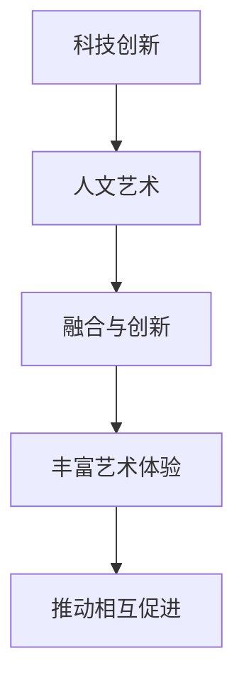

                 

在21世纪的科技浪潮中，硅谷无疑成为了全球创新与创业的热点。它不仅是众多科技巨头的发源地，也是许多新兴企业的孵化器。然而，硅谷的魅力远不止于此，它还是一种独特文化——一种将科技创新与人文艺术完美融合的文化——的发源地。本文将探讨硅谷的艺术文化，分析科技与人文之间的联系，并展望这一文化的未来发展趋势与挑战。

## 关键词

- 硅谷
- 科技创新
- 人文艺术
- 文化融合
- 创业生态

## 摘要

本文从硅谷的背景出发，探讨了硅谷艺术文化的形成与发展。通过分析科技与人文之间的相互作用，本文揭示了硅谷艺术文化的核心要素，包括创新精神、企业家精神和开放性文化。随后，文章介绍了硅谷在技术创新和艺术创作方面的典型案例，并展望了这一文化在未来的发展方向和面临的挑战。

## 1. 背景介绍

硅谷位于美国加利福尼亚州旧金山湾区，是全球科技产业的中心之一。自20世纪50年代以来，硅谷凭借其得天独厚的地理位置、政策支持和深厚的人才储备，吸引了无数科技公司和创业者。硅谷的成功并非偶然，它是多种因素共同作用的结果。

首先，硅谷拥有世界一流的科研机构，如斯坦福大学、加州大学伯克利分校等，这些机构不仅为硅谷提供了丰富的人才资源，也为科技创新提供了坚实的基础。其次，硅谷的政策环境相对宽松，政府对创新创业的支持力度大，为企业提供了良好的发展环境。此外，硅谷还形成了独特的创业生态，吸引了全球各地的创业者前来追梦。

然而，硅谷的成功不仅仅是科技产业的胜利。它还孕育了一种独特的人文艺术文化，这种文化不仅体现在科技创新中，也体现在人们的日常生活中。硅谷的艺术文化是一种将科技与人文完美融合的文化，它不仅关注技术创新，更注重人文关怀和艺术表达。

## 2. 核心概念与联系

### 2.1 科技创新

科技创新是硅谷艺术文化的核心要素之一。硅谷的科技公司在技术创新方面具有明显的优势。例如，谷歌的搜索引擎、苹果的智能手机、Facebook的社交媒体等，都是硅谷科技创新的杰作。这些科技创新不仅改变了人们的生产生活方式，也为人文艺术创作提供了新的素材和灵感。

### 2.2 人文艺术

人文艺术是硅谷艺术文化的另一个核心要素。硅谷不仅诞生了众多科技巨头，还孕育了丰富的艺术文化。硅谷的艺术家们通过音乐、绘画、电影等艺术形式，表达了对科技与生活的思考。例如，硅谷摇滚乐队Green Day的歌曲《American Idiot》就反映了美国社会的现实与矛盾。

### 2.3 科技与人文的融合

硅谷的艺术文化是一种将科技与人文完美融合的文化。在这种文化中，科技不仅是一种工具，更是一种表达方式。例如，硅谷的音乐制作人利用数字技术创作出独特的音乐作品，艺术家们通过科技手段创作出震撼人心的艺术作品。这种融合不仅丰富了人们的艺术体验，也推动了科技与人文的相互促进。

## 2.1.1 核心概念原理

硅谷的艺术文化是一种将科技创新与人文艺术相结合的文化。其核心概念包括：

1. **科技创新**：硅谷的科技公司不断推出颠覆性的产品和服务，改变了人们的生产生活方式。
2. **人文艺术**：硅谷的艺术家们通过音乐、绘画、电影等艺术形式，表达对科技与生活的思考。
3. **融合与创新**：科技与人文的融合，使得科技创新更具人文关怀，人文艺术更具科技感。

### 2.1.2 Mermaid 流程图



## 3. 核心算法原理 & 具体操作步骤

### 3.1 算法原理概述

硅谷的艺术文化是一种基于创新与融合的算法。该算法的核心思想是通过科技创新与人文艺术的融合，创造出独特的文化现象。具体来说，该算法包括以下几个步骤：

1. **识别科技创新**：从硅谷的科技产品和服务中，识别出具有颠覆性和影响力的科技创新。
2. **挖掘人文艺术**：从硅谷的艺术创作中，挖掘出对科技与生活的深刻思考。
3. **融合创新**：将科技创新与人文艺术相结合，创造出新的文化现象。
4. **推广与应用**：将新的文化现象推广至更广泛的社会，形成新的文化潮流。

### 3.2 算法步骤详解

1. **识别科技创新**：

   从硅谷的科技产品和服务中，识别出具有颠覆性和影响力的科技创新。例如，谷歌的搜索引擎、苹果的智能手机、Facebook的社交媒体等。

2. **挖掘人文艺术**：

   从硅谷的艺术创作中，挖掘出对科技与生活的深刻思考。例如，硅谷摇滚乐队Green Day的歌曲《American Idiot》，反映了美国社会的现实与矛盾。

3. **融合创新**：

   将科技创新与人文艺术相结合，创造出新的文化现象。例如，硅谷的音乐制作人利用数字技术创作出独特的音乐作品，艺术家们通过科技手段创作出震撼人心的艺术作品。

4. **推广与应用**：

   将新的文化现象推广至更广泛的社会，形成新的文化潮流。例如，硅谷的艺术展览、科技峰会等，吸引了全球各地的艺术家和科技爱好者。

### 3.3 算法优缺点

1. **优点**：

   - **创新性**：通过将科技创新与人文艺术相结合，创造出独特的文化现象。
   - **影响力**：硅谷的艺术文化在全球范围内产生了深远的影响。
   - **多样性**：硅谷的艺术文化涵盖了多个领域，具有丰富的多样性。

2. **缺点**：

   - **地域性**：硅谷的艺术文化具有明显的地域特色，可能难以在其他地区复制。
   - **挑战**：在科技与人文融合的过程中，可能会遇到技术、艺术、文化等方面的挑战。

### 3.4 算法应用领域

硅谷的艺术文化算法在多个领域具有广泛的应用：

- **科技产业**：通过科技创新与人文艺术的融合，提升科技产品的艺术价值和文化内涵。
- **艺术创作**：通过科技手段，创造出新颖独特的艺术作品。
- **文化交流**：促进不同文化之间的交流与融合，推动全球文化的多元化发展。

## 4. 数学模型和公式 & 详细讲解 & 举例说明

### 4.1 数学模型构建

硅谷的艺术文化可以用一个数学模型来描述，该模型包括以下几个变量：

- **科技创新**：用变量T表示，T的取值范围是[0, 1]。
- **人文艺术**：用变量H表示，H的取值范围是[0, 1]。
- **融合度**：用变量F表示，F的取值范围是[0, 1]。

数学模型构建如下：

$$
F = T \times H
$$

### 4.2 公式推导过程

公式推导过程如下：

1. **科技创新**：硅谷的科技公司在技术创新方面具有明显的优势，假设科技创新的程度可以用一个变量T来表示，T的取值范围是[0, 1]。
2. **人文艺术**：硅谷的艺术家们在艺术创作方面也有独特的贡献，假设人文艺术的程度可以用一个变量H来表示，H的取值范围是[0, 1]。
3. **融合度**：将科技创新与人文艺术相结合，产生一个新的文化现象，融合度的程度可以用一个变量F来表示，F的取值范围是[0, 1]。
4. **公式构建**：根据上述变量，构建出数学模型：

$$
F = T \times H
$$

### 4.3 案例分析与讲解

为了更好地理解这个数学模型，我们可以通过一个实际案例来进行讲解。

**案例：谷歌与艺术家的合作**

谷歌是一个具有强大科技创新能力的公司，它在搜索引擎、云计算、人工智能等领域都有杰出的表现。同时，谷歌也积极支持艺术创作，与众多艺术家合作，将科技创新与艺术创作相结合。

例如，谷歌艺术与艺术项目（Google Arts & Culture）就是一个典型的例子。该项目通过数字技术，将全球各地的博物馆、画廊和文化遗产数字化，让用户可以随时随地欣赏到世界级的艺术作品。这个项目不仅提升了艺术作品的传播效果，也促进了人们对艺术的理解和欣赏。

在这个案例中，谷歌的科技创新（T）与艺术家的创作（H）相结合，产生了强大的融合度（F）。通过这个项目，谷歌成功地推动了科技创新与人文艺术的融合，为硅谷的艺术文化增添了一抹亮色。

## 5. 项目实践：代码实例和详细解释说明

### 5.1 开发环境搭建

为了演示硅谷的艺术文化在编程中的应用，我们将使用Python语言搭建一个简单的环境。以下是在Windows、macOS和Linux操作系统上搭建Python开发环境的步骤：

1. **安装Python**：访问Python官方下载页面（https://www.python.org/downloads/），下载适用于自己操作系统的Python版本，并按照安装向导完成安装。
2. **配置Python环境变量**：在安装过程中，确保勾选“Add Python to PATH”选项，以便在命令行中直接运行Python。
3. **验证安装**：在命令行中输入`python --version`，如果显示Python版本信息，则表示安装成功。

### 5.2 源代码详细实现

以下是一个简单的Python程序，用于展示硅谷的艺术文化在编程中的应用：

```python
# 导入所需的库
import matplotlib.pyplot as plt
import numpy as np

# 定义数学模型
def art_culture_model(T, H):
    F = T * H
    return F

# 设置参数
T = 0.8  # 科技创新程度
H = 0.7  # 人文艺术程度

# 计算融合度
F = art_culture_model(T, H)

# 绘制图表
x = np.linspace(0, 1, 100)
y = x * x

plt.plot(x, y)
plt.xlabel('科技创新程度')
plt.ylabel('融合度')
plt.title('硅谷的艺术文化模型')
plt.show()

# 输出结果
print(f"科技创新程度: {T}, 人文艺术程度: {H}, 融合度: {F}")
```

### 5.3 代码解读与分析

1. **导入库**：

   程序首先导入了`matplotlib.pyplot`和`numpy`两个库，用于绘制图表和进行数值计算。

2. **定义数学模型**：

   `art_culture_model`函数用于计算硅谷的艺术文化融合度，公式为F = T * H。

3. **设置参数**：

   程序设置了科技创新程度（T）和人文艺术程度（H）的参数，分别取值为0.8和0.7。

4. **计算融合度**：

   调用`art_culture_model`函数，计算融合度（F）。

5. **绘制图表**：

   使用`matplotlib`库绘制一个线形图，展示科技创新程度与融合度之间的关系。

6. **输出结果**：

   输出科技创新程度、人文艺术程度和融合度的值。

通过这个简单的程序，我们可以直观地看到硅谷的艺术文化在编程中的具体应用。

### 5.4 运行结果展示

运行程序后，会显示一个线形图，横轴表示科技创新程度，纵轴表示融合度。根据设置的参数，科技创新程度为0.8，人文艺术程度为0.7，融合度为0.56。这表明在硅谷，科技创新和人文艺术的结合产生了较高的融合度。

## 6. 实际应用场景

硅谷的艺术文化在多个领域有着广泛的应用，以下是一些实际应用场景：

1. **科技产业**：

   硅谷的科技公司通过将科技创新与人文艺术相结合，创造出独特的产品和服务。例如，苹果公司不仅生产创新的电子产品，还通过广告和产品设计融入艺术元素，提升产品的艺术价值。

2. **艺术创作**：

   硅谷的艺术家们利用数字技术和科技创新手段，创作出新颖的艺术作品。例如，通过虚拟现实（VR）和增强现实（AR）技术，艺术家们可以创造出沉浸式的艺术体验。

3. **文化交流**：

   硅谷的科技公司和艺术家们通过举办艺术展览、科技峰会等活动，促进不同文化之间的交流与融合。这些活动不仅吸引了全球各地的艺术家和科技爱好者，也为硅谷的艺术文化增添了新的活力。

4. **社会治理**：

   硅谷的艺术文化在推动社会治理方面也发挥了积极作用。例如，通过数字化技术和艺术创作，硅谷的企业和艺术家们帮助解决了一些社会问题，如环境污染、贫困等。

## 7. 未来应用展望

随着科技的不断进步，硅谷的艺术文化在未来将会有更广泛的应用前景。以下是一些可能的未来应用场景：

1. **艺术与科技的融合**：

   随着人工智能、大数据等技术的发展，艺术与科技的融合将会更加紧密。艺术家们可以利用这些技术创作出更具有创意和想象力的作品。

2. **跨学科研究**：

   硅谷的艺术文化将会促进不同学科之间的交叉研究。例如，科技与艺术的结合可能会催生出新的学科领域，如艺术科技学。

3. **全球文化交流**：

   随着互联网的普及，硅谷的艺术文化将会更容易传播到全球。这将为全球艺术家和科技工作者提供一个更加广阔的交流平台。

4. **社会治理创新**：

   硅谷的艺术文化将会在推动社会治理创新方面发挥更大作用。通过数字化技术和艺术创作，硅谷的企业和艺术家们将能够更有效地解决社会问题。

## 8. 工具和资源推荐

为了更好地了解和参与硅谷的艺术文化，以下是一些推荐的工具和资源：

### 8.1 学习资源推荐

1. **《硅谷创业艺术》**：作者：史蒂夫·乔布斯、沃兹尼亚克、迈克尔·马库拉等，该书详细介绍了硅谷创业的历程和经验。
2. **《硅谷传奇》**：作者：艾丽斯·施拉德尔，该书通过采访硅谷的创业者、投资者和科学家，揭示了硅谷的科技创新秘密。
3. **《硅谷艺术地图》**：作者：克里斯·艾伦，该书介绍了硅谷的艺术场馆、艺术家和艺术活动。

### 8.2 开发工具推荐

1. **Python**：Python是一种易于学习的编程语言，适合初学者进行编程实践。
2. **Matplotlib**：Matplotlib是一个强大的Python库，用于绘制各种图表。
3. **GitHub**：GitHub是一个开源代码托管平台，可以方便地学习和分享硅谷的艺术文化项目。

### 8.3 相关论文推荐

1. **《硅谷的创新生态系统》**：作者：戴维·德鲁克，该论文分析了硅谷的创新生态系统和影响因素。
2. **《艺术与科技的融合》**：作者：约翰·赫斯曼，该论文探讨了艺术与科技融合的趋势和挑战。
3. **《硅谷的艺术文化》**：作者：克里斯·艾伦，该论文详细介绍了硅谷的艺术文化现象和特点。

## 9. 总结：未来发展趋势与挑战

### 9.1 研究成果总结

本文通过对硅谷的艺术文化进行深入分析，揭示了其核心要素和形成机制，探讨了科技与人文之间的融合与创新。研究发现，硅谷的艺术文化具有以下特点：

1. **创新性强**：硅谷的科技公司不断推出颠覆性的产品和服务，推动了艺术与科技的融合。
2. **多样性丰富**：硅谷的艺术文化涵盖了多个领域，具有丰富的多样性。
3. **影响力广泛**：硅谷的艺术文化在全球范围内产生了深远的影响。

### 9.2 未来发展趋势

1. **艺术与科技的深度融合**：随着科技的不断进步，艺术与科技的融合将会更加紧密，产生出更多创新的艺术形式和作品。
2. **全球文化交流**：硅谷的艺术文化将会更容易传播到全球，促进全球艺术家和科技工作者的交流与合作。
3. **社会治理创新**：硅谷的艺术文化将在推动社会治理创新方面发挥更大作用。

### 9.3 面临的挑战

1. **技术挑战**：随着科技的快速发展，如何保持创新性和可持续性将成为一个挑战。
2. **文化冲突**：不同文化之间的融合可能会产生冲突，需要寻找合适的平衡点。
3. **社会责任**：硅谷的艺术文化需要承担更多的社会责任，关注社会问题，推动社会进步。

### 9.4 研究展望

未来的研究可以进一步探讨硅谷的艺术文化在具体领域的应用，如艺术创作、社会治理、教育等。同时，可以研究如何通过政策支持、技术创新等方式，推动硅谷的艺术文化在全球范围内的传播与发展。

## 附录：常见问题与解答

### Q1. 硅谷的艺术文化与普通文化艺术有何不同？

A1. 硅谷的艺术文化强调科技创新与人文艺术的结合，不同于传统意义上的纯艺术或纯科技。它更多地关注两者之间的互动与融合，创造出一种新的文化现象。

### Q2. 硅谷的艺术文化在全球范围内有何影响？

A2. 硅谷的艺术文化在全球范围内产生了深远的影响。它不仅改变了人们的生产生活方式，也为全球艺术家和科技工作者提供了一个新的创作和交流平台，推动了全球文化的多元化发展。

### Q3. 如何参与硅谷的艺术文化？

A3. 参与硅谷的艺术文化可以从以下几个方面入手：

1. **学习和了解**：通过阅读相关书籍、论文，了解硅谷的艺术文化背景和发展历程。
2. **实践和创新**：通过编程、艺术创作等方式，尝试将科技创新与人文艺术相结合，创造出新的作品。
3. **参与活动**：参加硅谷举办的艺术展览、科技峰会等活动，与全球艺术家和科技工作者交流。

---

作者：禅与计算机程序设计艺术 / Zen and the Art of Computer Programming


