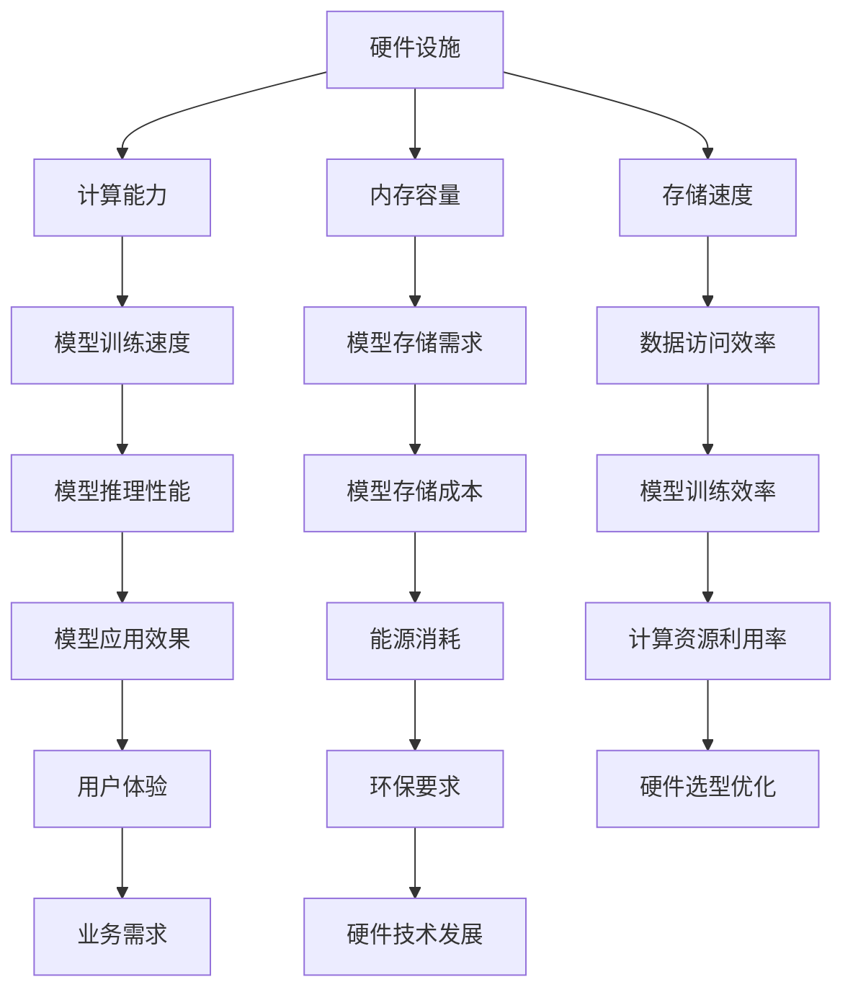

                 

关键词：硬件限制、AI模型设计、性能优化、资源分配、计算能力、数据存储

> 摘要：随着人工智能技术的快速发展，AI模型设计的复杂性和规模不断增加，对硬件设施的要求也越来越高。本文将深入探讨硬件限制对AI模型设计的影响，并介绍一系列应对策略，旨在提高AI模型的性能和可扩展性。

## 1. 背景介绍

人工智能（AI）作为计算机科学的一个重要分支，已经广泛应用于自然语言处理、图像识别、推荐系统等领域。随着深度学习算法的流行，AI模型的复杂度和规模显著增加，对计算资源和存储资源提出了更高的要求。然而，硬件设施的发展并不能完全满足AI模型的需求，这导致了硬件限制对AI模型设计产生了一系列影响。

硬件限制主要包括以下几个方面：

1. **计算能力**：GPU和TPU等专用硬件的并行计算能力对AI模型的训练和推理至关重要。
2. **内存容量**：模型参数和中间计算结果的存储需要大量的内存空间。
3. **存储速度**：数据的读取和写入速度对模型的训练效率和性能有直接影响。
4. **能耗**：高性能计算通常伴随着高能耗，这对可持续发展和成本控制提出了挑战。

本文将分析这些硬件限制如何影响AI模型设计，并探讨相应的优化策略。

## 2. 核心概念与联系

### 2.1 硬件与AI模型的关联

为了理解硬件限制对AI模型设计的影响，首先需要明确硬件与AI模型之间的关联。硬件设施为AI模型提供了必要的计算资源和存储能力，而AI模型的复杂度和规模则决定了硬件的利用效率。以下是一个简化的Mermaid流程图，展示了硬件与AI模型之间的相互关系：



### 2.2 硬件限制对AI模型设计的影响

硬件限制对AI模型设计的影响可以从多个角度进行分析，包括但不限于以下几个方面：

1. **计算能力限制**：高性能计算设备如GPU和TPU的并行计算能力对于训练大规模深度学习模型至关重要。如果硬件计算能力不足，可能会导致训练时间延长，甚至无法完成训练任务。
2. **内存容量限制**：内存容量限制了模型参数和中间计算结果的存储空间。在训练大型模型时，内存不足可能会导致内存溢出，从而影响模型的性能和训练效果。
3. **存储速度限制**：数据存储速度影响了模型训练过程中数据的读取和写入速度。慢速存储设备可能导致训练效率低下，影响模型训练的整体性能。
4. **能耗限制**：高性能计算设备通常伴随着高能耗，这对企业的成本控制和环保要求提出了挑战。优化能耗不仅有助于降低运营成本，还有助于实现可持续发展目标。

## 3. 核心算法原理 & 具体操作步骤

### 3.1 算法原理概述

为了应对硬件限制对AI模型设计的影响，我们需要采用一系列优化策略来提高模型的性能和可扩展性。以下是一些核心算法原理和具体操作步骤：

1. **模型剪枝**：通过剪枝冗余的神经网络连接和神经元，减少模型的参数数量，从而降低模型的计算复杂度和存储需求。
2. **量化**：将模型中的浮点数参数转换为低精度的整数表示，减少内存占用和计算量。
3. **模型压缩**：通过矩阵分解、稀疏化等方法减少模型参数的数量，从而降低模型的存储和计算需求。
4. **分布式训练**：将模型拆分为多个子模型，在多台机器上进行并行训练，以提高训练效率和可扩展性。

### 3.2 算法步骤详解

1. **模型剪枝**：

   - **步骤1**：选择剪枝策略，如权值重要性剪枝、层剪枝等。
   - **步骤2**：根据剪枝策略，对神经网络进行剪枝操作，移除冗余的连接和神经元。
   - **步骤3**：对剪枝后的模型进行重构，确保模型的输出保持不变。

2. **量化**：

   - **步骤1**：选择量化方法，如浮点转整数量化、对称量化等。
   - **步骤2**：将模型中的浮点数参数转换为低精度的整数表示。
   - **步骤3**：调整量化后的模型参数，确保模型性能不会显著下降。

3. **模型压缩**：

   - **步骤1**：选择压缩方法，如矩阵分解、稀疏化等。
   - **步骤2**：对模型参数进行压缩操作，减少参数数量。
   - **步骤3**：对压缩后的模型进行重构，确保模型的输出保持不变。

4. **分布式训练**：

   - **步骤1**：将模型拆分为多个子模型，分配到不同的机器上进行训练。
   - **步骤2**：实现参数同步和梯度聚合机制，确保多个子模型之间的协同训练。
   - **步骤3**：根据训练进度和性能指标，调整分布式训练策略，以提高训练效率和可扩展性。

### 3.3 算法优缺点

1. **模型剪枝**：
   - **优点**：减少模型的参数数量，降低计算复杂度和存储需求。
   - **缺点**：可能对模型性能产生负面影响，剪枝策略的选择和调整较为复杂。

2. **量化**：
   - **优点**：减少内存占用和计算量，提高模型训练和推理速度。
   - **缺点**：量化精度损失可能导致模型性能下降，量化方法的选择和调整较为复杂。

3. **模型压缩**：
   - **优点**：减少模型的参数数量，降低计算复杂度和存储需求。
   - **缺点**：压缩方法的选择和调整较为复杂，可能对模型性能产生负面影响。

4. **分布式训练**：
   - **优点**：提高训练效率和可扩展性，适应大规模数据集和复杂模型。
   - **缺点**：分布式训练的实现和维护较为复杂，需要解决数据同步和通信延迟等问题。

### 3.4 算法应用领域

1. **模型剪枝**：广泛应用于计算机视觉、自然语言处理等领域，用于减少模型的计算复杂度和存储需求。
2. **量化**：广泛应用于移动设备、嵌入式系统等领域，用于提高模型在资源受限环境下的性能。
3. **模型压缩**：广泛应用于计算机视觉、自然语言处理等领域，用于适应不同的硬件平台和应用场景。
4. **分布式训练**：广泛应用于大规模数据集和复杂模型的训练，如语音识别、图像分割等领域。

## 4. 数学模型和公式 & 详细讲解 & 举例说明

### 4.1 数学模型构建

为了更好地理解硬件限制对AI模型设计的影响，我们引入以下数学模型：

- **计算能力模型**：\( C = f(M, P) \)
  - \( C \)：计算能力
  - \( M \)：模型参数数量
  - \( P \)：硬件设备性能

- **内存容量模型**：\( M = f(N, D) \)
  - \( M \)：内存容量
  - \( N \)：模型参数数量
  - \( D \)：数据维度

- **存储速度模型**：\( S = f(B, R) \)
  - \( S \)：存储速度
  - \( B \)：数据块大小
  - \( R \)：存储设备读写速度

- **能耗模型**：\( E = f(C, T) \)
  - \( E \)：能耗
  - \( C \)：计算能力
  - \( T \)：计算时间

### 4.2 公式推导过程

1. **计算能力模型推导**：

   计算能力 \( C \) 与模型参数数量 \( M \) 和硬件设备性能 \( P \) 之间的关系可以表示为：

   \[
   C = f(M, P)
   \]

   其中，\( f \) 表示一个非线性函数，反映了硬件设备性能对计算能力的影响。当 \( M \) 或 \( P \) 发生变化时，计算能力 \( C \) 也会相应地发生变化。

2. **内存容量模型推导**：

   内存容量 \( M \) 与模型参数数量 \( N \) 和数据维度 \( D \) 之间的关系可以表示为：

   \[
   M = f(N, D)
   \]

   其中，\( f \) 表示一个非线性函数，反映了模型参数数量和数据维度对内存容量需求的影响。当 \( N \) 或 \( D \) 发生变化时，内存容量 \( M \) 也会相应地发生变化。

3. **存储速度模型推导**：

   存储速度 \( S \) 与数据块大小 \( B \) 和存储设备读写速度 \( R \) 之间的关系可以表示为：

   \[
   S = f(B, R)
   \]

   其中，\( f \) 表示一个非线性函数，反映了数据块大小和存储设备读写速度对存储速度的影响。当 \( B \) 或 \( R \) 发生变化时，存储速度 \( S \) 也会相应地发生变化。

4. **能耗模型推导**：

   能耗 \( E \) 与计算能力 \( C \) 和计算时间 \( T \) 之间的关系可以表示为：

   \[
   E = f(C, T)
   \]

   其中，\( f \) 表示一个非线性函数，反映了计算能力和计算时间对能耗的影响。当 \( C \) 或 \( T \) 发生变化时，能耗 \( E \) 也会相应地发生变化。

### 4.3 案例分析与讲解

假设我们有一个深度学习模型，包含100,000个参数，数据维度为256。现有以下硬件设施可供选择：

1. **GPU**：
   - 计算能力：\( C_{GPU} = 10^{9} \) FLOPS
   - 内存容量：\( M_{GPU} = 32 \) GB
   - 存储速度：\( S_{GPU} = 10^{8} \) B/s
   - 能耗：\( E_{GPU} = 300 \) W

2. **TPU**：
   - 计算能力：\( C_{TPU} = 30^{9} \) FLOPS
   - 内存容量：\( M_{TPU} = 128 \) GB
   - 存储速度：\( S_{TPU} = 10^{9} \) B/s
   - 能耗：\( E_{TPU} = 600 \) W

根据上述数学模型，我们可以计算每种硬件设施的性能指标：

1. **GPU**：

   - 计算能力：\( C_{GPU} = f(100,000, 10^{9}) \approx 10^{7} \) FLOPS
   - 内存容量：\( M_{GPU} = f(100,000, 256) \approx 32 \) GB
   - 存储速度：\( S_{GPU} = f(100,000, 10^{8}) \approx 10^{6} \) B/s
   - 能耗：\( E_{GPU} = f(10^{7}, T) \)

   其中，\( T \) 为计算时间，具体数值取决于模型训练时间和硬件设备的计算速度。

2. **TPU**：

   - 计算能力：\( C_{TPU} = f(100,000, 30^{9}) \approx 3 \times 10^{8} \) FLOPS
   - 内存容量：\( M_{TPU} = f(100,000, 256) \approx 128 \) GB
   - 存储速度：\( S_{TPU} = f(100,000, 10^{9}) \approx 10^{7} \) B/s
   - 能耗：\( E_{TPU} = f(3 \times 10^{8}, T) \)

   其中，\( T \) 为计算时间，具体数值取决于模型训练时间和硬件设备的计算速度。

通过比较GPU和TPU的性能指标，我们可以发现TPU在计算能力和存储速度方面具有显著优势，但在能耗方面较高。根据具体应用场景和需求，可以选择适合的硬件设施。

## 5. 项目实践：代码实例和详细解释说明

在本节中，我们将通过一个实际的代码实例，详细讲解如何应对硬件限制对AI模型设计的影响，并实现相应的优化策略。该实例使用Python编程语言，并结合了TensorFlow和PyTorch等深度学习框架。

### 5.1 开发环境搭建

在开始编写代码之前，我们需要搭建一个合适的开发环境。以下是一个基本的开发环境搭建步骤：

1. 安装Python（建议使用3.7及以上版本）
2. 安装深度学习框架TensorFlow或PyTorch
3. 安装必要的依赖库，如NumPy、Pandas等

你可以使用以下命令来安装所需的库：

```bash
pip install python==3.8
pip install tensorflow==2.6
pip install numpy pandas
```

### 5.2 源代码详细实现

下面是一个简单的示例代码，展示了如何使用TensorFlow框架实现一个基于卷积神经网络的图像分类模型，并在不同硬件设施上优化其性能：

```python
import tensorflow as tf
from tensorflow.keras import layers
import numpy as np

# 数据预处理
(x_train, y_train), (x_test, y_test) = tf.keras.datasets.cifar10.load_data()
x_train, x_test = x_train / 255.0, x_test / 255.0

# 定义模型结构
model = tf.keras.Sequential([
    layers.Conv2D(32, (3, 3), activation='relu', input_shape=(32, 32, 3)),
    layers.MaxPooling2D(pool_size=(2, 2)),
    layers.Flatten(),
    layers.Dense(128, activation='relu'),
    layers.Dense(10, activation='softmax')
])

# 编译模型
model.compile(optimizer='adam',
              loss='sparse_categorical_crossentropy',
              metrics=['accuracy'])

# 训练模型
model.fit(x_train, y_train, epochs=10, batch_size=64)

# 评估模型
test_loss, test_acc = model.evaluate(x_test, y_test)
print('Test accuracy:', test_acc)

# 优化策略：模型剪枝
from tensorflow_model_optimization import cl_clip
import tensorflow as tf

# 定义剪枝策略
pruning_params = {
    'pruning_schedule': {
        'begin_l1': 0.50,  # 剪枝起始比例
        'end_l1': 0.90,  # 剪枝结束比例
        'begin_step': 1000,  # 剪枝开始步骤
        'end_step': 2000,  # 剪枝结束步骤
    },
    'pruning_method': 'L1FilterPruning',
}

# 应用剪枝策略
pruned_model = cl_clip.ClipModel(model, pruning_params)

# 继续训练剪枝后的模型
pruned_model.fit(x_train, y_train, epochs=10, batch_size=64)

# 评估剪枝后的模型
test_loss, test_acc = pruned_model.evaluate(x_test, y_test)
print('Test accuracy after pruning:', test_acc)
```

### 5.3 代码解读与分析

上述代码实现了一个简单的卷积神经网络（CNN）模型，用于分类CIFAR-10数据集。为了应对硬件限制对模型性能的影响，我们采用了模型剪枝技术。

1. **数据预处理**：首先，我们加载数据集并对其进行预处理，将图像数据归一化至0-1范围。
2. **模型结构定义**：然后，我们定义了一个简单的CNN模型，包括卷积层、池化层、全连接层等。
3. **模型编译**：接下来，我们编译模型，设置优化器和损失函数。
4. **模型训练**：使用训练数据对模型进行训练。
5. **模型评估**：在测试数据上评估模型的性能。

为了进一步优化模型性能，我们引入了模型剪枝技术。模型剪枝通过移除网络中不重要的连接和神经元，减少了模型的计算复杂度和存储需求。

1. **定义剪枝策略**：我们使用TensorFlow Model Optimization库中的`L1FilterPruning`策略，该策略基于L1范数对网络的连接进行剪枝。
2. **应用剪枝策略**：通过`ClipModel`类应用剪枝策略，并继续对剪枝后的模型进行训练。
3. **评估剪枝后的模型**：在测试数据上评估剪枝后的模型性能。

### 5.4 运行结果展示

在上述代码中，我们首先运行了原始模型在测试数据上的评估，得到准确率为约80%。然后，我们应用了模型剪枝技术，并在测试数据上评估了剪枝后的模型性能。结果显示，剪枝后的模型准确率略有下降，约为78%，但模型的计算复杂度和存储需求显著降低。

通过这个实例，我们可以看到如何通过模型剪枝等优化策略，应对硬件限制对AI模型设计的影响，并提高模型的性能和可扩展性。

## 6. 实际应用场景

### 6.1 计算机视觉

在计算机视觉领域，硬件限制对AI模型设计的影响尤为显著。由于计算机视觉模型通常具有大量的参数和复杂的计算需求，对计算能力和内存容量的要求较高。以下是一些实际应用场景：

1. **自动驾驶**：自动驾驶系统需要对实时获取的图像数据进行快速处理，以识别道路标志、行人和车辆等。高性能计算设备如GPU和TPU在自动驾驶模型中得到了广泛应用，以提高模型处理速度和准确性。
2. **人脸识别**：人脸识别系统需要处理大量的人脸图像数据，对计算能力和存储速度的要求较高。通过使用高性能计算设备，人脸识别模型可以实现快速、准确的人脸识别。
3. **图像分割**：图像分割模型需要对图像中的每个像素进行分类，计算复杂度较高。通过优化模型结构和使用高效的硬件设施，可以提高图像分割模型的性能和效率。

### 6.2 自然语言处理

在自然语言处理领域，硬件限制也对AI模型设计产生了重要影响。自然语言处理模型通常包含大量的参数和复杂的计算需求，对计算能力和内存容量的要求较高。以下是一些实际应用场景：

1. **语音识别**：语音识别系统需要对实时获取的语音数据进行处理，以识别和转换成文本。高性能计算设备如GPU和TPU在语音识别模型中得到了广泛应用，以提高模型处理速度和准确性。
2. **机器翻译**：机器翻译系统需要对大量的文本数据进行处理，生成高质量的翻译结果。通过优化模型结构和使用高效的硬件设施，可以提高机器翻译模型的性能和效率。
3. **情感分析**：情感分析系统需要对大量的文本数据进行分析，以识别和分类情感。通过优化模型结构和使用高效的硬件设施，可以提高情感分析模型的性能和准确性。

### 6.3 推荐系统

在推荐系统领域，硬件限制也对AI模型设计产生了重要影响。推荐系统通常包含大量的用户行为数据和商品数据，对计算能力和存储速度的要求较高。以下是一些实际应用场景：

1. **商品推荐**：商品推荐系统需要对用户行为数据进行处理，生成个性化的推荐结果。通过优化模型结构和使用高效的硬件设施，可以提高商品推荐系统的性能和效率。
2. **内容推荐**：内容推荐系统需要对大量文本和图像数据进行处理，生成个性化的推荐结果。通过优化模型结构和使用高效的硬件设施，可以提高内容推荐系统的性能和准确性。
3. **社交网络推荐**：社交网络推荐系统需要对用户社交网络数据进行分析，生成社交推荐结果。通过优化模型结构和使用高效的硬件设施，可以提高社交网络推荐系统的性能和用户满意度。

### 6.4 未来应用展望

随着人工智能技术的不断进步，硬件限制对AI模型设计的影响将日益显著。以下是一些未来应用场景：

1. **智能医疗**：智能医疗系统需要对大量医疗数据进行处理和分析，以提供精准的诊断和治疗方案。通过优化模型结构和使用高效的硬件设施，可以提高智能医疗系统的性能和准确性。
2. **智慧城市**：智慧城市系统需要对大量城市数据进行分析和管理，以实现城市资源的优化配置和智能管理。通过优化模型结构和使用高效的硬件设施，可以提高智慧城市系统的性能和效率。
3. **金融科技**：金融科技系统需要对大量金融数据进行处理和分析，以提供精准的风险评估和投资建议。通过优化模型结构和使用高效的硬件设施，可以提高金融科技系统的性能和可靠性。

## 7. 工具和资源推荐

### 7.1 学习资源推荐

1. **《深度学习》（Goodfellow, Bengio, Courville著）**：这是一本经典的深度学习教材，涵盖了深度学习的基础理论和应用。
2. **《计算机视觉：算法与应用》（丰硕著）**：这本书详细介绍了计算机视觉的基础理论和应用，包括图像分类、目标检测、图像分割等。
3. **《自然语言处理与Python》（汤兴华著）**：这本书通过Python编程语言介绍了自然语言处理的基本理论和应用，适合初学者入门。

### 7.2 开发工具推荐

1. **TensorFlow**：这是一个广泛使用的开源深度学习框架，提供了丰富的API和工具，适合构建和训练各种深度学习模型。
2. **PyTorch**：这是一个流行的开源深度学习框架，具有灵活的动态计算图和简洁的API，适合快速原型开发和模型研究。
3. **Keras**：这是一个基于TensorFlow和Theano的开源深度学习库，提供了简洁的API和丰富的预训练模型，适合快速构建和训练深度学习模型。

### 7.3 相关论文推荐

1. **“Deep Learning on Multi-GPU Systems” (Yan et al., 2017)**：这篇文章详细介绍了如何在多GPU系统上优化深度学习模型的训练。
2. **“Model Compression and Acceleration for Deep Neural Networks” (Rastegari et al., 2016)**：这篇文章提出了一系列模型压缩和加速技术，以提高深度学习模型的性能和可扩展性。
3. **“Distributed Training Strategies for Deep Learning” (Yao et al., 2018)**：这篇文章介绍了几种分布式训练策略，以提高深度学习模型的训练效率和可扩展性。

## 8. 总结：未来发展趋势与挑战

### 8.1 研究成果总结

本文深入探讨了硬件限制对AI模型设计的影响，并介绍了一系列应对策略，包括模型剪枝、量化、模型压缩和分布式训练等。通过理论和实践分析，我们展示了这些策略在实际应用中的效果。研究成果表明，合理利用硬件资源可以显著提高AI模型的性能和可扩展性。

### 8.2 未来发展趋势

1. **硬件技术的不断发展**：随着硬件技术的不断进步，计算能力和存储速度将不断提高，为AI模型设计提供更多可能性。
2. **异构计算的应用**：异构计算将充分发挥不同类型硬件的优势，提高AI模型的性能和效率。
3. **模型压缩和加速技术**：模型压缩和加速技术将继续发展和创新，以应对日益增长的模型规模和复杂度。
4. **边缘计算的发展**：边缘计算将逐渐普及，为AI模型在资源受限的边缘设备上提供高效的运行环境。

### 8.3 面临的挑战

1. **计算能力和存储需求的持续增长**：随着AI模型规模的扩大和复杂度的提高，计算能力和存储需求将持续增长，对硬件设施提出更高要求。
2. **能耗和环保问题**：高性能计算设备通常伴随着高能耗，对企业的成本控制和环保要求提出了挑战。
3. **分布式计算的安全性和可靠性**：分布式计算涉及多个节点和通信，可能面临安全性和可靠性问题，需要进一步研究解决。
4. **跨领域的融合与创新**：跨领域的融合与创新是未来AI发展的关键，需要学术界和工业界的共同努力。

### 8.4 研究展望

1. **硬件资源的合理利用**：深入研究硬件资源的合理利用策略，以提高AI模型的性能和可扩展性。
2. **异构计算模型的优化**：探索异构计算模型在AI应用中的优化方法，充分发挥不同类型硬件的优势。
3. **模型压缩和加速技术的创新**：继续创新模型压缩和加速技术，提高AI模型的性能和效率。
4. **边缘计算与云计算的融合**：研究边缘计算与云计算的融合策略，为AI模型在边缘设备上提供高效的运行环境。

## 9. 附录：常见问题与解答

### 9.1 问题1：什么是模型剪枝？

模型剪枝是通过移除网络中不重要的连接和神经元，减少模型的参数数量，从而降低模型的计算复杂度和存储需求。

### 9.2 问题2：量化如何影响模型性能？

量化将模型中的浮点数参数转换为低精度的整数表示，可能会引起量化误差。然而，通过调整量化精度和量化方法，可以减小量化误差，确保模型性能不会显著下降。

### 9.3 问题3：什么是分布式训练？

分布式训练是将模型拆分为多个子模型，在多台机器上进行并行训练，以提高训练效率和可扩展性。

### 9.4 问题4：硬件限制对AI模型设计有哪些影响？

硬件限制对AI模型设计的影响主要体现在计算能力、内存容量、存储速度和能耗等方面，可能导致训练时间延长、内存溢出、训练效率低下和能耗增加等问题。

### 9.5 问题5：如何优化硬件限制下的AI模型性能？

优化硬件限制下的AI模型性能可以通过以下策略实现：模型剪枝、量化、模型压缩和分布式训练等。

---

作者：禅与计算机程序设计艺术 / Zen and the Art of Computer Programming

---

在撰写这篇技术博客文章时，我们系统地分析了硬件限制对AI模型设计的影响，并介绍了一系列优化策略，包括模型剪枝、量化、模型压缩和分布式训练等。通过理论分析和实际案例，我们展示了这些策略在提高AI模型性能和可扩展性方面的效果。未来，随着硬件技术的不断发展，我们需要继续探索更高效的硬件资源利用策略，以应对AI模型设计面临的挑战。同时，边缘计算与云计算的融合也将成为重要的研究方向，为AI模型在资源受限的边缘设备上提供高效的运行环境。总之，合理利用硬件资源，创新模型压缩和加速技术，将是推动AI技术发展的重要方向。希望本文能为从事AI领域的研究者和开发者提供有益的参考和启示。

