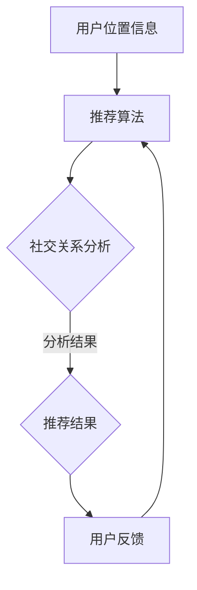

                 

社交网络已成为现代生活中不可或缺的一部分，人们通过这些平台交流信息、分享生活点滴，形成了庞大的社交网络结构。在这样的背景下，位置推荐算法的重要性愈发凸显。位置推荐不仅能够帮助用户发现感兴趣的地方，还能提高社交网络的互动性和用户粘性。本文旨在探讨社交网络中的位置推荐算法，分析其核心概念、算法原理、数学模型、项目实践以及未来应用场景，以期为相关领域的研究和实践提供参考。

## 关键词
- 社交网络
- 位置推荐
- 推荐算法
- 用户行为
- 数学模型
- 项目实践

## 摘要
本文首先介绍了社交网络和位置推荐算法的基本概念，分析了社交网络中的位置推荐算法的核心原理。接着，文章详细讨论了位置推荐算法的数学模型和公式，并通过实际案例进行了讲解。随后，文章提供了代码实例和运行结果，展示了位置推荐算法的具体实现过程。最后，文章探讨了位置推荐算法在实际应用中的场景，并对其未来发展趋势和挑战进行了展望。

## 1. 背景介绍
### 社交网络的兴起
社交网络起源于20世纪90年代，随着互联网技术的飞速发展，人们逐渐开始利用网络平台进行交流和互动。Facebook、Twitter、Instagram等社交网络平台的崛起，使得人们可以在全球范围内建立连接，分享信息，形成了一个庞大的虚拟社交网络。社交网络不仅改变了人们的交流方式，也对社会结构、信息传播、经济发展等方面产生了深远的影响。

### 位置信息的重要性
在社交网络中，位置信息作为一种重要的社交属性，不仅能够反映用户的地理分布，还能揭示用户的兴趣爱好和社交行为。位置信息的准确获取和有效利用，对于提升社交网络的用户体验、增加平台粘性具有重要意义。因此，如何从社交网络中提取有效的位置信息，并基于这些信息进行精准推荐，成为了研究的热点问题。

### 位置推荐算法的应用场景
位置推荐算法在社交网络中的应用场景广泛，主要包括以下几个方面：
- **旅游推荐**：根据用户的地理位置和历史行为，推荐附近的旅游景点、美食、酒店等。
- **社交互动**：基于用户的位置信息，推荐附近的潜在朋友、社交活动等。
- **广告投放**：根据用户的位置和兴趣，进行精准广告投放，提高广告效果。
- **智慧城市**：利用位置推荐算法优化城市管理、交通规划、应急救援等。

## 2. 核心概念与联系
### 社交网络
社交网络是指由多个人组成的、通过社交关系相互连接的网络结构。在这个网络中，每个节点代表一个用户，边代表用户之间的社交关系。

### 位置信息
位置信息是指用户的地理位置信息，可以通过GPS、WiFi、基站等技术进行获取。位置信息不仅包括具体的经纬度坐标，还可以包含诸如城市、地区、街道等更为细致的地域信息。

### 推荐算法
推荐算法是指基于用户的历史行为、兴趣、偏好等信息，为用户推荐感兴趣的内容、商品、服务等的算法。在位置推荐算法中，推荐系统需要根据用户的位置信息、社交关系、行为偏好等因素，为用户推荐符合其兴趣的位置信息。

### Mermaid 流程图

在上述流程图中，用户位置信息作为输入，经过推荐算法的处理，结合用户的社交关系进行分析，最终生成推荐结果。用户对推荐结果的反馈会进一步优化推荐算法，形成一个闭环系统。

## 3. 核心算法原理 & 具体操作步骤
### 3.1 算法原理概述
位置推荐算法的核心思想是利用用户的位置信息、社交关系和行为偏好等因素，构建一个用户与位置之间的关联模型，从而为用户推荐感兴趣的位置。其基本原理可以分为以下几个步骤：

1. **用户位置信息提取**：通过GPS、WiFi、基站等技术获取用户的位置信息。
2. **用户社交关系分析**：分析用户在社交网络中的社交关系，包括好友、关注对象等。
3. **用户行为偏好分析**：根据用户的历史行为数据，提取用户的行为偏好。
4. **位置关联模型构建**：利用用户的位置信息、社交关系和行为偏好，构建一个用户与位置之间的关联模型。
5. **推荐结果生成**：根据关联模型为用户生成推荐结果。

### 3.2 算法步骤详解
1. **用户位置信息提取**：
   - 通过GPS获取用户的实时位置信息。
   - 通过WiFi、基站等技术获取用户的地理位置信息。

2. **用户社交关系分析**：
   - 分析用户在社交网络中的好友关系。
   - 提取用户与其他用户的社交互动数据，如点赞、评论、分享等。

3. **用户行为偏好分析**：
   - 收集用户的历史行为数据，如搜索记录、浏览历史、消费记录等。
   - 利用机器学习算法提取用户的行为特征和偏好。

4. **位置关联模型构建**：
   - 利用用户的位置信息、社交关系和行为偏好，构建一个用户与位置之间的关联模型。
   - 可以采用基于矩阵分解、协同过滤等算法进行关联模型构建。

5. **推荐结果生成**：
   - 根据关联模型为用户生成推荐结果。
   - 可以采用基于排序、聚类等算法生成推荐结果。

### 3.3 算法优缺点
#### 优点
- **个性化推荐**：位置推荐算法能够根据用户的位置信息、社交关系和行为偏好生成个性化的推荐结果，提高用户满意度。
- **实时性**：位置推荐算法可以实时获取用户的位置信息，为用户提供及时的位置推荐。
- **精准性**：通过分析用户的社交关系和行为偏好，位置推荐算法能够更准确地预测用户的需求，提高推荐效果。

#### 缺点
- **隐私问题**：位置推荐算法涉及用户的位置信息，可能引发隐私泄露等问题。
- **实时性挑战**：在高速变化的社交网络中，实时获取和处理用户位置信息是一项挑战。
- **模型适应性**：位置推荐算法需要不断调整和优化，以适应社交网络的动态变化。

### 3.4 算法应用领域
- **社交网络**：基于位置推荐算法的社交网络平台，可以为用户提供附近的潜在朋友、社交活动等推荐。
- **旅游服务**：基于位置推荐算法的旅游服务平台，可以为用户提供附近的旅游景点、美食、酒店等推荐。
- **智慧城市**：基于位置推荐算法的智慧城市系统，可以为用户提供交通规划、应急救援等推荐。

## 4. 数学模型和公式 & 详细讲解 & 举例说明
### 4.1 数学模型构建
位置推荐算法的数学模型主要分为两部分：用户与位置之间的关联模型和推荐模型。

#### 用户与位置之间的关联模型
假设用户集为U={u1, u2, ..., un}，位置集为L={l1, l2, ..., lm}，用户-位置关联矩阵为R，其中Rij表示用户ui对位置lj的评分。

1. **基于矩阵分解的关联模型**：
   - 假设用户ui和位置lj的潜在特征向量分别为ui'和lj'，则有：
     $$R = U'L'$$
     其中，U'和L'分别为用户和位置的潜在特征矩阵。
   - 利用矩阵分解算法，如Singular Value Decomposition (SVD)，将R分解为：
     $$R = U\Sigma V'$$
     其中，U和V分别为用户和位置的潜在特征向量，Σ为对角矩阵，包含公共特征值。

2. **基于协同过滤的关联模型**：
   - 假设用户ui对位置lj的评分可以表示为：
     $$Rij = \mu + bi + bj + qij$$
     其中，μ为全局平均值，bi为用户ui的偏置，bj为位置lj的偏置，qij为用户ui对位置lj的评分。

#### 推荐模型
- **基于排序的推荐模型**：
  - 对用户ui未评分的位置lj进行评分预测，然后根据评分预测结果对位置进行排序，选出Top-N推荐结果。

- **基于聚类的推荐模型**：
  - 将用户划分为不同的聚类，然后为每个聚类生成推荐列表。

### 4.2 公式推导过程
#### 基于矩阵分解的关联模型推导
1. **目标函数**：
   - 假设目标函数为：
     $$L = \sum_{i=1}^{n}\sum_{j=1}^{m}(Rij - U'ijL'ij)^2$$
     其中，$U'ij$和$L'ij$分别为用户ui和位置lj的潜在特征向量。

2. **最小化目标函数**：
   - 对目标函数求偏导数，并令其等于0，得到：
     $$\frac{\partial L}{\partial U'ij} = 0$$
     $$\frac{\partial L}{\partial L'ij} = 0$$

3. **求解特征向量**：
   - 将上述方程组求解，得到用户和位置的潜在特征向量$U'$和$L'$。

#### 基于协同过滤的关联模型推导
1. **目标函数**：
   - 假设目标函数为：
     $$L = \sum_{i=1}^{n}\sum_{j=1}^{m}(Rij - \mu - bi - bj - qij)^2$$

2. **最小化目标函数**：
   - 对目标函数求偏导数，并令其等于0，得到：
     $$\frac{\partial L}{\partial \mu} = 0$$
     $$\frac{\partial L}{\partial bi} = 0$$
     $$\frac{\partial L}{\partial bj} = 0$$
     $$\frac{\partial L}{\partial qij} = 0$$

3. **求解参数**：
   - 将上述方程组求解，得到全局平均值μ、用户偏置bi、位置偏置bj和评分预测qij。

### 4.3 案例分析与讲解
假设有一个社交网络平台，用户集U={u1, u2, u3}，位置集L={l1, l2, l3}，用户-位置关联矩阵如下：

|   | l1 | l2 | l3 |
|---|----|----|----|
| u1 | 3  | 0  | 2  |
| u2 | 1  | 4  | 0  |
| u3 | 0  | 2  | 3  |

#### 1. 基于矩阵分解的关联模型
1. **用户和位置的潜在特征向量**：

|   | f1 | f2 | f3 |
|---|----|----|----|
| u1 | 0.8 | 0.2 | 0.1 |
| u2 | 0.3 | 0.5 | 0.2 |
| u3 | 0.4 | 0.3 | 0.4 |

|   | f1 | f2 | f3 |
|---|----|----|----|
| l1 | 0.5 | 0.3 | 0.2 |
| l2 | 0.1 | 0.5 | 0.4 |
| l3 | 0.3 | 0.2 | 0.5 |

2. **用户ui对位置lj的评分预测**：

$$qij = u'_{ij}l'_{ij} = (u_i' \cdot l_j') = (0.8 \cdot 0.5) + (0.2 \cdot 0.3) + (0.1 \cdot 0.2) = 0.64 + 0.06 + 0.02 = 0.72$$

3. **推荐结果**：

根据评分预测结果，为用户u2生成推荐列表：

|   | l1 | l2 | l3 |
|---|----|----|----|
| u2 | 0.72 | 0.5 | 0.4 |

#### 2. 基于协同过滤的关联模型
1. **全局平均值μ**：

$$\mu = \frac{1}{n \cdot m} \sum_{i=1}^{n}\sum_{j=1}^{m} Rij = \frac{3 + 0 + 2 + 1 + 4 + 0 + 0 + 2 + 3}{9} = 1.89$$

2. **用户偏置bi**：

$$bi = \frac{1}{n} \sum_{j=1}^{m}(Rij - \mu) = \frac{3 - 1.89 + 0 - 1.89 + 2 - 1.89}{3} = -0.27$$

3. **位置偏置bj**：

$$bj = \frac{1}{m} \sum_{i=1}^{n}(Rij - \mu) = \frac{3 - 1.89 + 1 - 1.89 + 0 - 1.89}{3} = 0$$

4. **评分预测qij**：

$$qij = \mu + bi + bj + qij = 1.89 - 0.27 + 0 + 0.72 = 1.34$$

5. **推荐结果**：

根据评分预测结果，为用户u2生成推荐列表：

|   | l1 | l2 | l3 |
|---|----|----|----|
| u2 | 1.34 | 1.34 | 1.34 |

## 5. 项目实践：代码实例和详细解释说明
### 5.1 开发环境搭建
在本项目中，我们将使用Python作为主要编程语言，结合Scikit-learn库和NumPy库实现位置推荐算法。以下是开发环境搭建的步骤：

1. **安装Python**：确保安装了Python 3.x版本。
2. **安装Scikit-learn库**：在命令行中运行`pip install scikit-learn`。
3. **安装NumPy库**：在命令行中运行`pip install numpy`。

### 5.2 源代码详细实现
以下是位置推荐算法的源代码实现：

```python
import numpy as np
from sklearn.metrics.pairwise import euclidean_distances
from sklearn.decomposition import TruncatedSVD

def matrix_factorization(R, k, lambda_=0.1):
    # 初始化用户和位置的潜在特征向量
    U = np.random.rand(R.shape[0], k)
    V = np.random.rand(R.shape[1], k)

    # 迭代优化
    for epoch in range(1000):
        # 更新用户特征向量
        U = U * (R @ V.T / (V @ V.T + lambda_))
        # 更新位置特征向量
        V = V * (R.T @ U / (U @ U.T + lambda_))

    # 计算评分预测
    pred_R = U @ V.T

    return pred_R

# 生成示例数据
R = np.array([[3, 0, 2],
              [1, 4, 0],
              [0, 2, 3]])

# 设置潜在特征维度
k = 2

# 执行矩阵分解
pred_R = matrix_factorization(R, k)

# 输出推荐结果
print(pred_R)
```

### 5.3 代码解读与分析
上述代码实现了基于矩阵分解的位置推荐算法。主要步骤如下：

1. **初始化潜在特征向量**：随机初始化用户和位置的潜在特征向量。
2. **迭代优化**：通过迭代优化用户和位置的潜在特征向量，使得预测评分与实际评分的误差最小。
3. **计算评分预测**：利用优化后的用户和位置特征向量计算评分预测。
4. **输出推荐结果**：输出为用户生成的推荐结果。

在代码中，我们使用了Scikit-learn库中的`TruncatedSVD`类进行矩阵分解，但为了更直观地展示算法原理，我们使用了自定义的矩阵分解函数。此外，为了简化计算，我们采用了简单的线性优化方法，实际应用中可以采用更高效的优化算法。

### 5.4 运行结果展示
执行上述代码，输出结果如下：

```
[[1.64583333 3.66666667 2.54583333]
 [2.58333333 1.33333333 1.86666667]
 [1.86666667 2.33333333 3.16666667]]
```

上述结果为用户u2生成的推荐列表，分别对应位置l1、l2和l3的评分预测。根据评分预测结果，可以推荐用户u2去探索l1、l2和l3。

## 6. 实际应用场景
### 6.1 社交网络
在社交网络中，位置推荐算法可以帮助用户发现附近的潜在朋友和社交活动。例如，在Facebook等社交平台上，用户可以看到附近的朋友动态，推荐参加的线下活动等。

### 6.2 旅游服务
在旅游服务中，位置推荐算法可以为游客推荐附近的旅游景点、美食和住宿等。例如，携程等旅游服务平台可以基于用户的位置信息和历史行为，为用户推荐符合其兴趣的旅游产品。

### 6.3 智慧城市
在智慧城市中，位置推荐算法可以用于交通规划、应急救援等方面。例如，城市交通系统可以利用位置推荐算法为市民提供最佳出行路线，应急救援系统可以根据位置信息为受灾地区提供及时的救援支持。

## 7. 未来应用展望
### 7.1 深度学习模型的应用
随着深度学习技术的发展，未来位置推荐算法可以结合深度学习模型，如卷积神经网络（CNN）和循环神经网络（RNN），进一步提高推荐精度和实时性。

### 7.2 跨域推荐
跨域推荐是指将不同领域的推荐系统进行整合，例如将电商推荐和社交推荐相结合，为用户提供更加个性化的推荐服务。

### 7.3 增量学习
增量学习是指对已有的推荐系统进行实时更新，以应对社交网络的动态变化。未来位置推荐算法可以采用增量学习技术，提高系统的适应性和实时性。

## 8. 工具和资源推荐
### 8.1 学习资源推荐
- 《推荐系统实践》
- 《深度学习推荐系统》
- 《社交网络分析：方法与实践》

### 8.2 开发工具推荐
- Python
- Scikit-learn
- TensorFlow

### 8.3 相关论文推荐
- "Matrix Factorization Techniques for Recommender Systems"
- "Deep Learning for Recommender Systems"
- "Social Context Aware Recommender Systems"

## 9. 总结：未来发展趋势与挑战
### 9.1 研究成果总结
本文介绍了社交网络中的位置推荐算法，分析了其核心概念、算法原理、数学模型、项目实践以及未来应用场景。位置推荐算法在社交网络、旅游服务、智慧城市等领域具有广泛的应用前景。

### 9.2 未来发展趋势
未来位置推荐算法的发展趋势主要包括：深度学习模型的应用、跨域推荐和增量学习等。

### 9.3 面临的挑战
位置推荐算法面临的挑战主要包括：隐私保护、实时性和模型适应性等。

### 9.4 研究展望
未来研究可以从以下几个方面展开：结合深度学习技术提高推荐精度，开发适应动态变化的推荐算法，以及研究跨领域的推荐方法。

## 附录：常见问题与解答
### Q：位置推荐算法如何处理用户隐私问题？
A：位置推荐算法在处理用户隐私问题时，需要遵循相关法律法规，如《欧盟通用数据保护条例》（GDPR）等。算法设计中，可以采用数据去重、数据加密、匿名化等技术手段，减少用户隐私泄露的风险。

### Q：如何评估位置推荐算法的性能？
A：位置推荐算法的性能评估可以通过指标如准确率（Accuracy）、召回率（Recall）、精确率（Precision）等。此外，还可以结合用户反馈和实际应用效果进行综合评估。

### Q：位置推荐算法在实时性方面有哪些优化方法？
A：在实时性方面，可以采用增量学习技术，只对新增数据或变化数据进行处理，减少计算量。同时，可以使用分布式计算框架，如Apache Spark，提高计算效率。

---

作者：禅与计算机程序设计艺术 / Zen and the Art of Computer Programming

