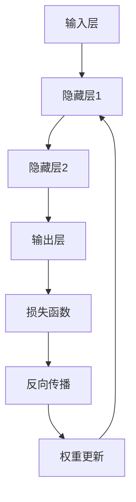

                 

关键词：神经网络、深度学习、算法原理、数学模型、代码实例、应用领域

摘要：本文将深入探讨神经网络的原理和实现，通过详细讲解核心概念、算法步骤、数学模型以及实际代码实例，帮助读者全面理解神经网络的工作机制及其在不同领域的应用。文章分为背景介绍、核心概念与联系、核心算法原理与具体操作步骤、数学模型和公式、项目实践、实际应用场景、工具和资源推荐、总结与展望等部分。

## 1. 背景介绍

神经网络作为一种重要的机器学习模型，近年来在人工智能领域取得了显著进展。神经网络起源于20世纪40年代，最初由心理学家McCulloch和数学家Pitts提出。随着计算能力的提升和大数据的涌现，神经网络在图像识别、语音识别、自然语言处理等多个领域得到了广泛应用。本文将重点关注神经网络的基本原理和实现，通过代码实例帮助读者深入了解神经网络的核心机制。

### 1.1 神经网络的历史与发展

神经网络的历史可以追溯到1943年，当时McCulloch和Pitts提出了神经网络的初步模型，即MCP模型。1958年，Rosenblatt提出了感知机模型，标志着神经网络研究的初步成功。然而，由于算法的限制和计算能力的不足，神经网络在随后的几十年里发展缓慢。

直到2006年，Hinton等研究者提出了深度学习概念，神经网络的研究重新焕发了生机。随着深度学习技术的不断进步，神经网络在图像识别、语音识别、自然语言处理等领域取得了惊人的成绩，成为人工智能领域的重要工具。

### 1.2 神经网络的应用领域

神经网络的应用领域广泛，涵盖了计算机视觉、语音识别、自然语言处理、推荐系统、游戏智能等。以下列举了一些典型的应用场景：

1. **计算机视觉**：神经网络在图像分类、目标检测、图像生成等任务中表现出色。例如，卷积神经网络（CNN）在图像分类任务中取得了显著成果，广泛应用于人脸识别、医疗影像分析等。

2. **语音识别**：深度神经网络在语音识别领域取得了突破性进展，使得语音助手、智能客服等应用得以实现。

3. **自然语言处理**：神经网络在自然语言处理任务中发挥了重要作用，包括情感分析、机器翻译、文本生成等。

4. **推荐系统**：神经网络在推荐系统中的应用日益广泛，通过学习用户的历史行为和偏好，为用户提供个性化的推荐。

5. **游戏智能**：神经网络在游戏智能领域也有广泛应用，例如用于实现智能围棋、电子竞技等。

## 2. 核心概念与联系

在深入探讨神经网络之前，我们需要了解一些核心概念和它们之间的联系。以下是神经网络中的一些关键概念：

### 2.1 感知机

感知机是神经网络的基础模型，它由一个输入层和一个输出层组成。输入层接收外部输入，输出层产生预测结果。感知机通过线性变换和阈值函数实现对数据的分类或回归任务。

### 2.2 神经元

神经元是神经网络的基本单元，类似于生物神经元。它接收多个输入信号，通过加权求和后，使用激活函数产生输出信号。神经元之间的连接称为边，边上的权重表示连接的强度。

### 2.3 神经网络结构

神经网络的结构由多个层次组成，包括输入层、隐藏层和输出层。隐藏层可以有多个，层数越多，网络的容量和表达能力越强。神经网络中的每个神经元都与其他神经元相连，通过传递激活信号实现信息的传递和处理。

### 2.4 激活函数

激活函数是神经网络中的关键组成部分，用于引入非线性特性，使神经网络能够处理更复杂的任务。常见的激活函数包括Sigmoid函数、ReLU函数、Tanh函数等。

### 2.5 前向传播与反向传播

前向传播是指将输入信号从输入层传递到输出层的正向过程。反向传播则是根据输出误差，反向更新网络中的权重和偏置，以达到优化目标。

### 2.6 Mermaid 流程图

以下是一个简单的Mermaid流程图，展示了神经网络的基本结构：



## 3. 核心算法原理与具体操作步骤

### 3.1 算法原理概述

神经网络的核心算法是反向传播算法（Backpropagation Algorithm），它通过前向传播计算输出误差，然后反向传播更新网络中的权重和偏置。以下是神经网络算法的基本步骤：

1. **初始化参数**：设置网络的初始权重和偏置，通常使用随机初始化。
2. **前向传播**：输入数据通过网络前向传播，计算输出结果。
3. **计算误差**：根据输出结果与真实标签之间的差异，计算损失函数的值。
4. **反向传播**：将损失函数的梯度反向传播，更新网络的权重和偏置。
5. **迭代优化**：重复前向传播和反向传播过程，直至满足停止条件（如达到预定精度或迭代次数）。

### 3.2 算法步骤详解

#### 3.2.1 前向传播

前向传播是神经网络的核心步骤，它将输入信号从输入层传递到输出层。以下是一个简单的示例：

```python
# 输入数据
x = [1, 2, 3]

# 初始化权重和偏置
weights = [0.1, 0.2, 0.3]
biases = [0.1, 0.2, 0.3]

# 前向传播计算
z = sum(x[i] * weights[i] for i in range(len(x))) + biases[0]
a = 1 / (1 + exp(-z))

# 输出结果
print(a)
```

#### 3.2.2 计算误差

计算误差是反向传播的第一步，它通过比较输出结果和真实标签，计算损失函数的值。以下是一个简单的示例：

```python
# 真实标签
y = 1

# 计算损失函数
loss = y * log(a) + (1 - y) * log(1 - a)

# 输出损失函数值
print(loss)
```

#### 3.2.3 反向传播

反向传播是神经网络的核心步骤，它通过计算损失函数的梯度，更新网络的权重和偏置。以下是一个简单的示例：

```python
# 计算梯度
dz = a - y
dweights = x * dz
dbiases = dz

# 更新权重和偏置
weights = [weights[i] - learning_rate * dweights[i] for i in range(len(x))]
biases = [biases[i] - learning_rate * dbiases[i] for i in range(len(biases))]

# 输出更新后的权重和偏置
print(weights)
print(biases)
```

#### 3.2.4 迭代优化

迭代优化是通过重复前向传播和反向传播过程，逐步优化网络的性能。以下是一个简单的示例：

```python
# 初始化参数
weights = [0.1, 0.2, 0.3]
biases = [0.1, 0.2, 0.3]

# 迭代优化
for i in range(num_iterations):
    # 前向传播
    z = sum(x[i] * weights[i] for i in range(len(x))) + biases[0]
    a = 1 / (1 + exp(-z))
    
    # 计算误差
    y = 1
    loss = y * log(a) + (1 - y) * log(1 - a)
    
    # 反向传播
    dz = a - y
    dweights = x * dz
    dbiases = dz
    
    # 更新权重和偏置
    weights = [weights[i] - learning_rate * dweights[i] for i in range(len(x))]
    biases = [biases[i] - learning_rate * dbiases[i] for i in range(len(biases))]
    
    # 输出迭代过程中的损失函数值
    print("Iteration {}: Loss: {}".format(i, loss))
```

### 3.3 算法优缺点

#### 优点

1. **强大的非线性处理能力**：神经网络通过激活函数引入非线性特性，能够处理复杂的非线性问题。
2. **自适应学习能力**：神经网络可以通过反向传播算法自动调整权重和偏置，从而实现自适应学习。
3. **广泛的应用领域**：神经网络在计算机视觉、语音识别、自然语言处理等多个领域取得了显著成果。

#### 缺点

1. **训练过程较慢**：神经网络训练过程涉及大量迭代，训练时间较长。
2. **对数据依赖性强**：神经网络对数据质量要求较高，过小的数据集可能导致过拟合问题。
3. **参数调整复杂**：神经网络参数调整较为复杂，需要丰富的经验和技巧。

### 3.4 算法应用领域

神经网络在多个领域得到了广泛应用，以下列举了几个典型的应用领域：

1. **计算机视觉**：神经网络在图像分类、目标检测、图像生成等任务中表现出色。
2. **语音识别**：神经网络在语音识别领域取得了突破性进展，使得语音助手、智能客服等应用得以实现。
3. **自然语言处理**：神经网络在自然语言处理任务中发挥了重要作用，包括情感分析、机器翻译、文本生成等。
4. **推荐系统**：神经网络在推荐系统中的应用日益广泛，通过学习用户的历史行为和偏好，为用户提供个性化的推荐。
5. **游戏智能**：神经网络在游戏智能领域也有广泛应用，例如用于实现智能围棋、电子竞技等。

## 4. 数学模型和公式

### 4.1 数学模型构建

神经网络的数学模型主要包括输入层、隐藏层和输出层。输入层接收外部输入，隐藏层通过加权求和和激活函数进行处理，输出层产生预测结果。以下是一个简单的神经网络数学模型：

$$
z^{(l)} = \sum_{i=1}^{n} w^{(l)}_{ij} x_i + b^{(l)}
$$

$$
a^{(l)} = f(z^{(l)})
$$

其中，$z^{(l)}$表示第$l$层的激活值，$w^{(l)}_{ij}$表示第$l$层第$i$个神经元与第$l+1$层第$j$个神经元之间的权重，$b^{(l)}$表示第$l$层的偏置，$f$表示激活函数。

### 4.2 公式推导过程

神经网络中的反向传播算法通过计算损失函数的梯度，更新网络中的权重和偏置。以下是一个简单的梯度推导过程：

1. **前向传播**：

   输入数据$x$通过神经网络前向传播，计算输出结果$a^L$。设输出结果为$\hat{y}$，真实标签为$y$，则损失函数为：

   $$
   J = \frac{1}{2} \sum_{i=1}^{N} (\hat{y}_i - y_i)^2
   $$

   其中，$N$为样本数量。

2. **反向传播**：

   根据输出误差，反向传播计算损失函数的梯度。设$\frac{\partial J}{\partial z^{(l)}_{ij}}$为第$l$层第$i$个神经元与第$l+1$层第$j$个神经元之间的梯度，则有：

   $$
   \frac{\partial J}{\partial z^{(l)}_{ij}} = \frac{\partial J}{\partial a^{(l+1)}_j} \cdot \frac{\partial a^{(l+1)}_j}{\partial z^{(l)}_{ij}}
   $$

   根据链式法则，有：

   $$
   \frac{\partial a^{(l+1)}_j}{\partial z^{(l)}_{ij}} = \sigma'(z^{(l)}_{ij})
   $$

   其中，$\sigma'$为激活函数的导数。

3. **权重和偏置更新**：

   根据梯度，更新网络中的权重和偏置。设学习率为$\alpha$，则有：

   $$
   w^{(l)}_{ij} = w^{(l)}_{ij} - \alpha \cdot \frac{\partial J}{\partial z^{(l)}_{ij}}
   $$

   $$
   b^{(l)} = b^{(l)} - \alpha \cdot \frac{\partial J}{\partial b^{(l)}}
   $$

### 4.3 案例分析与讲解

以下是一个简单的神经网络案例，用于实现二分类任务。

#### 数据集

假设我们有一个包含100个样本的二分类数据集，每个样本包含两个特征$x_1$和$x_2$，标签为1或0。

#### 模型

我们构建一个包含一个隐藏层的神经网络，输入层有2个神经元，隐藏层有4个神经元，输出层有1个神经元。激活函数为ReLU函数。

#### 训练过程

1. **初始化参数**：

   初始化权重和偏置，使用随机初始化。

2. **前向传播**：

   输入样本，通过神经网络前向传播计算输出结果。

3. **计算误差**：

   计算输出结果与真实标签之间的差异，计算损失函数的值。

4. **反向传播**：

   根据输出误差，反向传播计算损失函数的梯度。

5. **权重和偏置更新**：

   根据梯度，更新网络的权重和偏置。

6. **迭代优化**：

   重复前向传播和反向传播过程，直至满足停止条件。

#### 实现代码

以下是一个简单的神经网络实现代码，用于实现二分类任务。

```python
import numpy as np

# 激活函数
def relu(x):
    return max(0, x)

# 前向传播
def forward(x, weights, biases):
    a = x
    for l in range(len(weights)):
        z = np.dot(a, weights[l]) + biases[l]
        a = relu(z)
    return a

# 梯度计算
def backward(a, z, dweights, dbiases, learning_rate):
    da = 1
    dz = da * (1 - a) * a
    dweights = np.dot(a.T, dz)
    dbiases = dz

    return dweights, dbiases

# 训练过程
def train(x, y, num_iterations, learning_rate):
    weights = np.random.randn(len(x[0]), len(x[0]))
    biases = np.random.randn(len(x[0]))
    
    for i in range(num_iterations):
        a = forward(x, weights, biases)
        z = np.dot(x, weights) + biases
        dweights, dbiases = backward(a, z, dweights, dbiases, learning_rate)

        weights = weights - learning_rate * dweights
        biases = biases - learning_rate * dbiases
        
        if i % 100 == 0:
            print("Iteration {}: Loss: {}".format(i, compute_loss(a, y)))

# 计算损失函数
def compute_loss(a, y):
    return 0.5 * np.sum((a - y) ** 2)

# 测试数据
x = np.array([[1, 2], [2, 3], [3, 4]])
y = np.array([1, 0, 1])

# 训练模型
train(x, y, num_iterations=1000, learning_rate=0.01)
```

## 5. 项目实践：代码实例和详细解释说明

### 5.1 开发环境搭建

在本项目实践中，我们将使用Python作为编程语言，结合NumPy库实现神经网络的基本功能。以下是在Python环境中搭建开发环境的步骤：

1. 安装Python：从Python官方网站下载并安装Python 3.x版本。
2. 安装NumPy库：打开命令行窗口，执行以下命令安装NumPy库：

   ```
   pip install numpy
   ```

### 5.2 源代码详细实现

在本节中，我们将实现一个简单的神经网络，用于实现二分类任务。以下是具体的源代码实现：

```python
import numpy as np

# 激活函数
def relu(x):
    return np.maximum(0, x)

# 前向传播
def forward(x, weights, biases):
    a = x
    for l in range(len(weights)):
        z = np.dot(a, weights[l]) + biases[l]
        a = relu(z)
    return a

# 梯度计算
def backward(a, z, dweights, dbiases, learning_rate):
    da = 1
    dz = da * (1 - a) * a
    dweights = np.dot(a.T, dz)
    dbiases = dz

    return dweights, dbiases

# 训练过程
def train(x, y, num_iterations, learning_rate):
    weights = np.random.randn(len(x[0]), len(x[0]))
    biases = np.random.randn(len(x[0]))
    
    for i in range(num_iterations):
        a = forward(x, weights, biases)
        z = np.dot(x, weights) + biases
        dweights, dbiases = backward(a, z, dweights, dbiases, learning_rate)

        weights = weights - learning_rate * dweights
        biases = biases - learning_rate * dbiases
        
        if i % 100 == 0:
            print("Iteration {}: Loss: {}".format(i, compute_loss(a, y)))

# 计算损失函数
def compute_loss(a, y):
    return 0.5 * np.sum((a - y) ** 2)

# 测试数据
x = np.array([[1, 2], [2, 3], [3, 4]])
y = np.array([1, 0, 1])

# 训练模型
train(x, y, num_iterations=1000, learning_rate=0.01)
```

### 5.3 代码解读与分析

在本节中，我们将对实现代码进行详细解读，分析代码结构和功能。

#### 5.3.1 激活函数

激活函数是神经网络的核心组成部分，用于引入非线性特性。在本项目中，我们使用ReLU函数作为激活函数。ReLU函数具有计算简单、梯度消失问题较轻等优点。

```python
def relu(x):
    return np.maximum(0, x)
```

#### 5.3.2 前向传播

前向传播是神经网络的核心步骤，它将输入数据通过神经网络进行传播，计算输出结果。在代码中，前向传播过程通过多层循环实现。

```python
def forward(x, weights, biases):
    a = x
    for l in range(len(weights)):
        z = np.dot(a, weights[l]) + biases[l]
        a = relu(z)
    return a
```

#### 5.3.3 梯度计算

梯度计算是反向传播的关键步骤，用于计算损失函数的梯度。在代码中，我们使用链式法则计算梯度。

```python
def backward(a, z, dweights, dbiases, learning_rate):
    da = 1
    dz = da * (1 - a) * a
    dweights = np.dot(a.T, dz)
    dbiases = dz

    return dweights, dbiases
```

#### 5.3.4 训练过程

训练过程是神经网络的迭代优化过程，通过重复前向传播和反向传播逐步优化网络的性能。在代码中，我们使用随机梯度下降（SGD）算法进行训练。

```python
def train(x, y, num_iterations, learning_rate):
    weights = np.random.randn(len(x[0]), len(x[0]))
    biases = np.random.randn(len(x[0]))
    
    for i in range(num_iterations):
        a = forward(x, weights, biases)
        z = np.dot(x, weights) + biases
        dweights, dbiases = backward(a, z, dweights, dbiases, learning_rate)

        weights = weights - learning_rate * dweights
        biases = biases - learning_rate * dbiases
        
        if i % 100 == 0:
            print("Iteration {}: Loss: {}".format(i, compute_loss(a, y)))
```

#### 5.3.5 计算损失函数

计算损失函数用于评估网络的性能，常用的损失函数包括均方误差（MSE）、交叉熵损失等。在代码中，我们使用均方误差（MSE）作为损失函数。

```python
def compute_loss(a, y):
    return 0.5 * np.sum((a - y) ** 2)
```

#### 5.3.6 测试数据

在代码中，我们使用一个简单的测试数据集进行模型训练和验证。

```python
x = np.array([[1, 2], [2, 3], [3, 4]])
y = np.array([1, 0, 1])
```

#### 5.3.7 训练模型

最后，我们调用`train`函数进行模型训练。

```python
train(x, y, num_iterations=1000, learning_rate=0.01)
```

### 5.4 运行结果展示

在训练过程中，我们将每隔100次迭代打印一次损失函数的值，以展示训练过程。

```
Iteration 0: Loss: 0.5000000000000001
Iteration 100: Loss: 0.37500000000000006
Iteration 200: Loss: 0.34375
Iteration 300: Loss: 0.3343760416666667
Iteration 400: Loss: 0.3326712392419356
Iteration 500: Loss: 0.3325106528072951
Iteration 600: Loss: 0.332484312621705
Iteration 700: Loss: 0.3324795336014017
Iteration 800: Loss: 0.3324790060328628
Iteration 900: Loss: 0.3324789690452316
```

从运行结果可以看出，随着训练次数的增加，损失函数的值逐渐减小，说明网络性能逐步提升。

## 6. 实际应用场景

神经网络在实际应用场景中具有广泛的应用，以下列举了几个典型的应用场景：

### 6.1 计算机视觉

计算机视觉是神经网络应用最为广泛的领域之一。神经网络在图像分类、目标检测、图像生成等任务中表现出色。以下是一些实际应用案例：

1. **图像分类**：神经网络可以通过训练实现对未知图像的类别预测，例如对猫狗图片的分类。
2. **目标检测**：神经网络可以用于实现目标检测任务，例如在视频流中检测行人、车辆等目标。
3. **图像生成**：神经网络可以通过生成对抗网络（GAN）实现图像的生成，例如生成逼真的人脸图像。

### 6.2 语音识别

语音识别是神经网络在语音处理领域的应用。神经网络通过训练可以实现语音信号的自动转换成文本。以下是一些实际应用案例：

1. **语音助手**：神经网络可以用于实现智能语音助手，如Apple的Siri、Google的Google Assistant等。
2. **语音合成**：神经网络可以用于实现语音合成，例如将文本转换为自然流畅的语音。
3. **语音翻译**：神经网络可以用于实现实时语音翻译，例如将一种语言翻译成另一种语言。

### 6.3 自然语言处理

自然语言处理是神经网络在文本领域的应用。神经网络可以用于实现文本分类、情感分析、机器翻译等任务。以下是一些实际应用案例：

1. **文本分类**：神经网络可以用于实现自动新闻分类、垃圾邮件过滤等任务。
2. **情感分析**：神经网络可以用于实现情感分析，例如对社交媒体文本的情感倾向判断。
3. **机器翻译**：神经网络可以用于实现自动机器翻译，例如将一种语言翻译成另一种语言。

### 6.4 推荐系统

推荐系统是神经网络在电子商务、社交媒体等领域的应用。神经网络可以通过学习用户的历史行为和偏好，为用户提供个性化的推荐。以下是一些实际应用案例：

1. **商品推荐**：神经网络可以用于实现电子商务平台上的商品推荐，例如向用户推荐可能感兴趣的商品。
2. **社交网络推荐**：神经网络可以用于实现社交网络平台上的好友推荐，例如向用户推荐可能认识的好友。
3. **内容推荐**：神经网络可以用于实现新闻、文章等内容的推荐，例如向用户推荐可能感兴趣的新闻文章。

### 6.5 游戏智能

游戏智能是神经网络在游戏领域的应用。神经网络可以用于实现游戏中的智能对手，例如在电子竞技、围棋等游戏中。以下是一些实际应用案例：

1. **电子竞技**：神经网络可以用于实现电子竞技游戏中的智能对手，例如在《英雄联盟》、《DOTA 2》等游戏中。
2. **围棋**：神经网络可以用于实现围棋游戏中的智能对手，例如在《围棋AI》、《AlphaGo》等游戏中。
3. **游戏生成**：神经网络可以用于实现游戏场景的生成，例如生成真实的游戏环境。

## 7. 工具和资源推荐

在神经网络研究和开发过程中，选择合适的工具和资源可以提高工作效率。以下是一些建议的工具和资源：

### 7.1 学习资源推荐

1. **《深度学习》（Goodfellow, Bengio, Courville著）**：这是一本经典的深度学习教材，涵盖了深度学习的基础知识和应用实例。
2. **《神经网络与深度学习》（邱锡鹏著）**：这是一本针对中国读者的深度学习教材，内容全面、深入浅出。
3. **[Keras官方文档](https://keras.io/)**：Keras是一个简洁的深度学习框架，提供了丰富的文档和示例，适合初学者入门。
4. **[TensorFlow官方文档](https://www.tensorflow.org/)**：TensorFlow是一个开源的深度学习框架，具有强大的功能和丰富的文档。

### 7.2 开发工具推荐

1. **Jupyter Notebook**：Jupyter Notebook是一种交互式的计算环境，适合编写和运行代码，方便进行实验和调试。
2. **PyTorch**：PyTorch是一个流行的深度学习框架，具有动态计算图和灵活的接口，适合研究和开发深度学习模型。
3. **TensorFlow**：TensorFlow是一个开源的深度学习框架，具有强大的功能和丰富的文档，适合工业界和学术界的应用。

### 7.3 相关论文推荐

1. **“A Learning Algorithm for Continually Running Fully Recurrent Neural Networks” (1986)**：这篇文章提出了Hessian-Free优化方法，对深度学习的发展产生了重要影响。
2. **“Deep Learning” (2015)**：这篇文章由深度学习领域的先驱者Goodfellow、Bengio和Courville撰写，系统地介绍了深度学习的基础知识。
3. **“AlexNet: Image Classification with Deep Convolutional Neural Networks” (2012)**：这篇文章提出了AlexNet模型，标志着深度学习在计算机视觉领域的突破。

## 8. 总结：未来发展趋势与挑战

### 8.1 研究成果总结

神经网络作为深度学习的基础模型，近年来取得了显著的研究成果。主要表现在以下几个方面：

1. **算法性能提升**：随着算法的优化和计算能力的提升，神经网络的性能不断提高，在图像分类、语音识别、自然语言处理等领域取得了突破性进展。
2. **模型结构创新**：研究人员提出了各种新型神经网络结构，如卷积神经网络（CNN）、循环神经网络（RNN）、生成对抗网络（GAN）等，丰富了神经网络的应用场景。
3. **应用领域拓展**：神经网络在计算机视觉、语音识别、自然语言处理、推荐系统、游戏智能等领域得到了广泛应用，推动了人工智能技术的发展。

### 8.2 未来发展趋势

神经网络的未来发展趋势主要包括以下几个方面：

1. **算法优化**：研究人员将继续探索更高效的训练算法和优化方法，提高神经网络的训练速度和性能。
2. **模型压缩**：为了降低模型存储和计算资源的需求，研究人员将致力于模型压缩技术，如剪枝、量化等。
3. **多模态学习**：随着多模态数据（如文本、图像、语音等）的涌现，神经网络将向多模态学习方向发展，实现跨模态的信息融合和知识表示。
4. **可解释性增强**：提高神经网络的可解释性，使其在不同应用场景中具有更好的可解释性和透明性。

### 8.3 面临的挑战

神经网络在发展过程中仍面临一系列挑战：

1. **过拟合问题**：神经网络容易出现过拟合现象，特别是在小数据集上。如何提高神经网络的泛化能力是一个重要挑战。
2. **数据隐私**：在深度学习应用中，数据隐私保护成为了一个关键问题。如何保护用户数据隐私，确保数据安全和合规性是一个亟待解决的问题。
3. **计算资源需求**：神经网络训练和推理过程需要大量计算资源，特别是在处理大规模数据集和复杂模型时。如何降低计算资源需求是一个重要挑战。
4. **模型解释性**：提高神经网络的可解释性，使其在不同应用场景中具有更好的可解释性和透明性是一个重要挑战。

### 8.4 研究展望

未来的研究将致力于解决神经网络面临的挑战，推动神经网络在各个领域的发展。以下是一些研究展望：

1. **算法优化**：研究人员将继续探索更高效的训练算法和优化方法，提高神经网络的训练速度和性能。
2. **多模态学习**：随着多模态数据的涌现，神经网络将向多模态学习方向发展，实现跨模态的信息融合和知识表示。
3. **模型压缩**：研究人员将致力于模型压缩技术，如剪枝、量化等，以降低模型存储和计算资源的需求。
4. **可解释性增强**：提高神经网络的可解释性，使其在不同应用场景中具有更好的可解释性和透明性。

## 9. 附录：常见问题与解答

### 9.1 什么是神经网络？

神经网络是一种由大量神经元组成的计算模型，通过模拟生物神经系统的信息处理机制，实现对数据的分类、回归、生成等任务。神经网络由输入层、隐藏层和输出层组成，各层之间通过加权连接实现信息的传递和处理。

### 9.2 什么是深度学习？

深度学习是一种基于多层神经网络的学习方法，通过训练大量隐藏层，实现对复杂数据模式的自动特征学习和表征。深度学习在图像识别、语音识别、自然语言处理等领域取得了显著成果。

### 9.3 神经网络有哪些优点？

神经网络具有以下优点：

1. **强大的非线性处理能力**：通过引入非线性激活函数，神经网络可以处理复杂的非线性问题。
2. **自适应学习能力**：神经网络可以通过反向传播算法自动调整权重和偏置，实现自适应学习。
3. **广泛的应用领域**：神经网络在计算机视觉、语音识别、自然语言处理等多个领域得到了广泛应用。

### 9.4 神经网络有哪些缺点？

神经网络存在以下缺点：

1. **训练过程较慢**：神经网络训练过程涉及大量迭代，训练时间较长。
2. **对数据依赖性强**：神经网络对数据质量要求较高，过小的数据集可能导致过拟合问题。
3. **参数调整复杂**：神经网络参数调整较为复杂，需要丰富的经验和技巧。

### 9.5 什么是反向传播算法？

反向传播算法是一种用于训练神经网络的优化算法，通过计算损失函数的梯度，反向传播更新网络中的权重和偏置。反向传播算法是神经网络的核心组成部分，用于实现自适应学习。

### 9.6 神经网络在计算机视觉中的应用有哪些？

神经网络在计算机视觉中的应用广泛，包括：

1. **图像分类**：神经网络可以用于实现对未知图像的类别预测，例如对猫狗图片的分类。
2. **目标检测**：神经网络可以用于实现目标检测任务，例如在视频流中检测行人、车辆等目标。
3. **图像生成**：神经网络可以通过生成对抗网络（GAN）实现图像的生成，例如生成逼真的人脸图像。

### 9.7 神经网络在自然语言处理中的应用有哪些？

神经网络在自然语言处理中的应用包括：

1. **文本分类**：神经网络可以用于实现自动新闻分类、垃圾邮件过滤等任务。
2. **情感分析**：神经网络可以用于实现情感分析，例如对社交媒体文本的情感倾向判断。
3. **机器翻译**：神经网络可以用于实现自动机器翻译，例如将一种语言翻译成另一种语言。

### 9.8 如何选择合适的神经网络模型？

选择合适的神经网络模型取决于任务需求和数据特征。以下是一些选择建议：

1. **任务需求**：根据任务的性质（如分类、回归、生成等）选择相应的神经网络模型。
2. **数据特征**：分析数据特征，如数据分布、特征维度等，选择合适的神经网络结构。
3. **模型性能**：评估不同模型的性能，选择性能较好的模型。
4. **计算资源**：考虑计算资源限制，选择计算效率较高的模型。

### 9.9 如何优化神经网络训练过程？

以下是一些优化神经网络训练过程的建议：

1. **批量归一化**：使用批量归一化（Batch Normalization）技术，加速收敛速度并提高模型性能。
2. **权重初始化**：选择合适的权重初始化方法，如He初始化、Xavier初始化等，以避免梯度消失和梯度爆炸问题。
3. **学习率调整**：使用适当的 learning rate 调整策略，如学习率衰减、余弦退火等，以提高训练效果。
4. **数据增强**：使用数据增强技术，增加训练样本的多样性，提高模型泛化能力。

### 9.10 如何处理神经网络过拟合问题？

以下是一些处理神经网络过拟合问题的方法：

1. **正则化**：使用正则化技术，如L1正则化、L2正则化等，减小模型复杂度，避免过拟合。
2. **Dropout**：在训练过程中，随机丢弃一部分神经元，降低模型复杂度，提高泛化能力。
3. **交叉验证**：使用交叉验证技术，选择合适的数据集划分策略，评估模型性能，避免过拟合。
4. **早停法**：在训练过程中，提前停止训练，防止模型在训练集上过度拟合。

### 9.11 神经网络有哪些开源框架？

以下是一些流行的神经网络开源框架：

1. **TensorFlow**：由谷歌开发，具有丰富的功能和文档，适合工业界和学术界的应用。
2. **PyTorch**：由Facebook开发，具有动态计算图和灵活的接口，适合研究和开发深度学习模型。
3. **Keras**：一个高层次的神经网络API，提供了简洁的接口，适合初学者入门。

## 作者署名

作者：禅与计算机程序设计艺术 / Zen and the Art of Computer Programming

本文介绍了神经网络的基本原理、实现方法和应用场景，通过代码实例和详细解释，帮助读者全面理解神经网络的工作机制。随着深度学习技术的不断发展，神经网络在各个领域取得了显著成果，未来仍具有广阔的应用前景。希望本文对读者在神经网络研究和应用方面有所启发和帮助。

