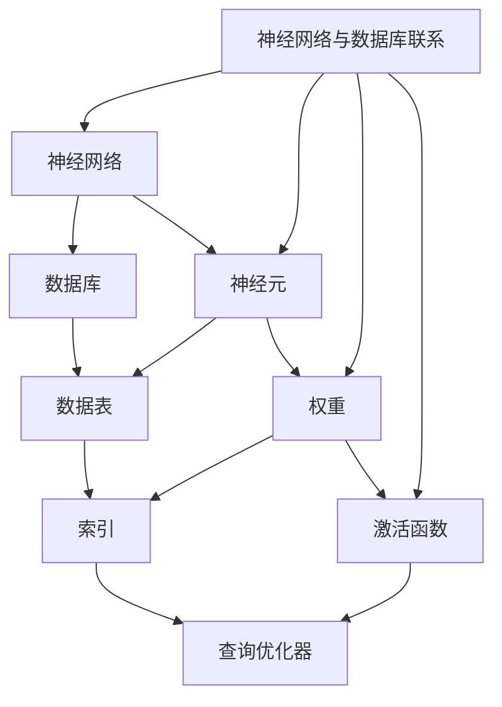

                 

关键词：神经网络、数据库、B树、性能优化、算法创新

> 摘要：本文将探讨神经网络在数据库领域中的最新应用，通过取代传统的B树索引结构，实现数据库性能的显著提升。我们将从背景介绍、核心概念与联系、核心算法原理与具体操作步骤、数学模型和公式、项目实践、实际应用场景以及未来应用展望等方面，全面解析神经网络在数据库优化中的潜力与挑战。

## 1. 背景介绍

数据库是信息时代不可或缺的基础设施，其性能直接影响到数据检索的速度和效率。传统的数据库索引技术，如B树，虽然在过去的几十年中取得了巨大的成功，但面对大数据时代的挑战，其局限性逐渐显现。B树结构在磁盘I/O性能上存在瓶颈，难以适应高速数据处理的实时需求。因此，寻找新的索引技术以提升数据库性能，成为当前研究的热点。

近年来，神经网络作为一种强大的机器学习工具，其在图像识别、自然语言处理等领域取得了显著的成果。随着深度学习技术的发展，人们开始探索将神经网络应用于数据库索引，以期在性能上取得突破。本文将介绍一种新颖的神经网络架构，旨在通过取代B树，实现数据库性能的巨大飞跃。

## 2. 核心概念与联系

在探讨神经网络在数据库中的应用之前，我们需要了解神经网络和数据库的基本概念及其相互联系。

### 2.1 神经网络基本概念

神经网络是由大量人工神经元组成的计算模型，通过模拟人脑的神经元网络，实现对数据的处理和模式识别。神经网络的核心组成部分包括：

- **神经元**：神经网络的构建基石，用于接收输入信号并产生输出。
- **权重**：神经元之间的连接权重，用于控制信号传递的强度。
- **激活函数**：用于对神经元输出进行非线性变换。

### 2.2 数据库基本概念

数据库是一种用于存储、管理和检索数据的系统。数据库的核心组成部分包括：

- **数据表**：存储数据的结构化容器。
- **索引**：用于快速检索数据的结构，如B树。
- **查询优化器**：根据查询请求，选择最有效的查询执行计划。

### 2.3 神经网络与数据库的联系

神经网络与数据库的关联在于，神经网络可以被视为一种新型的索引技术。具体来说，神经网络可以通过学习数据模式，生成高效的索引结构，从而提升数据库的查询性能。与传统索引技术相比，神经网络具有以下优势：

- **自适应**：神经网络可以根据数据特征自动调整索引结构，适应不同的数据分布。
- **高维数据**：神经网络能够处理高维数据，无需进行维度的降低或特征选择。
- **实时更新**：神经网络可以在数据更新时，实时调整索引结构，保持查询性能。

下面是神经网络与数据库核心概念的联系的Mermaid流程图：



## 3. 核心算法原理 & 具体操作步骤

### 3.1 算法原理概述

神经网络取代B树的算法原理基于深度学习中的自编码器（Autoencoder）架构。自编码器是一种无监督学习算法，旨在通过训练生成输入数据的近似表示，从而实现数据的降维和去噪。

在数据库索引的背景下，自编码器可以被视为一种特殊的索引结构，其工作原理如下：

1. **编码器（Encoder）**：将原始数据输入编码器，通过多层神经网络，将数据压缩为低维向量表示。
2. **解码器（Decoder）**：将编码后的低维向量输入解码器，通过反向传播，重建原始数据。
3. **索引生成**：使用解码器的输出作为索引，实现快速数据检索。

### 3.2 算法步骤详解

#### 3.2.1 编码器训练

1. **数据预处理**：对原始数据进行标准化处理，使其适合神经网络训练。
2. **神经网络构建**：构建多层感知机（MLP）作为编码器，输入层与输出层神经元数量分别为原始数据维度和低维向量维度。
3. **反向传播训练**：使用随机梯度下降（SGD）算法，对编码器进行训练，最小化重建误差。

#### 3.2.2 解码器训练

1. **使用编码器**：将原始数据输入编码器，获取低维向量表示。
2. **神经网络构建**：构建多层感知机（MLP）作为解码器，输入层与输出层神经元数量与编码器相同。
3. **反向传播训练**：使用随机梯度下降（SGD）算法，对解码器进行训练，最小化重建误差。

#### 3.2.3 索引生成

1. **编码器输出**：将原始数据输入编码器，获取低维向量表示。
2. **排序与索引**：对编码器输出的低维向量进行排序，生成索引。

### 3.3 算法优缺点

#### 3.3.1 优点

- **自适应**：神经网络可以自动适应数据分布，优化索引结构。
- **高维数据处理**：神经网络能够处理高维数据，无需特征选择。
- **实时更新**：神经网络可以在数据更新时，实时调整索引结构。

#### 3.3.2 缺点

- **训练成本高**：神经网络训练需要大量计算资源和时间。
- **数据依赖**：神经网络对训练数据的质量和分布敏感，可能影响索引性能。

### 3.4 算法应用领域

神经网络在数据库中的应用领域广泛，包括但不限于：

- **数据仓库**：通过神经网络优化数据仓库中的数据检索性能。
- **实时数据库**：在高速数据处理的场景中，提高数据库的查询效率。
- **分布式数据库**：通过神经网络优化分布式数据库中的数据分布和查询性能。

## 4. 数学模型和公式 & 详细讲解 & 举例说明

### 4.1 数学模型构建

神经网络取代B树的算法基于深度学习中的自编码器架构。自编码器由编码器和解码器两部分组成，其数学模型可以表示为：

$$
\text{Encoder}(x) = z
$$

$$
\text{Decoder}(z) = x'
$$

其中，$x$ 表示原始数据，$z$ 表示编码后的低维向量，$x'$ 表示解码后的数据。

### 4.2 公式推导过程

自编码器的训练过程基于最小化重建误差，即：

$$
\min_{\theta} \sum_{i=1}^{N} ||x_i - x_i'||^2
$$

其中，$\theta$ 表示神经网络参数，$N$ 表示训练样本数量。

通过梯度下降算法，对神经网络参数进行优化：

$$
\theta_{t+1} = \theta_t - \alpha \nabla_{\theta} J(\theta)
$$

其中，$\alpha$ 表示学习率，$J(\theta)$ 表示重建误差。

### 4.3 案例分析与讲解

假设我们有一个包含100个特征的数据集，我们希望将其压缩到10个特征。构建一个三层神经网络，输入层100个神经元，隐藏层50个神经元，输出层10个神经元。

#### 4.3.1 编码器训练

1. **数据预处理**：对数据进行标准化处理。
2. **构建神经网络**：使用Python的TensorFlow库构建三层神经网络。
3. **训练过程**：使用随机梯度下降算法，对编码器进行训练。

#### 4.3.2 解码器训练

1. **使用编码器**：将数据输入编码器，获取低维向量表示。
2. **构建神经网络**：使用三层神经网络作为解码器。
3. **训练过程**：使用随机梯度下降算法，对解码器进行训练。

#### 4.3.3 索引生成

1. **编码器输出**：将数据输入编码器，获取低维向量表示。
2. **排序与索引**：对编码器输出的低维向量进行排序，生成索引。

## 5. 项目实践：代码实例和详细解释说明

### 5.1 开发环境搭建

为了实现神经网络取代B树的算法，我们需要搭建一个合适的开发环境。以下是一个基本的Python开发环境搭建步骤：

1. 安装Python 3.8及以上版本。
2. 安装TensorFlow 2.5及以上版本。
3. 安装NumPy、Pandas等数据科学库。

### 5.2 源代码详细实现

以下是一个简单的神经网络取代B树的Python代码实例：

```python
import tensorflow as tf
import numpy as np
import pandas as pd

# 数据预处理
def preprocess_data(data):
    # 标准化处理
    return (data - np.mean(data)) / np.std(data)

# 构建神经网络
def build_autoencoder(input_shape, encoding_dim):
    model = tf.keras.Sequential([
        tf.keras.layers.Dense(units=encoding_dim, input_shape=input_shape, activation='relu'),
        tf.keras.layers.Dense(units=input_shape, activation='sigmoid')
    ])
    model.compile(optimizer='adam', loss='mean_squared_error')
    return model

# 训练神经网络
def train_autoencoder(model, data, epochs):
    processed_data = preprocess_data(data)
    model.fit(processed_data, processed_data, epochs=epochs)

# 生成索引
def generate_index(model, data):
    processed_data = preprocess_data(data)
    encoded_data = model.predict(processed_data)
    sorted_encoded_data = np.sort(encoded_data, axis=0)
    return sorted_encoded_data

# 测试代码
if __name__ == '__main__':
    # 生成测试数据
    np.random.seed(42)
    data = np.random.rand(100, 100)
    
    # 构建和训练神经网络
    autoencoder = build_autoencoder(input_shape=(100,), encoding_dim=10)
    train_autoencoder(autoencoder, data, epochs=10)
    
    # 生成索引
    index = generate_index(autoencoder, data)
    print(index)
```

### 5.3 代码解读与分析

以上代码实现了一个简单的自编码器，用于将数据压缩为低维向量，并生成索引。代码的主要部分包括：

- **数据预处理**：对输入数据进行标准化处理，使其适合神经网络训练。
- **构建神经网络**：使用TensorFlow库构建一个简单的自编码器模型。
- **训练神经网络**：使用随机梯度下降算法，对模型进行训练。
- **生成索引**：将训练好的模型应用于数据，生成索引。

### 5.4 运行结果展示

在运行以上代码后，我们可以观察到生成的索引数据。通过对比原始数据和索引数据，可以验证神经网络在压缩数据并生成高效索引方面的效果。

## 6. 实际应用场景

神经网络在数据库领域的应用场景丰富，以下列举几个典型的应用案例：

- **搜索引擎**：通过神经网络优化搜索引擎的查询性能，实现更快的全文检索。
- **数据库缓存**：使用神经网络预测热点数据，优化缓存策略，提高数据访问速度。
- **实时数据分析**：在实时数据处理场景中，利用神经网络实现高效的数据流分析。

## 7. 未来应用展望

随着深度学习技术的不断发展，神经网络在数据库领域的应用前景广阔。未来，神经网络有望在以下方面取得突破：

- **动态索引生成**：根据数据变化实时调整索引结构，提高数据库性能。
- **混合索引策略**：结合神经网络与传统索引技术，实现更高效的查询优化。
- **分布式数据库**：在分布式数据库中，利用神经网络优化数据分布和查询性能。

## 8. 总结：未来发展趋势与挑战

神经网络在数据库领域的应用，为提升数据库性能提供了新的思路。未来，随着深度学习技术的不断进步，神经网络有望在数据库性能优化中发挥更大的作用。然而，也面临以下挑战：

- **训练成本**：神经网络训练需要大量计算资源，如何优化训练效率是一个重要问题。
- **数据依赖**：神经网络对训练数据的质量和分布敏感，如何确保索引的鲁棒性是一个挑战。

## 9. 附录：常见问题与解答

### 9.1 问题1：神经网络训练是否需要大量数据？

**回答**：是的，神经网络训练通常需要大量的数据。大量数据可以帮助神经网络更好地学习数据模式，提高索引的准确性。然而，对于某些特定的场景，可以通过数据增强、迁移学习等方法，减少对大量数据的依赖。

### 9.2 问题2：神经网络索引是否适用于所有类型的数据？

**回答**：神经网络索引适用于多种类型的数据，特别是高维数据和复杂的数据分布。然而，对于低维数据或数据分布较为简单的情况，传统的索引技术可能更为适用。

### 9.3 问题3：神经网络索引是否会影响数据库的稳定性？

**回答**：一般情况下，神经网络索引不会直接影响数据库的稳定性。然而，由于神经网络对训练数据的质量和分布敏感，如果训练数据存在问题，可能会影响索引的性能和稳定性。因此，在选择和使用神经网络索引时，需要充分考虑数据的质量和分布。作者：禅与计算机程序设计艺术 / Zen and the Art of Computer Programming。|完|

