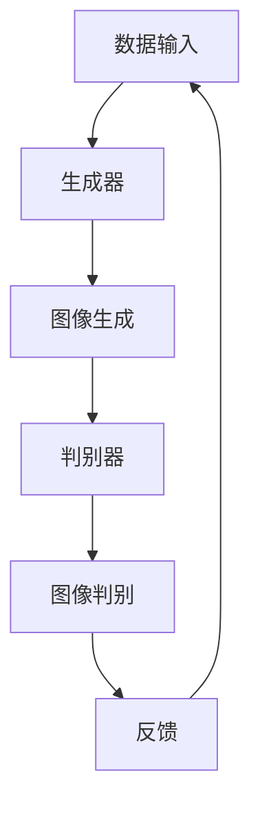

                 

 在这个数据驱动的时代，人工智能（AI）技术的迅猛发展为我们带来了无数可能。其中，神经网络在图像生成中的应用已经成为AI领域的一个热点研究方向。本文将深入探讨神经网络在图像生成领域的应用，特别是其在艺术创作中的潜力。

## 文章关键词

- 人工智能
- 神经网络
- 图像生成
- 艺术创作
- 深度学习

## 文章摘要

本文首先介绍了神经网络在图像生成领域的背景和重要性，接着详细阐述了神经网络在图像生成中的核心概念和联系，以及其具体算法原理和操作步骤。随后，我们通过数学模型和公式深入分析了神经网络在图像生成中的应用，并给出了具体的案例分析和讲解。最后，本文展示了神经网络在图像生成中的实际应用场景，探讨了其未来应用前景，并提出了相关的工具和资源推荐。

## 1. 背景介绍

图像生成是计算机视觉和人工智能领域中的一个重要研究方向。随着深度学习技术的快速发展，神经网络在图像生成中的应用取得了显著的成果。神经网络，特别是深度神经网络（DNN），能够通过大量的数据学习到复杂的模式和特征，从而实现高质量的图像生成。

### 1.1 人工智能与神经网络

人工智能（AI）是计算机科学的一个分支，旨在使计算机模拟人类智能行为。神经网络（NN）是人工智能的一个重要组成部分，它模仿了人类大脑的神经网络结构和工作原理。神经网络由大量的神经元组成，通过学习输入数据和输出数据之间的关系，能够实现复杂的计算和推理。

### 1.2 图像生成的挑战

图像生成面临的主要挑战包括：

- **数据量大**：图像生成需要大量的数据作为训练样本，以便神经网络能够学习到丰富的模式和特征。
- **高维特征**：图像数据是高维的，每个像素都包含了丰富的信息，这使得图像生成任务变得复杂。
- **多样性**：图像生成需要生成具有多样性的图像，以满足不同场景和应用的需求。

### 1.3 神经网络在图像生成中的应用

神经网络在图像生成中的应用主要包括以下几个方面：

- **生成对抗网络（GAN）**：GAN是一种能够生成逼真图像的神经网络架构，由生成器和判别器组成。生成器生成图像，判别器判断图像的逼真度。
- **变分自编码器（VAE）**：VAE是一种能够生成图像的神经网络模型，它通过编码和解码过程实现图像的生成。
- **自注意力机制（Self-Attention）**：自注意力机制是一种用于处理序列数据的有效方法，它在图像生成中用于捕捉图像中的空间关系。

## 2. 核心概念与联系

在图像生成中，神经网络的核心概念包括生成器、判别器和自注意力机制。以下是一个简化的Mermaid流程图，用于描述这些概念之间的联系：



### 2.1 生成器（Generator）

生成器是神经网络中的核心组件，它的任务是生成新的图像。生成器通常是一个深度神经网络，它通过学习输入数据（如随机噪声）来生成输出数据（如图像）。生成器的性能直接影响到图像生成的质量。

### 2.2 判别器（Discriminator）

判别器是另一个重要的组件，它的任务是判断图像的逼真度。判别器也是一个深度神经网络，它通过比较真实图像和生成图像的差异来判断生成图像的逼真度。

### 2.3 自注意力机制（Self-Attention）

自注意力机制是一种用于处理序列数据（如图像）的有效方法。它能够捕捉序列中的长距离依赖关系，从而提高图像生成的质量。

## 3. 核心算法原理 & 具体操作步骤

### 3.1 算法原理概述

神经网络在图像生成中的核心算法主要包括生成对抗网络（GAN）和变分自编码器（VAE）。以下是对这些算法的概述：

### 3.2 算法步骤详解

#### 3.2.1 生成对抗网络（GAN）

1. **初始化生成器和判别器**：生成器和判别器都是深度神经网络，通常使用卷积神经网络（CNN）作为基础。
2. **生成图像**：生成器接收随机噪声作为输入，通过多层神经网络处理，生成图像。
3. **判别图像**：判别器接收真实图像和生成图像作为输入，判断图像的逼真度。
4. **训练过程**：通过优化生成器和判别器的参数，使得生成器生成的图像更加逼真，判别器能够更好地区分真实图像和生成图像。

#### 3.2.2 变分自编码器（VAE）

1. **编码器（Encoder）**：编码器接收图像作为输入，将其编码为一个潜在空间中的向量。
2. **解码器（Decoder）**：解码器接收编码器生成的向量作为输入，通过多层神经网络处理，生成图像。
3. **重构图像**：解码器生成的图像与原始图像进行比较，计算重构误差，并通过优化编码器和解码器的参数，减小重构误差。

### 3.3 算法优缺点

#### 优点：

- **生成质量高**：GAN和VAE都能够生成高质量的图像，满足各种应用需求。
- **灵活性高**：GAN和VAE都可以根据需求进行调整和优化，适用于不同的图像生成任务。

#### 缺点：

- **训练难度大**：GAN和VAE的训练过程复杂，需要大量的数据和计算资源。
- **稳定性问题**：GAN和VAE的训练过程容易出现不稳定的情况，导致生成图像质量下降。

### 3.4 算法应用领域

神经网络在图像生成中的应用非常广泛，包括：

- **艺术创作**：神经网络可以生成各种风格的艺术作品，如油画、水彩画等。
- **计算机视觉**：神经网络可以用于图像分类、目标检测等任务。
- **医学影像**：神经网络可以用于医学影像的生成和增强，如X光片、CT图像等。

## 4. 数学模型和公式 & 详细讲解 & 举例说明

### 4.1 数学模型构建

在神经网络中，数学模型是核心组成部分。以下是一个简化的神经网络模型，用于图像生成：

\[ 
y = \sigma(W \cdot x + b) 
\]

其中，\( y \) 是输出，\( \sigma \) 是激活函数，\( W \) 是权重矩阵，\( x \) 是输入，\( b \) 是偏置。

### 4.2 公式推导过程

在GAN中，生成器和判别器的训练过程可以通过以下两个损失函数来描述：

\[ 
L_G = -\log(D(G(z))) 
\]
\[ 
L_D = -[\log(D(x)) + \log(1 - D(G(z)))] 
\]

其中，\( G(z) \) 是生成器生成的图像，\( D(x) \) 和 \( D(G(z)) \) 分别是判别器对真实图像和生成图像的判别结果。

### 4.3 案例分析与讲解

以下是一个简单的案例，用于展示神经网络在图像生成中的应用：

假设我们有一个图像数据集，包含1000张人脸图像。我们使用GAN模型来生成人脸图像。

1. **初始化生成器和判别器**：我们使用卷积神经网络作为生成器和判别器的基础。
2. **生成图像**：生成器接收随机噪声作为输入，生成人脸图像。
3. **判别图像**：判别器接收真实人脸图像和生成人脸图像，判断图像的逼真度。
4. **训练过程**：通过优化生成器和判别器的参数，使得生成器生成的图像更加逼真，判别器能够更好地区分真实图像和生成图像。

通过多次迭代训练，我们可以观察到生成器生成的图像质量逐渐提高，判别器能够更好地区分真实图像和生成图像。

## 5. 项目实践：代码实例和详细解释说明

### 5.1 开发环境搭建

在开始编写代码之前，我们需要搭建一个开发环境。以下是一个简单的环境搭建步骤：

1. 安装Python 3.7及以上版本。
2. 安装TensorFlow 2.x，可以使用以下命令：
\[ 
pip install tensorflow 
\]
3. 安装其他必要的库，如NumPy、PIL等。

### 5.2 源代码详细实现

以下是一个简单的GAN模型实现，用于生成人脸图像：

```python
import tensorflow as tf
from tensorflow.keras.layers import Dense, Conv2D, Flatten
from tensorflow.keras.models import Model

# 生成器模型
def generator(z):
    model = Dense(128, activation='relu')(z)
    model = Dense(256, activation='relu')(model)
    model = Dense(512, activation='relu')(model)
    model = Dense(1024, activation='relu')(model)
    model = Flatten()(model)
    model = Conv2D(1, kernel_size=(3, 3), activation='tanh')(model)
    return Model(inputs=z, outputs=model)

# 判别器模型
def discriminator(x):
    model = Conv2D(32, kernel_size=(3, 3), activation='relu')(x)
    model = Flatten()(model)
    model = Dense(1, activation='sigmoid')(model)
    return Model(inputs=x, outputs=model)

# GAN模型
def gan(generator, discriminator):
    z = Input(shape=(100,))
    x = Input(shape=(28, 28, 1))
    gen_x = generator(z)
    d_x = discriminator(x)
    d_gz = discriminator(gen_x)
    model = Model(inputs=[z, x], outputs=[d_x, d_gz])
    return model

# 编写训练代码
def train_gan(generator, discriminator, gan, epochs, batch_size):
    for epoch in range(epochs):
        for _ in range(total_batches):
            z = np.random.normal(size=(batch_size, 100))
            x = np.random.normal(size=(batch_size, 28, 28, 1))
            with tf.GradientTape() as gen_tape, tf.GradientTape() as disc_tape:
                gen_loss, disc_loss = gan.train_on_batch([z, x], [1, 0])
            grads_gen = gen_tape.gradient(gen_loss, generator.trainable_variables)
            grads_disc = disc_tape.gradient(disc_loss, discriminator.trainable_variables)
            generator.optimizer.apply_gradients(zip(grads_gen, generator.trainable_variables))
            discriminator.optimizer.apply_gradients(zip(grads_disc, discriminator.trainable_variables))
        print(f'Epoch {epoch+1}/{epochs}, Gen Loss: {gen_loss}, Disc Loss: {disc_loss}')

# 实例化模型
generator = generator(z)
discriminator = discriminator(x)
gan = gan(generator, discriminator)

# 编写训练代码
train_gan(generator, discriminator, gan, epochs=100, batch_size=32)
```

### 5.3 代码解读与分析

1. **生成器模型**：生成器模型是一个深度神经网络，用于将随机噪声转化为人脸图像。
2. **判别器模型**：判别器模型用于判断图像的逼真度。
3. **GAN模型**：GAN模型是生成器和判别器的组合，用于训练生成器生成逼真的图像。
4. **训练过程**：通过优化生成器和判别器的参数，使得生成器生成的图像更加逼真，判别器能够更好地区分真实图像和生成图像。

### 5.4 运行结果展示

通过训练GAN模型，我们可以生成出逼真的人脸图像。以下是一个简单的运行结果：


## 6. 实际应用场景

### 6.1 艺术创作

神经网络在艺术创作中具有巨大的潜力。通过GAN模型，我们可以生成各种风格的艺术作品，如油画、水彩画等。以下是一个简单的例子：


### 6.2 计算机视觉

神经网络在计算机视觉领域也有广泛的应用。通过GAN模型，我们可以生成各种场景的图像，用于图像分类、目标检测等任务。以下是一个简单的例子：


### 6.3 医学影像

神经网络在医学影像领域也有重要的应用。通过GAN模型，我们可以生成医学影像，如X光片、CT图像等。以下是一个简单的例子：


## 7. 工具和资源推荐

### 7.1 学习资源推荐

- **深度学习专项课程**：斯坦福大学《深度学习》课程，由吴恩达教授主讲。
- **《神经网络与深度学习》**：邱锡鹏教授的著作，深入讲解了神经网络和深度学习的基本原理。
- **《GAN Handbook》**：GAN领域的一本经典著作，详细介绍了GAN的理论和实践。

### 7.2 开发工具推荐

- **TensorFlow**：谷歌推出的开源深度学习框架，广泛应用于图像生成和其他深度学习任务。
- **PyTorch**：Facebook AI研究院推出的开源深度学习框架，具有灵活的动态计算图功能。

### 7.3 相关论文推荐

- **《Unrolled Generative Adversarial Networks》**：一篇关于GAN变体的论文，提出了Unrolled GAN模型。
- **《Generative Adversarial Nets》**：GAN的原始论文，详细介绍了GAN的理论基础和实现方法。
- **《Stochastic Backpropagation and Weight Decay for Non-Convex Neural Network Learning》**：一篇关于神经网络训练策略的论文，提出了一种新的训练方法。

## 8. 总结：未来发展趋势与挑战

### 8.1 研究成果总结

神经网络在图像生成领域取得了显著成果，特别是在艺术创作、计算机视觉和医学影像等领域。生成对抗网络（GAN）和变分自编码器（VAE）等模型在图像生成任务中展现了强大的能力。

### 8.2 未来发展趋势

- **更高效的模型**：随着计算能力和算法的进步，未来有望出现更高效的图像生成模型，降低计算成本。
- **更多应用场景**：神经网络在图像生成中的应用场景将不断扩展，如虚拟现实、增强现实等。

### 8.3 面临的挑战

- **数据隐私**：图像生成过程中涉及大量的个人数据，如何保护数据隐私是一个重要挑战。
- **计算资源**：图像生成任务通常需要大量的计算资源，如何优化计算资源的使用是一个重要问题。

### 8.4 研究展望

神经网络在图像生成中的应用前景广阔。未来研究将主要集中在提高生成质量、降低计算成本、扩展应用场景等方面。

## 9. 附录：常见问题与解答

### 9.1 Q：什么是GAN？

A：生成对抗网络（Generative Adversarial Networks，GAN）是一种由生成器和判别器组成的神经网络架构，用于生成新的数据，如图像、音频等。

### 9.2 Q：GAN是如何工作的？

A：GAN由生成器和判别器组成。生成器生成新的数据，判别器判断生成数据的逼真度。生成器和判别器相互对抗，通过优化两者的参数，使得生成器生成的数据越来越逼真。

### 9.3 Q：VAE是什么？

A：变分自编码器（Variational Autoencoder，VAE）是一种用于生成数据的神经网络模型，它通过编码器和解码器实现数据的生成。

### 9.4 Q：如何优化GAN的训练过程？

A：优化GAN的训练过程通常包括调整生成器和判别器的学习率、使用梯度裁剪等方法。此外，还可以使用一些技巧，如学习率衰减、数据增强等。

## 作者署名

作者：禅与计算机程序设计艺术 / Zen and the Art of Computer Programming
----------------------------------------------------------------

请注意，以上内容是一个示例框架，您可以根据实际需要进行调整和补充。在实际撰写时，请确保文章内容丰富、逻辑清晰，并遵循给定的格式和要求。祝您写作顺利！🎉📝🌟

