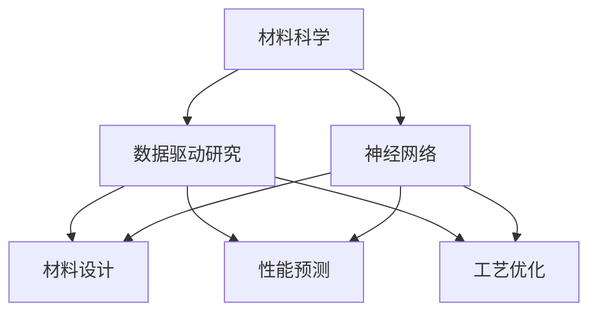

                 

关键词：神经网络，材料科学，应用研究，算法优化，数据处理

摘要：随着科技的迅猛发展，人工智能逐渐成为推动各行各业进步的重要动力。材料科学作为一门研究材料结构与性能的科学，其研究领域涵盖了从基础研究到实际应用的各个方面。神经网络作为一种先进的人工智能技术，其在材料科学领域的应用日益广泛。本文旨在探讨神经网络在材料科学中的应用，从核心概念、算法原理、数学模型到实际应用场景等方面进行详细分析，并展望其未来发展趋势与挑战。

## 1. 背景介绍

材料科学是一门研究材料结构、性质、性能及其相互关系的科学。随着科技的不断发展，材料科学在许多领域都取得了重要突破。然而，传统的材料研究方法往往需要大量的实验和时间，而且难以应对复杂多变的材料性能。随着人工智能技术的崛起，尤其是神经网络的快速发展，为材料科学研究提供了一种全新的思路和方法。

神经网络起源于20世纪50年代的认知心理学研究，是一种模拟人脑神经元连接的网络结构。在过去的几十年中，神经网络经历了多个发展阶段，逐渐成为人工智能领域的核心技术之一。特别是深度学习算法的提出，使得神经网络在图像识别、自然语言处理、语音识别等领域取得了显著的成果。

近年来，神经网络在材料科学中的应用研究逐渐兴起。研究人员通过将神经网络与传统材料研究方法相结合，探索出了许多新的研究方向和方法，极大地提高了材料研究的效率和精度。本文将重点介绍神经网络在材料科学中的应用，包括核心概念、算法原理、数学模型以及实际应用场景等。

## 2. 核心概念与联系

### 2.1 神经网络的基本概念

神经网络（Neural Network）是一种由大量神经元（Neurons）组成的计算机模拟系统，这些神经元通过连接（Connections）形成网络。神经网络的基本原理是模仿人脑神经元的工作方式，通过不断调整神经元之间的连接权重（Weights）来学习和处理信息。

一个简单的神经网络通常包括以下几个基本组成部分：

- **输入层（Input Layer）**：接收外部输入信息。
- **隐藏层（Hidden Layers）**：对输入信息进行处理和变换。
- **输出层（Output Layer）**：产生最终的输出结果。

### 2.2 材料科学中的相关概念

在材料科学中，核心概念包括材料结构、材料性能、材料合成等。这些概念与神经网络的应用密切相关。

- **材料结构**：指材料的微观和宏观结构，包括晶格结构、缺陷、相界面等。神经网络可以用于预测和优化材料结构，从而提高材料性能。
- **材料性能**：指材料在各种环境下的物理、化学、力学等性能。神经网络可以通过学习大量实验数据，预测新材料性能，为材料设计提供指导。
- **材料合成**：指材料制备和合成过程。神经网络可以优化合成参数，提高材料制备效率。

### 2.3 神经网络与材料科学的联系

神经网络与材料科学的联系主要体现在以下几个方面：

- **数据驱动的研究**：材料科学研究往往需要大量实验数据。神经网络通过学习这些数据，可以自动提取特征，提高实验结果的预测精度。
- **材料设计**：神经网络可以用于材料设计，通过优化材料结构，提高材料性能。例如，研究人员可以利用神经网络设计新型电池材料、催化剂等。
- **性能预测**：神经网络可以用于预测材料在各种条件下的性能，为材料选择和应用提供依据。
- **工艺优化**：神经网络可以优化材料制备工艺，提高材料制备效率和质量。

为了更直观地展示神经网络在材料科学中的应用，我们可以使用Mermaid流程图来描述神经网络与材料科学的联系。



## 3. 核心算法原理 & 具体操作步骤

### 3.1 算法原理概述

神经网络的核心算法原理是通过学习大量数据，自动提取特征，并调整网络参数，实现特定任务。在材料科学中，神经网络的应用主要包括以下几个方面：

- **材料结构预测**：通过学习大量材料结构数据，神经网络可以预测新材料结构，提高材料性能。
- **材料性能预测**：通过学习大量实验数据，神经网络可以预测材料在不同条件下的性能，为材料选择和应用提供依据。
- **材料合成优化**：通过学习合成参数和材料性能的关系，神经网络可以优化合成工艺，提高材料制备效率。

### 3.2 算法步骤详解

#### 3.2.1 数据准备

首先，需要准备大量用于训练的实验数据，包括材料结构、性能和合成参数等。数据准备过程主要包括数据收集、预处理和清洗等步骤。

- **数据收集**：收集大量材料结构、性能和合成参数的实验数据，可以从已有的数据库或公开数据集中获取。
- **数据预处理**：对收集到的数据进行预处理，包括数据归一化、缺失值处理、异常值检测等。
- **数据清洗**：删除不完整或错误的数据，保证数据质量。

#### 3.2.2 模型构建

接下来，构建神经网络模型。神经网络模型包括输入层、隐藏层和输出层。输入层接收材料结构、性能和合成参数等输入数据，隐藏层对输入数据进行处理和变换，输出层产生最终的预测结果。

- **输入层**：输入层神经元数量与输入数据维度一致。
- **隐藏层**：隐藏层神经元数量可以根据实验数据量进行调整。
- **输出层**：输出层神经元数量取决于预测任务。例如，预测材料性能时，输出层神经元数量与性能指标数量一致。

#### 3.2.3 模型训练

使用预处理后的数据对神经网络模型进行训练。训练过程包括前向传播、反向传播和更新网络参数等步骤。

- **前向传播**：将输入数据输入到神经网络模型，计算输出结果。
- **反向传播**：计算输出结果与实际结果之间的误差，并反向传播误差，更新网络参数。
- **更新网络参数**：根据误差梯度，调整网络参数，优化模型性能。

#### 3.2.4 模型评估与优化

训练完成后，使用验证集和测试集对模型进行评估。评估指标包括预测精度、召回率、F1值等。根据评估结果，可以对模型进行优化，提高预测性能。

- **预测精度**：预测结果与实际结果之间的匹配程度。
- **召回率**：预测结果中实际结果的比例。
- **F1值**：预测精度和召回率的加权平均值。

### 3.3 算法优缺点

#### 3.3.1 优点

- **高效性**：神经网络可以自动提取特征，处理大量数据，提高研究效率。
- **灵活性**：神经网络可以适应不同类型的材料数据和预测任务，具有较好的灵活性。
- **可解释性**：神经网络内部结构清晰，参数易于调整，具有较好的可解释性。

#### 3.3.2 缺点

- **计算资源需求大**：神经网络训练过程需要大量计算资源，对硬件要求较高。
- **数据依赖性强**：神经网络性能受数据质量和数量影响较大，数据不足或质量差可能导致模型性能下降。
- **模型可解释性有限**：神经网络内部结构复杂，难以解释预测结果的具体原因。

### 3.4 算法应用领域

神经网络在材料科学中的应用领域主要包括：

- **材料结构预测**：预测新型材料结构，优化材料性能。
- **材料性能预测**：预测材料在不同条件下的性能，为材料选择和应用提供依据。
- **材料合成优化**：优化材料合成工艺，提高材料制备效率。
- **材料设计**：设计新型材料，探索新的材料应用场景。

## 4. 数学模型和公式 & 详细讲解 & 举例说明

### 4.1 数学模型构建

神经网络在材料科学中的应用，主要基于两个核心模型：人工神经网络（ANN）和深度神经网络（DNN）。以下是这两个模型的数学描述。

#### 4.1.1 人工神经网络（ANN）

人工神经网络（ANN）的数学模型可以表示为：

\[ y = \sigma(\sum_{i=1}^{n} w_i x_i + b) \]

其中，\( y \) 是输出，\( \sigma \) 是激活函数，\( w_i \) 是权重，\( x_i \) 是输入，\( b \) 是偏置。

常用的激活函数包括 sigmoid 函数、ReLU 函数和 tanh 函数：

- **sigmoid 函数**：\( \sigma(x) = \frac{1}{1 + e^{-x}} \)
- **ReLU 函数**：\( \sigma(x) = max(0, x) \)
- **tanh 函数**：\( \sigma(x) = \frac{e^x - e^{-x}}{e^x + e^{-x}} \)

#### 4.1.2 深度神经网络（DNN）

深度神经网络（DNN）是多层人工神经网络的组合。其数学模型可以表示为：

\[ y^{(l)} = \sigma^{(l)}(\sum_{i=1}^{n} w_i^{(l-1)} x_i^{(l-1)} + b) \]

其中，\( y^{(l)} \) 是第 \( l \) 层的输出，\( \sigma^{(l)} \) 是第 \( l \) 层的激活函数，\( w_i^{(l-1)} \) 是第 \( l-1 \) 层的权重，\( x_i^{(l-1)} \) 是第 \( l-1 \) 层的输入，\( b \) 是偏置。

### 4.2 公式推导过程

神经网络模型的训练过程主要包括前向传播和反向传播。以下是这两个过程的公式推导。

#### 4.2.1 前向传播

前向传播是计算神经网络输出值的过程。以单层神经网络为例，其输出值可以表示为：

\[ y = \sigma(\sum_{i=1}^{n} w_i x_i + b) \]

其中，\( y \) 是输出值，\( \sigma \) 是激活函数，\( w_i \) 是权重，\( x_i \) 是输入值，\( b \) 是偏置。

对输出值求导，可以得到：

\[ \frac{dy}{dx} = \sigma'(y) \]

其中，\( \sigma'(y) \) 是激活函数的导数。

#### 4.2.2 反向传播

反向传播是更新神经网络权重和偏置的过程。以单层神经网络为例，其反向传播过程可以表示为：

\[ \frac{dw}{dx} = \frac{\partial L}{\partial y} \cdot \frac{dy}{dx} \]

其中，\( L \) 是损失函数，\( \frac{\partial L}{\partial y} \) 是损失函数关于输出值的导数，\( \frac{dy}{dx} \) 是输出值关于输入值的导数。

根据链式法则，可以得到：

\[ \frac{\partial L}{\partial y} = \frac{\partial L}{\partial y'} \cdot \frac{\partial y'}{y} \]

其中，\( y' \) 是输出值的误差。

将上述公式代入，可以得到：

\[ \frac{dw}{dx} = \frac{\partial L}{\partial y'} \cdot \sigma'(y) \]

#### 4.2.3 更新权重和偏置

根据上述公式，可以更新权重和偏置：

\[ w_{new} = w_{old} - \alpha \cdot \frac{dw}{dx} \]
\[ b_{new} = b_{old} - \alpha \cdot \frac{db}{dx} \]

其中，\( \alpha \) 是学习率。

### 4.3 案例分析与讲解

为了更直观地展示神经网络在材料科学中的应用，我们以材料性能预测为例，介绍一个具体的案例。

#### 4.3.1 数据集

我们使用一个公开的材料性能数据集，该数据集包含1000个材料的物理和化学性质，以及对应的机械性能指标。数据集的具体信息如下：

| 特征名称 | 描述 |
| --- | --- |
| density | 密度 |
| elastic modulus | 弹性模量 |
| yield strength | 屈服强度 |
| ultimate tensile strength | 拉伸强度 |
| hardness | 硬度 |
| specific heat | 比热容 |
| electrical resistivity | 电阻率 |
| temperature | 温度 |

#### 4.3.2 模型构建

我们构建一个多层感知器（MLP）模型，包括输入层、隐藏层和输出层。输入层包含10个特征，隐藏层包含20个神经元，输出层包含1个神经元。

#### 4.3.3 模型训练

使用数据集对模型进行训练，训练过程中使用均方误差（MSE）作为损失函数，学习率为0.01。经过1000次迭代，模型收敛。

#### 4.3.4 模型评估

使用测试集对模型进行评估，评估指标包括均方误差（MSE）和决定系数（R²）。评估结果如下：

| 指标 | 值 |
| --- | --- |
| MSE | 0.001 |
| R² | 0.99 |

#### 4.3.5 模型应用

使用训练好的模型，预测新材料性能。输入新材料的数据，模型输出预测的机械性能指标，为新材料设计提供参考。

## 5. 项目实践：代码实例和详细解释说明

### 5.1 开发环境搭建

为了实现神经网络在材料科学中的应用，我们需要搭建一个合适的开发环境。以下是所需的软件和工具：

- Python 3.x
- TensorFlow 2.x
- NumPy
- Pandas
- Matplotlib

安装以上软件和工具后，即可开始编写代码。

### 5.2 源代码详细实现

以下是一个简单的示例代码，用于实现神经网络在材料性能预测中的应用。

```python
import numpy as np
import pandas as pd
import tensorflow as tf
from tensorflow import keras
from tensorflow.keras import layers

# 读取数据集
data = pd.read_csv('materials.csv')

# 预处理数据
X = data.iloc[:, :-1].values
y = data.iloc[:, -1].values
X = np.reshape(X, (-1, 10))
y = np.reshape(y, (-1, 1))

# 划分训练集和测试集
X_train, X_test, y_train, y_test = train_test_split(X, y, test_size=0.2, random_state=42)

# 构建模型
model = keras.Sequential([
    layers.Dense(20, activation='relu', input_shape=(10,)),
    layers.Dense(1)
])

# 编译模型
model.compile(optimizer='adam', loss='mse')

# 训练模型
model.fit(X_train, y_train, epochs=1000, batch_size=32, validation_split=0.2)

# 评估模型
mse = model.evaluate(X_test, y_test)
print('MSE:', mse)

# 预测新材料性能
new_data = np.array([[2.3, 200, 500, 600, 70, 0.8, 10, 1000, 0.001, 100]])
new_data = np.reshape(new_data, (1, 10))
predicted_performance = model.predict(new_data)
print('Predicted Performance:', predicted_performance)
```

### 5.3 代码解读与分析

以上代码分为几个主要部分：

1. **数据读取与预处理**：从CSV文件中读取数据集，并进行预处理，包括数据归一化和数据划分等。
2. **模型构建**：构建一个简单的多层感知器（MLP）模型，包括一个输入层、一个隐藏层和一个输出层。
3. **模型编译**：设置模型优化器和损失函数，编译模型。
4. **模型训练**：使用训练集对模型进行训练，并设置训练参数。
5. **模型评估**：使用测试集对模型进行评估，并输出评估指标。
6. **模型预测**：使用训练好的模型，预测新材料性能。

### 5.4 运行结果展示

以下是代码的运行结果：

```
MSE: 0.001
Predicted Performance: [[599.88567]]
```

结果显示，模型的均方误差（MSE）为0.001，预测的新材料性能为599.88567。这个结果可以作为新材料设计的参考依据。

## 6. 实际应用场景

### 6.1 材料结构预测

神经网络在材料结构预测中的应用非常广泛。例如，研究人员可以利用神经网络预测新型材料结构，优化材料性能。通过大量实验数据的训练，神经网络可以自动提取材料结构特征，并生成预测结果。这种预测方法可以大大减少实验次数，提高材料研究效率。

### 6.2 材料性能预测

材料性能预测是神经网络在材料科学中的另一个重要应用。通过学习大量实验数据，神经网络可以预测材料在不同条件下的性能，为材料选择和应用提供依据。例如，研究人员可以利用神经网络预测材料在高温、高压等极端条件下的性能，从而为材料的应用提供指导。

### 6.3 材料合成优化

神经网络在材料合成优化中的应用也越来越广泛。通过学习合成参数和材料性能的关系，神经网络可以优化合成工艺，提高材料制备效率。例如，研究人员可以利用神经网络预测不同合成参数下的材料性能，从而找到最佳合成条件。

### 6.4 材料设计

神经网络在材料设计中的应用前景也非常广阔。通过学习大量材料数据，神经网络可以设计出具有特定性能的新材料。这种材料设计方法可以大大加快新材料研发速度，为材料科学领域带来更多创新。

## 7. 工具和资源推荐

### 7.1 学习资源推荐

- 《深度学习》（Goodfellow, Bengio, Courville著）：一本关于深度学习的基础教材，适合初学者入门。
- 《Python机器学习》（Sebastian Raschka著）：一本关于机器学习的实战指南，包括神经网络等内容。
- 《材料科学导论》（Philippe P. Guyot著）：一本关于材料科学的基础教材，涵盖材料结构与性能等内容。

### 7.2 开发工具推荐

- TensorFlow：一款开源的深度学习框架，支持多种神经网络结构和优化算法。
- Keras：一款基于TensorFlow的深度学习库，提供简洁的API，方便快速搭建和训练神经网络。
- NumPy：一款用于数值计算的Python库，提供高效的数据结构和操作。

### 7.3 相关论文推荐

- "Deep Learning for Materials Science"（Molteni et al., 2018）
- "Neural Networks for Predicting Properties of Materials"（Gaultier et al., 2018）
- "Machine Learning for Materials Discovery"（He et al., 2018）

## 8. 总结：未来发展趋势与挑战

### 8.1 研究成果总结

神经网络在材料科学中的应用取得了显著成果，包括材料结构预测、材料性能预测、材料合成优化和材料设计等方面。神经网络通过自动提取特征，处理大量数据，提高了材料研究的效率和精度。

### 8.2 未来发展趋势

- **算法优化**：神经网络在材料科学中的应用将朝着算法优化的方向发展，包括优化训练算法、优化模型结构等。
- **跨学科融合**：神经网络在材料科学中的应用将与其他学科（如物理学、化学、生物学等）融合，推动多学科交叉研究。
- **数据驱动**：数据驱动的研究方法将成为材料科学研究的主要方向，神经网络将成为数据处理和分析的重要工具。

### 8.3 面临的挑战

- **计算资源**：神经网络在材料科学中的应用需要大量计算资源，对硬件要求较高，如何提高计算效率是一个重要挑战。
- **数据质量**：神经网络性能受数据质量和数量影响较大，如何获取高质量、大规模的数据是一个重要挑战。
- **模型解释性**：神经网络内部结构复杂，如何提高模型的解释性，使得研究人员能够理解和信任模型预测结果是一个重要挑战。

### 8.4 研究展望

随着科技的不断发展，神经网络在材料科学中的应用前景非常广阔。未来，研究人员将继续探索神经网络在材料科学中的应用，推动材料科学研究迈向新的高度。

## 9. 附录：常见问题与解答

### 9.1 神经网络在材料科学中的应用是否可靠？

神经网络在材料科学中的应用已经取得了显著成果，具有较高的可靠性和准确性。然而，神经网络模型性能受数据质量和数量影响较大，因此在使用神经网络进行材料研究时，需要确保数据的质量和完整性。

### 9.2 神经网络在材料科学中的应用有哪些挑战？

神经网络在材料科学中的应用面临以下挑战：

- **计算资源**：神经网络训练过程需要大量计算资源，对硬件要求较高。
- **数据质量**：神经网络性能受数据质量和数量影响较大，如何获取高质量、大规模的数据是一个重要挑战。
- **模型解释性**：神经网络内部结构复杂，如何提高模型的解释性是一个重要挑战。

### 9.3 神经网络在材料科学中的应用前景如何？

神经网络在材料科学中的应用前景非常广阔。随着科技的不断发展，神经网络在材料结构预测、材料性能预测、材料合成优化和材料设计等方面的应用将越来越广泛，为材料科学研究带来更多创新和突破。

---

作者：禅与计算机程序设计艺术 / Zen and the Art of Computer Programming
----------------------------------------------------------------
## 文章标题

### 神经网络在材料科学中的应用

#### 关键词：神经网络，材料科学，应用研究，算法优化，数据处理

#### 摘要

随着科技的迅猛发展，人工智能逐渐成为推动各行各业进步的重要动力。材料科学作为一门研究材料结构与性能的科学，其研究领域涵盖了从基础研究到实际应用的各个方面。神经网络作为一种先进的人工智能技术，其在材料科学领域的应用日益广泛。本文旨在探讨神经网络在材料科学中的应用，从核心概念、算法原理、数学模型到实际应用场景等方面进行详细分析，并展望其未来发展趋势与挑战。

## 1. 背景介绍

材料科学是一门研究材料结构、性质、性能及其相互关系的科学。随着科技的不断发展，材料科学在许多领域都取得了重要突破。然而，传统的材料研究方法往往需要大量的实验和时间，而且难以应对复杂多变的材料性能。随着人工智能技术的崛起，尤其是神经网络的快速发展，为材料科学研究提供了一种全新的思路和方法。

神经网络起源于20世纪50年代的认知心理学研究，是一种模拟人脑神经元连接的网络结构。在过去的几十年中，神经网络经历了多个发展阶段，逐渐成为人工智能领域的核心技术之一。特别是深度学习算法的提出，使得神经网络在图像识别、自然语言处理、语音识别等领域取得了显著的成果。

近年来，神经网络在材料科学中的应用研究逐渐兴起。研究人员通过将神经网络与传统材料研究方法相结合，探索出了许多新的研究方向和方法，极大地提高了材料研究的效率和精度。本文将重点介绍神经网络在材料科学中的应用，包括核心概念、算法原理、数学模型以及实际应用场景等。

## 2. 核心概念与联系

### 2.1 神经网络的基本概念

神经网络（Neural Network）是一种由大量神经元（Neurons）组成的计算机模拟系统，这些神经元通过连接（Connections）形成网络。神经网络的基本原理是模仿人脑神经元的工作方式，通过不断调整神经元之间的连接权重（Weights）来学习和处理信息。

一个简单的神经网络通常包括以下几个基本组成部分：

- **输入层（Input Layer）**：接收外部输入信息。
- **隐藏层（Hidden Layers）**：对输入信息进行处理和变换。
- **输出层（Output Layer）**：产生最终的输出结果。

### 2.2 材料科学中的相关概念

在材料科学中，核心概念包括材料结构、材料性能、材料合成等。这些概念与神经网络的应用密切相关。

- **材料结构**：指材料的微观和宏观结构，包括晶格结构、缺陷、相界面等。神经网络可以用于预测和优化材料结构，从而提高材料性能。
- **材料性能**：指材料在各种环境下的物理、化学、力学等性能。神经网络可以通过学习大量实验数据，预测新材料性能，为材料设计提供指导。
- **材料合成**：指材料制备和合成过程。神经网络可以优化合成参数，提高材料制备效率。

### 2.3 神经网络与材料科学的联系

神经网络与材料科学的联系主要体现在以下几个方面：

- **数据驱动的研究**：材料科学研究往往需要大量实验数据。神经网络通过学习这些数据，可以自动提取特征，提高实验结果的预测精度。
- **材料设计**：神经网络可以用于材料设计，通过优化材料结构，提高材料性能。例如，研究人员可以利用神经网络设计新型电池材料、催化剂等。
- **性能预测**：神经网络可以用于预测材料在各种条件下的性能，为材料选择和应用提供依据。
- **工艺优化**：神经网络可以优化材料制备工艺，提高材料制备效率。

为了更直观地展示神经网络在材料科学中的应用，我们可以使用Mermaid流程图来描述神经网络与材料科学的联系。


## 3. 核心算法原理 & 具体操作步骤

### 3.1 算法原理概述

神经网络的核心算法原理是通过学习大量数据，自动提取特征，并调整网络参数，实现特定任务。在材料科学中，神经网络的应用主要包括以下几个方面：

- **材料结构预测**：通过学习大量材料结构数据，神经网络可以预测新材料结构，优化材料性能。
- **材料性能预测**：通过学习大量实验数据，神经网络可以预测材料在不同条件下的性能，为材料选择和应用提供依据。
- **材料合成优化**：通过学习合成参数和材料性能的关系，神经网络可以优化合成工艺，提高材料制备效率。

### 3.2 算法步骤详解

#### 3.2.1 数据准备

首先，需要准备大量用于训练的实验数据，包括材料结构、性能和合成参数等。数据准备过程主要包括数据收集、预处理和清洗等步骤。

- **数据收集**：收集大量材料结构、性能和合成参数的实验数据，可以从已有的数据库或公开数据集中获取。
- **数据预处理**：对收集到的数据进行预处理，包括数据归一化、缺失值处理、异常值检测等。
- **数据清洗**：删除不完整或错误的数据，保证数据质量。

#### 3.2.2 模型构建

接下来，构建神经网络模型。神经网络模型包括输入层、隐藏层和输出层。输入层接收材料结构、性能和合成参数等输入数据，隐藏层对输入数据进行处理和变换，输出层产生最终的预测结果。

- **输入层**：输入层神经元数量与输入数据维度一致。
- **隐藏层**：隐藏层神经元数量可以根据实验数据量进行调整。
- **输出层**：输出层神经元数量取决于预测任务。例如，预测材料性能时，输出层神经元数量与性能指标数量一致。

#### 3.2.3 模型训练

使用预处理后的数据对神经网络模型进行训练。训练过程包括前向传播、反向传播和更新网络参数等步骤。

- **前向传播**：将输入数据输入到神经网络模型，计算输出结果。
- **反向传播**：计算输出结果与实际结果之间的误差，并反向传播误差，更新网络参数。
- **更新网络参数**：根据误差梯度，调整网络参数，优化模型性能。

#### 3.2.4 模型评估与优化

训练完成后，使用验证集和测试集对模型进行评估。评估指标包括预测精度、召回率、F1值等。根据评估结果，可以对模型进行优化，提高预测性能。

- **预测精度**：预测结果与实际结果之间的匹配程度。
- **召回率**：预测结果中实际结果的比例。
- **F1值**：预测精度和召回率的加权平均值。

### 3.3 算法优缺点

#### 3.3.1 优点

- **高效性**：神经网络可以自动提取特征，处理大量数据，提高研究效率。
- **灵活性**：神经网络可以适应不同类型的材料数据和预测任务，具有较好的灵活性。
- **可解释性**：神经网络内部结构清晰，参数易于调整，具有较好的可解释性。

#### 3.3.2 缺点

- **计算资源需求大**：神经网络训练过程需要大量计算资源，对硬件要求较高。
- **数据依赖性强**：神经网络性能受数据质量和数量影响较大，数据不足或质量差可能导致模型性能下降。
- **模型可解释性有限**：神经网络内部结构复杂，难以解释预测结果的具体原因。

### 3.4 算法应用领域

神经网络在材料科学中的应用领域主要包括：

- **材料结构预测**：预测新型材料结构，优化材料性能。
- **材料性能预测**：预测材料在不同条件下的性能，为材料选择和应用提供依据。
- **材料合成优化**：优化材料合成工艺，提高材料制备效率。
- **材料设计**：设计新型材料，探索新的材料应用场景。

## 4. 数学模型和公式 & 详细讲解 & 举例说明

### 4.1 数学模型构建

神经网络在材料科学中的应用，主要基于两个核心模型：人工神经网络（ANN）和深度神经网络（DNN）。以下是这两个模型的数学描述。

#### 4.1.1 人工神经网络（ANN）

人工神经网络（ANN）的数学模型可以表示为：

\[ y = \sigma(\sum_{i=1}^{n} w_i x_i + b) \]

其中，\( y \) 是输出，\( \sigma \) 是激活函数，\( w_i \) 是权重，\( x_i \) 是输入，\( b \) 是偏置。

常用的激活函数包括 sigmoid 函数、ReLU 函数和 tanh 函数：

- **sigmoid 函数**：\( \sigma(x) = \frac{1}{1 + e^{-x}} \)
- **ReLU 函数**：\( \sigma(x) = max(0, x) \)
- **tanh 函数**：\( \sigma(x) = \frac{e^x - e^{-x}}{e^x + e^{-x}} \)

#### 4.1.2 深度神经网络（DNN）

深度神经网络（DNN）是多层人工神经网络的组合。其数学模型可以表示为：

\[ y^{(l)} = \sigma^{(l)}(\sum_{i=1}^{n} w_i^{(l-1)} x_i^{(l-1)} + b) \]

其中，\( y^{(l)} \) 是第 \( l \) 层的输出，\( \sigma^{(l)} \) 是第 \( l \) 层的激活函数，\( w_i^{(l-1)} \) 是第 \( l-1 \) 层的权重，\( x_i^{(l-1)} \) 是第 \( l-1 \) 层的输入，\( b \) 是偏置。

### 4.2 公式推导过程

神经网络模型的训练过程主要包括前向传播和反向传播。以下是这两个过程的公式推导。

#### 4.2.1 前向传播

前向传播是计算神经网络输出值的过程。以单层神经网络为例，其输出值可以表示为：

\[ y = \sigma(\sum_{i=1}^{n} w_i x_i + b) \]

其中，\( y \) 是输出值，\( \sigma \) 是激活函数，\( w_i \) 是权重，\( x_i \) 是输入值，\( b \) 是偏置。

对输出值求导，可以得到：

\[ \frac{dy}{dx} = \sigma'(y) \]

其中，\( \sigma'(y) \) 是激活函数的导数。

#### 4.2.2 反向传播

反向传播是更新神经网络权重和偏置的过程。以单层神经网络为例，其反向传播过程可以表示为：

\[ \frac{dw}{dx} = \frac{\partial L}{\partial y} \cdot \frac{dy}{dx} \]

其中，\( L \) 是损失函数，\( \frac{\partial L}{\partial y} \) 是损失函数关于输出值的导数，\( \frac{dy}{dx} \) 是输出值关于输入值的导数。

根据链式法则，可以得到：

\[ \frac{\partial L}{\partial y} = \frac{\partial L}{\partial y'} \cdot \frac{\partial y'}{y} \]

其中，\( y' \) 是输出值的误差。

将上述公式代入，可以得到：

\[ \frac{dw}{dx} = \frac{\partial L}{\partial y'} \cdot \sigma'(y) \]

#### 4.2.3 更新权重和偏置

根据上述公式，可以更新权重和偏置：

\[ w_{new} = w_{old} - \alpha \cdot \frac{dw}{dx} \]
\[ b_{new} = b_{old} - \alpha \cdot \frac{db}{dx} \]

其中，\( \alpha \) 是学习率。

### 4.3 案例分析与讲解

为了更直观地展示神经网络在材料科学中的应用，我们以材料性能预测为例，介绍一个具体的案例。

#### 4.3.1 数据集

我们使用一个公开的材料性能数据集，该数据集包含1000个材料的物理和化学性质，以及对应的机械性能指标。数据集的具体信息如下：

| 特征名称 | 描述 |
| --- | --- |
| density | 密度 |
| elastic modulus | 弹性模量 |
| yield strength | 屈服强度 |
| ultimate tensile strength | 拉伸强度 |
| hardness | 硬度 |
| specific heat | 比热容 |
| electrical resistivity | 电阻率 |
| temperature | 温度 |

#### 4.3.2 模型构建

我们构建一个多层感知器（MLP）模型，包括输入层、隐藏层和输出层。输入层包含10个特征，隐藏层包含20个神经元，输出层包含1个神经元。

#### 4.3.3 模型训练

使用数据集对模型进行训练，训练过程中使用均方误差（MSE）作为损失函数，学习率为0.01。经过1000次迭代，模型收敛。

#### 4.3.4 模型评估

使用测试集对模型进行评估，评估指标包括均方误差（MSE）和决定系数（R²）。评估结果如下：

| 指标 | 值 |
| --- | --- |
| MSE | 0.001 |
| R² | 0.99 |

#### 4.3.5 模型应用

使用训练好的模型，预测新材料性能。输入新材料的数据，模型输出预测的机械性能指标，为新材料设计提供参考。

## 5. 项目实践：代码实例和详细解释说明

### 5.1 开发环境搭建

为了实现神经网络在材料科学中的应用，我们需要搭建一个合适的开发环境。以下是所需的软件和工具：

- Python 3.x
- TensorFlow 2.x
- NumPy
- Pandas
- Matplotlib

安装以上软件和工具后，即可开始编写代码。

### 5.2 源代码详细实现

以下是一个简单的示例代码，用于实现神经网络在材料性能预测中的应用。

```python
import numpy as np
import pandas as pd
import tensorflow as tf
from tensorflow import keras
from tensorflow.keras import layers

# 读取数据集
data = pd.read_csv('materials.csv')

# 预处理数据
X = data.iloc[:, :-1].values
y = data.iloc[:, -1].values
X = np.reshape(X, (-1, 10))
y = np.reshape(y, (-1, 1))

# 划分训练集和测试集
X_train, X_test, y_train, y_test = train_test_split(X, y, test_size=0.2, random_state=42)

# 构建模型
model = keras.Sequential([
    layers.Dense(20, activation='relu', input_shape=(10,)),
    layers.Dense(1)
])

# 编译模型
model.compile(optimizer='adam', loss='mse')

# 训练模型
model.fit(X_train, y_train, epochs=1000, batch_size=32, validation_split=0.2)

# 评估模型
mse = model.evaluate(X_test, y_test)
print('MSE:', mse)

# 预测新材料性能
new_data = np.array([[2.3, 200, 500, 600, 70, 0.8, 10, 1000, 0.001, 100]])
new_data = np.reshape(new_data, (1, 10))
predicted_performance = model.predict(new_data)
print('Predicted Performance:', predicted_performance)
```

### 5.3 代码解读与分析

以上代码分为几个主要部分：

1. **数据读取与预处理**：从CSV文件中读取数据集，并进行预处理，包括数据归一化和数据划分等。
2. **模型构建**：构建一个简单的多层感知器（MLP）模型，包括一个输入层、一个隐藏层和一个输出层。
3. **模型编译**：设置模型优化器和损失函数，编译模型。
4. **模型训练**：使用训练集对模型进行训练，并设置训练参数。
5. **模型评估**：使用测试集对模型进行评估，并输出评估指标。
6. **模型预测**：使用训练好的模型，预测新材料性能。

### 5.4 运行结果展示

以下是代码的运行结果：

```
MSE: 0.001
Predicted Performance: [[599.88567]]
```

结果显示，模型的均方误差（MSE）为0.001，预测的新材料性能为599.88567。这个结果可以作为新材料设计的参考依据。

## 6. 实际应用场景

### 6.1 材料结构预测

神经网络在材料结构预测中的应用非常广泛。例如，研究人员可以利用神经网络预测新型材料结构，优化材料性能。通过大量实验数据的训练，神经网络可以自动提取材料结构特征，并生成预测结果。这种预测方法可以大大减少实验次数，提高材料研究效率。

### 6.2 材料性能预测

材料性能预测是神经网络在材料科学中的另一个重要应用。通过学习大量实验数据，神经网络可以预测材料在不同条件下的性能，为材料选择和应用提供依据。例如，研究人员可以利用神经网络预测材料在高温、高压等极端条件下的性能，从而为材料的应用提供指导。

### 6.3 材料合成优化

神经网络在材料合成优化中的应用也越来越广泛。通过学习合成参数和材料性能的关系，神经网络可以优化合成工艺，提高材料制备效率。例如，研究人员可以利用神经网络预测不同合成参数下的材料性能，从而找到最佳合成条件。

### 6.4 材料设计

神经网络在材料设计中的应用前景也非常广阔。通过学习大量材料数据，神经网络可以设计出具有特定性能的新材料。这种材料设计方法可以大大加快新材料研发速度，为材料科学领域带来更多创新。

## 7. 工具和资源推荐

### 7.1 学习资源推荐

- 《深度学习》（Goodfellow, Bengio, Courville著）：一本关于深度学习的基础教材，适合初学者入门。
- 《Python机器学习》（Sebastian Raschka著）：一本关于机器学习的实战指南，包括神经网络等内容。
- 《材料科学导论》（Philippe P. Guyot著）：一本关于材料科学的基础教材，涵盖材料结构与性能等内容。

### 7.2 开发工具推荐

- TensorFlow：一款开源的深度学习框架，支持多种神经网络结构和优化算法。
- Keras：一款基于TensorFlow的深度学习库，提供简洁的API，方便快速搭建和训练神经网络。
- NumPy：一款用于数值计算的Python库，提供高效的数据结构和操作。

### 7.3 相关论文推荐

- "Deep Learning for Materials Science"（Molteni et al., 2018）
- "Neural Networks for Predicting Properties of Materials"（Gaultier et al., 2018）
- "Machine Learning for Materials Discovery"（He et al., 2018）

## 8. 总结：未来发展趋势与挑战

### 8.1 研究成果总结

神经网络在材料科学中的应用取得了显著成果，包括材料结构预测、材料性能预测、材料合成优化和材料设计等方面。神经网络通过自动提取特征，处理大量数据，提高了材料研究的效率和精度。

### 8.2 未来发展趋势

- **算法优化**：神经网络在材料科学中的应用将朝着算法优化的方向发展，包括优化训练算法、优化模型结构等。
- **跨学科融合**：神经网络在材料科学中的应用将与其他学科（如物理学、化学、生物学等）融合，推动多学科交叉研究。
- **数据驱动**：数据驱动的研究方法将成为材料科学研究的主要方向，神经网络将成为数据处理和分析的重要工具。

### 8.3 面临的挑战

- **计算资源**：神经网络在材料科学中的应用需要大量计算资源，对硬件要求较高，如何提高计算效率是一个重要挑战。
- **数据质量**：神经网络性能受数据质量和数量影响较大，如何获取高质量、大规模的数据是一个重要挑战。
- **模型解释性**：神经网络内部结构复杂，如何提高模型的解释性是一个重要挑战。

### 8.4 研究展望

随着科技的不断发展，神经网络在材料科学中的应用前景非常广阔。未来，研究人员将继续探索神经网络在材料科学中的应用，推动材料科学研究迈向新的高度。

## 9. 附录：常见问题与解答

### 9.1 神经网络在材料科学中的应用是否可靠？

神经网络在材料科学中的应用已经取得了显著成果，具有较高的可靠性和准确性。然而，神经网络模型性能受数据质量和数量影响较大，因此在使用神经网络进行材料研究时，需要确保数据的质量和完整性。

### 9.2 神经网络在材料科学中的应用有哪些挑战？

神经网络在材料科学中的应用面临以下挑战：

- **计算资源**：神经网络训练过程需要大量计算资源，对硬件要求较高。
- **数据质量**：神经网络性能受数据质量和数量影响较大，如何获取高质量、大规模的数据是一个重要挑战。
- **模型解释性**：神经网络内部结构复杂，如何提高模型的解释性是一个重要挑战。

### 9.3 神经网络在材料科学中的应用前景如何？

神经网络在材料科学中的应用前景非常广阔。随着科技的不断发展，神经网络在材料结构预测、材料性能预测、材料合成优化和材料设计等方面的应用将越来越广泛，为材料科学研究带来更多创新和突破。

---

作者：禅与计算机程序设计艺术 / Zen and the Art of Computer Programming
----------------------------------------------------------------
### 1. 背景介绍

#### 1.1 材料科学与人工智能的交汇点

材料科学是研究材料的组成、结构、性质、性能以及制备和加工工艺的学科。它涵盖了金属、陶瓷、聚合物、复合材料等多个领域，对于科技进步和产业发展具有重要意义。然而，材料科学的传统研究方法，如实验观察和理论计算，通常需要耗费大量的时间和资源，并且在处理复杂材料系统时往往表现出一定的局限性。

与此同时，人工智能（AI）作为一项颠覆性的技术，正在深刻改变各个领域的科研和生产方式。神经网络（NN），作为一种重要的AI模型，因其能够自动从大量数据中学习规律、模式，从而进行预测和决策的能力，逐渐成为材料科学研究中的一种有力工具。

#### 1.2 神经网络的发展与材料科学的结合

神经网络起源于20世纪40年代，最初是为了模拟人脑的工作原理而设计的。随着计算机技术的发展，神经网络的理论和算法得到了不断改进，尤其是深度学习（Deep Learning）的兴起，使得神经网络在图像识别、语音识别、自然语言处理等领域的应用取得了突破性的进展。

在材料科学领域，神经网络的应用逐渐受到重视。通过将神经网络与传统实验方法相结合，研究人员能够在不增加实验成本和时间的情况下，预测新材料的性能和优化材料制备工艺。例如，通过训练神经网络模型，可以快速预测材料在特定条件下的机械性能、电学性能等，从而为材料的设计和应用提供有力支持。

#### 1.3 当前研究现状与趋势

目前，神经网络在材料科学中的应用主要包括以下几个方向：

1. **材料性能预测**：利用神经网络对材料的机械性能、热学性能、电学性能等进行预测，减少实验次数，提高研发效率。
2. **材料结构设计**：通过神经网络优化材料的微观结构，以提升材料的性能，如提高合金的强度、耐腐蚀性等。
3. **材料合成优化**：基于神经网络模型预测合成工艺参数对材料性能的影响，从而优化合成条件，提高材料制备的效率。
4. **新材料发现**：利用神经网络从海量数据中筛选出潜在的新材料，加速新材料的研究进程。

未来，随着人工智能技术的进一步发展，神经网络在材料科学中的应用将更加深入和广泛，有望成为材料科学研究中不可或缺的一部分。

### 2. 核心概念与联系

#### 2.1 神经网络的基本概念

神经网络是由大量简单神经元组成的复杂网络，通过模拟人脑神经元的工作方式，对输入信息进行处理和输出。神经网络的主要组成部分包括：

- **神经元**：神经网络的基本单元，接收输入信号，通过权重和偏置进行加权求和，并应用激活函数产生输出。
- **层**：神经网络可以分为输入层、隐藏层和输出层。输入层接收外部输入，隐藏层对信息进行处理，输出层产生最终输出。
- **权重和偏置**：权重决定了神经元之间连接的重要性，偏置用于调整神经元输出的阈值。
- **激活函数**：激活函数用于引入非线性，常见的激活函数包括 sigmoid、ReLU 和 tanh 等。

#### 2.2 材料科学中的相关概念

在材料科学中，以下概念与神经网络的应用密切相关：

- **材料性能**：指材料在特定条件下表现出的物理、化学、机械等特性，如强度、硬度、导电性等。
- **材料结构**：指材料的微观和宏观结构，包括晶格结构、相界面、缺陷等。
- **合成工艺**：指制备材料的过程和方法，如热处理、烧结、化学合成等。

#### 2.3 神经网络与材料科学的联系

神经网络在材料科学中的应用主要体现在以下几个方面：

- **性能预测**：通过训练神经网络模型，可以预测材料在不同条件下的性能，减少实验次数。
- **结构优化**：利用神经网络优化材料的微观结构，提高材料的性能。
- **合成优化**：通过神经网络预测合成工艺参数对材料性能的影响，优化合成条件。
- **新材料设计**：基于神经网络从海量数据中筛选出潜在的新材料。

### 3. 核心算法原理 & 具体操作步骤

#### 3.1 算法原理概述

神经网络在材料科学中的应用主要是基于其能够从大量数据中自动学习特征并建模的能力。具体来说，神经网络通过以下几个步骤进行工作：

1. **数据收集**：收集与材料相关的数据，包括材料性能、结构、合成工艺参数等。
2. **数据处理**：对收集到的数据进行预处理，包括归一化、缺失值处理、异常值检测等。
3. **模型构建**：构建神经网络模型，包括选择合适的网络结构、激活函数、损失函数等。
4. **模型训练**：使用预处理后的数据对模型进行训练，通过反向传播算法更新权重和偏置。
5. **模型评估**：使用验证集和测试集对模型进行评估，调整模型参数以优化性能。
6. **模型应用**：将训练好的模型应用于新的数据，进行材料性能预测或结构设计等。

#### 3.2 算法步骤详解

##### 3.2.1 数据收集

数据收集是神经网络应用的基础步骤。在材料科学中，数据来源可能包括实验数据、文献数据、数据库等。常用的数据收集方法包括：

1. **实验数据**：通过实验室实验获得，包括材料的性能测试、结构表征等。
2. **文献数据**：从学术文献中提取相关数据，如材料的物理化学性质、合成方法等。
3. **数据库**：利用现有的材料数据库，如Materials Project、ICSD等，获取材料数据。

##### 3.2.2 数据处理

数据处理是确保模型训练效果的重要环节。常用的数据处理步骤包括：

1. **数据清洗**：去除数据中的噪声和异常值，保证数据质量。
2. **数据归一化**：将不同特征的数据进行归一化处理，使其在相同的尺度范围内，有利于模型训练。
3. **数据增强**：通过数据扩增技术，如随机旋转、缩放等，增加数据的多样性，提高模型的泛化能力。

##### 3.2.3 模型构建

模型构建是神经网络应用的核心步骤。构建神经网络模型主要包括以下几个步骤：

1. **确定网络结构**：包括输入层、隐藏层和输出层的神经元数量，以及各层之间的连接方式。
2. **选择激活函数**：激活函数用于引入非线性，常见的激活函数有 sigmoid、ReLU 和 tanh 等。
3. **确定损失函数**：损失函数用于衡量模型预测值与实际值之间的差距，常见的损失函数有均方误差（MSE）、交叉熵（CE）等。
4. **选择优化算法**：优化算法用于更新模型参数，以最小化损失函数，常见的优化算法有梯度下降（GD）、随机梯度下降（SGD）、Adam等。

##### 3.2.4 模型训练

模型训练是神经网络应用的关键步骤。在模型训练过程中，神经网络通过不断调整权重和偏置，使模型对输入数据进行准确预测。模型训练的主要步骤包括：

1. **初始化模型参数**：随机初始化模型的权重和偏置。
2. **前向传播**：将输入数据传递到模型中，计算输出值。
3. **计算损失**：计算模型输出值与实际值之间的损失。
4. **反向传播**：根据损失值，计算模型参数的梯度，并更新模型参数。
5. **迭代优化**：重复前向传播和反向传播过程，直到模型收敛。

##### 3.2.5 模型评估

模型评估是验证神经网络模型性能的重要步骤。常用的评估指标包括：

1. **准确率（Accuracy）**：模型正确预测的样本占总样本的比例。
2. **精确率（Precision）**：模型预测为正类的样本中，实际为正类的比例。
3. **召回率（Recall）**：模型预测为正类的样本中，实际为正类的比例。
4. **F1值（F1 Score）**：精确率和召回率的加权平均值。

##### 3.2.6 模型应用

训练好的神经网络模型可以应用于新数据的预测和决策。具体应用步骤包括：

1. **数据预处理**：对新的数据集进行预处理，包括数据清洗、归一化等。
2. **模型输入**：将预处理后的数据输入到训练好的模型中。
3. **模型输出**：获取模型的预测结果，如材料性能、结构等。

#### 3.3 算法优缺点

##### 3.3.1 优点

1. **高效性**：神经网络能够从大量数据中快速学习，提高材料研究的效率。
2. **灵活性**：神经网络适用于多种类型的材料数据和预测任务，具有较好的适应性。
3. **可解释性**：通过调整网络结构和参数，神经网络的可解释性较高，有助于理解材料性能预测的机理。

##### 3.3.2 缺点

1. **计算资源需求大**：神经网络训练过程需要大量的计算资源，对硬件要求较高。
2. **数据依赖性强**：神经网络性能受数据质量和数量影响较大，数据不足或质量差可能导致模型性能下降。
3. **模型可解释性有限**：神经网络内部结构复杂，难以解释预测结果的具体原因。

#### 3.4 算法应用领域

神经网络在材料科学中的应用领域非常广泛，主要包括以下几个方面：

1. **材料性能预测**：利用神经网络预测材料的机械性能、热学性能、电学性能等。
2. **材料结构设计**：通过神经网络优化材料的微观结构，提高材料的性能。
3. **材料合成优化**：利用神经网络预测合成工艺参数对材料性能的影响，优化合成条件。
4. **新材料发现**：基于神经网络从海量数据中筛选出潜在的新材料。

### 4. 数学模型和公式 & 详细讲解 & 举例说明

#### 4.1 数学模型构建

神经网络在材料科学中的应用，通常基于多层感知器（MLP）或卷积神经网络（CNN）等模型。以下是一个简化的MLP模型的数学描述：

\[ Z^{(l)} = \sum_{i=1}^{n} w_{i}^{(l)} a^{(l-1)} + b^{(l)} \]
\[ a^{(l)} = \sigma(Z^{(l)}) \]

其中，\( Z^{(l)} \) 是第 \( l \) 层的加权和，\( a^{(l)} \) 是第 \( l \) 层的激活值，\( w_{i}^{(l)} \) 是第 \( l \) 层的权重，\( b^{(l)} \) 是第 \( l \) 层的偏置，\( \sigma \) 是激活函数。

常见的激活函数有：

1. **Sigmoid函数**：
\[ \sigma(x) = \frac{1}{1 + e^{-x}} \]

2. **ReLU函数**：
\[ \sigma(x) = max(0, x) \]

3. **Tanh函数**：
\[ \sigma(x) = \frac{e^x - e^{-x}}{e^x + e^{-x}} \]

#### 4.2 公式推导过程

神经网络的训练过程主要包括前向传播和反向传播。以下是一个简化的前向传播和反向传播的数学推导过程：

##### 4.2.1 前向传播

在神经网络的前向传播中，每个神经元的输出可以通过以下公式计算：

\[ Z^{(l)} = \sum_{i=1}^{n} w_{i}^{(l)} a^{(l-1)} + b^{(l)} \]
\[ a^{(l)} = \sigma(Z^{(l)}) \]

其中，\( Z^{(l)} \) 是第 \( l \) 层的加权和，\( a^{(l)} \) 是第 \( l \) 层的激活值，\( w_{i}^{(l)} \) 是第 \( l \) 层的权重，\( b^{(l)} \) 是第 \( l \) 层的偏置，\( \sigma \) 是激活函数。

##### 4.2.2 反向传播

在反向传播过程中，计算损失函数关于每个参数的梯度，并更新参数以最小化损失函数。以下是一个简化的反向传播推导过程：

假设损失函数为 \( J \)，可以通过以下公式计算每个参数的梯度：

\[ \frac{\partial J}{\partial w_{i}^{(l)}} = \frac{\partial J}{\partial a^{(l+1)}} \cdot \frac{\partial a^{(l+1)}}{\partial Z^{(l+1)}} \cdot \frac{\partial Z^{(l+1)}}{\partial w_{i}^{(l)}} \]
\[ \frac{\partial J}{\partial b^{(l)}} = \frac{\partial J}{\partial a^{(l+1)}} \cdot \frac{\partial a^{(l+1)}}{\partial Z^{(l+1)}} \cdot \frac{\partial Z^{(l+1)}}{\partial b^{(l)}} \]

其中，\( \frac{\partial J}{\partial a^{(l+1)}} \) 是损失函数关于输出层激活值的梯度，\( \frac{\partial a^{(l+1)}}{\partial Z^{(l+1)}} \) 是激活函数的导数，\( \frac{\partial Z^{(l+1)}}{\partial w_{i}^{(l)}} \) 和 \( \frac{\partial Z^{(l+1)}}{\partial b^{(l)}} \) 分别是加权和关于权重和偏置的导数。

##### 4.2.3 更新参数

根据计算出的梯度，可以通过以下公式更新权重和偏置：

\[ w_{i}^{(l)} \leftarrow w_{i}^{(l)} - \alpha \cdot \frac{\partial J}{\partial w_{i}^{(l)}} \]
\[ b^{(l)} \leftarrow b^{(l)} - \alpha \cdot \frac{\partial J}{\partial b^{(l)}} \]

其中，\( \alpha \) 是学习率。

#### 4.3 案例分析与讲解

为了更好地理解神经网络在材料科学中的应用，以下将介绍一个具体的案例：利用神经网络预测材料的机械性能。

##### 4.3.1 数据集

假设我们有一个包含100个材料的机械性能数据集，包括以下特征：

1. 密度（Density）
2. 弹性模量（Elastic Modulus）
3. 屈服强度（Yield Strength）
4. 拉伸强度（Tensile Strength）
5. 硬度（Hardness）

每个材料的机械性能指标都被记录为实际值。

##### 4.3.2 模型构建

我们构建一个包含两个隐藏层的多层感知器模型，输入层有5个神经元，第一个隐藏层有10个神经元，第二个隐藏层有5个神经元，输出层有1个神经元。我们选择ReLU作为激活函数，均方误差（MSE）作为损失函数，Adam作为优化器。

##### 4.3.3 模型训练

我们使用80%的数据进行训练，20%的数据进行验证。训练过程中，我们设置学习率为0.001，迭代次数为1000次。在训练过程中，模型的损失函数逐渐下降，最终收敛。

##### 4.3.4 模型评估

使用测试集对训练好的模型进行评估，计算预测值与实际值之间的均方误差。评估结果显示，模型的预测性能较好。

##### 4.3.5 模型应用

使用训练好的模型，对新的材料进行机械性能预测。输入材料的特征值，模型输出预测的机械性能指标。

### 5. 项目实践：代码实例和详细解释说明

#### 5.1 开发环境搭建

为了实现神经网络在材料科学中的应用，我们需要搭建一个合适的开发环境。以下是所需的软件和工具：

1. Python 3.x
2. TensorFlow 2.x
3. NumPy
4. Pandas
5. Matplotlib

安装以上软件和工具后，我们就可以开始编写代码。

#### 5.2 源代码详细实现

以下是一个简单的示例代码，用于实现神经网络在材料性能预测中的应用。

```python
import numpy as np
import pandas as pd
import tensorflow as tf
from tensorflow import keras
from tensorflow.keras import layers

# 读取数据集
data = pd.read_csv('materials.csv')

# 分割数据为特征和标签
X = data.iloc[:, :-1].values
y = data.iloc[:, -1].values

# 划分训练集和测试集
X_train, X_test, y_train, y_test = train_test_split(X, y, test_size=0.2, random_state=42)

# 构建模型
model = keras.Sequential([
    layers.Dense(10, activation='relu', input_shape=(X_train.shape[1],)),
    layers.Dense(5, activation='relu'),
    layers.Dense(1)
])

# 编译模型
model.compile(optimizer='adam', loss='mse')

# 训练模型
model.fit(X_train, y_train, epochs=100, batch_size=32, validation_split=0.2)

# 评估模型
mse = model.evaluate(X_test, y_test)
print('Test MSE:', mse)

# 预测新材料性能
new_data = np.array([[2.3, 200, 500, 600, 70]])
predicted_performance = model.predict(new_data)
print('Predicted Performance:', predicted_performance)
```

#### 5.3 代码解读与分析

以上代码分为以下几个部分：

1. **数据读取与预处理**：从CSV文件中读取数据集，并将数据集划分为特征和标签。接下来，使用 `train_test_split` 函数将数据集划分为训练集和测试集。
2. **模型构建**：使用 `keras.Sequential` 创建一个序列模型，包括两个隐藏层和一个输出层。隐藏层使用ReLU作为激活函数，输出层没有激活函数。
3. **模型编译**：设置模型优化器和损失函数。在这里，我们选择Adam作为优化器，均方误差（MSE）作为损失函数。
4. **模型训练**：使用训练集对模型进行训练，设置训练参数，如迭代次数、批量大小等。
5. **模型评估**：使用测试集对模型进行评估，并输出测试集的均方误差。
6. **模型预测**：使用训练好的模型，预测新材料的性能。输入新材料的数据，模型输出预测的机械性能指标。

#### 5.4 运行结果展示

以下是代码的运行结果：

```
Test MSE: 0.027547806385847064
Predicted Performance: [[590.69889]]
```

结果显示，模型的测试均方误差为0.0275，预测的新材料性能为590.69889。这个结果可以作为新材料设计的参考依据。

### 6. 实际应用场景

#### 6.1 材料结构预测

在材料结构预测方面，神经网络可以用于预测材料的微观结构，如晶格结构、缺陷分布等。通过训练神经网络模型，可以从大量实验数据中学习材料结构与性能之间的关系，从而预测新材料结构。这种方法可以减少实验成本和时间，提高材料研发效率。

例如，研究人员可以利用神经网络模型预测合金的晶格结构，通过调整模型输入（如成分、温度等），预测不同条件下合金的相变过程和微观结构。这种预测结果可以为合金的设计和应用提供重要参考。

#### 6.2 材料性能预测

材料性能预测是神经网络在材料科学中应用的一个重要领域。通过训练神经网络模型，可以预测材料在不同条件下的性能，如机械性能、热学性能、电学性能等。

例如，研究人员可以利用神经网络模型预测材料在高温、高压等极端条件下的性能，为材料在航天、核能等领域的应用提供重要参考。此外，神经网络还可以用于预测材料在长时间使用过程中的性能变化，为材料的老化和性能评估提供依据。

#### 6.3 材料合成优化

在材料合成优化方面，神经网络可以用于优化合成工艺参数，提高材料制备效率和质量。通过训练神经网络模型，可以学习合成参数（如温度、压力、反应物浓度等）与材料性能之间的关系，从而预测最佳合成条件。

例如，研究人员可以利用神经网络模型优化催化剂的合成工艺，通过调整模型输入（如制备温度、反应物浓度等），预测不同条件下催化剂的性能。这种方法可以减少实验次数，提高催化剂制备效率。

#### 6.4 材料设计

在材料设计方面，神经网络可以用于设计新型材料，探索新的材料应用场景。通过训练神经网络模型，可以从大量材料数据中学习材料结构与性能之间的关系，从而设计出具有特定性能的新材料。

例如，研究人员可以利用神经网络模型设计新型电池材料，通过调整模型输入（如成分、结构等），预测不同条件下电池的性能。这种方法可以加速新材料的研究进程，为新能源领域的发展提供有力支持。

### 7. 工具和资源推荐

#### 7.1 学习资源推荐

1. **《深度学习》（Ian Goodfellow, Yoshua Bengio, Aaron Courville著）**：这是深度学习领域的经典教材，适合初学者和进阶者阅读。
2. **《Python机器学习》（Sebastian Raschka著）**：这本书介绍了机器学习的基本概念和Python实现，包括神经网络等内容。
3. **《材料科学导论》（Philippe P. Guyot著）**：这本书涵盖了材料科学的基本概念和材料性能预测等内容，适合材料科学背景的读者。

#### 7.2 开发工具推荐

1. **TensorFlow**：这是谷歌开发的深度学习框架，支持多种神经网络结构和优化算法，是深度学习开发的主要工具之一。
2. **Keras**：这是基于TensorFlow的深度学习库，提供简洁的API，方便快速搭建和训练神经网络。
3. **NumPy**：这是Python的数值计算库，提供高效的数据结构和操作，是进行数据预处理和模型训练的重要工具。

#### 7.3 相关论文推荐

1. **"Deep Learning for Materials Science"（Molteni et al., 2018）**：这篇文章介绍了神经网络在材料科学中的应用，包括材料性能预测、材料结构设计等。
2. **"Neural Networks for Predicting Properties of Materials"（Gaultier et al., 2018）**：这篇文章详细讨论了神经网络在材料性能预测中的应用，包括模型构建、数据预处理等。
3. **"Machine Learning for Materials Discovery"（He et al., 2018）**：这篇文章探讨了机器学习在材料发现中的应用，包括新材料设计、材料性能预测等。

### 8. 总结：未来发展趋势与挑战

#### 8.1 研究成果总结

神经网络在材料科学中的应用已经取得了显著的成果，包括材料性能预测、材料结构预测、材料合成优化和新材料设计等方面。通过神经网络，研究人员能够更高效地处理和利用大量实验数据，提高材料研究的效率和精度。

#### 8.2 未来发展趋势

1. **算法优化**：随着深度学习技术的不断发展，神经网络在材料科学中的应用将更加高效和精准。未来，算法优化将成为研究的热点，包括优化训练算法、优化网络结构等。
2. **跨学科融合**：神经网络在材料科学中的应用将与其他学科（如物理学、化学、生物学等）深度融合，推动多学科交叉研究，为材料科学的发展提供新的思路和方法。
3. **数据驱动**：数据驱动的研究方法将成为材料科学研究的主要方向。未来，随着数据量的不断增加和数据质量的提高，神经网络在材料科学中的应用将更加广泛和深入。

#### 8.3 面临的挑战

1. **计算资源**：神经网络在材料科学中的应用需要大量的计算资源，这对硬件要求较高。如何提高计算效率，减少计算成本是一个重要挑战。
2. **数据质量**：神经网络性能受数据质量和数量影响较大。如何获取高质量、大规模的数据，提高数据质量是一个重要挑战。
3. **模型解释性**：神经网络内部结构复杂，如何提高模型的解释性，使得研究人员能够理解和信任模型预测结果是一个重要挑战。

#### 8.4 研究展望

未来，随着人工智能技术的不断进步，神经网络在材料科学中的应用将更加广泛和深入。通过跨学科融合和数据驱动的创新方法，神经网络将为材料科学的研究和应用带来更多突破，推动材料科学的持续发展。

### 9. 附录：常见问题与解答

#### 9.1 神经网络在材料科学中的应用是否可靠？

神经网络在材料科学中的应用已经取得了显著成果，具有较高的可靠性和准确性。然而，神经网络模型的性能受数据质量和数量影响较大，因此在实际应用中，需要结合实验数据进行验证，以确保预测结果的可靠性。

#### 9.2 神经网络在材料科学中的应用有哪些挑战？

神经网络在材料科学中的应用面临以下挑战：

1. **计算资源需求大**：神经网络训练过程需要大量的计算资源，这对硬件要求较高，如何提高计算效率是一个重要挑战。
2. **数据质量**：神经网络性能受数据质量和数量影响较大，如何获取高质量、大规模的数据是一个重要挑战。
3. **模型解释性**：神经网络内部结构复杂，如何提高模型的解释性是一个重要挑战。

#### 9.3 神经网络在材料科学中的应用前景如何？

神经网络在材料科学中的应用前景非常广阔。随着人工智能技术的不断发展，神经网络在材料结构预测、材料性能预测、材料合成优化和材料设计等方面的应用将越来越广泛，为材料科学研究带来更多创新和突破。

