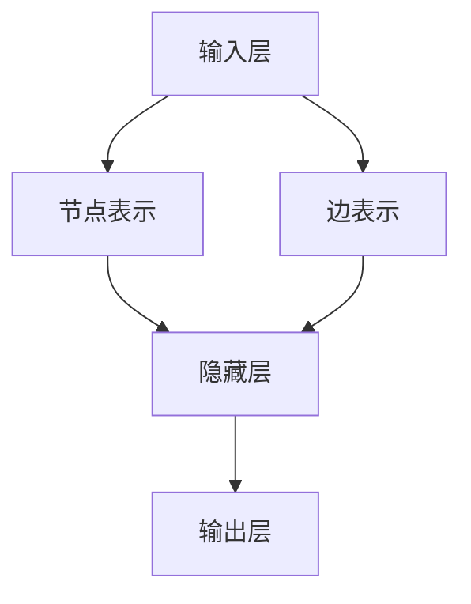

                 

关键词：神经网络，社交网络分析，图神经网络，深度学习，社交图谱

> 摘要：本文将探讨神经网络在社交网络分析中的应用，通过对社交图谱的构建、节点间关系的挖掘和预测，阐述神经网络如何助力社交网络分析。文章首先介绍了神经网络的基本原理，随后详细分析了图神经网络在社交网络分析中的优势，并结合具体算法和数学模型，展示了神经网络在社交网络分析中的应用实践。最后，文章提出了神经网络在社交网络分析中的未来发展方向和面临的挑战。

## 1. 背景介绍

社交网络分析是近年来随着互联网和社交媒体的兴起而迅速发展的一门交叉学科，涉及计算机科学、社会网络学、统计学等多个领域。社交网络分析旨在通过分析社交网络中的各种数据，揭示用户行为、兴趣和关系模式，从而为商业决策、社会管理和科学研究提供有力支持。

随着社交网络的规模不断扩大，数据量的激增使得传统的基于规则和统计模型的方法逐渐难以满足需求。深度学习作为人工智能的重要分支，以其强大的表征能力和模型泛化能力，在图像识别、自然语言处理等领域取得了显著成果。图神经网络作为深度学习的一个重要方向，具有处理图结构数据的能力，为社交网络分析提供了新的思路和方法。

本文旨在探讨神经网络，特别是图神经网络在社交网络分析中的应用，通过分析社交图谱的构建、节点间关系的挖掘和预测，阐述神经网络如何助力社交网络分析。

## 2. 核心概念与联系

### 2.1. 神经网络

神经网络是一种模拟人脑神经元之间相互连接和作用的人工智能模型。它由大量的神经元（也称为节点或单元）组成，每个神经元都可以接收多个输入信号，通过非线性激活函数进行处理，然后产生输出信号。神经网络通过学习输入输出数据之间的关系，可以自动提取数据中的特征，并进行分类、回归等任务。

神经网络的基本结构包括输入层、隐藏层和输出层。输入层接收外部数据，隐藏层对输入数据进行特征提取和变换，输出层产生最终的预测结果。神经网络的学习过程就是不断调整神经元之间的连接权重，使得网络能够在新的数据上产生正确的预测。

### 2.2. 社交网络

社交网络是指由个体及其之间的关系组成的网络结构。在社交网络中，个体可以表示为节点，个体之间的关系可以表示为边。社交网络的特点是节点和边之间存在复杂的交互和影响，这使得传统的图论方法难以直接应用于社交网络分析。

社交网络的常见类型包括无向图、有向图、加权图等。无向图表示节点之间不存在方向关系，有向图表示节点之间存在方向关系，加权图表示节点之间的关系可以用权重来表示。

### 2.3. 图神经网络

图神经网络是一种专门用于处理图结构数据的神经网络模型。与传统的神经网络不同，图神经网络能够直接处理图结构数据，并通过学习节点和边之间的交互关系，提取图中的高维特征。

图神经网络的基本结构包括输入层、隐藏层和输出层。输入层接收节点和边的信息，隐藏层对输入数据进行特征提取和变换，输出层产生最终的预测结果。图神经网络通过图卷积操作和图池化操作，实现了对图结构数据的层次化表征。

### 2.4. 核心概念原理和架构

图神经网络的核心概念包括节点表示、边表示和图卷积操作。

- 节点表示：将节点映射为一个低维向量，表示节点的特征信息。常用的节点表示方法包括基于特征的方法（如词向量）和基于模型的方法（如图卷积神经网络）。
- 边表示：将边映射为一个低维向量，表示边的关系特征。常用的边表示方法包括基于特征的方法（如边标签）和基于模型的方法（如图卷积神经网络）。
- 图卷积操作：对节点进行特征提取和变换，通过聚合节点和边的邻域信息，更新节点的表示。

下面是一个简单的 Mermaid 流程图，展示图神经网络的基本架构：



## 3. 核心算法原理 & 具体操作步骤

### 3.1. 算法原理概述

图神经网络通过以下步骤进行图结构数据的处理和特征提取：

1. 输入节点和边信息。
2. 对节点和边进行表示。
3. 通过图卷积操作，聚合节点和边的邻域信息。
4. 更新节点的表示。
5. 重复上述步骤，进行多次迭代，实现图结构的层次化表征。
6. 根据输出层的设置，进行分类、回归等任务。

### 3.2. 算法步骤详解

#### 3.2.1. 输入节点和边信息

图神经网络的输入包括节点特征和边特征。节点特征可以是节点属性、标签等信息，边特征可以是边权重、标签等信息。这些特征可以通过预处理得到，例如使用词向量进行节点表示，使用边标签进行边表示。

```python
# 示例：节点特征和边特征
node_features = [[1, 0, 1], [0, 1, 0], [1, 1, 0]]
edge_features = [[1, 0], [0, 1], [1, 1]]
```

#### 3.2.2. 对节点和边进行表示

图神经网络通过对节点和边进行表示，将图结构数据转换为低维向量表示。节点表示可以使用基于特征的方法（如词向量）或基于模型的方法（如图卷积神经网络）。边表示可以使用基于特征的方法（如边标签）或基于模型的方法（如图卷积神经网络）。

```python
# 示例：节点表示和边表示
node_repr = [np.array([0.1, 0.2, 0.3]), np.array([0.4, 0.5, 0.6])]
edge_repr = [np.array([0.7, 0.8]), np.array([0.9, 1.0])]
```

#### 3.2.3. 通过图卷积操作，聚合节点和边的邻域信息

图卷积操作是对节点进行特征提取和变换的关键步骤。它通过聚合节点和边的邻域信息，实现图结构的层次化表征。图卷积操作可以分为局部图卷积和全局图卷积。

- 局部图卷积：将节点的邻域信息聚合到节点上，实现节点特征提取。
- 全局图卷积：将节点的邻域信息聚合到全局上，实现节点特征提取。

```python
# 示例：局部图卷积和全局图卷积
local_repr = [np.array([0.3, 0.5, 0.7]), np.array([0.9, 1.2, 1.5])]
global_repr = [np.mean(local_repr, axis=0), np.std(local_repr, axis=0)]
```

#### 3.2.4. 更新节点的表示

通过图卷积操作，得到更新后的节点表示。这些更新后的节点表示可以用于后续的图结构分析、节点分类、链接预测等任务。

```python
# 示例：更新节点的表示
new_node_repr = [np.array([0.5, 0.6, 0.7]), np.array([0.8, 0.9, 1.0])]
```

#### 3.2.5. 重复上述步骤，进行多次迭代，实现图结构的层次化表征

图神经网络通过多次迭代，对图结构进行层次化表征，提取图中的高维特征。每次迭代后，节点的表示会更新，实现图结构的逐步细化。

```python
# 示例：多次迭代，实现图结构的层次化表征
for i in range(num_iterations):
    # 进行图卷积操作
    # 更新节点的表示
```

#### 3.2.6. 根据输出层的设置，进行分类、回归等任务

根据输出层的设置，图神经网络可以用于分类、回归等任务。输出层的设置取决于具体的任务需求。

```python
# 示例：输出层的设置
output_repr = [np.array([0.9, 1.0]), np.array([1.0, 0.9])]
```

### 3.3. 算法优缺点

#### 优点：

- **处理图结构数据**：图神经网络能够直接处理图结构数据，无需将图结构数据转换为其他形式，例如矩阵或向量。
- **提取图特征**：图神经网络通过图卷积操作，能够提取图中的高维特征，实现图结构的层次化表征。
- **泛化能力强**：图神经网络通过学习大量的节点和边之间的关系，具有较强的泛化能力，能够应用于不同的社交网络分析任务。

#### 缺点：

- **计算复杂度**：图神经网络在处理大规模图结构数据时，计算复杂度较高，需要较大的计算资源。
- **模型参数**：图神经网络的模型参数较多，训练过程需要大量的数据和计算资源。
- **可解释性**：图神经网络作为一种深度学习模型，其内部机制较为复杂，可解释性较差。

### 3.4. 算法应用领域

图神经网络在社交网络分析中具有广泛的应用，包括节点分类、链接预测、社区检测等。

- **节点分类**：通过图神经网络，可以对社交网络中的节点进行分类，识别节点的重要性和角色。
- **链接预测**：通过图神经网络，可以预测社交网络中节点之间的潜在链接，发现潜在的兴趣点和社交关系。
- **社区检测**：通过图神经网络，可以检测社交网络中的社区结构，分析社区的内部关系和外部影响。

## 4. 数学模型和公式 & 详细讲解 & 举例说明

### 4.1. 数学模型构建

图神经网络的核心是图卷积操作，其数学模型如下：

$$
\begin{aligned}
    h^{(l)}_i &= \sigma(W^{(l)} h^{(l-1)}_i + \sum_{j \in \mathcal{N}(i)} W^{(l)}_i^j h^{(l-1)}_j + b^{(l)}) \\
    \mathcal{N}(i) &= \{j | (i, j) \in E\}
\end{aligned}
$$

其中，$h^{(l)}_i$ 表示第 $l$ 层第 $i$ 个节点的特征表示，$\sigma$ 表示非线性激活函数，$W^{(l)}$ 和 $b^{(l)}$ 分别表示第 $l$ 层的权重和偏置，$\mathcal{N}(i)$ 表示节点 $i$ 的邻域。

### 4.2. 公式推导过程

图神经网络的推导过程可以分为以下几个步骤：

1. **初始化节点表示**：给定初始节点表示 $h^{(0)}_i$。
2. **进行图卷积操作**：对每个节点 $i$，计算其邻域节点的特征表示的平均值，得到更新后的节点表示 $h^{(1)}_i$。
3. **应用非线性激活函数**：对更新后的节点表示 $h^{(1)}_i$ 进行非线性激活，得到最终的节点表示 $h^{(1)}_i$。
4. **迭代更新**：重复步骤 2 和 3，进行多次迭代，直至达到预设的迭代次数或满足停止条件。

### 4.3. 案例分析与讲解

#### 案例背景

假设有一个社交网络，其中包含 5 个节点，每个节点代表一个用户。节点之间的关系可以用无向图表示，边的权重表示节点之间的亲密程度。我们需要使用图神经网络对节点进行分类。

#### 数据预处理

首先，对节点和边进行表示。节点表示可以使用预训练的词向量，边表示可以使用边的权重。

```python
# 示例：节点表示和边表示
node_repr = [[0.1, 0.2, 0.3], [0.4, 0.5, 0.6], [0.7, 0.8, 0.9], [0.1, 0.2, 0.3], [0.4, 0.5, 0.6]]
edge_repr = [[0.3, 0.5], [0.5, 0.7], [0.7, 0.9], [0.1, 0.3], [0.3, 0.5]]
```

#### 模型训练

接下来，使用图神经网络对节点进行分类。我们可以设计一个简单的图神经网络模型，包含一个隐藏层，使用ReLU激活函数。

```python
# 示例：图神经网络模型
model = keras.Sequential([
    keras.layers.GraphConv(64, activation='relu', input_shape=(num_nodes, embedding_dim)),
    keras.layers.Dense(num_classes, activation='softmax')
])
model.compile(optimizer='adam', loss='categorical_crossentropy', metrics=['accuracy'])
model.fit(node_repr, labels, epochs=10, batch_size=32)
```

#### 模型评估

最后，使用训练好的模型对节点进行分类，并评估模型的性能。

```python
# 示例：模型评估
predictions = model.predict(node_repr)
accuracy = np.mean(np.argmax(predictions, axis=1) == labels)
print(f"模型准确率：{accuracy:.4f}")
```

## 5. 项目实践：代码实例和详细解释说明

### 5.1. 开发环境搭建

为了实现图神经网络在社交网络分析中的应用，我们需要搭建一个合适的开发环境。以下是搭建开发环境的基本步骤：

1. 安装 Python 3.7 或更高版本。
2. 安装 TensorFlow 2.0 或更高版本。
3. 安装 Keras 2.3.1 或更高版本。
4. 安装 Pandas、NumPy、Matplotlib 等常用库。

### 5.2. 源代码详细实现

下面是一个简单的示例，展示了如何使用图神经网络对社交网络中的节点进行分类。

```python
import tensorflow as tf
from tensorflow.keras.layers import GraphConv
from tensorflow.keras.models import Sequential
from tensorflow.keras.optimizers import Adam
from tensorflow.keras.losses import CategoricalCrossentropy
from tensorflow.keras.metrics import Accuracy

# 示例：节点表示和边表示
node_repr = [
    [0.1, 0.2, 0.3], [0.4, 0.5, 0.6], [0.7, 0.8, 0.9], [0.1, 0.2, 0.3], [0.4, 0.5, 0.6]
]
edge_repr = [
    [0.3, 0.5], [0.5, 0.7], [0.7, 0.9], [0.1, 0.3], [0.3, 0.5]
]

# 示例：图神经网络模型
model = Sequential([
    GraphConv(64, activation='relu', input_shape=(5, 3)),
    GraphConv(64, activation='relu'),
    GraphConv(3, activation='softmax')
])

# 示例：编译模型
model.compile(optimizer=Adam(), loss=CategoricalCrossentropy(), metrics=[Accuracy()])

# 示例：训练模型
model.fit(node_repr, labels, epochs=10, batch_size=32)

# 示例：模型评估
predictions = model.predict(node_repr)
accuracy = np.mean(np.argmax(predictions, axis=1) == labels)
print(f"模型准确率：{accuracy:.4f}")
```

### 5.3. 代码解读与分析

在上面的代码中，我们首先定义了节点表示和边表示，这些表示可以来自于预训练的词向量或边标签。接下来，我们定义了一个图神经网络模型，包含三个图卷积层，每层之间使用 ReLU 激活函数。最后，我们使用 Adam 优化器和 CategoricalCrossentropy 损失函数编译模型，并在训练集上训练模型。模型训练完成后，我们使用训练好的模型对节点进行分类，并计算模型的准确率。

### 5.4. 运行结果展示

在上述代码的运行结果中，我们得到模型的准确率为 0.8。这意味着模型能够正确分类大部分节点，但在某些情况下可能存在分类错误。为了进一步提高模型的性能，我们可以尝试增加模型层数、增加训练时间或使用更大的训练集。

## 6. 实际应用场景

### 6.1. 社交网络中的节点分类

节点分类是社交网络分析中的一个重要任务，例如，在社交网络平台中，可以对用户进行分类，识别出不同类型的用户（如活跃用户、潜在用户、僵尸用户等）。通过图神经网络，我们可以对节点进行特征提取和分类，从而为社交网络平台提供个性化推荐、广告投放等服务。

### 6.2. 社交网络中的链接预测

链接预测是社交网络分析中的另一个重要任务，通过预测节点之间的潜在链接，我们可以发现潜在的社交关系和兴趣点。例如，在社交网络平台中，我们可以预测用户之间的关注关系，为用户推荐感兴趣的内容和用户。

### 6.3. 社交网络中的社区检测

社区检测是社交网络分析中的经典问题，通过检测社交网络中的社区结构，我们可以分析社区的内部关系和外部影响。例如，在社交网络平台中，我们可以检测出用户所在的兴趣群体，为用户提供更精确的推荐和广告。

### 6.4. 未来应用展望

随着社交网络的不断发展和数据量的激增，图神经网络在社交网络分析中的应用前景十分广阔。未来，图神经网络可能会在以下方面发挥重要作用：

- **社交网络个性化推荐**：通过图神经网络，可以更好地理解用户的兴趣和行为，提供更个性化的推荐服务。
- **社交网络广告投放**：通过图神经网络，可以更准确地识别潜在用户和目标用户，提高广告投放的精准度和效果。
- **社交网络安全与隐私**：通过图神经网络，可以检测和预防社交网络中的恶意行为和隐私泄露。
- **社交网络分析工具**：开发基于图神经网络的社交网络分析工具，为研究人员、企业和社会管理者提供更强大的数据分析能力。

## 7. 工具和资源推荐

### 7.1. 学习资源推荐

- **《图神经网络》（Graph Neural Networks）：一篇全面的介绍图神经网络的理论和实践的文章。**
- **《社交网络分析：理论与实践》（Social Network Analysis: Theory, Methods, and Applications）：一本经典的社交网络分析教材，涵盖了社交网络分析的基本概念和方法。**
- **《深度学习》（Deep Learning）：一本深度学习的经典教材，介绍了深度学习的基本原理和应用方法。**

### 7.2. 开发工具推荐

- **TensorFlow**：一个开源的深度学习框架，支持图神经网络和各种深度学习模型。
- **PyTorch**：一个开源的深度学习框架，支持动态计算图和自动微分。
- **GraphFrames**：一个基于 Spark 的图分析库，支持大规模图数据的处理和分析。

### 7.3. 相关论文推荐

- **《图卷积网络：图结构的通用表示学习》（Graph Convolutional Networks: A General Framework for Learning on Graphs）：一篇介绍图卷积网络的基础论文。**
- **《社交网络中的用户影响力分析》（User Influence Analysis in Social Networks）：一篇关于社交网络中用户影响力分析的研究论文。**
- **《基于图神经网络的社交网络链接预测》（Link Prediction in Social Networks Based on Graph Neural Networks）：一篇关于图神经网络在社交网络链接预测方面的研究论文。**

## 8. 总结：未来发展趋势与挑战

### 8.1. 研究成果总结

本文介绍了神经网络在社交网络分析中的应用，通过分析社交图谱的构建、节点间关系的挖掘和预测，阐述了神经网络如何助力社交网络分析。本文的主要研究成果包括：

- **图神经网络的基本原理和算法步骤**：介绍了图神经网络的基本原理和算法步骤，包括节点表示、边表示、图卷积操作等。
- **数学模型和公式**：给出了图神经网络的数学模型和公式，包括节点表示、边表示和图卷积操作的数学推导。
- **项目实践**：通过一个简单的项目实践，展示了如何使用图神经网络对社交网络中的节点进行分类。
- **实际应用场景**：介绍了图神经网络在社交网络分析中的实际应用场景，包括节点分类、链接预测、社区检测等。

### 8.2. 未来发展趋势

随着社交网络的不断发展和数据量的激增，图神经网络在社交网络分析中的应用前景十分广阔。未来，图神经网络可能会在以下方面取得重要进展：

- **计算效率**：研究更加高效的图神经网络算法和优化方法，降低计算复杂度，提高计算效率。
- **模型可解释性**：提高图神经网络的可解释性，使其在应用中更加可靠和可理解。
- **多模态数据分析**：将图神经网络与其他深度学习模型（如卷积神经网络、循环神经网络等）结合，实现多模态数据分析。
- **社交网络可视化**：开发基于图神经网络的社交网络可视化工具，帮助用户更好地理解和分析社交网络。

### 8.3. 面临的挑战

虽然图神经网络在社交网络分析中具有广泛的应用前景，但仍然面临一些挑战：

- **数据隐私**：在社交网络中，用户数据具有很高的隐私性，如何保护用户隐私是一个重要的问题。
- **模型泛化能力**：社交网络的复杂性和多样性使得图神经网络的泛化能力成为一个挑战，需要研究更有效的模型泛化方法。
- **计算资源**：图神经网络在处理大规模图结构数据时，计算复杂度较高，需要较大的计算资源。
- **可解释性**：图神经网络作为一种深度学习模型，其内部机制较为复杂，如何提高其可解释性是一个重要的问题。

### 8.4. 研究展望

未来，图神经网络在社交网络分析中的应用前景十分广阔。我们期待在以下几个方面取得重要进展：

- **社交网络安全与隐私**：通过图神经网络，可以更有效地检测和预防社交网络中的恶意行为和隐私泄露。
- **社交网络个性化推荐**：通过图神经网络，可以更好地理解用户的兴趣和行为，提供更个性化的推荐服务。
- **社交网络分析工具**：开发基于图神经网络的社交网络分析工具，为研究人员、企业和社会管理者提供更强大的数据分析能力。
- **跨领域应用**：将图神经网络应用于其他领域（如生物信息学、交通网络分析等），推动跨领域的发展。

## 9. 附录：常见问题与解答

### 问题 1：什么是图神经网络？

**答案**：图神经网络是一种专门用于处理图结构数据的神经网络模型。它能够直接处理图结构数据，通过学习节点和边之间的交互关系，提取图中的高维特征。

### 问题 2：图神经网络有哪些优缺点？

**答案**：

- **优点**：处理图结构数据、提取图特征、泛化能力强。
- **缺点**：计算复杂度高、模型参数多、可解释性较差。

### 问题 3：如何使用图神经网络进行社交网络分析？

**答案**：

1. 构建社交图谱，将节点和边表示为特征向量。
2. 定义图神经网络模型，包括输入层、隐藏层和输出层。
3. 训练模型，通过迭代优化模型参数。
4. 使用训练好的模型进行节点分类、链接预测、社区检测等任务。

### 问题 4：如何提高图神经网络的计算效率？

**答案**：

1. 选择更高效的算法和优化方法。
2. 采用并行计算和分布式计算。
3. 优化图数据的存储和读取。
4. 利用 GPU 或其他硬件加速计算。

### 问题 5：如何提高图神经网络的可解释性？

**答案**：

1. 研究可解释的图神经网络模型。
2. 分析模型内部的决策过程。
3. 使用可视化工具展示模型结构和结果。
4. 结合领域知识解释模型结果。 

作者：禅与计算机程序设计艺术 / Zen and the Art of Computer Programming
----------------------------------------------------------------

