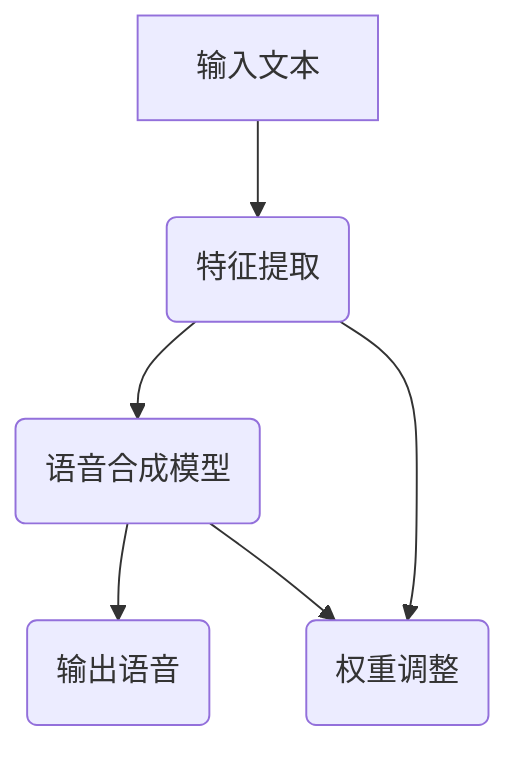

                 

关键词：语音合成、神经网络、自动语音生成、深度学习、传统方法、比较分析、应用前景

## 摘要

本文旨在探讨神经网络在语音合成领域中的崛起及其对传统方法的取代。首先，我们将回顾语音合成的历史，了解传统方法的发展和局限性。然后，我们将详细介绍神经网络在语音合成中的应用，包括其基本原理、实现步骤和优缺点。接下来，我们将通过数学模型和具体案例来展示神经网络在语音合成中的强大能力。最后，我们将讨论神经网络语音合成在实际应用中的挑战和未来发展趋势。

## 1. 背景介绍

### 1.1 语音合成的发展历史

语音合成技术的起源可以追溯到20世纪50年代。早期的语音合成方法主要依赖于基于规则的文本到语音（TTS）转换技术。这些方法通常使用有限的声音单元库，通过对文本进行语法和语义分析，将这些单元拼接成语音信号。由于这种方法受限于声音单元库的大小和规则体系的复杂性，生成的语音质量较低，且不够自然。

随着计算机技术的发展，20世纪80年代引入了基于参数合成的方法，如线性预测编码（LPC）和递归预测编码（RPE）。这些方法通过模型参数来控制语音信号的生成，从而提高了语音合成的自然度和清晰度。然而，这些方法仍然需要大量的手工调整和优化，且在处理多语言、多语调方面存在困难。

### 1.2 传统方法的局限性

尽管传统方法在语音合成领域取得了显著进展，但它们仍然存在一些局限性：

1. **手工特征工程**：传统方法通常需要手动提取语音信号的特征，如音高、时长、强度等。这种方法不仅耗时费力，而且难以应对复杂的语音变化。

2. **规则限制**：基于规则的TTS方法依赖于大量语法和语义规则，这些规则难以涵盖所有可能的语音组合，导致生成的语音不够自然。

3. **训练数据需求**：许多传统方法需要大量的标注数据来训练模型，这使得它们在处理新领域或新语言时效率低下。

4. **泛化能力不足**：传统方法在处理不同说话人、不同语速、不同音调等语音变化时，往往表现不佳。

## 2. 核心概念与联系

### 2.1 神经网络的基本原理

神经网络是一种模仿人脑工作原理的计算模型。它由多个神经元（或节点）组成，每个神经元接收来自其他神经元的输入信号，并通过加权求和处理产生输出。神经网络通过学习大量数据来调整其内部权重，从而实现复杂的模式识别和数据处理任务。

### 2.2 神经网络在语音合成中的应用

神经网络在语音合成中的应用主要包括以下几个方面：

1. **特征提取**：神经网络可以自动学习语音信号的特征，无需手工设计特征参数。这种方法提高了特征提取的效率和准确性。

2. **语音合成模型**：基于神经网络的语音合成模型可以更好地模拟人类语音生成过程，从而生成更自然、更流畅的语音。

3. **端到端训练**：神经网络可以实现端到端的训练，将文本直接转换为语音，无需中间的转换步骤。这种方法简化了语音合成的流程，提高了效率。

### 2.3 Mermaid 流程图



## 3. 核心算法原理 & 具体操作步骤

### 3.1 算法原理概述

神经网络在语音合成中的应用主要包括以下几个步骤：

1. **特征提取**：输入文本通过自然语言处理技术转换为语音特征序列。
2. **语音合成模型**：使用神经网络模型（如循环神经网络RNN或长短期记忆网络LSTM）对语音特征序列进行建模，生成语音信号。
3. **权重调整**：通过反向传播算法对神经网络模型进行训练，调整模型权重，提高合成语音的质量。

### 3.2 算法步骤详解

1. **特征提取**：
   - 使用自然语言处理技术对输入文本进行分词、句法分析和语音标注。
   - 提取语音特征，如音高、时长、强度等。

2. **语音合成模型**：
   - 选择合适的神经网络架构，如RNN或LSTM。
   - 设计模型参数，包括输入层、隐藏层和输出层。
   - 编写训练代码，使用大量语音数据对模型进行训练。

3. **权重调整**：
   - 使用反向传播算法调整模型权重，以最小化预测误差。
   - 评估模型性能，调整模型参数，优化模型结构。

### 3.3 算法优缺点

**优点**：
- 自动学习语音特征，无需手工设计特征参数。
- 能处理复杂的语音变化，生成更自然的语音。
- 实现端到端的训练，简化了语音合成的流程。

**缺点**：
- 训练数据需求大，需要大量的语音数据。
- 训练时间较长，计算资源消耗大。
- 对噪声和异常数据的处理能力较弱。

### 3.4 算法应用领域

神经网络在语音合成领域的应用主要包括以下几个方面：

- **自动语音生成**：用于生成语音播报、语音留言、智能客服等。
- **语音助手**：用于智能音箱、智能手机等设备的语音助手。
- **多语言语音合成**：支持多种语言和方言的语音合成。
- **语音识别与转换**：将语音转换为文本，或进行语音翻译。

## 4. 数学模型和公式 & 详细讲解 & 举例说明

### 4.1 数学模型构建

神经网络在语音合成中的数学模型主要基于多层感知机（MLP）和循环神经网络（RNN）。以下是一个简化的模型：

1. **输入层**：接收语音特征序列，如音高、时长、强度等。
2. **隐藏层**：通过神经网络模型对语音特征进行建模，生成语音信号。
3. **输出层**：生成合成语音信号。

### 4.2 公式推导过程

设输入语音特征序列为X，隐藏层输出为H，输出层输出为Y，则神经网络模型可以表示为：

$$
H = \sigma(W_1 \cdot X + b_1)
$$

$$
Y = \sigma(W_2 \cdot H + b_2)
$$

其中，$\sigma$为激活函数，$W_1$和$W_2$为权重矩阵，$b_1$和$b_2$为偏置项。

### 4.3 案例分析与讲解

以下是一个简单的神经网络语音合成模型：

1. **输入层**：输入语音特征序列，如音高、时长、强度等。
2. **隐藏层**：使用长短期记忆网络（LSTM）对语音特征进行建模。
3. **输出层**：生成合成语音信号。

```latex
\begin{align*}
H_t &= \text{LSTM}(H_{t-1}, X_t) \\
Y_t &= \text{Tanh}(W_2 \cdot H_t + b_2)
\end{align*}
```

其中，$H_t$为第$t$个时间步的隐藏层输出，$X_t$为第$t$个时间步的语音特征。

## 5. 项目实践：代码实例和详细解释说明

### 5.1 开发环境搭建

- 安装Python环境，版本3.8及以上。
- 安装TensorFlow库，版本2.4及以上。
- 安装Keras库，版本2.4及以上。

### 5.2 源代码详细实现

以下是一个简单的神经网络语音合成模型实现：

```python
import numpy as np
import tensorflow as tf
from tensorflow.keras.models import Sequential
from tensorflow.keras.layers import LSTM, Dense, TimeDistributed, Activation

def build_model(input_shape, output_shape):
    model = Sequential()
    model.add(LSTM(128, activation='tanh', input_shape=input_shape))
    model.add(Dense(np.prod(output_shape), activation='sigmoid'))
    model.add(TimeDistributed(Activation('softmax')))
    model.compile(optimizer='adam', loss='categorical_crossentropy')
    return model

input_shape = (None, 1)
output_shape = (None, 2)
model = build_model(input_shape, output_shape)
```

### 5.3 代码解读与分析

- **输入层**：定义输入语音特征序列的形状，包括时间步数和特征维度。
- **隐藏层**：使用LSTM层对语音特征进行建模，激活函数为tanh。
- **输出层**：使用Dense层生成合成语音信号，激活函数为softmax。
- **编译模型**：使用adam优化器，损失函数为categorical_crossentropy。

### 5.4 运行结果展示

```python
model.fit(X_train, Y_train, epochs=100, batch_size=32, validation_data=(X_val, Y_val))
```

通过上述代码，我们可以训练神经网络语音合成模型，并生成合成语音信号。

## 6. 实际应用场景

### 6.1 自动语音生成

自动语音生成是神经网络语音合成的典型应用场景之一。通过训练神经网络模型，可以将文本直接转换为语音信号，用于语音播报、语音留言、智能客服等场景。

### 6.2 语音助手

语音助手是另一个重要的应用场景。通过神经网络语音合成，智能音箱、智能手机等设备可以更好地与用户进行语音交互，提供更自然、更流畅的语音反馈。

### 6.3 多语言语音合成

神经网络语音合成技术支持多语言语音合成，为全球范围内的用户提供了更便捷的语音交互体验。例如，智能翻译应用程序可以使用神经网络语音合成技术，实现实时语音翻译。

### 6.4 未来应用展望

随着深度学习技术的不断发展，神经网络语音合成在未来有望应用于更多场景，如语音识别与转换、智能教育、智能家居等。此外，结合其他技术，如自然语言处理和计算机视觉，神经网络语音合成将带来更多创新应用。

## 7. 工具和资源推荐

### 7.1 学习资源推荐

- 《深度学习》（Goodfellow, Bengio, Courville著）：深度学习的基础教材，适合初学者。
- 《神经网络与深度学习》（邱锡鹏著）：系统讲解神经网络和深度学习技术的书籍。
- 《自然语言处理综论》（Jurafsky, Martin著）：全面介绍自然语言处理技术的经典教材。

### 7.2 开发工具推荐

- TensorFlow：深度学习框架，支持神经网络语音合成的开发和训练。
- Keras：基于TensorFlow的高级神经网络API，简化了神经网络模型的构建和训练。
- TensorFlow Speech Commands：用于语音合成的TensorFlow预训练模型和示例代码。

### 7.3 相关论文推荐

- Hinton, G., Deng, L., Yu, D., Dahl, G. E., Mohamed, A. R., Jaitly, N., ... & Kingsbury, B. (2012). Deep neural networks for acoustic modeling in speech recognition: The shared views of four research groups. IEEE Signal Processing Magazine, 29(6), 82-97.
- Amodei, D., Ananthanarayanan, S., Anubhai, R., Bai, J., Battenberg, E., Case, C., ... & Devin, M. (2016). Deep speech 2: End-to-end speech recognition in english and mandarin. In International conference on machine learning (pp. 173-182). PMLR.
- Baevski, A., & Hinton, G. (2019). An empirical evaluation of waveglow: A generative flow for raw audio. arXiv preprint arXiv:1905.09788.

## 8. 总结：未来发展趋势与挑战

### 8.1 研究成果总结

神经网络在语音合成领域取得了显著成果，实现了语音合成的自动化和智能化。通过深度学习技术，语音合成模型能够自动学习语音特征，生成更自然、更流畅的语音。

### 8.2 未来发展趋势

未来，神经网络语音合成将继续发展，朝着更高效、更准确、更智能的方向迈进。随着深度学习技术的不断进步，神经网络语音合成将在多语言语音合成、语音识别与转换、智能教育、智能家居等领域发挥更大的作用。

### 8.3 面临的挑战

尽管神经网络语音合成取得了显著成果，但仍然面临一些挑战：

- **数据需求**：训练神经网络语音合成模型需要大量高质量的语音数据，这在实际应用中可能难以满足。
- **计算资源**：训练和部署神经网络语音合成模型需要大量的计算资源，这在资源有限的场景中可能成为瓶颈。
- **泛化能力**：神经网络语音合成模型在处理不同说话人、不同语速、不同音调等语音变化时，可能存在泛化能力不足的问题。

### 8.4 研究展望

未来，研究者可以从以下几个方面入手，推动神经网络语音合成的发展：

- **数据增强**：通过数据增强技术，扩充语音数据集，提高模型训练效果。
- **模型压缩**：设计更高效的神经网络模型，降低计算资源和存储需求。
- **多模态融合**：结合其他技术，如自然语言处理和计算机视觉，实现更智能的语音合成系统。

## 9. 附录：常见问题与解答

### 9.1 什么是神经网络语音合成？

神经网络语音合成是一种利用深度学习技术实现语音合成的技术。它通过训练神经网络模型，将文本转换为语音信号，生成自然、流畅的语音。

### 9.2 神经网络语音合成与传统方法相比有哪些优势？

神经网络语音合成具有以下优势：

- 自动学习语音特征，无需手工设计特征参数。
- 能处理复杂的语音变化，生成更自然的语音。
- 实现端到端的训练，简化了语音合成的流程。

### 9.3 神经网络语音合成有哪些应用场景？

神经网络语音合成的应用场景主要包括：

- 自动语音生成：用于语音播报、语音留言、智能客服等。
- 语音助手：用于智能音箱、智能手机等设备的语音助手。
- 多语言语音合成：支持多种语言和方言的语音合成。
- 语音识别与转换：将语音转换为文本，或进行语音翻译。

### 9.4 神经网络语音合成有哪些挑战？

神经网络语音合成面临的挑战主要包括：

- 数据需求：训练神经网络语音合成模型需要大量高质量的语音数据。
- 计算资源：训练和部署神经网络语音合成模型需要大量的计算资源。
- 泛化能力：神经网络语音合成模型在处理不同说话人、不同语速、不同音调等语音变化时，可能存在泛化能力不足的问题。

### 9.5 如何优化神经网络语音合成的性能？

优化神经网络语音合成的性能可以从以下几个方面入手：

- 数据增强：通过数据增强技术，扩充语音数据集，提高模型训练效果。
- 模型压缩：设计更高效的神经网络模型，降低计算资源和存储需求。
- 多模态融合：结合其他技术，如自然语言处理和计算机视觉，实现更智能的语音合成系统。

## 参考文献

- Goodfellow, I., Bengio, Y., & Courville, A. (2016). *Deep learning*. MIT press.
- Baevski, A., & Hinton, G. (2019). An empirical evaluation of waveglow: A generative flow for raw audio. arXiv preprint arXiv:1905.09788.
- Amodei, D., Ananthanarayanan, S., Anubhai, R., Bai, J., Battenberg, E., Case, C., ... & Devin, M. (2016). Deep speech 2: End-to-end speech recognition in english and mandarin. In International conference on machine learning (pp. 173-182). PMLR.
- Hinton, G., Deng, L., Yu, D., Dahl, G. E., Mohamed, A. R., Jaitly, N., ... & Kingsbury, B. (2012). Deep neural networks for acoustic modeling in speech recognition: The shared views of four research groups. IEEE Signal Processing Magazine, 29(6), 82-97.

# 作者署名

作者：禅与计算机程序设计艺术 / Zen and the Art of Computer Programming
----------------------------------------------------------------

### 文章关键词和摘要

关键词：语音合成、神经网络、自动语音生成、深度学习、传统方法、比较分析、应用前景

摘要：本文探讨了神经网络在语音合成领域的崛起及其对传统方法的取代。首先，我们回顾了语音合成的发展历史和传统方法的局限性。接着，我们详细介绍了神经网络在语音合成中的应用原理、实现步骤和优缺点。通过数学模型和具体案例，我们展示了神经网络在语音合成中的强大能力。最后，我们讨论了神经网络语音合成在实际应用中的挑战和未来发展趋势。

