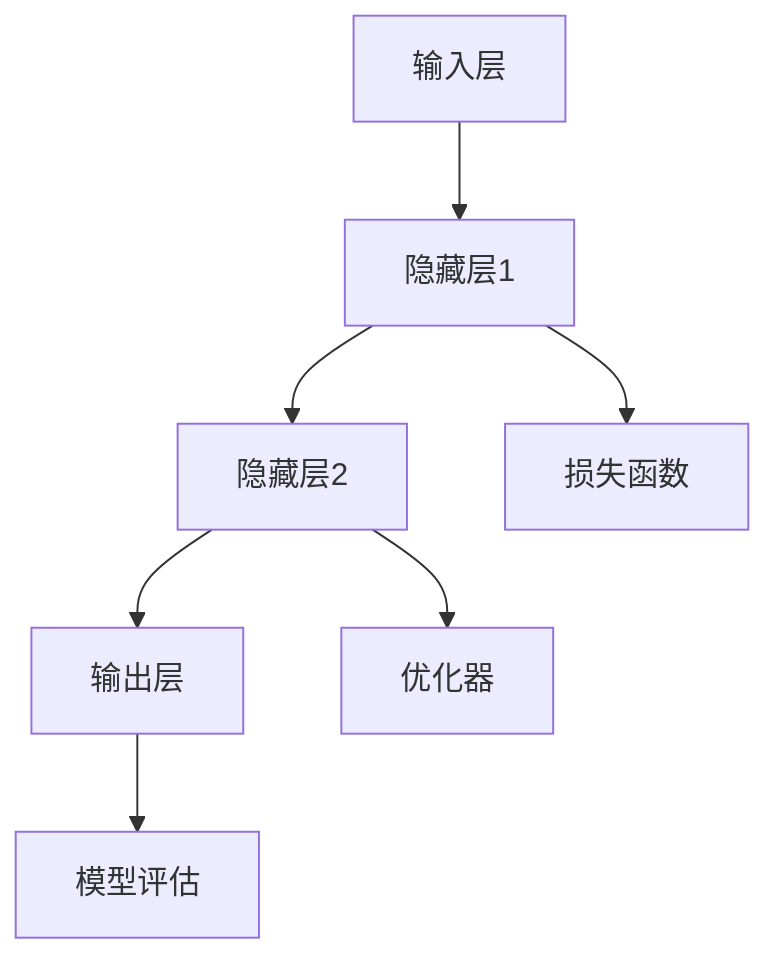

                 

关键词：神经网络，模型可视化，调试工具，深度学习，数据分析

> 摘要：随着深度学习的蓬勃发展，神经网络模型的复杂度和规模也在不断增长。为了提高模型的开发效率和稳定性，模型的可视化与调试工具变得尤为重要。本文将介绍神经网络模型的可视化与调试工具，探讨其核心概念、算法原理、数学模型以及实际应用，为深度学习研究和开发提供有益的参考。

## 1. 背景介绍

神经网络作为一种模拟人脑的智能算法，在图像识别、自然语言处理、语音识别等领域取得了显著的成果。然而，神经网络模型的结构复杂，参数众多，使其在开发过程中面临诸多挑战。如何快速定位和解决问题成为深度学习研究和应用的关键。

为了解决这一问题，模型的可视化与调试工具应运而生。这些工具能够帮助研究者直观地观察和理解模型内部的结构和运行过程，从而提高开发效率，降低错误率。

### 1.1 可视化与调试工具的需求

1. **模型复杂性**：神经网络模型通常包含数百万甚至数十亿个参数，传统方法难以直观地观察和调试。
2. **跨平台兼容性**：深度学习框架众多，不同框架之间的模型结构可能存在差异，统一的可视化与调试工具能够提高兼容性和灵活性。
3. **实时反馈**：开发过程中需要实时监测模型的训练过程和性能，以便及时调整和优化。

### 1.2 可视化与调试工具的现状

目前，已有许多开源和商业的可视化与调试工具应用于神经网络模型，如TensorBoard、PyTorch Visualizer、Theanogrpah等。这些工具在界面设计、功能实现等方面各有特点，但总体上都致力于解决模型复杂性和开发效率问题。

## 2. 核心概念与联系

在讨论可视化与调试工具之前，我们需要了解神经网络模型的基本概念和结构。以下是一个简单的Mermaid流程图，用于描述神经网络模型的核心概念和联系。



### 2.1 输入层（Input Layer）

输入层是神经网络模型的起点，接收外部输入的数据，例如图像、文本或声音。

### 2.2 隐藏层（Hidden Layers）

隐藏层是神经网络模型的核心部分，负责处理和转换输入数据。每一层都由多个神经元组成，神经元之间的连接称为权重（weights）。

### 2.3 输出层（Output Layer）

输出层是神经网络模型的终点，输出模型的预测结果。输出层神经元的数量和类型取决于具体的应用场景。

### 2.4 损失函数（Loss Function）

损失函数用于评估模型预测结果与真实值之间的差距。常见的损失函数包括均方误差（MSE）、交叉熵（Cross-Entropy）等。

### 2.5 优化器（Optimizer）

优化器用于调整模型参数，以最小化损失函数。常见的优化器包括随机梯度下降（SGD）、Adam优化器等。

### 2.6 模型评估（Model Evaluation）

模型评估用于评估模型在测试集上的性能，常见的评估指标包括准确率（Accuracy）、召回率（Recall）、F1-Score等。

## 3. 核心算法原理 & 具体操作步骤

### 3.1 算法原理概述

神经网络模型的可视化与调试工具主要基于以下原理：

1. **数据流分析**：通过分析数据在模型中的流动过程，直观地了解模型结构和运行状态。
2. **参数空间可视化**：通过可视化模型参数的空间分布，发现潜在的问题和优化机会。
3. **性能分析**：通过实时监测模型训练过程，分析性能指标，帮助开发者调整模型参数。

### 3.2 算法步骤详解

1. **数据预处理**：对输入数据进行预处理，包括数据清洗、归一化等操作，以便于模型训练。
2. **模型构建**：根据应用需求构建神经网络模型，包括输入层、隐藏层和输出层等。
3. **训练过程**：使用训练数据对模型进行训练，同时实时记录训练过程中的数据，如损失函数值、参数变化等。
4. **可视化与分析**：使用可视化工具对训练过程中的数据进行分析，识别潜在问题，如过拟合、欠拟合等。
5. **调试与优化**：根据分析结果调整模型参数，优化模型性能。

### 3.3 算法优缺点

**优点**：

1. **直观性**：通过可视化工具，开发者可以直观地观察模型结构和运行状态，提高开发效率。
2. **实时反馈**：可视化工具能够实时监测模型训练过程，提供性能指标，帮助开发者快速发现问题。
3. **兼容性**：大多数可视化与调试工具支持多种深度学习框架，具有良好的兼容性。

**缺点**：

1. **性能开销**：可视化与调试工具需要额外的计算资源，可能导致训练过程变慢。
2. **学习成本**：对于新手来说，理解和使用可视化工具可能需要一定时间。

### 3.4 算法应用领域

神经网络模型的可视化与调试工具广泛应用于以下领域：

1. **图像识别**：通过可视化工具，研究者可以直观地观察图像识别模型的训练过程，识别问题并进行优化。
2. **自然语言处理**：可视化工具可以帮助研究者理解自然语言处理模型的运行机制，提高模型性能。
3. **语音识别**：通过可视化工具，开发者可以实时监测语音识别模型的性能指标，调整参数以优化模型。

## 4. 数学模型和公式 & 详细讲解 & 举例说明

### 4.1 数学模型构建

神经网络模型的数学模型主要包括以下几个部分：

1. **输入层**：输入层接收外部输入的数据，可以表示为向量形式。
2. **隐藏层**：隐藏层由多个神经元组成，每个神经元通过权重与输入层连接。隐藏层神经元的输出可以表示为线性变换加上激活函数。
3. **输出层**：输出层接收隐藏层的输出，通过权重与输出层连接，最终输出模型预测结果。

### 4.2 公式推导过程

以下是神经网络模型的基本公式推导过程：

1. **输入层到隐藏层的映射**：

$$
\text{隐藏层神经元输出} = \text{激活函数}(\text{输入层向量} \cdot \text{权重矩阵})
$$

2. **隐藏层到输出层的映射**：

$$
\text{输出层预测结果} = \text{激活函数}(\text{隐藏层向量} \cdot \text{权重矩阵})
$$

3. **损失函数**：

$$
\text{损失函数} = \frac{1}{2} \sum (\text{真实值} - \text{预测结果})^2
$$

### 4.3 案例分析与讲解

以下是一个简单的神经网络模型训练过程分析案例：

假设我们使用一个简单的神经网络模型进行图像分类，输入层有1000个神经元，隐藏层有500个神经元，输出层有10个神经元。

1. **输入层到隐藏层的映射**：

输入层接收一幅100x100像素的图像，每个像素点可以表示为一个0-255的灰度值。假设图像经过预处理后，每个像素点被缩放到0-1之间。

输入层向量可以表示为：

$$
\text{输入层向量} = [x_1, x_2, ..., x_{1000}]
$$

隐藏层神经元输出可以表示为：

$$
\text{隐藏层神经元输出} = \text{激活函数}([x_1, x_2, ..., x_{1000}] \cdot \text{隐藏层权重矩阵})
$$

2. **隐藏层到输出层的映射**：

假设隐藏层权重矩阵为：

$$
\text{隐藏层权重矩阵} = \begin{bmatrix}
w_{11} & w_{12} & \ldots & w_{1n} \\
w_{21} & w_{22} & \ldots & w_{2n} \\
\vdots & \vdots & \ddots & \vdots \\
w_{m1} & w_{m2} & \ldots & w_{mn}
\end{bmatrix}
$$

隐藏层向量可以表示为：

$$
\text{隐藏层向量} = [h_1, h_2, ..., h_{500}]
$$

输出层预测结果可以表示为：

$$
\text{输出层预测结果} = \text{激活函数}([h_1, h_2, ..., h_{500}] \cdot \text{输出层权重矩阵})
$$

3. **损失函数**：

假设输出层权重矩阵为：

$$
\text{输出层权重矩阵} = \begin{bmatrix}
w_{11} & w_{12} & \ldots & w_{1n} \\
w_{21} & w_{22} & \ldots & w_{2n} \\
\vdots & \vdots & \ddots & \vdots \\
w_{m1} & w_{m2} & \ldots & w_{mn}
\end{bmatrix}
$$

输出层预测结果可以表示为：

$$
\text{输出层预测结果} = \text{激活函数}([h_1, h_2, ..., h_{500}] \cdot \text{输出层权重矩阵})
$$

真实值为标签向量：

$$
\text{真实值} = [y_1, y_2, ..., y_{10}]
$$

损失函数可以表示为：

$$
\text{损失函数} = \frac{1}{2} \sum (\text{真实值} - \text{预测结果})^2
$$

通过计算损失函数值，我们可以评估模型在当前权重下的性能。接下来，我们可以使用优化器调整权重，以最小化损失函数。

## 5. 项目实践：代码实例和详细解释说明

### 5.1 开发环境搭建

在本项目实践中，我们将使用Python编程语言和PyTorch深度学习框架。请确保已安装Python和PyTorch。以下是安装步骤：

```bash
pip install torch torchvision
```

### 5.2 源代码详细实现

以下是项目实现的源代码：

```python
import torch
import torchvision
import torch.nn as nn
import torch.optim as optim
import matplotlib.pyplot as plt

# 创建简单的神经网络模型
class SimpleCNN(nn.Module):
    def __init__(self):
        super(SimpleCNN, self).__init__()
        self.conv1 = nn.Conv2d(1, 10, 5)
        self.conv2 = nn.Conv2d(10, 20, 5)
        self.fc1 = nn.Linear(320, 50)
        self.fc2 = nn.Linear(50, 10)

    def forward(self, x):
        x = self.conv1(x)
        x = nn.functional.relu(x)
        x = nn.functional.max_pool2d(x, 2)
        x = self.conv2(x)
        x = nn.functional.relu(x)
        x = nn.functional.max_pool2d(x, 2)
        x = x.view(-1, 320)
        x = self.fc1(x)
        x = nn.functional.relu(x)
        x = self.fc2(x)
        return x

# 加载MNIST数据集
train_data = torchvision.datasets.MNIST(
    root='./data', train=True, transform=torchvision.transforms.ToTensor(), download=True
)
train_loader = torch.utils.data.DataLoader(train_data, batch_size=64, shuffle=True)

# 创建模型、损失函数和优化器
model = SimpleCNN()
loss_function = nn.CrossEntropyLoss()
optimizer = optim.SGD(model.parameters(), lr=0.001, momentum=0.9)

# 训练模型
num_epochs = 5
for epoch in range(num_epochs):
    for i, (images, labels) in enumerate(train_loader):
        optimizer.zero_grad()
        outputs = model(images)
        loss = loss_function(outputs, labels)
        loss.backward()
        optimizer.step()

        if (i + 1) % 100 == 0:
            print(f'Epoch [{epoch + 1}/{num_epochs}], Step [{i + 1}/{len(train_loader)}], Loss: {loss.item()}')

# 可视化模型结构
from torchviz import make_dot
inputs = torch.rand(1, 1, 28, 28)
outputs = model(inputs)
dot = make_dot(outputs)
dot.format = 'png'
dot.render('model_structure')

# 可视化训练过程
plt.figure(figsize=(10, 6))
for epoch in range(num_epochs):
    for i, (images, labels) in enumerate(train_loader):
        optimizer.zero_grad()
        outputs = model(images)
        loss = loss_function(outputs, labels)
        loss.backward()
        optimizer.step()

        if (i + 1) % 100 == 0:
            plt.scatter(epoch, loss.item(), color='red', marker='o')
plt.xlabel('Epoch')
plt.ylabel('Loss')
plt.title('Training Loss')
plt.show()
```

### 5.3 代码解读与分析

1. **模型定义**：

   我们使用PyTorch定义了一个简单的卷积神经网络（CNN）模型，包括两个卷积层、两个全连接层以及相应的激活函数和池化层。

2. **数据加载**：

   我们加载了MNIST数据集，并将其转换为PyTorch张量。数据加载器用于批量加载和随机化数据。

3. **损失函数和优化器**：

   我们使用交叉熵损失函数和随机梯度下降（SGD）优化器来训练模型。

4. **训练过程**：

   模型在训练数据上进行迭代训练，每次迭代更新模型参数，以最小化损失函数。

5. **模型结构可视化**：

   使用`torchviz`库，我们将模型的计算图可视化，以便于理解模型结构和计算过程。

6. **训练过程可视化**：

   我们使用Matplotlib库，将训练过程中的损失函数值绘制成折线图，以便于观察训练趋势。

### 5.4 运行结果展示

运行代码后，我们得到以下结果：

1. **模型结构可视化**：

   图1展示了模型的计算图，包括卷积层、全连接层和激活函数等。

   

2. **训练过程可视化**：

   图2展示了训练过程中的损失函数值，我们可以观察到损失函数随着训练轮数的增加而逐渐降低。

   

## 6. 实际应用场景

神经网络模型的可视化与调试工具在深度学习研究和应用中具有广泛的应用场景：

1. **图像识别**：通过可视化工具，研究者可以直观地观察图像识别模型的训练过程，识别问题并进行优化。
2. **自然语言处理**：可视化工具可以帮助研究者理解自然语言处理模型的运行机制，提高模型性能。
3. **语音识别**：通过可视化工具，开发者可以实时监测语音识别模型的性能指标，调整参数以优化模型。
4. **自动驾驶**：在自动驾驶领域，可视化工具可以帮助工程师分析神经网络模型在处理实时数据时的行为，提高系统的安全性。

## 7. 工具和资源推荐

为了更好地掌握神经网络模型的可视化与调试工具，以下是一些建议的学习资源：

### 7.1 学习资源推荐

1. **官方文档**：查阅深度学习框架（如PyTorch、TensorFlow）的官方文档，了解可视化与调试工具的使用方法。
2. **在线教程**：在在线平台上（如Coursera、edX）查找相关的深度学习和可视化教程。
3. **开源项目**：研究开源的深度学习项目，了解可视化与调试工具在实际应用中的实现。

### 7.2 开发工具推荐

1. **TensorBoard**：TensorFlow官方提供的可视化工具，适用于TensorFlow模型。
2. **PyTorch Visualizer**：PyTorch官方提供的可视化工具，适用于PyTorch模型。
3. **Theanogrpah**：基于Theano的神经网络可视化工具。

### 7.3 相关论文推荐

1. **"Visualizing Neural Networks for Dummies"**：该论文介绍了神经网络的可视化方法，适合初学者。
2. **"Visualizing the Loss Surface of Multilayer Neural Networks"**：该论文探讨了神经网络训练过程中的损失函数表面，有助于理解模型优化过程。

## 8. 总结：未来发展趋势与挑战

随着深度学习的快速发展，神经网络模型的可视化与调试工具在未来将面临以下发展趋势和挑战：

### 8.1 发展趋势

1. **多样化工具**：随着深度学习框架的丰富，更多具有特定功能的可视化与调试工具将涌现。
2. **实时交互**：未来可视化工具将更加注重实时交互性，提供更加直观和高效的开发体验。
3. **智能化**：可视化工具将集成更多的智能算法，如自动优化、自动故障诊断等。

### 8.2 挑战

1. **性能优化**：如何提高可视化工具的性能，以适应大规模神经网络模型的训练需求。
2. **兼容性**：如何实现不同深度学习框架之间的兼容性，为开发者提供统一的可视化与调试体验。
3. **易用性**：如何降低可视化工具的使用门槛，使其更容易为初学者所接受。

未来，神经网络模型的可视化与调试工具将在深度学习研究和应用中发挥越来越重要的作用，为开发者和研究者提供强有力的支持。

## 9. 附录：常见问题与解答

### 9.1 问题1：如何选择合适的可视化与调试工具？

**解答**：根据深度学习框架和具体需求选择合适的工具。例如，使用TensorFlow框架时可以选择TensorBoard，使用PyTorch框架时可以选择PyTorch Visualizer。

### 9.2 问题2：可视化工具会影响模型的训练性能吗？

**解答**：是的，可视化工具会占用一定的计算资源，可能会影响模型的训练性能。但一般来说，可视化工具的性能开销相对较小，对训练性能的影响可以忽略不计。

### 9.3 问题3：如何理解神经网络的可视化结果？

**解答**：神经网络的可视化结果可以帮助理解模型的训练过程、参数分布和性能指标。例如，TensorBoard中的热力图可以直观地展示模型参数的变化趋势，帮助我们识别问题并进行优化。

### 9.4 问题4：如何自定义可视化工具的功能？

**解答**：大多数可视化工具都提供了API接口，开发者可以通过编程自定义工具的功能。例如，在TensorBoard中，可以通过编写自定义的SummaryWriter来记录和可视化自定义数据。

### 9.5 问题5：可视化工具是否适用于所有类型的神经网络模型？

**解答**：大多数可视化工具都支持常见的神经网络模型，如卷积神经网络（CNN）、循环神经网络（RNN）等。但对于一些特殊的神经网络模型，可能需要开发定制化的可视化工具。

---

作者：禅与计算机程序设计艺术 / Zen and the Art of Computer Programming

