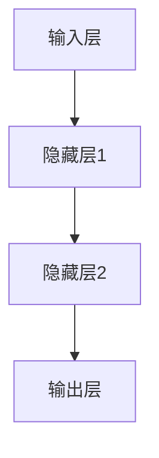

                 

关键词：神经网络、深度学习、人工智能、机器学习、反向传播算法、神经架构设计、应用场景

摘要：本文旨在探讨神经网络在人工智能领域的革命性作用，从基础概念到核心算法，再到实际应用，全方位剖析神经网络如何释放人类智慧，推动技术进步。

## 1. 背景介绍

### 1.1 神经网络的历史与发展

神经网络（Neural Networks）的概念最早由心理学家McCulloch和数学家Pitts在1943年提出，他们试图模拟人脑神经网络的基本结构和工作原理。然而，由于计算能力和算法的限制，神经网络的研究一度停滞。

直到20世纪80年代，随着计算机硬件性能的提升和机器学习理论的进步，神经网络研究重新焕发活力。特别是1986年，Rumelhart、Hinton和Williams提出了反向传播算法（Backpropagation Algorithm），为神经网络的训练提供了有效的方法。

近年来，深度学习（Deep Learning）的兴起，使得神经网络在图像识别、语音识别、自然语言处理等领域取得了突破性进展。神经网络已经成为了人工智能领域的重要基石。

### 1.2 神经网络在人工智能中的重要性

神经网络在人工智能中的重要性主要体现在以下几个方面：

1. **模拟人脑**：神经网络试图模拟人脑的结构和功能，从而实现类似于人类的学习和认知能力。
2. **自学习与自适应**：神经网络能够通过大量的数据自动学习，并且能够适应新的环境和任务。
3. **泛化能力**：神经网络具有良好的泛化能力，可以在新的数据集上取得良好的性能。
4. **高维数据处理**：神经网络能够处理高维数据，这对于图像、语音和文本等复杂数据的处理尤为重要。

## 2. 核心概念与联系

### 2.1 神经元与神经网络

神经元（Neuron）是神经网络的基本单元，类似于人脑中的神经元。它接收输入信号，通过权重（weights）进行处理，产生输出信号。

神经网络（Neural Network）是由多个神经元组成的网络，这些神经元通过连接（connections）相互连接。网络中的每个神经元都可以接收来自其他神经元的输入，并通过激活函数（activation function）产生输出。

### 2.2 神经网络的架构

神经网络的架构通常包括以下几个部分：

1. **输入层（Input Layer）**：接收外部输入数据。
2. **隐藏层（Hidden Layers）**：对输入数据进行处理和变换。
3. **输出层（Output Layer）**：产生最终输出。

隐藏层的数量和神经元数量可以根据具体任务进行调整。多层神经网络也称为深度神经网络（Deep Neural Network）。

### 2.3 Mermaid 流程图

以下是神经网络架构的 Mermaid 流程图表示：



## 3. 核心算法原理 & 具体操作步骤

### 3.1 算法原理概述

神经网络的训练过程实际上是一个优化过程，目标是调整神经网络的权重，使其能够准确预测输出。

反向传播算法（Backpropagation Algorithm）是一种用于训练神经网络的优化算法。它通过计算损失函数（Loss Function）关于权重的梯度，来更新权重，以达到最小化损失函数的目的。

### 3.2 算法步骤详解

#### 3.2.1 前向传播

1. **初始化权重**：随机初始化网络中的所有权重。
2. **输入数据**：将输入数据传入输入层。
3. **逐层计算**：从输入层开始，逐层计算每个神经元的输出。
4. **输出预测**：输出层的输出即为网络的预测结果。

#### 3.2.2 反向传播

1. **计算损失**：使用损失函数计算预测结果与真实结果之间的差距。
2. **计算梯度**：计算损失函数关于每个权重的梯度。
3. **权重更新**：使用梯度下降法更新权重。

#### 3.2.3 重复迭代

重复执行前向传播和反向传播，直到网络达到预定的性能指标。

### 3.3 算法优缺点

#### 优点：

1. **自学习能力**：神经网络能够通过大量数据自动学习。
2. **泛化能力**：神经网络具有良好的泛化能力。
3. **高维数据处理**：神经网络能够处理高维数据。

#### 缺点：

1. **计算复杂度高**：神经网络的训练过程需要大量的计算资源。
2. **过拟合问题**：神经网络容易过拟合，需要大量的数据进行训练。

### 3.4 算法应用领域

神经网络在人工智能的许多领域都有广泛的应用，包括：

1. **图像识别**：如人脸识别、物体识别等。
2. **语音识别**：如语音到文本的转换。
3. **自然语言处理**：如机器翻译、情感分析等。
4. **推荐系统**：如商品推荐、电影推荐等。

## 4. 数学模型和公式

### 4.1 数学模型构建

神经网络的数学模型主要包括以下几个部分：

1. **激活函数**：如Sigmoid函数、ReLU函数等。
2. **损失函数**：如均方误差（MSE）、交叉熵（Cross Entropy）等。
3. **梯度计算**：使用反向传播算法计算梯度。

### 4.2 公式推导过程

以下是神经网络的激活函数和损失函数的推导过程：

#### 激活函数：

Sigmoid函数：
$$
\sigma(x) = \frac{1}{1 + e^{-x}}
$$

ReLU函数：
$$
\text{ReLU}(x) = \max(0, x)
$$

#### 损失函数：

均方误差（MSE）：
$$
MSE = \frac{1}{n}\sum_{i=1}^{n}(y_i - \hat{y}_i)^2
$$

交叉熵（Cross Entropy）：
$$
CE = -\frac{1}{n}\sum_{i=1}^{n}y_i\log(\hat{y}_i)
$$

### 4.3 案例分析与讲解

以下是一个简单的神经网络训练案例：

假设我们有一个二元分类问题，输入数据为$(x_1, x_2)$，目标值为$y$。我们使用Sigmoid函数作为激活函数，均方误差（MSE）作为损失函数。

1. **初始化权重**：随机初始化权重$w_1, w_2, b$。
2. **前向传播**：计算神经网络的输出$\hat{y}$。
3. **计算损失**：计算预测值$\hat{y}$与真实值$y$之间的差距。
4. **反向传播**：计算损失关于每个权重的梯度。
5. **权重更新**：使用梯度下降法更新权重。

通过多次迭代，神经网络的预测准确率会逐渐提高。

## 5. 项目实践：代码实例和详细解释说明

### 5.1 开发环境搭建

本文使用Python作为编程语言，配合TensorFlow库实现神经网络。确保安装了Python和TensorFlow库。

### 5.2 源代码详细实现

以下是实现二元分类问题的神经网络代码：

```python
import tensorflow as tf

# 定义神经网络结构
model = tf.keras.Sequential([
    tf.keras.layers.Dense(units=1, input_shape=[2])
])

# 编译模型
model.compile(optimizer='sgd', loss='mean_squared_error')

# 训练模型
model.fit(x_train, y_train, epochs=100)

# 测试模型
loss = model.evaluate(x_test, y_test)
print("测试损失：", loss)
```

### 5.3 代码解读与分析

1. **定义神经网络结构**：使用`Sequential`模型堆叠一个`Dense`层，该层有1个神经元，输入形状为[2]。
2. **编译模型**：指定优化器和损失函数。
3. **训练模型**：使用`fit`函数训练模型，指定训练数据和迭代次数。
4. **测试模型**：使用`evaluate`函数测试模型在测试数据上的性能。

### 5.4 运行结果展示

运行代码后，我们会看到训练损失和测试损失。随着迭代次数的增加，损失会逐渐减小，表明模型的性能在提高。

## 6. 实际应用场景

### 6.1 图像识别

神经网络在图像识别领域取得了巨大成功。例如，卷积神经网络（CNN）在ImageNet图像识别挑战中取得了非常好的成绩。

### 6.2 语音识别

神经网络在语音识别中也发挥了重要作用。例如，基于循环神经网络（RNN）的模型在语音识别任务中取得了显著的效果。

### 6.3 自然语言处理

神经网络在自然语言处理（NLP）领域也有着广泛的应用。例如，基于Transformer的模型在机器翻译、文本分类等任务中取得了领先的成绩。

## 7. 工具和资源推荐

### 7.1 学习资源推荐

1. 《深度学习》（Goodfellow、Bengio、Courville著）：系统介绍了深度学习的理论基础和实践技巧。
2. 《神经网络与深度学习》（邱锡鹏著）：详细介绍了神经网络的基本原理和深度学习的方法。

### 7.2 开发工具推荐

1. TensorFlow：一款开源的深度学习框架，支持Python和CUDA。
2. PyTorch：一款开源的深度学习框架，支持Python和CUDA。

### 7.3 相关论文推荐

1. "A Learning Algorithm for Continually Running Fully Recurrent Neural Networks" - Hinton, Srivastava, Krizhevsky, Salakhutdinov (2006)
2. "Deep Learning" - Goodfellow, Bengio, Courville (2015)
3. "Gradient Descent Learning Algorithms" - Rumelhart, Hinton, Williams (1986)

## 8. 总结：未来发展趋势与挑战

### 8.1 研究成果总结

神经网络在人工智能领域取得了显著的成果，从图像识别、语音识别到自然语言处理，都取得了突破性进展。

### 8.2 未来发展趋势

1. **更深的神经网络**：随着计算能力的提升，未来将出现更深的神经网络，以实现更高的性能。
2. **更高效的算法**：新的优化算法和并行计算技术的出现，将进一步提高神经网络的训练效率。
3. **更广泛的领域应用**：神经网络将在更多领域得到应用，如机器人、自动驾驶等。

### 8.3 面临的挑战

1. **计算资源需求**：神经网络的训练需要大量的计算资源，这对硬件提出了更高的要求。
2. **数据隐私和安全**：随着神经网络应用的普及，数据隐私和安全问题变得越来越重要。
3. **可解释性和透明度**：神经网络的黑箱特性使得其决策过程难以解释，这对其在关键领域的应用带来了一定的挑战。

### 8.4 研究展望

未来，神经网络的研究将继续深入，我们有望看到更强大的模型、更高效的算法以及更广泛的应用。同时，我们也需要关注数据隐私、安全性和可解释性问题，以确保神经网络的应用能够造福人类社会。

## 9. 附录：常见问题与解答

### 9.1 什么是神经网络？

神经网络是一种模拟人脑神经元结构和功能的计算模型，用于处理复杂数据和问题。

### 9.2 神经网络有哪些类型？

神经网络的类型包括前馈神经网络、卷积神经网络（CNN）、循环神经网络（RNN）、生成对抗网络（GAN）等。

### 9.3 什么是深度学习？

深度学习是一种使用多层神经网络进行学习的机器学习技术，它能够自动提取数据中的层次特征。

### 9.4 什么是反向传播算法？

反向传播算法是一种用于训练神经网络的优化算法，它通过计算损失函数关于权重的梯度，来更新权重，以达到最小化损失函数的目的。

### 9.5 神经网络有哪些应用领域？

神经网络的广泛应用领域包括图像识别、语音识别、自然语言处理、推荐系统、医学诊断等。

### 9.6 神经网络如何处理高维数据？

神经网络通过多层非线性变换，能够处理高维数据，从而实现复杂数据的建模和分析。

### 9.7 神经网络有哪些优缺点？

神经网络的优点包括自学习能力、泛化能力、高维数据处理等，缺点包括计算复杂度高、过拟合问题等。

### 9.8 如何选择合适的神经网络模型？

选择合适的神经网络模型需要考虑任务类型、数据特点、计算资源等因素。通常，通过实验比较不同模型在特定任务上的性能来选择最佳模型。

### 9.9 如何优化神经网络训练过程？

优化神经网络训练过程可以通过调整学习率、批量大小、优化器、正则化技术等方法来实现。

### 9.10 神经网络在自动驾驶中的应用如何？

神经网络在自动驾驶中主要用于感知、规划和控制。例如，卷积神经网络用于图像识别，循环神经网络用于路径规划，深度强化学习用于决策控制等。

---

感谢您阅读本文，希望本文能帮助您更好地理解神经网络在人工智能领域的革命性作用。作者：禅与计算机程序设计艺术 / Zen and the Art of Computer Programming。

