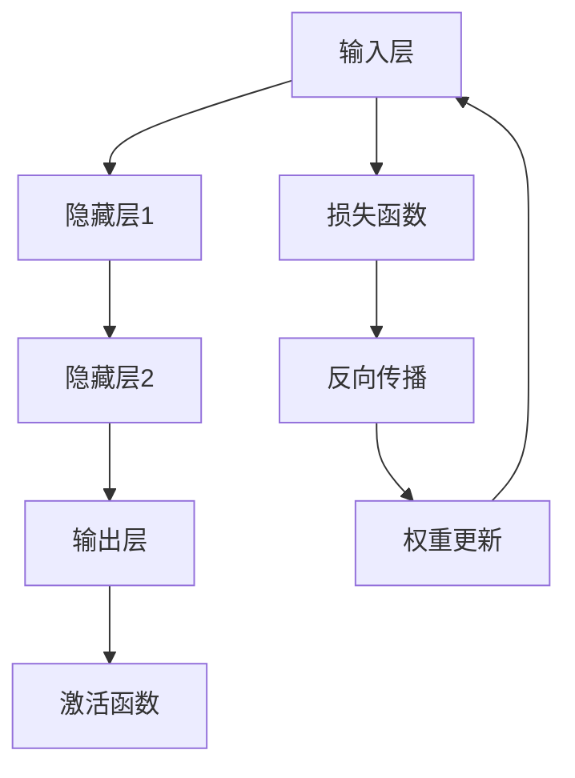

                 

关键词：神经网络，深度学习，社会进步，人工智能，机器学习，算法，应用场景，未来展望

> 摘要：本文将探讨神经网络作为一项革命性的技术，如何通过推动人工智能的发展，对社会进步产生深远影响。我们将深入分析神经网络的原理、核心算法、数学模型，并通过实际应用案例和代码实例，展示其在各领域的广泛应用。同时，还将展望神经网络技术的未来发展，以及可能面临的挑战。

## 1. 背景介绍

神经网络作为一种模拟人脑神经元工作的计算模型，起源于1940年代，然而直到近年来随着计算能力的提升和海量数据的积累，神经网络才真正展现出其巨大的潜力和价值。在过去的几十年里，神经网络经历了多个发展阶段，从最初的感知机、反向传播算法，到深度学习时代的卷积神经网络（CNN）和循环神经网络（RNN），再到当前的多模态学习和生成对抗网络（GAN），神经网络的应用范围不断扩大，已经渗透到图像处理、语音识别、自然语言处理、推荐系统等多个领域。

随着人工智能技术的快速发展，神经网络不仅在学术界引起了广泛关注，也在工业界和商业界得到了广泛应用。无论是自动驾驶汽车、智能家居，还是医疗诊断、金融风控，神经网络都发挥了关键作用。神经网络的出现，不仅为传统行业带来了前所未有的变革，也为新兴产业的发展提供了强大动力。

本文将从以下几个方面展开讨论：

- **核心概念与联系**：介绍神经网络的基本概念和架构，并使用Mermaid流程图展示其原理。
- **核心算法原理与具体操作步骤**：详细讲解神经网络的训练过程、优化方法和应用领域。
- **数学模型和公式**：分析神经网络的数学基础，包括损失函数、激活函数和优化算法。
- **项目实践**：通过代码实例展示神经网络的应用，并解读其实现细节。
- **实际应用场景**：探讨神经网络在各个领域的应用案例，如图像识别、自然语言处理等。
- **未来应用展望**：展望神经网络技术的未来发展趋势和应用前景。
- **工具和资源推荐**：推荐学习资源、开发工具和最新相关论文。
- **总结与展望**：总结研究成果，探讨未来发展挑战和研究方向。

## 2. 核心概念与联系

### 2.1 神经网络的基本概念

神经网络是由大量简单计算单元（神经元）互联组成的复杂网络，每个神经元都可以接收多个输入，通过权重进行调整，最终产生输出。神经元的激活函数决定了其是否会被激活，从而影响整个网络的输出。

神经网络可以分为前向传播（forward propagation）和反向传播（backpropagation）两个主要阶段。在前向传播阶段，输入数据经过神经网络逐层传递，每一层神经元根据其权重和输入计算激活值，最终产生输出。在反向传播阶段，根据输出和期望输出的差异，通过网络反向计算梯度，从而调整各层神经元的权重。

### 2.2 神经网络的架构

神经网络的基本架构可以分为输入层、隐藏层和输出层。输入层接收外部数据，隐藏层负责特征提取和转换，输出层产生最终输出。一个神经网络可能包含一个或多个隐藏层，隐藏层的数量和大小对网络性能有重要影响。

#### 2.2.1 输入层（Input Layer）

输入层是神经网络的起点，负责接收外部输入数据。输入数据可以是图像、文本、声音等不同类型的数据。在图像识别任务中，输入层接收图像像素值；在文本分类任务中，输入层接收词嵌入向量。

#### 2.2.2 隐藏层（Hidden Layers）

隐藏层是神经网络的中间部分，负责从输入数据中提取有用的特征，并将其传递到下一层。隐藏层中的每个神经元通常都通过权重连接到输入层和输出层。隐藏层可以是一个或多个，层数越多，网络的表达能力越强，但训练时间也会相应增加。

#### 2.2.3 输出层（Output Layer）

输出层是神经网络的终点，负责生成最终输出。输出可以是分类结果、回归值、概率分布等。输出层的神经元数量和类型取决于具体任务。

### 2.3 神经网络的激活函数

激活函数是神经网络中的一个关键组成部分，它决定了神经元的激活值是否超过某个阈值，从而影响网络的输出。常见的激活函数包括：

- ** sigmoid 函数**：将输入映射到（0,1）区间，函数值随着输入增加而缓慢上升。
- **ReLU 函数**：当输入大于0时，输出等于输入，否则输出为0，具有简单的非线性特性。
- **Tanh 函数**：将输入映射到（-1,1）区间，类似于 sigmoid 函数，但输出范围更广。

### 2.4 神经网络的优化算法

神经网络的训练过程实质上是优化权重的过程，目的是使网络输出与期望输出尽可能接近。常见的优化算法包括：

- **随机梯度下降（SGD）**：通过随机选择一部分样本计算梯度，更新权重。
- **Adam优化器**：结合了 SGD 和动量优化器的优点，具有自适应的学习率。
- **RMSprop**：使用历史梯度平方的平均值来动态调整学习率。

### 2.5 神经网络的 Mermaid 流程图



在这个流程图中，输入层接收外部输入数据，经过隐藏层处理后，通过输出层产生最终输出。激活函数和损失函数分别用于确定神经元是否被激活以及网络输出与期望输出的差异。反向传播和权重更新则用于根据损失函数计算梯度，并调整各层神经元的权重。

通过上述分析，我们可以看到神经网络作为一种复杂但强大的计算模型，其基本概念和架构紧密相连，共同构成了神经网络的核心。在下一节中，我们将深入探讨神经网络的核心算法原理和具体操作步骤。

### 3. 核心算法原理与具体操作步骤

神经网络之所以能够在众多领域中取得突破性成果，主要得益于其核心算法原理和具体操作步骤。本节将详细讲解神经网络的训练过程、优化方法和应用领域。

#### 3.1 算法原理概述

神经网络的训练过程主要包括两个阶段：前向传播和反向传播。

**前向传播**是指将输入数据逐层传递到神经网络，通过计算每个神经元的激活值，最终得到输出。具体步骤如下：

1. **初始化权重和偏置**：神经网络在训练前需要随机初始化权重和偏置，以便开始学习。
2. **前向传播**：输入数据经过输入层，依次传递到隐藏层和输出层，每个神经元的激活值通过输入和权重计算得出。
3. **输出结果**：输出层的最终输出与期望输出进行比较。

**反向传播**是指根据输出结果和期望输出之间的差异，通过反向计算每个神经元的梯度，更新权重和偏置，以减少输出误差。具体步骤如下：

1. **计算损失函数**：输出误差通过损失函数（如均方误差、交叉熵等）计算。
2. **反向传播**：从输出层开始，逐层计算每个神经元的梯度，将梯度传递回前一层。
3. **权重更新**：根据梯度更新各层神经元的权重和偏置，以减少损失函数的值。

#### 3.2 算法步骤详解

**3.2.1 初始化权重和偏置**

神经网络的训练过程从初始化权重和偏置开始。初始化的好坏对网络性能有很大影响。常见的初始化方法包括：

- **随机初始化**：将权重和偏置初始化为接近于0的随机数。
- **高斯分布初始化**：将权重和偏置初始化为从高斯分布中抽取的数值。

**3.2.2 前向传播**

前向传播过程中，输入数据首先进入输入层，然后逐层传递到隐藏层和输出层。每个神经元的激活值可以通过以下公式计算：

\[ z = \sum_{j} w_{ij} x_j + b_i \]

\[ a_i = \sigma(z) \]

其中，\( w_{ij} \) 为输入层到隐藏层第 \( i \) 个神经元的权重，\( x_j \) 为输入层第 \( j \) 个神经元的值，\( b_i \) 为隐藏层第 \( i \) 个神经元的偏置，\( \sigma \) 为激活函数。

对于输出层，激活函数通常为线性函数（如回归任务）或非线性函数（如分类任务）。

**3.2.3 计算损失函数**

损失函数用于衡量网络输出与期望输出之间的误差。常见的损失函数包括：

- **均方误差（MSE）**：用于回归任务，计算输出值与真实值之间的均方误差。

\[ MSE = \frac{1}{m} \sum_{i=1}^{m} (y_i - \hat{y}_i)^2 \]

- **交叉熵（CE）**：用于分类任务，计算输出概率分布与真实分布之间的交叉熵。

\[ CE = -\frac{1}{m} \sum_{i=1}^{m} y_i \log(\hat{y}_i) \]

其中，\( y_i \) 为真实标签，\( \hat{y}_i \) 为输出层的预测概率。

**3.2.4 反向传播**

反向传播是神经网络训练的核心步骤，通过计算梯度并更新权重和偏置，以减少损失函数的值。反向传播包括以下几个步骤：

1. **计算输出层梯度**：

\[ \delta_{j}^{L} = a_j (1 - a_j) (\hat{y}_j - y_j) \]

其中，\( a_j \) 为输出层第 \( j \) 个神经元的激活值，\( \hat{y}_j \) 为输出层的预测概率，\( y_j \) 为真实标签。

2. **计算隐藏层梯度**：

\[ \delta_{i}^{l} = a_i (1 - a_i) (\sum_{j} w_{ji} \delta_{j}^{l+1}) \]

其中，\( a_i \) 为隐藏层第 \( i \) 个神经元的激活值，\( w_{ji} \) 为输出层第 \( j \) 个神经元到隐藏层第 \( i \) 个神经元的权重，\( \delta_{j}^{l+1} \) 为下一层的梯度。

3. **更新权重和偏置**：

\[ w_{ij} \leftarrow w_{ij} - \alpha \frac{\partial J}{\partial w_{ij}} \]
\[ b_i \leftarrow b_i - \alpha \frac{\partial J}{\partial b_i} \]

其中，\( \alpha \) 为学习率，\( J \) 为损失函数。

**3.3 算法优缺点**

**优点**：

- **强大的非线性表达能力**：神经网络通过多层非线性变换，可以学习到复杂的特征和模式。
- **自适应的学习能力**：神经网络可以根据不同任务和数据自动调整结构和参数，具有很强的适应性。
- **广泛的应用领域**：神经网络在图像处理、语音识别、自然语言处理等多个领域都有广泛应用。

**缺点**：

- **训练时间较长**：神经网络需要大量数据和时间进行训练，特别是深度神经网络。
- **参数调整复杂**：神经网络参数众多，需要精心选择和学习率等超参数。
- **过拟合风险**：神经网络可能会在训练数据上表现良好，但在测试数据上过拟合。

#### 3.4 算法应用领域

神经网络的应用领域非常广泛，以下列举几个主要的应用场景：

- **图像识别**：通过卷积神经网络（CNN）可以实现对图像的分类、目标检测和图像生成。
- **语音识别**：通过循环神经网络（RNN）和其变体，可以实现语音识别和语音合成。
- **自然语言处理**：通过长短期记忆网络（LSTM）和Transformer模型，可以实现文本分类、机器翻译和情感分析。
- **推荐系统**：通过基于神经网络的协同过滤算法，可以实现个性化推荐和广告投放。

在下一节中，我们将分析神经网络的数学模型和公式，进一步理解其背后的数学原理。

### 4. 数学模型和公式

神经网络的强大在于其能够通过多层非线性变换来学习复杂的数据特征。本节将深入探讨神经网络的数学模型和公式，包括损失函数、激活函数和优化算法，并通过具体案例进行分析和讲解。

#### 4.1 数学模型构建

神经网络的数学模型可以形式化地表示为：

\[ \hat{y} = f_{\theta}(\textbf{x}) \]

其中，\( \hat{y} \) 是网络输出，\( \textbf{x} \) 是输入数据，\( f_{\theta} \) 是神经网络模型，\( \theta \) 表示模型参数（包括权重 \( w \) 和偏置 \( b \)）。

神经网络中的每个神经元都可以看作是一个线性函数，通过权重 \( w \) 和偏置 \( b \) 与输入 \( \textbf{x} \) 相乘，并加上偏置，然后通过激活函数 \( \sigma \) 进行非线性变换。假设有一个单层神经网络，其中每个神经元都有一个线性部分和一个非线性激活函数：

\[ z_i = \sum_{j} w_{ij} x_j + b_i \]
\[ a_i = \sigma(z_i) \]

其中，\( z_i \) 是线性部分的输出，\( a_i \) 是神经元的激活值，\( \sigma \) 是激活函数。

对于多层神经网络，每个隐藏层的输出可以看作是下一层的输入：

\[ z^{l}_{ij} = \sum_{k} w^{l}_{ik} a^{l-1}_{kj} + b^{l}_{ij} \]
\[ a^{l}_{ij} = \sigma(z^{l}_{ij}) \]

其中，\( l \) 表示当前层的层数，\( w^{l}_{ik} \) 和 \( b^{l}_{ij} \) 分别为当前层神经元到下一层神经元的权重和偏置。

最终，输出层的输出为：

\[ z^{L}_{j} = \sum_{k} w^{L}_{kj} a^{L-1}_{kj} + b^{L}_{j} \]
\[ \hat{y}_j = \sigma(z^{L}_{j}) \]

#### 4.2 公式推导过程

神经网络的训练过程本质上是一个优化问题，目标是调整参数 \( \theta \)，使得网络输出 \( \hat{y} \) 最接近真实标签 \( y \)。这一过程通常通过最小化损失函数 \( J(\theta) \) 来实现：

\[ J(\theta) = \frac{1}{m} \sum_{i=1}^{m} \mathcal{L}(y_i, \hat{y}_i) \]

其中，\( m \) 是训练样本数量，\( \mathcal{L} \) 是损失函数，常用的损失函数包括均方误差（MSE）和交叉熵（CE）。

**均方误差（MSE）：**

\[ \mathcal{L}_{MSE} = \frac{1}{2} (y - \hat{y})^2 \]

**交叉熵（CE）：**

\[ \mathcal{L}_{CE} = - \sum_{i} y_i \log(\hat{y}_i) \]

**4.3 案例分析与讲解**

为了更好地理解神经网络的数学模型，我们通过一个简单的例子来讲解。

假设我们有一个二元分类问题，输入是一个二维向量 \( \textbf{x} = [x_1, x_2] \)，输出是一个概率 \( \hat{y} \)，表示属于正类的概率。我们可以构建一个单层神经网络，其中每个神经元都通过一个线性变换和一个 sigmoid 激活函数：

\[ z_1 = x_1 \cdot w_1 + x_2 \cdot w_2 + b_1 \]
\[ z_2 = x_1 \cdot w_3 + x_2 \cdot w_4 + b_2 \]
\[ \hat{y} = \frac{1}{1 + e^{-(z_1 + z_2)}} \]

其中，\( w_1, w_2, w_3, w_4 \) 和 \( b_1, b_2 \) 是网络参数。

**前向传播：**

给定一个输入样本 \( \textbf{x} = [1, 2] \)，我们可以计算前向传播的中间结果：

\[ z_1 = 1 \cdot w_1 + 2 \cdot w_2 + b_1 \]
\[ z_2 = 1 \cdot w_3 + 2 \cdot w_4 + b_2 \]

假设 \( z_1 = 2 \)，\( z_2 = 3 \)，那么：

\[ \hat{y} = \frac{1}{1 + e^{-5}} \approx 0.993 \]

这意味着输入样本属于正类的概率非常高。

**反向传播：**

为了计算损失函数的梯度，我们需要进行反向传播。以均方误差为例，损失函数为：

\[ J(\theta) = \frac{1}{2} (y - \hat{y})^2 \]

给定真实标签 \( y = 1 \)，我们可以计算损失函数的梯度：

\[ \frac{\partial J}{\partial w_1} = (y - \hat{y}) \cdot \frac{\partial \hat{y}}{\partial z_1} \cdot \frac{\partial z_1}{\partial w_1} \]
\[ \frac{\partial J}{\partial w_2} = (y - \hat{y}) \cdot \frac{\partial \hat{y}}{\partial z_1} \cdot \frac{\partial z_1}{\partial w_2} \]
\[ \frac{\partial J}{\partial b_1} = (y - \hat{y}) \cdot \frac{\partial \hat{y}}{\partial z_1} \]
\[ \frac{\partial J}{\partial w_3} = (y - \hat{y}) \cdot \frac{\partial \hat{y}}{\partial z_2} \cdot \frac{\partial z_2}{\partial w_3} \]
\[ \frac{\partial J}{\partial w_4} = (y - \hat{y}) \cdot \frac{\partial \hat{y}}{\partial z_2} \cdot \frac{\partial z_2}{\partial w_4} \]
\[ \frac{\partial J}{\partial b_2} = (y - \hat{y}) \cdot \frac{\partial \hat{y}}{\partial z_2} \]

通过计算，我们可以得到每个参数的梯度。然后，通过梯度下降算法更新参数：

\[ w_1 \leftarrow w_1 - \alpha \cdot \frac{\partial J}{\partial w_1} \]
\[ w_2 \leftarrow w_2 - \alpha \cdot \frac{\partial J}{\partial w_2} \]
\[ b_1 \leftarrow b_1 - \alpha \cdot \frac{\partial J}{\partial b_1} \]
\[ w_3 \leftarrow w_3 - \alpha \cdot \frac{\partial J}{\partial w_3} \]
\[ w_4 \leftarrow w_4 - \alpha \cdot \frac{\partial J}{\partial w_4} \]
\[ b_2 \leftarrow b_2 - \alpha \cdot \frac{\partial J}{\partial b_2} \]

其中，\( \alpha \) 是学习率。

通过多次迭代，我们可以使损失函数 \( J(\theta) \) 逐渐减小，从而得到更好的模型参数。

通过这个案例，我们可以看到神经网络的数学模型和公式是如何帮助我们在实际中训练和优化神经网络的。在下一节中，我们将通过代码实例展示神经网络的应用，并详细解读其实现细节。

### 5. 项目实践：代码实例和详细解释说明

为了更直观地理解神经网络的构建和训练过程，我们将通过一个简单的二元分类问题来展示神经网络的实现。我们将使用Python和PyTorch框架来编写代码，并对关键步骤进行详细解释。

#### 5.1 开发环境搭建

在开始编写代码之前，我们需要搭建开发环境。以下是搭建Python开发环境的基本步骤：

1. **安装Python**：确保安装了Python 3.x版本。
2. **安装PyTorch**：在终端中运行以下命令安装PyTorch：

\[ pip install torch torchvision \]

3. **验证安装**：运行以下代码验证PyTorch是否成功安装：

```python
import torch
import torchvision

print(torch.__version__)
print(torchvision.__version__)
```

#### 5.2 源代码详细实现

以下是实现简单二元分类问题的神经网络代码：

```python
import torch
import torch.nn as nn
import torch.optim as optim

# 定义神经网络结构
class SimpleNet(nn.Module):
    def __init__(self):
        super(SimpleNet, self).__init__()
        self.fc1 = nn.Linear(2, 10)  # 输入层到隐藏层1
        self.fc2 = nn.Linear(10, 1)  # 隐藏层1到输出层

    def forward(self, x):
        x = torch.relu(self.fc1(x))
        x = torch.sigmoid(self.fc2(x))
        return x

# 实例化神经网络
model = SimpleNet()

# 定义损失函数和优化器
criterion = nn.BCELoss()
optimizer = optim.SGD(model.parameters(), lr=0.01)

# 生成模拟数据
x_train = torch.tensor([[1.0, 2.0], [2.0, 3.0], [3.0, 4.0], [4.0, 5.0]])
y_train = torch.tensor([[1.0], [0.0], [1.0], [0.0]])

# 训练神经网络
num_epochs = 1000
for epoch in range(num_epochs):
    optimizer.zero_grad()
    outputs = model(x_train)
    loss = criterion(outputs, y_train)
    loss.backward()
    optimizer.step()
    if epoch % 100 == 0:
        print(f'Epoch [{epoch+1}/{num_epochs}], Loss: {loss.item():.4f}')

# 测试神经网络
x_test = torch.tensor([[2.0, 3.0]])
y_test = torch.tensor([[1.0]])
outputs = model(x_test)
predicted = torch.round(outputs)
print(f'Predicted: {predicted.item():.4f}, Expected: {y_test.item():.4f}')
```

#### 5.3 代码解读与分析

上述代码实现了一个简单的二元分类神经网络，以下是关键步骤的详细解读：

**5.3.1 定义神经网络结构**

我们首先定义了一个名为 `SimpleNet` 的神经网络类，继承自 `nn.Module`。该网络包含一个输入层、一个隐藏层和一个输出层：

- **输入层**：使用 `nn.Linear` 定义，将输入数据的两个特征映射到隐藏层，其中输入维度为2，输出维度为10。
- **隐藏层**：使用 ReLU 激活函数，增加网络的非线性能力。
- **输出层**：使用 sigmoid 激活函数，将隐藏层的输出映射到一个介于0和1之间的概率值，表示样本属于正类的概率。

**5.3.2 定义损失函数和优化器**

- **损失函数**：我们使用二进制交叉熵损失函数 `nn.BCELoss`，适用于二元分类问题。
- **优化器**：我们使用随机梯度下降（SGD）优化器 `optim.SGD`，并设置学习率为0.01。

**5.3.3 生成模拟数据**

为了验证神经网络的效果，我们生成了一组模拟数据。`x_train` 包含四个样本，每个样本有两个特征。`y_train` 包含对应的真实标签，其中1表示正类，0表示负类。

**5.3.4 训练神经网络**

我们使用一个循环迭代神经网络进行训练。在每次迭代中，我们首先将优化器设置为梯度下降模式，然后进行前向传播计算输出，接着计算损失，然后进行反向传播计算梯度，最后更新模型参数。

我们设置了1000个迭代周期（epoch），并在每个epoch的末尾打印当前损失值，以监控训练过程。

**5.3.5 测试神经网络**

在训练完成后，我们使用一个新样本进行测试。`x_test` 包含一个样本，其特征为 `[2.0, 3.0]`。通过调用 `model(x_test)` 进行预测，我们得到输出概率，并使用 `torch.round()` 函数将其四舍五入为0或1，表示预测的类别。

最后，我们将预测结果与实际标签进行比较，并打印输出。

通过这个简单的代码实例，我们可以看到神经网络的基本构建和训练过程。在实际应用中，神经网络的结构和数据会更加复杂，但基本原理是一致的。在下一节中，我们将探讨神经网络在实际应用场景中的具体案例。

### 6. 实际应用场景

神经网络技术已经在众多领域取得了显著的成就，下面我们将探讨神经网络在图像识别、语音识别、自然语言处理等领域的实际应用场景，并分析其具体应用案例。

#### 6.1 图像识别

图像识别是神经网络应用最为广泛的领域之一。通过卷积神经网络（CNN），神经网络可以自动学习图像中的特征，并实现各种图像识别任务。

**案例一：人脸识别**

人脸识别技术广泛应用于安全监控、身份验证等领域。基于深度学习的人脸识别系统通过训练大量人脸图像数据，使神经网络能够自动识别不同人的面部特征。例如，Facebook的人脸识别系统使用深度学习模型，能够在上传的照片中自动标记出用户的朋友。

**案例二：医学影像诊断**

深度学习在医学影像诊断中也表现出巨大的潜力。通过训练深度神经网络，医生可以辅助诊断各种疾病，如乳腺癌、肺癌等。例如，谷歌的DeepMind团队开发了一种基于深度学习的诊断系统，能够准确识别眼科疾病，提高诊断效率和准确性。

#### 6.2 语音识别

语音识别技术使计算机能够理解和处理语音信息，广泛应用于智能助手、语音搜索、语音合成等领域。

**案例一：智能助手（如苹果的Siri、亚马逊的Alexa）**

智能助手通过语音识别技术，能够理解和响应用户的语音指令。这些系统通常使用循环神经网络（RNN）或其变种，如长短期记忆网络（LSTM）和Transformer模型，来处理连续语音输入，提高识别准确率。

**案例二：语音搜索**

语音搜索技术使用户可以通过语音输入进行搜索，提高搜索效率和便捷性。例如，百度语音搜索使用深度学习模型，能够准确识别用户语音输入，并将搜索结果呈现给用户。

#### 6.3 自然语言处理

自然语言处理（NLP）是深度学习的重要应用领域，通过神经网络，计算机能够理解和生成自然语言，实现文本分类、机器翻译、情感分析等任务。

**案例一：机器翻译**

机器翻译技术使计算机能够将一种语言的文本翻译成另一种语言。基于神经网络的机器翻译系统，如谷歌翻译，通过训练大量的平行语料库，使神经网络能够学习不同语言之间的对应关系，提高翻译质量。

**案例二：情感分析**

情感分析技术使计算机能够分析文本的情感倾向，广泛应用于社交媒体监控、客户服务等领域。例如，Twitter使用基于深度学习的情感分析模型，对用户发布的推文进行情感分类，以监控用户情绪和舆情变化。

#### 6.4 互联网推荐系统

推荐系统通过分析用户的历史行为和偏好，为用户提供个性化推荐。基于神经网络的推荐系统，如亚马逊的推荐系统，通过训练用户行为数据，使神经网络能够学习用户的兴趣和偏好，提高推荐效果。

**案例一：电商推荐**

电商平台通过神经网络分析用户购买历史、浏览记录等数据，为用户提供个性化商品推荐，提高用户满意度和转化率。

**案例二：社交媒体推荐**

社交媒体平台通过神经网络分析用户的社交关系、浏览历史等数据，为用户推荐感兴趣的内容，提高用户活跃度和粘性。

通过上述实际应用场景的分析，我们可以看到神经网络技术在各个领域的广泛应用和巨大潜力。随着技术的不断进步，神经网络将继续推动人工智能的发展，为社会进步带来更多创新和变革。

#### 6.5 未来应用展望

神经网络的未来应用前景广阔，将在多个领域引发革命性变革。以下是一些未来可能的发展方向：

**1. 自主驾驶汽车**

随着深度学习技术的进步，自主驾驶汽车将更加智能和安全。通过神经网络，车辆能够实时感知道路环境，做出迅速准确的驾驶决策，降低交通事故风险，提高交通效率。

**2. 智能医疗**

深度学习在医疗领域的应用前景巨大，包括疾病预测、精准治疗、医学影像分析等。未来，基于神经网络的智能医疗系统将能够更准确地诊断疾病，为患者提供个性化的治疗方案。

**3. 增强学习**

结合增强学习（Reinforcement Learning）与深度学习的优势，神经网络将在游戏、机器人控制和资源优化等领域发挥重要作用，使智能体在复杂环境中实现自我学习和优化。

**4. 虚拟现实与增强现实**

神经网络在图像生成、音频处理和模拟仿真等方面的应用，将为虚拟现实（VR）和增强现实（AR）带来更真实、互动和沉浸式的体验。

**5. 量子计算**

量子计算与深度学习相结合，将有可能突破传统计算的限制，实现更高效的计算和更复杂的模型训练。这将为科学研究、数据分析和加密技术等领域带来突破性进展。

总之，随着技术的不断进步和跨学科的融合，神经网络将在未来带来更多创新和变革，为人类社会的发展注入新的活力。

### 7. 工具和资源推荐

为了更好地学习和应用神经网络技术，以下是一些推荐的工具和资源：

#### 7.1 学习资源推荐

1. **《深度学习》（Goodfellow, Bengio, Courville）**：这是一本深度学习的经典教材，详细介绍了神经网络的理论和实践。
2. **《动手学深度学习》（花轮大辉、安部裕己、齐向东）**：适合初学者的中文教材，通过实际操作帮助读者掌握深度学习。
3. **吴恩达的深度学习课程（Coursera）**：由深度学习领域专家吴恩达开设的在线课程，涵盖了神经网络的基础知识和应用。

#### 7.2 开发工具推荐

1. **PyTorch**：一个流行的深度学习框架，支持动态计算图，易于调试和优化。
2. **TensorFlow**：由谷歌开发的开源深度学习框架，具有强大的生态系统和丰富的文档。
3. **Keras**：一个高层次的深度学习框架，能够在TensorFlow和Theano上运行，易于使用和扩展。

#### 7.3 相关论文推荐

1. **“A Guide to Convolutional Neural Networks for Visual Recognition”**：详细介绍了卷积神经网络在图像识别中的应用。
2. **“Recurrent Neural Networks: A Review”**：综述了循环神经网络的基本原理和应用。
3. **“Attention Is All You Need”**：提出了Transformer模型，为自然语言处理带来了革命性进展。

这些资源和工具将为学习神经网络技术提供有力的支持，帮助读者在深度学习领域取得更好的成果。

### 8. 总结：未来发展趋势与挑战

随着深度学习的快速发展，神经网络技术正不断突破传统技术的瓶颈，推动人工智能的应用迈向新的高度。本文通过对神经网络的核心概念、算法原理、数学模型以及实际应用场景的详细探讨，展示了神经网络在社会进步中的巨大潜力。

**未来发展趋势**：

1. **多模态学习和跨学科融合**：神经网络将在更多模态的数据（如图像、文本、音频）中进行融合学习，实现更全面的信息处理和理解。
2. **高效训练算法和硬件加速**：随着量子计算、分布式计算等新技术的应用，神经网络训练将变得更加高效和可扩展。
3. **自适应和自进化**：神经网络将更加智能化，具备自我学习和适应环境的能力，实现更高级的智能决策。

**面临的挑战**：

1. **计算资源需求**：深度学习模型通常需要大量计算资源和数据，对硬件和数据处理能力提出了高要求。
2. **数据隐私和安全**：随着数据量的增加，数据隐私和安全问题变得更加突出，需要建立有效的数据保护机制。
3. **过拟合和模型解释性**：深度学习模型容易出现过拟合现象，同时其内部决策过程复杂，缺乏透明性和可解释性。

**研究展望**：

未来的研究将在提高神经网络模型的性能和可解释性、解决数据隐私和安全问题、探索新型计算架构等方面展开。通过跨学科合作和技术创新，神经网络技术将继续为社会进步带来更多可能性。

在人工智能的时代，神经网络作为核心驱动力，将不断推动技术的进步和应用的创新。本文旨在为读者提供对神经网络技术的全面了解，激发更多研究者和开发者在这一领域的探索和实践。

### 附录：常见问题与解答

1. **什么是神经网络？**
   神经网络是一种由大量简单计算单元（神经元）互联组成的复杂网络，通过模拟人脑神经元的工作方式，实现数据输入、特征提取和输出预测等功能。

2. **神经网络有哪些主要类型？**
   神经网络主要包括前馈神经网络、卷积神经网络（CNN）、循环神经网络（RNN）及其变种（如LSTM、GRU）等。

3. **神经网络是如何工作的？**
   神经网络通过前向传播和反向传播两个阶段进行工作。前向传播过程中，输入数据经过网络的层传递，通过权重和激活函数计算得到输出。反向传播过程中，通过计算输出误差，反向更新网络中的权重和偏置，以减少误差。

4. **如何初始化神经网络的权重和偏置？**
   权重和偏置通常通过随机初始化，如均匀分布或高斯分布，以避免梯度消失或爆炸等问题。

5. **神经网络训练中如何防止过拟合？**
   可以通过以下方法防止过拟合：增加数据集、使用正则化技术（如L1、L2正则化）、dropout、提前停止训练等。

6. **神经网络与深度学习有什么区别？**
   神经网络是深度学习的基础技术之一，而深度学习是指多层神经网络的应用，能够自动提取数据中的特征，并在各种任务（如图像识别、语音识别、自然语言处理等）中表现出色。

7. **如何选择合适的神经网络结构？**
   选择合适的神经网络结构需要根据具体任务和数据集进行实验。通常需要考虑网络的层数、隐藏层单元数、激活函数、损失函数和优化器等参数。

8. **神经网络训练需要多长时间？**
   神经网络训练时间取决于数据集大小、网络结构复杂度、学习率和硬件性能等因素。对于大规模数据集和深度网络，训练时间可能非常长。

9. **神经网络在哪些领域有应用？**
   神经网络在图像识别、语音识别、自然语言处理、推荐系统、自动驾驶、医疗诊断等多个领域有广泛应用。

10. **如何评估神经网络模型的性能？**
    可以通过指标如准确率、召回率、F1分数、均方误差（MSE）、交叉熵等来评估神经网络模型的性能。

通过上述常见问题的解答，读者可以更好地理解神经网络的基本概念和应用，为在相关领域的研究和实践提供指导。

