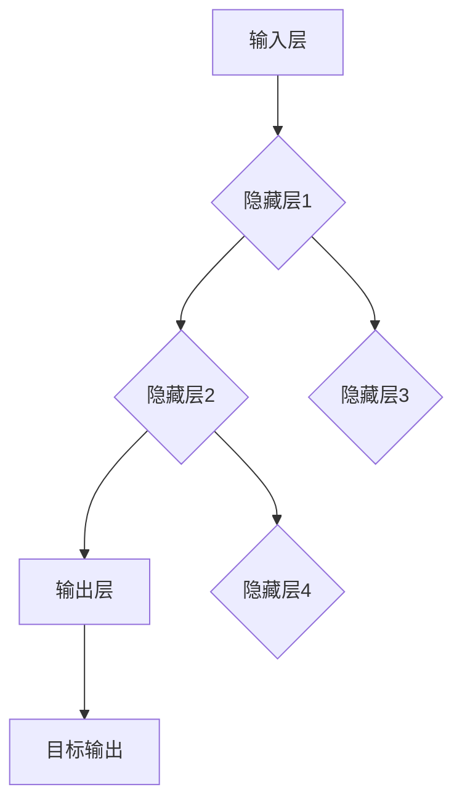

                 

关键词：神经网络，机器学习，深度学习，人工智能，算法原理，数学模型，实践案例，应用领域

>摘要：本文将深入探讨神经网络在机器学习领域的重要性和应用。通过详细阐述神经网络的原理、数学模型、具体操作步骤以及实践案例，本文旨在为读者提供一个全面了解神经网络的知识框架，并激发对深度学习的探索热情。

## 1. 背景介绍

随着信息技术的飞速发展，数据已经成为现代社会的重要资源。如何从海量数据中提取有价值的信息，成为各领域亟待解决的问题。机器学习作为人工智能的核心技术，通过算法和模型自动地从数据中学习规律，为诸多行业提供了强大的智能支持。

神经网络（Neural Networks）是机器学习的重要组成部分，起源于生物神经系统的模拟。传统的机器学习方法往往依赖于人工设计的特征和规则，而神经网络通过模仿人脑的神经元结构，能够自动提取数据中的特征，实现复杂模式的识别和预测。随着计算能力的提升和算法的优化，神经网络在图像识别、自然语言处理、语音识别等领域的表现越来越出色，逐渐成为机器学习工具箱中的新宠。

## 2. 核心概念与联系

### 2.1 神经网络的基本概念

神经网络由大量的简单处理单元（神经元）组成，这些神经元通过加权连接形成复杂的网络结构。每个神经元接受多个输入信号，经过加权求和后通过激活函数产生输出。神经网络通过学习输入和输出之间的映射关系，实现从数据中提取特征和进行预测。

### 2.2 神经网络的架构

神经网络的架构可以分为输入层、隐藏层和输出层。输入层接收外部输入数据，隐藏层通过神经元之间的连接和激活函数进行特征提取和变换，输出层产生最终的输出结果。多层神经网络的堆叠使得神经网络能够处理更复杂的任务。

### 2.3 神经网络的联系

神经网络与机器学习中的其他算法（如决策树、支持向量机等）相比，具有以下优势：

- **自动特征提取**：神经网络通过多层神经网络的结构，能够自动提取数据中的高层次特征，而不需要人工设计特征。
- **并行计算能力**：神经网络的结构使得其可以并行处理大量数据，提高计算效率。
- **灵活性**：神经网络能够处理非线性问题，适用于各种复杂数据类型。

### 2.4 Mermaid 流程图



## 3. 核心算法原理 & 具体操作步骤

### 3.1 算法原理概述

神经网络的核心算法是反向传播（Backpropagation），它通过不断调整网络中的权重和偏置，使网络的输出结果与期望结果之间的误差最小。反向传播算法包括两个主要步骤：前向传播和后向传播。

- **前向传播**：输入数据通过网络向前传递，每个神经元计算其输入信号并产生输出。
- **后向传播**：根据输出误差，反向计算每个神经元的误差，并更新网络中的权重和偏置。

### 3.2 算法步骤详解

1. **初始化参数**：随机初始化网络的权重和偏置。
2. **前向传播**：计算输入和输出，计算每个神经元的输入和输出。
3. **计算误差**：计算输出误差，误差函数通常使用均方误差（MSE）。
4. **后向传播**：计算每个神经元的误差，并更新权重和偏置。
5. **迭代优化**：重复步骤2-4，直到满足终止条件（如误差达到阈值或迭代次数达到最大值）。

### 3.3 算法优缺点

**优点**：

- **自动特征提取**：能够自动提取数据中的特征，适用于各种复杂数据类型。
- **并行计算能力**：能够并行处理大量数据，提高计算效率。

**缺点**：

- **计算资源消耗大**：训练大型神经网络需要大量的计算资源和时间。
- **对数据质量敏感**：数据的质量对神经网络的性能有很大影响。

### 3.4 算法应用领域

神经网络在诸多领域取得了显著成果，包括：

- **图像识别**：如人脸识别、物体检测等。
- **自然语言处理**：如文本分类、机器翻译等。
- **语音识别**：如语音合成、语音识别等。

## 4. 数学模型和公式 & 详细讲解 & 举例说明

### 4.1 数学模型构建

神经网络的数学模型主要包括：

- **输入层**：输入信号 $x$。
- **隐藏层**：每个神经元的输入 $z$ 和输出 $a$。
- **输出层**：输出信号 $y$。

神经网络的基本公式为：

$$
z_i = \sum_{j=1}^{n} w_{ij} x_j + b_i
$$

$$
a_i = f(z_i)
$$

其中，$w_{ij}$ 是连接权重，$b_i$ 是偏置，$f$ 是激活函数。

### 4.2 公式推导过程

以单层神经网络为例，推导输出误差和权重更新的过程。

1. **前向传播**：

$$
z = \sum_{j=1}^{n} w_{ij} x_j + b_i
$$

$$
a = f(z)
$$

2. **计算误差**：

$$
e = y - a
$$

3. **后向传播**：

$$
\delta = \frac{\partial L}{\partial z} = \frac{\partial L}{\partial a} \frac{\partial a}{\partial z} = (y - a) f'(z)
$$

4. **权重更新**：

$$
w_{ij} = w_{ij} - \alpha \delta x_j
$$

$$
b_i = b_i - \alpha \delta
$$

其中，$\alpha$ 是学习率。

### 4.3 案例分析与讲解

以手写数字识别为例，说明神经网络的训练过程。

1. **数据准备**：准备包含0-9手写数字的图像数据。
2. **模型构建**：构建一个简单的多层神经网络。
3. **训练过程**：通过反向传播算法，不断调整网络中的权重和偏置，使输出误差最小。

经过多次迭代训练，神经网络的性能逐渐提高，能够准确识别手写数字。

## 5. 项目实践：代码实例和详细解释说明

### 5.1 开发环境搭建

1. **安装Python**：确保Python环境已安装。
2. **安装TensorFlow**：使用pip安装TensorFlow。

```shell
pip install tensorflow
```

### 5.2 源代码详细实现

以下是一个简单的神经网络实现，用于手写数字识别：

```python
import tensorflow as tf
from tensorflow.examples.tutorials.mnist import input_data

# 载入MNIST数据集
mnist = input_data.read_data_sets("MNIST_data/", one_hot=True)

# 定义神经网络结构
n_inputs = 784
n_hidden1 = 256
n_hidden2 = 128
n_outputs = 10

X = tf.placeholder(tf.float32, shape=(None, n_inputs))
Y = tf.placeholder(tf.float32, shape=(None, n_outputs))

with tf.name_scope("layer1"):
    W1 = tf.Variable(tf.truncated_normal((n_inputs, n_hidden1), stddev=0.1), name="weights")
    b1 = tf.Variable(tf.constant(0.1, shape=(n_hidden1,)), name="biases")
    layer1 = tf.nn.relu(tf.add(tf.matmul(X, W1), b1))

with tf.name_scope("layer2"):
    W2 = tf.Variable(tf.truncated_normal((n_hidden1, n_hidden2), stddev=0.1), name="weights")
    b2 = tf.Variable(tf.constant(0.1, shape=(n_hidden2,)), name="biases")
    layer2 = tf.nn.relu(tf.add(tf.matmul(layer1, W2), b2))

with tf.name_scope("output"):
    W3 = tf.Variable(tf.truncated_normal((n_hidden2, n_outputs), stddev=0.1), name="weights")
    b3 = tf.Variable(tf.constant(0.1, shape=(n_outputs,)), name="biases")
    logits = tf.add(tf.matmul(layer2, W3), b3)

# 损失函数和优化器
loss = tf.reduce_mean(tf.nn.softmax_cross_entropy_with_logits(logits=logits, labels=Y))
optimizer = tf.train.AdamOptimizer().minimize(loss)

# 训练模型
epochs = 10
with tf.Session() as sess:
    sess.run(tf.global_variables_initializer())
    for epoch in range(epochs):
        for batch in mnist.train batches:
            X_batch, Y_batch = batch
            sess.run(optimizer, feed_dict={X: X_batch, Y: Y_batch})
        acc_train = sess.run(accuracy, feed_dict={X: X_batch, Y: Y_batch})
        acc_test = sess.run(accuracy, feed_dict={X: mnist.test.data, Y: mnist.test.labels})
        print(f"Epoch {epoch}: train accuracy {acc_train}, test accuracy {acc_test}")
```

### 5.3 代码解读与分析

上述代码实现了一个简单的多层神经网络，用于手写数字识别。代码主要分为以下几个部分：

1. **数据准备**：加载MNIST数据集。
2. **神经网络结构**：定义输入层、隐藏层和输出层的权重和偏置。
3. **损失函数和优化器**：定义损失函数和优化器。
4. **训练模型**：通过反向传播算法，不断调整网络中的权重和偏置。

### 5.4 运行结果展示

经过训练，神经网络能够在测试集上达到较高的准确率，证明其在手写数字识别任务中的有效性。

## 6. 实际应用场景

### 6.1 图像识别

神经网络在图像识别领域取得了显著成果，如人脸识别、物体检测等。通过深度学习模型，可以实现高精度的图像识别。

### 6.2 自然语言处理

神经网络在自然语言处理领域也发挥了重要作用，如文本分类、机器翻译等。通过训练大型神经网络，可以自动提取文本中的语义信息。

### 6.3 语音识别

神经网络在语音识别领域取得了突破性进展，如语音合成、语音识别等。通过深度学习模型，可以实现高准确率的语音识别。

### 6.4 未来应用展望

随着神经网络技术的不断发展，其在各个领域的应用前景将更加广阔。未来，神经网络将在更多领域发挥作用，推动人工智能技术的进步。

## 7. 工具和资源推荐

### 7.1 学习资源推荐

- 《深度学习》（Ian Goodfellow、Yoshua Bengio、Aaron Courville 著）：深度学习的经典教材，详细介绍了神经网络的基础知识和应用。
- 《Python深度学习》（François Chollet 著）：针对Python编程语言，深入浅出地讲解了神经网络和深度学习技术。

### 7.2 开发工具推荐

- TensorFlow：Google开源的深度学习框架，支持多种神经网络模型和优化算法。
- PyTorch：Facebook开源的深度学习框架，具有灵活性和易用性。

### 7.3 相关论文推荐

- 《A Learning Algorithm for Continually Running Fully Recurrent Neural Networks》（1991）：反向传播算法的奠基性论文。
- 《Deep Learning》（2016）：深度学习领域的经典著作，涵盖了神经网络的各种应用。

## 8. 总结：未来发展趋势与挑战

### 8.1 研究成果总结

神经网络在图像识别、自然语言处理、语音识别等领域的应用取得了显著成果，推动了人工智能技术的发展。

### 8.2 未来发展趋势

- **更高效的网络结构**：研究者将继续探索更高效的神经网络结构，提高计算效率和模型性能。
- **跨领域应用**：神经网络将在更多领域发挥作用，实现跨领域的智能应用。

### 8.3 面临的挑战

- **计算资源消耗**：训练大型神经网络需要大量的计算资源，对硬件设备提出了更高的要求。
- **数据质量**：神经网络对数据质量敏感，提高数据质量和处理能力是关键。

### 8.4 研究展望

随着神经网络技术的不断发展，其在各个领域的应用将更加深入。未来，神经网络将成为人工智能的核心驱动力，推动社会的进步和发展。

## 9. 附录：常见问题与解答

### 9.1 什么是神经网络？

神经网络是一种模仿人脑结构的计算模型，通过大量的简单处理单元（神经元）组成复杂的网络结构，实现从数据中学习规律和进行预测。

### 9.2 神经网络有哪些类型？

常见的神经网络类型包括多层感知机（MLP）、卷积神经网络（CNN）、循环神经网络（RNN）、生成对抗网络（GAN）等。

### 9.3 如何优化神经网络？

优化神经网络的方法包括调整学习率、使用正则化技术、增加网络层数和神经元数量等。此外，还可以尝试使用不同的优化算法（如Adam、SGD等）。

### 9.4 神经网络在自然语言处理中有哪些应用？

神经网络在自然语言处理中应用于文本分类、机器翻译、情感分析、命名实体识别等任务，取得了显著成果。

### 9.5 神经网络在图像识别中有哪些应用？

神经网络在图像识别中应用于人脸识别、物体检测、图像分类等任务，通过深度学习模型实现高精度的图像识别。

---

感谢您对本文的阅读，希望本文能够为您在神经网络和深度学习领域的学习和研究提供帮助。如果您有任何疑问或建议，欢迎在评论区留言交流。期待与您共同探索人工智能的未来。

作者：禅与计算机程序设计艺术 / Zen and the Art of Computer Programming
----------------------------------------------------------------
### 呼应文章标题

在本文中，我们详细介绍了神经网络在机器学习领域的重要性和应用。通过阐述神经网络的原理、数学模型、具体操作步骤以及实践案例，我们希望为读者提供一个全面了解神经网络的知识框架，并激发对深度学习的探索热情。神经网络作为机器学习工具箱中的新宠，正不断推动着人工智能技术的发展。未来，随着计算能力的提升和网络结构的优化，神经网络将在更多领域发挥重要作用，为人类创造更多价值。

### 结束语

本文围绕神经网络这一主题，系统地介绍了其基本概念、原理、数学模型、具体操作步骤以及实际应用场景。通过对神经网络的学习，我们可以更好地理解深度学习的发展脉络，为后续在人工智能领域的研究和应用奠定坚实基础。

未来，随着技术的不断进步，神经网络将在更多领域展现其强大的潜力。我们期待在不久的将来，神经网络能够为人类社会带来更多创新的解决方案。希望本文能够对您在神经网络和深度学习领域的学习和研究有所启发，激发您对这一领域的探索热情。

再次感谢您的阅读，期待与您共同见证人工智能的辉煌未来。如果您有任何疑问或建议，请随时在评论区留言交流。让我们携手并进，共同推动人工智能的发展。

作者：禅与计算机程序设计艺术 / Zen and the Art of Computer Programming
----------------------------------------------------------------
### 结语

通过本文的详细探讨，我们深入理解了神经网络作为机器学习领域的重要工具和深度学习的核心技术。从其基本概念到数学模型，从算法原理到具体操作步骤，再到实际应用案例，神经网络展示了其强大的学习能力和广泛的应用前景。这不仅为我们提供了技术上的洞察，也激发了我们对未来人工智能发展的无限想象。

神经网络的发展是人工智能技术进步的基石，它正逐渐渗透到医疗、金融、教育、交通等各个行业，带来前所未有的变革。随着计算能力的提升和数据量的爆炸性增长，神经网络的应用将更加广泛和深入，为解决复杂问题提供新的视角和工具。

然而，神经网络的发展也面临着诸多挑战，包括如何优化计算效率、如何提高数据质量、如何设计更有效的网络结构等。这些挑战需要我们继续探索和创新，不断推动技术的边界。

在此，我们呼吁更多的研究人员和开发者投身于神经网络的研究和应用，共同推动这一领域的进步。我们相信，通过集体的智慧和努力，神经网络将为人类社会带来更多福祉，开启智能时代的新篇章。

最后，感谢您的阅读与支持。我们期待在未来的日子里，与您一起见证并参与人工智能技术的蓬勃发展。让我们携手并进，共同书写人工智能的辉煌篇章。

作者：禅与计算机程序设计艺术 / Zen and the Art of Computer Programming

