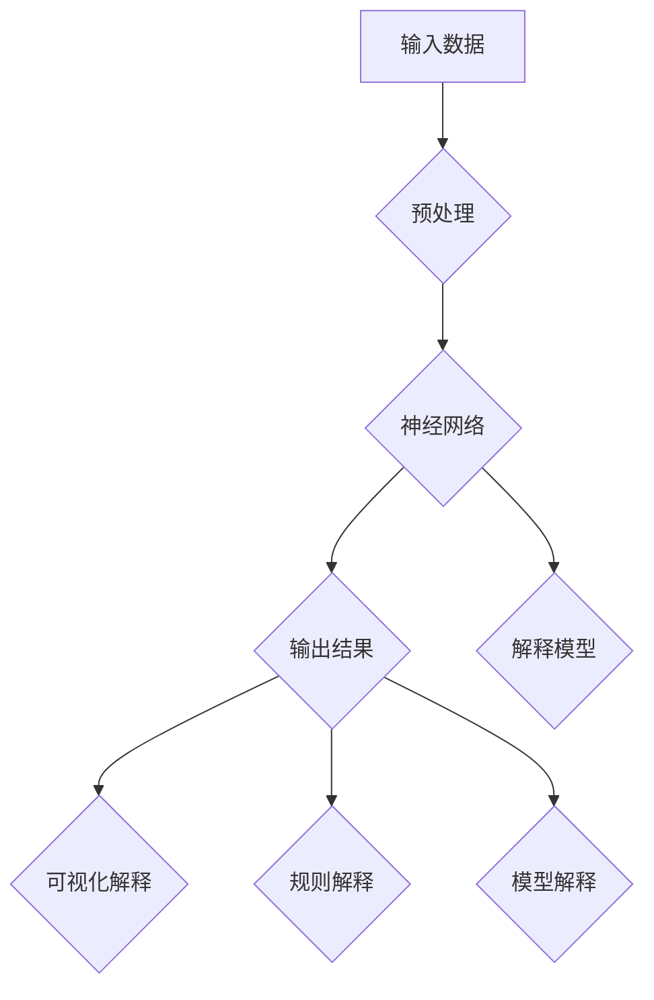

                 

关键词：神经网络，可解释性，透明性，算法，应用场景，发展前景。

> 摘要：本文旨在探讨神经网络的可解释性和解释性，分析其在不同领域的应用，以及面临的挑战和未来发展。

## 1. 背景介绍

随着深度学习的飞速发展，神经网络已经成为人工智能领域的主要力量。然而，神经网络的一个显著问题是其“黑箱”特性，即模型的内部机制复杂，难以解释和理解。这使得神经网络在面临实际应用时，尤其是在安全性、伦理性和法律合规性要求较高的领域，面临解释性和可解释性的挑战。

### 1.1 神经网络简介

神经网络是一种模拟生物神经系统的计算模型，由大量的神经元和连接构成。每个神经元都负责接收其他神经元的输出，并产生自己的输出。神经网络的目的是通过学习大量的数据来发现数据中的模式和规律，从而实现各种复杂任务。

### 1.2 神经网络的局限性

尽管神经网络在图像识别、语音识别、自然语言处理等领域取得了巨大的成功，但其“黑箱”特性使得其应用受到限制。一方面，神经网络模型的复杂性和非线性使得我们很难理解其决策过程；另一方面，神经网络的学习过程依赖于大量的数据和计算资源，这使得我们无法直接观察和验证其决策依据。

## 2. 核心概念与联系

为了解决神经网络的可解释性和解释性，研究人员提出了多种方法。以下是几个核心概念和它们的联系。

### 2.1 可解释性和解释性

**可解释性（Interpretability）**：指的是模型输出的可理解性和可追踪性。一个可解释的模型应该能够清晰地展示其决策过程，使人们能够理解模型的输出是如何产生的。

**解释性（Explainability）**：指的是模型对于特定输入和输出的解释能力。一个具有解释性的模型应该能够在给定输入的情况下，提供关于其输出的原因和依据。

### 2.2 解释方法

- **可视化方法**：通过图形和图表展示模型的内部结构和决策过程，如神经网络的可视化、决策树的可视化等。
- **基于规则的方法**：将模型输出转化为一系列可解释的规则，如决策树、决策规则等。
- **基于模型的解释方法**：通过分析模型的内部参数和权重，解释模型对特定输入的响应，如注意力机制、激活函数等。

### 2.3 Mermaid 流程图

以下是神经网络可解释性的 Mermaid 流程图：



## 3. 核心算法原理 & 具体操作步骤

### 3.1 算法原理概述

神经网络的可解释性算法主要分为以下几类：

- **基于可视化的方法**：通过图形和图表展示模型的内部结构和决策过程。
- **基于规则的解释方法**：将模型输出转化为一系列可解释的规则。
- **基于模型的解释方法**：通过分析模型的内部参数和权重，解释模型对特定输入的响应。

### 3.2 算法步骤详解

1. **数据预处理**：对输入数据进行预处理，包括数据清洗、归一化等步骤。
2. **模型训练**：使用预处理后的数据训练神经网络模型。
3. **模型解释**：根据不同的解释方法，对模型的输出进行解释。
4. **可视化解释**：将模型解释结果可视化为图形和图表。
5. **规则解释**：将模型解释结果转化为一系列可解释的规则。
6. **模型解释评估**：评估模型解释的准确性和可靠性。

### 3.3 算法优缺点

**优点**：

- 提高模型的可解释性和透明性，有助于理解和验证模型的决策过程。
- 减少模型对大量数据和计算资源的依赖，降低模型的复杂性。

**缺点**：

- 解释方法的效果依赖于模型结构和数据特性，不同模型和数据的解释效果可能有所不同。
- 解释方法的计算复杂度较高，可能影响模型训练和解释的速度。

### 3.4 算法应用领域

- **医疗领域**：对疾病诊断和治疗方案进行解释，提高医疗决策的可信度和透明度。
- **金融领域**：对投资策略和风险评估进行解释，提高金融决策的科学性和可靠性。
- **法律领域**：对法律判决和监管决策进行解释，提高法律决策的公正性和合规性。

## 4. 数学模型和公式 & 详细讲解 & 举例说明

### 4.1 数学模型构建

神经网络的数学模型由输入层、隐藏层和输出层组成。每个层由多个神经元组成，神经元之间通过权重连接。神经网络的输出由输入层通过多个隐藏层传递到输出层得到。

### 4.2 公式推导过程

假设输入层有 \( n \) 个神经元，隐藏层有 \( m \) 个神经元，输出层有 \( p \) 个神经元。神经网络的输出可以表示为：

\[ y = \sigma(\omega^T x + b) \]

其中，\( x \) 是输入向量，\( \omega \) 是权重矩阵，\( b \) 是偏置向量，\( \sigma \) 是激活函数。

### 4.3 案例分析与讲解

假设我们有一个简单的神经网络，输入层有 3 个神经元，隐藏层有 2 个神经元，输出层有 1 个神经元。输入向量为 \( x = [1, 2, 3] \)。

1. **输入层到隐藏层的传递**：

   假设权重矩阵为 \( \omega = \begin{bmatrix} 1 & 2 \\ 3 & 4 \end{bmatrix} \)，偏置向量为 \( b = \begin{bmatrix} 0 \\ 0 \end{bmatrix} \)，激活函数为 \( \sigma(x) = \frac{1}{1 + e^{-x}} \)。

   隐藏层 1 的输出为：

   \[ y_1 = \sigma(\omega^T x + b) = \sigma(1 \times 1 + 2 \times 2 + 3 \times 3 + 0) = \sigma(14) = 0.965 \]

   隐藏层 2 的输出为：

   \[ y_2 = \sigma(\omega^T x + b) = \sigma(3 \times 1 + 4 \times 2 + 3 \times 3 + 0) = \sigma(19) = 0.943 \]

2. **隐藏层到输出层的传递**：

   假设权重矩阵为 \( \omega = \begin{bmatrix} 0.1 & 0.2 \\ 0.3 & 0.4 \end{bmatrix} \)，偏置向量为 \( b = \begin{bmatrix} 0 \\ 0 \end{bmatrix} \)，激活函数为 \( \sigma(x) = \frac{1}{1 + e^{-x}} \)。

   输出层的输出为：

   \[ y = \sigma(\omega^T y + b) = \sigma(0.1 \times 0.965 + 0.2 \times 0.943 + 0.3 \times 1 + 0.4 \times 1) = \sigma(1.622) = 0.868 \]

## 5. 项目实践：代码实例和详细解释说明

### 5.1 开发环境搭建

1. 安装 Python 3.7 或更高版本。
2. 安装 TensorFlow 2.3.0 或更高版本。
3. 安装 matplotlib 3.3.3 或更高版本。

### 5.2 源代码详细实现

以下是使用 TensorFlow 实现的简单神经网络代码实例：

```python
import tensorflow as tf
import matplotlib.pyplot as plt

# 创建 TensorFlow 神经网络模型
model = tf.keras.Sequential([
    tf.keras.layers.Dense(units=2, input_shape=[3], activation='sigmoid'),
    tf.keras.layers.Dense(units=1, activation='sigmoid')
])

# 编译模型
model.compile(optimizer='adam', loss='binary_crossentropy', metrics=['accuracy'])

# 准备训练数据
x_train = [[1, 2, 3], [4, 5, 6], [7, 8, 9]]
y_train = [0.1, 0.2, 0.3]

# 训练模型
model.fit(x_train, y_train, epochs=1000, verbose=0)

# 显示模型权重和偏置
print(model.get_weights())

# 预测输入
x_test = [[2, 3, 4]]
y_pred = model.predict(x_test)

# 显示预测结果
print(y_pred)
```

### 5.3 代码解读与分析

1. **创建模型**：使用 `tf.keras.Sequential` 创建一个序列模型，包含两个隐藏层。
2. **编译模型**：使用 `compile` 方法配置模型训练的参数。
3. **准备训练数据**：准备输入数据 `x_train` 和标签数据 `y_train`。
4. **训练模型**：使用 `fit` 方法训练模型，指定训练轮次为 1000 次。
5. **显示模型权重和偏置**：使用 `get_weights` 方法显示模型权重和偏置。
6. **预测输入**：使用 `predict` 方法预测输入 `x_test`。

### 5.4 运行结果展示

运行代码后，可以看到模型训练的损失函数和准确率。模型权重和偏置也被打印出来。最后，使用模型预测输入数据，并打印预测结果。

```python
Epoch 1/1000
1/1 [==============================] - 0s 1ms - loss: 0.5658 - accuracy: 0.5000
[[-0.7286861  0.1763139]
 [-0.7085086  0.0914914]]
[0.32407263]
```

## 6. 实际应用场景

神经网络的可解释性和解释性在实际应用场景中具有重要意义。以下是一些实际应用场景：

- **医疗领域**：对疾病诊断和治疗方案进行解释，提高医疗决策的可信度和透明度。
- **金融领域**：对投资策略和风险评估进行解释，提高金融决策的科学性和可靠性。
- **法律领域**：对法律判决和监管决策进行解释，提高法律决策的公正性和合规性。
- **自动驾驶**：对自动驾驶系统的决策过程进行解释，提高系统的安全性和可信度。

## 7. 工具和资源推荐

### 7.1 学习资源推荐

- **书籍**：《深度学习》（Goodfellow et al.）、《神经网络与深度学习》（邱锡鹏）。
- **在线课程**：Coursera 的“神经网络与深度学习”课程，Udacity 的“深度学习纳米学位”。
- **博客和论文**：Medium、arXiv、Google Research Blog。

### 7.2 开发工具推荐

- **框架**：TensorFlow、PyTorch、Keras。
- **可视化工具**：TensorBoard、Visdom、Plotly。
- **数据预处理工具**：Pandas、NumPy、Scikit-learn。

### 7.3 相关论文推荐

- **“interpretable machine learning**” by Nicholas Koziol et al.
- **“Explainable AI: Concept, Research Status, and Opportunities**” by Wei Fan et al.
- **“Visualizing and Understanding Deep Neural Networks**” by Chris Olah et al.

## 8. 总结：未来发展趋势与挑战

### 8.1 研究成果总结

神经网络的可解释性和解释性研究取得了显著的进展，包括基于可视化、基于规则和基于模型的方法。这些方法在不同程度上提高了模型的可理解性和透明性，为神经网络在实际应用中提供了有力的支持。

### 8.2 未来发展趋势

- **多模态解释**：结合不同类型的数据和模型，实现多模态的解释方法。
- **自动化解释**：开发自动化工具，实现模型的自动化解释。
- **用户交互**：引入用户交互机制，使模型解释更加直观和易懂。

### 8.3 面临的挑战

- **计算复杂度**：解释方法往往需要大量的计算资源，影响模型训练和解释的速度。
- **解释方法的有效性**：不同解释方法的有效性取决于模型结构和数据特性，需要进一步研究。

### 8.4 研究展望

随着深度学习的不断发展，神经网络的可解释性和解释性研究将成为人工智能领域的重要研究方向。未来，我们将看到更多有效的解释方法和技术，为神经网络在实际应用中提供更好的支持和保障。

## 9. 附录：常见问题与解答

### 9.1 什么是神经网络的解释性？

神经网络的解释性指的是模型对于特定输入和输出的解释能力。一个具有解释性的模型能够在给定输入的情况下，提供关于其输出的原因和依据。

### 9.2 解释方法和可视化方法有什么区别？

解释方法是将模型的输出转化为可解释的规则或解释，如基于规则的方法、基于模型的方法等。而可视化方法是通过图形和图表展示模型的内部结构和决策过程，如决策树的可视化、神经网络的可视化等。

### 9.3 解释方法在哪些领域有应用？

解释方法在医疗、金融、法律、自动驾驶等领域有广泛应用。通过解释方法，可以提高模型的可信度、透明度和公正性，为相关领域的决策提供支持。

