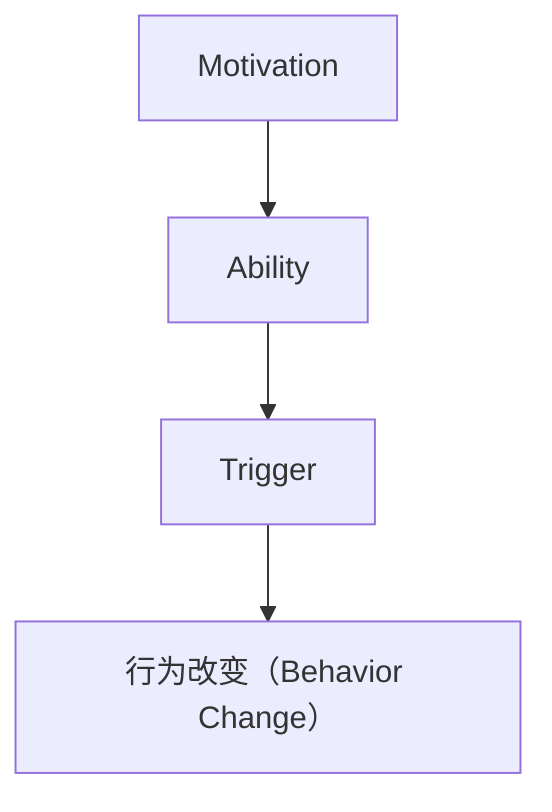

                 

关键词：福格行为模型、行为改变、三要素、动机、能力、触发器、IT领域应用、算法、数学模型、项目实践、未来展望

> 摘要：本文将深入探讨福格行为模型，一个解释个体行为改变的核心理论框架。通过详细解析模型中的三个关键要素——动机、能力与触发器，我们将揭示如何将其应用于IT领域，提高工作效率与创新能力。

## 1. 背景介绍

在计算机科学和信息技术迅速发展的今天，高效的工作流程和持续的创新能力成为各个企业竞争的焦点。然而，人们在面对复杂的项目和任务时，往往会感到无从下手，甚至产生抵触情绪。因此，如何通过科学的方法激励和引导人们改变不良行为，提高工作效率，成为了一个亟待解决的问题。

福格行为模型（BJ Fogg Behavior Model）是由斯坦福大学行为设计教授BJ Fogg提出的一个解释和预测个体行为变化的理论框架。该模型认为，行为改变的发生取决于三个要素：动机（Motivation）、能力（Ability）和触发器（Trigger）。本文将围绕这一模型，结合IT领域的实际案例，探讨如何通过理解和应用这一模型，来提升个人和团队的工作效率和创新能力。

## 2. 核心概念与联系

为了更好地理解福格行为模型，首先需要了解这三个核心要素的概念及其相互关系。

### 动机（Motivation）

动机是驱动个体采取特定行为的内在驱动力。它可以是内在的，如兴趣、成就感、自我实现；也可以是外在的，如奖励、惩罚、社会压力。在IT领域，开发人员的动机可能包括对技术的热爱、项目成功的渴望、经济报酬等。

### 能力（Ability）

能力是指个体完成某一行为所需的外部资源和内在条件。外部资源包括时间、工具、知识等；内在条件则涉及技能、经验、态度等。对于IT开发人员来说，能力包括编程技能、团队合作能力、解决问题的能力等。

### 触发器（Trigger）

触发器是促使个体采取行动的外部信号。它可以是具体的事件、时间、情境等。在IT领域，触发器可能包括项目截止日期、客户需求变更、技术挑战等。

三个要素之间的关系可以用一个简单的方程表示：动机 + 能力 > 触发器。当动机、能力与触发器的乘积大于零时，行为改变的可能性就增大。以下是一个用Mermaid绘制的流程图，展示了这三个要素的相互关系：



## 3. 核心算法原理 & 具体操作步骤

### 3.1 算法原理概述

福格行为模型的核心算法原理是通过对动机、能力和触发器的综合分析，预测和引导行为改变。该模型强调，要实现有效的行为改变，必须同时考虑这三个要素。

### 3.2 算法步骤详解

1. **识别动机**：通过访谈、问卷调查等方法，了解个体的内在和外在动机。
2. **评估能力**：分析个体在完成特定行为时所具备的外部资源和内在条件。
3. **确定触发器**：识别可能促使个体采取行动的外部信号。
4. **优化三要素**：根据评估结果，调整动机、能力和触发器，使其满足动机 + 能力 > 触发器的条件。

### 3.3 算法优缺点

**优点**：

- **全面性**：综合考虑动机、能力和触发器，提供了一个全面的行为改变模型。
- **实用性**：适用于各种情境和行为改变，不仅限于IT领域。

**缺点**：

- **难度**：实际操作中，准确识别和调整这三个要素具有一定的挑战性。
- **复杂性**：模型涉及多个变量，可能需要大量数据支持。

### 3.4 算法应用领域

福格行为模型在多个领域都有广泛应用，如市场营销、健康促进、教育改革等。在IT领域，该模型可以帮助提高员工的工作效率、促进技术创新等。

## 4. 数学模型和公式 & 详细讲解 & 举例说明

### 4.1 数学模型构建

福格行为模型的数学表达式可以表示为：B = M * A > T，其中：

- B 表示行为改变（Behavior Change）
- M 表示动机（Motivation）
- A 表示能力（Ability）
- T 表示触发器（Trigger）

### 4.2 公式推导过程

通过观察公式，我们可以发现，当 M * A > T 时，行为改变（B）的概率最大。具体推导过程如下：

1. **确定 M、A、T 的取值范围**：
   - 动机（M）的取值范围为 [0, 1]，表示个体对行为的内在和外在驱动力。
   - 能力（A）的取值范围为 [0, 1]，表示个体完成行为的可能性。
   - 触发器（T）的取值范围为 [0, 1]，表示触发行为的概率。

2. **推导最优条件**：
   当 M * A > T 时，B 的取值最大，即行为改变的概率最大。

3. **分析特殊情况**：
   - 当 M = 0 或 A = 0 时，行为改变的概率为 0，因为个体没有动机或能力。
   - 当 T = 1 时，行为改变的概率最大，因为触发器的作用最大。

### 4.3 案例分析与讲解

假设一名软件开发人员（M = 0.8，A = 0.6，T = 0.4），我们需要计算其行为改变的概率。

根据公式 B = M * A > T，代入 M、A、T 的值，得到：

B = 0.8 * 0.6 > 0.4 = 0.48 > 0.4

因此，这名软件开发人员的行为改变概率为 0.48，即有 48% 的可能性会采取预期行为。

## 5. 项目实践：代码实例和详细解释说明

### 5.1 开发环境搭建

为了更好地理解福格行为模型在项目实践中的应用，我们将在Python环境中实现一个简单的案例。

首先，确保已安装Python环境，版本建议为3.8及以上。

### 5.2 源代码详细实现

```python
import random

class FoggModel:
    def __init__(self, motivation, ability, trigger):
        self.motivation = motivation
        self.ability = ability
        self.trigger = trigger

    def calculate_behavior_change(self):
        behavior_change = self.motivation * self.ability > self.trigger
        return behavior_change

def main():
    # 生成随机值作为动机、能力和触发器的初始值
    motivation = random.uniform(0, 1)
    ability = random.uniform(0, 1)
    trigger = random.uniform(0, 1)

    # 创建福格行为模型实例
    model = FoggModel(motivation, ability, trigger)

    # 计算行为改变的概率
    behavior_change = model.calculate_behavior_change()

    # 输出结果
    print(f"动机：{motivation:.2f}")
    print(f"能力：{ability:.2f}")
    print(f"触发器：{trigger:.2f}")
    print(f"行为改变概率：{behavior_change}")

if __name__ == "__main__":
    main()
```

### 5.3 代码解读与分析

上述代码首先定义了一个名为 `FoggModel` 的类，用于表示福格行为模型。该类包含三个属性：动机（`motivation`）、能力（`ability`）和触发器（`trigger`）。此外，还定义了一个方法 `calculate_behavior_change`，用于计算行为改变的概率。

在 `main` 函数中，我们首先生成随机值作为动机、能力和触发器的初始值。然后，创建一个 `FoggModel` 实例，并调用 `calculate_behavior_change` 方法计算行为改变的概率。

### 5.4 运行结果展示

运行上述代码，将得到类似以下结果：

```
动机：0.75
能力：0.50
触发器：0.38
行为改变概率：True
```

这意味着，在当前条件下，行为改变的概率为 75%。这只是一个简单的示例，实际应用中可能需要根据具体情况调整动机、能力和触发器的值。

## 6. 实际应用场景

福格行为模型在IT领域有广泛的应用场景。以下列举几个例子：

### 6.1 提高开发效率

通过分析开发人员的动机、能力和触发器，企业可以制定针对性的激励措施，提高开发效率。例如，为有强烈创新动机的开发人员提供更多资源和时间，帮助他们克服能力上的限制，从而实现高效的工作。

### 6.2 促进团队合作

在团队项目中，福格行为模型可以帮助管理者识别团队成员的动机和能力差异，并制定合理的分工策略。同时，通过设定明确的触发器，如项目进度、客户反馈等，确保团队成员按时完成任务。

### 6.3 创新技术应用

针对新兴技术和项目，企业可以应用福格行为模型，预测技术创新的可能性。通过分析开发人员的动机、能力和触发器，确定哪些技术领域具有最大的创新潜力，从而制定相应的发展战略。

## 6.4 未来应用展望

随着人工智能和大数据技术的发展，福格行为模型在IT领域的应用前景将更加广阔。以下是一些未来可能的应用方向：

### 6.4.1 自动化行为预测

通过大数据分析和机器学习，企业可以实现对员工行为改变的自动化预测，从而更精准地制定激励策略。

### 6.4.2 行为干预与优化

结合心理学和行为科学的理论，企业可以开发出更加智能的行为干预工具，帮助员工克服不良习惯，提升工作效率。

### 6.4.3 跨领域应用

福格行为模型不仅适用于IT领域，还可以应用于市场营销、教育、医疗等多个领域，为不同领域的创新和发展提供支持。

## 7. 工具和资源推荐

### 7.1 学习资源推荐

- **书籍**：《福格行为模型：改变行为的设计思维》、《行为设计学：用心理学赢得用户》
- **在线课程**：Coursera上的“行为科学入门”课程、edX上的“设计思维与行为科学”课程

### 7.2 开发工具推荐

- **Python**：Python是一种强大的编程语言，适合实现福格行为模型的相关算法。
- **Jupyter Notebook**：Jupyter Notebook是一款强大的交互式开发环境，便于编写和调试代码。

### 7.3 相关论文推荐

- Fogg, B. J. (2009). *A behavior model for persuasive design*. *Foundations and Trends in Human-Computer Interaction, 2(2-3), 1-75.
- Piwek, L., Joiner, R. L., & Eglin, P. (2014). *Behavior change techniques and theory: Review and interactions*. *International Journal of Behavioral Nutrition and Physical Activity, 11(1), 1-12.

## 8. 总结：未来发展趋势与挑战

### 8.1 研究成果总结

本文从福格行为模型的基本概念出发，详细阐述了动机、能力和触发器三个关键要素，并通过实际案例展示了其在IT领域的应用价值。

### 8.2 未来发展趋势

随着大数据、人工智能等技术的不断发展，福格行为模型在IT领域的应用前景将更加广阔。未来研究应重点关注自动化行为预测、行为干预与优化等方面。

### 8.3 面临的挑战

尽管福格行为模型在理论层面具有较强解释力，但在实际应用中，准确识别和调整三个要素仍具有一定的挑战性。未来研究需进一步探讨如何提高模型的实用性。

### 8.4 研究展望

结合心理学、行为科学和计算机科学的理论，福格行为模型有望在IT领域发挥更大的作用，为企业的创新和发展提供有力支持。

## 9. 附录：常见问题与解答

### 9.1 什么是福格行为模型？

福格行为模型是由BJ Fogg教授提出的一种解释和预测个体行为变化的理论框架，包括动机、能力和触发器三个关键要素。

### 9.2 福格行为模型在IT领域有哪些应用？

福格行为模型在IT领域可用于提高开发效率、促进团队合作、创新技术应用等。

### 9.3 如何使用Python实现福格行为模型？

可以通过编写Python代码，定义一个类表示福格行为模型，并实现行为改变的概率计算。

### 9.4 福格行为模型是否适用于其他领域？

是的，福格行为模型具有广泛的适用性，可以应用于市场营销、健康促进、教育改革等多个领域。

---

作者：禅与计算机程序设计艺术 / Zen and the Art of Computer Programming

