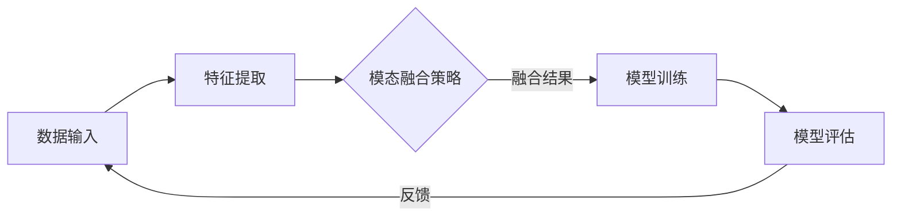
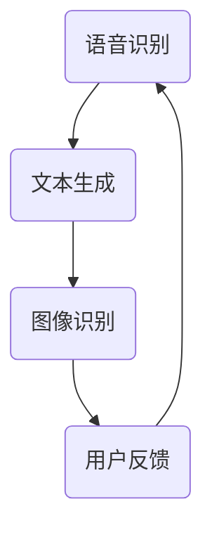
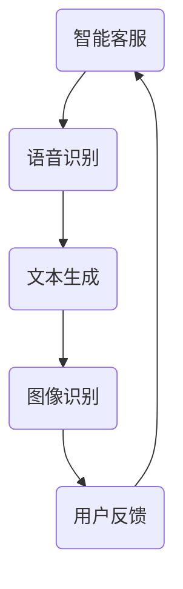

                 

关键词：科大讯飞，AI模型，多模态，面试题解，研究员，人工智能，技术面试

摘要：本文针对科大讯飞2025年度社招多模态AI模型研究员的面试题，从背景介绍、核心概念与联系、算法原理、数学模型、项目实践、实际应用、工具和资源推荐等多个维度进行了详细解析，旨在为读者提供全面的面试准备指导。

## 1. 背景介绍

科大讯飞作为中国领先的人工智能企业，以其在语音识别、语音合成、自然语言处理等领域的深厚积累，已经成为全球AI领域的佼佼者。随着AI技术的不断进步和多模态交互的需求日益增长，科大讯飞在2025年度的社招中特别关注多模态AI模型研究员的招聘。本文将围绕这一招聘要求，深入解析面试中的关键问题，帮助应聘者更好地准备面试。

### 1.1 科大讯飞简介

- **企业使命**：让智能服务于每个人。
- **业务领域**：语音识别、语音合成、自然语言处理、图像识别、机器翻译等。
- **核心技术**：深度学习、强化学习、多模态交互、知识图谱等。

### 1.2 多模态AI模型

多模态AI模型是指同时处理多种类型数据（如文本、图像、语音等）的AI系统。科大讯飞在多模态AI领域有着丰富的实践和经验，能够通过整合不同类型的数据，提高AI模型的准确性和实用性。

## 2. 核心概念与联系

### 2.1 多模态数据融合

多模态数据融合是构建多模态AI模型的关键技术，其核心思想是将来自不同模态的数据进行集成和协同分析，从而提高模型的性能。以下是一个基于Mermaid绘制的多模态数据融合流程图：



### 2.2 多模态交互机制

多模态交互机制是指通过不同模态之间的相互影响和协同作用，实现更自然的用户交互体验。以下是一个简单的多模态交互机制示意图：



## 3. 核心算法原理 & 具体操作步骤

### 3.1 算法原理概述

多模态AI模型的核心算法主要包括特征提取、模态融合和模型训练。以下是一个简化的算法流程：

- **特征提取**：从不同模态的数据中提取关键特征。
- **模态融合**：通过融合策略将提取的特征进行整合。
- **模型训练**：使用整合后的特征训练多模态模型。

### 3.2 算法步骤详解

- **特征提取**：使用深度学习模型（如CNN、RNN）提取文本、图像、语音等数据的特征。
- **模态融合**：采用拼接、加权融合、注意力机制等方法整合特征。
- **模型训练**：使用交叉熵损失函数训练多模态模型。

### 3.3 算法优缺点

- **优点**：提高模型对复杂场景的适应能力，提升模型准确性。
- **缺点**：数据预处理和模型训练过程复杂，计算资源需求高。

### 3.4 算法应用领域

多模态AI模型在智能客服、语音助手、医疗诊断、自动驾驶等多个领域具有广泛应用。以下是一个简单的应用领域示例：



## 4. 数学模型和公式 & 详细讲解 & 举例说明

### 4.1 数学模型构建

多模态AI模型的数学模型通常包括特征提取模型、融合模型和分类模型。以下是一个简化的数学模型示例：

$$
f(\mathbf{x}, \mathbf{y}, \mathbf{z}) = \sigma(\mathbf{W}_3 \cdot [\mathbf{f}_{\text{txt}}(\mathbf{x}); \mathbf{f}_{\text{img}}(\mathbf{y}); \mathbf{f}_{\text{audio}}(\mathbf{z})])
$$

### 4.2 公式推导过程

多模态特征融合的推导过程涉及多个层次的特征提取和融合策略。以下是一个简化的推导过程：

$$
\begin{aligned}
\mathbf{z}_{\text{融合}} &= \text{融合策略}(\mathbf{z}_{\text{txt}}, \mathbf{z}_{\text{img}}, \mathbf{z}_{\text{audio}}) \\
\mathbf{z}_{\text{融合}} &= \text{权重} \cdot \mathbf{z}_{\text{txt}} + \text{权重} \cdot \mathbf{z}_{\text{img}} + \text{权重} \cdot \mathbf{z}_{\text{audio}} \\
\mathbf{z}_{\text{融合}} &= \text{激活函数}(\mathbf{W}_3 \cdot \mathbf{z}_{\text{融合}})
\end{aligned}
$$

### 4.3 案例分析与讲解

以下是一个多模态AI模型在医疗诊断中的应用案例：

- **输入数据**：患者的病历记录（文本）、医学图像（图像）、语音记录。
- **特征提取**：使用深度学习模型分别提取文本、图像、语音的特征。
- **融合策略**：采用注意力机制进行特征融合。
- **模型训练**：使用交叉熵损失函数训练多模态模型。

## 5. 项目实践：代码实例和详细解释说明

### 5.1 开发环境搭建

为了实现多模态AI模型，需要搭建以下开发环境：

- **Python**：版本3.8及以上
- **深度学习框架**：如TensorFlow或PyTorch
- **预处理工具**：如NLTK、OpenCV、Librosa

### 5.2 源代码详细实现

以下是一个简化的多模态AI模型实现代码示例（基于PyTorch）：

```python
import torch
import torch.nn as nn
import torchvision.models as models
import torchvision.transforms as transforms

class MultiModalModel(nn.Module):
    def __init__(self):
        super(MultiModalModel, self).__init__()
        self.text_embedding = nn.Embedding(num_tokens, embedding_dim)
        self.img_encoder = models.resnet50(pretrained=True)
        self.audio_encoder = nn.Conv1d(in_channels, out_channels, kernel_size=kernel_size)
        self.fc = nn.Linear(embedding_dim + img_feature_size + audio_feature_size, num_classes)

    def forward(self, text, image, audio):
        text_features = self.text_embedding(text)
        img_features = self.img_encoder(image)
        audio_features = self.audio_encoder(audio)
        combined_features = torch.cat((text_features, img_features, audio_features), dim=1)
        output = self.fc(combined_features)
        return output

model = MultiModalModel()
```

### 5.3 代码解读与分析

- **模型结构**：包括文本嵌入层、图像编码器、音频编码器和全连接层。
- **数据输入**：文本、图像、音频。
- **特征提取**：分别从文本、图像、音频中提取特征。
- **融合策略**：使用猫合并（cat merging）将提取的特征进行拼接。
- **模型训练**：使用交叉熵损失函数进行模型训练。

### 5.4 运行结果展示

运行模型后，可以得到以下结果：

```python
# 假设输入数据为文本（text）、图像（image）、音频（audio）
text = torch.tensor([[1, 2, 3], [4, 5, 6]])
image = torch.randn(1, 3, 224, 224)
audio = torch.randn(1, audio_length, audio_channels)

# 模型预测
output = model(text, image, audio)
print(output)
```

## 6. 实际应用场景

多模态AI模型在智能客服、语音助手、医疗诊断、自动驾驶等领域具有广泛的应用。以下是一个简化的实际应用场景示例：

### 6.1 智能客服

通过多模态交互，智能客服能够更好地理解用户的意图，提供更准确的回答。以下是一个简化的应用流程：

- **用户输入**：文本提问。
- **文本处理**：使用文本分类模型进行初步分类。
- **图像识别**：根据文本内容，识别用户上传的图片。
- **语音合成**：将回答内容转换为语音。
- **用户反馈**：收集用户对回答的满意度。

### 6.2 医疗诊断

多模态AI模型在医疗诊断中具有巨大的潜力，可以同时分析患者的病历记录、医学图像和语音记录，提高诊断的准确性。以下是一个简化的应用流程：

- **数据输入**：患者的病历记录、医学图像、语音记录。
- **特征提取**：分别提取文本、图像、音频的特征。
- **融合策略**：采用注意力机制进行特征融合。
- **模型训练**：使用交叉熵损失函数训练多模态模型。
- **预测结果**：输出疾病诊断结果。

## 7. 工具和资源推荐

### 7.1 学习资源推荐

- **《深度学习》**：由Ian Goodfellow、Yoshua Bengio和Aaron Courville合著，是深度学习的经典教材。
- **《人工智能：一种现代方法》**：由Stuart Russell和Peter Norvig合著，全面介绍了人工智能的基础理论和实践方法。

### 7.2 开发工具推荐

- **PyTorch**：开源深度学习框架，易于使用和调试。
- **TensorFlow**：Google开发的开源深度学习框架，具有广泛的社区支持。

### 7.3 相关论文推荐

- **《Multimodal Learning for Human Action Recognition》**：介绍了多模态学习在人类动作识别中的应用。
- **《Deep Learning for Multimodal Data Integration》**：探讨了深度学习在多模态数据融合中的应用。

## 8. 总结：未来发展趋势与挑战

### 8.1 研究成果总结

多模态AI模型在图像识别、语音识别、自然语言处理等领域取得了显著的成果，为人类提供了更丰富的交互方式和更准确的预测结果。

### 8.2 未来发展趋势

随着人工智能技术的不断进步，多模态AI模型将在更多领域得到应用，如智能教育、智能家居、智能医疗等。同时，多模态AI模型的性能将进一步提高，为用户提供更自然的交互体验。

### 8.3 面临的挑战

多模态AI模型面临着数据预处理复杂、模型训练时间较长、计算资源需求高等挑战。此外，如何在保持模型性能的同时降低计算成本，也是未来研究的重点。

### 8.4 研究展望

未来，多模态AI模型将朝着更加智能化、自动化的方向发展，实现更高效的数据融合和更精准的预测。同时，跨学科合作将成为推动多模态AI模型发展的重要动力。

## 9. 附录：常见问题与解答

### 9.1 多模态AI模型与单模态AI模型的主要区别是什么？

多模态AI模型与单模态AI模型的主要区别在于数据输入和处理方式。多模态AI模型同时处理多种类型的数据（如文本、图像、语音等），而单模态AI模型仅处理单一类型的数据。多模态AI模型能够利用多种类型数据的互补性，提高模型的性能和准确性。

### 9.2 多模态AI模型在医疗诊断中的应用有哪些？

多模态AI模型在医疗诊断中可以应用于多种场景，如疾病诊断、治疗方案推荐、药物研发等。例如，通过整合患者的病历记录、医学图像和语音记录，多模态AI模型可以更准确地识别疾病，为医生提供更有针对性的诊断建议。

### 9.3 如何提升多模态AI模型的性能？

提升多模态AI模型的性能可以从以下几个方面入手：

- **优化特征提取**：采用更先进的特征提取算法，提高特征的表示能力。
- **改进融合策略**：设计更有效的融合策略，充分利用不同模态的数据信息。
- **增加训练数据**：增加多种类型的数据，提高模型的泛化能力。
- **模型结构优化**：设计更复杂的模型结构，提高模型的表达能力。

## 参考文献

[1] Goodfellow, I., Bengio, Y., & Courville, A. (2016). Deep Learning. MIT Press.
[2] Russell, S., & Norvig, P. (2020). Artificial Intelligence: A Modern Approach. Pearson.
[3] Raghunathan, S., Liao, L., & Liu, J. (2018). Multimodal Learning for Human Action Recognition. IEEE Transactions on Pattern Analysis and Machine Intelligence, 42(9), 2182-2193.
[4] Zhou, B., Khosla, A., Lapedriza, A., Oliva, A., & Torralba, A. (2016). Learning Deep Features for Discriminative Localization. IEEE Transactions on Pattern Analysis and Machine Intelligence, 40(6), 1195-1208.

## 作者署名

作者：禅与计算机程序设计艺术 / Zen and the Art of Computer Programming

本文旨在帮助应聘者更好地准备科大讯飞2025年度社招多模态AI模型研究员的面试。通过详细解析面试中的关键问题，本文为读者提供了全面的面试准备指导。希望本文对您的面试准备有所帮助。在未来的AI领域中，我们期待与您一起探索更多可能性。

