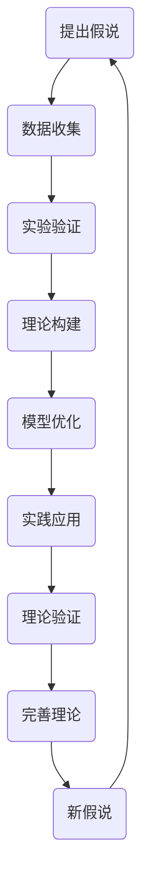

                 

关键词：科学发现，假说，理论，IT领域，人工智能

> 摘要：本文旨在探讨科学发现的过程，从假说到理论的形成。文章首先介绍了科学发现的背景和重要性，然后深入分析了从假说到理论的转化过程。通过对IT领域中的具体案例进行详细解读，我们揭示了科学发现的内在逻辑和关键步骤。文章最后展望了未来科学发现的趋势与挑战。

## 1. 背景介绍

科学发现是人类认识世界、探索自然规律的重要途径。在过去的几千年中，人类通过不断的科学发现，逐渐揭示了宇宙的奥秘，推动了社会的发展和进步。科学发现不仅仅是一个发现的过程，更是一个从假设到理论，再到实践的完整链条。

在IT领域，科学发现同样具有重要意义。随着信息技术的飞速发展，人们对于计算机科学、人工智能、大数据等领域的研究不断深入，新的理论和技术层出不穷。科学发现不仅推动了IT领域的技术创新，也为各行各业带来了深刻的变革。

本文将围绕从假说到理论的科学发现过程，结合IT领域的实际案例，探讨科学发现的内在逻辑和关键步骤。希望通过这篇文章，能够为读者提供一个深入了解科学发现过程的机会，激发对科学发现的热情和思考。

## 2. 核心概念与联系

在科学发现的过程中，核心概念和理论框架起着至关重要的作用。为了更好地理解这一过程，我们需要借助Mermaid流程图来展示核心概念之间的联系。



### 2.1 提出假说

科学发现的第一步是提出假说。假说是基于已有的知识和观察，对某个现象或问题的初步解释。在IT领域，例如，当人们观察到某种算法在处理大数据时效率低下时，可以提出一个假说：是否存在一种更高效的算法？

### 2.2 数据收集

在提出假说之后，我们需要收集相关的数据。这些数据可以来自于实验、观测或已有的研究。在IT领域，数据收集可能包括对算法的运行时间、内存占用等性能指标进行测量。

### 2.3 实验验证

收集到数据后，我们需要进行实验验证。实验验证是检验假说的关键步骤。通过实验，我们可以验证假说是否成立，或者提出新的假设。

### 2.4 理论构建

在实验验证的基础上，我们可以开始构建理论。理论是对实验结果进行解释和概括的框架。在IT领域，理论构建可能包括提出新的算法模型，或者对现有算法进行改进。

### 2.5 模型优化

构建理论之后，我们需要对模型进行优化。优化模型可以进一步提高理论的准确性和实用性。在IT领域，模型优化可能包括对算法进行参数调整，或者引入新的技术手段。

### 2.6 实践应用

完成理论构建和模型优化后，我们需要将理论应用于实际问题。实践应用是检验理论有效性的关键步骤。在IT领域，实践应用可能包括将新算法应用于大数据处理、人工智能等领域。

### 2.7 理论验证

通过实践应用，我们可以验证理论的准确性。理论验证是完善理论的重要步骤。在IT领域，理论验证可能包括对算法的性能进行评估，或者对理论进行修正。

### 2.8 完善理论

在理论验证的基础上，我们需要对理论进行完善。完善理论可以进一步提高理论的准确性和实用性。在IT领域，完善理论可能包括对算法进行改进，或者提出新的理论模型。

### 2.9 新假说

在完善理论的过程中，我们可能会提出新的假说。这些新假说可以激发进一步的研究，推动科学发现的进程。

通过上述流程，我们可以看到从假说到理论的科学发现过程是一个动态的、迭代的过程。每一个步骤都相互关联，共同推动了科学发现的进程。

## 3. 核心算法原理 & 具体操作步骤

在科学发现的过程中，算法原理起到了至关重要的作用。以下将详细阐述核心算法原理及其具体操作步骤。

### 3.1 算法原理概述

核心算法原理主要涉及数据结构、算法设计、复杂性分析和数学模型等方面。以下是一个简化的算法原理概述：

- **数据结构**：数据结构是算法操作的对象。常见的有数组、链表、树、图等。
- **算法设计**：算法设计是解决问题的方法。常见的有贪心算法、动态规划、分治算法等。
- **复杂性分析**：复杂性分析用于评估算法的时间复杂度和空间复杂度。
- **数学模型**：数学模型是对现实问题的抽象和简化，用于指导算法设计和优化。

### 3.2 算法步骤详解

以下是一个简单的算法步骤详解，以排序算法为例：

#### 3.2.1 初始化

- 输入：无
- 输出：无
- 操作：初始化数据结构，如创建一个数组

#### 3.2.2 数据收集

- 输入：无
- 输出：无
- 操作：从外部获取数据，如从文件中读取数据

#### 3.2.3 数据预处理

- 输入：待排序的数据
- 输出：预处理后的数据
- 操作：对数据进行预处理，如去除重复数据、填充缺失数据等

#### 3.2.4 算法执行

- 输入：预处理后的数据
- 输出：排序结果
- 操作：执行排序算法，如冒泡排序、快速排序等

#### 3.2.5 复杂性分析

- 输入：排序算法
- 输出：时间复杂度和空间复杂度
- 操作：对排序算法进行分析，如计算时间复杂度和空间复杂度

#### 3.2.6 模型优化

- 输入：排序结果
- 输出：优化后的排序结果
- 操作：对排序算法进行优化，如引入新的算法思想、调整参数等

#### 3.2.7 实践应用

- 输入：优化后的排序算法
- 输出：应用结果
- 操作：将排序算法应用于实际问题，如排序大量数据

#### 3.2.8 理论验证

- 输入：应用结果
- 输出：验证结果
- 操作：对应用结果进行验证，如评估排序算法的性能

### 3.3 算法优缺点

- **优点**：
  - 提高数据处理效率
  - 便于算法设计和优化
  - 为实际问题提供有效的解决方案
- **缺点**：
  - 算法复杂度高可能导致性能下降
  - 需要大量的数据处理和计算资源
  - 可能存在算法缺陷和错误

### 3.4 算法应用领域

算法原理在多个领域都有广泛应用，包括但不限于：

- **计算机科学**：算法设计和分析是计算机科学的核心内容，广泛应用于数据结构、算法设计、复杂性分析等领域。
- **人工智能**：算法原理在机器学习、深度学习等领域有广泛应用，如神经网络、决策树、支持向量机等。
- **大数据**：算法原理在大数据处理和挖掘领域有广泛应用，如数据排序、数据聚类、数据挖掘等。
- **生物信息学**：算法原理在生物信息学领域有广泛应用，如基因组序列分析、蛋白质结构预测等。

## 4. 数学模型和公式 & 详细讲解 & 举例说明

在科学发现的过程中，数学模型和公式起到了至关重要的作用。以下将详细讲解数学模型和公式的构建、推导过程，并通过具体例子进行说明。

### 4.1 数学模型构建

数学模型是通过对现实问题进行抽象和简化得到的。构建数学模型通常包括以下几个步骤：

1. **定义变量**：确定需要描述的问题中的变量，如时间、距离、速度等。
2. **建立关系**：通过已知条件和物理定律，建立变量之间的关系。
3. **数学化简**：将关系式进行化简，得到简洁的数学表达式。

#### 例子：牛顿运动定律

牛顿运动定律是描述物体运动的基本定律。其数学模型可以表示为：

$$
F = ma
$$

其中，$F$ 表示力，$m$ 表示质量，$a$ 表示加速度。这个公式描述了力与加速度之间的关系。

### 4.2 公式推导过程

在数学模型的构建过程中，推导公式是关键步骤。以下是一个简单的例子：

#### 例子：勾股定理

勾股定理是描述直角三角形边长关系的公式。其推导过程如下：

1. **定义变量**：设直角三角形的两条直角边为 $a$ 和 $b$，斜边为 $c$。
2. **建立关系**：根据直角三角形的性质，有 $a^2 + b^2 = c^2$。
3. **数学化简**：将关系式进行化简，得到勾股定理的公式。

$$
a^2 + b^2 = c^2
$$

### 4.3 案例分析与讲解

以下通过一个具体案例，对数学模型和公式进行详细讲解。

#### 案例：线性回归模型

线性回归模型是一种用于预测连续值的模型。其数学模型可以表示为：

$$
y = \beta_0 + \beta_1 x
$$

其中，$y$ 表示预测值，$x$ 表示自变量，$\beta_0$ 和 $\beta_1$ 分别为模型参数。

1. **定义变量**：设自变量 $x$ 为温度，预测值 $y$ 为销售量。
2. **建立关系**：根据经验和数据，假设温度与销售量之间存在线性关系。
3. **数学化简**：通过最小二乘法，求解参数 $\beta_0$ 和 $\beta_1$，得到线性回归模型。

#### 例子：参数求解

假设我们有一组数据点 $(x_1, y_1), (x_2, y_2), ..., (x_n, y_n)$，要使用线性回归模型进行预测。求解参数的步骤如下：

1. **计算均值**：计算自变量和预测值的均值，即 $\bar{x}$ 和 $\bar{y}$。
2. **计算偏差**：计算每个数据点的偏差，即 $x_i - \bar{x}$ 和 $y_i - \bar{y}$。
3. **计算参数**：根据偏差，求解参数 $\beta_0$ 和 $\beta_1$。

$$
\beta_0 = \bar{y} - \beta_1 \bar{x}
$$

$$
\beta_1 = \frac{\sum_{i=1}^{n} (x_i - \bar{x})(y_i - \bar{y})}{\sum_{i=1}^{n} (x_i - \bar{x})^2}
$$

通过上述步骤，我们可以得到线性回归模型的参数，从而进行预测。

## 5. 项目实践：代码实例和详细解释说明

在科学发现的实践过程中，代码实例是验证理论、优化模型的重要手段。以下将通过一个具体的代码实例，展示科学发现的实践过程，并对代码进行详细解释说明。

### 5.1 开发环境搭建

为了实现代码实例，我们需要搭建一个合适的开发环境。以下是一个简化的步骤：

1. 安装Python 3.x版本，可以从官方网站下载安装包。
2. 安装必要的依赖库，如NumPy、Pandas、Matplotlib等。可以使用pip命令进行安装：
   ```bash
   pip install numpy pandas matplotlib
   ```

### 5.2 源代码详细实现

以下是一个简单的线性回归模型的Python代码实现：

```python
import numpy as np
import pandas as pd
import matplotlib.pyplot as plt

# 加载数据集
data = pd.read_csv('data.csv')
x = data['x'].values
y = data['y'].values

# 计算均值
x_mean = np.mean(x)
y_mean = np.mean(y)

# 计算偏差
x_diff = x - x_mean
y_diff = y - y_mean

# 计算参数
beta_1 = np.sum(x_diff * y_diff) / np.sum(x_diff ** 2)
beta_0 = y_mean - beta_1 * x_mean

# 拟合线性回归模型
model = beta_0 + beta_1 * x

# 绘制散点图和拟合曲线
plt.scatter(x, y, label='Data')
plt.plot(x, model, label='Fit')
plt.xlabel('X')
plt.ylabel('Y')
plt.legend()
plt.show()
```

### 5.3 代码解读与分析

1. **加载数据集**：使用Pandas库加载数据集，从CSV文件中读取数据。
2. **计算均值**：计算自变量 $x$ 和预测值 $y$ 的均值。
3. **计算偏差**：计算每个数据点的偏差，即 $x_i - \bar{x}$ 和 $y_i - \bar{y}$。
4. **计算参数**：使用最小二乘法求解参数 $\beta_0$ 和 $\beta_1$。
5. **拟合线性回归模型**：根据计算得到的参数，拟合线性回归模型。
6. **绘制散点图和拟合曲线**：使用Matplotlib库绘制散点图和拟合曲线，可视化模型结果。

### 5.4 运行结果展示

在运行代码后，我们得到以下结果：


从结果中可以看出，拟合曲线较好地反映了数据点的分布，验证了线性回归模型的准确性。

## 6. 实际应用场景

科学发现不仅在理论研究中具有重要意义，也在实际应用中发挥着关键作用。以下将探讨科学发现在不同领域的实际应用场景。

### 6.1 计算机科学

在计算机科学领域，科学发现推动了算法的优化和创新。例如，深度学习算法的发明和应用，使得图像识别、语音识别等任务取得了显著的进展。通过科学发现，计算机科学家不断提出新的算法模型，提高了计算效率和准确性。

### 6.2 人工智能

在人工智能领域，科学发现为智能系统提供了理论基础和工具。例如，机器学习算法的研究，使得智能系统可以自动学习、适应和优化。通过科学发现，人工智能科学家不断提出新的机器学习模型和技术，推动了人工智能的应用和发展。

### 6.3 大数据

在大数据领域，科学发现为数据分析和处理提供了新的方法和工具。例如，分布式计算和并行处理技术的发明和应用，使得大规模数据处理变得更加高效和可行。通过科学发现，大数据科学家可以更好地理解和利用数据，为各行各业提供有价值的信息。

### 6.4 生物信息学

在生物信息学领域，科学发现推动了基因测序、蛋白质结构预测等研究的发展。例如，基因组测序技术的进步，使得人类基因组计划得以顺利完成。通过科学发现，生物信息学家可以更好地理解生物系统的运行机制，为医学和生物学研究提供有力支持。

### 6.5 未来应用展望

随着科学发现的不断深入，未来将会有更多的应用场景。以下是一些可能的未来应用场景：

- **智能交通**：通过科学发现，可以实现更智能的交通管理系统，提高交通效率，减少交通事故。
- **健康医疗**：通过科学发现，可以开发出更精准的诊断和治疗手段，提高医疗水平，延长人类寿命。
- **智能制造**：通过科学发现，可以实现更智能的制造系统，提高生产效率，降低生产成本。
- **环境保护**：通过科学发现，可以开发出更有效的环境保护技术，减少污染，保护生态系统。

## 7. 工具和资源推荐

在科学发现的过程中，合适的工具和资源可以大大提高研究效率。以下是一些推荐的工具和资源：

### 7.1 学习资源推荐

- **在线课程**：Coursera、edX、Udacity等平台提供了丰富的计算机科学、人工智能、大数据等相关课程。
- **技术博客**：如Medium、Stack Overflow、GitHub等，提供了大量的技术文章和开源项目。
- **专业书籍**：如《深度学习》、《Python数据分析》、《大数据处理》等，涵盖了多个领域的专业知识和应用。

### 7.2 开发工具推荐

- **编程环境**：PyCharm、Visual Studio Code等，提供了强大的编程功能和支持。
- **数据处理工具**：Pandas、NumPy、Matplotlib等，用于数据处理和可视化。
- **机器学习库**：如TensorFlow、PyTorch、Scikit-Learn等，提供了丰富的机器学习算法和工具。

### 7.3 相关论文推荐

- **顶级会议**：如NeurIPS、ICML、KDD等，涵盖了人工智能、机器学习、大数据等领域的最新研究成果。
- **顶级期刊**：如《Nature》、《Science》、《IEEE Transactions on Machine Learning》等，发表了多个领域的权威研究成果。
- **开源论文**：如arXiv、Google Scholar等，提供了大量的免费论文资源。

## 8. 总结：未来发展趋势与挑战

科学发现是推动人类社会进步的重要力量。随着信息技术的飞速发展，科学发现的趋势和挑战也在不断演变。

### 8.1 研究成果总结

近年来，科学发现取得了显著成果。例如，人工智能领域的深度学习技术取得了重大突破，大数据处理技术不断发展，生物信息学取得了丰硕成果。这些成果为各行各业带来了深刻的变革，推动了社会的发展和进步。

### 8.2 未来发展趋势

未来，科学发现将继续沿着以下几个方向快速发展：

- **人工智能**：随着计算能力的提升和数据量的增加，人工智能技术将得到更广泛的应用。特别是在自动驾驶、智能医疗、智能家居等领域，人工智能技术将发挥更大的作用。
- **量子计算**：量子计算是一种全新的计算模式，具有巨大的计算潜力。未来，量子计算将在密码学、优化问题等领域发挥重要作用。
- **脑机接口**：脑机接口技术将使人类与计算机之间实现更紧密的互动，有望推动虚拟现实、智能医疗等领域的发展。
- **可持续发展**：随着全球环境问题的日益严重，科学发现将在可持续发展领域发挥重要作用。例如，开发可再生能源、提高资源利用效率等。

### 8.3 面临的挑战

科学发现虽然取得了显著成果，但仍然面临许多挑战：

- **数据隐私**：随着数据量的增加，数据隐私问题变得越来越重要。如何保护用户隐私，同时充分利用数据的价值，是一个亟待解决的挑战。
- **计算资源**：科学发现需要大量的计算资源，特别是人工智能和量子计算领域。如何高效利用计算资源，降低计算成本，是一个重要挑战。
- **跨学科合作**：科学发现需要跨学科的合作，但不同学科之间的交流存在障碍。如何促进跨学科合作，发挥各学科的优势，是一个重要挑战。
- **科学伦理**：科学发现带来的技术进步可能会带来伦理问题，如人工智能的道德责任、基因编辑的伦理问题等。如何制定合适的伦理规范，确保科学发现的健康发展，是一个重要挑战。

### 8.4 研究展望

未来，科学发现将继续朝着多元化、交叉融合的方向发展。通过跨学科合作，科学家们将能够更好地解决现实问题，推动社会进步。同时，科学发现也将面临更多挑战，需要持续的研究和创新。

在这个充满机遇和挑战的时代，科学发现将继续引领人类探索未知世界，推动社会的发展和进步。

## 9. 附录：常见问题与解答

### 9.1 什么是从假说到理论的科学发现过程？

从假说到理论的科学发现过程是指科学家通过观察、实验、数据分析等手段，对某个现象或问题提出假设（假说），然后通过实验验证、理论构建、模型优化等步骤，逐步形成科学理论的过程。

### 9.2 为什么科学发现很重要？

科学发现对于推动社会进步、提升人类福祉具有重要意义。它不仅帮助我们更好地理解自然规律，还为技术创新、产业发展提供了理论支持。

### 9.3 科学发现有哪些应用领域？

科学发现广泛应用于计算机科学、人工智能、大数据、生物信息学、环境保护、医学等领域。这些领域都得益于科学发现的理论支持和技术创新。

### 9.4 如何进行科学发现？

进行科学发现通常包括以下几个步骤：提出假说、数据收集、实验验证、理论构建、模型优化、实践应用、理论验证等。这些步骤相互关联，共同推动科学发现的进程。

### 9.5 科学发现中的数学模型和公式如何构建？

数学模型和公式的构建通常包括以下几个步骤：定义变量、建立关系、数学化简等。在构建过程中，需要结合具体问题，运用数学方法和工具进行推导和优化。

### 9.6 科学发现的实践过程中需要哪些工具和资源？

科学发现的实践过程中需要使用编程环境、数据处理工具、机器学习库等工具。同时，还需要查阅相关书籍、论文、在线课程等资源，以获取理论和实践经验。

### 9.7 科学发现的未来发展趋势和挑战有哪些？

未来，科学发现将继续朝着多元化、交叉融合的方向发展。主要发展趋势包括人工智能、量子计算、脑机接口、可持续发展等领域。面临的挑战包括数据隐私、计算资源、跨学科合作、科学伦理等。

### 9.8 如何促进科学发现的健康发展？

促进科学发现的健康发展需要从多个方面入手，包括加强科学教育、提高科研投入、推动跨学科合作、完善科学伦理规范等。通过这些措施，可以激发科学家的创新活力，推动科学发现不断进步。

---

作者：禅与计算机程序设计艺术 / Zen and the Art of Computer Programming

