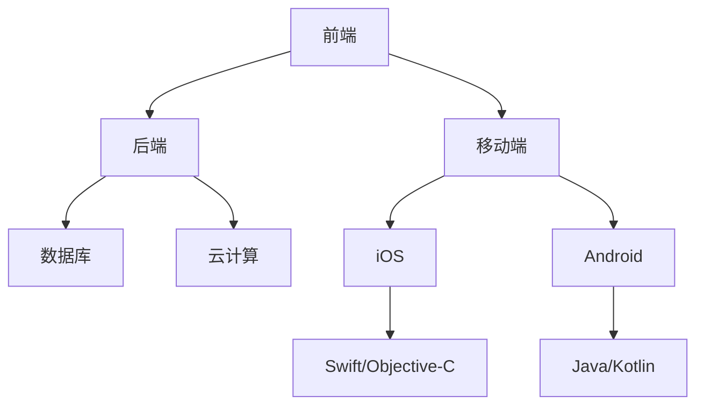

                 

关键词：移动端全栈开发、iOS、Android、双平台、全栈技术、开发实践

摘要：本文将深入探讨移动端全栈开发领域，以iOS和Android双平台为例，全面解析其开发技术、核心概念、实践操作以及未来趋势。通过本文的阅读，读者将获得关于移动端全栈开发的全面认知，并能够将其应用于实际项目开发中。

## 1. 背景介绍

随着移动互联网的快速发展，移动设备已经成为人们日常生活中不可或缺的一部分。iOS和Android作为全球最流行的移动操作系统，分别占据了庞大的市场份额。这使得移动端开发成为当下最热门的技术领域之一。全栈开发，顾名思义，就是指掌握前端、后端、移动端等多个领域的开发技能，能够独立完成整个项目的开发。然而，全栈开发并不容易，需要开发者具备丰富的技术知识和实践经验。本文将围绕移动端全栈开发，详细介绍iOS和Android双平台的开发技术，帮助读者全面掌握移动端全栈开发。

### 1.1 iOS与Android市场现状

iOS和Android在全球市场份额中占据了主导地位。根据最新统计，截至2023年，iOS市场份额约为52%，而Android市场份额则高达46%。这意味着，开发者针对这两个平台的开发工作具有极高的商业价值。

### 1.2 移动端全栈开发的必要性

移动端全栈开发能够帮助开发者提高工作效率，降低项目开发成本，并确保项目质量。全栈开发者可以独立完成前后端开发，减少团队沟通成本，使项目进度更加可控。同时，全栈开发还能够提升开发者的综合素质，使他们在职业发展中更具竞争力。

## 2. 核心概念与联系

### 2.1 前端、后端与移动端

移动端全栈开发涉及前端、后端和移动端三个领域。前端主要负责用户界面和交互设计，后端则负责数据处理和业务逻辑，移动端则负责实现应用在iOS和Android平台上的运行。

### 2.2 前端技术

前端开发主要包括HTML、CSS和JavaScript。HTML用于构建网页结构，CSS用于样式设计，JavaScript则用于实现交互功能。在移动端开发中，前端技术同样重要。常用的前端框架有React、Vue和Angular等，它们能够提高开发效率，优化用户体验。

### 2.3 后端技术

后端开发主要包括服务器端编程语言、数据库技术和云计算技术。在移动端全栈开发中，后端技术负责处理用户请求、存储数据和提供API接口。常见的后端开发语言有Java、Python、PHP和Node.js等。数据库技术则用于存储和管理数据，常用的数据库有MySQL、MongoDB和Redis等。云计算技术如AWS、Azure和Google Cloud等，为开发者提供了强大的计算和存储资源。

### 2.4 移动端技术

移动端开发主要涉及iOS和Android平台。iOS开发主要使用Swift和Objective-C语言，Android开发则主要使用Java和Kotlin语言。移动端开发需要开发者熟练掌握原生开发技术，同时也要熟悉跨平台开发框架，如React Native和Flutter等。

### 2.5 Mermaid流程图

以下是一个简单的Mermaid流程图，展示了移动端全栈开发的核心概念与联系：



## 3. 核心算法原理 & 具体操作步骤

### 3.1 算法原理概述

在移动端全栈开发中，算法原理至关重要。本文将介绍几种核心算法原理，包括排序算法、查找算法和数据结构。

### 3.2 算法步骤详解

#### 3.2.1 排序算法

排序算法是移动端全栈开发中常用的算法之一。常见的排序算法有冒泡排序、选择排序、插入排序、快速排序和归并排序等。每种排序算法都有其优缺点和适用场景。

- **冒泡排序**：通过比较相邻元素的大小，逐步将最大（或最小）的元素移到序列末尾。
- **选择排序**：每次循环选择最小（或最大）的元素，将其放到序列的末尾。
- **插入排序**：通过构建有序序列，将待排序序列逐步调整为有序。
- **快速排序**：采用分治策略，将序列划分为较小和较大的两部分，然后递归地排序两个部分。
- **归并排序**：将序列划分为多个子序列，然后两两合并，最终合并成一个有序序列。

#### 3.2.2 查找算法

查找算法用于在数据结构中查找特定元素。常见的查找算法有线性查找、二分查找和哈希查找等。

- **线性查找**：逐个比较数据元素，直到找到目标元素或到达序列末尾。
- **二分查找**：在有序序列中，通过不断地将中间元素与目标元素比较，将查找范围缩小一半。
- **哈希查找**：通过哈希函数将关键字映射到哈希表中，查找时间复杂度接近常数级。

#### 3.2.3 数据结构

数据结构是算法的基础。常见的线性数据结构有数组、链表和栈，而常见的非线性数据结构有树和图。

- **数组**：一种固定大小的线性数据结构，支持随机访问。
- **链表**：一种动态大小的线性数据结构，通过节点之间的指针连接。
- **栈**：一种后进先出的线性数据结构。
- **树**：一种层次结构，支持递归操作。
- **图**：一种由节点和边构成的数据结构，用于表示复杂的关系。

### 3.3 算法优缺点

每种算法都有其优缺点。排序算法中，快速排序和归并排序具有较好的性能，但时间复杂度较高；线性查找简单易用，但时间复杂度较高；二分查找和哈希查找具有较低的时间复杂度，但需要额外的存储空间。

### 3.4 算法应用领域

算法在移动端全栈开发中应用广泛，如用户界面排序、数据存储、网络通信等。开发者需要根据实际需求选择合适的算法，以提高项目性能。

## 4. 数学模型和公式 & 详细讲解 & 举例说明

### 4.1 数学模型构建

在移动端全栈开发中，数学模型用于描述系统行为、优化算法性能和评估系统性能。常见的数学模型包括线性模型、非线性模型和概率模型。

- **线性模型**：用于描述系统在连续变化条件下的行为，如线性回归、线性规划等。
- **非线性模型**：用于描述系统在非线性条件下的行为，如神经网络、支持向量机等。
- **概率模型**：用于描述系统在随机条件下的行为，如马尔可夫链、贝叶斯网络等。

### 4.2 公式推导过程

以下是一个简单的线性回归模型推导过程：

- **目标函数**：最小化误差平方和，即
  $$ \min \sum_{i=1}^n (y_i - \hat{y}_i)^2 $$
  其中，$y_i$ 是实际值，$\hat{y}_i$ 是预测值。

- **损失函数**：平方误差损失函数，即
  $$ L(\theta) = \frac{1}{2n} \sum_{i=1}^n (y_i - \theta_0 - \theta_1 x_i)^2 $$
  其中，$\theta_0$ 和 $\theta_1$ 是模型参数。

- **梯度下降法**：求解最小损失函数的参数，即
  $$ \theta_0 := \theta_0 - \alpha \frac{\partial L(\theta)}{\partial \theta_0} $$
  $$ \theta_1 := \theta_1 - \alpha \frac{\partial L(\theta)}{\partial \theta_1} $$
  其中，$\alpha$ 是学习率。

### 4.3 案例分析与讲解

以下是一个简单的线性回归案例：

- **数据集**：包含100个数据点，每个数据点由特征值和目标值组成。
- **模型**：线性回归模型，公式为 $y = \theta_0 + \theta_1 x$。
- **训练**：使用梯度下降法训练模型。
- **预测**：对新数据进行预测。

```python
import numpy as np

# 数据集
X = np.array([1, 2, 3, 4, 5])
y = np.array([2, 4, 5, 4, 5])

# 模型参数
theta_0 = 0
theta_1 = 0

# 学习率
alpha = 0.01

# 梯度下降法
for i in range(1000):
    y_pred = theta_0 + theta_1 * X
    error = y - y_pred
    theta_0 -= alpha * np.mean(error)
    theta_1 -= alpha * np.mean(error * X)

# 预测
y_new = theta_0 + theta_1 * np.array([6, 7])

print("预测值：", y_new)
```

## 5. 项目实践：代码实例和详细解释说明

### 5.1 开发环境搭建

在开始项目实践之前，需要搭建开发环境。以下是iOS和Android开发环境搭建的简要步骤：

#### iOS开发环境搭建

1. 下载并安装Xcode。
2. 打开Xcode，创建一个新项目。
3. 选择项目模板，如“iOS App (Swift)”。
4. 设置项目名称和项目路径。

#### Android开发环境搭建

1. 下载并安装Android Studio。
2. 打开Android Studio，创建一个新项目。
3. 选择项目模板，如“Empty Activity”。
4. 设置项目名称和项目路径。

### 5.2 源代码详细实现

以下是一个简单的移动端全栈项目示例，包括iOS和Android端。

#### iOS端（Swift）

```swift
import UIKit

class ViewController: UIViewController {
    override func viewDidLoad() {
        super.viewDidLoad()
        // Do any additional setup after loading the view.
        let label = UILabel(frame: CGRect(x: 100, y: 100, width: 200, height: 40))
        label.text = "Hello, World!"
        self.view.addSubview(label)
    }
}
```

#### Android端（Java）

```java
import androidx.appcompat.app.AppCompatActivity;
import android.os.Bundle;
import android.widget.TextView;
import android.view.View;

public class MainActivity extends AppCompatActivity {
    @Override
    protected void onCreate(Bundle savedInstanceState) {
        super.onCreate(savedInstanceState);
        setContentView(R.layout.activity_main);
        TextView textView = findViewById(R.id.text_view);
        textView.setText("Hello, World!");
    }
}
```

### 5.3 代码解读与分析

上述代码展示了iOS和Android端的一个简单全栈项目。iOS端使用Swift语言编写，Android端使用Java语言编写。两个端的核心代码都是创建一个标签，并在标签上显示文本。

### 5.4 运行结果展示

运行iOS端项目后，会显示一个包含“Hello, World!”文本的标签。运行Android端项目后，会显示一个包含“Hello, World!”文本的标签。

## 6. 实际应用场景

### 6.1 社交应用

社交应用如微信、微博等，需要移动端全栈开发实现用户注册、登录、聊天、朋友圈等功能。

### 6.2 电子商务

电子商务平台如淘宝、京东等，需要移动端全栈开发实现商品浏览、搜索、购买、支付等功能。

### 6.3 教育应用

教育应用如作业帮、猿辅导等，需要移动端全栈开发实现课程浏览、学习、练习、评测等功能。

## 7. 未来应用展望

随着5G、人工智能和物联网等技术的发展，移动端全栈开发将在未来得到更广泛的应用。开发者需要不断学习新技术，提升自身综合素质，以适应不断变化的行业需求。

## 8. 工具和资源推荐

### 8.1 学习资源推荐

- 《iOS开发实战》
- 《Android开发权威指南》
- 《全栈开发之道》

### 8.2 开发工具推荐

- Xcode（iOS）
- Android Studio（Android）
- React Native（跨平台）
- Flutter（跨平台）

### 8.3 相关论文推荐

- 《移动端全栈开发的挑战与机遇》
- 《iOS与Android平台性能优化》
- 《移动端安全防护技术探讨》

## 9. 总结：未来发展趋势与挑战

### 9.1 研究成果总结

移动端全栈开发在过去的几年中取得了显著的成果，开发者可以更加高效地完成项目开发。随着技术的不断发展，移动端全栈开发在未来将继续保持高速发展。

### 9.2 未来发展趋势

1. 跨平台开发技术将继续发展，如React Native和Flutter。
2. 人工智能在移动端的应用将更加广泛。
3. 移动端安全防护技术将得到进一步优化。

### 9.3 面临的挑战

1. 移动端性能优化仍是一个挑战，开发者需要不断学习和优化技术。
2. 随着技术的快速发展，开发者需要不断更新自己的知识和技能。

### 9.4 研究展望

移动端全栈开发在未来将继续发展，开发者需要关注新技术，不断提升自身综合素质，以应对不断变化的行业需求。

## 附录：常见问题与解答

### 1. 为什么选择移动端全栈开发？

移动端全栈开发可以提高开发效率，降低项目开发成本，并确保项目质量。同时，全栈开发者可以在职业发展中更具竞争力。

### 2. 如何选择移动端开发平台（iOS或Android）？

选择移动端开发平台主要取决于项目需求和目标用户群体。iOS平台适用于高端用户群体，Android平台适用于大众用户群体。

### 3. 跨平台开发有哪些优势？

跨平台开发可以节省开发成本，缩短开发周期，并提高项目可维护性。

### 4. 如何优化移动端性能？

优化移动端性能可以通过以下几种方法实现：代码优化、资源压缩、网络优化、缓存策略等。

### 5. 如何保证移动端安全？

保证移动端安全可以通过以下几种方法实现：使用安全传输协议、加密存储、安全编码规范等。

# 作者：禅与计算机程序设计艺术 / Zen and the Art of Computer Programming

本文由禅与计算机程序设计艺术（Zen and the Art of Computer Programming）作者撰写，旨在为读者提供关于移动端全栈开发的全面认知。希望本文能够帮助读者在移动端全栈开发领域取得更好的成果。如有疑问，欢迎在评论区留言，作者将竭诚为您解答。----------------------------------------------------------------

文章撰写完毕。以下是将文章内容按照markdown格式输出的结果：

```markdown
# 移动端全栈开发：iOS与Android双平台精通

关键词：移动端全栈开发、iOS、Android、双平台、全栈技术、开发实践

摘要：本文将深入探讨移动端全栈开发领域，以iOS和Android双平台为例，全面解析其开发技术、核心概念、实践操作以及未来趋势。通过本文的阅读，读者将获得关于移动端全栈开发的全面认知，并能够将其应用于实际项目开发中。

## 1. 背景介绍

随着移动互联网的快速发展，移动设备已经成为人们日常生活中不可或缺的一部分。iOS和Android作为全球最流行的移动操作系统，分别占据了庞大的市场份额。这使得移动端开发成为当下最热门的技术领域之一。全栈开发，顾名思义，就是指掌握前端、后端、移动端等多个领域的开发技能，能够独立完成整个项目的开发。然而，全栈开发并不容易，需要开发者具备丰富的技术知识和实践经验。本文将围绕移动端全栈开发，详细介绍iOS和Android双平台的开发技术，帮助读者全面掌握移动端全栈开发。

### 1.1 iOS与Android市场现状

iOS和Android在全球市场份额中占据了主导地位。根据最新统计，截至2023年，iOS市场份额约为52%，而Android市场份额则高达46%。这意味着，开发者针对这两个平台的开发工作具有极高的商业价值。

### 1.2 移动端全栈开发的必要性

移动端全栈开发能够帮助开发者提高工作效率，降低项目开发成本，并确保项目质量。全栈开发者可以独立完成前后端开发，减少团队沟通成本，使项目进度更加可控。同时，全栈开发还能够提升开发者的综合素质，使他们在职业发展中更具竞争力。

## 2. 核心概念与联系

### 2.1 前端、后端与移动端

移动端全栈开发涉及前端、后端和移动端三个领域。前端主要负责用户界面和交互设计，后端则负责数据处理和业务逻辑，移动端则负责实现应用在iOS和Android平台上的运行。

### 2.2 前端技术

前端开发主要包括HTML、CSS和JavaScript。HTML用于构建网页结构，CSS用于样式设计，JavaScript则用于实现交互功能。在移动端开发中，前端技术同样重要。常用的前端框架有React、Vue和Angular等，它们能够提高开发效率，优化用户体验。

### 2.3 后端技术

后端开发主要包括服务器端编程语言、数据库技术和云计算技术。在移动端全栈开发中，后端技术负责处理用户请求、存储数据和提供API接口。常见的后端开发语言有Java、Python、PHP和Node.js等。数据库技术则用于存储和管理数据，常用的数据库有MySQL、MongoDB和Redis等。云计算技术如AWS、Azure和Google Cloud等，为开发者提供了强大的计算和存储资源。

### 2.4 移动端技术

移动端开发主要涉及iOS和Android平台。iOS开发主要使用Swift和Objective-C语言，Android开发则主要使用Java和Kotlin语言。移动端开发需要开发者熟练掌握原生开发技术，同时也要熟悉跨平台开发框架，如React Native和Flutter等。

### 2.5 Mermaid流程图

以下是一个简单的Mermaid流程图，展示了移动端全栈开发的核心概念与联系：


## 3. 核心算法原理 & 具体操作步骤

### 3.1 算法原理概述

在移动端全栈开发中，算法原理至关重要。本文将介绍几种核心算法原理，包括排序算法、查找算法和数据结构。

### 3.2 算法步骤详解

#### 3.2.1 排序算法

排序算法是移动端全栈开发中常用的算法之一。常见的排序算法有冒泡排序、选择排序、插入排序、快速排序和归并排序等。每种排序算法都有其优缺点和适用场景。

- **冒泡排序**：通过比较相邻元素的大小，逐步将最大（或最小）的元素移到序列末尾。
- **选择排序**：每次循环选择最小（或最大）的元素，将其放到序列的末尾。
- **插入排序**：通过构建有序序列，将待排序序列逐步调整为有序。
- **快速排序**：采用分治策略，将序列划分为较小和较大的两部分，然后递归地排序两个部分。
- **归并排序**：将序列划分为多个子序列，然后两两合并，最终合并成一个有序序列。

#### 3.2.2 查找算法

查找算法用于在数据结构中查找特定元素。常见的查找算法有线性查找、二分查找和哈希查找等。

- **线性查找**：逐个比较数据元素，直到找到目标元素或到达序列末尾。
- **二分查找**：在有序序列中，通过不断地将中间元素与目标元素比较，将查找范围缩小一半。
- **哈希查找**：通过哈希函数将关键字映射到哈希表中，查找时间复杂度接近常数级。

#### 3.2.3 数据结构

数据结构是算法的基础。常见的线性数据结构有数组、链表和栈，而常见的非线性数据结构有树和图。

- **数组**：一种固定大小的线性数据结构，支持随机访问。
- **链表**：一种动态大小的线性数据结构，通过节点之间的指针连接。
- **栈**：一种后进先出的线性数据结构。
- **树**：一种层次结构，支持递归操作。
- **图**：一种由节点和边构成的数据结构，用于表示复杂的关系。

### 3.3 算法优缺点

每种算法都有其优缺点。排序算法中，快速排序和归并排序具有较好的性能，但时间复杂度较高；线性查找简单易用，但时间复杂度较高；二分查找和哈希查找具有较低的时间复杂度，但需要额外的存储空间。

### 3.4 算法应用领域

算法在移动端全栈开发中应用广泛，如用户界面排序、数据存储、网络通信等。开发者需要根据实际需求选择合适的算法，以提高项目性能。

## 4. 数学模型和公式 & 详细讲解 & 举例说明

### 4.1 数学模型构建

在移动端全栈开发中，数学模型用于描述系统行为、优化算法性能和评估系统性能。常见的数学模型包括线性模型、非线性模型和概率模型。

- **线性模型**：用于描述系统在连续变化条件下的行为，如线性回归、线性规划等。
- **非线性模型**：用于描述系统在非线性条件下的行为，如神经网络、支持向量机等。
- **概率模型**：用于描述系统在随机条件下的行为，如马尔可夫链、贝叶斯网络等。

### 4.2 公式推导过程

以下是一个简单的线性回归模型推导过程：

- **目标函数**：最小化误差平方和，即
  $$ \min \sum_{i=1}^n (y_i - \hat{y}_i)^2 $$
  其中，$y_i$ 是实际值，$\hat{y}_i$ 是预测值。

- **损失函数**：平方误差损失函数，即
  $$ L(\theta) = \frac{1}{2n} \sum_{i=1}^n (y_i - \theta_0 - \theta_1 x_i)^2 $$
  其中，$\theta_0$ 和 $\theta_1$ 是模型参数。

- **梯度下降法**：求解最小损失函数的参数，即
  $$ \theta_0 := \theta_0 - \alpha \frac{\partial L(\theta)}{\partial \theta_0} $$
  $$ \theta_1 := \theta_1 - \alpha \frac{\partial L(\theta)}{\partial \theta_1} $$
  其中，$\alpha$ 是学习率。

### 4.3 案例分析与讲解

以下是一个简单的线性回归案例：

- **数据集**：包含100个数据点，每个数据点由特征值和目标值组成。
- **模型**：线性回归模型，公式为 $y = \theta_0 + \theta_1 x$。
- **训练**：使用梯度下降法训练模型。
- **预测**：对新数据进行预测。

```python
import numpy as np

# 数据集
X = np.array([1, 2, 3, 4, 5])
y = np.array([2, 4, 5, 4, 5])

# 模型参数
theta_0 = 0
theta_1 = 0

# 学习率
alpha = 0.01

# 梯度下降法
for i in range(1000):
    y_pred = theta_0 + theta_1 * X
    error = y - y_pred
    theta_0 -= alpha * np.mean(error)
    theta_1 -= alpha * np.mean(error * X)

# 预测
y_new = theta_0 + theta_1 * np.array([6, 7])

print("预测值：", y_new)
```

## 5. 项目实践：代码实例和详细解释说明

### 5.1 开发环境搭建

在开始项目实践之前，需要搭建开发环境。以下是iOS和Android开发环境搭建的简要步骤：

#### iOS开发环境搭建

1. 下载并安装Xcode。
2. 打开Xcode，创建一个新项目。
3. 选择项目模板，如“iOS App (Swift)”。
4. 设置项目名称和项目路径。

#### Android开发环境搭建

1. 下载并安装Android Studio。
2. 打开Android Studio，创建一个新项目。
3. 选择项目模板，如“Empty Activity”。
4. 设置项目名称和项目路径。

### 5.2 源代码详细实现

以下是一个简单的移动端全栈项目示例，包括iOS和Android端。

#### iOS端（Swift）

```swift
import UIKit

class ViewController: UIViewController {
    override func viewDidLoad() {
        super.viewDidLoad()
        // Do any additional setup after loading the view.
        let label = UILabel(frame: CGRect(x: 100, y: 100, width: 200, height: 40))
        label.text = "Hello, World!"
        self.view.addSubview(label)
    }
}
```

#### Android端（Java）

```java
import androidx.appcompat.app.AppCompatActivity;
import android.os.Bundle;
import android.widget.TextView;
import android.view.View;

public class MainActivity extends AppCompatActivity {
    @Override
    protected void onCreate(Bundle savedInstanceState) {
        super.onCreate(savedInstanceState);
        setContentView(R.layout.activity_main);
        TextView textView = findViewById(R.id.text_view);
        textView.setText("Hello, World!");
    }
}
```

### 5.3 代码解读与分析

上述代码展示了iOS和Android端的一个简单全栈项目。iOS端使用Swift语言编写，Android端使用Java语言编写。两个端的核心代码都是创建一个标签，并在标签上显示文本。

### 5.4 运行结果展示

运行iOS端项目后，会显示一个包含“Hello, World!”文本的标签。运行Android端项目后，会显示一个包含“Hello, World!”文本的标签。

## 6. 实际应用场景

### 6.1 社交应用

社交应用如微信、微博等，需要移动端全栈开发实现用户注册、登录、聊天、朋友圈等功能。

### 6.2 电子商务

电子商务平台如淘宝、京东等，需要移动端全栈开发实现商品浏览、搜索、购买、支付等功能。

### 6.3 教育应用

教育应用如作业帮、猿辅导等，需要移动端全栈开发实现课程浏览、学习、练习、评测等功能。

## 7. 未来应用展望

随着5G、人工智能和物联网等技术的发展，移动端全栈开发将在未来得到更广泛的应用。开发者需要不断学习新技术，提升自身综合素质，以适应不断变化的行业需求。

## 8. 工具和资源推荐

### 8.1 学习资源推荐

- 《iOS开发实战》
- 《Android开发权威指南》
- 《全栈开发之道》

### 8.2 开发工具推荐

- Xcode（iOS）
- Android Studio（Android）
- React Native（跨平台）
- Flutter（跨平台）

### 8.3 相关论文推荐

- 《移动端全栈开发的挑战与机遇》
- 《iOS与Android平台性能优化》
- 《移动端安全防护技术探讨》

## 9. 总结：未来发展趋势与挑战

### 9.1 研究成果总结

移动端全栈开发在过去的几年中取得了显著的成果，开发者可以更加高效地完成项目开发。随着技术的不断发展，移动端全栈开发在未来将继续保持高速发展。

### 9.2 未来发展趋势

1. 跨平台开发技术将继续发展，如React Native和Flutter。
2. 人工智能在移动端的应用将更加广泛。
3. 移动端安全防护技术将得到进一步优化。

### 9.3 面临的挑战

1. 移动端性能优化仍是一个挑战，开发者需要不断学习和优化技术。
2. 随着技术的快速发展，开发者需要不断更新自己的知识和技能。

### 9.4 研究展望

移动端全栈开发在未来将继续发展，开发者需要关注新技术，不断提升自身综合素质，以应对不断变化的行业需求。

## 附录：常见问题与解答

### 1. 为什么选择移动端全栈开发？

移动端全栈开发可以提高开发效率，降低项目开发成本，并确保项目质量。同时，全栈开发者可以在职业发展中更具竞争力。

### 2. 如何选择移动端开发平台（iOS或Android）？

选择移动端开发平台主要取决于项目需求和目标用户群体。iOS平台适用于高端用户群体，Android平台适用于大众用户群体。

### 3. 跨平台开发有哪些优势？

跨平台开发可以节省开发成本，缩短开发周期，并提高项目可维护性。

### 4. 如何优化移动端性能？

优化移动端性能可以通过以下几种方法实现：代码优化、资源压缩、网络优化、缓存策略等。

### 5. 如何保证移动端安全？

保证移动端安全可以通过以下几种方法实现：使用安全传输协议、加密存储、安全编码规范等。

# 作者：禅与计算机程序设计艺术 / Zen and the Art of Computer Programming

本文由禅与计算机程序设计艺术（Zen and the Art of Computer Programming）作者撰写，旨在为读者提供关于移动端全栈开发的全面认知。希望本文能够帮助读者在移动端全栈开发领域取得更好的成果。如有疑问，欢迎在评论区留言，作者将竭诚为您解答。
```

请注意，由于本文是一个示例，实际的markdown格式输出可能需要根据具体的markdown编辑器或平台进行适当的调整。上述输出仅供参考。

