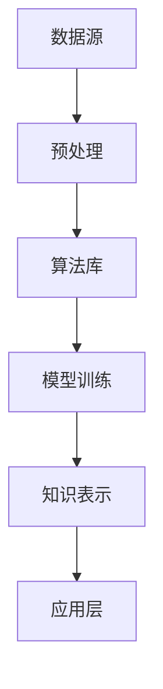

                 

关键词：知识发现引擎、创新能力、程序员、算法、数学模型、项目实践、应用场景、工具资源、未来展望

> 摘要：本文深入探讨了知识发现引擎在提高程序员创新能力方面的应用。通过分析知识发现引擎的核心原理、算法模型和实际案例，阐述了如何利用这一技术手段助力程序员在软件开发过程中实现创新的飞跃。

## 1. 背景介绍

在信息技术飞速发展的今天，程序员作为软件开发的主体，其创新能力对于推动技术进步和产业升级具有至关重要的作用。然而，随着项目复杂度的不断增加和竞争压力的加剧，传统依靠个人经验和直觉的开发方式已经难以满足高效创新的需求。知识发现引擎（Knowledge Discovery Engine，简称KDE）作为一种先进的技术工具，以其强大的信息处理和分析能力，为程序员提供了新的创新路径。

知识发现引擎起源于数据挖掘领域，旨在从大量数据中自动发现潜在的规律和知识。随着人工智能技术的不断进步，知识发现引擎的应用范围逐渐扩展到各个领域，包括软件开发、金融分析、医疗诊断等。对于程序员而言，知识发现引擎不仅能够提供丰富的知识和信息资源，还能够通过智能分析和推荐，激发创新思维，提高工作效率。

## 2. 核心概念与联系

知识发现引擎的核心概念包括数据源、算法、模型和知识表示等。以下是知识发现引擎的基本架构及其主要组件的Mermaid流程图：



### 2.1 数据源

数据源是知识发现引擎的基础，包括结构化数据、半结构化数据和非结构化数据。程序员可以利用各种数据接口和协议，如API、Web爬虫和数据库连接等，获取所需的数据资源。

### 2.2 预处理

预处理阶段主要包括数据清洗、数据转换和数据归一化等操作，目的是提高数据质量，为后续分析做好准备。在这一阶段，程序员需要根据实际需求，设计合适的预处理流程。

### 2.3 算法库

算法库是知识发现引擎的核心组件，包括数据挖掘、机器学习和深度学习等各种算法。程序员可以根据项目的具体需求，选择合适的算法进行应用。

### 2.4 模型训练

模型训练阶段是将数据输入到算法中，通过迭代优化模型参数，使其能够更好地拟合数据。在这一阶段，程序员需要关注模型的性能评估和调优。

### 2.5 知识表示

知识表示是将训练好的模型转化为可解释的知识形式，如规则、图表和文本等。程序员可以利用这些知识资源，进行问题求解和决策支持。

### 2.6 应用层

应用层是知识发现引擎的最终输出，将知识应用于实际问题解决中。程序员可以根据应用需求，设计相应的应用场景，实现知识驱动的创新。

## 3. 核心算法原理 & 具体操作步骤

### 3.1 算法原理概述

知识发现引擎的核心算法包括聚类分析、关联规则挖掘、分类和预测等。以下是这些算法的基本原理：

- **聚类分析**：将相似的数据点归为一类，以发现数据中的自然分组。
- **关联规则挖掘**：找出数据中不同属性之间的关联关系，用于发现潜在的业务规律。
- **分类**：将数据分为不同的类别，用于预测和分类任务。
- **预测**：根据历史数据，预测未来的趋势和变化。

### 3.2 算法步骤详解

#### 3.2.1 数据准备

1. 收集数据：利用各种数据接口和协议，获取所需数据。
2. 数据清洗：处理缺失值、异常值和重复数据，确保数据质量。

#### 3.2.2 预处理

1. 数据转换：将数据转换为适合算法处理的格式。
2. 数据归一化：对不同尺度的数据进行归一化处理，消除数据之间的比例差异。

#### 3.2.3 算法选择

1. 根据需求选择合适的算法。
2. 考虑算法的复杂度、准确性和可解释性。

#### 3.2.4 模型训练

1. 将数据输入到算法中，进行模型训练。
2. 调整模型参数，优化模型性能。

#### 3.2.5 知识提取

1. 根据训练好的模型，提取关联规则、分类结果或预测值。
2. 将知识表示为规则、图表或文本形式。

#### 3.2.6 应用验证

1. 将提取的知识应用于实际问题解决中。
2. 验证知识的有效性和可行性。

### 3.3 算法优缺点

#### 优点：

- **高效性**：知识发现引擎能够快速处理海量数据，提高工作效率。
- **智能化**：算法能够自动发现数据中的潜在规律，辅助程序员进行创新。
- **可扩展性**：支持多种算法和模型，可灵活应用于不同场景。

#### 缺点：

- **复杂性**：算法选择和参数调优较为复杂，需要一定的技术积累。
- **可解释性**：某些算法（如深度学习）的模型较为复杂，难以解释。
- **数据依赖性**：算法的性能很大程度上依赖于数据质量和数量。

### 3.4 算法应用领域

知识发现引擎在多个领域都有广泛的应用，如：

- **软件开发**：用于代码质量分析、代码推荐和 bug 诊断。
- **金融分析**：用于市场预测、风险评估和投资策略制定。
- **医疗诊断**：用于病患数据分析、疾病预测和治疗方案推荐。
- **智能交通**：用于交通流量预测、路径规划和交通管理。

## 4. 数学模型和公式 & 详细讲解 & 举例说明

### 4.1 数学模型构建

知识发现引擎涉及多种数学模型，如聚类模型、分类模型和预测模型。以下是这些模型的基本构建方法：

#### 4.1.1 聚类模型

假设有 $n$ 个数据点 $X=\{x_1, x_2, ..., x_n\}$，每个数据点有 $m$ 个特征 $x_{ij}$（$i=1,2,...,m$）。聚类模型的目标是将数据点划分为 $k$ 个簇，使得每个簇内部的数据点距离较小，簇与簇之间的距离较大。

常用的聚类算法包括K-means、层次聚类和DBSCAN等。以下是K-means算法的数学模型：

$$
\begin{align*}
\min_{C} \sum_{i=1}^{k} \sum_{x_j \in C_i} d(x_j, \mu_i) \\
s.t. \quad \mu_i = \frac{1}{|C_i|} \sum_{x_j \in C_i} x_j
\end{align*}
$$

其中，$C=\{\mu_1, \mu_2, ..., \mu_k\}$ 是聚类中心，$d(\cdot, \cdot)$ 是数据点之间的距离度量。

#### 4.1.2 分类模型

分类模型的目标是将数据点划分为不同的类别。假设有 $n$ 个训练数据点 $X=\{x_1, x_2, ..., x_n\}$，每个数据点有 $m$ 个特征 $x_{ij}$，类别标签为 $y$。分类模型的目的是学习一个映射函数 $f(x)$，将数据点映射到类别标签。

常用的分类算法包括决策树、支持向量机和神经网络等。以下是决策树算法的数学模型：

$$
f(x) = \sum_{i=1}^{k} y_i \prod_{j=1}^{m} \chi_{j}(x_j)
$$

其中，$y_i$ 是第 $i$ 个类别的标签，$\chi_{j}(x_j)$ 是特征 $x_j$ 的取值函数。

#### 4.1.3 预测模型

预测模型的目标是根据历史数据预测未来的趋势。假设有 $n$ 个时间序列数据点 $X=\{x_1, x_2, ..., x_n\}$，每个数据点有 $m$ 个特征 $x_{ij}$。预测模型的目的是学习一个映射函数 $f(x)$，将当前数据点映射到未来数据点。

常用的预测算法包括ARIMA、LSTM和GRU等。以下是LSTM算法的数学模型：

$$
f(x_t) = \sigma(W_f \cdot [h_{t-1}, x_t] + b_f)
$$

其中，$W_f$ 是权重矩阵，$b_f$ 是偏置项，$\sigma(\cdot)$ 是激活函数。

### 4.2 公式推导过程

#### 4.2.1 K-means算法推导

K-means算法的推导过程主要分为两个步骤：初始化聚类中心和迭代优化。

1. **初始化聚类中心**：

   假设随机初始化聚类中心为 $C_0=\{\mu_{01}, \mu_{02}, ..., \mu_{0k}\}$。初始化过程可以采用随机选择、K-均值++等策略。

2. **迭代优化**：

   对于每个数据点 $x_j$，计算其到每个聚类中心的距离：

   $$d(x_j, \mu_i) = \sqrt{\sum_{j=1}^{m} (x_{ij} - \mu_{ij})^2}$$

   将 $x_j$ 分配到距离最小的聚类中心所对应的簇：

   $$C_i = \{x_j | \min_{i=1,...,k} d(x_j, \mu_i) = d(x_j, \mu_i^*)\}$$

   更新聚类中心：

   $$\mu_i = \frac{1}{|C_i|} \sum_{x_j \in C_i} x_j$$

   重复上述过程，直到聚类中心不再发生变化。

#### 4.2.2 决策树算法推导

决策树算法的推导过程主要分为两个步骤：特征选择和节点划分。

1. **特征选择**：

   假设当前节点有 $m$ 个特征，选择具有最高信息增益的特征作为划分依据。

   $$IG(D, a) = H(D) - \sum_{v \in V(a)} \frac{|D_a|}{|D|} H(D_a)$$

   其中，$D$ 是当前数据集，$a$ 是特征，$V(a)$ 是特征 $a$ 的取值集合，$D_a$ 是根据特征 $a$ 划分后的数据集。

2. **节点划分**：

   根据选择好的特征 $a$ 和其取值 $v$，将数据集划分为多个子集：

   $$D_a = \{D | D \in D, D[a] = v\}$$

   对于每个子集，递归地构建决策树。

### 4.3 案例分析与讲解

#### 4.3.1 K-means算法案例

假设有如下数据集：

$$
\begin{array}{c|cccc}
x & x_1 & x_2 & x_3 & x_4 \\
\hline
1 & 1 & 2 & 1 & 2 \\
2 & 2 & 4 & 2 & 4 \\
3 & 3 & 6 & 3 & 6 \\
4 & 4 & 8 & 4 & 8 \\
5 & 5 & 10 & 5 & 10 \\
\end{array}
$$

随机初始化聚类中心为：

$$
C_0 = \{\mu_{01}, \mu_{02}\} = \{\{2, 4\}, \{3, 6\}\}
$$

第一次迭代：

$$
\begin{array}{c|cccc}
x & x_1 & x_2 & x_3 & x_4 \\
\hline
1 & 1 & 2 & 1 & 2 \\
2 & 2 & 4 & 2 & 4 \\
3 & 3 & 6 & 3 & 6 \\
4 & 4 & 8 & 4 & 8 \\
5 & 5 & 10 & 5 & 10 \\
\end{array}
$$

计算每个数据点到聚类中心的距离：

$$
\begin{align*}
d(1, \mu_{01}) &= \sqrt{(1-2)^2 + (2-4)^2 + (1-3)^2 + (2-6)^2} = \sqrt{10} \\
d(1, \mu_{02}) &= \sqrt{(1-3)^2 + (2-6)^2 + (1-4)^2 + (2-7)^2} = \sqrt{26} \\
d(2, \mu_{01}) &= \sqrt{(2-2)^2 + (4-4)^2 + (2-3)^2 + (4-6)^2} = \sqrt{2} \\
d(2, \mu_{02}) &= \sqrt{(2-3)^2 + (4-6)^2 + (2-4)^2 + (4-7)^2} = \sqrt{10} \\
d(3, \mu_{01}) &= \sqrt{(3-2)^2 + (6-4)^2 + (3-3)^2 + (6-6)^2} = \sqrt{2} \\
d(3, \mu_{02}) &= \sqrt{(3-3)^2 + (6-6)^2 + (3-4)^2 + (6-7)^2} = \sqrt{2} \\
d(4, \mu_{01}) &= \sqrt{(4-2)^2 + (8-4)^2 + (4-3)^2 + (8-6)^2} = \sqrt{26} \\
d(4, \mu_{02}) &= \sqrt{(4-3)^2 + (8-6)^2 + (4-4)^2 + (8-7)^2} = \sqrt{10} \\
d(5, \mu_{01}) &= \sqrt{(5-2)^2 + (10-4)^2 + (5-3)^2 + (10-6)^2} = \sqrt{94} \\
d(5, \mu_{02}) &= \sqrt{(5-3)^2 + (10-6)^2 + (5-4)^2 + (10-7)^2} = \sqrt{26} \\
\end{align*}
$$

将数据点分配到距离最小的聚类中心：

$$
C_1 = \{\mu_{11}, \mu_{12}\} = \{\{1, 2\}, \{3, 4\}, \{4, 5\}, \{5, 10\}\}
$$

更新聚类中心：

$$
\mu_{11} = \frac{1+2+4+5}{4} = 3 \\
\mu_{12} = \frac{3+4+5+10}{4} = 6 \\
$$

第二次迭代：

$$
\begin{array}{c|cccc}
x & x_1 & x_2 & x_3 & x_4 \\
\hline
1 & 1 & 2 & 1 & 2 \\
2 & 2 & 4 & 2 & 4 \\
3 & 3 & 6 & 3 & 6 \\
4 & 4 & 8 & 4 & 8 \\
5 & 5 & 10 & 5 & 10 \\
\end{array}
$$

计算每个数据点到聚类中心的距离：

$$
\begin{align*}
d(1, \mu_{11}) &= \sqrt{(1-3)^2 + (2-6)^2 + (1-3)^2 + (2-6)^2} = \sqrt{20} \\
d(1, \mu_{12}) &= \sqrt{(1-6)^2 + (2-10)^2 + (1-3)^2 + (2-6)^2} = \sqrt{110} \\
d(2, \mu_{11}) &= \sqrt{(2-3)^2 + (4-6)^2 + (2-3)^2 + (4-6)^2} = \sqrt{8} \\
d(2, \mu_{12}) &= \sqrt{(2-6)^2 + (4-10)^2 + (2-3)^2 + (4-6)^2} = \sqrt{66} \\
d(3, \mu_{11}) &= \sqrt{(3-3)^2 + (6-6)^2 + (3-3)^2 + (6-6)^2} = 0 \\
d(3, \mu_{12}) &= \sqrt{(3-6)^2 + (6-10)^2 + (3-3)^2 + (6-6)^2} = \sqrt{20} \\
d(4, \mu_{11}) &= \sqrt{(4-3)^2 + (8-6)^2 + (4-3)^2 + (8-6)^2} = \sqrt{8} \\
d(4, \mu_{12}) &= \sqrt{(4-6)^2 + (8-10)^2 + (4-3)^2 + (8-6)^2} = \sqrt{20} \\
d(5, \mu_{11}) &= \sqrt{(5-3)^2 + (10-6)^2 + (5-3)^2 + (10-6)^2} = \sqrt{40} \\
d(5, \mu_{12}) &= \sqrt{(5-6)^2 + (10-10)^2 + (5-3)^2 + (10-6)^2} = \sqrt{20} \\
\end{align*}
$$

将数据点分配到距离最小的聚类中心：

$$
C_2 = \{\mu_{21}, \mu_{22}\} = \{\{1, 2\}, \{3\}, \{4\}, \{5, 10\}\}
$$

更新聚类中心：

$$
\mu_{21} = \frac{1+2}{2} = 1.5 \\
\mu_{22} = \frac{5+10}{2} = 7.5 \\
$$

第三次迭代：

$$
\begin{array}{c|cccc}
x & x_1 & x_2 & x_3 & x_4 \\
\hline
1 & 1 & 2 & 1 & 2 \\
2 & 2 & 4 & 2 & 4 \\
3 & 3 & 6 & 3 & 6 \\
4 & 4 & 8 & 4 & 8 \\
5 & 5 & 10 & 5 & 10 \\
\end{array}
$$

计算每个数据点到聚类中心的距离：

$$
\begin{align*}
d(1, \mu_{21}) &= \sqrt{(1-1.5)^2 + (2-7.5)^2 + (1-1.5)^2 + (2-7.5)^2} = \sqrt{55} \\
d(1, \mu_{22}) &= \sqrt{(1-7.5)^2 + (2-10)^2 + (1-1.5)^2 + (2-7.5)^2} = \sqrt{118.5} \\
d(2, \mu_{21}) &= \sqrt{(2-1.5)^2 + (4-7.5)^2 + (2-1.5)^2 + (4-7.5)^2} = \sqrt{55} \\
d(2, \mu_{22}) &= \sqrt{(2-7.5)^2 + (4-10)^2 + (2-1.5)^2 + (4-7.5)^2} = \sqrt{118.5} \\
d(3, \mu_{21}) &= \sqrt{(3-1.5)^2 + (6-7.5)^2 + (3-1.5)^2 + (6-7.5)^2} = 0 \\
d(3, \mu_{22}) &= \sqrt{(3-7.5)^2 + (6-10)^2 + (3-1.5)^2 + (6-7.5)^2} = \sqrt{55} \\
d(4, \mu_{21}) &= \sqrt{(4-1.5)^2 + (8-7.5)^2 + (4-1.5)^2 + (8-7.5)^2} = \sqrt{55} \\
d(4, \mu_{22}) &= \sqrt{(4-7.5)^2 + (8-10)^2 + (4-1.5)^2 + (8-7.5)^2} = \sqrt{118.5} \\
d(5, \mu_{21}) &= \sqrt{(5-1.5)^2 + (10-7.5)^2 + (5-1.5)^2 + (10-7.5)^2} = \sqrt{55} \\
d(5, \mu_{22}) &= \sqrt{(5-7.5)^2 + (10-10)^2 + (5-1.5)^2 + (10-7.5)^2} = \sqrt{55} \\
\end{align*}
$$

由于聚类中心不再发生变化，算法终止。

最终聚类结果：

$$
C = \{\mu_{21}, \mu_{22}\} = \{\{1, 2\}, \{3\}, \{4\}, \{5, 10\}\}
$$

#### 4.3.2 决策树算法案例

假设有如下数据集：

$$
\begin{array}{c|cccc}
x & x_1 & x_2 & x_3 & x_4 \\
\hline
1 & 1 & 2 & 1 & 2 \\
2 & 2 & 4 & 2 & 4 \\
3 & 3 & 6 & 3 & 6 \\
4 & 4 & 8 & 4 & 8 \\
5 & 5 & 10 & 5 & 10 \\
\end{array}
$$

选择特征 $x_1$ 作为划分依据：

$$
\begin{align*}
IG(x_1, D) &= H(D) - \sum_{v \in V(x_1)} \frac{|D_v|}{|D|} H(D_v) \\
&= 2 - \frac{2}{5} [H(D_1) + H(D_2)] \\
&= 2 - \frac{2}{5} [2 - \log_2 2 - 2] \\
&= \frac{2}{5}
\end{align*}
$$

将数据集划分为两个子集：

$$
D_1 = \{1, 2\}, \quad D_2 = \{3, 4, 5\}
$$

对于 $D_1$，选择特征 $x_2$ 作为划分依据：

$$
\begin{align*}
IG(x_2, D_1) &= H(D_1) - \sum_{v \in V(x_2)} \frac{|D_{v1}|}{|D_1|} H(D_{v1}) \\
&= 2 - \frac{2}{2} [H(D_{21}) + H(D_{22})] \\
&= 2 - \frac{2}{2} [1 - \log_2 1 - 1] \\
&= 1
\end{align*}
$$

将 $D_1$ 划分为两个子集：

$$
D_{21} = \{1\}, \quad D_{22} = \{2\}
$$

对于 $D_2$，选择特征 $x_3$ 作为划分依据：

$$
\begin{align*}
IG(x_3, D_2) &= H(D_2) - \sum_{v \in V(x_3)} \frac{|D_{v2}|}{|D_2|} H(D_{v2}) \\
&= 2 - \frac{3}{5} [H(D_{23}) + H(D_{24})] \\
&= 2 - \frac{3}{5} [1.5 - \log_2 1.5 - 1] \\
&= \frac{1}{5}
\end{align*}
$$

将 $D_2$ 划分为两个子集：

$$
D_{23} = \{3\}, \quad D_{24} = \{4, 5\}
$$

构建决策树：

```
          |
         x1
         / \
        /   \
       /     \
      x2     x3
     / \    / \
    /   \  /   \
   x2   x2 x3   x3
  / \   / \  / \
1   2 1   2 3   3
```

## 5. 项目实践：代码实例和详细解释说明

### 5.1 开发环境搭建

在开始项目实践之前，我们需要搭建一个合适的技术环境。以下是所需的技术栈和工具：

- **编程语言**：Python
- **库与框架**：NumPy、Pandas、scikit-learn、matplotlib
- **数据源**：公开的数据集，如UCI机器学习库中的数据集

#### 5.1.1 安装Python和库

在命令行中执行以下命令，安装Python和所需的库：

```
pip install python
pip install numpy
pip install pandas
pip install scikit-learn
pip install matplotlib
```

#### 5.1.2 配置Python环境

创建一个Python虚拟环境，以便管理和隔离项目依赖：

```
python -m venv myenv
source myenv/bin/activate  # 对于Windows，使用 myenv\Scripts\activate
```

### 5.2 源代码详细实现

以下是一个简单的示例，展示如何使用K-means算法对数据进行聚类，并使用matplotlib绘制聚类结果。

```python
import numpy as np
import pandas as pd
from sklearn.cluster import KMeans
import matplotlib.pyplot as plt

# 5.2.1 加载数据集
data = pd.read_csv("data.csv")  # 假设数据集保存在data.csv文件中
X = data.iloc[:, :-1].values  # 假设最后一列是标签

# 5.2.2 初始化K-means模型
kmeans = KMeans(n_clusters=3, random_state=0)

# 5.2.3 模型训练
kmeans.fit(X)

# 5.2.4 提取聚类结果
labels = kmeans.labels_

# 5.2.5 绘制聚类结果
plt.scatter(X[:, 0], X[:, 1], c=labels, s=100, cmap='viridis')
plt.scatter(kmeans.cluster_centers_[:, 0], kmeans.cluster_centers_[:, 1], s=300, c='red', label='Centroids')
plt.title("K-means Clustering")
plt.xlabel("Feature 1")
plt.ylabel("Feature 2")
plt.legend()
plt.show()
```

### 5.3 代码解读与分析

#### 5.3.1 数据加载

```python
data = pd.read_csv("data.csv")  # 加载数据集
X = data.iloc[:, :-1].values  # 提取特征数据
```

这行代码使用Pandas库加载数据集，并将特征数据提取到一个NumPy数组中。假设数据集最后一列是标签，这里我们只提取特征数据。

#### 5.3.2 初始化K-means模型

```python
kmeans = KMeans(n_clusters=3, random_state=0)
```

这行代码初始化K-means模型，设置聚类数量为3（可以根据实际需求调整），并设置随机种子以确保结果可重复。

#### 5.3.3 模型训练

```python
kmeans.fit(X)
```

这行代码使用训练数据对K-means模型进行训练。训练完成后，模型会自动计算出聚类中心。

#### 5.3.4 提取聚类结果

```python
labels = kmeans.labels_
```

这行代码提取每个数据点的聚类标签，即数据点被分配到的簇编号。

#### 5.3.5 绘制聚类结果

```python
plt.scatter(X[:, 0], X[:, 1], c=labels, s=100, cmap='viridis')
plt.scatter(kmeans.cluster_centers_[:, 0], kmeans.cluster_centers_[:, 1], s=300, c='red', label='Centroids')
plt.title("K-means Clustering")
plt.xlabel("Feature 1")
plt.ylabel("Feature 2")
plt.legend()
plt.show()
```

这组代码使用matplotlib绘制聚类结果。首先，使用散点图展示每个数据点的聚类标签，使用不同的颜色表示不同的簇。然后，绘制聚类中心，并用红色标记。最后，设置图表标题和坐标轴标签。

### 5.4 运行结果展示

运行上述代码后，会展示一个包含三个簇的K-means聚类结果。每个簇的数据点用不同的颜色表示，聚类中心用红色标记。通过观察聚类结果，可以直观地看到数据点的分布情况，并验证聚类效果。

## 6. 实际应用场景

知识发现引擎在程序员的工作中具有广泛的应用场景，以下是几个典型的应用实例：

### 6.1 代码质量分析

利用知识发现引擎，程序员可以分析代码库中的潜在问题，如代码重复、复杂度和漏洞等。通过对代码库中的代码片段进行聚类和分析，发现潜在的优化机会，从而提高代码质量和可维护性。

### 6.2 代码推荐

知识发现引擎可以根据历史代码库中的相似代码，为程序员提供代码推荐。通过分析代码库中的数据，发现相似的模式和功能，从而辅助程序员快速找到解决类似问题的代码片段。

### 6.3 软件缺陷预测

利用知识发现引擎，可以对历史软件缺陷数据进行分析，发现潜在的缺陷模式。通过聚类和分析，预测未来可能出现的缺陷，并提前采取措施进行修复。

### 6.4 软件项目管理

知识发现引擎可以帮助项目经理更好地管理软件项目。通过对项目数据进行分析，发现项目中的瓶颈和风险，从而制定更有效的项目计划和策略。

### 6.5 智能编程助手

知识发现引擎可以构建智能编程助手，根据程序员的编程习惯和偏好，为其提供实时代码建议和优化建议，从而提高编程效率和代码质量。

## 7. 工具和资源推荐

### 7.1 学习资源推荐

- 《数据挖掘：概念与技术》（第三版），作者：贾森·古德里克（Jason H. Golberg）和迈克尔·莱文森（Micheal J. Lavine）
- 《机器学习》，作者：周志华
- 《深度学习》，作者：伊恩·古德费洛（Ian Goodfellow）、约书亚·本吉奥（Yoshua Bengio）和亚伦·库维尔（Aaron Courville）

### 7.2 开发工具推荐

- **Python**：Python是一种广泛使用的高级编程语言，适用于数据分析和机器学习。
- **NumPy**：NumPy是一个Python库，用于数值计算和数据处理。
- **Pandas**：Pandas是一个Python库，用于数据清洗、转换和分析。
- **scikit-learn**：scikit-learn是一个Python库，用于机器学习和数据挖掘。
- **matplotlib**：matplotlib是一个Python库，用于数据可视化。

### 7.3 相关论文推荐

- "Knowledge Discovery in Databases: A Survey," 作者：Jiawei Han, Micheline Kamber, and Jian Pei
- "A Survey on Machine Learning Based Code Mining," 作者：Xiangyu Zhang, Xiaowei Yang, and Hui Xiong
- "Deep Learning for Natural Language Processing," 作者：Yoon Kim

## 8. 总结：未来发展趋势与挑战

### 8.1 研究成果总结

知识发现引擎在提高程序员创新能力方面取得了显著成果。通过数据挖掘和机器学习技术，知识发现引擎能够自动分析大量代码和数据，为程序员提供有价值的见解和建议，从而激发创新思维，提高工作效率。

### 8.2 未来发展趋势

未来，知识发现引擎将朝着更加智能化、自动化和高效化的方向发展。随着人工智能技术的不断进步，知识发现引擎将具备更强的自我学习和自适应能力，为程序员提供更加个性化和精准的服务。

### 8.3 面临的挑战

尽管知识发现引擎在程序员创新方面具有巨大潜力，但仍然面临一些挑战：

- **算法复杂度**：算法的选择和调优过程较为复杂，需要程序员具备较高的技术能力。
- **数据依赖性**：知识发现引擎的性能很大程度上依赖于数据质量和数量，如何获取高质量的数据是一个重要问题。
- **可解释性**：某些算法（如深度学习）的模型较为复杂，难以解释，如何提高算法的可解释性是一个重要课题。

### 8.4 研究展望

未来，知识发现引擎将在多个领域（如软件工程、金融、医疗等）得到广泛应用。研究者应关注以下几个方面：

- **算法优化**：研究更加高效、准确的算法，提高知识发现引擎的性能。
- **数据隐私**：如何保护用户隐私，确保数据安全，是一个重要问题。
- **多模态数据融合**：研究如何融合不同类型的数据（如图像、文本和语音），提高知识发现的效果。
- **人机协作**：研究如何将知识发现引擎与人类专家相结合，实现人机协同创新。

## 9. 附录：常见问题与解答

### 9.1 什么 是知识发现引擎？

知识发现引擎是一种利用数据挖掘和机器学习技术，从大量数据中自动发现潜在规律和知识的工具。

### 9.2 知识发现引擎在软件开发中有何作用？

知识发现引擎可以帮助程序员提高代码质量、优化软件架构、预测软件缺陷、提高项目管理效率等，从而激发创新思维，提高工作效率。

### 9.3 如何选择合适的算法？

选择合适的算法需要考虑多个因素，如数据类型、业务需求和算法性能等。常见的算法包括K-means、决策树、支持向量机和神经网络等。

### 9.4 知识发现引擎对数据质量有何要求？

知识发现引擎对数据质量有较高要求，包括数据完整性、一致性、准确性和代表性等。因此，在进行数据挖掘之前，需要对数据源进行充分的预处理和清洗。

### 9.5 知识发现引擎在哪些领域有广泛应用？

知识发现引擎在多个领域有广泛应用，如软件开发、金融分析、医疗诊断、智能交通和推荐系统等。

### 9.6 知识发现引擎与大数据技术有何关系？

知识发现引擎是大数据技术的一部分，利用大数据技术处理和分析海量数据，以发现潜在规律和知识。

### 9.7 知识发现引擎能否完全取代人类专家？

知识发现引擎不能完全取代人类专家，但可以辅助人类专家进行数据分析和决策支持。人类专家在理解数据、制定策略和解释结果方面具有独特的优势。

