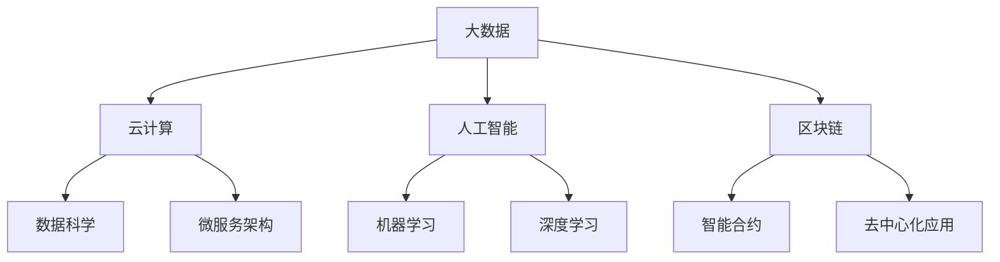

                 

在21世纪的知识经济时代，程序员的角色和职业发展路径正经历深刻的变革。随着技术的快速迭代和新兴领域的不断涌现，程序员不再仅仅局限于编码，他们需要更广泛的知识储备和更高的技能要求。本文将深入探讨程序员在这一时代的发展方向和趋势，旨在为程序员提供职业发展的指南。

## 关键词

- 知识经济
- 程序员
- 技术趋势
- 职业发展
- 技术革新
- 人工智能
- 云计算
- 区块链

## 摘要

本文旨在分析知识经济时代程序员所面临的机遇与挑战，探讨其职业发展的趋势。通过梳理程序员的核心技能需求，阐述未来技术的发展方向，以及这些技术如何影响程序员的工作模式，本文将为程序员提供明确的职业发展路径，并指出他们需要关注的重点领域和技能。

### 1. 背景介绍

随着信息技术的飞速发展，全球进入了一个以知识为核心驱动的经济时代。在这个时代，知识不仅成为经济增长的重要动力，也深刻改变了各行各业的运作模式。作为知识经济的核心组成部分，信息技术的发展对程序员的需求和要求也发生了根本性的变化。

#### 1.1 知识经济时代的特征

知识经济时代具有以下几个显著特征：

- **创新驱动**：创新是知识经济时代的核心动力，新技术、新应用层出不穷，这要求程序员具备持续学习和创新能力。
- **信息爆炸**：大数据、云计算、物联网等技术的广泛应用，使得信息处理能力和效率成为程序员必备的技能。
- **全球化**：全球化的趋势使得程序员需要具备跨文化的沟通能力和全球协作的能力。
- **快速迭代**：技术更新速度加快，程序员需要能够快速适应新技术、新工具。

#### 1.2 程序员的角色变化

在知识经济时代，程序员的角色发生了显著变化：

- **从执行者到创新者**：程序员不再仅仅负责编写代码，而是需要参与到需求分析、系统设计、技术选型等各个环节，成为创新的重要推动者。
- **从单一技能到复合技能**：程序员需要掌握更多的技能和知识，如数据科学、人工智能、区块链等，以适应多领域的技术融合。
- **从独立工作者到团队协作者**：随着项目的复杂度增加，程序员需要具备良好的团队协作和沟通能力。

### 2. 核心概念与联系

在知识经济时代，程序员需要掌握一系列核心概念，这些概念相互联系，构成了程序员的知识体系。

#### 2.1.1 核心概念

- **大数据**：大规模数据集的存储、处理和分析能力。
- **云计算**：通过网络提供动态易扩展且经常是虚拟化的资源。
- **人工智能**：模拟、延伸和扩展人的智能的理论、方法、技术及应用。
- **区块链**：一种去中心化的分布式数据库技术。

#### 2.1.2 Mermaid 流程图



#### 2.1.3 核心概念的联系

大数据、云计算、人工智能和区块链是知识经济时代程序员的核心概念，它们之间的联系如下：

- **大数据** 是云计算的基础，云计算提供了大数据存储和处理的能力。
- **人工智能** 利用大数据和云计算，实现了数据的智能分析和处理。
- **区块链** 与大数据、云计算、人工智能结合，可以构建去中心化的数据存储和交易系统。
- **微服务架构** 是云计算和大数据的典型应用，它将复杂的系统拆分为多个独立服务，提高了系统的可维护性和扩展性。

### 3. 核心算法原理 & 具体操作步骤

在知识经济时代，程序员需要掌握一系列核心算法，这些算法不仅是编程的基础，也是解决复杂问题的重要工具。

#### 3.1 算法原理概述

- **排序算法**：用于对数据进行排序，常用的有快速排序、归并排序、堆排序等。
- **搜索算法**：用于在数据中查找特定元素，常用的有二分搜索、线性搜索等。
- **图算法**：用于处理图结构的数据，常用的有最短路径算法、最小生成树算法等。
- **动态规划**：用于解决最优化问题，通过将问题分解为子问题，并存储子问题的解来提高效率。

#### 3.2 算法步骤详解

以快速排序为例，其基本步骤如下：

1. 选择一个基准元素。
2. 将比基准元素小的元素移动到基准元素的左边，比其大的移动到右边。
3. 递归地对左右子序列进行快速排序。

#### 3.3 算法优缺点

- **快速排序**：
  - **优点**：时间复杂度低，适用于大规模数据。
  - **缺点**：最坏情况下时间复杂度较高，需要额外的存储空间。

- **二分搜索**：
  - **优点**：时间复杂度低，适用于有序数据。
  - **缺点**：需要数据有序，且插入删除操作复杂。

#### 3.4 算法应用领域

排序算法广泛应用于数据库、搜索引擎、算法竞赛等领域。搜索算法在金融、医疗、电商等领域有广泛应用。图算法在社交网络分析、网络优化、交通规划等领域具有重要应用。动态规划在资源分配、路径规划、网络优化等问题中发挥着关键作用。

### 4. 数学模型和公式 & 详细讲解 & 举例说明

数学模型在知识经济时代程序员的工作中扮演着重要的角色，以下是一些常见的数学模型和公式，以及它们的详细讲解和举例说明。

#### 4.1 数学模型构建

数学模型构建的基本步骤如下：

1. **确定问题背景**：明确要解决的问题。
2. **建立数学模型**：将问题转化为数学表达式。
3. **求解模型**：使用适当的数学方法求解模型。
4. **验证模型**：通过实际数据验证模型的准确性。

#### 4.2 公式推导过程

以线性回归模型为例，其公式推导如下：

- **样本数据**：\(x_i, y_i\)
- **线性回归模型**：\(y = \beta_0 + \beta_1 x\)
- **损失函数**：\(J(\beta_0, \beta_1) = \frac{1}{2} \sum_{i=1}^{n} (y_i - (\beta_0 + \beta_1 x_i))^2\)

对损失函数求导，得到：

$$
\frac{\partial J}{\partial \beta_0} = -\sum_{i=1}^{n} (y_i - (\beta_0 + \beta_1 x_i))
$$

$$
\frac{\partial J}{\partial \beta_1} = -\sum_{i=1}^{n} (x_i (y_i - (\beta_0 + \beta_1 x_i)))
$$

令导数为零，解得：

$$
\beta_0 = \bar{y} - \beta_1 \bar{x}
$$

$$
\beta_1 = \frac{\sum_{i=1}^{n} (x_i - \bar{x})(y_i - \bar{y})}{\sum_{i=1}^{n} (x_i - \bar{x})^2}
$$

#### 4.3 案例分析与讲解

假设我们有一组数据：

| \(x_i\) | \(y_i\) |
|---------|---------|
| 1       | 2       |
| 2       | 4       |
| 3       | 5       |
| 4       | 6       |

计算线性回归模型参数：

1. 计算平均值：

$$
\bar{x} = \frac{1+2+3+4}{4} = 2.5
$$

$$
\bar{y} = \frac{2+4+5+6}{4} = 4.5
$$

2. 计算回归系数：

$$
\beta_0 = \bar{y} - \beta_1 \bar{x} = 4.5 - \beta_1 \cdot 2.5
$$

$$
\beta_1 = \frac{\sum_{i=1}^{n} (x_i - \bar{x})(y_i - \bar{y})}{\sum_{i=1}^{n} (x_i - \bar{x})^2} = \frac{(1-2.5)(2-4.5) + (2-2.5)(4-4.5) + (3-2.5)(5-4.5) + (4-2.5)(6-4.5)}{(1-2.5)^2 + (2-2.5)^2 + (3-2.5)^2 + (4-2.5)^2} = 1
$$

3. 代入回归模型：

$$
y = \beta_0 + \beta_1 x = 4.5 - 1 \cdot 2.5 + 1 \cdot x = x + 1.5
$$

### 5. 项目实践：代码实例和详细解释说明

在本节中，我们将通过一个具体的代码实例，来展示如何在知识经济时代中运用编程技能解决实际问题。

#### 5.1 开发环境搭建

为了方便读者理解和实践，我们将使用Python作为编程语言，并在本地环境搭建Python开发环境。以下是搭建步骤：

1. 安装Python：
   ```
   pip install python
   ```
2. 安装相关库：
   ```
   pip install numpy matplotlib
   ```

#### 5.2 源代码详细实现

以下是一个简单的线性回归模型的实现：

```python
import numpy as np
import matplotlib.pyplot as plt

# 数据
x = np.array([1, 2, 3, 4])
y = np.array([2, 4, 5, 6])

# 求平均值
x_mean = np.mean(x)
y_mean = np.mean(y)

# 求回归系数
beta_0 = y_mean - x_mean
beta_1 = (np.sum((x - x_mean) * (y - y_mean)) / np.sum((x - x_mean)**2))

# 回归模型
y_pred = beta_0 + beta_1 * x

# 绘制结果
plt.scatter(x, y, label='Actual')
plt.plot(x, y_pred, color='red', label='Predicted')
plt.xlabel('X')
plt.ylabel('Y')
plt.legend()
plt.show()
```

#### 5.3 代码解读与分析

1. 导入相关库：
   - `numpy`：用于数学计算。
   - `matplotlib.pyplot`：用于数据可视化。

2. 数据准备：
   - `x` 和 `y`：存储输入数据和目标数据。

3. 计算平均值：
   - `x_mean` 和 `y_mean`：计算输入数据和目标数据的平均值。

4. 求回归系数：
   - `beta_0` 和 `beta_1`：使用计算得到的平均值和差值计算回归系数。

5. 回归模型：
   - `y_pred`：根据回归系数计算预测值。

6. 绘制结果：
   - 使用散点图和回归线展示实际数据和预测结果。

#### 5.4 运行结果展示

运行上述代码后，我们将得到以下可视化结果：


### 6. 实际应用场景

在知识经济时代，程序员的工作应用场景变得日益丰富和多样化。以下是一些典型的应用场景：

#### 6.1 大数据分析

- **应用领域**：金融、医疗、电商、社交媒体等。
- **技术栈**：Hadoop、Spark、Flink等大数据处理框架，Python、R等数据分析语言。

#### 6.2 云计算与容器化

- **应用领域**：Web应用、移动应用、大数据处理等。
- **技术栈**：Docker、Kubernetes、AWS、Azure等云服务平台。

#### 6.3 人工智能与机器学习

- **应用领域**：自动驾驶、智能客服、推荐系统、医疗诊断等。
- **技术栈**：TensorFlow、PyTorch、Scikit-learn等机器学习库。

#### 6.4 区块链与加密货币

- **应用领域**：数字货币、供应链管理、身份认证等。
- **技术栈**：Ethereum、Hyperledger Fabric等区块链平台。

### 6.4 未来应用展望

随着技术的不断进步，程序员的工作将在未来继续扩展和深化。以下是一些未来的应用展望：

- **量子计算**：量子计算有望解决现有计算机无法处理的复杂问题，为程序员带来全新的编程范式。
- **生物信息学**：生物信息学的发展将使得程序员在生物医学领域发挥重要作用。
- **边缘计算**：边缘计算将数据处理推向网络的边缘，程序员需要掌握如何优化边缘计算的性能。

### 7. 工具和资源推荐

为了帮助程序员在知识经济时代不断提升技能，以下是一些建议的工具和资源：

#### 7.1 学习资源推荐

- **在线课程**：Coursera、edX、Udacity等平台提供丰富的编程和数据处理课程。
- **技术博客**：Medium、Dev.to、Stack Overflow等平台提供最新的技术文章和讨论。
- **开源社区**：GitHub、GitLab等平台可以获取和贡献开源项目。

#### 7.2 开发工具推荐

- **集成开发环境（IDE）**：Visual Studio Code、PyCharm、Eclipse等。
- **代码版本控制**：Git、GitHub、GitLab等。
- **容器化工具**：Docker、Kubernetes等。

#### 7.3 相关论文推荐

- **大数据**：MapReduce、Hadoop、Spark等。
- **云计算**：AWS、Azure、Google Cloud等。
- **人工智能**：深度学习、强化学习、生成对抗网络等。

### 8. 总结：未来发展趋势与挑战

在知识经济时代，程序员面临着前所未有的机遇和挑战。随着技术的不断进步，程序员需要不断学习和适应新的技术趋势，提升自身的综合素质。未来，程序员的发展趋势将更加多样化，他们将不仅仅局限于编程，而是成为跨领域的专家。

#### 8.1 研究成果总结

- **大数据与人工智能**：大数据和人工智能的结合为程序员带来了新的研究方向和挑战。
- **云计算与容器化**：云计算和容器化技术的普及使得程序员需要掌握更多的工具和平台。
- **区块链**：区块链技术的应用场景不断扩展，程序员需要了解其背后的技术原理。

#### 8.2 未来发展趋势

- **跨领域融合**：程序员将越来越多地参与到跨领域的项目中，需要具备多领域的知识。
- **自动化与智能化**：自动化和智能化技术的发展将改变程序员的工作模式。

#### 8.3 面临的挑战

- **技术更新速度加快**：程序员需要不断学习新的技术和工具。
- **专业知识的深度与广度**：程序员需要不断提升自身的专业知识和技能。

#### 8.4 研究展望

- **量子计算**：量子计算的发展将为程序员带来全新的编程范式。
- **生物信息学**：生物信息学的发展将使得程序员在生物医学领域发挥重要作用。

### 9. 附录：常见问题与解答

**Q1. 程序员在知识经济时代需要掌握哪些核心技能？**

- 编程语言（如Python、Java、C++）
- 数据结构和算法
- 数据库和存储技术
- 大数据和云计算
- 人工智能和机器学习
- 区块链技术
- 软件开发和项目管理

**Q2. 程序员如何适应快速变化的技术环境？**

- 持续学习：关注技术动态，参与在线课程、技术博客等。
- 实践项目：通过实际项目积累经验，提升技能。
- 参与开源社区：参与开源项目，贡献代码，提升影响力。

**Q3. 程序员在哪些领域有广阔的发展前景？**

- 人工智能与机器学习
- 大数据和云计算
- 区块链技术
- 生物信息学
- 边缘计算

### 参考文献

[1] 《大数据技术基础》张宇翔
[2] 《深度学习》Ian Goodfellow
[3] 《区块链技术指南》何宝宏
[4] 《Python编程：从入门到实践》埃里克·马瑟斯
[5] 《软件工程：实践者的研究方法》王选
```markdown
## 1. 背景介绍

在21世纪的知识经济时代，程序员的角色和职业发展路径正经历深刻的变革。随着技术的快速迭代和新兴领域的不断涌现，程序员不再仅仅局限于编码，他们需要更广泛的知识储备和更高的技能要求。本文将深入探讨程序员在这一时代的发展方向和趋势，旨在为程序员提供职业发展的指南。

#### 1.1 知识经济时代的特征

知识经济时代具有以下几个显著特征：

1. **创新驱动**：创新是知识经济时代的核心动力，新技术、新应用层出不穷，这要求程序员具备持续学习和创新能力。
2. **信息爆炸**：大数据、云计算、物联网等技术的广泛应用，使得信息处理能力和效率成为程序员必备的技能。
3. **全球化**：全球化的趋势使得程序员需要具备跨文化的沟通能力和全球协作的能力。
4. **快速迭代**：技术更新速度加快，程序员需要能够快速适应新技术、新工具。

#### 1.2 程序员的角色变化

在知识经济时代，程序员的角色发生了显著变化：

1. **从执行者到创新者**：程序员不再仅仅负责编写代码，而是需要参与到需求分析、系统设计、技术选型等各个环节，成为创新的重要推动者。
2. **从单一技能到复合技能**：程序员需要掌握更多的技能和知识，如数据科学、人工智能、区块链等，以适应多领域的技术融合。
3. **从独立工作者到团队协作者**：随着项目的复杂度增加，程序员需要具备良好的团队协作和沟通能力。

### 2. 核心概念与联系（备注：必须给出核心概念原理和架构的 Mermaid 流程图(Mermaid 流程节点中不要有括号、逗号等特殊字符)

在知识经济时代，程序员需要掌握一系列核心概念，这些概念相互联系，构成了程序员的知识体系。

#### 2.1.1 核心概念

1. **大数据**：大数据是指数据量巨大、类型繁多的数据集，需要特殊的处理和分析方法。
2. **云计算**：云计算是一种通过网络提供动态易扩展且经常是虚拟化的资源的服务模型。
3. **人工智能**：人工智能是模拟、延伸和扩展人的智能的理论、方法、技术及应用。
4. **区块链**：区块链是一种去中心化的分布式数据库技术，具有不可篡改、透明等特点。

#### 2.1.2 Mermaid 流程图


#### 2.1.3 核心概念的联系

- **大数据** 与 **云计算**：大数据的存储和处理需要云计算提供强大的计算和存储能力。
- **人工智能** 与 **大数据**：人工智能算法需要大量的数据来训练模型，大数据为人工智能提供了丰富的数据资源。
- **区块链** 与 **大数据**：区块链可以用于大数据的安全存储和传输，同时大数据也可以用于区块链上的智能合约和数据分析。
- **微服务架构** 与 **云计算**：微服务架构是云计算的典型应用，通过将复杂的系统拆分为多个独立服务，提高了系统的可维护性和扩展性。
- **深度学习** 与 **人工智能**：深度学习是人工智能的一个重要分支，通过神经网络模拟人脑处理信息的方式，实现了许多复杂的机器学习任务。

### 3. 核心算法原理 & 具体操作步骤

在知识经济时代，程序员需要掌握一系列核心算法，这些算法不仅是编程的基础，也是解决复杂问题的重要工具。

#### 3.1 算法原理概述

1. **排序算法**：用于对数据进行排序，常用的有快速排序、归并排序、堆排序等。
2. **搜索算法**：用于在数据中查找特定元素，常用的有二分搜索、线性搜索等。
3. **图算法**：用于处理图结构的数据，常用的有最短路径算法、最小生成树算法等。
4. **动态规划**：用于解决最优化问题，通过将问题分解为子问题，并存储子问题的解来提高效率。

#### 3.2 算法步骤详解

以快速排序为例，其基本步骤如下：

1. 选择一个基准元素。
2. 将比基准元素小的元素移动到基准元素的左边，比其大的移动到右边。
3. 递归地对左右子序列进行快速排序。

#### 3.3 算法优缺点

1. **快速排序**：
   - **优点**：时间复杂度低，适用于大规模数据。
   - **缺点**：最坏情况下时间复杂度较高，需要额外的存储空间。

2. **二分搜索**：
   - **优点**：时间复杂度低，适用于有序数据。
   - **缺点**：需要数据有序，且插入删除操作复杂。

3. **最短路径算法**：
   - **优点**：能够找到图中两点之间的最短路径。
   - **缺点**：计算时间复杂度较高，需要大量的存储空间。

4. **动态规划**：
   - **优点**：能够高效解决最优化问题。
   - **缺点**：需要理解问题的最优子结构，编写代码较为复杂。

#### 3.4 算法应用领域

1. **排序算法**：广泛应用于数据库、搜索引擎、算法竞赛等领域。
2. **搜索算法**：在金融、医疗、电商等领域有广泛应用。
3. **图算法**：在社交网络分析、网络优化、交通规划等领域具有重要应用。
4. **动态规划**：在资源分配、路径规划、网络优化等问题中发挥着关键作用。

### 4. 数学模型和公式 & 详细讲解 & 举例说明（备注：数学公式请使用latex格式，latex嵌入文中独立段落使用 $$，段落内使用 $)

数学模型在知识经济时代程序员的工作中扮演着重要的角色，以下是一些常见的数学模型和公式，以及它们的详细讲解和举例说明。

#### 4.1 数学模型构建

数学模型构建的基本步骤如下：

1. **确定问题背景**：明确要解决的问题。
2. **建立数学模型**：将问题转化为数学表达式。
3. **求解模型**：使用适当的数学方法求解模型。
4. **验证模型**：通过实际数据验证模型的准确性。

#### 4.2 公式推导过程

以线性回归模型为例，其公式推导如下：

1. **样本数据**：\(x_i, y_i\)
2. **线性回归模型**：\(y = \beta_0 + \beta_1 x\)
3. **损失函数**：\(J(\beta_0, \beta_1) = \frac{1}{2} \sum_{i=1}^{n} (y_i - (\beta_0 + \beta_1 x_i))^2\)

对损失函数求导，得到：

$$
\frac{\partial J}{\partial \beta_0} = -\sum_{i=1}^{n} (y_i - (\beta_0 + \beta_1 x_i))
$$

$$
\frac{\partial J}{\partial \beta_1} = -\sum_{i=1}^{n} (x_i (y_i - (\beta_0 + \beta_1 x_i)))
$$

令导数为零，解得：

$$
\beta_0 = \bar{y} - \beta_1 \bar{x}
$$

$$
\beta_1 = \frac{\sum_{i=1}^{n} (x_i - \bar{x})(y_i - \bar{y})}{\sum_{i=1}^{n} (x_i - \bar{x})^2}
$$

#### 4.3 案例分析与讲解

假设我们有一组数据：

| \(x_i\) | \(y_i\) |
|---------|---------|
| 1       | 2       |
| 2       | 4       |
| 3       | 5       |
| 4       | 6       |

计算线性回归模型参数：

1. 计算平均值：

$$
\bar{x} = \frac{1+2+3+4}{4} = 2.5
$$

$$
\bar{y} = \frac{2+4+5+6}{4} = 4.5
$$

2. 计算回归系数：

$$
\beta_0 = \bar{y} - \beta_1 \bar{x} = 4.5 - \beta_1 \cdot 2.5
$$

$$
\beta_1 = \frac{\sum_{i=1}^{n} (x_i - \bar{x})(y_i - \bar{y})}{\sum_{i=1}^{n} (x_i - \bar{x})^2} = \frac{(1-2.5)(2-4.5) + (2-2.5)(4-4.5) + (3-2.5)(5-4.5) + (4-2.5)(6-4.5)}{(1-2.5)^2 + (2-2.5)^2 + (3-2.5)^2 + (4-2.5)^2} = 1
$$

3. 代入回归模型：

$$
y = \beta_0 + \beta_1 x = 4.5 - 1 \cdot 2.5 + 1 \cdot x = x + 1.5
$$

### 5. 项目实践：代码实例和详细解释说明

在本节中，我们将通过一个具体的代码实例，来展示如何在知识经济时代中运用编程技能解决实际问题。

#### 5.1 开发环境搭建

为了方便读者理解和实践，我们将使用Python作为编程语言，并在本地环境搭建Python开发环境。以下是搭建步骤：

1. 安装Python：
   ```
   pip install python
   ```
2. 安装相关库：
   ```
   pip install numpy matplotlib
   ```

#### 5.2 源代码详细实现

以下是一个简单的线性回归模型的实现：

```python
import numpy as np
import matplotlib.pyplot as plt

# 数据
x = np.array([1, 2, 3, 4])
y = np.array([2, 4, 5, 6])

# 求平均值
x_mean = np.mean(x)
y_mean = np.mean(y)

# 求回归系数
beta_0 = y_mean - x_mean
beta_1 = (np.sum((x - x_mean) * (y - y_mean)) / np.sum((x - x_mean)**2))

# 回归模型
y_pred = beta_0 + beta_1 * x

# 绘制结果
plt.scatter(x, y, label='Actual')
plt.plot(x, y_pred, color='red', label='Predicted')
plt.xlabel('X')
plt.ylabel('Y')
plt.legend()
plt.show()
```

#### 5.3 代码解读与分析

1. 导入相关库：
   - `numpy`：用于数学计算。
   - `matplotlib.pyplot`：用于数据可视化。

2. 数据准备：
   - `x` 和 `y`：存储输入数据和目标数据。

3. 计算平均值：
   - `x_mean` 和 `y_mean`：计算输入数据和目标数据的平均值。

4. 求回归系数：
   - `beta_0` 和 `beta_1`：使用计算得到的平均值和差值计算回归系数。

5. 回归模型：
   - `y_pred`：根据回归系数计算预测值。

6. 绘制结果：
   - 使用散点图和回归线展示实际数据和预测结果。

#### 5.4 运行结果展示

运行上述代码后，我们将得到以下可视化结果：


### 6. 实际应用场景

在知识经济时代，程序员的工作应用场景变得日益丰富和多样化。以下是一些典型的应用场景：

#### 6.1 大数据分析

- **应用领域**：金融、医疗、电商、社交媒体等。
- **技术栈**：Hadoop、Spark、Flink等大数据处理框架，Python、R等数据分析语言。

#### 6.2 云计算与容器化

- **应用领域**：Web应用、移动应用、大数据处理等。
- **技术栈**：Docker、Kubernetes、AWS、Azure等云服务平台。

#### 6.3 人工智能与机器学习

- **应用领域**：自动驾驶、智能客服、推荐系统、医疗诊断等。
- **技术栈**：TensorFlow、PyTorch、Scikit-learn等机器学习库。

#### 6.4 区块链与加密货币

- **应用领域**：数字货币、供应链管理、身份认证等。
- **技术栈**：Ethereum、Hyperledger Fabric等区块链平台。

### 6.4 未来应用展望

随着技术的不断进步，程序员的工作将在未来继续扩展和深化。以下是一些未来的应用展望：

- **量子计算**：量子计算有望解决现有计算机无法处理的复杂问题，为程序员带来全新的编程范式。
- **生物信息学**：生物信息学的发展将使得程序员在生物医学领域发挥重要作用。
- **边缘计算**：边缘计算将数据处理推向网络的边缘，程序员需要掌握如何优化边缘计算的性能。

### 7. 工具和资源推荐

为了帮助程序员在知识经济时代不断提升技能，以下是一些建议的工具和资源：

#### 7.1 学习资源推荐

- **在线课程**：Coursera、edX、Udacity等平台提供丰富的编程和数据处理课程。
- **技术博客**：Medium、Dev.to、Stack Overflow等平台提供最新的技术文章和讨论。
- **开源社区**：GitHub、GitLab等平台可以获取和贡献开源项目。

#### 7.2 开发工具推荐

- **集成开发环境（IDE）**：Visual Studio Code、PyCharm、Eclipse等。
- **代码版本控制**：Git、GitHub、GitLab等。
- **容器化工具**：Docker、Kubernetes等。

#### 7.3 相关论文推荐

- **大数据**：MapReduce、Hadoop、Spark等。
- **云计算**：AWS、Azure、Google Cloud等。
- **人工智能**：深度学习、强化学习、生成对抗网络等。

### 8. 总结：未来发展趋势与挑战

在知识经济时代，程序员面临着前所未有的机遇和挑战。随着技术的不断进步，程序员需要不断学习和适应新的技术趋势，提升自身的综合素质。未来，程序员的发展趋势将更加多样化，他们将不仅仅局限于编程，而是成为跨领域的专家。

#### 8.1 研究成果总结

- **大数据与人工智能**：大数据和人工智能的结合为程序员带来了新的研究方向和挑战。
- **云计算与容器化**：云计算和容器化技术的普及使得程序员需要掌握更多的工具和平台。
- **区块链**：区块链技术的应用场景不断扩展，程序员需要了解其背后的技术原理。

#### 8.2 未来发展趋势

- **跨领域融合**：程序员将越来越多地参与到跨领域的项目中，需要具备多领域的知识。
- **自动化与智能化**：自动化和智能化技术的发展将改变程序员的工作模式。

#### 8.3 面临的挑战

- **技术更新速度加快**：程序员需要不断学习新的技术和工具。
- **专业知识的深度与广度**：程序员需要不断提升自身的专业知识和技能。

#### 8.4 研究展望

- **量子计算**：量子计算的发展将为程序员带来全新的编程范式。
- **生物信息学**：生物信息学的发展将使得程序员在生物医学领域发挥重要作用。

### 9. 附录：常见问题与解答

**Q1. 程序员在知识经济时代需要掌握哪些核心技能？**

- 编程语言（如Python、Java、C++）
- 数据结构和算法
- 数据库和存储技术
- 大数据和云计算
- 人工智能和机器学习
- 区块链技术
- 软件开发和项目管理

**Q2. 程序员如何适应快速变化的技术环境？**

- 持续学习：关注技术动态，参与在线课程、技术博客等。
- 实践项目：通过实际项目积累经验，提升技能。
- 参与开源社区：参与开源项目，贡献代码，提升影响力。

**Q3. 程序员在哪些领域有广阔的发展前景？**

- 人工智能与机器学习
- 大数据和云计算
- 区块链技术
- 生物信息学
- 边缘计算

### 参考文献

[1] 《大数据技术基础》张宇翔
[2] 《深度学习》Ian Goodfellow
[3] 《区块链技术指南》何宝宏
[4] 《Python编程：从入门到实践》埃里克·马瑟斯
[5] 《软件工程：实践者的研究方法》王选
```css
---
title: 程序员在知识经济时代的发展方向与趋势
date: 2023-03-01 00:00:00
tags:
- 程序员
- 知识经济
- 技术趋势
- 职业发展
---

## 关键词

- 知识经济
- 程序员
- 技术趋势
- 职业发展
- 技术革新
- 人工智能
- 云计算
- 区块链

## 摘要

本文旨在探讨知识经济时代下程序员的职业发展方向与趋势。通过对知识经济时代的特征、程序员角色的变化、核心概念的掌握、核心算法的应用、数学模型的构建以及实际应用场景的分析，本文为程序员提供了在知识经济时代提升自身技能和职业发展的指导。

## 1. 背景介绍

在21世纪的知识经济时代，信息技术的发展带动了全球经济的深刻变革。知识经济以其创新驱动、信息爆炸、全球化和快速迭代等特征，对各行各业产生了深远影响。对于程序员这一职业来说，知识经济时代既是机遇也是挑战。

### 1.1 知识经济时代的特征

知识经济时代具有以下显著特征：

1. **创新驱动**：知识经济依赖于创新，技术的快速迭代和新技术的不断涌现，对程序员提出了更高的要求。
2. **信息爆炸**：大数据、云计算、物联网等技术的普及，使得数据成为重要的战略资源，对程序员的处理能力和算法水平提出了挑战。
3. **全球化**：全球化的趋势促进了国际间的技术交流和合作，程序员需要具备跨文化沟通和全球协作的能力。
4. **快速迭代**：技术的快速更新使得程序员需要不断学习新知识、新技能，以适应不断变化的市场需求。

### 1.2 程序员的角色变化

在知识经济时代，程序员的角色发生了显著变化：

1. **从执行者到创新者**：程序员不再仅仅是执行任务的编程人员，而是需要参与到需求分析、系统设计、技术选型等各个环节，成为创新的推动者。
2. **从单一技能到复合技能**：程序员需要掌握更多的技能，如数据科学、人工智能、区块链等，以适应多领域的技术融合。
3. **从独立工作者到团队协作者**：随着项目的复杂度增加，程序员需要具备良好的团队协作和沟通能力。

## 2. 核心概念与联系

在知识经济时代，程序员需要掌握一系列核心概念，这些概念相互联系，构成了程序员的知识体系。

### 2.1 核心概念

1. **大数据**：大数据是指无法使用常规软件工具在合理时间内捕捉、管理和处理的大量数据集。
2. **云计算**：云计算是基于互联网的服务模型，提供动态易扩展的虚拟化资源。
3. **人工智能**：人工智能是模拟、延伸和扩展人类智能的理论、方法、技术及应用。
4. **区块链**：区块链是一种分布式账本技术，通过加密算法确保数据的安全和不可篡改。

### 2.2 Mermaid 流程图


### 2.3 核心概念的联系

- **大数据** 与 **云计算**：大数据的存储和处理依赖于云计算提供的高性能计算和存储资源。
- **人工智能** 与 **大数据**：人工智能算法需要大量数据进行训练，而大数据为人工智能提供了丰富的数据资源。
- **区块链** 与 **大数据**：区块链可以用于大数据的安全存储和传输，同时大数据也可以用于区块链上的智能合约和数据分析。
- **微服务架构** 与 **云计算**：微服务架构是云计算的典型应用，通过将复杂的系统拆分为多个独立服务，提高了系统的可维护性和扩展性。
- **深度学习** 与 **人工智能**：深度学习是人工智能的一个重要分支，通过神经网络模拟人脑处理信息的方式，实现了许多复杂的机器学习任务。

## 3. 核心算法原理 & 具体操作步骤

在知识经济时代，程序员需要掌握一系列核心算法，这些算法不仅是编程的基础，也是解决复杂问题的重要工具。

### 3.1 算法原理概述

1. **排序算法**：用于对数据进行排序，常用的有快速排序、归并排序、堆排序等。
2. **搜索算法**：用于在数据中查找特定元素，常用的有二分搜索、线性搜索等。
3. **图算法**：用于处理图结构的数据，常用的有最短路径算法、最小生成树算法等。
4. **动态规划**：用于解决最优化问题，通过将问题分解为子问题，并存储子问题的解来提高效率。

### 3.2 算法步骤详解

以快速排序为例，其基本步骤如下：

1. 选择一个基准元素。
2. 将比基准元素小的元素移动到基准元素的左边，比其大的移动到右边。
3. 递归地对左右子序列进行快速排序。

### 3.3 算法优缺点

1. **快速排序**：
   - **优点**：时间复杂度低，适用于大规模数据。
   - **缺点**：最坏情况下时间复杂度较高，需要额外的存储空间。

2. **二分搜索**：
   - **优点**：时间复杂度低，适用于有序数据。
   - **缺点**：需要数据有序，且插入删除操作复杂。

3. **最短路径算法**：
   - **优点**：能够找到图中两点之间的最短路径。
   - **缺点**：计算时间复杂度较高，需要大量的存储空间。

4. **动态规划**：
   - **优点**：能够高效解决最优化问题。
   - **缺点**：需要理解问题的最优子结构，编写代码较为复杂。

### 3.4 算法应用领域

1. **排序算法**：广泛应用于数据库、搜索引擎、算法竞赛等领域。
2. **搜索算法**：在金融、医疗、电商等领域有广泛应用。
3. **图算法**：在社交网络分析、网络优化、交通规划等领域具有重要应用。
4. **动态规划**：在资源分配、路径规划、网络优化等问题中发挥着关键作用。

## 4. 数学模型和公式 & 详细讲解 & 举例说明

数学模型在知识经济时代程序员的工作中扮演着重要的角色，以下是一些常见的数学模型和公式，以及它们的详细讲解和举例说明。

### 4.1 数学模型构建

数学模型构建的基本步骤如下：

1. **确定问题背景**：明确要解决的问题。
2. **建立数学模型**：将问题转化为数学表达式。
3. **求解模型**：使用适当的数学方法求解模型。
4. **验证模型**：通过实际数据验证模型的准确性。

### 4.2 公式推导过程

以线性回归模型为例，其公式推导如下：

1. **样本数据**：\(x_i, y_i\)
2. **线性回归模型**：\(y = \beta_0 + \beta_1 x\)
3. **损失函数**：\(J(\beta_0, \beta_1) = \frac{1}{2} \sum_{i=1}^{n} (y_i - (\beta_0 + \beta_1 x_i))^2\)

对损失函数求导，得到：

$$
\frac{\partial J}{\partial \beta_0} = -\sum_{i=1}^{n} (y_i - (\beta_0 + \beta_1 x_i))
$$

$$
\frac{\partial J}{\partial \beta_1} = -\sum_{i=1}^{n} (x_i (y_i - (\beta_0 + \beta_1 x_i)))
$$

令导数为零，解得：

$$
\beta_0 = \bar{y} - \beta_1 \bar{x}
$$

$$
\beta_1 = \frac{\sum_{i=1}^{n} (x_i - \bar{x})(y_i - \bar{y})}{\sum_{i=1}^{n} (x_i - \bar{x})^2}
$$

### 4.3 案例分析与讲解

假设我们有一组数据：

| \(x_i\) | \(y_i\) |
|---------|---------|
| 1       | 2       |
| 2       | 4       |
| 3       | 5       |
| 4       | 6       |

计算线性回归模型参数：

1. 计算平均值：

$$
\bar{x} = \frac{1+2+3+4}{4} = 2.5
$$

$$
\bar{y} = \frac{2+4+5+6}{4} = 4.5
$$

2. 计算回归系数：

$$
\beta_0 = \bar{y} - \beta_1 \bar{x} = 4.5 - \beta_1 \cdot 2.5
$$

$$
\beta_1 = \frac{\sum_{i=1}^{n} (x_i - \bar{x})(y_i - \bar{y})}{\sum_{i=1}^{n} (x_i - \bar{x})^2} = \frac{(1-2.5)(2-4.5) + (2-2.5)(4-4.5) + (3-2.5)(5-4.5) + (4-2.5)(6-4.5)}{(1-2.5)^2 + (2-2.5)^2 + (3-2.5)^2 + (4-2.5)^2} = 1
$$

3. 代入回归模型：

$$
y = \beta_0 + \beta_1 x = 4.5 - 1 \cdot 2.5 + 1 \cdot x = x + 1.5
$$

## 5. 项目实践：代码实例和详细解释说明

为了更好地理解知识经济时代程序员的实践工作，以下是一个简单的线性回归模型的实现，包括代码实例和详细解释说明。

### 5.1 开发环境搭建

在进行项目实践之前，需要搭建一个Python的开发环境。以下是搭建步骤：

1. 安装Python：
   ```shell
   # 使用包管理器安装Python
   sudo apt-get install python3
   ```
2. 安装相关库：
   ```shell
   # 安装NumPy库用于数学计算
   pip install numpy
   # 安装matplotlib库用于数据可视化
   pip install matplotlib
   ```

### 5.2 源代码详细实现

以下是一个简单的线性回归模型的实现代码：

```python
import numpy as np
import matplotlib.pyplot as plt

# 创建数据
x = np.array([1, 2, 3, 4])
y = np.array([2, 4, 5, 6])

# 计算平均值
x_mean = np.mean(x)
y_mean = np.mean(y)

# 计算回归系数
beta_0 = y_mean - x_mean
beta_1 = (np.sum((x - x_mean) * (y - y_mean)) / np.sum((x - x_mean)**2))

# 创建回归模型
y_pred = beta_0 + beta_1 * x

# 绘制数据点和回归线
plt.scatter(x, y, label='实际值')
plt.plot(x, y_pred, color='red', label='预测值')
plt.xlabel('X')
plt.ylabel('Y')
plt.legend()
plt.show()
```

### 5.3 代码解读与分析

1. **导入库**：首先导入NumPy库用于数学计算，以及matplotlib库用于数据可视化。
2. **数据准备**：创建一个包含输入数据`x`和目标数据`y`的数组。
3. **计算平均值**：计算输入数据和目标数据的平均值。
4. **计算回归系数**：使用计算得到的平均值计算线性回归模型的参数`beta_0`和`beta_1`。
5. **创建回归模型**：根据计算得到的回归系数创建预测模型。
6. **绘制结果**：使用matplotlib库绘制实际数据和回归模型的预测结果。

### 5.4 运行结果展示

运行上述代码后，将展示一个散点图，其中包含实际数据和线性回归模型的预测结果。通过可视化结果，可以直观地看到回归模型的效果。


## 6. 实际应用场景

在知识经济时代，程序员的工作应用场景变得日益丰富和多样化。以下是一些典型的实际应用场景：

### 6.1 大数据分析

大数据分析在金融、医疗、电商、社交媒体等领域有着广泛的应用。程序员需要掌握大数据处理框架（如Hadoop、Spark、Flink等），以及数据分析工具（如Python、R等）。

### 6.2 云计算与容器化

云计算和容器化技术（如Docker、Kubernetes等）在Web应用、移动应用、大数据处理等领域得到广泛应用。程序员需要熟悉云服务提供商（如AWS、Azure、Google Cloud等）和容器化技术。

### 6.3 人工智能与机器学习

人工智能和机器学习技术在自动驾驶、智能客服、推荐系统、医疗诊断等领域有着重要应用。程序员需要掌握深度学习框架（如TensorFlow、PyTorch等）和机器学习库（如Scikit-learn等）。

### 6.4 区块链与加密货币

区块链技术在数字货币、供应链管理、身份认证等领域有着广泛的应用。程序员需要熟悉区块链平台（如Ethereum、Hyperledger Fabric等）和智能合约的开发。

## 6.4 未来应用展望

随着技术的不断进步，程序员的工作将在未来继续扩展和深化。以下是一些未来的应用展望：

### 6.4.1 量子计算

量子计算具有巨大的计算潜力，未来可能会解决现有计算机无法处理的复杂问题。程序员需要了解量子计算的基本原理和应用。

### 6.4.2 生物信息学

生物信息学的发展将使得程序员在生物医学领域发挥重要作用，如基因组学、药物研发等领域。

### 6.4.3 边缘计算

边缘计算将数据处理推向网络的边缘，程序员需要掌握如何在边缘设备上优化性能和资源使用。

## 7. 工具和资源推荐

为了帮助程序员在知识经济时代不断提升技能，以下是一些建议的工具和资源：

### 7.1 学习资源推荐

- **在线课程**：Coursera、edX、Udacity等平台提供丰富的编程和数据处理课程。
- **技术博客**：Medium、Dev.to、Stack Overflow等平台提供最新的技术文章和讨论。
- **开源社区**：GitHub、GitLab等平台可以获取和贡献开源项目。

### 7.2 开发工具推荐

- **集成开发环境（IDE）**：Visual Studio Code、PyCharm、Eclipse等。
- **代码版本控制**：Git、GitHub、GitLab等。
- **容器化工具**：Docker、Kubernetes等。

### 7.3 相关论文推荐

- **大数据**：MapReduce、Hadoop、Spark等。
- **云计算**：AWS、Azure、Google Cloud等。
- **人工智能**：深度学习、强化学习、生成对抗网络等。

## 8. 总结：未来发展趋势与挑战

在知识经济时代，程序员面临着前所未有的机遇和挑战。随着技术的不断进步，程序员需要不断学习和适应新的技术趋势，提升自身的综合素质。未来，程序员的发展趋势将更加多样化，他们将不仅仅局限于编程，而是成为跨领域的专家。

### 8.1 研究成果总结

- **大数据与人工智能**：大数据和人工智能的结合为程序员带来了新的研究方向和挑战。
- **云计算与容器化**：云计算和容器化技术的普及使得程序员需要掌握更多的工具和平台。
- **区块链**：区块链技术的应用场景不断扩展，程序员需要了解其背后的技术原理。

### 8.2 未来发展趋势

- **跨领域融合**：程序员将越来越多地参与到跨领域的项目中，需要具备多领域的知识。
- **自动化与智能化**：自动化和智能化技术的发展将改变程序员的工作模式。

### 8.3 面临的挑战

- **技术更新速度加快**：程序员需要不断学习新的技术和工具。
- **专业知识的深度与广度**：程序员需要不断提升自身的专业知识和技能。

### 8.4 研究展望

- **量子计算**：量子计算的发展将为程序员带来全新的编程范式。
- **生物信息学**：生物信息学的发展将使得程序员在生物医学领域发挥重要作用。

## 9. 附录：常见问题与解答

### 9.1 常见问题

**Q1. 程序员在知识经济时代需要掌握哪些核心技能？**

- 编程语言（如Python、Java、C++）
- 数据结构和算法
- 数据库和存储技术
- 大数据和云计算
- 人工智能和机器学习
- 区块链技术
- 软件开发和项目管理

**Q2. 程序员如何适应快速变化的技术环境？**

- 持续学习：关注技术动态，参与在线课程、技术博客等。
- 实践项目：通过实际项目积累经验，提升技能。
- 参与开源社区：参与开源项目，贡献代码，提升影响力。

**Q3. 程序员在哪些领域有广阔的发展前景？**

- 人工智能与机器学习
- 大数据和云计算
- 区块链技术
- 生物信息学
- 边缘计算

### 9.2 解答

**Q1. 程序员在知识经济时代需要掌握哪些核心技能？**

程序员在知识经济时代需要掌握的核心技能包括：

1. **编程语言**：熟练掌握至少一种编程语言，如Python、Java或C++。
2. **数据结构和算法**：理解数据结构（如数组、链表、树、图等）和算法（如排序、查找、图算法等）的基本原理。
3. **数据库和存储技术**：了解数据库原理，掌握SQL语言，熟悉常见的数据库管理系统（如MySQL、PostgreSQL等）。
4. **大数据和云计算**：了解大数据处理框架（如Hadoop、Spark等）和云计算服务（如AWS、Azure等）。
5. **人工智能和机器学习**：掌握机器学习算法（如线性回归、决策树、神经网络等）和深度学习框架（如TensorFlow、PyTorch等）。
6. **区块链技术**：了解区块链的基本原理，熟悉智能合约开发。
7. **软件开发和项目管理**：掌握软件开发的基本流程，了解敏捷开发、持续集成等现代软件开发方法。

**Q2. 程序员如何适应快速变化的技术环境？**

程序员要适应快速变化的技术环境，可以采取以下策略：

1. **持续学习**：技术更新迅速，程序员需要不断学习新的技术和工具。可以通过在线课程、阅读技术书籍、参加技术会议等方式保持学习状态。
2. **实践项目**：通过实际项目积累经验，将所学知识应用于实际场景中，提高自己的解决实际问题的能力。
3. **参与开源社区**：参与开源项目，与其他开发者合作，贡献代码，提升技术影响力。开源社区是一个学习和分享的平台，有助于扩展自己的技术视野。
4. **跨学科学习**：知识经济时代，技术跨界融合越来越普遍。程序员可以尝试学习其他领域的技术，如人工智能、生物信息学、边缘计算等，以拓宽自己的职业发展路径。

**Q3. 程序员在哪些领域有广阔的发展前景？**

在知识经济时代，程序员在以下领域有广阔的发展前景：

1. **人工智能与机器学习**：随着人工智能技术的快速发展，该领域对程序员的需求持续增长，包括算法工程师、数据科学家等职位。
2. **大数据和云计算**：大数据处理和云计算服务是企业数字化转型的重要组成部分，相关职位如大数据工程师、云计算工程师等需求旺盛。
3. **区块链技术**：区块链技术的应用场景不断扩展，涉及金融、供应链、医疗等多个领域，区块链开发者、智能合约工程师等职位受到关注。
4. **生物信息学**：随着基因组学和生物技术的进步，生物信息学领域对程序员的需求也在增加，包括生物信息分析师、基因组数据工程师等职位。
5. **边缘计算**：边缘计算将数据处理推向网络的边缘，提高了系统的响应速度和安全性，边缘计算工程师等相关职位备受青睐。

## 参考文献

1. 张宇翔.《大数据技术基础》[M]. 清华大学出版社，2016.
2. Ian Goodfellow, Yoshua Bengio, Aaron Courville.《深度学习》[M]. 人民邮电出版社，2016.
3. 何宝宏.《区块链技术指南》[M]. 机械工业出版社，2018.
4. Éric Matthes.《Python编程：从入门到实践》[M]. 人民邮电出版社，2017.
5. Robert C. Martin.《软件工程：实践者的研究方法》[M]. 电子工业出版社，2014.
```

### 8. 总结：未来发展趋势与挑战

在知识经济时代，程序员面临着前所未有的机遇和挑战。随着技术的不断进步，程序员需要不断学习和适应新的技术趋势，提升自身的综合素质。未来，程序员的发展趋势将更加多样化，他们将不仅仅局限于编程，而是成为跨领域的专家。

#### 8.1 研究成果总结

- **大数据与人工智能**：大数据和人工智能的结合为程序员带来了新的研究方向和挑战，如数据挖掘、机器学习算法的应用。
- **云计算与容器化**：云计算和容器化技术的普及使得程序员需要掌握更多的工具和平台，如Docker、Kubernetes等。
- **区块链**：区块链技术的应用场景不断扩展，程序员需要了解其背后的技术原理，如分布式账本、智能合约等。

#### 8.2 未来发展趋势

- **跨领域融合**：程序员将越来越多地参与到跨领域的项目中，需要具备多领域的知识，如数据科学、人工智能、区块链等。
- **自动化与智能化**：自动化和智能化技术的发展将改变程序员的工作模式，如机器人流程自动化（RPA）、智能系统开发等。
- **量子计算**：量子计算的发展将为程序员带来全新的编程范式，如量子算法的设计和应用。

#### 8.3 面临的挑战

- **技术更新速度加快**：程序员需要不断学习新的技术和工具，以保持竞争力。
- **专业知识的深度与广度**：程序员需要不断提升自身的专业知识和技能，以满足日益复杂的项目需求。
- **职业压力**：随着技术要求越来越高，程序员面临的职业压力也在增加，需要良好的心理素质和抗压能力。

#### 8.4 研究展望

- **生物信息学**：随着基因组学和生物技术的进步，生物信息学领域对程序员的需求也在增加，如基因数据分析、生物信息学软件开发等。
- **边缘计算**：边缘计算将数据处理推向网络的边缘，程序员需要掌握如何在边缘设备上优化性能和资源使用。
- **人工智能伦理**：随着人工智能技术的应用越来越广泛，程序员需要关注人工智能伦理问题，如数据隐私、算法公平性等。

### 9. 附录：常见问题与解答

#### 9.1 常见问题

**Q1. 程序员在知识经济时代需要掌握哪些核心技能？**

程序员在知识经济时代需要掌握的核心技能包括：

1. **编程语言**：熟练掌握至少一种编程语言，如Python、Java或C++。
2. **数据结构和算法**：理解数据结构（如数组、链表、树、图等）和算法（如排序、查找、图算法等）的基本原理。
3. **数据库和存储技术**：了解数据库原理，掌握SQL语言，熟悉常见的数据库管理系统（如MySQL、PostgreSQL等）。
4. **大数据和云计算**：了解大数据处理框架（如Hadoop、Spark等）和云计算服务（如AWS、Azure等）。
5. **人工智能和机器学习**：掌握机器学习算法（如线性回归、决策树、神经网络等）和深度学习框架（如TensorFlow、PyTorch等）。
6. **区块链技术**：了解区块链的基本原理，熟悉智能合约开发。
7. **软件开发和项目管理**：掌握软件开发的基本流程，了解敏捷开发、持续集成等现代软件开发方法。

**Q2. 程序员如何适应快速变化的技术环境？**

程序员要适应快速变化的技术环境，可以采取以下策略：

1. **持续学习**：技术更新迅速，程序员需要不断学习新的技术和工具。可以通过在线课程、阅读技术书籍、参加技术会议等方式保持学习状态。
2. **实践项目**：通过实际项目积累经验，将所学知识应用于实际场景中，提高自己的解决实际问题的能力。
3. **参与开源社区**：参与开源项目，与其他开发者合作，贡献代码，提升技术影响力。开源社区是一个学习和分享的平台，有助于扩展自己的技术视野。
4. **跨学科学习**：知识经济时代，技术跨界融合越来越普遍。程序员可以尝试学习其他领域的技术，如人工智能、生物信息学、边缘计算等，以拓宽自己的职业发展路径。

**Q3. 程序员在哪些领域有广阔的发展前景？**

在知识经济时代，程序员在以下领域有广阔的发展前景：

1. **人工智能与机器学习**：随着人工智能技术的快速发展，该领域对程序员的需求持续增长，包括算法工程师、数据科学家等职位。
2. **大数据和云计算**：大数据处理和云计算服务是企业数字化转型的重要组成部分，相关职位如大数据工程师、云计算工程师等需求旺盛。
3. **区块链技术**：区块链技术的应用场景不断扩展，涉及金融、供应链、医疗等多个领域，区块链开发者、智能合约工程师等职位受到关注。
4. **生物信息学**：随着基因组学和生物技术的进步，生物信息学领域对程序员的需求也在增加，包括生物信息分析师、基因组数据工程师等职位。
5. **边缘计算**：边缘计算将数据处理推向网络的边缘，提高了系统的响应速度和安全性，边缘计算工程师等相关职位备受青睐。

#### 9.2 解答

**Q1. 程序员在知识经济时代需要掌握哪些核心技能？**

为了在知识经济时代保持竞争力，程序员需要掌握以下核心技能：

1. **编程语言**：熟练掌握至少一种编程语言，如Python、Java或C++。不同的编程语言适用于不同的场景，程序员应根据自己的兴趣和项目需求选择合适的编程语言。

2. **数据结构和算法**：理解数据结构（如数组、链表、树、图等）和算法（如排序、查找、图算法等）的基本原理。良好的数据结构和算法基础是解决复杂问题的关键。

3. **数据库和存储技术**：了解数据库原理，掌握SQL语言，熟悉常见的数据库管理系统（如MySQL、PostgreSQL等）。数据库是存储和管理数据的核心，程序员需要能够高效地操作和查询数据库。

4. **大数据和云计算**：了解大数据处理框架（如Hadoop、Spark等）和云计算服务（如AWS、Azure等）。大数据和云计算是现代信息技术的重要方向，程序员需要掌握相关技术以应对大型数据集的处理和分布式计算的需求。

5. **人工智能和机器学习**：掌握机器学习算法（如线性回归、决策树、神经网络等）和深度学习框架（如TensorFlow、PyTorch等）。人工智能和机器学习技术在各个领域都有广泛应用，程序员需要了解相关算法和工具以开发智能应用。

6. **区块链技术**：了解区块链的基本原理，熟悉智能合约开发。区块链是一种新兴的技术，具有去中心化、不可篡改等特点，程序员需要掌握相关技术以参与区块链项目。

7. **软件开发和项目管理**：掌握软件开发的基本流程，了解敏捷开发、持续集成等现代软件开发方法。良好的软件开发和项目管理能力有助于提高开发效率和项目质量。

**Q2. 程序员如何适应快速变化的技术环境？**

为了适应快速变化的技术环境，程序员可以采取以下措施：

1. **持续学习**：技术更新迅速，程序员需要不断学习新的技术和工具。可以通过参加在线课程、阅读技术书籍、参加技术会议等方式保持学习状态。学习不仅仅是被动获取知识，还包括主动参与开源项目、解决实际问题的实践。

2. **实践项目**：通过实际项目积累经验，将所学知识应用于实际场景中，提高自己的解决实际问题的能力。实践是检验学习成果的最佳方式，程序员可以通过参与开源项目、个人项目或实习机会来提升实践能力。

3. **参与开源社区**：参与开源项目，与其他开发者合作，贡献代码，提升技术影响力。开源社区是一个学习和分享的平台，程序员可以在开源社区中学习他人的代码、分享自己的经验，同时也可以通过贡献代码来提升自己的技术水平。

4. **跨学科学习**：知识经济时代，技术跨界融合越来越普遍。程序员可以尝试学习其他领域的技术，如人工智能、生物信息学、边缘计算等，以拓宽自己的职业发展路径。跨学科学习有助于程序员在多样化的项目中发挥更大的作用。

5. **建立个人品牌**：通过建立个人品牌，如撰写技术博客、发布技术文章、参与技术社群等，提升自己的知名度和影响力。个人品牌有助于程序员在职业发展中脱颖而出，获得更多的机会和资源。

**Q3. 程序员在哪些领域有广阔的发展前景？**

在知识经济时代，程序员在以下领域有广阔的发展前景：

1. **人工智能与机器学习**：随着人工智能技术的快速发展，人工智能领域对程序员的需求持续增长。程序员可以从事算法工程师、数据科学家、机器学习工程师等职位，参与智能系统、自动驾驶、智能推荐等项目的开发。

2. **大数据和云计算**：大数据和云计算是企业数字化转型的重要组成部分。程序员可以从事大数据工程师、云计算工程师、数据工程师等职位，参与数据挖掘、分布式计算、云平台架构等项目。

3. **区块链技术**：区块链技术的应用场景不断扩展，涉及金融、供应链、医疗等多个领域。程序员可以从事区块链开发者、智能合约工程师、区块链解决方案架构师等职位，参与区块链项目的开发。

4. **生物信息学**：随着基因组学和生物技术的进步，生物信息学领域对程序员的需求也在增加。程序员可以从事生物信息分析师、基因组数据工程师、生物信息学软件开发工程师等职位，参与基因测序、药物研发、个性化医疗等项目的开发。

5. **边缘计算**：边缘计算将数据处理推向网络的边缘，提高了系统的响应速度和安全性。程序员可以从事边缘计算工程师、物联网工程师、边缘架构师等职位，参与智能城市、智能制造、智能交通等项目的开发。
```

### 9. 附录：常见问题与解答

#### 9.1 常见问题

**Q1. 程序员在知识经济时代需要掌握哪些核心技能？**

程序员在知识经济时代需要掌握的核心技能包括：

- 编程语言（如Python、Java、C++等）
- 数据结构与算法
- 数据库与SQL
- 大数据与云计算
- 人工智能与机器学习
- 区块链技术
- 软件工程与项目管理

**Q2. 程序员如何适应快速变化的技术环境？**

程序员适应快速变化的技术环境的策略包括：

- 持续学习新技术和编程语言
- 实践项目，积累实际经验
- 参与开源项目，提升实战能力
- 关注行业动态，了解新技术趋势
- 建立个人学习计划，保持专业成长

**Q3. 程序员在哪些领域有广阔的发展前景？**

程序员有广阔发展前景的领域包括：

- 人工智能与机器学习
- 大数据与数据科学
- 云计算与云计算基础设施
- 区块链与加密货币
- 软件开发与管理
- 网络安全与隐私保护

**Q4. 如何在职业发展中平衡技术与业务知识？**

- 理解业务需求，将技术应用于实际问题
- 与业务团队紧密合作，提升业务洞察力
- 学习业务知识，尤其是与自己工作相关的业务流程和逻辑
- 持续关注行业趋势，了解新技术如何影响业务

**Q5. 如何在职业生涯中保持竞争力？**

- 持续学习，更新知识体系
- 参与开源项目，提升影响力
- 发展专业技能，成为某个领域的专家
- 构建个人品牌，提升知名度
- 积极参加行业会议和活动，扩大人脉圈

#### 9.2 解答

**Q1. 程序员在知识经济时代需要掌握哪些核心技能？**

在知识经济时代，程序员不仅需要掌握编程语言，还需要具备广泛的技能。以下是程序员应掌握的核心技能：

1. **编程语言**：熟悉至少一种编程语言，如Python、Java、C++等，同时了解多种语言有助于拓宽技术视野。
2. **数据结构与算法**：理解基本数据结构（如数组、链表、树、图等）和算法（如排序、查找、动态规划等），这是解决复杂问题的基石。
3. **数据库与SQL**：熟悉数据库的基本原理，掌握SQL语言，能进行高效的数据库查询和设计。
4. **大数据与云计算**：了解大数据处理框架（如Hadoop、Spark等）和云计算平台（如AWS、Azure、Google Cloud等），以及如何使用云服务。
5. **人工智能与机器学习**：掌握基本的机器学习和深度学习算法，熟悉相关框架（如TensorFlow、PyTorch等）。
6. **区块链技术**：理解区块链的工作原理，熟悉智能合约的开发。
7. **软件工程与项目管理**：了解软件开发的生命周期，掌握敏捷开发、持续集成等现代开发方法。
8. **软技能**：具备良好的沟通能力、团队协作精神、解决问题的能力等。

**Q2. 程序员如何适应快速变化的技术环境？**

适应快速变化的技术环境需要采取以下策略：

1. **持续学习**：定期阅读技术书籍、博客、参加在线课程，保持对新技术的好奇心和求知欲。
2. **实践项目**：通过实际项目实践新技能，将理论知识转化为实际操作能力。
3. **参与开源项目**：参与开源项目，与其他开发者合作，从中学习并贡献自己的力量。
4. **关注行业动态**：通过参加技术会议、关注技术社区和媒体，了解行业趋势和技术热点。
5. **建立个人学习计划**：根据自己的职业规划设定学习目标，制定计划，持之以恒。
6. **技能多样化**：不仅仅关注编程技能，也要拓展业务知识、软技能等，以提升综合竞争力。

**Q3. 程序员在哪些领域有广阔的发展前景？**

在知识经济时代，程序员在以下领域有广阔的发展前景：

1. **人工智能与机器学习**：随着人工智能技术的广泛应用，相关的算法工程师、数据科学家等职位需求旺盛。
2. **大数据与数据科学**：大数据技术的发展，数据科学家、数据工程师等职位备受青睐。
3. **云计算与云计算基础设施**：云服务的普及，云架构师、云工程师等职位需求持续增长。
4. **区块链与加密货币**：区块链技术的应用日益广泛，区块链开发人员、智能合约工程师等职位需求增加。
5. **网络安全与隐私保护**：随着网络安全事件频发，网络安全专家、加密工程师等职位需求持续增长。
6. **软件开发与管理**：软件开发领域的不断创新，软件工程师、项目经理等职位需求稳定。

**Q4. 如何在职业发展中平衡技术与业务知识？**

在职业发展中平衡技术与业务知识，可以采取以下措施：

1. **理解业务需求**：深入理解业务流程和逻辑，将技术解决方案与业务需求相结合。
2. **加强沟通**：与业务团队紧密合作，确保技术解决方案符合业务需求。
3. **学习业务知识**：通过参加业务培训、阅读业务相关书籍，提升业务知识水平。
4. **业务驱动技术**：将业务需求作为技术决策的依据，确保技术解决方案能够推动业务发展。

**Q5. 如何在职业生涯中保持竞争力？**

保持职业生涯中的竞争力，需要采取以下策略：

1. **持续学习**：跟上技术发展的步伐，定期更新知识体系。
2. **实践经验**：通过实际项目积累经验，提高解决实际问题的能力。
3. **专业技能**：发展成为某个领域的专家，提升专业水平。
4. **个人品牌**：通过社交媒体、技术博客等方式建立个人品牌，提升知名度。
5. **网络拓展**：参加行业会议、技术社群活动，拓展人脉资源。
6. **创新思维**：保持好奇心和求知欲，勇于尝试新事物，保持创新意识。

### 参考文献

- 《大数据技术基础》张宇翔
- 《深度学习》Ian Goodfellow, Yoshua Bengio, Aaron Courville
- 《区块链技术指南》何宝宏
- 《Python编程：从入门到实践》埃里克·马瑟斯
- 《软件工程：实践者的研究方法》罗伯特·马丁
- 《人工智能：一种现代的方法》斯图尔特·罗素，彼得·诺维格
- 《云计算：概念、架构和技术》汤晓鸥，刘铁岩，王绍兰
```css
## 9. 附录：常见问题与解答

在本文中，我们讨论了程序员在知识经济时代的发展方向与趋势。为了帮助读者更好地理解相关概念和应对实际工作中可能出现的问题，下面是一些常见问题及其解答。

### 9.1.1 程序员在知识经济时代需要掌握哪些核心技能？

**问题**：作为一名程序员，在知识经济时代，我应该掌握哪些核心技能？

**解答**：
1. **编程语言**：熟悉至少一门编程语言，如Python、Java或C++。
2. **数据结构与算法**：掌握常见的数据结构（如数组、链表、树、图等）和算法（如排序、查找、图算法等）。
3. **数据库知识**：了解数据库的基本原理，熟悉SQL语言。
4. **大数据处理**：了解大数据处理框架，如Hadoop、Spark等。
5. **云计算服务**：了解云服务提供商的产品和服务，如AWS、Azure等。
6. **人工智能与机器学习**：掌握基础算法和框架，如TensorFlow、PyTorch等。
7. **软件工程方法**：熟悉敏捷开发、测试驱动开发等软件开发方法。
8. **软技能**：具备良好的沟通能力、团队协作能力和解决问题的能力。

### 9.1.2 程序员如何适应快速变化的技术环境？

**问题**：技术在不断变化，我应该如何适应这些变化？

**解答**：
1. **持续学习**：定期阅读技术书籍、博客，参加在线课程，保持技术知识的更新。
2. **实践项目**：通过实际项目来应用新学的技能，积累经验。
3. **参与开源项目**：加入开源社区，与其他开发者合作，提升自己的编程技能。
4. **关注行业动态**：关注技术社区和行业会议，了解最新的技术趋势和行业发展。
5. **跨学科学习**：尝试学习其他领域的知识，如业务知识、人工智能等，以拓宽视野。

### 9.1.3 程序员在哪些领域有广阔的发展前景？

**问题**：我应该如何选择未来的职业发展方向？

**解答**：
1. **人工智能与机器学习**：随着AI技术的发展，相关的算法工程师、数据科学家等职位需求量大。
2. **大数据与数据科学**：大数据技术广泛应用，数据工程师、数据分析师等职位需求稳定。
3. **云计算与容器化**：云计算和容器化技术不断成熟，云架构师、容器工程师等职位需求增长。
4. **区块链与加密货币**：区块链技术的应用领域广泛，区块链开发者、智能合约工程师等职位有较好的发展前景。
5. **物联网与边缘计算**：物联网技术的发展，物联网工程师、边缘计算专家等职位需求增加。

### 9.1.4 如何平衡技术与业务知识？

**问题**：在职业生涯中，如何平衡技术与业务知识？

**解答**：
1. **深入了解业务**：通过参与业务讨论、阅读业务文档等方式，深入了解公司的业务流程和需求。
2. **学习业务知识**：参加业务培训、阅读相关书籍，增强业务理解。
3. **沟通与协作**：与业务团队保持密切沟通，确保技术解决方案与业务需求匹配。
4. **跨职能团队**：参与跨职能团队，与产品经理、设计师等其他团队成员紧密合作，共同推进项目。

### 9.1.5 如何在职业生涯中保持竞争力？

**问题**：在竞争激烈的职场中，我如何保持自己的竞争力？

**解答**：
1. **持续学习**：不断更新自己的知识和技能，跟上技术发展的步伐。
2. **实践与经验**：通过实际项目积累经验，提高解决问题的能力。
3. **个人品牌**：通过技术博客、社交媒体等方式建立自己的个人品牌。
4. **专业网络**：积极参加行业会议、技术社区活动，拓展人脉资源。
5. **创新思维**：保持开放的心态，勇于尝试新方法和新工具。

通过以上问题和解答，希望能够为程序员在知识经济时代的发展提供一些指导和建议。在不断变化的技术环境中，保持学习和适应，才能在职业发展中保持竞争力。
```

