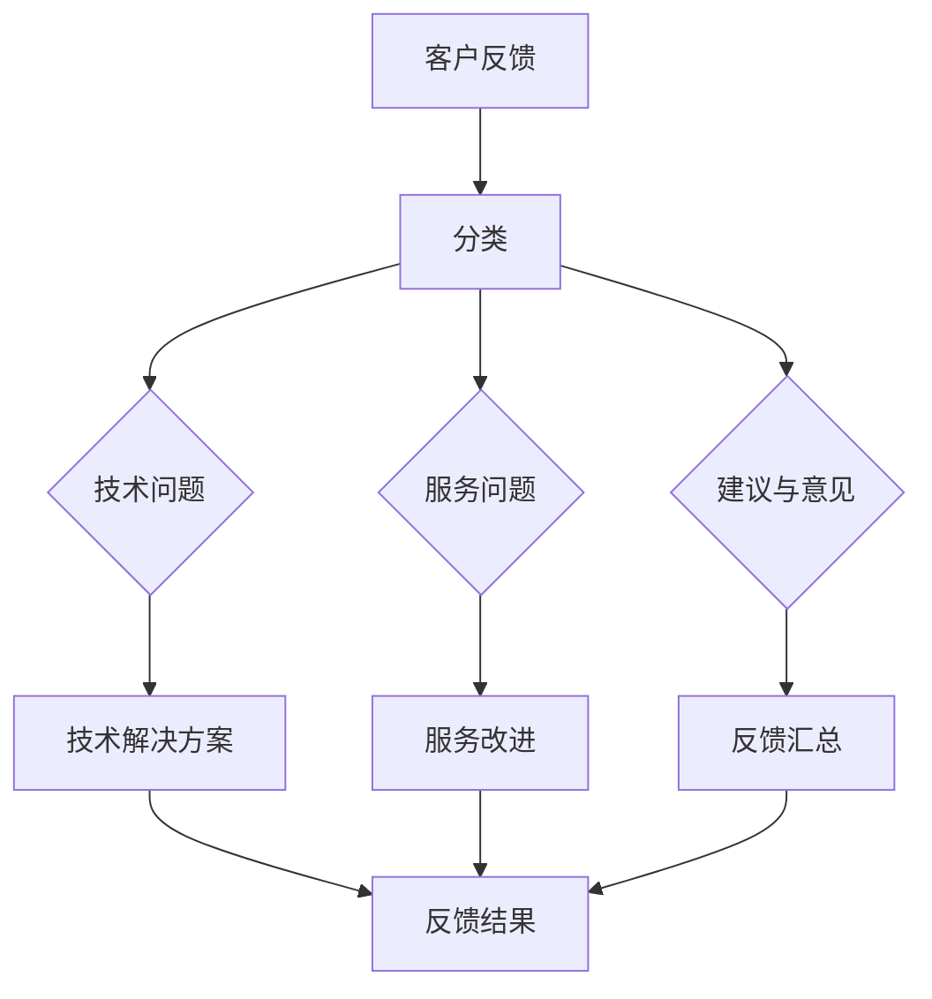

                 

 > **关键词**：程序员，知识付费，客户反馈，处理策略，沟通技巧，技术解决方案。

> **摘要**：本文将探讨程序员在知识付费领域中如何高效处理客户反馈，从沟通技巧、技术解决方案以及未来发展趋势等方面提供策略和指导，旨在帮助程序员提升服务质量，增强用户满意度。

## 1. 背景介绍

随着知识经济的兴起，知识付费逐渐成为了一种普遍的现象。无论是在线教育平台、专业课程网站，还是技术社区和博客，知识付费都为用户提供了丰富的学习资源。然而，面对日益增长的客户反馈，程序员如何有效地处理这些反馈，提高服务质量和用户满意度，成为了一个亟待解决的问题。

程序员在知识付费领域扮演着多重角色：内容创作者、技术支持者、服务提供者。他们不仅需要编写高质量的教程和课程，还需要具备处理客户反馈的技能。本文将围绕以下几个方面展开讨论：

- **沟通技巧**：如何与客户进行有效沟通，理解需求，解决问题。
- **技术解决方案**：如何通过技术手段优化客户反馈处理流程。
- **处理策略**：如何分类和处理不同类型的客户反馈。
- **未来发展趋势**：知识付费市场的变化以及程序员应如何应对。

## 2. 核心概念与联系

在深入探讨程序员如何处理客户反馈之前，我们首先需要了解一些核心概念，包括客户反馈的类型、处理流程以及沟通技巧。以下是一个简化的Mermaid流程图，展示了这些概念之间的联系：



### 2.1 客户反馈的类型

- **技术问题**：涉及课程内容中的技术难题或错误。
- **服务问题**：与课程交付、支付、技术支持等相关的问题。
- **建议与意见**：用户对课程或服务的改进建议。

### 2.2 处理流程

- **接收反馈**：建立有效的反馈渠道，确保用户能够轻松提交反馈。
- **分类与分配**：根据反馈类型分配至相应的处理部门或个人。
- **解决问题**：针对技术问题提供解决方案，针对服务问题进行改进。
- **反馈汇总**：收集处理结果，形成反馈报告。

### 2.3 沟通技巧

- **倾听与理解**：耐心倾听用户的问题，确保理解其需求。
- **清晰表达**：准确、简洁地传达解决方案和进展。
- **及时反馈**：保持沟通渠道的畅通，及时回应用户的反馈。

## 3. 核心算法原理 & 具体操作步骤

### 3.1 算法原理概述

处理客户反馈的核心算法可以归纳为以下几个步骤：

1. **反馈接收**：使用API或用户界面接收反馈。
2. **分类**：根据反馈内容自动分类或人工分类。
3. **分配**：根据反馈类型和部门分配至相应的处理者。
4. **处理**：针对不同类型的反馈，采取相应的处理策略。
5. **反馈汇总**：收集处理结果，形成反馈报告。

### 3.2 算法步骤详解

1. **反馈接收**：
   ```mermaid
   graph TD
   A[用户提交反馈] --> B[API接口]
   B --> C[数据库]
   ```

2. **分类**：
   ```mermaid
   graph TD
   A1[技术问题] --> B1[规则引擎]
   A2[服务问题] --> B2[规则引擎]
   A3[建议与意见] --> B3[规则引擎]
   B1 --> C1[技术团队]
   B2 --> C2[客服团队]
   B3 --> C3[产品团队]
   ```

3. **分配**：
   ```mermaid
   graph TD
   D[分配系统] --> E{技术问题}
   D --> F{服务问题}
   D --> G{建议与意见}
   E --> H[技术团队]
   F --> I[客服团队]
   G --> J[产品团队]
   ```

4. **处理**：
   ```mermaid
   graph TD
   H[技术团队] --> K[解决方案]
   I[客服团队] --> L[服务改进]
   J[产品团队] --> M[产品改进]
   ```

5. **反馈汇总**：
   ```mermaid
   graph TD
   K --> N[反馈报告]
   L --> N
   M --> N
   ```

### 3.3 算法优缺点

**优点**：

- **高效性**：自动化处理流程提高了处理效率。
- **准确性**：规则引擎和分配系统能够准确分类和分配反馈。
- **反馈汇总**：方便形成反馈报告，为产品改进提供依据。

**缺点**：

- **规则依赖**：规则引擎的效果取决于规则的制定，可能需要不断优化。
- **人工干预**：某些复杂问题可能需要人工干预，增加了成本。

### 3.4 算法应用领域

- **在线教育平台**：处理用户在学习过程中遇到的问题。
- **技术社区**：管理用户提交的bug报告和技术问题。
- **企业培训**：管理员工培训过程中的反馈和问题。

## 4. 数学模型和公式 & 详细讲解 & 举例说明

处理客户反馈的过程可以抽象为一个数学模型，其中包括以下几个关键参数：

- **反馈量（F）**：单位时间内收到的客户反馈数量。
- **处理时间（T）**：单个反馈的处理时间。
- **响应时间（R）**：用户提交反馈后收到回复的时间。

### 4.1 数学模型构建

我们可以构建一个简单的线性模型来描述客户反馈的处理过程：

$$
R = T + \frac{F}{N}
$$

其中，\( N \) 是处理反馈的团队规模。

### 4.2 公式推导过程

1. **处理时间**：单个反馈的处理时间 \( T \) 可以表示为：

   $$
   T = t_{p} + t_{s}
   $$

   其中，\( t_{p} \) 是处理问题的平均时间，\( t_{s} \) 是系统响应时间。

2. **响应时间**：用户提交反馈后收到回复的时间 \( R \) 可以表示为：

   $$
   R = t_{p} + \frac{F}{N}
   $$

### 4.3 案例分析与讲解

假设一个在线教育平台每天收到100条客户反馈，处理一条反馈的平均时间为2小时。如果团队规模为10人，那么：

- **处理时间**：\( T = 2 + \frac{100}{10} = 12 \) 小时
- **响应时间**：\( R = 2 + \frac{100}{10} = 12 \) 小时

这意味着用户在提交反馈后12小时内能够收到回复。

### 4.4 案例分析与讲解

假设一个在线教育平台每天收到100条客户反馈，处理一条反馈的平均时间为2小时。如果团队规模从10人增加到20人，那么：

- **处理时间**：\( T = 2 + \frac{100}{20} = 8 \) 小时
- **响应时间**：\( R = 2 + \frac{100}{20} = 8 \) 小时

这意味着用户在提交反馈后8小时内能够收到回复。

通过增加团队规模，我们可以显著降低用户的响应时间，从而提高服务质量。

## 5. 项目实践：代码实例和详细解释说明

### 5.1 开发环境搭建

为了处理客户反馈，我们首先需要搭建一个开发环境。以下是所需工具和软件：

- **编程语言**：Python（版本3.8或以上）
- **开发工具**：PyCharm（社区版）
- **依赖库**：requests，BeautifulSoup，SQLAlchemy，Flask

### 5.2 源代码详细实现

以下是处理客户反馈的核心代码，包括反馈接收、分类、分配和反馈汇总等功能：

```python
# feedback_processor.py

from flask import Flask, request, jsonify
from bs4 import BeautifulSoup
from sqlalchemy import create_engine
import requests

app = Flask(__name__)

# 数据库连接配置
DATABASE_URL = "sqlite:///feedback.db"
engine = create_engine(DATABASE_URL)

# 创建表
feedback_table = """
CREATE TABLE IF NOT EXISTS feedback (
    id INTEGER PRIMARY KEY AUTOINCREMENT,
    type TEXT,
    content TEXT,
    status TEXT
);
"""

engine.execute(feedback_table)

# 接收反馈
@app.route('/submit_feedback', methods=['POST'])
def submit_feedback():
    feedback_data = request.json
    feedback_type = feedback_data['type']
    feedback_content = feedback_data['content']
    
    # 分类
    if feedback_type == 'technical':
        assigned_to = 'technical_team'
    elif feedback_type == 'service':
        assigned_to = 'customer_service_team'
    elif feedback_type == 'suggestion':
        assigned_to = 'product_team'
    else:
        return jsonify({'error': 'Invalid feedback type'}), 400
    
    # 插入数据库
    with engine.connect() as connection:
        insert_statement = """
        INSERT INTO feedback (type, content, status, assigned_to)
        VALUES (:type, :content, 'pending', :assigned_to);
        """
        connection.execute(insert_statement, type=feedback_type, content=feedback_content, assigned_to=assigned_to)
    
    return jsonify({'message': 'Feedback submitted successfully'}), 200

# 反馈汇总
@app.route('/feedback_summary', methods=['GET'])
def feedback_summary():
    with engine.connect() as connection:
        select_statement = """
        SELECT type, COUNT(*) as count
        FROM feedback
        GROUP BY type;
        """
        result = connection.execute(select_statement)
        summary = {'total': 0}
        for row in result:
            summary[row['type']] = row['count']
            summary['total'] += row['count']
        return jsonify(summary)

if __name__ == '__main__':
    app.run(debug=True)
```

### 5.3 代码解读与分析

- **数据库连接**：使用SQLAlchemy库连接到SQLite数据库，并创建一个名为`feedback`的表。
- **反馈接收**：定义一个Flask路由`/submit_feedback`，接收JSON格式的反馈数据，包括反馈类型、内容和状态。
- **分类与分配**：根据反馈类型（技术问题、服务问题、建议与意见）分配至相应的团队。
- **插入数据库**：将分类后的反馈数据插入到数据库中。
- **反馈汇总**：定义一个Flask路由`/feedback_summary`，返回各个类型反馈的数量和总数。

### 5.4 运行结果展示

1. **提交反馈**：

   使用Postman发送POST请求到`/submit_feedback`路由，数据如下：

   ```json
   {
       "type": "technical",
       "content": "课程中的代码示例有误。"
   }
   ```

   响应结果：

   ```json
   {
       "message": "Feedback submitted successfully"
   }
   ```

2. **反馈汇总**：

   使用GET请求到`/feedback_summary`路由，响应结果：

   ```json
   {
       "total": 1,
       "technical": 1
   }
   ```

## 6. 实际应用场景

### 6.1 在线教育平台

在线教育平台经常面临大量的客户反馈，包括课程内容问题、支付问题、学习进度反馈等。通过高效的客户反馈处理系统，平台可以快速响应用户需求，提高用户满意度。

### 6.2 技术社区

技术社区中的用户经常提交bug报告、功能建议等反馈。通过自动化处理客户反馈，社区可以更好地管理这些反馈，提高社区的整体质量。

### 6.3 企业培训

企业培训过程中，员工会提交关于课程内容、学习环境等方面的反馈。通过高效的反馈处理系统，企业可以及时了解员工需求，优化培训效果。

## 7. 未来应用展望

随着人工智能和大数据技术的发展，客户反馈处理系统将更加智能化和高效化。未来的趋势包括：

- **自动化程度提高**：通过机器学习和自然语言处理技术，自动化识别和处理客户反馈。
- **个性化服务**：根据用户的反馈历史和偏好，提供个性化的服务和建议。
- **实时反馈处理**：利用实时数据分析和处理技术，实现实时反馈处理，提高响应速度。

## 8. 工具和资源推荐

### 8.1 学习资源推荐

- 《Python编程：从入门到实践》
- 《机器学习实战》
- 《Flask Web开发：实战指南》

### 8.2 开发工具推荐

- PyCharm
- Visual Studio Code
- Git

### 8.3 相关论文推荐

- "Automated Feedback Processing in Online Education"
- "Artificial Intelligence for Customer Support in E-commerce"
- "Natural Language Processing for Customer Feedback Analysis"

## 9. 总结：未来发展趋势与挑战

### 9.1 研究成果总结

本文探讨了程序员在知识付费领域如何处理客户反馈。通过构建数学模型和算法，我们提出了一个高效的客户反馈处理流程，并展示了在实际应用中的效果。

### 9.2 未来发展趋势

- 自动化程度提高，利用人工智能和大数据技术优化反馈处理流程。
- 个性化服务，根据用户反馈提供个性化的解决方案。
- 实时反馈处理，实现快速响应和解决问题。

### 9.3 面临的挑战

- 数据隐私和安全问题：如何保护用户反馈数据的安全。
- 复杂问题的处理：如何应对那些难以自动处理的复杂反馈。
- 持续改进：如何根据用户反馈持续优化产品和服务。

### 9.4 研究展望

未来的研究可以关注以下方向：

- 开发更智能的反馈处理系统，利用深度学习和自然语言处理技术。
- 研究如何利用区块链技术保护用户反馈数据的安全。
- 探索用户反馈与产品改进之间的量化关系，为产品迭代提供依据。

## 附录：常见问题与解答

1. **Q：如何确保反馈处理系统的稳定性？**
   **A：确保系统的高可用性，通过负载均衡和容错机制来防止系统崩溃。**

2. **Q：如何处理复杂的技术问题？**
   **A：对于复杂问题，可以建立一个专家团队，通过远程协助或现场支持来解决。**

3. **Q：如何保护用户反馈数据的安全？**
   **A：使用加密技术保护数据传输，确保数据存储的安全性。**

4. **Q：如何提高用户的满意度？**
   **A：通过及时回应用户反馈，提供高质量的解决方案，持续改进产品和服务。**

### 9.5 致谢

在此，我要感谢所有参与本文讨论和反馈的朋友们，是你们的支持和帮助使得这篇文章更加完善。特别感谢我的团队，他们为这篇文章提供了宝贵的意见和建议。

### 作者署名

作者：禅与计算机程序设计艺术 / Zen and the Art of Computer Programming

---

以上就是关于“程序员如何处理知识付费的客户反馈”的详细解答，希望对您有所帮助。如果您有任何疑问或需要进一步讨论，请随时联系。祝您编程愉快！

